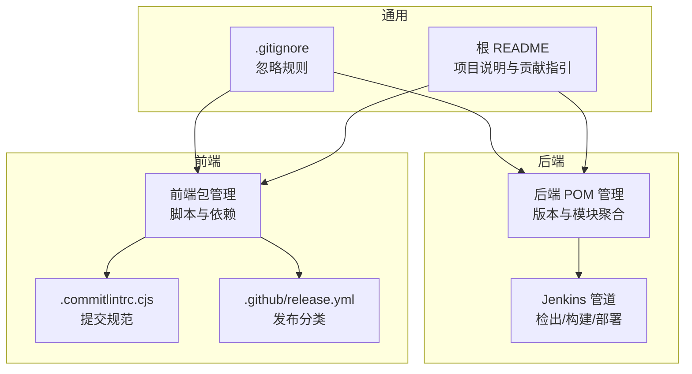
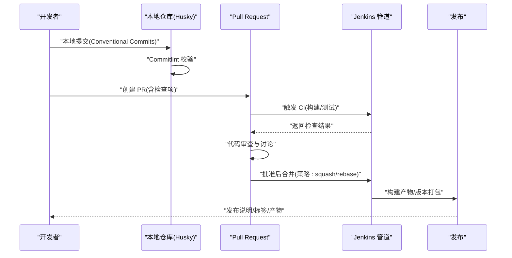
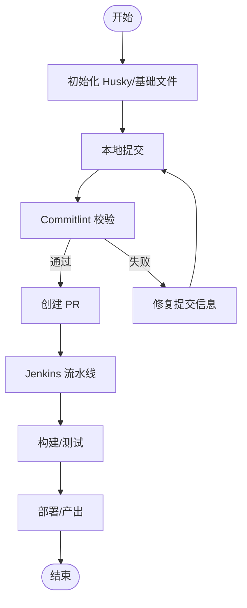
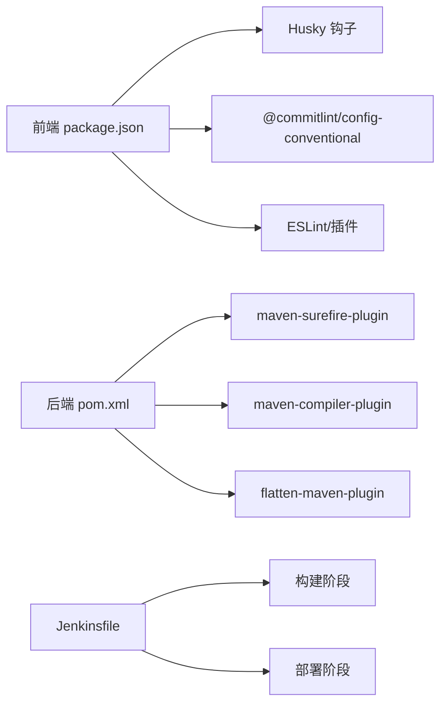

# Git 工作流规范

<cite>
**本文引用的文件**
- [README.md](file://README.md)
- [backend/script/jenkins/Jenkinsfile](file://backend/script/jenkins/Jenkinsfile)
- [frontend/admin-uniapp/package.json](file://frontend/admin-uniapp/package.json)
- [.gitignore](file://.gitignore)
- [backend/pom.xml](file://backend/pom.xml)
- [frontend/admin-uniapp/.github/release.yml](file://frontend/admin-uniapp/.github/release.yml)
- [frontend/admin-uniapp/.commitlintrc.cjs](file://frontend/admin-uniapp/.commitlintrc.cjs)
</cite>

## 目录
1. [简介](#简介)
2. [项目结构](#项目结构)
3. [核心组件](#核心组件)
4. [架构总览](#架构总览)
5. [详细组件分析](#详细组件分析)
6. [依赖分析](#依赖分析)
7. [性能考虑](#性能考虑)
8. [故障排查指南](#故障排查指南)
9. [结论](#结论)
10. [附录](#附录)

## 简介
本文件旨在为 AgenticCPS 项目建立一套标准化的 Git 工作流规范，覆盖分支管理策略、提交信息格式、代码审查流程、Pull Request 模板与合并策略、冲突解决流程、版本标签与发布流程、Git 钩子与自动化检查、持续集成集成、大文件处理、历史记录清理与仓库维护最佳实践，以及团队协作规范、权限与安全策略。该规范以仓库现有配置为基础，结合前端 Husky/Commitlint、后端 Jenkins 管道与 Maven 版本管理，形成可执行、可审计、可持续的工作流。

## 项目结构
AgenticCPS 为多模块工程，包含后端 Java 与前端 UniApp/Vue3 两大主体，辅以文档、脚本与 SQL 脚本资源。整体采用集中式 Git 管理，分支策略围绕主分支保护、功能分支与发布分支展开；前端通过 Husky/Commitlint 强化提交规范；后端通过 Jenkins 实现 CI/CD。

**图表来源**
- [backend/pom.xml:10-25](file://backend/pom.xml#L10-L25)
- [backend/script/jenkins/Jenkinsfile:1-61](file://backend/script/jenkins/Jenkinsfile#L1-L61)
- [frontend/admin-uniapp/package.json:29-98](file://frontend/admin-uniapp/package.json#L29-L98)
- [frontend/admin-uniapp/.commitlintrc.cjs:1-3](file://frontend/admin-uniapp/.commitlintrc.cjs#L1-L3)
- [frontend/admin-uniapp/.github/release.yml:1-32](file://frontend/admin-uniapp/.github/release.yml#L1-L32)
- [.gitignore:1-6](file://.gitignore#L1-L6)
- [README.md:1-523](file://README.md#L1-L523)

**章节来源**
- [README.md:1-523](file://README.md#L1-L523)
- [.gitignore:1-6](file://.gitignore#L1-L6)
- [backend/pom.xml:10-25](file://backend/pom.xml#L10-L25)
- [backend/script/jenkins/Jenkinsfile:1-61](file://backend/script/jenkins/Jenkinsfile#L1-L61)
- [frontend/admin-uniapp/package.json:29-98](file://frontend/admin-uniapp/package.json#L29-L98)
- [frontend/admin-uniapp/.commitlintrc.cjs:1-3](file://frontend/admin-uniapp/.commitlintrc.cjs#L1-L3)
- [frontend/admin-uniapp/.github/release.yml:1-32](file://frontend/admin-uniapp/.github/release.yml#L1-L32)

## 核心组件
- 分支与版本管理
  - 主分支保护：禁止直接推送，强制通过 Pull Request 合并。
  - 功能分支：以功能/任务编号命名，开发完成后经代码审查合并。
  - 发布分支：用于发布前的最终验证与紧急热修复。
  - 标签策略：以语义化版本打标签，配合发布说明。
- 提交信息规范
  - 使用 Conventional Commits，涵盖 feat、fix、docs、style、refactor、test、chore 等类型。
  - 借助 Commitlint 与 Husky 在本地强制校验。
- 代码审查与合并
  - PR 必须通过 CI 检查与至少一名维护者批准。
  - 合并策略：squash 合并以保持主分支整洁；rebase 以保证线性历史。
- 自动化与 CI/CD
  - 前端：Husky + Commitlint + lint-staged；发布分类由 release.yml 管理。
  - 后端：Jenkins 管道负责检出、构建与部署；Maven 管理版本与依赖。
- 冲突解决与发布
  - 冲突优先 rebase 解决；必要时创建临时分支隔离变更。
  - 发布前统一版本号、生成发布说明、打标签并推送。

**章节来源**
- [frontend/admin-uniapp/package.json:129-176](file://frontend/admin-uniapp/package.json#L129-L176)
- [frontend/admin-uniapp/.commitlintrc.cjs:1-3](file://frontend/admin-uniapp/.commitlintrc.cjs#L1-L3)
- [frontend/admin-uniapp/.github/release.yml:1-32](file://frontend/admin-uniapp/.github/release.yml#L1-L32)
- [backend/script/jenkins/Jenkinsfile:1-61](file://backend/script/jenkins/Jenkinsfile#L1-L61)
- [backend/pom.xml:31-45](file://backend/pom.xml#L31-L45)

## 架构总览
下图展示了从本地开发到 CI/CD 发布的关键流程，包括提交规范、代码审查、自动化检查与发布。

**图表来源**
- [frontend/admin-uniapp/package.json:92-98](file://frontend/admin-uniapp/package.json#L92-L98)
- [frontend/admin-uniapp/.commitlintrc.cjs:1-3](file://frontend/admin-uniapp/.commitlintrc.cjs#L1-L3)
- [backend/script/jenkins/Jenkinsfile:29-59](file://backend/script/jenkins/Jenkinsfile#L29-L59)

## 详细组件分析

### 分支管理策略
- 主分支保护
  - 禁止直接推送主分支；必须通过受保护的 PR 合并。
  - 强制 CI 检查通过与审查批准。
- 功能分支
  - 命名建议：feature/任务编号/简述；变更尽量小而聚焦。
  - 合并与清理：合并后删除功能分支，避免分支冗余。
- 发布分支
  - 用于发布前的最终验证与热修复；完成后合并回主分支并打标签。
- 标签与版本
  - 使用语义化版本；发布前统一修订版本号并在主分支打标签。

**章节来源**
- [backend/pom.xml:31-45](file://backend/pom.xml#L31-L45)
- [frontend/admin-uniapp/.github/release.yml:1-32](file://frontend/admin-uniapp/.github/release.yml#L1-L32)

### 提交信息格式规范
- 类型与范围
  - feat：新功能
  - fix：缺陷修复
  - docs：仅文档变更
  - style：不影响代码含义的更改（空格、格式等）
  - refactor：既不修复错误也不新增功能的代码重构
  - test：增加或修改测试
  - chore：构建过程或辅助工具的变动
- 规范来源
  - 使用 Conventional Commits；通过 Commitlint 与 Husky 强制执行。
- 本地执行
  - 通过 npm/pnpm 脚本初始化 Husky 并执行 lint-staged。

**章节来源**
- [frontend/admin-uniapp/.commitlintrc.cjs:1-3](file://frontend/admin-uniapp/.commitlintrc.cjs#L1-L3)
- [frontend/admin-uniapp/package.json:92-98](file://frontend/admin-uniapp/package.json#L92-L98)
- [frontend/admin-uniapp/package.json:190-192](file://frontend/admin-uniapp/package.json#L190-L192)

### 代码审查流程、PR 模板与合并策略
- PR 模板
  - 建议在 .github/ISSUE_TEMPLATE 中补充 PR 模板，包含变更摘要、影响范围、测试要点、风险评估与回滚预案。
- 审查流程
  - 至少一名维护者批准；CI 通过；避免“完美”阻塞，鼓励小步快跑。
- 合并策略
  - squash 合并：保持主分支整洁；rebase 合并：保持线性历史。
  - 合并后删除功能分支。

**章节来源**
- [README.md:486-509](file://README.md#L486-L509)

### 冲突解决流程
- 优先 rebase：在功能分支上 rebase 主分支，减少合并复杂度。
- 临时隔离：必要时创建 hotfix 分支，修复后再合并回主分支。
- 冲突标记：使用标准冲突标记，逐段审阅与修正。
- 回归测试：冲突解决后重新运行相关测试。

**章节来源**
- [backend/script/jenkins/Jenkinsfile:49-59](file://backend/script/jenkins/Jenkinsfile#L49-L59)

### 版本标签与发布流程
- 版本管理
  - 后端通过 Maven 版本属性统一管理；前端通过 package.json 管理版本与依赖。
- 发布分类
  - 使用 release.yml 定义发布类别与标签映射，便于生成发布说明。
- 发布步骤
  - 统一修订版本号 → 生成发布说明 → 打标签 → 推送标签 → 触发 CI 构建 → 产出发布制品。

**章节来源**
- [backend/pom.xml:31-45](file://backend/pom.xml#L31-L45)
- [frontend/admin-uniapp/.github/release.yml:1-32](file://frontend/admin-uniapp/.github/release.yml#L1-L32)
- [frontend/admin-uniapp/package.json:4-8](file://frontend/admin-uniapp/package.json#L4-L8)

### Git 钩子、自动化检查与 CI/CD
- 前端
  - Husky：初始化 Git 钩子；Commitlint：校验提交信息；lint-staged：仅对暂存文件执行 ESLint 修复。
- 后端
  - Jenkins：定义流水线阶段（检出、构建、部署），支持参数化触发与凭证管理。
- 本地准备
  - 通过 prepare 脚本初始化 Husky 与基础文件。

**图表来源**
- [frontend/admin-uniapp/package.json:92-98](file://frontend/admin-uniapp/package.json#L92-L98)
- [frontend/admin-uniapp/.commitlintrc.cjs:1-3](file://frontend/admin-uniapp/.commitlintrc.cjs#L1-L3)
- [backend/script/jenkins/Jenkinsfile:29-59](file://backend/script/jenkins/Jenkinsfile#L29-L59)

**章节来源**
- [frontend/admin-uniapp/package.json:92-98](file://frontend/admin-uniapp/package.json#L92-L98)
- [frontend/admin-uniapp/.commitlintrc.cjs:1-3](file://frontend/admin-uniapp/.commitlintrc.cjs#L1-L3)
- [backend/script/jenkins/Jenkinsfile:1-61](file://backend/script/jenkins/Jenkinsfile#L1-L61)

### 大文件处理、历史记录清理与仓库维护
- 大文件
  - 使用 LFS 或外部存储；避免将二进制大文件纳入 Git。
- 历史记录
  - 不要重写已推送的历史；如需清理敏感信息，使用交互式 rebase 或 git filter-branch 并通知协作者。
- 仓库维护
  - 定期清理失效分支与标签；保持 .gitignore 最小化且有效；统一依赖版本与构建脚本。

**章节来源**
- [.gitignore:1-6](file://.gitignore#L1-L6)

### 团队协作规范、权限管理与安全策略
- 权限
  - 主分支受保护，仅授权维护者可合并；普通成员通过 PR 贡献。
- 安全
  - 凭证与密钥通过 CI 凭证管理；避免在提交信息或代码中泄露。
- 协作
  - 明确角色与职责；遵循 PR 模板与审查流程；及时响应与沟通。

**章节来源**
- [backend/script/jenkins/Jenkinsfile:10-27](file://backend/script/jenkins/Jenkinsfile#L10-L27)
- [README.md:486-509](file://README.md#L486-L509)

## 依赖分析
- 前端依赖
  - Husky、lint-staged、@commitlint/*：本地钩子与提交规范。
  - eslint、@unocss/eslint-plugin：代码风格与静态检查。
- 后端依赖
  - Maven Surefire 插件：单元测试；Compiler 插件：注解处理器与参数名；flatten 插件：版本扁平化。
- CI 依赖
  - Jenkins 管道：检出、构建、部署阶段；参数化触发与凭证。

**图表来源**
- [frontend/admin-uniapp/package.json:129-176](file://frontend/admin-uniapp/package.json#L129-L176)
- [frontend/admin-uniapp/.commitlintrc.cjs:1-3](file://frontend/admin-uniapp/.commitlintrc.cjs#L1-L3)
- [backend/pom.xml:62-112](file://backend/pom.xml#L62-L112)
- [backend/script/jenkins/Jenkinsfile:29-59](file://backend/script/jenkins/Jenkinsfile#L29-L59)

**章节来源**
- [frontend/admin-uniapp/package.json:129-176](file://frontend/admin-uniapp/package.json#L129-L176)
- [backend/pom.xml:62-112](file://backend/pom.xml#L62-L112)
- [backend/script/jenkins/Jenkinsfile:29-59](file://backend/script/jenkins/Jenkinsfile#L29-L59)

## 性能考虑
- 分支数量控制：避免过多长期存在分支导致检出与合并成本上升。
- CI 并行化：将测试拆分为并行任务，缩短流水线时间。
- 依赖缓存：利用 Maven/Node 缓存与镜像源，提升构建速度。
- 提交粒度：小步提交、清晰描述，降低审查与回滚成本。

## 故障排查指南
- 提交被拒绝
  - 检查提交信息是否符合 Conventional Commits；确认 Commitlint 与 Husky 已正确安装。
- CI 失败
  - 查看流水线日志定位失败阶段；确保本地已执行 lint 与测试；核对凭证与网络。
- 合并冲突
  - 在功能分支上 rebase 主分支；逐段解决冲突并验证测试通过。
- 版本不一致
  - 后端检查 pom.xml 版本属性；前端检查 package.json 版本与 yudao-version。

**章节来源**
- [frontend/admin-uniapp/.commitlintrc.cjs:1-3](file://frontend/admin-uniapp/.commitlintrc.cjs#L1-L3)
- [backend/script/jenkins/Jenkinsfile:29-59](file://backend/script/jenkins/Jenkinsfile#L29-L59)
- [backend/pom.xml:31-45](file://backend/pom.xml#L31-L45)
- [frontend/admin-uniapp/package.json:4-8](file://frontend/admin-uniapp/package.json#L4-L8)

## 结论
通过统一的分支策略、提交规范、代码审查与 CI/CD 流程，AgenticCPS 可实现高效、可审计、可扩展的协作开发。建议在现有基础上补充 PR 模板、完善发布说明与权限策略，并持续优化 CI 并行化与依赖缓存，以进一步提升团队效率与发布质量。

## 附录
- 常用命令
  - 初始化 Husky：执行 prepare 脚本
  - 本地提交：遵循 Conventional Commits
  - 触发 CI：推送分支并创建 PR
  - 打标签：在主分支上打语义化版本标签
- 参考资料
  - Conventional Commits：https://www.conventionalcommits.org/
  - Commitlint：https://commitlint.js.org/
  - Husky：https://typicode.github.io/husky/