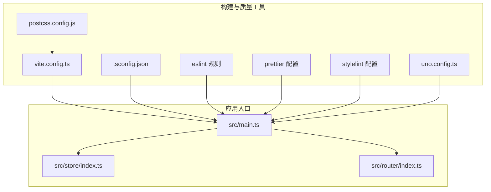
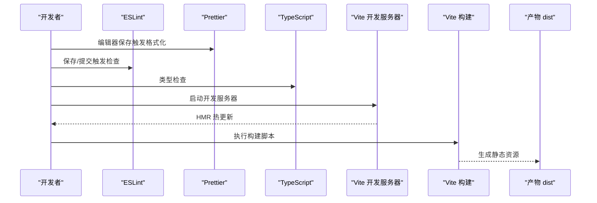
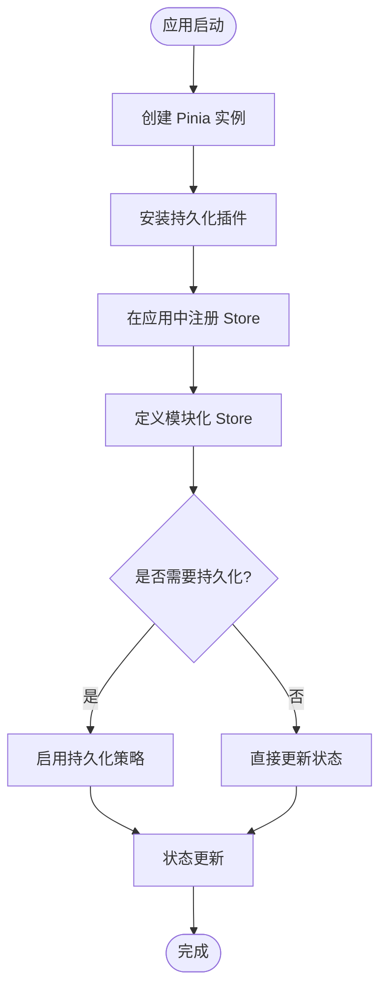
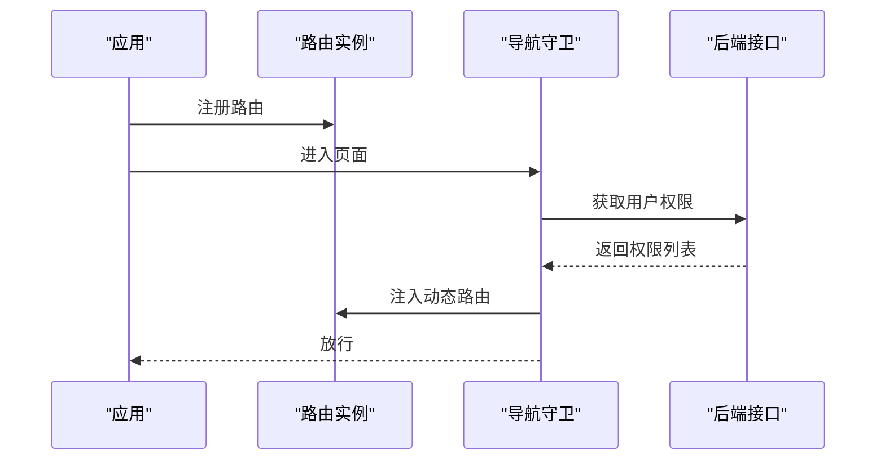
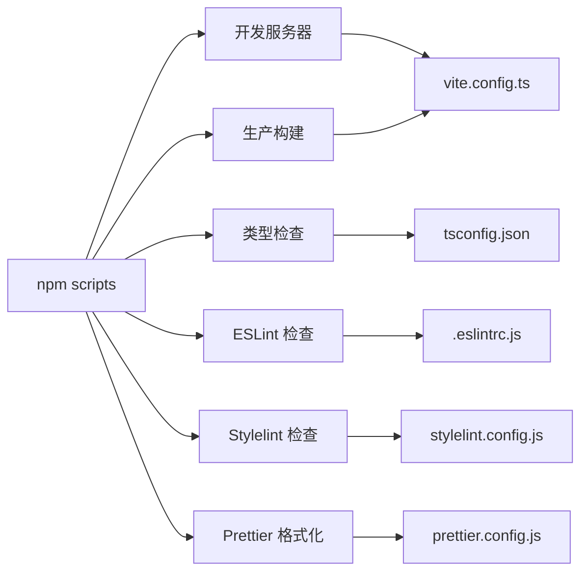

# 前端 TypeScript 开发规范

<cite>
**本文引用的文件**
- [.eslintrc.js](file://frontend/admin-vue3/.eslintrc.js)
- [prettier.config.js](file://frontend/admin-vue3/prettier.config.js)
- [tsconfig.json](file://frontend/admin-vue3/tsconfig.json)
- [vite.config.ts](file://frontend/admin-vue3/vite.config.ts)
- [stylelint.config.js](file://frontend/admin-vue3/stylelint.config.js)
- [package.json](file://frontend/admin-vue3/package.json)
- [postcss.config.js](file://frontend/admin-vue3/postcss.config.js)
- [uno.config.ts](file://frontend/admin-vue3/uno.config.ts)
- [src/store/index.ts](file://frontend/admin-vue3/src/store/index.ts)
- [src/router/index.ts](file://frontend/admin-vue3/src/router/index.ts)
</cite>

## 目录
1. [简介](#简介)
2. [项目结构](#项目结构)
3. [核心组件](#核心组件)
4. [架构总览](#架构总览)
5. [详细组件分析](#详细组件分析)
6. [依赖关系分析](#依赖关系分析)
7. [性能考虑](#性能考虑)
8. [故障排查指南](#故障排查指南)
9. [结论](#结论)
10. [附录](#附录)

## 简介
本规范面向 Vue 3 + TypeScript 前端工程，覆盖代码风格、命名约定、ESLint/Prettier/TypeScript 编译配置、Vue 组件开发与 Props/事件规范、Pinia 状态管理模块化与持久化、路由配置与权限控制、API 调用与拦截器、UI 组件库与样式编写、移动端适配与性能优化等。目标是统一团队开发体验，提升可维护性与一致性。

## 项目结构
- 工程采用 Vite + Vue 3 + TypeScript 技术栈，使用 UnoCSS 提供原子化样式能力，配合 Element Plus 组件库与 Pinia 状态管理。
- 关键配置集中在根目录的构建与质量工具配置文件中，便于集中治理与扩展。

图表来源
- [vite.config.ts:1-89](file://frontend/admin-vue3/vite.config.ts#L1-L89)
- [tsconfig.json:1-44](file://frontend/admin-vue3/tsconfig.json#L1-L44)
- [.eslintrc.js:1-76](file://frontend/admin-vue3/.eslintrc.js#L1-L76)
- [prettier.config.js:1-23](file://frontend/admin-vue3/prettier.config.js#L1-L23)
- [stylelint.config.js:1-236](file://frontend/admin-vue3/stylelint.config.js#L1-L236)
- [uno.config.ts:1-108](file://frontend/admin-vue3/uno.config.ts#L1-L108)
- [postcss.config.js:1-6](file://frontend/admin-vue3/postcss.config.js#L1-L6)
- [src/store/index.ts:1-13](file://frontend/admin-vue3/src/store/index.ts#L1-L13)
- [src/router/index.ts:1-37](file://frontend/admin-vue3/src/router/index.ts#L1-L37)

章节来源
- [package.json:1-160](file://frontend/admin-vue3/package.json#L1-L160)

## 核心组件
- ESLint 配置：基于 Vue 3 推荐规则、TypeScript 推荐规则、Prettier 集成与 UnoCSS 插件，部分规则按团队习惯放宽或关闭，以平衡约束与效率。
- Prettier 配置：统一缩进、引号、尾逗号、换行策略等，支持 Vue 文件脚本与样式缩进控制。
- TypeScript 编译：启用严格模式、ESNext 目标、DOM 库、路径别名、类型声明扫描范围等。
- 构建与打包：Vite 服务器、代理（已注释）、依赖预构建、生产压缩与分包策略、SCSS 全局注入。
- 样式与原子化：PostCSS 自动前缀、Stylelint 规则集、UnoCSS 原子化与自定义规则/快捷方式。
- 状态管理：Pinia 初始化与持久化插件集成。
- 路由：History 模式、滚动行为重置、动态路由重置白名单。

章节来源
- [.eslintrc.js:1-76](file://frontend/admin-vue3/.eslintrc.js#L1-L76)
- [prettier.config.js:1-23](file://frontend/admin-vue3/prettier.config.js#L1-L23)
- [tsconfig.json:1-44](file://frontend/admin-vue3/tsconfig.json#L1-L44)
- [vite.config.ts:1-89](file://frontend/admin-vue3/vite.config.ts#L1-L89)
- [stylelint.config.js:1-236](file://frontend/admin-vue3/stylelint.config.js#L1-L236)
- [uno.config.ts:1-108](file://frontend/admin-vue3/uno.config.ts#L1-L108)
- [postcss.config.js:1-6](file://frontend/admin-vue3/postcss.config.js#L1-L6)
- [src/store/index.ts:1-13](file://frontend/admin-vue3/src/store/index.ts#L1-L13)
- [src/router/index.ts:1-37](file://frontend/admin-vue3/src/router/index.ts#L1-L37)

## 架构总览
下图展示从开发到构建的关键流程与工具链交互：

图表来源
- [package.json:7-26](file://frontend/admin-vue3/package.json#L7-L26)
- [vite.config.ts:15-89](file://frontend/admin-vue3/vite.config.ts#L15-L89)
- [tsconfig.json:1-44](file://frontend/admin-vue3/tsconfig.json#L1-L44)
- [.eslintrc.js:20-26](file://frontend/admin-vue3/.eslintrc.js#L20-L26)
- [prettier.config.js:1-23](file://frontend/admin-vue3/prettier.config.js#L1-L23)

## 详细组件分析

### ESLint 配置与规则
- 解析器与环境：Vue 3 ESLint 解析器、TypeScript 解析器、浏览器/Node/ES6 环境。
- 扩展规则集：Vue 3 推荐、TypeScript 推荐、Prettier 集成、UnoCSS 插件。
- 关键放宽项：
  - 关闭 setup props 解构报错、script-setup 变量使用检查。
  - 放宽未使用变量、ban-ts-comment、ban-types、非空断言等规则。
  - 关闭多词组件名强制、HTML 自闭合策略、Prettier 与 UnoCSS 顺序提示等。
- 目的：在保证核心质量的同时，降低对日常开发效率的影响。

章节来源
- [.eslintrc.js:1-76](file://frontend/admin-vue3/.eslintrc.js#L1-L76)

### Prettier 格式化设置
- 行宽、缩进、分号、单引号、尾逗号、箭头函数括号、HTML 敏感度等。
- Vue 文件脚本与样式缩进控制，避免与 ESLint 冲突。
- 与 IDE 插件协同，建议在编辑器中启用 Prettier 自动格式化。

章节来源
- [prettier.config.js:1-23](file://frontend/admin-vue3/prettier.config.js#L1-L23)

### TypeScript 编译选项
- 目标与模块：ESNext、Node 解析、严格模式。
- JSX 保留、Source Map、JSON 模块、ES 合法导入、DOM 库。
- 路径别名、类型声明扫描范围、跳过库检查、装饰器实验特性。
- include/exclude 范围明确，避免无关文件参与编译。

章节来源
- [tsconfig.json:1-44](file://frontend/admin-vue3/tsconfig.json#L1-L44)

### Vite 构建与开发配置
- 服务器：端口、主机、自动打开、代理（当前注释）。
- 插件：通过独立模块管理，便于扩展与维护。
- CSS：SCSS 全局变量注入、兼容性与弃用警告抑制。
- 别名：@/ 指向 src，Vue i18n 指向具体 CJS 版本。
- 构建：压缩器、输出目录、SourceMap、调试器/控制台清理、手动分包（如 ECharts、表单设计器等）。
- 依赖优化：预构建 include/exclude 列表。

章节来源
- [vite.config.ts:1-89](file://frontend/admin-vue3/vite.config.ts#L1-L89)

### Stylelint 样式规范
- 基于 Standard 配置，忽略部分特定错误与降级场景。
- Vue/HTML 中的类名与伪元素模式放宽，支持深度选择器语法。
- 属性顺序与层级顺序规则，结合 UnoCSS 使用建议统一风格。

章节来源
- [stylelint.config.js:1-236](file://frontend/admin-vue3/stylelint.config.js#L1-L236)

### UnoCSS 原子化样式
- 预设：Uno 预设、暗色模式、属性化开关。
- 自定义规则：布局边框、悬停效果等。
- 快捷方式：常用组合类简化书写。

章节来源
- [uno.config.ts:1-108](file://frontend/admin-vue3/uno.config.ts#L1-L108)

### PostCSS 与自动前缀
- 自动添加浏览器前缀，减少兼容性问题。

章节来源
- [postcss.config.js:1-6](file://frontend/admin-vue3/postcss.config.js#L1-L6)

### Vue 组件开发规范（通用）
- 命名：组件文件与导出名称遵循 PascalCase；目录与文件名使用 kebab-case。
- Props 类型：使用 TypeScript 明确类型，避免 any；必要时提供默认值与验证。
- Emits：显式声明事件名与载荷类型，保持事件契约稳定。
- Slots：具名插槽优先，避免作用域插槽滥用。
- 生命周期：尽量使用 Composition API；避免在模板中直接调用方法。
- 样式：优先使用原子类（UnoCSS），其次 SCSS 变量与局部作用域。

（本节为通用规范说明，不直接分析具体文件）

### Props 类型定义与事件处理最佳实践
- Props：使用 defineProps 定义，必要时使用 withDefaults 设置默认值；避免解构 props，除非明确需要。
- Emits：使用 defineEmits 明确定义事件签名；事件名使用 kebab-case，避免大小写敏感问题。
- 事件处理：在模板中绑定事件时，确保参数类型一致；在方法中处理异步逻辑时注意取消与防抖。

（本节为通用规范说明，不直接分析具体文件）

### Pinia 状态管理规范
- Store 初始化：在应用启动时注册 Pinia，并启用持久化插件。
- 模块组织：按功能域拆分 Store，每个模块职责单一；避免跨模块耦合。
- 状态更新：使用严格模式下的不可变更新；批量更新使用事务式方法或组合式 API。
- 持久化：仅对必要状态开启持久化，避免存储大对象；注意序列化/反序列化兼容性。
- 访问方式：在组件中通过组合式 API 访问 Store，避免直接操作全局状态。

图表来源
- [src/store/index.ts:1-13](file://frontend/admin-vue3/src/store/index.ts#L1-L13)

章节来源
- [src/store/index.ts:1-13](file://frontend/admin-vue3/src/store/index.ts#L1-L13)

### 路由配置规范与权限控制
- 路由模式：History 模式，基础路径来自环境变量。
- 动态路由：将剩余路由集中管理，支持运行时挂载。
- 滚动行为：新标签页或返回时滚动至顶部，提升用户体验。
- 权限控制：提供路由重置函数，白名单内路由不可移除；结合后端权限下发动态注入路由。

图表来源
- [src/router/index.ts:1-37](file://frontend/admin-vue3/src/router/index.ts#L1-L37)

章节来源
- [src/router/index.ts:1-37](file://frontend/admin-vue3/src/router/index.ts#L1-L37)

### API 接口调用规范与拦截器
- 请求库：Axios；建议统一封装请求/响应拦截器。
- 拦截器：统一设置 Token、超时、错误处理；避免在业务代码中重复处理。
- 错误处理：区分业务错误与网络错误；统一弹窗/日志上报；支持重试与降级。
- 并发控制：合理使用并发限制与请求去重，避免重复请求。
- 类型安全：接口返回值使用 TypeScript 泛型约束，确保调用方类型正确。

（本节为通用规范说明，不直接分析具体文件）

### 组件库使用规范与 UI 组件封装
- 组件库：Element Plus；按需引入与自动导入结合，减少体积。
- 封装原则：高内聚、低耦合；对外暴露稳定 API；内部实现可演进。
- 主题与样式：统一使用 SCSS 变量与 UnoCSS 原子类；避免内联样式的滥用。
- 可访问性：按钮、表单、对话框等组件需具备键盘可达与语义化标签。

（本节为通用规范说明，不直接分析具体文件）

### 移动端适配与响应式设计
- 布局：Flex/Grid 布局优先；避免固定像素；使用相对单位（rem/vw/em/%）。
- 触摸：点击延迟、滑动惯性、手势识别；合理设置触摸目标尺寸。
- 性能：懒加载、图片压缩、字体子集化；减少主线程阻塞。
- 兼容：PostCSS 自动前缀；媒体查询与断点统一管理。

（本节为通用规范说明，不直接分析具体文件）

## 依赖关系分析
- 开发脚本：统一通过 npm scripts 管理，包括开发、构建、预览、类型检查、代码质量检查等。
- 依赖生态：Vue 3、TypeScript、Vite、Element Plus、Pinia、UnoCSS、Axios 等。
- 工具链：ESLint、Prettier、Stylelint、UnoCSS 插件、Vite 插件生态。

图表来源
- [package.json:7-26](file://frontend/admin-vue3/package.json#L7-L26)
- [vite.config.ts:15-89](file://frontend/admin-vue3/vite.config.ts#L15-L89)
- [tsconfig.json:1-44](file://frontend/admin-vue3/tsconfig.json#L1-L44)
- [.eslintrc.js:20-26](file://frontend/admin-vue3/.eslintrc.js#L20-L26)
- [stylelint.config.js:1-236](file://frontend/admin-vue3/stylelint.config.js#L1-L236)
- [prettier.config.js:1-23](file://frontend/admin-vue3/prettier.config.js#L1-L23)

章节来源
- [package.json:1-160](file://frontend/admin-vue3/package.json#L1-L160)

## 性能考虑
- 依赖分包：手动拆分大体积库（如 ECharts、表单设计器），减少首屏体积。
- 生产优化：压缩器配置、去除 debugger/console、SourceMap 控制。
- 依赖预构建：优化冷启动与二次启动速度。
- 样式优化：原子类优先、SCSS 变量复用、避免深层嵌套导致的选择器膨胀。
- 图片与资源：按需加载、懒加载、CDN 与缓存策略。

章节来源
- [vite.config.ts:65-84](file://frontend/admin-vue3/vite.config.ts#L65-L84)

## 故障排查指南
- ESLint 规则冲突：若与 Prettier 或 UnoCSS 冲突，确认规则关闭项与插件顺序；必要时在编辑器中禁用对应 ESLint 规则。
- TypeScript 报错：检查 tsconfig include/exclude 范围与类型声明文件；使用类型检查脚本定位问题。
- 样式异常：确认 Stylelint 规则与 Vue/HTML 深度选择器支持；检查 UnoCSS 规则与快捷方式。
- 构建失败：查看构建日志与压缩器配置；确认环境变量与输出目录设置。
- 路由问题：核对路由历史模式与基础路径；检查动态路由注入与白名单。

章节来源
- [.eslintrc.js:27-74](file://frontend/admin-vue3/.eslintrc.js#L27-L74)
- [stylelint.config.js:212-235](file://frontend/admin-vue3/stylelint.config.js#L212-L235)
- [uno.config.ts:104-107](file://frontend/admin-vue3/uno.config.ts#L104-L107)
- [vite.config.ts:24-86](file://frontend/admin-vue3/vite.config.ts#L24-L86)
- [src/router/index.ts:7-30](file://frontend/admin-vue3/src/router/index.ts#L7-L30)

## 结论
本规范以 Vite + Vue 3 + TypeScript 为核心，结合 ESLint、Prettier、Stylelint、UnoCSS 与 Pinia，形成从开发到构建的一体化质量保障体系。建议团队在日常开发中严格遵循命名与类型约束、组件与状态管理规范，持续优化构建与性能，确保项目长期可维护性与可扩展性。

## 附录
- 常用脚本
  - 开发：使用开发模式启动本地服务。
  - 构建：按环境构建产物，支持多环境。
  - 预览：本地预览构建结果。
  - 类型检查：仅检查不输出。
  - 代码质量：统一执行 ESLint、Prettier、Stylelint 检查与修复。

章节来源
- [package.json:7-26](file://frontend/admin-vue3/package.json#L7-L26)