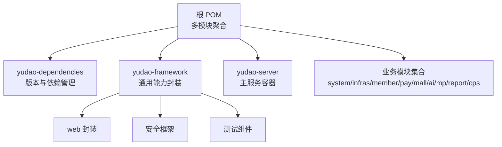
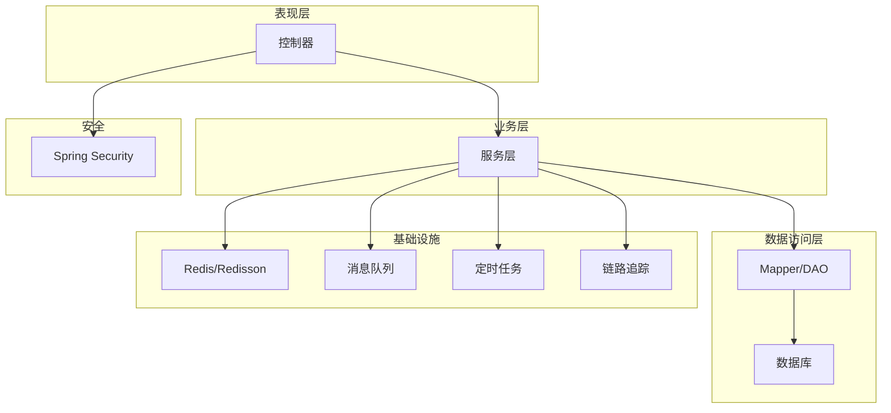
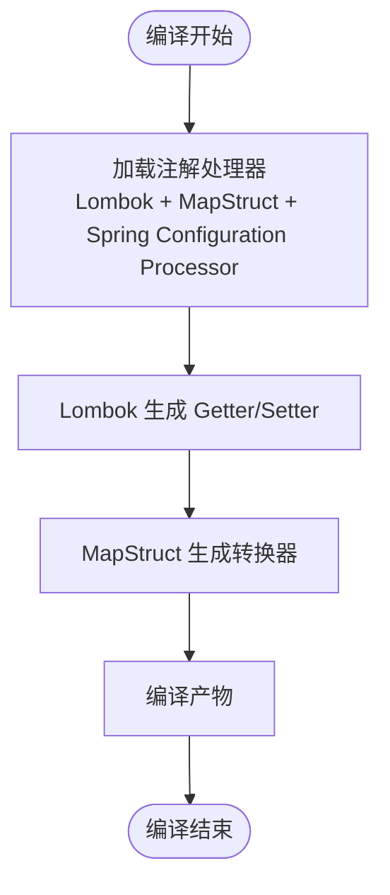
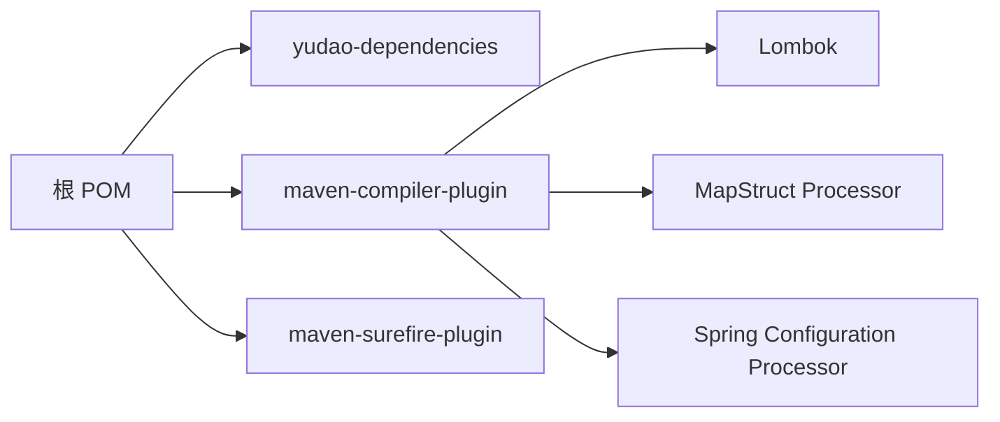

# 后端 Java 开发规范

<cite>
**本文引用的文件**
- [lombok.config](file://backend/lombok.config)
- [pom.xml](file://backend/pom.xml)
- [README.md](file://backend/README.md)
- [CpsErrorCodeConstants.java](file://backend/yudao-module-cps/yudao-module-cps-api/src/main/java/cn/iocoder/yudao/module/cps/enums/CpsErrorCodeConstants.java)
- [ErrorCodeConstants.java](file://backend/yudao-module-member/src/main/java/cn/iocoder/yudao/module/member/enums/ErrorCodeConstants.java)
- [package-info.java（测试组件）](file://backend/yudao-framework/yudao-spring-boot-starter-test/src/main/java/cn/iocoder/yudao/framework/test/package-info.java)
- [package-info.java（Web封装）](file://backend/yudao-framework/yudao-spring-boot-starter-web/src/main/java/cn/iocoder/yudao/framework/web/package-info.java)
- [package-info.java（安全框架）](file://backend/yudao-framework/yudao-spring-boot-starter-security/src/main/java/cn/iocoder/yudao/framework/security/package-info.java)
</cite>

## 目录
1. [简介](#简介)
2. [项目结构](#项目结构)
3. [核心组件](#核心组件)
4. [架构总览](#架构总览)
5. [详细组件分析](#详细组件分析)
6. [依赖关系分析](#依赖关系分析)
7. [性能考虑](#性能考虑)
8. [故障排查指南](#故障排查指南)
9. [结论](#结论)
10. [附录](#附录)

## 简介
本规范面向后端 Java 开发，结合仓库中的实际配置与模块组织，系统性地给出代码风格、命名约定、Lombok 配置、Spring Boot 项目结构、MapStruct 使用、异常与日志、参数校验、数据库与事务、缓存、以及单元测试等开发规范。目标是确保团队协作一致性、提升可维护性与可测试性。

## 项目结构
- 模块化组织：采用 Maven 多模块结构，核心模块包括 yudao-dependencies、yudao-framework、yudao-server 以及多个业务模块（如 yudao-module-cps、yudao-module-member 等）。
- 框架与技术栈：Spring Boot 3.5.9、MapStruct 1.6.3、Lombok 1.18.42、MyBatis Plus、Redis/Redisson、Flowable、SkyWalking 等。
- 代码生成与低代码：提供代码生成器，支持单表/树表/主子表模式，覆盖 CRUD 全流程。
- MCP 协议：通过 MCP（Model Context Protocol）协议，AI Agent 可直接调用系统工具，无需额外开发。

**章节来源**
- [README.md: 项目模块与技术栈:261-296](file://backend/README.md#L261-L296)

## 核心组件
- Lombok 配置：统一开启 toString 调用父类、equals/hashCode 调用父类、accessors.chain，减少样板代码并保证继承场景下的行为一致性。
- 注解处理器配置：maven-compiler-plugin 集成 spring-boot-configuration-processor、lombok、lombok-mapstruct-binding、mapstruct-processor，并启用 -parameters 参数以兼容 Spring Boot 3.2 的参数名发现。
- 错误码规范：各模块定义独立的 ErrorCodeConstants 接口，采用分段编号策略，便于定位与扩展。
- 测试组件：提供统一的测试封装，便于单元测试与集成测试。

**章节来源**
- [lombok.config: Lombok 配置项:1-5](file://backend/lombok.config#L1-L5)
- [pom.xml: 注解处理器与编译参数:69-106](file://backend/pom.xml#L69-L106)
- [CpsErrorCodeConstants.java: CPS 错误码分段:1-65](file://backend/yudao-module-cps/yudao-module-cps-api/src/main/java/cn/iocoder/yudao/module/cps/enums/CpsErrorCodeConstants.java#L1-L65)
- [ErrorCodeConstants.java: Member 错误码分段:1-59](file://backend/yudao-module-member/src/main/java/cn/iocoder/yudao/module/member/enums/ErrorCodeConstants.java#L1-L59)
- [package-info.java（测试组件）: 测试组件包说明:1-5](file://backend/yudao-framework/yudao-spring-boot-starter-test/src/main/java/cn/iocoder/yudao/framework/test/package-info.java#L1-L5)

## 架构总览
整体采用分层与模块化架构：
- 表现层：Spring MVC 控制器，负责请求接入与响应封装。
- 业务层：Service 层承载业务逻辑，调用 DAL 与外部适配器。
- 数据访问层：MyBatis Plus Mapper/DAO，配合分页、条件构造器等。
- 基础设施：缓存（Redis）、消息队列、定时任务、监控与链路追踪。
- 安全与权限：基于 Spring Security 的认证与授权。
- 低代码与 MCP：代码生成器与 MCP 工具，支撑快速扩展。

[本图为概念性架构示意，不直接映射具体源文件，故不提供“图示来源”]

## 详细组件分析

### Lombok 配置与最佳实践
- toStrins.callsuper=CALL：在继承场景下，toString 会调用父类实现，避免遗漏父类字段，建议在所有实体类开启。
- equalsAndHashcode.callsuper=CALL：确保 equals/hashCode 基于父类与子类共同属性，降低集合去重与缓存命中问题。
- accessors.chain=true：getter/setter 返回 this，支持链式调用，简化 Builder/DTO 构造。
- 最佳实践：
  - 在父类与子类均使用 Lombok 注解时，保持上述配置一致。
  - 避免在 equals/hashCode 中包含易变字段；必要时仅包含稳定标识字段。
  - toString 仅包含关键信息，避免输出敏感数据。

**章节来源**
- [lombok.config: Lombok 配置项:1-5](file://backend/lombok.config#L1-L5)

### Spring Boot 项目结构规范
- 包命名规则：
  - 根包：cn.iocoder.yudao
  - 模块包：cn.iocoder.yudao.module.<模块名>
  - 子包：controller、service、dal、convert、enums、framework、job、mcp、util 等
- 类设计原则：
  - 控制器：职责单一，参数校验前置，返回统一包装对象
  - 服务：业务语义清晰，事务边界明确，异常向上抛出或转换为业务异常
  - 数据访问：Mapper/DAO 与实体分离，尽量使用条件构造器与分页
  - DTO/VO：与数据库实体解耦，避免暴露持久化细节
- 模块划分：按业务域拆分，API 定义与业务实现分离（如 cps-api 与 cps-biz）

**章节来源**
- [README.md: 模块与技术栈:261-296](file://backend/README.md#L261-L296)
- [package-info.java（Web封装）: Web封装包说明:1-5](file://backend/yudao-framework/yudao-spring-boot-starter-web/src/main/java/cn/iocoder/yudao/framework/web/package-info.java#L1-L5)
- [package-info.java（安全框架）: 安全框架包说明:1-8](file://backend/yudao-framework/yudao-spring-boot-starter-security/src/main/java/cn/iocoder/yudao/framework/security/package-info.java#L1-L8)

### MapStruct 使用规范与注解处理器配置
- 注解处理器配置要点：
  - spring-boot-configuration-processor：生成配置元数据，增强 IDE 支持
  - lombok：生成 getter/setter，供 MapStruct 识别
  - lombok-mapstruct-binding：确保 Lombok 生成的方法被 MapStruct 正确绑定
  - mapstruct-processor：生成转换器实现
  - -parameters：启用参数名发现，兼容 Spring Boot 3.2
- 使用规范：
  - 明确源/目标类型，避免歧义映射
  - 使用 @Mapping 指定字段映射与忽略字段
  - 复杂类型映射提供自定义 Converter
  - 在 DTO/VO 与 DO 之间建立一一对应的转换器，避免在业务层直接操作 DO

**图示来源**
- [pom.xml: 注解处理器与编译参数:69-106](file://backend/pom.xml#L69-L106)

**章节来源**
- [pom.xml: 注解处理器与编译参数:69-106](file://backend/pom.xml#L69-L106)

### 异常处理规范
- 错误码分段：各模块定义独立接口，按功能域分段，便于定位与扩展。
  - 示例：CPS 模块使用 1-100-xxx-xxx 段；Member 模块使用 1-004-xxx-xxx 段。
- 异常类型：
  - 业务异常：携带错误码与提示信息，便于前端展示与国际化
  - 系统异常：统一捕获并记录日志，返回通用错误码
- 建议：
  - 在控制器层统一包装响应体，包含错误码、消息与数据
  - 对外暴露的异常应脱敏，避免泄露内部实现细节

**章节来源**
- [CpsErrorCodeConstants.java: CPS 错误码分段:1-65](file://backend/yudao-module-cps/yudao-module-cps-api/src/main/java/cn/iocoder/yudao/module/cps/enums/CpsErrorCodeConstants.java#L1-L65)
- [ErrorCodeConstants.java: Member 错误码分段:1-59](file://backend/yudao-module-member/src/main/java/cn/iocoder/yudao/module/member/enums/ErrorCodeConstants.java#L1-L59)

### 日志记录标准
- 链路追踪：使用 SkyWalking 进行链路追踪与日志中心采集
- 日志级别：ERROR/WARN/INFO/DEBUG 分级明确，关键路径保留 INFO
- 字段规范：请求 ID、用户 ID、业务主键、耗时、异常堆栈等
- 建议：
  - 在控制器与服务层关键节点打点
  - 敏感字段脱敏，避免日志泄露

**章节来源**
- [README.md: SkyWalking 链路追踪:295-295](file://backend/README.md#L295-L295)

### 参数校验规则
- 建议使用 Bean Validation（JSR-303）进行参数校验
  - 常用注解：@NotNull、@NotBlank、@Min/@Max、@Pattern、@Size 等
  - 分组校验：按新增/修改场景区分校验组
- 控制器层：
  - 使用 @Valid 与 BindingResult/ConstraintViolationException 统一处理
  - 将校验错误映射为业务错误码与友好提示
- DTO 设计：将校验规则集中在 DTO，避免在 Service 层重复校验

[本节为通用规范说明，不直接分析具体源文件，故不提供“章节来源”]

### 数据库操作规范、事务管理与缓存使用
- 数据库操作：
  - 使用 MyBatis Plus，优先使用条件构造器与分页
  - 实体类字段与数据库列保持一致命名，必要时使用注解映射
  - 批量操作使用批处理，避免 N+1 查询
- 事务管理：
  - Service 方法标注 @Transactional，明确事务边界
  - 异常回滚策略：运行时异常触发回滚，受检异常需显式声明
  - 事务方法不要返回 Optional/Result 包装，避免空指针传播
- 缓存使用：
  - 读多写少场景使用 Redis 缓存热点数据
  - 缓存键设计：模块:业务:主键:版本
  - 缓存更新策略：写操作先更新数据库再删除缓存（Cache-Aside）
  - 使用 Redisson 提供分布式锁与限流

**章节来源**
- [README.md: MyBatis Plus、Redis/Redisson:287-289](file://backend/README.md#L287-L289)

### 单元测试编写规范、Mock 使用与覆盖率要求
- 测试组件：使用 yudao-spring-boot-starter-test 提供的测试封装
- Mock 使用：
  - 使用 Mockito 进行依赖隔离，@MockBean 替换 Spring Bean
  - 对外部接口使用 Fake/Stub，避免真实网络调用
- 覆盖率要求：
  - 业务核心方法行覆盖率不低于 80%，分支覆盖率不低于 60%
  - Service/DAO 层关键路径必须覆盖
- 测试命名与组织：
  - 测试类以被测类名 + Test 结尾
  - 使用 Given/When/Then 结构，断言清晰明确

**章节来源**
- [package-info.java（测试组件）: 测试组件包说明:1-5](file://backend/yudao-framework/yudao-spring-boot-starter-test/src/main/java/cn/iocoder/yudao/framework/test/package-info.java#L1-L5)

## 依赖关系分析
- 核心依赖版本集中管理在 yudao-dependencies，主 POM 通过 dependencyManagement 导入
- 编译期依赖：
  - Spring Boot 3.5.9
  - Lombok 1.18.42
  - MapStruct 1.6.3
- 插件依赖：
  - maven-compiler-plugin 集成注解处理器
  - maven-surefire-plugin 支持 JUnit 5

**图示来源**
- [pom.xml: 依赖与插件管理:47-112](file://backend/pom.xml#L47-L112)

**章节来源**
- [pom.xml: 依赖与插件管理:47-112](file://backend/pom.xml#L47-L112)

## 性能考虑
- 搜索与比价：P99 延迟 < 5 秒（多平台比价）
- 订单同步：延迟 < 30 分钟
- 返利入账：平台结算后 24 小时内
- MCP 工具调用：搜索类 < 3 秒，查询类 < 1 秒
- 优化建议：
  - 缓存热点数据，合理设置过期时间
  - 使用批量查询与异步处理
  - 对慢查询进行索引优化与 SQL 重构
  - 使用 SkyWalking 进行性能监控与定位

**章节来源**
- [README.md: 性能指标:326-336](file://backend/README.md#L326-L336)

## 故障排查指南
- 编译错误（MapStruct 未识别 Lombok 生成的 getter/setter）：
  - 确认 maven-compiler-plugin 已配置 lombok-mapstruct-binding 与 mapstruct-processor
  - 确认 -parameters 参数已启用
- 参数名发现异常（Spring Boot 3.2）：
  - 确认编译参数包含 -parameters
- Lombok 注解无效：
  - 确认 lombok.config 已生效，且 IDE 已安装 Lombok 插件并启用 annotation processing
- 错误码冲突：
  - 按模块分段定义错误码，避免重复编号

**章节来源**
- [pom.xml: 注解处理器与编译参数:69-106](file://backend/pom.xml#L69-L106)
- [lombok.config: Lombok 配置项:1-5](file://backend/lombok.config#L1-L5)

## 结论
本规范基于仓库现有配置与模块组织，给出了 Java 后端开发的统一标准，涵盖 Lombok、MapStruct、异常与日志、参数校验、数据库与事务、缓存、以及单元测试等方面。建议在团队内推广并持续演进，结合实际业务场景补充细节与最佳实践。

## 附录
- 术语
  - DTO：数据传输对象
  - VO：视图对象
  - DO：数据对象
  - API：远程服务接口
  - MCP：模型上下文协议