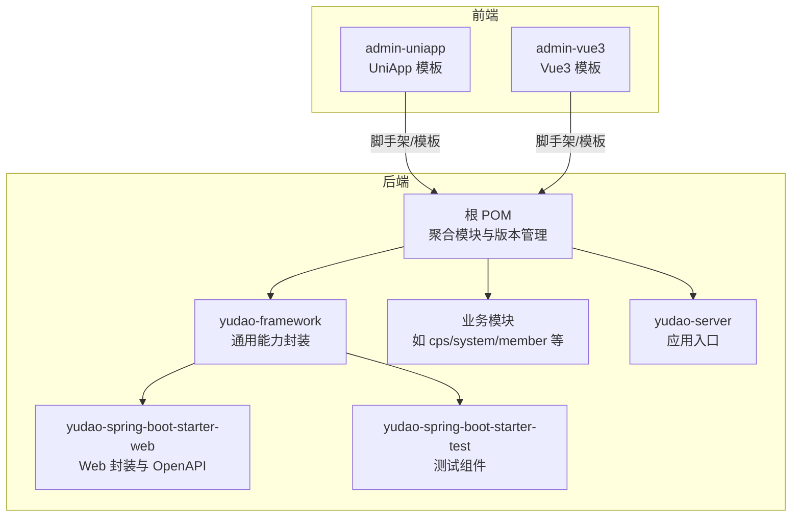
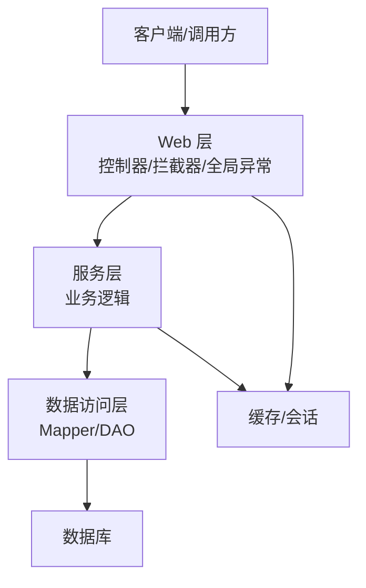
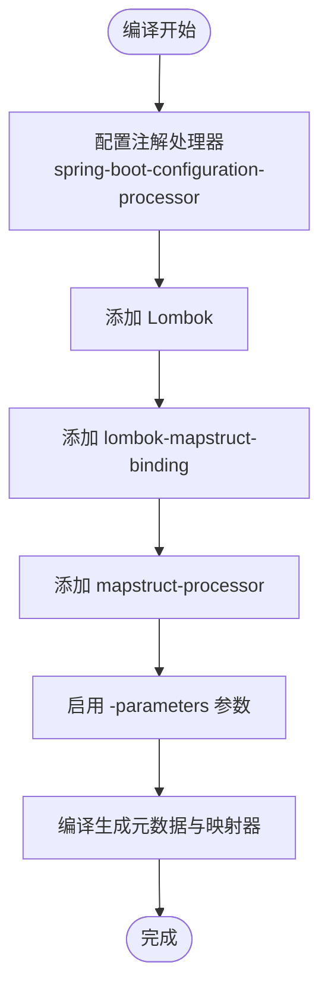
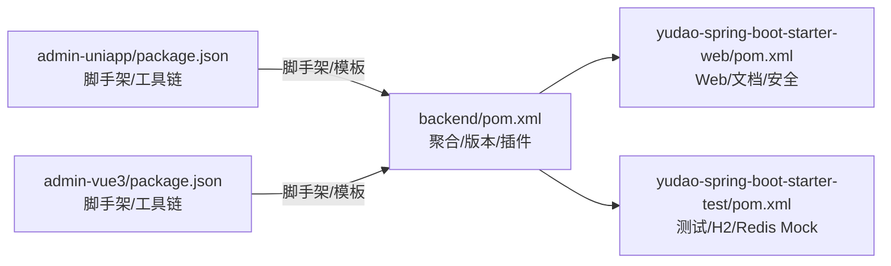

# 开发规范

<cite>
**本文引用的文件**
- [backend/lombok.config](file://backend/lombok.config)
- [backend/pom.xml](file://backend/pom.xml)
- [backend/yudao-framework/yudao-spring-boot-starter-web/pom.xml](file://backend/yudao-framework/yudao-spring-boot-starter-web/pom.xml)
- [backend/yudao-framework/yudao-spring-boot-starter-test/pom.xml](file://backend/yudao-framework/yudao-spring-boot-starter-test/pom.xml)
- [backend/yudao-framework/yudao-spring-boot-starter-web/src/main/java/cn/iocoder/yudao/framework/web/package-info.java](file://backend/yudao-framework/yudao-spring-boot-starter-web/src/main/java/cn/iocoder/yudao/framework/web/package-info.java)
- [backend/yudao-framework/yudao-spring-boot-starter-test/src/main/java/cn/iocoder/yudao/framework/test/package-info.java](file://backend/yudao-framework/yudao-spring-boot-starter-test/src/main/java/cn/iocoder/yudao/framework/test/package-info.java)
- [frontend/admin-uniapp/.editorconfig](file://frontend/admin-uniapp/.editorconfig)
- [frontend/admin-vue3/.editorconfig](file://frontend/admin-vue3/.editorconfig)
- [frontend/admin-uniapp/eslint.config.mjs](file://frontend/admin-uniapp/eslint.config.mjs)
- [frontend/admin-vue3/.eslintrc.js](file://frontend/admin-vue3/.eslintrc.js)
- [frontend/admin-uniapp/tsconfig.json](file://frontend/admin-uniapp/tsconfig.json)
- [frontend/admin-vue3/tsconfig.json](file://frontend/admin-vue3/tsconfig.json)
- [frontend/admin-uniapp/package.json](file://frontend/admin-uniapp/package.json)
- [frontend/admin-vue3/package.json](file://frontend/admin-vue3/package.json)
- [frontend/admin-uniapp/.commitlintrc.cjs](file://frontend/admin-uniapp/.commitlintrc.cjs)
- [backend/script/docker/docker-compose.yml](file://backend/script/docker/docker-compose.yml)
- [backend/sql/tools/docker-compose.yaml](file://backend/sql/tools/docker-compose.yaml)
</cite>

## 目录
1. [引言](#引言)
2. [项目结构](#项目结构)
3. [核心组件](#核心组件)
4. [架构总览](#架构总览)
5. [详细组件分析](#详细组件分析)
6. [依赖分析](#依赖分析)
7. [性能考虑](#性能考虑)
8. [故障排查指南](#故障排查指南)
9. [结论](#结论)
10. [附录](#附录)

## 引言
本开发规范面向 Java 与 TypeScript 双端团队，统一代码风格、命名约定、注解处理器与构建配置；明确 Spring Boot 项目结构与包命名规则、类设计原则；规范前端组件开发、样式与状态管理；制定 Git 提交信息格式、分支管理策略与代码评审流程；给出单元测试与 API 文档生成规范以及错误处理标准；并提供 IDE 配置建议与常用工具使用指南。

## 项目结构
本仓库采用多模块聚合工程组织，后端以 Maven 管理多模块，前端提供 UniApp 与 Vue3 两套模板，配套 Husky/Lint-Staged、CommitLint、ESLint、Prettier、UnoCSS 等工具链。

图示来源
- [backend/pom.xml:1-25](file://backend/pom.xml#L1-L25)
- [backend/yudao-framework/yudao-spring-boot-starter-web/pom.xml:1-17](file://backend/yudao-framework/yudao-spring-boot-starter-web/pom.xml#L1-L17)
- [backend/yudao-framework/yudao-spring-boot-starter-test/pom.xml:1-12](file://backend/yudao-framework/yudao-spring-boot-starter-test/pom.xml#L1-L12)

章节来源
- [backend/pom.xml:1-25](file://backend/pom.xml#L1-L25)

## 核心组件
- Lombok 配置：统一 toString/equals/hashCode 调用父类、链式 setter、避免冒泡传播。
- 注解处理器配置：maven-compiler-plugin 集成 spring-boot-configuration-processor、Lombok、lombok-mapstruct-binding、mapstruct-processor，并开启 -parameters。
- Web 与测试模块：提供全局异常、日志、脱敏、错误码、Knife4j/SpringDoc OpenAPI、单元测试依赖与 H2/Redis Mock 等。
- 前端工具链：ESLint + Prettier + UnoCSS，CommitLint + Husky/Lint-Staged，TS 配置与路径别名。

章节来源
- [backend/lombok.config:1-5](file://backend/lombok.config#L1-L5)
- [backend/pom.xml:69-106](file://backend/pom.xml#L69-L106)
- [backend/yudao-framework/yudao-spring-boot-starter-web/pom.xml:18-82](file://backend/yudao-framework/yudao-spring-boot-starter-web/pom.xml#L18-L82)
- [backend/yudao-framework/yudao-spring-boot-starter-test/pom.xml:18-59](file://backend/yudao-framework/yudao-spring-boot-starter-test/pom.xml#L18-L59)

## 架构总览
后端采用分层与模块化架构，Web 层负责接口与文档，Framework 层提供横切能力，各业务模块按领域拆分；前端提供两套模板，分别适配不同场景。

图示来源
- [backend/yudao-framework/yudao-spring-boot-starter-web/pom.xml:18-82](file://backend/yudao-framework/yudao-spring-boot-starter-web/pom.xml#L18-L82)

## 详细组件分析

### Java 代码风格与命名规范
- 包命名
  - 后端统一使用反向域名 + 分层/模块路径，如 cn.iocoder.yudao.framework.web、cn.iocoder.yudao.module.xxx。
  - 包注释文件用于标注模块职责，如 web 模块包注释说明 SpringMVC 基础封装。
- 类设计原则
  - 使用 Lombok 简化样板代码，保持 equals/hashCode/toString 调用父类，链式 setter。
  - DTO/VO/Entity 明确职责边界，避免跨层混用。
  - Service 层方法单一职责，异常统一由全局异常处理。
- 注解处理器
  - maven-compiler-plugin 集成 Lombok、MapStruct、Spring Configuration Processor，确保 getter/setter 与元数据正确生成。
  - MapStruct 绑定 Lombok 产物需使用 lombok-mapstruct-binding。
- 错误处理
  - 全局异常处理集中于 Web 模块，返回统一响应结构与错误码。

章节来源
- [backend/yudao-framework/yudao-spring-boot-starter-web/src/main/java/cn/iocoder/yudao/framework/web/package-info.java:1-5](file://backend/yudao-framework/yudao-spring-boot-starter-web/src/main/java/cn/iocoder/yudao/framework/web/package-info.java#L1-L5)
- [backend/lombok.config:1-5](file://backend/lombok.config#L1-L5)
- [backend/pom.xml:69-106](file://backend/pom.xml#L69-L106)

### Lombok 配置与 MapStruct 使用规范
- Lombok 配置要点
  - config.stopBubbling = true：避免配置冒泡。
  - lombok.tostring.callsuper=CALL、lombok.equalsandhashcode.callsuper=CALL：要求覆盖方法调用父类实现。
  - lombok.accessors.chain=true：启用链式 setter。
- MapStruct 集成
  - 在 maven-compiler-plugin 中添加 mapstruct-processor 与 lombok-mapstruct-binding。
  - 保证 Lombok 生成的 getter/setter 被 MapStruct 正确识别，避免“属性不存在”编译错误。
- 注解处理器顺序
  - spring-boot-configuration-processor → lombok → lombok-mapstruct-binding → mapstruct-processor。

图示来源
- [backend/pom.xml:69-106](file://backend/pom.xml#L69-L106)

章节来源
- [backend/lombok.config:1-5](file://backend/lombok.config#L1-L5)
- [backend/pom.xml:69-106](file://backend/pom.xml#L69-L106)

### Spring Boot 项目结构规范与包命名规则
- 模块划分
  - yudao-dependencies：统一版本与依赖管理。
  - yudao-framework：通用能力封装（web、mybatis、redis、security、job、monitor、mq、excel、biz-* 等）。
  - yudao-server：应用入口与资源。
  - yudao-module-*：业务域模块（如 system、infra、member、pay、mall、ai、cps 等）。
- 包命名
  - cn.iocoder.yudao.framework.*：框架层包。
  - cn.iocoder.yudao.module.*：业务模块包。
  - 包注释清晰说明职责，便于维护与检索。
- 类设计
  - controller/service/convert/dal/enums 等按职责分层，避免交叉耦合。
  - 使用统一的 Web 封装与 OpenAPI 文档能力。

章节来源
- [backend/pom.xml:10-25](file://backend/pom.xml#L10-L25)
- [backend/yudao-framework/yudao-spring-boot-starter-web/src/main/java/cn/iocoder/yudao/framework/web/package-info.java:1-5](file://backend/yudao-framework/yudao-spring-boot-starter-web/src/main/java/cn/iocoder/yudao/framework/web/package-info.java#L1-L5)

### TypeScript 代码风格与命名规范
- EditorConfig
  - 统一缩进（空格）、行尾、字符集、末行换行。
  - 对 Markdown 等文件放宽最大行长与末尾空格修剪。
- ESLint 配置
  - admin-uniapp：基于 @uni-helper/eslint-config，启用 Vue/UnoCSS 支持，自定义块顺序、花括号风格等规则。
  - admin-vue3：基于 plugin:vue/vue3-recommended、@typescript-eslint/recommended、prettier，关闭部分严格规则以适配团队习惯。
- TS 配置
  - 路径别名 @/*、类型声明与 Volar 插件集成、严格模式与实验性装饰器等。
- 格式化
  - ESLint + Prettier + UnoCSS 格式化 CSS/HTML/Vue/JS/TS。

章节来源
- [frontend/admin-uniapp/.editorconfig:1-14](file://frontend/admin-uniapp/.editorconfig#L1-L14)
- [frontend/admin-vue3/.editorconfig:1-13](file://frontend/admin-vue3/.editorconfig#L1-L13)
- [frontend/admin-uniapp/eslint.config.mjs:1-65](file://frontend/admin-uniapp/eslint.config.mjs#L1-L65)
- [frontend/admin-vue3/.eslintrc.js:1-76](file://frontend/admin-vue3/.eslintrc.js#L1-L76)
- [frontend/admin-uniapp/tsconfig.json:1-46](file://frontend/admin-uniapp/tsconfig.json#L1-L46)
- [frontend/admin-vue3/tsconfig.json:1-44](file://frontend/admin-vue3/tsconfig.json#L1-L44)

### 前端组件开发规范、样式编写规范与状态管理规范
- 组件开发
  - 统一使用 TS/TSX/Vue，遵循单文件组件结构与块顺序（参考 ESLint 规则）。
  - 使用 Pinia 进行状态管理，结合持久化插件。
- 样式
  - UnoCSS 优先，配合 Prettier 格式化 CSS/SCSS/HTML。
  - 避免内联样式，优先原子类与主题变量。
- 路由与页面
  - 使用路由与页面配置，保持层级清晰，避免深层嵌套。
- 类型
  - 严格类型检查，必要时允许显式 any 但需有文档说明。

章节来源
- [frontend/admin-uniapp/package.json:99-127](file://frontend/admin-uniapp/package.json#L99-L127)
- [frontend/admin-vue3/package.json:27-84](file://frontend/admin-vue3/package.json#L27-L84)
- [frontend/admin-uniapp/tsconfig.json:23-33](file://frontend/admin-uniapp/tsconfig.json#L23-L33)
- [frontend/admin-vue3/tsconfig.json:26-32](file://frontend/admin-vue3/tsconfig.json#L26-L32)

### Git 提交信息格式、分支管理策略与代码审查流程
- 提交信息
  - 使用 Conventional Commits，配合 @commitlint/config-conventional。
- 分支策略
  - 主干保护：master/main 仅允许 Pull Request 合并。
  - 功能分支：feature/xxx；修复分支：fix/xxx；发布分支：release/xxx；热修复：hotfix/xxx。
- 代码审查
  - PR 必须通过 CI 与 Lint 检查，至少一名 reviewer 批准。
  - 提交前执行 lint-staged 自动修复。

章节来源
- [frontend/admin-uniapp/.commitlintrc.cjs:1-4](file://frontend/admin-uniapp/.commitlintrc.cjs#L1-L4)
- [frontend/admin-uniapp/package.json:190-192](file://frontend/admin-uniapp/package.json#L190-L192)

### 单元测试编写规范与 API 文档生成规范
- 单元测试
  - 使用 yudao-spring-boot-starter-test 提供的 H2、Redis Mock、Mockito、Podam 等依赖。
  - 测试配置可参考各模块 test/resources 下的 application-unit-test.yaml。
- API 文档
  - Web 模块引入 Knife4j 与 SpringDoc OpenAPI，自动暴露接口文档。
  - 建议在 Controller 上完善注解与示例，保持文档一致性。

章节来源
- [backend/yudao-framework/yudao-spring-boot-starter-test/pom.xml:18-59](file://backend/yudao-framework/yudao-spring-boot-starter-test/pom.xml#L18-L59)
- [backend/yudao-framework/yudao-spring-boot-starter-web/pom.xml:43-48](file://backend/yudao-framework/yudao-spring-boot-starter-web/pom.xml#L43-L48)

### 错误处理标准
- 全局异常处理由 Web 模块提供，统一返回结构与错误码。
- 建议对常见异常进行分类与降级处理，保障用户体验与系统稳定性。

章节来源
- [backend/yudao-framework/yudao-spring-boot-starter-web/pom.xml:18-82](file://backend/yudao-framework/yudao-spring-boot-starter-web/pom.xml#L18-L82)

### IDE 配置建议与开发工具使用指南
- Java
  - 使用 Maven 编译，确保注解处理器按顺序加载。
  - Lombok 插件启用，避免重复生成代码。
- TypeScript
  - VSCode 推荐插件：ESLint、Prettier、UnoCSS、Vue Language Features (Volar)、TypeScript Importer。
  - 前端模板已内置 ESLint/Prettier/UnoCSS 配置，建议在 IDE 中启用保存时格式化。
- Docker
  - 提供 docker-compose 示例，便于本地快速启动依赖环境。

章节来源
- [backend/pom.xml:69-106](file://backend/pom.xml#L69-L106)
- [frontend/admin-uniapp/package.json:128-177](file://frontend/admin-uniapp/package.json#L128-L177)
- [frontend/admin-vue3/package.json:85-144](file://frontend/admin-vue3/package.json#L85-L144)
- [backend/script/docker/docker-compose.yml](file://backend/script/docker/docker-compose.yml)
- [backend/sql/tools/docker-compose.yaml](file://backend/sql/tools/docker-compose.yaml)

## 依赖分析
后端通过聚合 POM 管理版本与模块，Web 与 Test 模块提供横切能力；前端模板通过 package.json 管理脚手架与工具链。

图示来源
- [backend/pom.xml:1-25](file://backend/pom.xml#L1-L25)
- [backend/yudao-framework/yudao-spring-boot-starter-web/pom.xml:1-17](file://backend/yudao-framework/yudao-spring-boot-starter-web/pom.xml#L1-L17)
- [backend/yudao-framework/yudao-spring-boot-starter-test/pom.xml:1-12](file://backend/yudao-framework/yudao-spring-boot-starter-test/pom.xml#L1-L12)
- [frontend/admin-uniapp/package.json:1-194](file://frontend/admin-uniapp/package.json#L1-L194)
- [frontend/admin-vue3/package.json:1-160](file://frontend/admin-vue3/package.json#L1-L160)

章节来源
- [backend/pom.xml:1-25](file://backend/pom.xml#L1-L25)
- [frontend/admin-uniapp/package.json:1-194](file://frontend/admin-uniapp/package.json#L1-L194)
- [frontend/admin-vue3/package.json:1-160](file://frontend/admin-vue3/package.json#L1-L160)

## 性能考虑
- 后端
  - 合理使用缓存与连接池，避免 N+1 查询；Mapper/Service 层尽量批量操作。
  - 启用必要的监控与链路追踪，定位热点与慢调用。
- 前端
  - 按需加载组件与路由，减少首屏体积；合理使用持久化状态，避免内存泄漏。

## 故障排查指南
- 编译期 MapStruct 报错
  - 检查 maven-compiler-plugin 注解处理器顺序与 lombok-mapstruct-binding 是否配置正确。
- Lombok 未生效
  - 确认 IDE 安装 Lombok 插件并启用注解处理；清理并重新编译。
- 前端 ESLint/Prettier 报错
  - 使用保存时自动修复或执行 npm run lint 或 npm run lint:fix；确认 .editorconfig 与 ESLint 配置一致。
- 提交被拒绝
  - 检查 commitlint 规则是否符合 Conventional Commits；确保 lint-staged 成功执行。

章节来源
- [backend/pom.xml:69-106](file://backend/pom.xml#L69-L106)
- [frontend/admin-uniapp/eslint.config.mjs:1-65](file://frontend/admin-uniapp/eslint.config.mjs#L1-L65)
- [frontend/admin-vue3/.eslintrc.js:1-76](file://frontend/admin-vue3/.eslintrc.js#L1-L76)
- [frontend/admin-uniapp/.commitlintrc.cjs:1-4](file://frontend/admin-uniapp/.commitlintrc.cjs#L1-L4)

## 结论
本规范统一了 Java 与 TypeScript 的开发标准，明确了注解处理器与 Spring Boot 模块化结构，提供了前端工程化与质量保障方案，并制定了 Git 工作流与测试、文档规范。建议团队在日常协作中严格执行，持续优化工具链与流程。

## 附录
- Docker 环境
  - 提供后端与 SQL 工具的 docker-compose 示例，便于本地快速搭建依赖环境。
- 参考文档
  - 各模块 README 与入门文档可用于深入学习框架能力与最佳实践。

章节来源
- [backend/script/docker/docker-compose.yml](file://backend/script/docker/docker-compose.yml)
- [backend/sql/tools/docker-compose.yaml](file://backend/sql/tools/docker-compose.yaml)