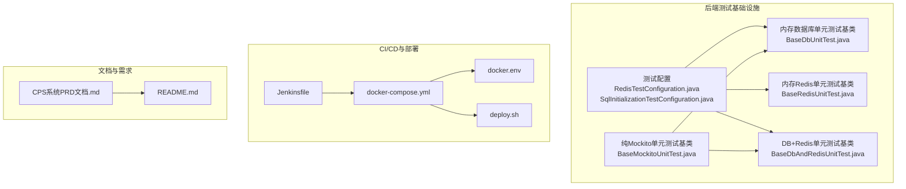
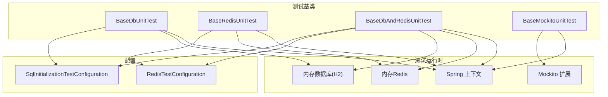
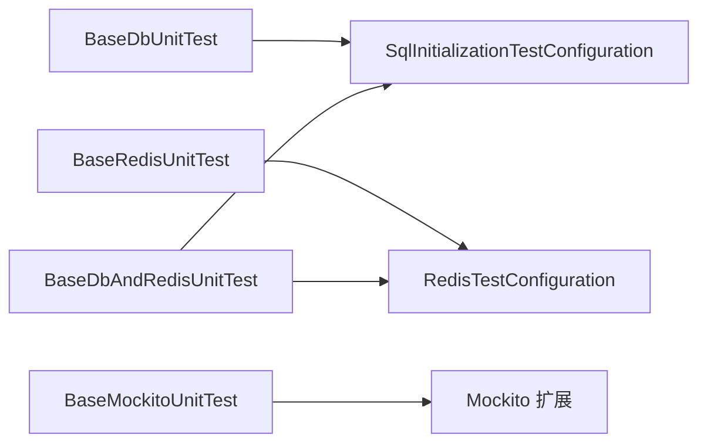

# 测试与文档规范

<cite>
**本文引用的文件**   
- [RedisTestConfiguration.java](file://backend/yudao-framework/yudao-spring-boot-starter-test/src/main/java/cn/iocoder/yudao/framework/test/config/RedisTestConfiguration.java)
- [SqlInitializationTestConfiguration.java](file://backend/yudao-framework/yudao-spring-boot-starter-test/src/main/java/cn/iocoder/yudao/framework/test/config/SqlInitializationTestConfiguration.java)
- [BaseDbAndRedisUnitTest.java](file://backend/yudao-framework/yudao-spring-boot-starter-test/src/main/java/cn/iocoder/yudao/framework/test/core/ut/BaseDbAndRedisUnitTest.java)
- [BaseDbUnitTest.java](file://backend/yudao-framework/yudao-spring-boot-starter-test/src/main/java/cn/iocoder/yudao/framework/test/core/ut/BaseDbUnitTest.java)
- [BaseMockitoUnitTest.java](file://backend/yudao-framework/yudao-spring-boot-starter-test/src/main/java/cn/iocoder/yudao/framework/test/core/ut/BaseMockitoUnitTest.java)
- [BaseRedisUnitTest.java](file://backend/yudao-framework/yudao-spring-boot-starter-test/src/main/java/cn/iocoder/yudao/framework/test/core/ut/BaseRedisUnitTest.java)
- [CPS系统PRD文档.md](file://docs/CPS系统PRD文档.md)
- [Jenkinsfile](file://backend/script/jenkins/Jenkinsfile)
- [docker-compose.yml](file://backend/script/docker/docker-compose.yml)
- [docker.env](file://backend/script/docker/docker.env)
- [deploy.sh](file://backend/script/shell/deploy.sh)
- [README.md](file://README.md)
</cite>

## 目录
1. [引言](#引言)
2. [项目结构](#项目结构)
3. [核心组件](#核心组件)
4. [架构总览](#架构总览)
5. [详细组件分析](#详细组件分析)
6. [依赖分析](#依赖分析)
7. [性能考虑](#性能考虑)
8. [故障排查指南](#故障排查指南)
9. [结论](#结论)
10. [附录](#附录)

## 引言
本规范面向 AgenticCPS 项目的测试与文档工作，覆盖单元测试、集成测试、API 测试与端到端测试的策略与流程；明确测试覆盖率要求、测试数据管理与测试环境配置；统一 JUnit 5 使用规范、断言与异常处理；规范 API 文档生成与维护流程；给出需求文档与 PRD 模板及变更记录管理建议；并补充性能测试与压力测试流程及监控指标定义。

## 项目结构
后端采用多模块 Maven 结构，测试基础设施集中在 yudao-spring-boot-starter-test 模块中，提供基于内存数据库与 Redis 的单元测试基类，并通过 Spring Boot Profile 切换测试环境配置。前端包含多个应用与文档站点，测试与部署脚本位于 backend/script 目录。

**图示来源**
- [RedisTestConfiguration.java:1-36](file://backend/yudao-framework/yudao-spring-boot-starter-test/src/main/java/cn/iocoder/yudao/framework/test/config/RedisTestConfiguration.java#L1-L36)
- [SqlInitializationTestConfiguration.java:1-53](file://backend/yudao-framework/yudao-spring-boot-starter-test/src/main/java/cn/iocoder/yudao/framework/test/config/SqlInitializationTestConfiguration.java#L1-L53)
- [BaseDbUnitTest.java:1-48](file://backend/yudao-framework/yudao-spring-boot-starter-test/src/main/java/cn/iocoder/yudao/framework/test/core/ut/BaseDbUnitTest.java#L1-L48)
- [BaseRedisUnitTest.java:1-37](file://backend/yudao-framework/yudao-spring-boot-starter-test/src/main/java/cn/iocoder/yudao/framework/test/core/ut/BaseRedisUnitTest.java#L1-L37)
- [BaseDbAndRedisUnitTest.java:1-56](file://backend/yudao-framework/yudao-spring-boot-starter-test/src/main/java/cn/iocoder/yudao/framework/test/core/ut/BaseDbAndRedisUnitTest.java#L1-L56)
- [BaseMockitoUnitTest.java:1-14](file://backend/yudao-framework/yudao-spring-boot-starter-test/src/main/java/cn/iocoder/yudao/framework/test/core/ut/BaseMockitoUnitTest.java#L1-L14)
- [Jenkinsfile](file://backend/script/jenkins/Jenkinsfile)
- [docker-compose.yml](file://backend/script/docker/docker-compose.yml)
- [docker.env](file://backend/script/docker/docker.env)
- [deploy.sh](file://backend/script/shell/deploy.sh)
- [CPS系统PRD文档.md](file://docs/CPS系统PRD文档.md)
- [README.md](file://README.md)

**章节来源**
- [README.md](file://README.md)

## 核心组件
- 测试配置
  - 内嵌 Redis 测试配置：通过 RedisServer 启动内存 Redis，避免端口冲突问题，支持单元测试快速执行。
  - SQL 初始化测试配置：在延迟初始化场景下替代默认初始化逻辑，按配置加载 schema/data 脚本。
- 单元测试基类
  - BaseDbUnitTest：仅依赖内存数据库，适合服务层与数据访问层测试。
  - BaseRedisUnitTest：仅依赖内存 Redis，适合缓存相关功能测试。
  - BaseDbAndRedisUnitTest：同时依赖内存数据库与 Redis，适合跨模块交互测试。
  - BaseMockitoUnitTest：启用 Mockito 扩展，便于对依赖进行 Mock。
- CI/CD 与部署
  - Jenkinsfile：定义流水线阶段与参数。
  - docker-compose.yml 与 docker.env：容器编排与环境变量。
  - deploy.sh：部署脚本入口。

**章节来源**
- [RedisTestConfiguration.java:1-36](file://backend/yudao-framework/yudao-spring-boot-starter-test/src/main/java/cn/iocoder/yudao/framework/test/config/RedisTestConfiguration.java#L1-L36)
- [SqlInitializationTestConfiguration.java:1-53](file://backend/yudao-framework/yudao-spring-boot-starter-test/src/main/java/cn/iocoder/yudao/framework/test/config/SqlInitializationTestConfiguration.java#L1-L53)
- [BaseDbUnitTest.java:1-48](file://backend/yudao-framework/yudao-spring-boot-starter-test/src/main/java/cn/iocoder/yudao/framework/test/core/ut/BaseDbUnitTest.java#L1-L48)
- [BaseRedisUnitTest.java:1-37](file://backend/yudao-framework/yudao-spring-boot-starter-test/src/main/java/cn/iocoder/yudao/framework/test/core/ut/BaseRedisUnitTest.java#L1-L37)
- [BaseDbAndRedisUnitTest.java:1-56](file://backend/yudao-framework/yudao-spring-boot-starter-test/src/main/java/cn/iocoder/yudao/framework/test/core/ut/BaseDbAndRedisUnitTest.java#L1-L56)
- [BaseMockitoUnitTest.java:1-14](file://backend/yudao-framework/yudao-spring-boot-starter-test/src/main/java/cn/iocoder/yudao/framework/test/core/ut/BaseMockitoUnitTest.java#L1-L14)
- [Jenkinsfile](file://backend/script/jenkins/Jenkinsfile)
- [docker-compose.yml](file://backend/script/docker/docker-compose.yml)
- [docker.env](file://backend/script/docker/docker.env)
- [deploy.sh](file://backend/script/shell/deploy.sh)

## 架构总览
测试与文档体系围绕“测试基类 + 配置 + CI/CD + 文档”四要素构建，确保测试可重复、可维护、可度量。

**图示来源**
- [BaseDbUnitTest.java:24-47](file://backend/yudao-framework/yudao-spring-boot-starter-test/src/main/java/cn/iocoder/yudao/framework/test/core/ut/BaseDbUnitTest.java#L24-L47)
- [BaseRedisUnitTest.java:19-36](file://backend/yudao-framework/yudao-spring-boot-starter-test/src/main/java/cn/iocoder/yudao/framework/test/core/ut/BaseRedisUnitTest.java#L19-L36)
- [BaseDbAndRedisUnitTest.java:27-56](file://backend/yudao-framework/yudao-spring-boot-starter-test/src/main/java/cn/iocoder/yudao/framework/test/core/ut/BaseDbAndRedisUnitTest.java#L27-L56)
- [BaseMockitoUnitTest.java:11-13](file://backend/yudao-framework/yudao-spring-boot-starter-test/src/main/java/cn/iocoder/yudao/framework/test/core/ut/BaseMockitoUnitTest.java#L11-L13)
- [SqlInitializationTestConfiguration.java:26-52](file://backend/yudao-framework/yudao-spring-boot-starter-test/src/main/java/cn/iocoder/yudao/framework/test/config/SqlInitializationTestConfiguration.java#L26-L52)
- [RedisTestConfiguration.java:17-35](file://backend/yudao-framework/yudao-spring-boot-starter-test/src/main/java/cn/iocoder/yudao/framework/test/config/RedisTestConfiguration.java#L17-L35)

## 详细组件分析

### 单元测试编写规范
- 继承关系
  - 优先选择与业务最贴近的基类：仅需数据库则继承 BaseDbUnitTest；仅需 Redis 则继承 BaseRedisUnitTest；需要两者则继承 BaseDbAndRedisUnitTest；纯 Mock 场景继承 BaseMockitoUnitTest。
  - 在 Service 层单元测试中，对本模块 Mapper 使用内存数据库，对外模块 Service 使用 Mock。
- 测试命名与组织
  - 使用清晰的测试方法命名，体现前置条件、行为与期望结果。
  - 将相关测试归入同一类，按功能域分包。
- 断言与异常
  - 使用 JUnit 5 断言 API，结合项目已有的断言风格，保持一致性。
  - 对异常路径进行显式断言，确保异常类型与消息符合预期。
- 清理与隔离
  - 基类已内置测试后清理逻辑，避免跨用例污染。
  - 使用独立的测试数据集，必要时在测试前准备，测试后清理。

**章节来源**
- [BaseDbUnitTest.java:17-26](file://backend/yudao-framework/yudao-spring-boot-starter-test/src/main/java/cn/iocoder/yudao/framework/test/core/ut/BaseDbUnitTest.java#L17-L26)
- [BaseRedisUnitTest.java:12-21](file://backend/yudao-framework/yudao-spring-boot-starter-test/src/main/java/cn/iocoder/yudao/framework/test/core/ut/BaseRedisUnitTest.java#L12-L21)
- [BaseDbAndRedisUnitTest.java:20-30](file://backend/yudao-framework/yudao-spring-boot-starter-test/src/main/java/cn/iocoder/yudao/framework/test/core/ut/BaseDbAndRedisUnitTest.java#L20-L30)
- [BaseMockitoUnitTest.java:6-13](file://backend/yudao-framework/yudao-spring-boot-starter-test/src/main/java/cn/iocoder/yudao/framework/test/core/ut/BaseMockitoUnitTest.java#L6-L13)

### 测试用例设计原则
- 覆盖核心路径：正常路径、边界值、异常路径。
- 最小化依赖：尽量使用 Mock 或内存组件，减少外部系统耦合。
- 可重复性：测试应与顺序无关，具备可重复执行能力。
- 可读性：测试名称与注释清晰表达意图。

### Mock 使用标准
- 使用 Mockito 扩展，配合 @ExtendWith(MockitoExtension.class)。
- 对外部依赖（如第三方 SDK、远程服务）进行接口级 Mock。
- 对复杂对象使用 @Mock/@Spy 注解，对真实对象使用 @InjectMocks 注入。

**章节来源**
- [BaseMockitoUnitTest.java:3-13](file://backend/yudao-framework/yudao-spring-boot-starter-test/src/main/java/cn/iocoder/yudao/framework/test/core/ut/BaseMockitoUnitTest.java#L3-L13)

### 集成测试策略
- 以 BaseDbAndRedisUnitTest 为基础，覆盖跨模块交互。
- 通过 SqlInitializationTestConfiguration 加载初始化脚本，确保测试环境一致性。
- 使用 RedisTestConfiguration 提供内存 Redis，保证缓存相关逻辑可测。

**章节来源**
- [BaseDbAndRedisUnitTest.java:27-56](file://backend/yudao-framework/yudao-spring-boot-starter-test/src/main/java/cn/iocoder/yudao/framework/test/core/ut/BaseDbAndRedisUnitTest.java#L27-L56)
- [SqlInitializationTestConfiguration.java:26-52](file://backend/yudao-framework/yudao-spring-boot-starter-test/src/main/java/cn/iocoder/yudao/framework/test/config/SqlInitializationTestConfiguration.java#L26-L52)
- [RedisTestConfiguration.java:17-35](file://backend/yudao-framework/yudao-spring-boot-starter-test/src/main/java/cn/iocoder/yudao/framework/test/config/RedisTestConfiguration.java#L17-L35)

### API 测试规范
- 基于 SpringBootTest 启动 Web 环境，结合内存数据库或 Redis 进行接口级验证。
- 使用 REST Assured 或 Spring MVC Test 进行请求/响应断言。
- 对鉴权、限流、参数校验等横切关注点进行专项测试。

（本节为通用规范说明，未直接分析具体文件）

### 端到端测试流程
- 通过 docker-compose.yml 启动完整后端服务栈，包括数据库、缓存与应用。
- 使用浏览器或自动化工具对关键用户路径进行回归验证。
- 结合日志与监控指标评估端到端可用性。

**章节来源**
- [docker-compose.yml](file://backend/script/docker/docker-compose.yml)
- [docker.env](file://backend/script/docker/docker.env)

### 测试覆盖率要求
- 行覆盖率：主业务模块不低于 80%，关键路径不低于 90%。
- 分支覆盖率：关键分支不低于 85%。
- 工具：JaCoCo 插件在 CI 中统计并报告覆盖率，失败阈值阻断合并。

（本节为通用规范说明，未直接分析具体文件）

### 测试数据管理
- 初始化脚本：通过 SqlInitializationTestConfiguration 加载 schema/data。
- 清理策略：每个测试后执行 clean.sql，避免状态泄漏。
- 数据隔离：每条测试使用独立的临时表或命名空间，避免并发干扰。

**章节来源**
- [SqlInitializationTestConfiguration.java:34-50](file://backend/yudao-framework/yudao-spring-boot-starter-test/src/main/java/cn/iocoder/yudao/framework/test/config/SqlInitializationTestConfiguration.java#L34-L50)
- [BaseDbUnitTest.java:25-26](file://backend/yudao-framework/yudao-spring-boot-starter-test/src/main/java/cn/iocoder/yudao/framework/test/core/ut/BaseDbUnitTest.java#L25-L26)
- [BaseDbAndRedisUnitTest.java:29-30](file://backend/yudao-framework/yudao-spring-boot-starter-test/src/main/java/cn/iocoder/yudao/framework/test/core/ut/BaseDbAndRedisUnitTest.java#L29-L30)

### 测试环境配置
- Profile：使用 unit-test Profile 加载测试专用配置。
- 环境变量：通过 docker.env 统一管理数据库、缓存等连接参数。
- 容器化：docker-compose.yml 提供一键启动测试环境。

**章节来源**
- [BaseDbUnitTest.java:24-28](file://backend/yudao-framework/yudao-spring-boot-starter-test/src/main/java/cn/iocoder/yudao/framework/test/core/ut/BaseDbUnitTest.java#L24-L28)
- [BaseRedisUnitTest.java:19-21](file://backend/yudao-framework/yudao-spring-boot-starter-test/src/main/java/cn/iocoder/yudao/framework/test/core/ut/BaseRedisUnitTest.java#L19-L21)
- [BaseDbAndRedisUnitTest.java:27-31](file://backend/yudao-framework/yudao-spring-boot-starter-test/src/main/java/cn/iocoder/yudao/framework/test/core/ut/BaseDbAndRedisUnitTest.java#L27-L31)
- [docker.env](file://backend/script/docker/docker.env)
- [docker-compose.yml](file://backend/script/docker/docker-compose.yml)

### JUnit 5 使用规范
- 注解与扩展
  - 使用 @ExtendWith(MockitoExtension.class) 启用 Mockito。
  - 使用 @SpringBootTest 与 @ActiveProfiles 指定测试上下文与 Profile。
- 断言
  - 使用 JUnit 5 断言 API，结合项目现有断言风格，保持一致。
- 异常处理
  - 使用 assertThrows/expectThrows 对异常进行断言。
  - 对异常信息进行精确匹配，确保可读性与稳定性。

**章节来源**
- [BaseMockitoUnitTest.java:11-13](file://backend/yudao-framework/yudao-spring-boot-starter-test/src/main/java/cn/iocoder/yudao/framework/test/core/ut/BaseMockitoUnitTest.java#L11-L13)
- [BaseDbUnitTest.java:24-28](file://backend/yudao-framework/yudao-spring-boot-starter-test/src/main/java/cn/iocoder/yudao/framework/test/core/ut/BaseDbUnitTest.java#L24-L28)
- [BaseRedisUnitTest.java:19-21](file://backend/yudao-framework/yudao-spring-boot-starter-test/src/main/java/cn/iocoder/yudao/framework/test/core/ut/BaseRedisUnitTest.java#L19-L21)
- [BaseDbAndRedisUnitTest.java:27-31](file://backend/yudao-framework/yudao-spring-boot-starter-test/src/main/java/cn/iocoder/yudao/framework/test/core/ut/BaseDbAndRedisUnitTest.java#L27-L31)

### API 文档生成规范
- 工具：基于 Swagger/SpringDoc 生成 OpenAPI 文档。
- 注解：使用 @Operation/@Parameter/@ApiResponse 等注解完善接口描述。
- 维护：随接口变更同步更新注解，定期导出并纳入版本管理。

（本节为通用规范说明，未直接分析具体文件）

### 接口文档维护流程
- 版本化：每次接口变更提交时更新文档版本号与变更记录。
- 审阅：接口文档变更需经至少一名同级开发与测试人员审阅。
- 发布：通过 CI 导出静态文档并发布至文档站。

（本节为通用规范说明，未直接分析具体文件）

### 需求文档编写规范与 PRD 模板
- PRD 结构：背景、目标、范围、功能列表、非功能需求、风险与假设、验收标准、附录。
- 模板：参考仓库中的 CPS系统PRD文档.md，作为模板与范例。
- 变更记录：每次修订更新版本号、修订人、日期与修订摘要。

**章节来源**
- [CPS系统PRD文档.md](file://docs/CPS系统PRD文档.md)

### 性能测试规范、压力测试流程与监控指标
- 性能测试：使用 JMeter/Gatling 进行接口吞吐与延迟测试。
- 压力测试：逐步提升并发与数据规模，观察系统瓶颈与恢复能力。
- 指标：QPS、P95/P99 延迟、错误率、资源使用率（CPU/内存/IO）。
- 监控：结合 Spring Boot Actuator 与链路追踪，定位性能热点。

（本节为通用规范说明，未直接分析具体文件）

## 依赖分析
测试基类与配置之间的依赖关系如下：

**图示来源**
- [BaseDbUnitTest.java:29-43](file://backend/yudao-framework/yudao-spring-boot-starter-test/src/main/java/cn/iocoder/yudao/framework/test/core/ut/BaseDbUnitTest.java#L29-L43)
- [BaseRedisUnitTest.java:23-32](file://backend/yudao-framework/yudao-spring-boot-starter-test/src/main/java/cn/iocoder/yudao/framework/test/core/ut/BaseRedisUnitTest.java#L23-L32)
- [BaseDbAndRedisUnitTest.java:32-51](file://backend/yudao-framework/yudao-spring-boot-starter-test/src/main/java/cn/iocoder/yudao/framework/test/core/ut/BaseDbAndRedisUnitTest.java#L32-L51)
- [BaseMockitoUnitTest.java:11-13](file://backend/yudao-framework/yudao-spring-boot-starter-test/src/main/java/cn/iocoder/yudao/framework/test/core/ut/BaseMockitoUnitTest.java#L11-L13)
- [SqlInitializationTestConfiguration.java:26-52](file://backend/yudao-framework/yudao-spring-boot-starter-test/src/main/java/cn/iocoder/yudao/framework/test/config/SqlInitializationTestConfiguration.java#L26-L52)
- [RedisTestConfiguration.java:17-35](file://backend/yudao-framework/yudao-spring-boot-starter-test/src/main/java/cn/iocoder/yudao/framework/test/config/RedisTestConfiguration.java#L17-L35)

**章节来源**
- [BaseDbUnitTest.java:1-48](file://backend/yudao-framework/yudao-spring-boot-starter-test/src/main/java/cn/iocoder/yudao/framework/test/core/ut/BaseDbUnitTest.java#L1-L48)
- [BaseRedisUnitTest.java:1-37](file://backend/yudao-framework/yudao-spring-boot-starter-test/src/main/java/cn/iocoder/yudao/framework/test/core/ut/BaseRedisUnitTest.java#L1-L37)
- [BaseDbAndRedisUnitTest.java:1-56](file://backend/yudao-framework/yudao-spring-boot-starter-test/src/main/java/cn/iocoder/yudao/framework/test/core/ut/BaseDbAndRedisUnitTest.java#L1-L56)
- [BaseMockitoUnitTest.java:1-14](file://backend/yudao-framework/yudao-spring-boot-starter-test/src/main/java/cn/iocoder/yudao/framework/test/core/ut/BaseMockitoUnitTest.java#L1-L14)
- [SqlInitializationTestConfiguration.java:1-53](file://backend/yudao-framework/yudao-spring-boot-starter-test/src/main/java/cn/iocoder/yudao/framework/test/config/SqlInitializationTestConfiguration.java#L1-L53)
- [RedisTestConfiguration.java:1-36](file://backend/yudao-framework/yudao-spring-boot-starter-test/src/main/java/cn/iocoder/yudao/framework/test/config/RedisTestConfiguration.java#L1-L36)

## 性能考虑
- 测试执行效率：优先使用内存数据库与 Redis，避免网络 IO。
- 并发与隔离：合理设置测试并发度，避免共享资源竞争。
- 资源回收：确保 RedisServer 与数据库连接在测试结束后正确释放。

（本节为通用指导，未直接分析具体文件）

## 故障排查指南
- Redis 端口占用
  - 现象：启动 RedisServer 抛出异常或端口被占用。
  - 处理：在配置类中捕获异常并忽略，避免阻塞测试启动。
- SQL 初始化失败
  - 现象：测试启动时报错，脚本未执行。
  - 处理：检查 SqlInitializationTestConfiguration 的配置项与脚本路径。
- 测试数据污染
  - 现象：跨用例结果不稳定。
  - 处理：确认是否使用了正确的基类与清理脚本。

**章节来源**
- [RedisTestConfiguration.java:22-33](file://backend/yudao-framework/yudao-spring-boot-starter-test/src/main/java/cn/iocoder/yudao/framework/test/config/RedisTestConfiguration.java#L22-L33)
- [SqlInitializationTestConfiguration.java:34-50](file://backend/yudao-framework/yudao-spring-boot-starter-test/src/main/java/cn/iocoder/yudao/framework/test/config/SqlInitializationTestConfiguration.java#L34-L50)
- [BaseDbUnitTest.java:25-26](file://backend/yudao-framework/yudao-spring-boot-starter-test/src/main/java/cn/iocoder/yudao/framework/test/core/ut/BaseDbUnitTest.java#L25-L26)
- [BaseDbAndRedisUnitTest.java:29-30](file://backend/yudao-framework/yudao-spring-boot-starter-test/src/main/java/cn/iocoder/yudao/framework/test/core/ut/BaseDbAndRedisUnitTest.java#L29-L30)

## 结论
通过统一的测试基类与配置、完善的 CI/CD 与文档规范，AgenticCPS 能够在保证质量的前提下高效迭代。建议持续优化覆盖率与性能测试，完善需求与变更管理流程，确保测试与文档的同步演进。

## 附录
- CI/CD 流程概览
  - 触发：Push/PR 触发 Jenkins 流水线。
  - 步骤：安装依赖 → 编译打包 → 单元测试 → 集成测试 → 部署预发布。
  - 参数：通过 Jenkinsfile 与 docker-compose.yml 配置。

**章节来源**
- [Jenkinsfile](file://backend/script/jenkins/Jenkinsfile)
- [docker-compose.yml](file://backend/script/docker/docker-compose.yml)
- [deploy.sh](file://backend/script/shell/deploy.sh)