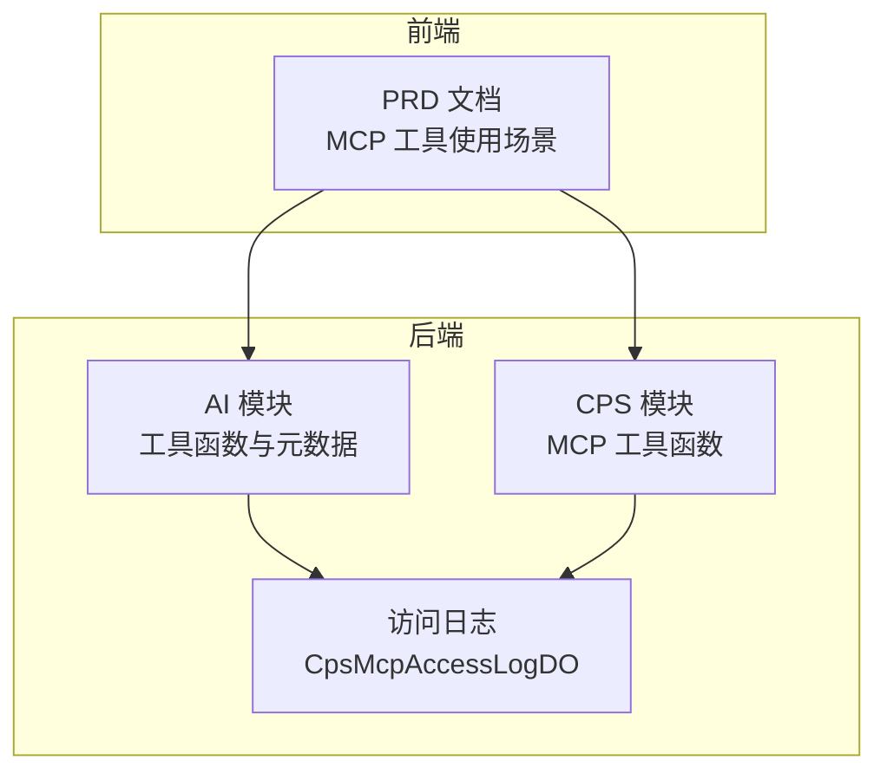
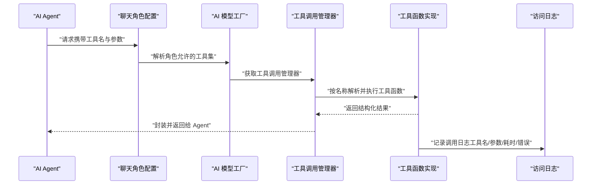
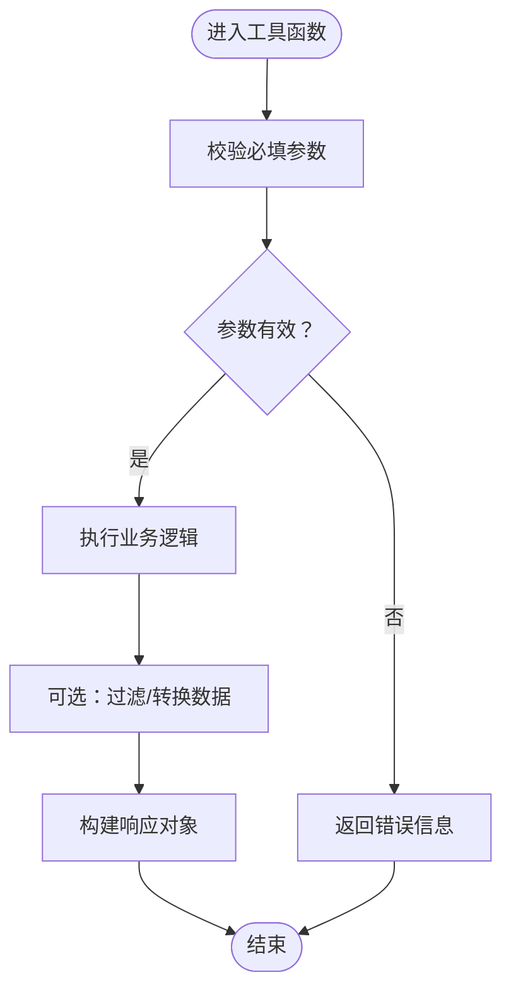
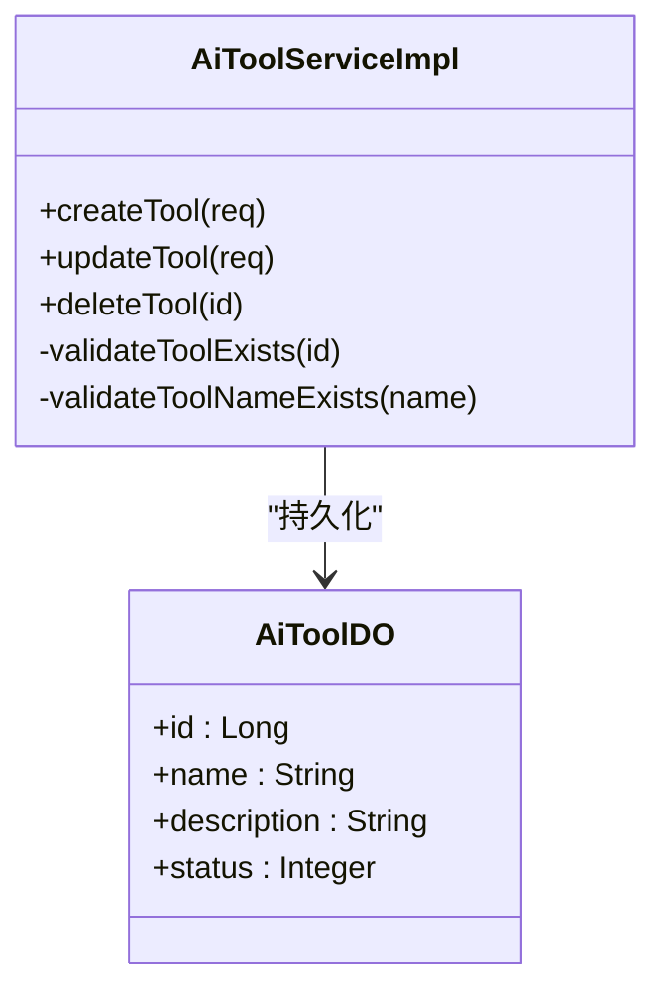
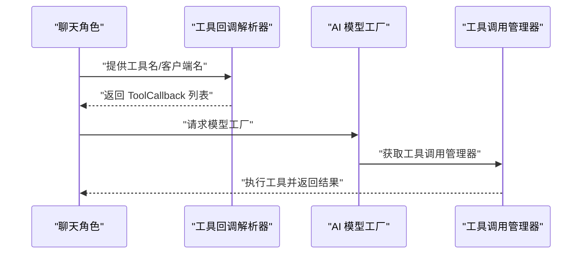

# 工具函数开发

<cite>
**本文引用的文件**
- [CPS系统PRD文档.md](file://docs/CPS系统PRD文档.md)
- [backend/README.md](file://backend/README.md)
- [AiToolServiceImpl.java](file://backend/yudao-module-ai/src/main/java/cn/iocoder/yudao/module/ai/service/model/AiToolServiceImpl.java)
- [AiToolDO.java](file://backend/yudao-module-ai/src/main/java/cn/iocoder/yudao/module/ai/dal/dataobject/model/AiToolDO.java)
- [AiToolController.java](file://backend/yudao-module-ai/src/main/java/cn/iocoder/yudao/module/ai/controller/admin/model/AiToolController.java)
- [WeatherQueryToolFunction.java](file://backend/yudao-module-ai/src/main/java/cn/iocoder/yudao/module/ai/tool/function/WeatherQueryToolFunction.java)
- [CpsSearchGoodsToolFunction.java](file://backend/yudao-module-cps/yudao-module-cps-biz/src/main/java/cn/iocoder/yudao/module/cps/mcp/tool/CpsSearchGoodsToolFunction.java)
- [CpsComparePricesToolFunction.java](file://backend/yudao-module-cps/yudao-module-cps-biz/src/main/java/cn/iocoder/yudao/module/cps/mcp/tool/CpsComparePricesToolFunction.java)
- [CpsGenerateLinkToolFunction.java](file://backend/yudao-module-cps/yudao-module-cps-biz/src/main/java/cn/iocoder/yudao/module/cps/mcp/tool/CpsGenerateLinkToolFunction.java)
- [CpsQueryOrdersToolFunction.java](file://backend/yudao-module-cps/yudao-module-cps-biz/src/main/java/cn/iocoder/yudao/module/cps/mcp/tool/CpsQueryOrdersToolFunction.java)
- [CpsGetRebateSummaryToolFunction.java](file://backend/yudao-module-cps/yudao-module-cps-biz/src/main/java/cn/iocoder/yudao/module/cps/mcp/tool/CpsGetRebateSummaryToolFunction.java)
- [AiChatMessageServiceImpl.java](file://backend/yudao-module-ai/src/main/java/cn/iocoder/yudao/module/ai/service/chat/AiChatMessageServiceImpl.java)
- [AiModelFactoryImpl.java](file://backend/yudao-module-ai/src/main/java/cn/iocoder/yudao/module/ai/framework/ai/core/model/AiModelFactoryImpl.java)
- [CpsMcpAccessLogDO.java](file://backend/yudao-module-cps/yudao-module-cps-biz/src/main/java/cn/iocoder/yudao/module/cps/dal/dataobject/mcp/CpsMcpAccessLogDO.java)
</cite>

## 目录
1. [引言](#引言)
2. [项目结构](#项目结构)
3. [核心组件](#核心组件)
4. [架构总览](#架构总览)
5. [详细组件分析](#详细组件分析)
6. [依赖分析](#依赖分析)
7. [性能考虑](#性能考虑)
8. [故障排查指南](#故障排查指南)
9. [结论](#结论)
10. [附录](#附录)

## 引言
本指南面向需要基于 MCP（Model Context Protocol）协议开发“工具函数”的工程师，系统性阐述工具函数的设计原则、函数签名规范、参数验证机制、注册与生命周期管理、调用链跟踪、分类与命名规范、开发模板与快速方法、与 AI Agent 的集成方式、上下文传递与状态管理、测试与 Mock 策略，以及性能优化、缓存与并发安全保障。文档结合后端现有实现与 PRD，给出可落地的实践路径。

## 项目结构
本仓库采用前后端分离与多模块划分，工具函数主要分布在以下位置：
- AI 模块：通用工具函数示例与 AI 工具元数据管理
- CPS 模块：MCP 工具函数（搜索、比价、生成推广链接、订单查询、返利汇总等）
- 文档：PRD 中对 MCP 工具的使用场景与交互流程有明确说明

图表来源
- [CpsMcpAccessLogDO.java:1-62](file://backend/yudao-module-cps/yudao-module-cps-biz/src/main/java/cn/iocoder/yudao/module/cps/dal/dataobject/mcp/CpsMcpAccessLogDO.java#L1-L62)
- [CPS系统PRD文档.md:654-737](file://docs/CPS系统PRD文档.md#L654-L737)

章节来源
- [CPS系统PRD文档.md:654-737](file://docs/CPS系统PRD文档.md#L654-L737)
- [backend/README.md:179-205](file://backend/README.md#L179-L205)

## 核心组件
- 工具函数定义与实现
  - 通用工具函数示例：天气查询工具函数，展示请求/响应结构、参数校验与 Mock 数据生成
  - MCP 工具函数：商品搜索、跨平台比价、推广链接生成、订单查询、返利汇总等
- 工具元数据与注册
  - 工具实体与服务：工具名称、描述、状态；服务层负责校验与持久化
  - 控制器：提供工具的增删改查接口
- AI Agent 集成
  - 角色绑定工具：根据角色配置允许使用的工具集合
  - 模型工厂：获取工具调用管理器，驱动工具执行
- 访问日志与跟踪
  - 记录每次工具调用的工具名、请求参数、响应摘要、耗时、错误信息等

章节来源
- [WeatherQueryToolFunction.java:1-118](file://backend/yudao-module-ai/src/main/java/cn/iocoder/yudao/module/ai/tool/function/WeatherQueryToolFunction.java#L1-L118)
- [CpsSearchGoodsToolFunction.java:1-177](file://backend/yudao-module-cps/yudao-module-cps-biz/src/main/java/cn/iocoder/yudao/module/cps/mcp/tool/CpsSearchGoodsToolFunction.java#L1-L177)
- [AiToolServiceImpl.java:32-77](file://backend/yudao-module-ai/src/main/java/cn/iocoder/yudao/module/ai/service/model/AiToolServiceImpl.java#L32-L77)
- [AiToolDO.java:1-48](file://backend/yudao-module-ai/src/main/java/cn/iocoder/yudao/module/ai/dal/dataobject/model/AiToolDO.java#L1-L48)
- [AiToolController.java](file://backend/yudao-module-ai/src/main/java/cn/iocoder/yudao/module/ai/controller/admin/model/AiToolController.java)
- [AiChatMessageServiceImpl.java:390-415](file://backend/yudao-module-ai/src/main/java/cn/iocoder/yudao/module/ai/service/chat/AiChatMessageServiceImpl.java#L390-L415)
- [AiModelFactoryImpl.java:829-845](file://backend/yudao-module-ai/src/main/java/cn/iocoder/yudao/module/ai/framework/ai/core/model/AiModelFactoryImpl.java#L829-L845)
- [CpsMcpAccessLogDO.java:1-62](file://backend/yudao-module-cps/yudao-module-cps-biz/src/main/java/cn/iocoder/yudao/module/cps/dal/dataobject/mcp/CpsMcpAccessLogDO.java#L1-L62)

## 架构总览
下图展示了从 AI Agent 发起工具调用到工具执行与日志记录的整体流程。

图表来源
- [AiChatMessageServiceImpl.java:390-415](file://backend/yudao-module-ai/src/main/java/cn/iocoder/yudao/module/ai/service/chat/AiChatMessageServiceImpl.java#L390-L415)
- [AiModelFactoryImpl.java:829-845](file://backend/yudao-module-ai/src/main/java/cn/iocoder/yudao/module/ai/framework/ai/core/model/AiModelFactoryImpl.java#L829-L845)
- [CpsMcpAccessLogDO.java:1-62](file://backend/yudao-module-cps/yudao-module-cps-biz/src/main/java/cn/iocoder/yudao/module/cps/dal/dataobject/mcp/CpsMcpAccessLogDO.java#L1-L62)

## 详细组件分析

### 设计原则与规范
- 单一职责：每个工具函数聚焦一个明确的业务能力（如搜索、比价、生成链接）
- 输入输出结构化：请求与响应均以类定义，字段标注 JSON 属性与描述，便于序列化与文档生成
- 参数校验前置：在工具函数入口进行空值与范围校验，失败时返回结构化错误信息
- 可观测性：统一记录访问日志，包含工具名、参数、耗时、状态与错误信息
- 可扩展性：通过角色配置控制工具可用性，支持动态启用/禁用与权限分级

章节来源
- [WeatherQueryToolFunction.java:32-41](file://backend/yudao-module-ai/src/main/java/cn/iocoder/yudao/module/ai/tool/function/WeatherQueryToolFunction.java#L32-L41)
- [CpsSearchGoodsToolFunction.java:37-59](file://backend/yudao-module-cps/yudao-module-cps-biz/src/main/java/cn/iocoder/yudao/module/cps/mcp/tool/CpsSearchGoodsToolFunction.java#L37-L59)
- [CpsMcpAccessLogDO.java:34-60](file://backend/yudao-module-cps/yudao-module-cps-biz/src/main/java/cn/iocoder/yudao/module/cps/dal/dataobject/mcp/CpsMcpAccessLogDO.java#L34-L60)

### 函数签名规范
- 命名规范
  - 通用工具：使用动宾短语，如 weather_query
  - MCP 工具：使用 cps_ 前缀，如 cps_search_goods、cps_compare_prices、cps_generate_link、cps_query_orders、cps_get_rebate_summary
- 实现约定
  - 使用 Function<Request, Response> 接口
  - Request 类使用 Jackson 注解声明字段与描述
  - Response 类包含业务字段与错误兜底字段
- 示例路径
  - [WeatherQueryToolFunction.java:24-26](file://backend/yudao-module-ai/src/main/java/cn/iocoder/yudao/module/ai/tool/function/WeatherQueryToolFunction.java#L24-L26)
  - [CpsSearchGoodsToolFunction.java:28-30](file://backend/yudao-module-cps/yudao-module-cps-biz/src/main/java/cn/iocoder/yudao/module/cps/mcp/tool/CpsSearchGoodsToolFunction.java#L28-L30)

章节来源
- [WeatherQueryToolFunction.java:24-26](file://backend/yudao-module-ai/src/main/java/cn/iocoder/yudao/module/ai/tool/function/WeatherQueryToolFunction.java#L24-L26)
- [CpsSearchGoodsToolFunction.java:28-30](file://backend/yudao-module-cps/yudao-module-cps-biz/src/main/java/cn/iocoder/yudao/module/cps/mcp/tool/CpsSearchGoodsToolFunction.java#L28-L30)

### 参数验证机制
- 必填字段：通过 Jackson 注解声明 required=true
- 业务约束：在 apply 中进行空值与范围校验，必要时进行转换与裁剪（如分页上限）
- 错误返回：统一返回包含错误信息的响应对象，便于上层处理

图表来源
- [CpsSearchGoodsToolFunction.java:120-174](file://backend/yudao-module-cps/yudao-module-cps-biz/src/main/java/cn/iocoder/yudao/module/cps/mcp/tool/CpsSearchGoodsToolFunction.java#L120-L174)
- [WeatherQueryToolFunction.java:92-103](file://backend/yudao-module-ai/src/main/java/cn/iocoder/yudao/module/ai/tool/function/WeatherQueryToolFunction.java#L92-L103)

章节来源
- [CpsSearchGoodsToolFunction.java:120-174](file://backend/yudao-module-cps/yudao-module-cps-biz/src/main/java/cn/iocoder/yudao/module/cps/mcp/tool/CpsSearchGoodsToolFunction.java#L120-L174)
- [WeatherQueryToolFunction.java:92-103](file://backend/yudao-module-ai/src/main/java/cn/iocoder/yudao/module/ai/tool/function/WeatherQueryToolFunction.java#L92-L103)

### 工具函数注册与生命周期管理
- 注册方式
  - Spring 组件：通过 @Component("工具名") 注册为 Bean
  - 工具元数据：AiToolDO 记录工具名称、描述、状态
  - 服务层：AiToolServiceImpl 提供创建/更新/删除与名称冲突校验
- 生命周期
  - 创建：校验名称唯一性后入库
  - 更新：先校验存在与名称唯一性，再更新
  - 删除：校验存在后删除
  - 状态：通过状态枚举控制启用/禁用

图表来源
- [AiToolDO.java:22-48](file://backend/yudao-module-ai/src/main/java/cn/iocoder/yudao/module/ai/dal/dataobject/model/AiToolDO.java#L22-L48)
- [AiToolServiceImpl.java:32-77](file://backend/yudao-module-ai/src/main/java/cn/iocoder/yudao/module/ai/service/model/AiToolServiceImpl.java#L32-L77)

章节来源
- [AiToolDO.java:22-48](file://backend/yudao-module-ai/src/main/java/cn/iocoder/yudao/module/ai/dal/dataobject/model/AiToolDO.java#L22-L48)
- [AiToolServiceImpl.java:32-77](file://backend/yudao-module-ai/src/main/java/cn/iocoder/yudao/module/ai/service/model/AiToolServiceImpl.java#L32-L77)

### 调用链跟踪
- 日志字段
  - 工具名、请求参数、响应摘要、状态（成功/失败）、错误信息、耗时、客户端 IP
- 记录时机
  - 工具执行前记录入参，异常时记录错误信息，完成后记录耗时
- 使用场景
  - 运维审计、性能分析、问题定位

章节来源
- [CpsMcpAccessLogDO.java:34-60](file://backend/yudao-module-cps/yudao-module-cps-biz/src/main/java/cn/iocoder/yudao/module/cps/dal/dataobject/mcp/CpsMcpAccessLogDO.java#L34-L60)

### 工具函数分类管理与命名规范
- 分类
  - 搜索类：cps_search_goods
  - 比价类：cps_compare_prices
  - 推广类：cps_generate_link
  - 订单类：cps_query_orders
  - 财务类：cps_get_rebate_summary
- 命名规范
  - 通用工具：动宾短语（如 weather_query）
  - MCP 工具：cps_ 前缀 + 动宾短语（如 cps_search_goods）

章节来源
- [CPS系统PRD文档.md:662-734](file://docs/CPS系统PRD文档.md#L662-L734)
- [backend/README.md:194-203](file://backend/README.md#L194-L203)

### 与 AI Agent 的集成方式、上下文传递与状态管理
- 角色绑定
  - 通过聊天角色配置工具 ID 或 MCP 客户端名称，解析为 ToolCallback 列表
- 上下文传递
  - 工具函数通过请求对象接收参数；AI 模型工厂获取工具调用管理器，按名称解析并执行
- 状态管理
  - 工具状态由 AiToolDO.status 控制；角色维度可叠加 MCP 客户端状态

图表来源
- [AiChatMessageServiceImpl.java:390-415](file://backend/yudao-module-ai/src/main/java/cn/iocoder/yudao/module/ai/service/chat/AiChatMessageServiceImpl.java#L390-L415)
- [AiModelFactoryImpl.java:829-845](file://backend/yudao-module-ai/src/main/java/cn/iocoder/yudao/module/ai/framework/ai/core/model/AiModelFactoryImpl.java#L829-L845)

章节来源
- [AiChatMessageServiceImpl.java:390-415](file://backend/yudao-module-ai/src/main/java/cn/iocoder/yudao/module/ai/service/chat/AiChatMessageServiceImpl.java#L390-L415)
- [AiModelFactoryImpl.java:829-845](file://backend/yudao-module-ai/src/main/java/cn/iocoder/yudao/module/ai/framework/ai/core/model/AiModelFactoryImpl.java#L829-L845)

### 开发模板与快速方法
- 模板步骤
  - 定义 Request/Response 类，使用 Jackson 注解声明字段与描述
  - 实现 Function<Request, Response> 的 apply 方法
  - 在 apply 内完成参数校验、业务处理与错误包装
  - 通过 @Component("工具名") 注册为 Spring Bean
  - 在 AiToolDO 中登记工具元数据（名称、描述、状态）
- 快速方法
  - 参考现有工具函数：天气查询、商品搜索
  - 复用参数校验与错误返回模式
  - 使用日志记录工具名、参数、耗时与错误

章节来源
- [WeatherQueryToolFunction.java:32-90](file://backend/yudao-module-ai/src/main/java/cn/iocoder/yudao/module/ai/tool/function/WeatherQueryToolFunction.java#L32-L90)
- [CpsSearchGoodsToolFunction.java:37-118](file://backend/yudao-module-cps/yudao-module-cps-biz/src/main/java/cn/iocoder/yudao/module/cps/mcp/tool/CpsSearchGoodsToolFunction.java#L37-L118)

### 测试方法、Mock 数据与集成测试策略
- 单元测试
  - 对工具函数的 apply 方法进行输入边界与异常分支测试
  - 使用 Mock 服务替代真实外部依赖，验证参数校验与错误返回
- 集成测试
  - 通过角色配置启用目标工具，构造消息触发工具调用
  - 校验返回结构与日志记录
- Mock 数据
  - 参考天气查询工具的随机生成策略，构造稳定可预期的测试数据

章节来源
- [WeatherQueryToolFunction.java:109-116](file://backend/yudao-module-ai/src/main/java/cn/iocoder/yudao/module/ai/tool/function/WeatherQueryToolFunction.java#L109-L116)

## 依赖分析
- 工具函数与角色配置的耦合：角色配置决定可用工具集合
- 工具函数与日志系统的耦合：统一记录访问日志
- 工具函数与服务层的耦合：通过服务层进行参数校验与持久化

图表来源
- [AiChatMessageServiceImpl.java:390-415](file://backend/yudao-module-ai/src/main/java/cn/iocoder/yudao/module/ai/service/chat/AiChatMessageServiceImpl.java#L390-L415)
- [AiModelFactoryImpl.java:829-845](file://backend/yudao-module-ai/src/main/java/cn/iocoder/yudao/module/ai/framework/ai/core/model/AiModelFactoryImpl.java#L829-L845)
- [CpsMcpAccessLogDO.java:34-60](file://backend/yudao-module-cps/yudao-module-cps-biz/src/main/java/cn/iocoder/yudao/module/cps/dal/dataobject/mcp/CpsMcpAccessLogDO.java#L34-L60)

章节来源
- [AiChatMessageServiceImpl.java:390-415](file://backend/yudao-module-ai/src/main/java/cn/iocoder/yudao/module/ai/service/chat/AiChatMessageServiceImpl.java#L390-L415)
- [AiModelFactoryImpl.java:829-845](file://backend/yudao-module-ai/src/main/java/cn/iocoder/yudao/module/ai/framework/ai/core/model/AiModelFactoryImpl.java#L829-L845)
- [CpsMcpAccessLogDO.java:34-60](file://backend/yudao-module-cps/yudao-module-cps-biz/src/main/java/cn/iocoder/yudao/module/cps/dal/dataobject/mcp/CpsMcpAccessLogDO.java#L34-L60)

## 性能考虑
- 并发安全
  - 工具函数内部避免共享可变状态；如需共享资源，使用线程安全容器或加锁
- 缓存策略
  - 对高频查询（如天气）可引入本地缓存，设置合理过期时间
- 调用链优化
  - 合理设置分页大小与过滤条件，减少无效数据传输
  - 对外部服务调用进行超时与重试控制

## 故障排查指南
- 常见问题
  - 工具未生效：检查 AiToolDO 状态与角色配置
  - 参数错误：核对 Request 字段注解与调用方传参
  - 调用失败：查看访问日志中的错误信息与耗时
- 排查步骤
  - 确认工具已注册并启用
  - 校验角色允许的工具集合
  - 检查日志表中对应工具名的记录

章节来源
- [AiToolServiceImpl.java:68-77](file://backend/yudao-module-ai/src/main/java/cn/iocoder/yudao/module/ai/service/model/AiToolServiceImpl.java#L68-L77)
- [CpsMcpAccessLogDO.java:40-56](file://backend/yudao-module-cps/yudao-module-cps-biz/src/main/java/cn/iocoder/yudao/module/cps/dal/dataobject/mcp/CpsMcpAccessLogDO.java#L40-L56)

## 结论
通过统一的工具函数设计原则、规范化的签名与参数校验、完善的注册与生命周期管理、清晰的调用链跟踪与分类命名，以及与 AI Agent 的角色绑定与上下文传递机制，可以高效地构建可维护、可观测、可扩展的 MCP 工具体系。配合日志与测试策略，能够确保工具在生产环境中的稳定性与性能表现。

## 附录
- 已实现的 MCP 工具清单
  - cps_search_goods：商品搜索
  - cps_compare_prices：跨平台比价
  - cps_generate_link：推广链接生成
  - cps_query_orders：订单查询
  - cps_get_rebate_summary：返利汇总
- 参考实现路径
  - [CpsSearchGoodsToolFunction.java:1-177](file://backend/yudao-module-cps/yudao-module-cps-biz/src/main/java/cn/iocoder/yudao/module/cps/mcp/tool/CpsSearchGoodsToolFunction.java#L1-L177)
  - [CpsComparePricesToolFunction.java](file://backend/yudao-module-cps/yudao-module-cps-biz/src/main/java/cn/iocoder/yudao/module/cps/mcp/tool/CpsComparePricesToolFunction.java)
  - [CpsGenerateLinkToolFunction.java](file://backend/yudao-module-cps/yudao-module-cps-biz/src/main/java/cn/iocoder/yudao/module/cps/mcp/tool/CpsGenerateLinkToolFunction.java)
  - [CpsQueryOrdersToolFunction.java](file://backend/yudao-module-cps/yudao-module-cps-biz/src/main/java/cn/iocoder/yudao/module/cps/mcp/tool/CpsQueryOrdersToolFunction.java)
  - [CpsGetRebateSummaryToolFunction.java](file://backend/yudao-module-cps/yudao-module-cps-biz/src/main/java/cn/iocoder/yudao/module/cps/mcp/tool/CpsGetRebateSummaryToolFunction.java)