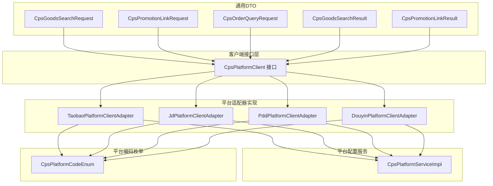
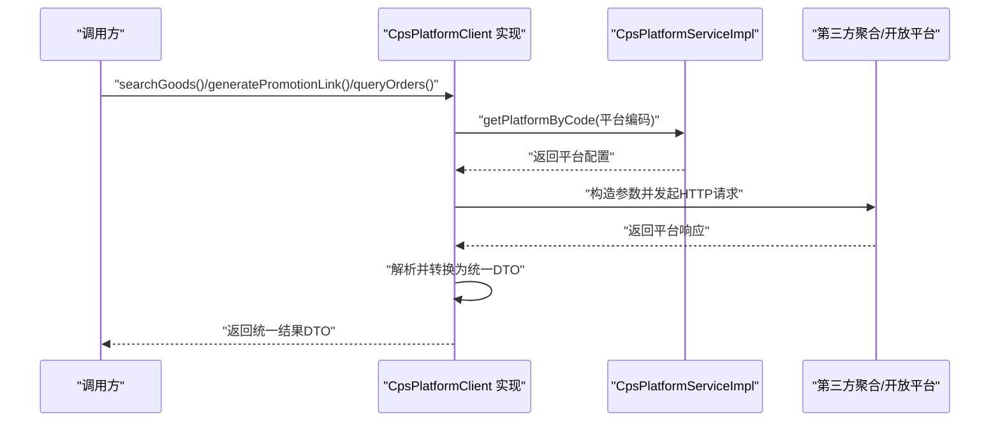
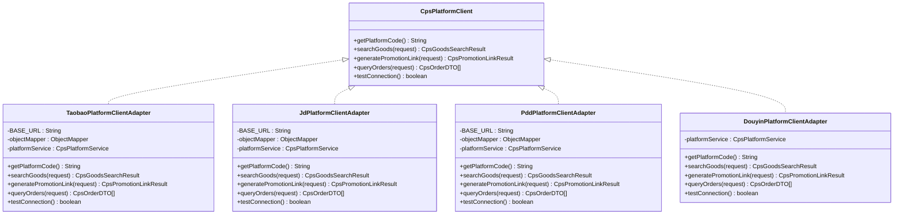
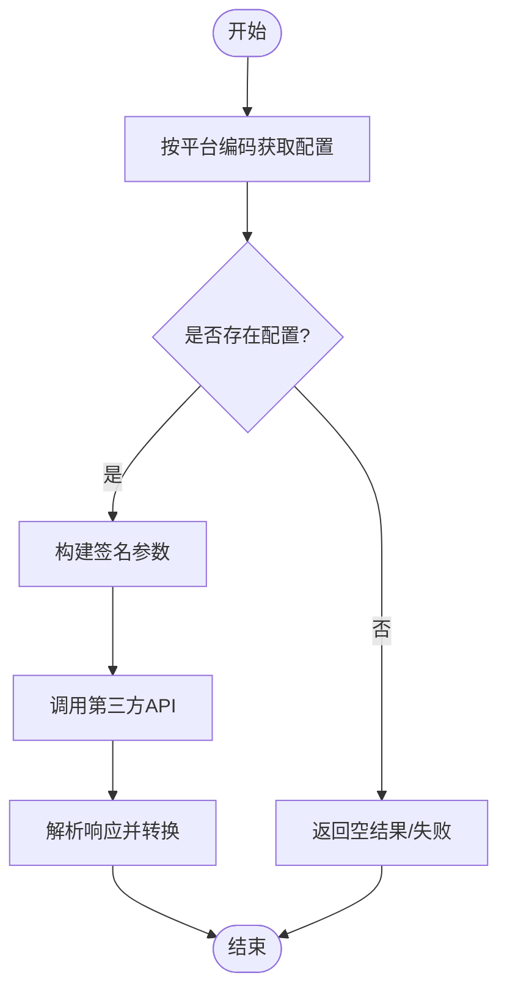
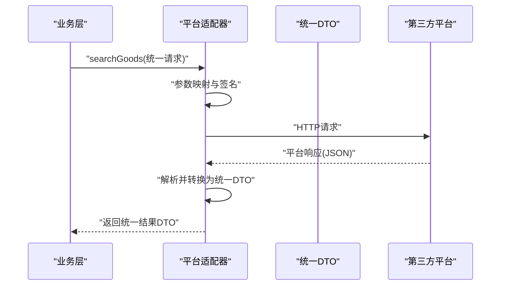
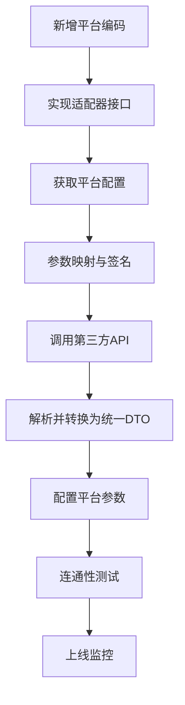
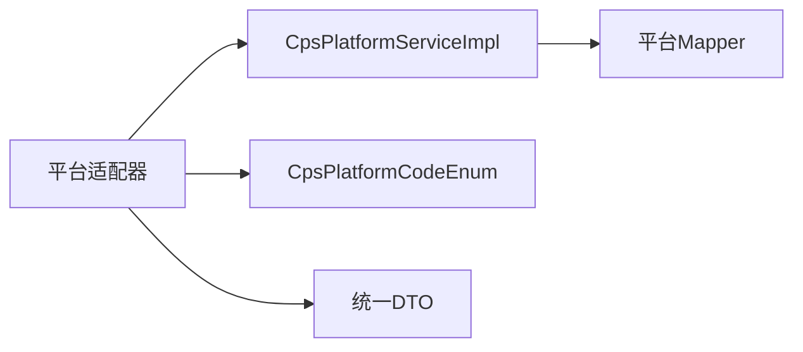

# 平台适配器扩展

<cite>
**本文引用的文件**
- [CpsPlatformClient.java](file://backend/yudao-module-cps/yudao-module-cps-biz/src/main/java/cn/iocoder/yudao/module/cps/client/CpsPlatformClient.java)
- [TaobaoPlatformClientAdapter.java](file://backend/yudao-module-cps/yudao-module-cps-biz/src/main/java/cn/iocoder/yudao/module/cps/client/taobao/TaobaoPlatformClientAdapter.java)
- [JdPlatformClientAdapter.java](file://backend/yudao-module-cps/yudao-module-cps-biz/src/main/java/cn/iocoder/yudao/module/cps/client/jd/JdPlatformClientAdapter.java)
- [PddPlatformClientAdapter.java](file://backend/yudao-module-cps/yudao-module-cps-biz/src/main/java/cn/iocoder/yudao/module/cps/client/pdd/PddPlatformClientAdapter.java)
- [DouyinPlatformClientAdapter.java](file://backend/yudao-module-cps/yudao-module-cps-biz/src/main/java/cn/iocoder/yudao/module/cps/client/douyin/DouyinPlatformClientAdapter.java)
- [CpsPlatformServiceImpl.java](file://backend/yudao-module-cps/yudao-module-cps-biz/src/main/java/cn/iocoder/yudao/module/cps/service/platform/CpsPlatformServiceImpl.java)
- [CpsPlatformCodeEnum.java](file://backend/yudao-module-cps/yudao-module-cps-api/src/main/java/cn/iocoder/yudao/module/cps/enums/CpsPlatformCodeEnum.java)
- [CpsGoodsSearchRequest.java](file://backend/yudao-module-cps/yudao-module-cps-biz/src/main/java/cn/iocoder/yudao/module/cps/client/dto/CpsGoodsSearchRequest.java)
- [CpsPromotionLinkRequest.java](file://backend/yudao-module-cps/yudao-module-cps-biz/src/main/java/cn/iocoder/yudao/module/cps/client/dto/CpsPromotionLinkRequest.java)
- [CpsOrderQueryRequest.java](file://backend/yudao-module-cps/yudao-module-cps-biz/src/main/java/cn/iocoder/yudao/module/cps/client/dto/CpsOrderQueryRequest.java)
- [CpsGoodsSearchResult.java](file://backend/yudao-module-cps/yudao-module-cps-biz/src/main/java/cn/iocoder/yudao/module/cps/client/dto/CpsGoodsSearchResult.java)
- [CpsPromotionLinkResult.java](file://backend/yudao-module-cps/yudao-module-cps-biz/src/main/java/cn/iocoder/yudao/module/cps/client/dto/CpsPromotionLinkResult.java)
</cite>

## 目录
1. [简介](#简介)
2. [项目结构](#项目结构)
3. [核心组件](#核心组件)
4. [架构总览](#架构总览)
5. [组件详解](#组件详解)
6. [依赖关系分析](#依赖关系分析)
7. [性能与并发](#性能与并发)
8. [故障排查与异常处理](#故障排查与异常处理)
9. [结论](#结论)
10. [附录](#附录)

## 简介
本指南面向需要在 CPS 系统中新增平台接入能力的开发者，系统性阐述“适配器模式”在该系统中的落地方式、适配器接口设计与实现规范、新平台接入流程、API 封装与数据转换规则、平台配置与认证、请求参数映射、异常处理与重试、降级策略、测试与集成策略，以及性能优化与并发处理建议。文档以现有实现为依据，提供可操作的扩展步骤与最佳实践。

## 项目结构
CPS 模块采用“接口 + 多实现”的适配器架构，核心接口定义于客户端层，各平台适配器分别实现具体逻辑；平台配置由服务层统一管理，并提供缓存与校验；枚举定义平台编码，确保一致性。

**图示来源**
- [CpsPlatformClient.java:1-55](file://backend/yudao-module-cps/yudao-module-cps-biz/src/main/java/cn/iocoder/yudao/module/cps/client/CpsPlatformClient.java#L1-L55)
- [TaobaoPlatformClientAdapter.java:1-336](file://backend/yudao-module-cps/yudao-module-cps-biz/src/main/java/cn/iocoder/yudao/module/cps/client/taobao/TaobaoPlatformClientAdapter.java#L1-L336)
- [JdPlatformClientAdapter.java:1-292](file://backend/yudao-module-cps/yudao-module-cps-biz/src/main/java/cn/iocoder/yudao/module/cps/client/jd/JdPlatformClientAdapter.java#L1-L292)
- [PddPlatformClientAdapter.java:1-320](file://backend/yudao-module-cps/yudao-module-cps-biz/src/main/java/cn/iocoder/yudao/module/cps/client/pdd/PddPlatformClientAdapter.java#L1-L320)
- [DouyinPlatformClientAdapter.java:1-64](file://backend/yudao-module-cps/yudao-module-cps-biz/src/main/java/cn/iocoder/yudao/module/cps/client/douyin/DouyinPlatformClientAdapter.java#L1-L64)
- [CpsPlatformServiceImpl.java:1-103](file://backend/yudao-module-cps/yudao-module-cps-biz/src/main/java/cn/iocoder/yudao/module/cps/service/platform/CpsPlatformServiceImpl.java#L1-L103)
- [CpsPlatformCodeEnum.java:1-45](file://backend/yudao-module-cps/yudao-module-cps-api/src/main/java/cn/iocoder/yudao/module/cps/enums/CpsPlatformCodeEnum.java#L1-L45)

**章节来源**
- [CpsPlatformClient.java:1-55](file://backend/yudao-module-cps/yudao-module-cps-biz/src/main/java/cn/iocoder/yudao/module/cps/client/CpsPlatformClient.java#L1-L55)
- [CpsPlatformServiceImpl.java:1-103](file://backend/yudao-module-cps/yudao-module-cps-biz/src/main/java/cn/iocoder/yudao/module/cps/service/platform/CpsPlatformServiceImpl.java#L1-L103)
- [CpsPlatformCodeEnum.java:1-45](file://backend/yudao-module-cps/yudao-module-cps-api/src/main/java/cn/iocoder/yudao/module/cps/enums/CpsPlatformCodeEnum.java#L1-L45)

## 核心组件
- 适配器接口：定义统一的平台能力契约，包括商品搜索、推广链接生成、订单查询与连通性测试。
- 平台适配器：按平台实现接口，负责调用第三方聚合 API 或开放平台，完成参数映射与数据转换。
- 平台配置服务：提供平台配置的增删改查、启用列表查询与缓存访问。
- 平台编码枚举：统一平台标识，保证跨模块一致。
- 通用 DTO：屏蔽平台差异，向上层暴露统一的数据结构。

**章节来源**
- [CpsPlatformClient.java:1-55](file://backend/yudao-module-cps/yudao-module-cps-biz/src/main/java/cn/iocoder/yudao/module/cps/client/CpsPlatformClient.java#L1-L55)
- [CpsPlatformServiceImpl.java:1-103](file://backend/yudao-module-cps/yudao-module-cps-biz/src/main/java/cn/iocoder/yudao/module/cps/service/platform/CpsPlatformServiceImpl.java#L1-L103)
- [CpsPlatformCodeEnum.java:1-45](file://backend/yudao-module-cps/yudao-module-cps-api/src/main/java/cn/iocoder/yudao/module/cps/enums/CpsPlatformCodeEnum.java#L1-L45)

## 架构总览
适配器模式通过“策略接口 + 多实现”解耦平台差异，平台配置服务提供统一的配置与缓存，通用 DTO 屏蔽底层差异，形成清晰的职责边界与扩展点。

**图示来源**
- [CpsPlatformClient.java:1-55](file://backend/yudao-module-cps/yudao-module-cps-biz/src/main/java/cn/iocoder/yudao/module/cps/client/CpsPlatformClient.java#L1-L55)
- [CpsPlatformServiceImpl.java:74-84](file://backend/yudao-module-cps/yudao-module-cps-biz/src/main/java/cn/iocoder/yudao/module/cps/service/platform/CpsPlatformServiceImpl.java#L74-L84)
- [TaobaoPlatformClientAdapter.java:51-102](file://backend/yudao-module-cps/yudao-module-cps-biz/src/main/java/cn/iocoder/yudao/module/cps/client/taobao/TaobaoPlatformClientAdapter.java#L51-L102)
- [JdPlatformClientAdapter.java:48-94](file://backend/yudao-module-cps/yudao-module-cps-biz/src/main/java/cn/iocoder/yudao/module/cps/client/jd/JdPlatformClientAdapter.java#L48-L94)
- [PddPlatformClientAdapter.java:48-97](file://backend/yudao-module-cps/yudao-module-cps-biz/src/main/java/cn/iocoder/yudao/module/cps/client/pdd/PddPlatformClientAdapter.java#L48-L97)

## 组件详解

### 适配器接口设计
- 平台编码获取：用于识别当前适配器对应的平台。
- 商品搜索：输入统一请求 DTO，输出统一搜索结果 DTO。
- 推广链接生成：输入统一请求 DTO，输出统一链接结果 DTO。
- 订单查询：输入统一请求 DTO，输出统一订单 DTO 列表。
- 连通性测试：用于平台配置保存时快速验证。

实现要点
- 保持接口稳定，新增平台仅需实现接口，不改动核心逻辑。
- 统一异常兜底：网络异常、解析异常均返回空或空集合，避免影响上层业务。

**章节来源**
- [CpsPlatformClient.java:1-55](file://backend/yudao-module-cps/yudao-module-cps-biz/src/main/java/cn/iocoder/yudao/module/cps/client/CpsPlatformClient.java#L1-L55)

### 平台适配器实现规范
- 统一基地址与签名：多数适配器基于同一聚合平台，采用 appKey/appSecret/timer/nonce/signRan 的签名机制。
- 参数映射：将统一请求 DTO 映射到平台特定参数名与格式。
- 响应解析：统一使用 Jackson 解析 JSON，按平台字段映射到统一 DTO。
- 错误处理：对空响应、非成功状态进行日志记录与降级返回。
- 连通性测试：构造最小参数请求，验证可用性。

**图示来源**
- [CpsPlatformClient.java:1-55](file://backend/yudao-module-cps/yudao-module-cps-biz/src/main/java/cn/iocoder/yudao/module/cps/client/CpsPlatformClient.java#L1-L55)
- [TaobaoPlatformClientAdapter.java:1-336](file://backend/yudao-module-cps/yudao-module-cps-biz/src/main/java/cn/iocoder/yudao/module/cps/client/taobao/TaobaoPlatformClientAdapter.java#L1-L336)
- [JdPlatformClientAdapter.java:1-292](file://backend/yudao-module-cps/yudao-module-cps-biz/src/main/java/cn/iocoder/yudao/module/cps/client/jd/JdPlatformClientAdapter.java#L1-L292)
- [PddPlatformClientAdapter.java:1-320](file://backend/yudao-module-cps/yudao-module-cps-biz/src/main/java/cn/iocoder/yudao/module/cps/client/pdd/PddPlatformClientAdapter.java#L1-L320)
- [DouyinPlatformClientAdapter.java:1-64](file://backend/yudao-module-cps/yudao-module-cps-biz/src/main/java/cn/iocoder/yudao/module/cps/client/douyin/DouyinPlatformClientAdapter.java#L1-L64)

### 平台配置与认证
- 配置来源：通过平台配置服务按平台编码获取配置，包含 appKey、appSecret、默认推广位等。
- 缓存策略：按平台编码缓存配置，减少数据库访问。
- 启用列表：仅对启用状态的平台参与业务流程。
- 认证方式：统一采用签名参数（appKey、timer、nonce、signRan）进行鉴权。

**图示来源**
- [CpsPlatformServiceImpl.java:74-84](file://backend/yudao-module-cps/yudao-module-cps-biz/src/main/java/cn/iocoder/yudao/module/cps/service/platform/CpsPlatformServiceImpl.java#L74-L84)
- [TaobaoPlatformClientAdapter.java:214-252](file://backend/yudao-module-cps/yudao-module-cps-biz/src/main/java/cn/iocoder/yudao/module/cps/client/taobao/TaobaoPlatformClientAdapter.java#L214-L252)
- [JdPlatformClientAdapter.java:199-231](file://backend/yudao-module-cps/yudao-module-cps-biz/src/main/java/cn/iocoder/yudao/module/cps/client/jd/JdPlatformClientAdapter.java#L199-L231)
- [PddPlatformClientAdapter.java:199-231](file://backend/yudao-module-cps/yudao-module-cps-biz/src/main/java/cn/iocoder/yudao/module/cps/client/pdd/PddPlatformClientAdapter.java#L199-L231)

**章节来源**
- [CpsPlatformServiceImpl.java:1-103](file://backend/yudao-module-cps/yudao-module-cps-biz/src/main/java/cn/iocoder/yudao/module/cps/service/platform/CpsPlatformServiceImpl.java#L1-L103)
- [CpsPlatformCodeEnum.java:1-45](file://backend/yudao-module-cps/yudao-module-cps-api/src/main/java/cn/iocoder/yudao/module/cps/enums/CpsPlatformCodeEnum.java#L1-L45)

### API 接口封装与数据转换
- 商品搜索：将关键词、分页、价格区间、排序、是否有券等映射到平台参数；解析商品列表、总数、下一页标识等。
- 推广链接：根据平台差异传入 goodsId/goodsSign/adzoneId/channelId/itemLink 等；解析短链、长链、淘口令、移动端链接、佣金率等。
- 订单查询：将查询类型、起止时间、分页、游标等映射到平台参数；解析订单号、商品信息、金额、状态、时间等。
- 价格与比率：统一使用 BigDecimal 表示金额与百分比，注意平台单位换算（如拼多多价格单位为分）。

**图示来源**
- [TaobaoPlatformClientAdapter.java:51-102](file://backend/yudao-module-cps/yudao-module-cps-biz/src/main/java/cn/iocoder/yudao/module/cps/client/taobao/TaobaoPlatformClientAdapter.java#L51-L102)
- [JdPlatformClientAdapter.java:48-94](file://backend/yudao-module-cps/yudao-module-cps-biz/src/main/java/cn/iocoder/yudao/module/cps/client/jd/JdPlatformClientAdapter.java#L48-L94)
- [PddPlatformClientAdapter.java:48-97](file://backend/yudao-module-cps/yudao-module-cps-biz/src/main/java/cn/iocoder/yudao/module/cps/client/pdd/PddPlatformClientAdapter.java#L48-L97)

**章节来源**
- [CpsGoodsSearchRequest.java:1-61](file://backend/yudao-module-cps/yudao-module-cps-biz/src/main/java/cn/iocoder/yudao/module/cps/client/dto/CpsGoodsSearchRequest.java#L1-L61)
- [CpsPromotionLinkRequest.java:1-44](file://backend/yudao-module-cps/yudao-module-cps-biz/src/main/java/cn/iocoder/yudao/module/cps/client/dto/CpsPromotionLinkRequest.java#L1-L44)
- [CpsOrderQueryRequest.java:1-49](file://backend/yudao-module-cps/yudao-module-cps-biz/src/main/java/cn/iocoder/yudao/module/cps/client/dto/CpsOrderQueryRequest.java#L1-L49)
- [CpsGoodsSearchResult.java:1-43](file://backend/yudao-module-cps/yudao-module-cps-biz/src/main/java/cn/iocoder/yudao/module/cps/client/dto/CpsGoodsSearchResult.java#L1-L43)
- [CpsPromotionLinkResult.java:1-58](file://backend/yudao-module-cps/yudao-module-cps-biz/src/main/java/cn/iocoder/yudao/module/cps/client/dto/CpsPromotionLinkResult.java#L1-L58)

### 新平台接入流程
- 定义平台编码：在平台编码枚举中新增平台代码与名称。
- 实现适配器：新建适配器类实现接口，完成以下工作：
  - 获取平台配置：通过平台服务按编码获取配置。
  - 构造签名与参数：按平台要求映射统一 DTO 字段。
  - 发起请求与解析：使用 HTTP 工具与 JSON 解析器处理响应。
  - 转换为统一 DTO：将平台字段映射到统一模型。
- 配置平台：在平台配置页面维护 appKey/appSecret、默认推广位等。
- 连通性测试：调用 testConnection 验证配置正确。
- 上线与监控：观察日志与指标，确保稳定运行。

**图示来源**
- [CpsPlatformCodeEnum.java:16-22](file://backend/yudao-module-cps/yudao-module-cps-api/src/main/java/cn/iocoder/yudao/module/cps/enums/CpsPlatformCodeEnum.java#L16-L22)
- [CpsPlatformClient.java:14-52](file://backend/yudao-module-cps/yudao-module-cps-biz/src/main/java/cn/iocoder/yudao/module/cps/client/CpsPlatformClient.java#L14-L52)
- [CpsPlatformServiceImpl.java:74-84](file://backend/yudao-module-cps/yudao-module-cps-biz/src/main/java/cn/iocoder/yudao/module/cps/service/platform/CpsPlatformServiceImpl.java#L74-L84)

**章节来源**
- [CpsPlatformCodeEnum.java:1-45](file://backend/yudao-module-cps/yudao-module-cps-api/src/main/java/cn/iocoder/yudao/module/cps/enums/CpsPlatformCodeEnum.java#L1-L45)
- [CpsPlatformClient.java:1-55](file://backend/yudao-module-cps/yudao-module-cps-biz/src/main/java/cn/iocoder/yudao/module/cps/client/CpsPlatformClient.java#L1-L55)
- [CpsPlatformServiceImpl.java:1-103](file://backend/yudao-module-cps/yudao-module-cps-biz/src/main/java/cn/iocoder/yudao/module/cps/service/platform/CpsPlatformServiceImpl.java#L1-L103)

### 动态加载与运行时切换
- Spring Bean 注册：适配器以组件形式注册为 Spring Bean，按平台编码自动识别。
- 运行时选择：通过平台编码在运行时选择对应适配器实例，无需硬编码分支。
- 配置驱动：平台启用状态与配置变更通过配置服务与缓存控制生效。

**章节来源**
- [TaobaoPlatformClientAdapter.java:24-31](file://backend/yudao-module-cps/yudao-module-cps-biz/src/main/java/cn/iocoder/yudao/module/cps/client/taobao/TaobaoPlatformClientAdapter.java#L24-L31)
- [JdPlatformClientAdapter.java:26-28](file://backend/yudao-module-cps/yudao-module-cps-biz/src/main/java/cn/iocoder/yudao/module/cps/client/jd/JdPlatformClientAdapter.java#L26-L28)
- [PddPlatformClientAdapter.java:26-28](file://backend/yudao-module-cps/yudao-module-cps-biz/src/main/java/cn/iocoder/yudao/module/cps/client/pdd/PddPlatformClientAdapter.java#L26-L28)
- [DouyinPlatformClientAdapter.java:22-24](file://backend/yudao-module-cps/yudao-module-cps-biz/src/main/java/cn/iocoder/yudao/module/cps/client/douyin/DouyinPlatformClientAdapter.java#L22-L24)
- [CpsPlatformServiceImpl.java:74-84](file://backend/yudao-module-cps/yudao-module-cps-biz/src/main/java/cn/iocoder/yudao/module/cps/service/platform/CpsPlatformServiceImpl.java#L74-L84)

### 异常处理、重试与降级
- 异常处理：网络异常、JSON 解析异常、第三方返回非成功状态时记录日志并返回空结果。
- 重试策略：建议在上层业务或网关层引入指数退避重试，避免雪崩。
- 降级方案：当第三方不可用或超时时，返回空结果或兜底数据，保证主流程可用。

**章节来源**
- [TaobaoPlatformClientAdapter.java:98-101](file://backend/yudao-module-cps/yudao-module-cps-biz/src/main/java/cn/iocoder/yudao/module/cps/client/taobao/TaobaoPlatformClientAdapter.java#L98-L101)
- [JdPlatformClientAdapter.java:90-94](file://backend/yudao-module-cps/yudao-module-cps-biz/src/main/java/cn/iocoder/yudao/module/cps/client/jd/JdPlatformClientAdapter.java#L90-L94)
- [PddPlatformClientAdapter.java:93-97](file://backend/yudao-module-cps/yudao-module-cps-biz/src/main/java/cn/iocoder/yudao/module/cps/client/pdd/PddPlatformClientAdapter.java#L93-L97)

### 测试方法与集成策略
- 单元测试：针对适配器的关键方法（搜索、转链、订单查询）编写测试，使用桩对象模拟平台配置与 HTTP 响应。
- 集成测试：在测试环境配置真实平台参数，执行端到端流程，覆盖正常与异常场景。
- 模拟数据：准备不同字段组合的模拟响应，验证解析与转换逻辑。

**章节来源**
- [TaobaoPlatformClientAdapter.java:187-199](file://backend/yudao-module-cps/yudao-module-cps-biz/src/main/java/cn/iocoder/yudao/module/cps/client/taobao/TaobaoPlatformClientAdapter.java#L187-L199)
- [JdPlatformClientAdapter.java:168-187](file://backend/yudao-module-cps/yudao-module-cps-biz/src/main/java/cn/iocoder/yudao/module/cps/client/jd/JdPlatformClientAdapter.java#L168-L187)
- [PddPlatformClientAdapter.java:169-187](file://backend/yudao-module-cps/yudao-module-cps-biz/src/main/java/cn/iocoder/yudao/module/cps/client/pdd/PddPlatformClientAdapter.java#L169-L187)

## 依赖关系分析
- 适配器依赖平台配置服务：通过平台编码获取配置，再进行签名与请求。
- 适配器之间相互独立：新增平台不影响其他平台。
- 配置服务依赖持久层：提供缓存与唯一性校验。
- 枚举统一平台标识：避免字符串散落。

**图示来源**
- [CpsPlatformServiceImpl.java:1-103](file://backend/yudao-module-cps/yudao-module-cps-biz/src/main/java/cn/iocoder/yudao/module/cps/service/platform/CpsPlatformServiceImpl.java#L1-L103)
- [CpsPlatformCodeEnum.java:1-45](file://backend/yudao-module-cps/yudao-module-cps-api/src/main/java/cn/iocoder/yudao/module/cps/enums/CpsPlatformCodeEnum.java#L1-L45)

**章节来源**
- [CpsPlatformServiceImpl.java:1-103](file://backend/yudao-module-cps/yudao-module-cps-biz/src/main/java/cn/iocoder/yudao/module/cps/service/platform/CpsPlatformServiceImpl.java#L1-L103)

## 性能与并发
- 缓存策略：平台配置按编码缓存，降低数据库压力。
- 并发控制：HTTP 请求设置合理超时与并发上限，避免打满第三方接口。
- 日志采样：对高频错误进行采样记录，避免日志风暴。
- 结果分页：严格遵循分页参数，避免一次性拉取过多数据。

**章节来源**
- [CpsPlatformServiceImpl.java:80-84](file://backend/yudao-module-cps/yudao-module-cps-biz/src/main/java/cn/iocoder/yudao/module/cps/service/platform/CpsPlatformServiceImpl.java#L80-L84)

## 故障排查与异常处理
- 连接测试：通过 testConnection 快速定位配置问题。
- 日志定位：关注请求路径、响应体与异常栈，结合平台返回码判断失败原因。
- 降级回退：在网络抖动或第三方限流时，返回空结果并提示重试。

**章节来源**
- [TaobaoPlatformClientAdapter.java:187-199](file://backend/yudao-module-cps/yudao-module-cps-biz/src/main/java/cn/iocoder/yudao/module/cps/client/taobao/TaobaoPlatformClientAdapter.java#L187-L199)
- [JdPlatformClientAdapter.java:168-187](file://backend/yudao-module-cps/yudao-module-cps-biz/src/main/java/cn/iocoder/yudao/module/cps/client/jd/JdPlatformClientAdapter.java#L168-L187)
- [PddPlatformClientAdapter.java:169-187](file://backend/yudao-module-cps/yudao-module-cps-biz/src/main/java/cn/iocoder/yudao/module/cps/client/pdd/PddPlatformClientAdapter.java#L169-L187)

## 结论
通过“接口 + 多实现”的适配器模式，CPS 系统实现了对多平台的统一抽象与灵活扩展。遵循本文的接口设计、参数映射、数据转换、配置与缓存、异常与重试、测试与性能优化建议，可以高效、安全地接入新平台并保障线上稳定性。

## 附录
- 平台编码枚举：用于标识平台，确保跨模块一致性。
- 统一请求 DTO：屏蔽平台差异，便于扩展与维护。
- 统一结果 DTO：向上层提供一致的数据结构。

**章节来源**
- [CpsPlatformCodeEnum.java:1-45](file://backend/yudao-module-cps/yudao-module-cps-api/src/main/java/cn/iocoder/yudao/module/cps/enums/CpsPlatformCodeEnum.java#L1-L45)
- [CpsGoodsSearchRequest.java:1-61](file://backend/yudao-module-cps/yudao-module-cps-biz/src/main/java/cn/iocoder/yudao/module/cps/client/dto/CpsGoodsSearchRequest.java#L1-L61)
- [CpsPromotionLinkRequest.java:1-44](file://backend/yudao-module-cps/yudao-module-cps-biz/src/main/java/cn/iocoder/yudao/module/cps/client/dto/CpsPromotionLinkRequest.java#L1-L44)
- [CpsOrderQueryRequest.java:1-49](file://backend/yudao-module-cps/yudao-module-cps-biz/src/main/java/cn/iocoder/yudao/module/cps/client/dto/CpsOrderQueryRequest.java#L1-L49)
- [CpsGoodsSearchResult.java:1-43](file://backend/yudao-module-cps/yudao-module-cps-biz/src/main/java/cn/iocoder/yudao/module/cps/client/dto/CpsGoodsSearchResult.java#L1-L43)
- [CpsPromotionLinkResult.java:1-58](file://backend/yudao-module-cps/yudao-module-cps-biz/src/main/java/cn/iocoder/yudao/module/cps/client/dto/CpsPromotionLinkResult.java#L1-L58)