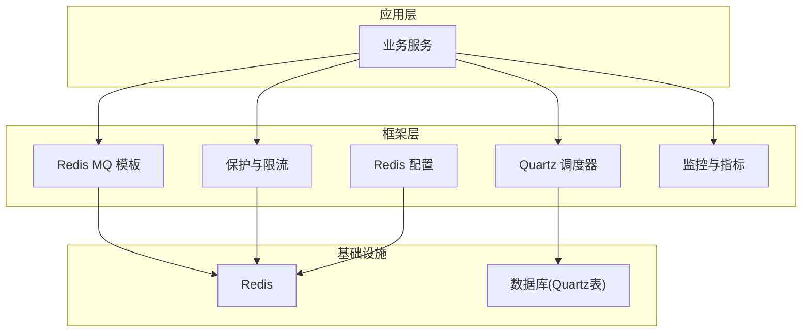
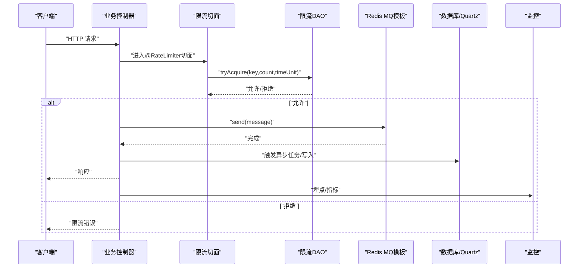
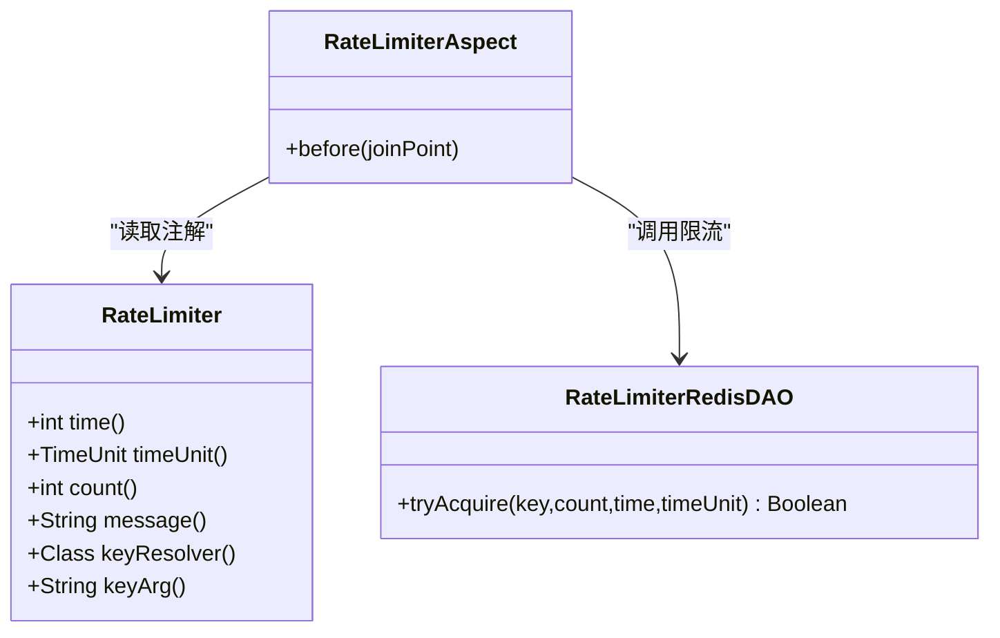
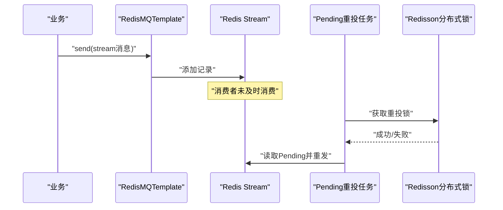
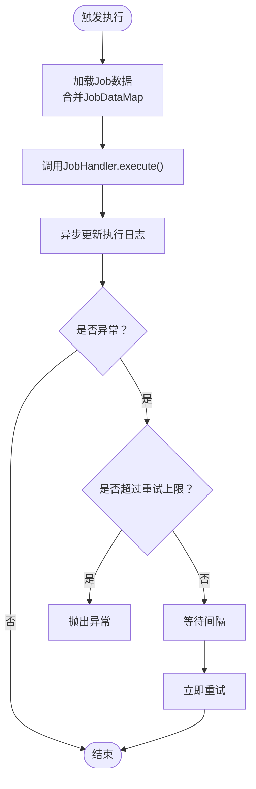
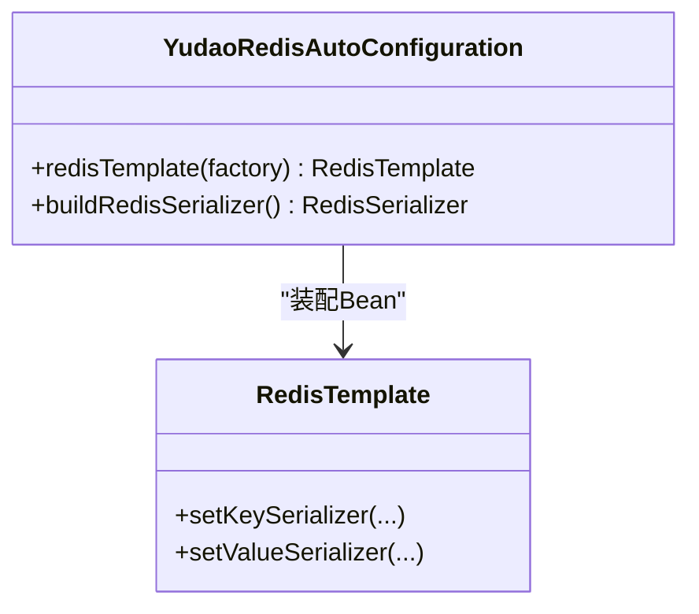
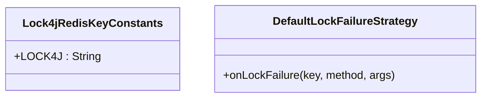
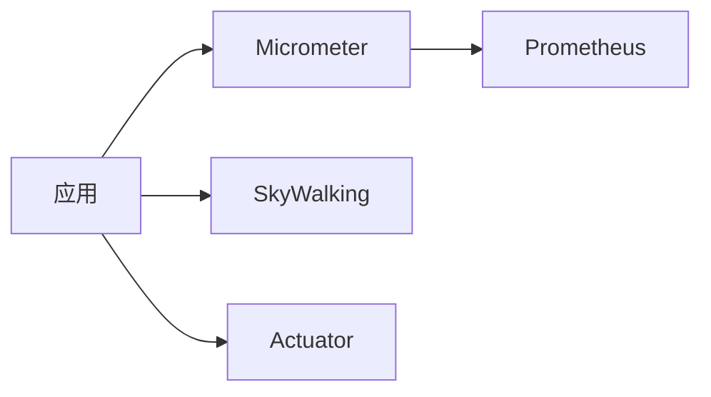
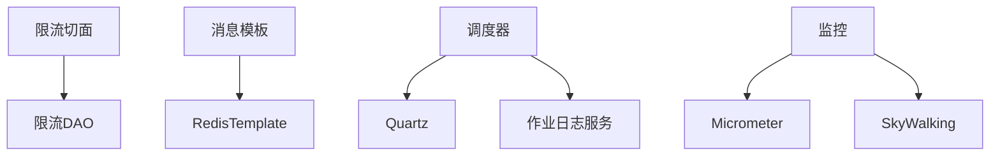

# 性能扩展

<cite>
**本文引用的文件**
- [RateLimiterRedisDAO.java](file://backend/yudao-framework/yudao-spring-boot-starter-protection/src/main/java/cn/iocoder/yudao/framework/ratelimiter/core/redis/RateLimiterRedisDAO.java)
- [RateLimiterAspect.java](file://backend/yudao-framework/yudao-spring-boot-starter-protection/src/main/java/cn/iocoder/yudao/framework/ratelimiter/core/aop/RateLimiterAspect.java)
- [RateLimiter.java](file://backend/yudao-framework/yudao-spring-boot-starter-protection/src/main/java/cn/iocoder/yudao/framework/ratelimiter/core/annotation/RateLimiter.java)
- [RedisMQTemplate.java](file://backend/yudao-framework/yudao-spring-boot-starter-mq/src/main/java/cn/iocoder/yudao/framework/mq/redis/core/RedisMQTemplate.java)
- [RedisPendingMessageResendJob.java](file://backend/yudao-framework/yudao-spring-boot-starter-mq/src/main/java/cn/iocoder/yudao/framework/mq/redis/core/job/RedisPendingMessageResendJob.java)
- [SchedulerManager.java](file://backend/yudao-framework/yudao-spring-boot-starter-job/src/main/java/cn/iocoder/yudao/framework/quartz/core/scheduler/SchedulerManager.java)
- [JobHandlerInvoker.java](file://backend/yudao-framework/yudao-spring-boot-starter-job/src/main/java/cn/iocoder/yudao/framework/quartz/core/handler/JobHandlerInvoker.java)
- [JobDataKeyEnum.java](file://backend/yudao-framework/yudao-spring-boot-starter-job/src/main/java/cn/iocoder/yudao/framework/quartz/core/enums/JobDataKeyEnum.java)
- [YudaoRedisAutoConfiguration.java](file://backend/yudao-framework/yudao-spring-boot-starter-redis/src/main/java/cn/iocoder/yudao/framework/redis/config/YudaoRedisAutoConfiguration.java)
- [Lock4jRedisKeyConstants.java](file://backend/yudao-framework/yudao-spring-boot-starter-protection/src/main/java/cn/iocoder/yudao/framework/lock4j/core/Lock4jRedisKeyConstants.java)
- [DefaultLockFailureStrategy.java](file://backend/yudao-framework/yudao-spring-boot-starter-protection/src/main/java/cn/iocoder/yudao/framework/lock4j/core/DefaultLockFailureStrategy.java)
- [YudaoMetricsAutoConfiguration.java](file://backend/yudao-framework/yudao-spring-boot-starter-monitor/src/main/java/cn/iocoder/yudao/framework/tracer/config/YudaoMetricsAutoConfiguration.java)
- [pom.xml（监控模块）](file://backend/yudao-framework/yudao-spring-boot-starter-monitor/pom.xml)
- [deploy.sh](file://backend/script/shell/deploy.sh)
- [Dockerfile](file://backend/yudao-server/Dockerfile)
- [quartz.sql（Oracle）](file://backend/sql/oracle/quartz.sql)
</cite>

## 目录
1. [简介](#简介)
2. [项目结构](#项目结构)
3. [核心组件](#核心组件)
4. [架构总览](#架构总览)
5. [详细组件分析](#详细组件分析)
6. [依赖分析](#依赖分析)
7. [性能考量](#性能考量)
8. [故障排查指南](#故障排查指南)
9. [结论](#结论)
10. [附录](#附录)

## 简介
本指南聚焦于AgenticCPS在后端框架中的性能扩展实践，围绕以下主题展开：缓存策略与一致性、缓存穿透防护、异步处理与消息队列、任务调度优化、数据库性能与索引、分布式锁与限流、熔断降级、监控与性能分析、内存与JVM调优、以及性能测试与回归策略。文档以仓库现有实现为基础，结合可扩展的最佳实践，帮助读者在不破坏现有架构的前提下提升系统吞吐与稳定性。

## 项目结构
后端采用多模块分层设计，性能相关能力主要分布在以下模块：
- 保护与限流：yudao-spring-boot-starter-protection（Redisson限流、分布式锁）
- 消息队列：yudao-spring-boot-starter-mq（Redis Stream/Pub/Sub封装）
- 任务调度：yudao-spring-boot-starter-job（Quartz封装）
- 缓存与序列化：yudao-spring-boot-starter-redis（自定义RedisTemplate）
- 监控：yudao-spring-boot-starter-monitor（Micrometer+Prometheus/SkyWalking）
- 部署与运行：yudao-server（Dockerfile）、script/shell/deploy.sh（JVM参数）

**图表来源**
- [RedisMQTemplate.java:1-88](file://backend/yudao-framework/yudao-spring-boot-starter-mq/src/main/java/cn/iocoder/yudao/framework/mq/redis/core/RedisMQTemplate.java#L1-L88)
- [SchedulerManager.java:1-39](file://backend/yudao-framework/yudao-spring-boot-starter-job/src/main/java/cn/iocoder/yudao/framework/quartz/core/scheduler/SchedulerManager.java#L1-L39)
- [YudaoRedisAutoConfiguration.java:1-46](file://backend/yudao-framework/yudao-spring-boot-starter-redis/src/main/java/cn/iocoder/yudao/framework/redis/config/YudaoRedisAutoConfiguration.java#L1-L46)
- [RateLimiterRedisDAO.java:1-66](file://backend/yudao-framework/yudao-spring-boot-starter-protection/src/main/java/cn/iocoder/yudao/framework/ratelimiter/core/redis/RateLimiterRedisDAO.java#L1-L66)
- [YudaoMetricsAutoConfiguration.java:1-27](file://backend/yudao-framework/yudao-spring-boot-starter-monitor/src/main/java/cn/iocoder/yudao/framework/tracer/config/YudaoMetricsAutoConfiguration.java#L1-L27)

**章节来源**
- [RedisMQTemplate.java:1-88](file://backend/yudao-framework/yudao-spring-boot-starter-mq/src/main/java/cn/iocoder/yudao/framework/mq/redis/core/RedisMQTemplate.java#L1-L88)
- [SchedulerManager.java:1-39](file://backend/yudao-framework/yudao-spring-boot-starter-job/src/main/java/cn/iocoder/yudao/framework/quartz/core/scheduler/SchedulerManager.java#L1-L39)
- [YudaoRedisAutoConfiguration.java:1-46](file://backend/yudao-framework/yudao-spring-boot-starter-redis/src/main/java/cn/iocoder/yudao/framework/redis/config/YudaoRedisAutoConfiguration.java#L1-L46)
- [RateLimiterRedisDAO.java:1-66](file://backend/yudao-framework/yudao-spring-boot-starter-protection/src/main/java/cn/iocoder/yudao/framework/ratelimiter/core/redis/RateLimiterRedisDAO.java#L1-L66)
- [YudaoMetricsAutoConfiguration.java:1-27](file://backend/yudao-framework/yudao-spring-boot-starter-monitor/src/main/java/cn/iocoder/yudao/framework/tracer/config/YudaoMetricsAutoConfiguration.java#L1-L27)

## 核心组件
- 限流与幂等：基于Redisson的限流器与注解切面，支持多种Key解析器；幂等通过Redis短命Key实现。
- 消息队列：统一的Redis MQ模板，支持Pub/Sub与Stream两种模式，具备拦截器扩展点。
- 任务调度：Quartz封装，提供任务注册、日志记录、重试控制与并发约束。
- 缓存与序列化：自定义JSON序列化的RedisTemplate，解决时间类型序列化问题。
- 分布式锁：基于Redisson的RLock封装，提供失败策略与键空间规范。
- 监控：Micrometer集成Prometheus，SkyWalking链路追踪，Actuator端点。

**章节来源**
- [RateLimiterAspect.java:1-35](file://backend/yudao-framework/yudao-spring-boot-starter-protection/src/main/java/cn/iocoder/yudao/framework/ratelimiter/core/aop/RateLimiterAspect.java#L1-L35)
- [RateLimiter.java:1-62](file://backend/yudao-framework/yudao-spring-boot-starter-protection/src/main/java/cn/iocoder/yudao/framework/ratelimiter/core/annotation/RateLimiter.java#L1-L62)
- [RedisMQTemplate.java:1-88](file://backend/yudao-framework/yudao-spring-boot-starter-mq/src/main/java/cn/iocoder/yudao/framework/mq/redis/core/RedisMQTemplate.java#L1-L88)
- [JobHandlerInvoker.java:1-114](file://backend/yudao-framework/yudao-spring-boot-starter-job/src/main/java/cn/iocoder/yudao/framework/quartz/core/handler/JobHandlerInvoker.java#L1-L114)
- [YudaoRedisAutoConfiguration.java:1-46](file://backend/yudao-framework/yudao-spring-boot-starter-redis/src/main/java/cn/iocoder/yudao/framework/redis/config/YudaoRedisAutoConfiguration.java#L1-L46)
- [Lock4jRedisKeyConstants.java:1-19](file://backend/yudao-framework/yudao-spring-boot-starter-protection/src/main/java/cn/iocoder/yudao/framework/lock4j/core/Lock4jRedisKeyConstants.java#L1-L19)

## 架构总览
下图展示从接口到持久层的关键路径，包括限流、消息发送、任务调度与监控埋点：

**图表来源**
- [RateLimiterAspect.java:1-35](file://backend/yudao-framework/yudao-spring-boot-starter-protection/src/main/java/cn/iocoder/yudao/framework/ratelimiter/core/aop/RateLimiterAspect.java#L1-L35)
- [RateLimiterRedisDAO.java:1-66](file://backend/yudao-framework/yudao-spring-boot-starter-protection/src/main/java/cn/iocoder/yudao/framework/ratelimiter/core/redis/RateLimiterRedisDAO.java#L1-L66)
- [RedisMQTemplate.java:1-88](file://backend/yudao-framework/yudao-spring-boot-starter-mq/src/main/java/cn/iocoder/yudao/framework/mq/redis/core/RedisMQTemplate.java#L1-L88)

## 详细组件分析

### 组件A：限流与幂等
- 限流注解与切面：通过注解声明限流规则，切面在方法执行前尝试获取令牌，支持按全局、用户、IP、服务节点或SpEL表达式生成Key。
- 限流实现：基于Redisson的RRateLimiter，动态设置速率与过期时间，避免重复配置开销。
- 幂等：通过Redis短命Key实现，重复请求在Key存在期间直接拒绝，异常时可选删除Key。

**图表来源**
- [RateLimiter.java:1-62](file://backend/yudao-framework/yudao-spring-boot-starter-protection/src/main/java/cn/iocoder/yudao/framework/ratelimiter/core/annotation/RateLimiter.java#L1-L62)
- [RateLimiterAspect.java:1-35](file://backend/yudao-framework/yudao-spring-boot-starter-protection/src/main/java/cn/iocoder/yudao/framework/ratelimiter/core/aop/RateLimiterAspect.java#L1-L35)
- [RateLimiterRedisDAO.java:1-66](file://backend/yudao-framework/yudao-spring-boot-starter-protection/src/main/java/cn/iocoder/yudao/framework/ratelimiter/core/redis/RateLimiterRedisDAO.java#L1-L66)

**章节来源**
- [RateLimiter.java:1-62](file://backend/yudao-framework/yudao-spring-boot-starter-protection/src/main/java/cn/iocoder/yudao/framework/ratelimiter/core/annotation/RateLimiter.java#L1-L62)
- [RateLimiterAspect.java:1-35](file://backend/yudao-framework/yudao-spring-boot-starter-protection/src/main/java/cn/iocoder/yudao/framework/ratelimiter/core/aop/RateLimiterAspect.java#L1-L35)
- [RateLimiterRedisDAO.java:1-66](file://backend/yudao-framework/yudao-spring-boot-starter-protection/src/main/java/cn/iocoder/yudao/framework/ratelimiter/core/redis/RateLimiterRedisDAO.java#L1-L66)

### 组件B：消息队列与异步处理
- Redis MQ模板：统一封装Pub/Sub与Stream两种模式，支持拦截器链，便于扩展埋点与治理。
- Pending消息重投：定时扫描Stream中超时未消费的消息，加分布式锁避免并发重投。
- 适用场景：订单异步通知、日志上报、报表生成等。

**图表来源**
- [RedisMQTemplate.java:1-88](file://backend/yudao-framework/yudao-spring-boot-starter-mq/src/main/java/cn/iocoder/yudao/framework/mq/redis/core/RedisMQTemplate.java#L1-L88)
- [RedisPendingMessageResendJob.java:1-37](file://backend/yudao-framework/yudao-spring-boot-starter-mq/src/main/java/cn/iocoder/yudao/framework/mq/redis/core/job/RedisPendingMessageResendJob.java#L1-L37)

**章节来源**
- [RedisMQTemplate.java:1-88](file://backend/yudao-framework/yudao-spring-boot-starter-mq/src/main/java/cn/iocoder/yudao/framework/mq/redis/core/RedisMQTemplate.java#L1-L88)
- [RedisPendingMessageResendJob.java:1-37](file://backend/yudao-framework/yudao-spring-boot-starter-mq/src/main/java/cn/iocoder/yudao/framework/mq/redis/core/job/RedisPendingMessageResendJob.java#L1-L37)

### 组件C：任务调度与重试
- 调度管理：SchedulerManager负责创建与注册Quartz任务，使用jobHandlerName作为唯一标识。
- 任务执行：JobHandlerInvoker实现并发约束与结果记录，支持重试次数与间隔。
- 日志与可观测：异步更新任务执行日志，便于排障与统计。

**图表来源**
- [JobHandlerInvoker.java:1-114](file://backend/yudao-framework/yudao-spring-boot-starter-job/src/main/java/cn/iocoder/yudao/framework/quartz/core/handler/JobHandlerInvoker.java#L1-L114)
- [JobDataKeyEnum.java:1-15](file://backend/yudao-framework/yudao-spring-boot-starter-job/src/main/java/cn/iocoder/yudao/framework/quartz/core/enums/JobDataKeyEnum.java#L1-L15)
- [SchedulerManager.java:1-39](file://backend/yudao-framework/yudao-spring-boot-starter-job/src/main/java/cn/iocoder/yudao/framework/quartz/core/scheduler/SchedulerManager.java#L1-L39)

**章节来源**
- [JobHandlerInvoker.java:1-114](file://backend/yudao-framework/yudao-spring-boot-starter-job/src/main/java/cn/iocoder/yudao/framework/quartz/core/handler/JobHandlerInvoker.java#L1-L114)
- [JobDataKeyEnum.java:1-15](file://backend/yudao-framework/yudao-spring-boot-starter-job/src/main/java/cn/iocoder/yudao/framework/quartz/core/enums/JobDataKeyEnum.java#L1-L15)
- [SchedulerManager.java:1-39](file://backend/yudao-framework/yudao-spring-boot-starter-job/src/main/java/cn/iocoder/yudao/framework/quartz/core/scheduler/SchedulerManager.java#L1-L39)

### 组件D：缓存与序列化
- 自定义RedisTemplate：KEY使用字符串序列化，VALUE使用JSON序列化（含JavaTimeModule），确保时间字段正确序列化。
- 适用场景：对象缓存、消息体序列化、分布式锁状态存储。

**图表来源**
- [YudaoRedisAutoConfiguration.java:1-46](file://backend/yudao-framework/yudao-spring-boot-starter-redis/src/main/java/cn/iocoder/yudao/framework/redis/config/YudaoRedisAutoConfiguration.java#L1-L46)

**章节来源**
- [YudaoRedisAutoConfiguration.java:1-46](file://backend/yudao-framework/yudao-spring-boot-starter-redis/src/main/java/cn/iocoder/yudao/framework/redis/config/YudaoRedisAutoConfiguration.java#L1-L46)

### 组件E：分布式锁与失败策略
- 键空间规范：统一前缀命名，便于运维与清理。
- 失败策略：获取锁失败时抛出自定义业务异常，避免静默失败。

**图表来源**
- [Lock4jRedisKeyConstants.java:1-19](file://backend/yudao-framework/yudao-spring-boot-starter-protection/src/main/java/cn/iocoder/yudao/framework/lock4j/core/Lock4jRedisKeyConstants.java#L1-L19)
- [DefaultLockFailureStrategy.java:1-21](file://backend/yudao-framework/yudao-spring-boot-starter-protection/src/main/java/cn/iocoder/yudao/framework/lock4j/core/DefaultLockFailureStrategy.java#L1-L21)

**章节来源**
- [Lock4jRedisKeyConstants.java:1-19](file://backend/yudao-framework/yudao-spring-boot-starter-protection/src/main/java/cn/iocoder/yudao/framework/lock4j/core/Lock4jRedisKeyConstants.java#L1-L19)
- [DefaultLockFailureStrategy.java:1-21](file://backend/yudao-framework/yudao-spring-boot-starter-protection/src/main/java/cn/iocoder/yudao/framework/lock4j/core/DefaultLockFailureStrategy.java#L1-L21)

### 组件F：监控与指标
- Micrometer集成：自动注入MeterRegistry并设置通用标签，便于Prometheus抓取。
- SkyWalking：可选的链路追踪与日志工具包，配合Agent使用。
- Actuator：健康检查与运行时指标端点。

**图表来源**
- [YudaoMetricsAutoConfiguration.java:1-27](file://backend/yudao-framework/yudao-spring-boot-starter-monitor/src/main/java/cn/iocoder/yudao/framework/tracer/config/YudaoMetricsAutoConfiguration.java#L1-L27)
- [pom.xml（监控模块）:34-78](file://backend/yudao-framework/yudao-spring-boot-starter-monitor/pom.xml#L34-L78)

**章节来源**
- [YudaoMetricsAutoConfiguration.java:1-27](file://backend/yudao-framework/yudao-spring-boot-starter-monitor/src/main/java/cn/iocoder/yudao/framework/tracer/config/YudaoMetricsAutoConfiguration.java#L1-L27)
- [pom.xml（监控模块）:34-78](file://backend/yudao-framework/yudao-spring-boot-starter-monitor/pom.xml#L34-L78)

## 依赖分析
- 组件耦合：限流切面依赖限流DAO；消息模板依赖RedisTemplate；调度器依赖Quartz与日志服务；监控依赖Micrometer与SkyWalking。
- 外部依赖：Redisson、Quartz、Micrometer、Prometheus、SkyWalking Agent。
- 潜在风险：任务重试与幂等需协同，避免重复执行；Stream Pending重投需分布式锁避免重复。

**图表来源**
- [RateLimiterAspect.java:1-35](file://backend/yudao-framework/yudao-spring-boot-starter-protection/src/main/java/cn/iocoder/yudao/framework/ratelimiter/core/aop/RateLimiterAspect.java#L1-L35)
- [RateLimiterRedisDAO.java:1-66](file://backend/yudao-framework/yudao-spring-boot-starter-protection/src/main/java/cn/iocoder/yudao/framework/ratelimiter/core/redis/RateLimiterRedisDAO.java#L1-L66)
- [RedisMQTemplate.java:1-88](file://backend/yudao-framework/yudao-spring-boot-starter-mq/src/main/java/cn/iocoder/yudao/framework/mq/redis/core/RedisMQTemplate.java#L1-L88)
- [JobHandlerInvoker.java:1-114](file://backend/yudao-framework/yudao-spring-boot-starter-job/src/main/java/cn/iocoder/yudao/framework/quartz/core/handler/JobHandlerInvoker.java#L1-L114)
- [YudaoMetricsAutoConfiguration.java:1-27](file://backend/yudao-framework/yudao-spring-boot-starter-monitor/src/main/java/cn/iocoder/yudao/framework/tracer/config/YudaoMetricsAutoConfiguration.java#L1-L27)

**章节来源**
- [RateLimiterAspect.java:1-35](file://backend/yudao-framework/yudao-spring-boot-starter-protection/src/main/java/cn/iocoder/yudao/framework/ratelimiter/core/aop/RateLimiterAspect.java#L1-L35)
- [RateLimiterRedisDAO.java:1-66](file://backend/yudao-framework/yudao-spring-boot-starter-protection/src/main/java/cn/iocoder/yudao/framework/ratelimiter/core/redis/RateLimiterRedisDAO.java#L1-L66)
- [RedisMQTemplate.java:1-88](file://backend/yudao-framework/yudao-spring-boot-starter-mq/src/main/java/cn/iocoder/yudao/framework/mq/redis/core/RedisMQTemplate.java#L1-L88)
- [JobHandlerInvoker.java:1-114](file://backend/yudao-framework/yudao-spring-boot-starter-job/src/main/java/cn/iocoder/yudao/framework/quartz/core/handler/JobHandlerInvoker.java#L1-L114)
- [YudaoMetricsAutoConfiguration.java:1-27](file://backend/yudao-framework/yudao-spring-boot-starter-monitor/src/main/java/cn/iocoder/yudao/framework/tracer/config/YudaoMetricsAutoConfiguration.java#L1-L27)

## 性能考量
- 缓存策略设计
  - 读多写少场景：优先本地缓存+Redis双层缓存，热点数据设置合理TTL与自适应刷新。
  - 写多场景：采用写后失效或写后广播，避免脏读。
  - 缓存穿透防护：对空值也做短命缓存；对外部输入做白名单校验与参数收敛。
  - 缓存一致性：基于Redis Stream或消息队列异步更新，结合幂等Key保障最终一致。
- 异步处理与消息队列
  - 使用Stream实现可靠投递与重试；Pub/Sub用于事件广播。
  - Pending消息重投周期与超时阈值需结合业务SLA调优。
- 任务调度优化
  - Quartz任务并发控制与重试策略需与幂等配合；日志异步落库降低主流程延迟。
  - 任务粒度拆分，避免长耗时任务阻塞线程池。
- 数据库性能与索引
  - Quartz相关索引已预置，建议结合实际查询模式补充复合索引与分区。
  - SQL层面：避免SELECT *，使用覆盖索引；批量写入使用批处理；慢查询开启分析。
- 分布式锁与限流
  - 锁粒度与过期时间平衡；限流策略按场景选择令牌桶/漏桶。
  - 限流与熔断联动：高错误率时临时降级或快速失败。
- 监控与性能分析
  - 指标维度：QPS、P99延迟、错误率、队列长度、CPU/内存、GC频率。
  - 链路追踪：关键路径打点，结合Span维度聚合。
- 内存与JVM调优
  - 堆大小与新生代比例根据对象生命周期调整；开启堆转储定位泄漏。
  - GC策略：关注停顿与吞吐权衡；定期分析GC日志。

[本节为通用指导，不直接分析具体文件]

## 故障排查指南
- 限流频繁拒绝
  - 检查Key解析器是否过于细分；评估峰值流量与配额；必要时分片限流。
- 消息积压
  - 查看Pending数量与消费者处理耗时；确认重投任务是否正常运行；核对消费者并发与重试间隔。
- 任务堆积/失败
  - 检查重试次数与间隔；确认日志异步更新是否异常；核对并发约束与线程池配置。
- 监控缺失
  - 确认Prometheus采集开关与标签；检查SkyWalking Agent配置；验证Actuator端点可用性。
- 内存与GC问题
  - 关注堆转储与GC日志；核对JVM启动参数；排查大对象与长生命周期对象。

**章节来源**
- [RedisPendingMessageResendJob.java:1-37](file://backend/yudao-framework/yudao-spring-boot-starter-mq/src/main/java/cn/iocoder/yudao/framework/mq/redis/core/job/RedisPendingMessageResendJob.java#L1-L37)
- [JobHandlerInvoker.java:1-114](file://backend/yudao-framework/yudao-spring-boot-starter-job/src/main/java/cn/iocoder/yudao/framework/quartz/core/handler/JobHandlerInvoker.java#L1-L114)
- [YudaoMetricsAutoConfiguration.java:1-27](file://backend/yudao-framework/yudao-spring-boot-starter-monitor/src/main/java/cn/iocoder/yudao/framework/tracer/config/YudaoMetricsAutoConfiguration.java#L1-L27)
- [deploy.sh:1-36](file://backend/script/shell/deploy.sh#L1-L36)

## 结论
通过在现有框架上引入合理的缓存与限流策略、可靠的异步消息与任务调度、完善的监控与可观测性，以及针对数据库与JVM的精细化调优，AgenticCPS可以在高并发场景下保持稳定与高性能。建议持续以指标驱动优化，并结合压测与回归策略保障线上质量。

[本节为总结，不直接分析具体文件]

## 附录
- 性能测试与压测工具
  - 推荐：JMeter、Gatling、Locust；数据库压测：sysbench、TPCC。
- 性能回归策略
  - 将关键指标纳入CI/CD；设定阈值告警；定期跑回归用例。
- 数据库索引与查询优化
  - 参考Quartz索引样例，结合业务SQL构建复合索引；避免隐式转换与函数运算在索引列上。
- 熔断降级
  - 基于限流与错误率触发快速失败或降级分支；结合Redis缓存兜底。

[本节为通用指导，不直接分析具体文件]