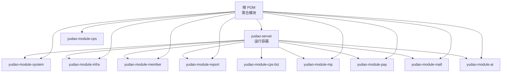
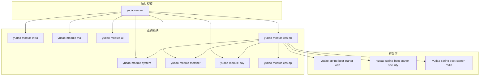
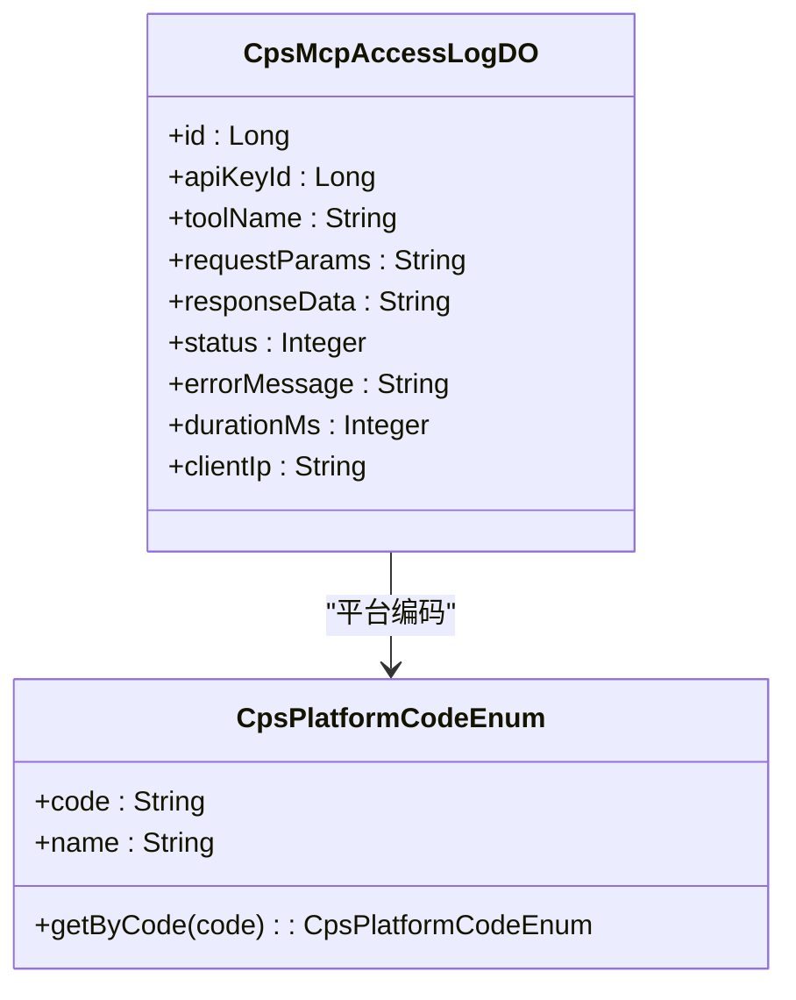
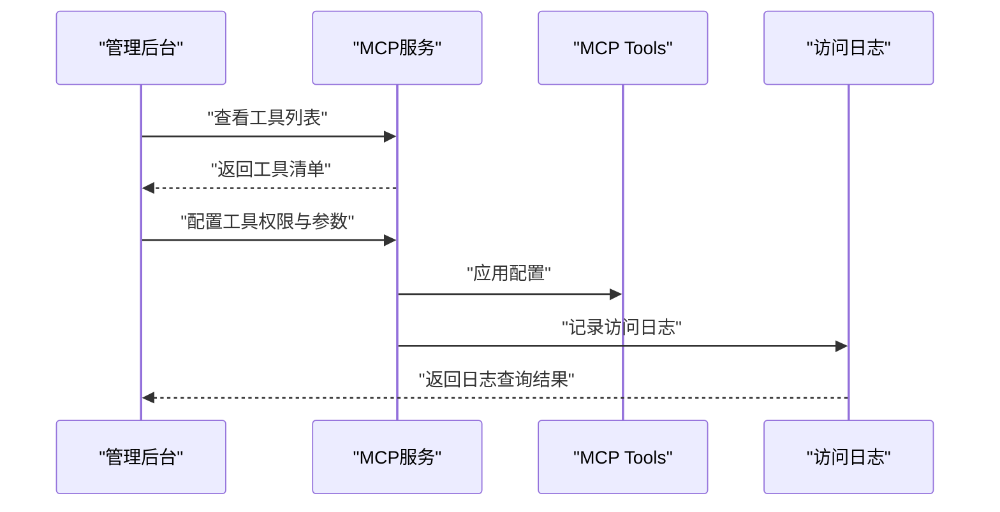
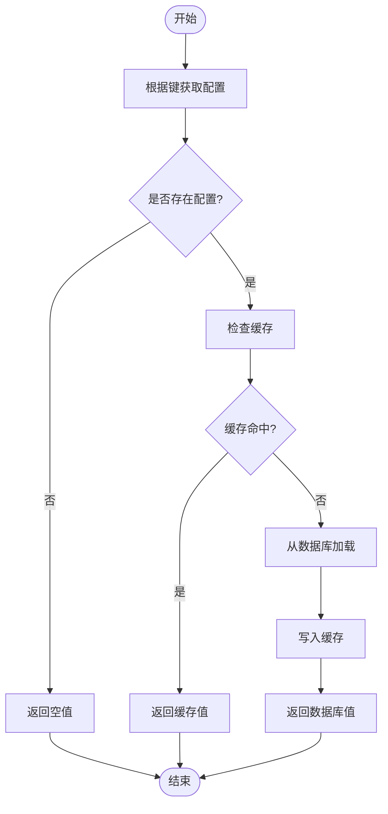
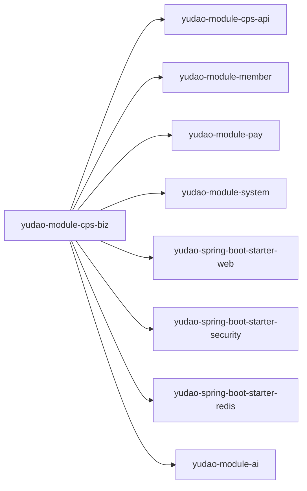

# 扩展开发

<cite>
**本文引用的文件**
- [根 POM（聚合）](file://backend/pom.xml)
- [后端服务器聚合模块 POM](file://backend/yudao-server/pom.xml)
- [CPS 模块 API 子模块 POM](file://backend/yudao-module-cps/yudao-module-cps-api/pom.xml)
- [CPS 模块业务子模块 POM](file://backend/yudao-module-cps/yudao-module-cps-biz/pom.xml)
- [CPS 平台编码枚举](file://backend/yudao-module-cps/yudao-module-cps-api/src/main/java/cn/iocoder/yudao/module/cps/enums/CpsPlatformCodeEnum.java)
- [CPS MCP 访问日志 DO](file://backend/yudao-module-cps/yudao-module-cps-biz/src/main/java/cn/iocoder/yudao/module/cps/dal/dataobject/mcp/CpsMcpAccessLogDO.java)
- [配置服务接口](file://backend/yudao-module-infra/src/main/java/cn/iocoder/yudao/module/infra/service/config/ConfigService.java)
- [配置服务实现](file://backend/yudao-module-infra/src/main/java/cn/iocoder/yudao/module/infra/service/config/ConfigServiceImpl.java)
- [配置 API 实现](file://backend/yudao-module-infra/src/main/java/cn/iocoder/yudao/module/infra/api/config/ConfigApiImpl.java)
- [通用缓存工具](file://backend/yudao-framework/yudao-common/src/main/java/cn/iocoder/yudao/framework/common/util/cache/CacheUtils.java)
- [Web 框架启动器 POM](file://backend/yudao-framework/yudao-spring-boot-starter-web/pom.xml)
- [安全框架启动器 POM](file://backend/yudao-framework/yudao-spring-boot-starter-security/pom.xml)
- [Redis 框架启动器 POM](file://backend/yudao-framework/yudao-spring-boot-starter-redis/pom.xml)
- [CPS 系统 PRD 文档](file://docs/CPS系统PRD文档.md)
</cite>

## 目录
1. [引言](#引言)
2. [项目结构](#项目结构)
3. [核心组件](#核心组件)
4. [架构总览](#架构总览)
5. [详细组件分析](#详细组件分析)
6. [依赖分析](#依赖分析)
7. [性能考虑](#性能考虑)
8. [故障排查指南](#故障排查指南)
9. [结论](#结论)
10. [附录](#附录)

## 引言
本指南面向希望在 AgenticCPS 项目基础上进行扩展开发的工程师，覆盖新模块开发流程、Maven 多模块结构设计与依赖管理、平台适配器扩展方法、CPS 平台集成规范、适配器接口实现、工具函数开发规范、MCP 协议工具扩展与资源管理、插件开发模式、第三方系统集成方法、API 扩展策略、配置中心使用与动态配置管理、运行时扩展机制、性能优化与缓存策略、异步处理扩展、扩展点识别与钩子函数使用、事件驱动开发模式等内容。

## 项目结构
AgenticCPS 采用 Maven 多模块聚合结构，顶层 POM 聚合多个子模块；后端服务器模块作为运行容器，按需引入各业务模块依赖；框架层提供通用能力（Web、安全、Redis、MyBatis、定时任务、监控、消息队列等）；业务模块按领域拆分（如系统、基础设施、会员、支付、商城、AI、CPS 等）。

**图表来源**
- [根 POM（聚合）:10-25](file://backend/pom.xml#L10-L25)
- [后端服务器聚合模块 POM:23-114](file://backend/yudao-server/pom.xml#L23-L114)

**章节来源**
- [根 POM（聚合）:10-25](file://backend/pom.xml#L10-L25)
- [后端服务器聚合模块 POM:23-114](file://backend/yudao-server/pom.xml#L23-L114)

## 核心组件
- 模块化结构与依赖管理：通过顶层 POM 聚合，子模块 POM 管理各自依赖，yudao-server 作为运行容器按需装配业务模块。
- 框架能力封装：yudao-framework 提供 Web、安全、Redis、定时任务、监控、消息队列、Excel、MyBatis 等通用能力，业务模块按需引入。
- 业务域划分：系统、基础设施、会员、支付、商城、AI、CPS 等模块清晰分离，CPS 模块进一步拆分为 API 与 Biz 两个子模块，职责明确。
- 配置中心与动态配置：infra 模块提供配置管理能力，支持键值配置的增删改查与分页查询，结合缓存工具实现高性能读取。
- 缓存与异步：通用缓存工具提供同步与异步刷新的 LoadingCache，支撑热点数据快速访问与后台刷新。
- MCP 协议与 AI 工具：CPS PRD 文档定义了 MCP 服务管理、API Key 管理、Tools 配置与访问日志等能力，biz 模块提供 MCP 访问日志数据对象。

**章节来源**
- [Web 框架启动器 POM:18-49](file://backend/yudao-framework/yudao-spring-boot-starter-web/pom.xml#L18-L49)
- [安全框架启动器 POM:21-62](file://backend/yudao-framework/yudao-spring-boot-starter-security/pom.xml#L21-L62)
- [Redis 框架启动器 POM:18-39](file://backend/yudao-framework/yudao-spring-boot-starter-redis/pom.xml#L18-L39)
- [配置服务接口:16-71](file://backend/yudao-module-infra/src/main/java/cn/iocoder/yudao/module/infra/service/config/ConfigService.java#L16-L71)
- [配置服务实现:32-95](file://backend/yudao-module-infra/src/main/java/cn/iocoder/yudao/module/infra/service/config/ConfigServiceImpl.java#L32-L95)
- [通用缓存工具:37-59](file://backend/yudao-framework/yudao-common/src/main/java/cn/iocoder/yudao/framework/common/util/cache/CacheUtils.java#L37-L59)
- [CPS MCP 访问日志 DO:14-62](file://backend/yudao-module-cps/yudao-module-cps-biz/src/main/java/cn/iocoder/yudao/module/cps/dal/dataobject/mcp/CpsMcpAccessLogDO.java#L14-L62)
- [CPS 系统 PRD 文档:694-757](file://docs/CPS系统PRD文档.md#L694-L757)

## 架构总览
整体采用“多模块聚合 + 运行容器装配”的架构。业务模块通过 API 子模块对外暴露接口，Biz 子模块实现具体业务逻辑，并依赖框架层提供的 Web、安全、Redis、定时任务等能力。CPS 模块通过 API/Biz 分层，配合 MCP 协议与 AI 工具，实现平台适配与智能服务扩展。

**图表来源**
- [后端服务器聚合模块 POM:23-114](file://backend/yudao-server/pom.xml#L23-L114)
- [CPS 模块 API 子模块 POM:19-31](file://backend/yudao-module-cps/yudao-module-cps-api/pom.xml#L19-L31)
- [CPS 模块业务子模块 POM:20-100](file://backend/yudao-module-cps/yudao-module-cps-biz/pom.xml#L20-L100)
- [Web 框架启动器 POM:18-49](file://backend/yudao-framework/yudao-spring-boot-starter-web/pom.xml#L18-L49)
- [安全框架启动器 POM:21-62](file://backend/yudao-framework/yudao-spring-boot-starter-security/pom.xml#L21-L62)
- [Redis 框架启动器 POM:18-39](file://backend/yudao-framework/yudao-spring-boot-starter-redis/pom.xml#L18-L39)

## 详细组件分析

### 新模块开发流程
- 设计阶段：明确模块边界与职责，评估是否需要 API/Biz 分层；确定对外暴露接口与内部实现。
- 结构搭建：在顶层 POM 中新增模块声明；在 yudao-server 中按需引入该模块依赖。
- 依赖管理：在模块 POM 中引入所需框架启动器与业务依赖；避免循环依赖。
- 接口设计：优先在 API 子模块定义对外接口与 DTO；在 Biz 子模块实现业务逻辑。
- 测试与验证：编写单元测试与集成测试，确保模块功能正确与性能达标。
- 部署与发布：通过 Maven 聚合构建，打包运行容器镜像或可执行包。

**章节来源**
- [根 POM（聚合）:10-25](file://backend/pom.xml#L10-L25)
- [后端服务器聚合模块 POM:23-114](file://backend/yudao-server/pom.xml#L23-L114)

### 平台适配器扩展方法与 CPS 平台集成规范
- 平台枚举与编码：通过平台编码枚举统一管理平台标识，便于扩展新平台与统一处理。
- 平台配置：参考 CPS PRD 的平台管理页面，抽象平台配置实体与服务接口，支持 AppKey/AppSecret、API 基础地址、默认推广位、服务费率等字段。
- 转链与订单同步：遵循 PRD 中的转链流程与订单同步流程，抽象工具方法与服务接口，支持多平台并发查询与状态追踪。
- MCP 工具扩展：参考 PRD 的 MCP Tools 列表，新增工具时定义 Tool 名称、权限级别、参数限制与默认值，并在 biz 层记录访问日志。

**图表来源**
- [CPS 平台编码枚举:16-44](file://backend/yudao-module-cps/yudao-module-cps-api/src/main/java/cn/iocoder/yudao/module/cps/enums/CpsPlatformCodeEnum.java#L16-L44)
- [CPS MCP 访问日志 DO:22-62](file://backend/yudao-module-cps/yudao-module-cps-biz/src/main/java/cn/iocoder/yudao/module/cps/dal/dataobject/mcp/CpsMcpAccessLogDO.java#L22-L62)

**章节来源**
- [CPS 平台编码枚举:16-44](file://backend/yudao-module-cps/yudao-module-cps-api/src/main/java/cn/iocoder/yudao/module/cps/enums/CpsPlatformCodeEnum.java#L16-L44)
- [CPS MCP 访问日志 DO:14-62](file://backend/yudao-module-cps/yudao-module-cps-biz/src/main/java/cn/iocoder/yudao/module/cps/dal/dataobject/mcp/CpsMcpAccessLogDO.java#L14-L62)
- [CPS 系统 PRD 文档:553-585](file://docs/CPS系统PRD文档.md#L553-L585)

### 适配器接口实现
- 接口设计：在 API 子模块定义平台适配器接口，包含转链、订单查询、商品搜索等方法签名。
- 实现策略：针对不同平台实现适配器，统一处理参数、签名、请求与响应解析。
- 配置驱动：通过配置中心读取平台配置，动态切换适配器实现。
- 错误处理：定义统一的异常与错误码，记录访问日志与耗时，便于监控与排障。

**章节来源**
- [CPS 系统 PRD 文档:183-223](file://docs/CPS系统PRD文档.md#L183-L223)

### 工具函数开发规范
- 通用工具：在 yudao-common 中提供通用工具类，如缓存工具，支持同步与异步刷新的 LoadingCache。
- 使用建议：热点数据使用缓存工具，合理设置过期时间与最大容量；避免在缓存中存储敏感信息。
- 测试要求：工具类需提供单元测试，覆盖边界条件与异常分支。

**章节来源**
- [通用缓存工具:37-59](file://backend/yudao-framework/yudao-common/src/main/java/cn/iocoder/yudao/framework/common/util/cache/CacheUtils.java#L37-L59)

### MCP 协议工具扩展与资源管理
- 工具管理：在管理后台提供 MCP Tools 配置页面，支持查看、权限配置、使用统计与参数限制。
- 资源管理：定义 MCP Resources，如订单状态查询等，供 AI Agent 访问。
- 访问日志：记录 API Key、Tool/Resource 名称、请求参数摘要、响应状态、耗时与客户端 IP，便于审计与监控。
- 权限控制：通过 API Key 权限级别（public/member/admin）控制访问范围与操作能力。

**图表来源**
- [CPS 系统 PRD 文档:717-757](file://docs/CPS系统PRD文档.md#L717-L757)
- [CPS MCP 访问日志 DO:32-60](file://backend/yudao-module-cps/yudao-module-cps-biz/src/main/java/cn/iocoder/yudao/module/cps/dal/dataobject/mcp/CpsMcpAccessLogDO.java#L32-L60)

**章节来源**
- [CPS 系统 PRD 文档:694-757](file://docs/CPS系统PRD文档.md#L694-L757)
- [CPS MCP 访问日志 DO:14-62](file://backend/yudao-module-cps/yudao-module-cps-biz/src/main/java/cn/iocoder/yudao/module/cps/dal/dataobject/mcp/CpsMcpAccessLogDO.java#L14-L62)

### 插件开发模式与第三方系统集成
- 插件化思路：将第三方系统能力抽象为插件接口，通过 SPI 或配置注册插件实现，支持热插拔与动态切换。
- 集成策略：统一请求/响应适配器，定义标准化的错误码与日志格式；对高延迟接口采用异步或缓存策略。
- 配置驱动：通过配置中心动态开启/关闭插件与调整参数，降低变更风险。

**章节来源**
- [CPS 系统 PRD 文档:183-223](file://docs/CPS系统PRD文档.md#L183-L223)

### API 扩展策略
- 接口设计：遵循 RESTful 设计原则，统一错误码与响应结构；在 API 子模块定义对外接口。
- 版本管理：通过路径或头信息区分 API 版本，保证向后兼容。
- 安全与鉴权：在安全框架启动器中集成认证与授权，对敏感接口进行权限控制。

**章节来源**
- [Web 框架启动器 POM:18-49](file://backend/yudao-framework/yudao-spring-boot-starter-web/pom.xml#L18-L49)
- [安全框架启动器 POM:21-62](file://backend/yudao-framework/yudao-spring-boot-starter-security/pom.xml#L21-L62)

### 配置中心使用与动态配置管理
- 配置模型：提供配置键值对的增删改查与分页查询能力，区分自定义与系统内置配置。
- 动态生效：通过缓存工具缓存配置值，设置合理的刷新周期；对关键配置提供热更新入口。
- 安全与审计：对敏感配置进行脱敏展示与访问控制，记录配置变更日志。

**图表来源**
- [配置服务接口:56-70](file://backend/yudao-module-infra/src/main/java/cn/iocoder/yudao/module/infra/service/config/ConfigService.java#L56-L70)
- [配置服务实现:87-95](file://backend/yudao-module-infra/src/main/java/cn/iocoder/yudao/module/infra/service/config/ConfigServiceImpl.java#L87-L95)
- [通用缓存工具:37-59](file://backend/yudao-framework/yudao-common/src/main/java/cn/iocoder/yudao/framework/common/util/cache/CacheUtils.java#L37-L59)

**章节来源**
- [配置服务接口:16-71](file://backend/yudao-module-infra/src/main/java/cn/iocoder/yudao/module/infra/service/config/ConfigService.java#L16-L71)
- [配置服务实现:32-95](file://backend/yudao-module-infra/src/main/java/cn/iocoder/yudao/module/infra/service/config/ConfigServiceImpl.java#L32-L95)
- [配置 API 实现:21-27](file://backend/yudao-module-infra/src/main/java/cn/iocoder/yudao/module/infra/api/config/ConfigApiImpl.java#L21-L27)
- [通用缓存工具:37-59](file://backend/yudao-framework/yudao-common/src/main/java/cn/iocoder/yudao/framework/common/util/cache/CacheUtils.java#L37-L59)

### 运行时扩展机制
- 模块装配：通过 yudao-server 的依赖声明按需装配业务模块，实现运行时模块化。
- 框架能力：按需引入 Web、安全、Redis、定时任务等启动器，避免不必要的依赖。
- 扩展点：在业务模块中预留扩展点（如适配器接口、工具方法），通过配置或 SPI 进行替换。

**章节来源**
- [后端服务器聚合模块 POM:23-114](file://backend/yudao-server/pom.xml#L23-L114)
- [Web 框架启动器 POM:18-49](file://backend/yudao-framework/yudao-spring-boot-starter-web/pom.xml#L18-L49)
- [安全框架启动器 POM:21-62](file://backend/yudao-framework/yudao-spring-boot-starter-security/pom.xml#L21-L62)
- [Redis 框架启动器 POM:18-39](file://backend/yudao-framework/yudao-spring-boot-starter-redis/pom.xml#L18-L39)

### 性能优化扩展
- 缓存策略：使用通用缓存工具构建 LoadingCache，设置合适的过期时间与最大容量；对热点数据进行异步刷新。
- 异步处理：对高延迟第三方接口采用异步调用，减少主线程阻塞；对批量任务使用定时任务或消息队列。
- 并发优化：在适配器与工具方法中使用并发策略（如并发查询多平台），并做好异常隔离与降级处理。

**章节来源**
- [通用缓存工具:37-59](file://backend/yudao-framework/yudao-common/src/main/java/cn/iocoder/yudao/framework/common/util/cache/CacheUtils.java#L37-L59)
- [CPS 系统 PRD 文档:121-150](file://docs/CPS系统PRD文档.md#L121-L150)

### 缓存策略扩展
- 同步与异步刷新：根据场景选择 buildCache 或 buildAsyncReloadingCache；对与“全局/系统”相关的缓存优先使用异步刷新。
- 过期与容量：合理设置 refreshAfterWrite 与 maximumSize，避免内存溢出与缓存雪崩。
- 线程安全：注意 CacheLoader 的线程安全与上下文传递，必要时自行处理 ThreadLocal。

**章节来源**
- [通用缓存工具:37-59](file://backend/yudao-framework/yudao-common/src/main/java/cn/iocoder/yudao/framework/common/util/cache/CacheUtils.java#L37-L59)

### 异步处理扩展
- 异步刷新缓存：使用异步刷新避免阻塞当前数据加载线程，提升用户体验。
- 异步任务：对定时任务与批处理任务使用异步执行，结合 Redisson 或消息队列实现可靠投递。

**章节来源**
- [Redis 框架启动器 POM:24-33](file://backend/yudao-framework/yudao-spring-boot-starter-redis/pom.xml#L24-L33)
- [通用缓存工具:37-59](file://backend/yudao-framework/yudao-common/src/main/java/cn/iocoder/yudao/framework/common/util/cache/CacheUtils.java#L37-L59)

### 扩展点识别与钩子函数使用
- 扩展点识别：在适配器接口、工具方法、服务层与控制器层识别可扩展点；通过配置或 SPI 进行替换。
- 钩子函数：在关键流程（如订单同步、转链、日志记录）插入钩子，支持审计、监控与告警。
- 事件驱动：利用消息队列与事件机制实现松耦合扩展，支持异步通知与补偿。

**章节来源**
- [CPS 系统 PRD 文档:183-223](file://docs/CPS系统PRD文档.md#L183-L223)

## 依赖分析
CPS 模块的依赖关系体现了清晰的分层与解耦：

**图表来源**
- [CPS 模块业务子模块 POM:20-100](file://backend/yudao-module-cps/yudao-module-cps-biz/pom.xml#L20-L100)
- [CPS 模块 API 子模块 POM:19-31](file://backend/yudao-module-cps/yudao-module-cps-api/pom.xml#L19-L31)

**章节来源**
- [CPS 模块业务子模块 POM:20-100](file://backend/yudao-module-cps/yudao-module-cps-biz/pom.xml#L20-L100)
- [CPS 模块 API 子模块 POM:19-31](file://backend/yudao-module-cps/yudao-module-cps-api/pom.xml#L19-L31)

## 性能考虑
- 缓存优先：对高频读取的配置与平台数据使用缓存工具，设置合理的过期时间与最大容量。
- 异步刷新：对热点数据采用异步刷新，避免阻塞当前请求线程。
- 并发查询：在多平台比价与商品搜索中采用并发策略，提升响应速度。
- 降级与熔断：对外部依赖增加降级与熔断策略，保证系统稳定性。

[本节为通用指导，无需列出具体文件来源]

## 故障排查指南
- 配置问题：检查配置键是否存在、是否被系统内置类型保护、是否重复；通过配置服务接口与实现定位问题。
- 缓存问题：检查缓存是否命中、过期时间是否合理、最大容量是否溢出；通过缓存工具的日志与监控定位。
- MCP 访问问题：查看 MCP 访问日志，确认 API Key 权限级别、请求参数与响应状态；根据错误信息与耗时进行定位。
- 第三方平台问题：检查平台配置（AppKey/AppSecret、API 地址、默认推广位）与服务费率；关注转链与订单同步流程中的异常。

**章节来源**
- [配置服务接口:56-70](file://backend/yudao-module-infra/src/main/java/cn/iocoder/yudao/module/infra/service/config/ConfigService.java#L56-L70)
- [配置服务实现:87-95](file://backend/yudao-module-infra/src/main/java/cn/iocoder/yudao/module/infra/service/config/ConfigServiceImpl.java#L87-L95)
- [CPS MCP 访问日志 DO:32-60](file://backend/yudao-module-cps/yudao-module-cps-biz/src/main/java/cn/iocoder/yudao/module/cps/dal/dataobject/mcp/CpsMcpAccessLogDO.java#L32-L60)

## 结论
通过多模块聚合与运行容器装配，AgenticCPS 提供了清晰的扩展空间。围绕平台适配器、MCP 协议、配置中心、缓存与异步处理等关键能力，开发者可以快速实现新模块与第三方系统集成，同时保持系统的可维护性与高性能。

[本节为总结性内容，无需列出具体文件来源]

## 附录
- 开发流程清单：需求分析 → 模块设计 → 结构搭建 → 依赖管理 → 接口设计 → 实现与测试 → 部署发布
- 扩展点清单：适配器接口、工具方法、MCP Tools/Resource、配置项、钩子函数、事件监听器
- 最佳实践：分层清晰、依赖最小化、缓存合理、异步优先、可观测性完善、安全可控

[本节为补充内容，无需列出具体文件来源]