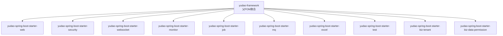
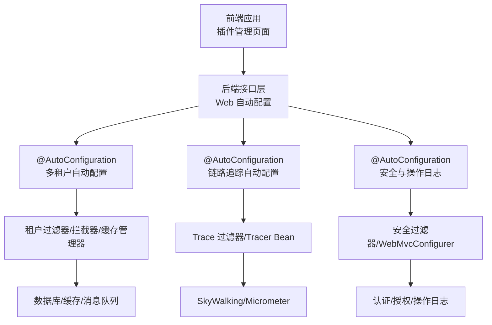
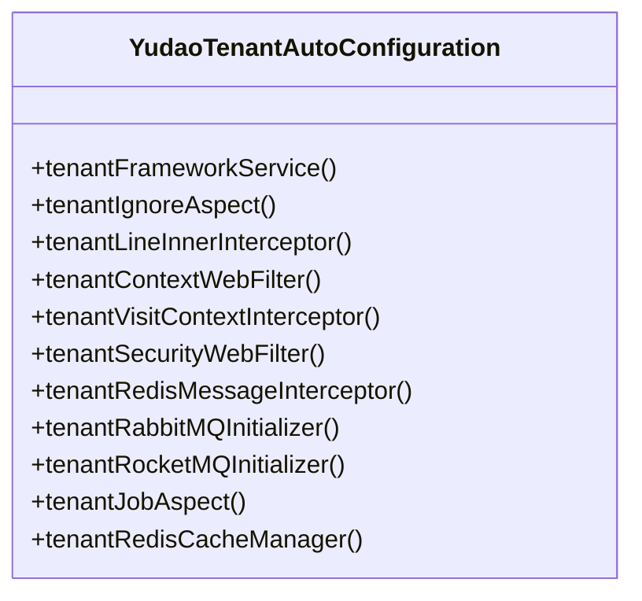
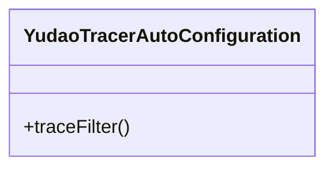
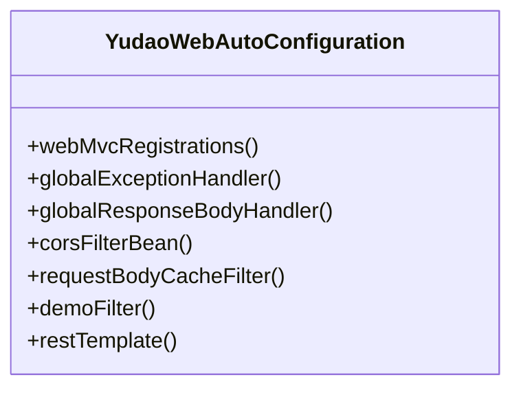
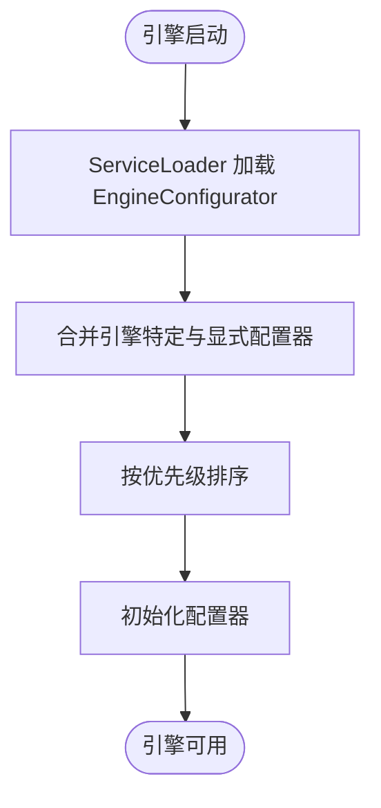
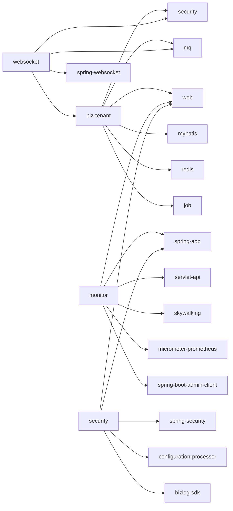

# 插件开发

<cite>
**本文引用的文件**
- [backend/yudao-framework/pom.xml](file://backend/yudao-framework/pom.xml)
- [backend/yudao-framework/yudao-spring-boot-starter-biz-tenant/pom.xml](file://backend/yudao-framework/yudao-spring-boot-starter-biz-tenant/pom.xml)
- [backend/yudao-framework/yudao-spring-boot-starter-monitor/pom.xml](file://backend/yudao-framework/yudao-spring-boot-starter-monitor/pom.xml)
- [backend/yudao-framework/yudao-spring-boot-starter-websocket/pom.xml](file://backend/yudao-framework/yudao-spring-boot-starter-websocket/pom.xml)
- [backend/yudao-framework/yudao-spring-boot-starter-security/pom.xml](file://backend/yudao-framework/yudao-spring-boot-starter-security/pom.xml)
- [backend/yudao-framework/yudao-spring-boot-starter-biz-tenant/src/main/java/cn/iocoder/yudao/framework/tenant/config/YudaoTenantAutoConfiguration.java](file://backend/yudao-framework/yudao-spring-boot-starter-biz-tenant/src/main/java/cn/iocoder/yudao/framework/tenant/config/YudaoTenantAutoConfiguration.java)
- [backend/yudao-framework/yudao-spring-boot-starter-monitor/src/main/java/cn/iocoder/yudao/framework/tracer/config/YudaoTracerAutoConfiguration.java](file://backend/yudao-framework/yudao-spring-boot-starter-monitor/src/main/java/cn/iocoder/yudao/framework/tracer/config/YudaoTracerAutoConfiguration.java)
- [backend/yudao-framework/yudao-spring-boot-starter-web/src/main/java/cn/iocoder/yudao/framework/web/config/YudaoWebAutoConfiguration.java](file://backend/yudao-framework/yudao-spring-boot-starter-web/src/main/java/cn/iocoder/yudao/framework/web/config/YudaoWebAutoConfiguration.java)
- [backend/yudao-framework/yudao-common/pom.xml](file://backend/yudao-framework/yudao-common/pom.xml)
- [backend/sql/mysql/ruoyi-vue-pro.sql](file://backend/sql/mysql/ruoyi-vue-pro.sql)
- [backend/sql/sqlserver/ruoyi-vue-pro.sql](file://backend/sql/sqlserver/ruoyi-vue-pro.sql)
- [backend/sql/opengauss/ruoyi-vue-pro.sql](file://backend/sql/opengauss/ruoyi-vue-pro.sql)
- [backend/sql/dm/ruoyi-vue-pro-dm8.sql](file://backend/sql/dm/ruoyi-vue-pro-dm8.sql)
- [backend/sql/kingbase/ruoyi-vue-pro.sql](file://backend/sql/kingbase/ruoyi-vue-pro.sql)
- [backend/sql/dm/flowable-patch/src/main/java/org/flowable/common/engine/impl/AbstractEngineConfiguration.java](file://backend/sql/dm/flowable-patch/src/main/java/org/flowable/common/engine/impl/AbstractEngineConfiguration.java)
</cite>

## 目录
1. [引言](#引言)
2. [项目结构](#项目结构)
3. [核心组件](#核心组件)
4. [架构总览](#架构总览)
5. [详细组件分析](#详细组件分析)
6. [依赖分析](#依赖分析)
7. [性能考虑](#性能考虑)
8. [故障排查指南](#故障排查指南)
9. [结论](#结论)
10. [附录](#附录)

## 引言
本指南面向希望基于 Spring Boot 在现有系统中开发“插件”的工程师，系统讲解插件机制、自动配置原理与条件注解的使用方式；并结合仓库中的 Starter 组件与自动配置实践，给出插件项目结构、依赖配置、打包发布、接口设计、SPI 扩展点、配置管理、测试策略、性能监控与日志收集等完整开发流程。读者无需深入源码即可按图索骥完成插件开发。

## 项目结构
本仓库采用多模块聚合工程组织，核心“框架组件”以 Spring Boot Starter 形式提供能力，典型模块包括：
- web、security、websocket、monitor、job、mq、excel、test、biz-tenant、biz-data-permission 等
- 各 Starter 模块通过 Maven 聚合管理，彼此通过依赖组合形成可插拔能力

图表来源
- [backend/yudao-framework/pom.xml:12-31](file://backend/yudao-framework/pom.xml#L12-L31)

章节来源
- [backend/yudao-framework/pom.xml:1-47](file://backend/yudao-framework/pom.xml#L1-L47)

## 核心组件
- 自动配置与条件注解：各 Starter 通过 @AutoConfiguration + @ConditionalOn* 注解实现“按需启用”，如多租户、链路追踪、Web 过滤器链等
- 配置绑定：@EnableConfigurationProperties + Properties 类实现属性绑定，便于外部配置覆盖
- SPI 与扩展点：通过 ServiceLoader 或监听器接口实现扩展点注册，如 Flowable 引擎的 EngineConfigurator 发现机制
- 插件化菜单与权限：数据库脚本中提供“插件管理”菜单与权限点，作为前端插件入口与鉴权依据

章节来源
- [backend/yudao-framework/yudao-spring-boot-starter-biz-tenant/src/main/java/cn/iocoder/yudao/framework/tenant/config/YudaoTenantAutoConfiguration.java:51-54](file://backend/yudao-framework/yudao-spring-boot-starter-biz-tenant/src/main/java/cn/iocoder/yudao/framework/tenant/config/YudaoTenantAutoConfiguration.java#L51-L54)
- [backend/yudao-framework/yudao-spring-boot-starter-monitor/src/main/java/cn/iocoder/yudao/framework/tracer/config/YudaoTracerAutoConfiguration.java:17-25](file://backend/yudao-framework/yudao-spring-boot-starter-monitor/src/main/java/cn/iocoder/yudao/framework/tracer/config/YudaoTracerAutoConfiguration.java#L17-L25)
- [backend/yudao-framework/yudao-spring-boot-starter-web/src/main/java/cn/iocoder/yudao/framework/web/config/YudaoWebAutoConfiguration.java:35-37](file://backend/yudao-framework/yudao-spring-boot-starter-web/src/main/java/cn/iocoder/yudao/framework/web/config/YudaoWebAutoConfiguration.java#L35-L37)
- [backend/sql/mysql/ruoyi-vue-pro.sql:6173-6179](file://backend/sql/mysql/ruoyi-vue-pro.sql#L6173-L6179)
- [backend/sql/sqlserver/ruoyi-vue-pro.sql:6173-6179](file://backend/sql/sqlserver/ruoyi-vue-pro.sql#L6173-L6179)
- [backend/sql/opengauss/ruoyi-vue-pro.sql:2665-2668](file://backend/sql/opengauss/ruoyi-vue-pro.sql#L2665-L2668)
- [backend/sql/dm/ruoyi-vue-pro-dm8.sql:2507-2510](file://backend/sql/dm/ruoyi-vue-pro-dm8.sql#L2507-L2510)
- [backend/sql/kingbase/ruoyi-vue-pro.sql:2665-2668](file://backend/sql/kingbase/ruoyi-vue-pro.sql#L2665-L2668)
- [backend/sql/dm/flowable-patch/src/main/java/org/flowable/common/engine/impl/AbstractEngineConfiguration.java:1046-1067](file://backend/sql/dm/flowable-patch/src/main/java/org/flowable/common/engine/impl/AbstractEngineConfiguration.java#L1046-L1067)

## 架构总览
下图展示“插件能力”在系统中的位置与交互：前端通过“插件管理”菜单调用后端接口；后端由 Starter 提供自动配置与过滤器链；业务模块按需启用租户、安全、监控等能力。

图表来源
- [backend/yudao-framework/yudao-spring-boot-starter-web/src/main/java/cn/iocoder/yudao/framework/web/config/YudaoWebAutoConfiguration.java:35-37](file://backend/yudao-framework/yudao-spring-boot-starter-web/src/main/java/cn/iocoder/yudao/framework/web/config/YudaoWebAutoConfiguration.java#L35-L37)
- [backend/yudao-framework/yudao-spring-boot-starter-biz-tenant/src/main/java/cn/iocoder/yudao/framework/tenant/config/YudaoTenantAutoConfiguration.java:51-54](file://backend/yudao-framework/yudao-spring-boot-starter-biz-tenant/src/main/java/cn/iocoder/yudao/framework/tenant/config/YudaoTenantAutoConfiguration.java#L51-L54)
- [backend/yudao-framework/yudao-spring-boot-starter-monitor/src/main/java/cn/iocoder/yudao/framework/tracer/config/YudaoTracerAutoConfiguration.java:17-25](file://backend/yudao-framework/yudao-spring-boot-starter-monitor/src/main/java/cn/iocoder/yudao/framework/tracer/config/YudaoTracerAutoConfiguration.java#L17-L25)
- [backend/yudao-framework/yudao-spring-boot-starter-security/pom.xml:21-62](file://backend/yudao-framework/yudao-spring-boot-starter-security/pom.xml#L21-L62)

## 详细组件分析

### 多租户插件（租户能力作为插件）
- 自动配置要点
  - 通过 @ConditionalOnProperty 控制开关，默认启用
  - 通过 @EnableConfigurationProperties 绑定 yudao.tenant.* 配置
  - 注册过滤器、拦截器、AOP 切面、缓存管理器等 Bean
  - 条件化注册 MQ 初始化器（RabbitMQ/RocketMQ）
- 关键 Bean
  - 租户上下文过滤器、安全过滤器、访问拦截器
  - 租户 AOP 切面、租户 Job 切面
  - 租户 Redis CacheManager

图表来源
- [backend/yudao-framework/yudao-spring-boot-starter-biz-tenant/src/main/java/cn/iocoder/yudao/framework/tenant/config/YudaoTenantAutoConfiguration.java:51-199](file://backend/yudao-framework/yudao-spring-boot-starter-biz-tenant/src/main/java/cn/iocoder/yudao/framework/tenant/config/YudaoTenantAutoConfiguration.java#L51-L199)

章节来源
- [backend/yudao-framework/yudao-spring-boot-starter-biz-tenant/src/main/java/cn/iocoder/yudao/framework/tenant/config/YudaoTenantAutoConfiguration.java:51-199](file://backend/yudao-framework/yudao-spring-boot-starter-biz-tenant/src/main/java/cn/iocoder/yudao/framework/tenant/config/YudaoTenantAutoConfiguration.java#L51-L199)

### 链路追踪插件（监控能力作为插件）
- 自动配置要点
  - 仅当存在 SkyWalking/OpenTracing/Spring Web Filter 类时启用
  - 通过 @ConditionalOnProperty 控制开关，默认启用
  - 注册 TraceFilter，统一输出 traceId
- 关键 Bean
  - TraceFilter（过滤器）

图表来源
- [backend/yudao-framework/yudao-spring-boot-starter-monitor/src/main/java/cn/iocoder/yudao/framework/tracer/config/YudaoTracerAutoConfiguration.java:17-54](file://backend/yudao-framework/yudao-spring-boot-starter-monitor/src/main/java/cn/iocoder/yudao/framework/tracer/config/YudaoTracerAutoConfiguration.java#L17-L54)

章节来源
- [backend/yudao-framework/yudao-spring-boot-starter-monitor/src/main/java/cn/iocoder/yudao/framework/tracer/config/YudaoTracerAutoConfiguration.java:17-54](file://backend/yudao-framework/yudao-spring-boot-starter-monitor/src/main/java/cn/iocoder/yudao/framework/tracer/config/YudaoTracerAutoConfiguration.java#L17-L54)

### Web 插件（接口与过滤器链）
- 自动配置要点
  - 通过 @EnableConfigurationProperties 绑定 yudao.web.* 配置
  - 注册全局异常处理器、响应包装器、Web 工具类
  - 注册 CORS、请求体缓存、演示模式等过滤器
  - 提供 RestTemplate Bean（按需）
- 关键 Bean
  - WebMvcRegistrations（路径前缀）
  - GlobalExceptionHandler、GlobalResponseBodyHandler
  - CorsFilter、CacheRequestBodyFilter、DemoFilter
  - RestTemplate

图表来源
- [backend/yudao-framework/yudao-spring-boot-starter-web/src/main/java/cn/iocoder/yudao/framework/web/config/YudaoWebAutoConfiguration.java:35-156](file://backend/yudao-framework/yudao-spring-boot-starter-web/src/main/java/cn/iocoder/yudao/framework/web/config/YudaoWebAutoConfiguration.java#L35-L156)

章节来源
- [backend/yudao-framework/yudao-spring-boot-starter-web/src/main/java/cn/iocoder/yudao/framework/web/config/YudaoWebAutoConfiguration.java:35-156](file://backend/yudao-framework/yudao-spring-boot-starter-web/src/main/java/cn/iocoder/yudao/framework/web/config/YudaoWebAutoConfiguration.java#L35-L156)

### SPI 与扩展点（以 Flowable 为例）
- 通过 ServiceLoader 自动发现 EngineConfigurator 实现，实现引擎配置的插件化扩展
- 典型流程：引擎启动时加载 classloader 中的实现，合并优先级排序后的配置器列表

图表来源
- [backend/sql/dm/flowable-patch/src/main/java/org/flowable/common/engine/impl/AbstractEngineConfiguration.java:1046-1067](file://backend/sql/dm/flowable-patch/src/main/java/org/flowable/common/engine/impl/AbstractEngineConfiguration.java#L1046-L1067)

章节来源
- [backend/sql/dm/flowable-patch/src/main/java/org/flowable/common/engine/impl/AbstractEngineConfiguration.java:1035-1067](file://backend/sql/dm/flowable-patch/src/main/java/org/flowable/common/engine/impl/AbstractEngineConfiguration.java#L1035-L1067)

## 依赖分析
- Starter 间依赖关系
  - 多租户 Starter 依赖 Web、Security、MyBatis、Redis、Job、MQ 等
  - 监控 Starter 依赖 AOP、Web、Servlet API、SkyWalking/Micrometer、Spring Boot Admin
  - WebSocket Starter 依赖 Security、WebSocket、MQ、Tenant
  - Security Starter 依赖 Web、AOP、Spring Security、配置处理器、业务日志 SDK
- 公共依赖
  - yudao-common 提供 AOP、Servlet API、配置处理器等基础能力

图表来源
- [backend/yudao-framework/yudao-spring-boot-starter-biz-tenant/pom.xml:18-81](file://backend/yudao-framework/yudao-spring-boot-starter-biz-tenant/pom.xml#L18-L81)
- [backend/yudao-framework/yudao-spring-boot-starter-monitor/pom.xml:18-76](file://backend/yudao-framework/yudao-spring-boot-starter-monitor/pom.xml#L18-L76)
- [backend/yudao-framework/yudao-spring-boot-starter-websocket/pom.xml:19-71](file://backend/yudao-framework/yudao-spring-boot-starter-websocket/pom.xml#L19-L71)
- [backend/yudao-framework/yudao-spring-boot-starter-security/pom.xml:21-62](file://backend/yudao-framework/yudao-spring-boot-starter-security/pom.xml#L21-L62)
- [backend/yudao-framework/yudao-common/pom.xml:30-62](file://backend/yudao-framework/yudao-common/pom.xml#L30-L62)

章节来源
- [backend/yudao-framework/yudao-spring-boot-starter-biz-tenant/pom.xml:18-81](file://backend/yudao-framework/yudao-spring-boot-starter-biz-tenant/pom.xml#L18-L81)
- [backend/yudao-framework/yudao-spring-boot-starter-monitor/pom.xml:18-76](file://backend/yudao-framework/yudao-spring-boot-starter-monitor/pom.xml#L18-L76)
- [backend/yudao-framework/yudao-spring-boot-starter-websocket/pom.xml:19-71](file://backend/yudao-framework/yudao-spring-boot-starter-websocket/pom.xml#L19-L71)
- [backend/yudao-framework/yudao-spring-boot-starter-security/pom.xml:21-62](file://backend/yudao-framework/yudao-spring-boot-starter-security/pom.xml#L21-L62)
- [backend/yudao-framework/yudao-common/pom.xml:30-62](file://backend/yudao-framework/yudao-common/pom.xml#L30-L62)

## 性能考虑
- 条件化启用：通过 @ConditionalOn* 仅在具备运行时类或属性时注册 Bean，避免不必要的开销
- 过滤器顺序：Web 过滤器链顺序固定，确保跨域、请求体缓存、演示模式等按预期执行
- 缓存与扫描批大小：租户 Redis CacheManager 支持批量扫描策略，降低大缓存场景的扫描成本
- 监控开关：链路追踪与指标采集默认启用，可通过配置关闭以降低开销

章节来源
- [backend/yudao-framework/yudao-spring-boot-starter-web/src/main/java/cn/iocoder/yudao/framework/web/config/YudaoWebAutoConfiguration.java:107-136](file://backend/yudao-framework/yudao-spring-boot-starter-web/src/main/java/cn/iocoder/yudao/framework/web/config/YudaoWebAutoConfiguration.java#L107-L136)
- [backend/yudao-framework/yudao-spring-boot-starter-biz-tenant/src/main/java/cn/iocoder/yudao/framework/tenant/config/YudaoTenantAutoConfiguration.java:184-196](file://backend/yudao-framework/yudao-spring-boot-starter-biz-tenant/src/main/java/cn/iocoder/yudao/framework/tenant/config/YudaoTenantAutoConfiguration.java#L184-L196)
- [backend/yudao-framework/yudao-spring-boot-starter-monitor/src/main/java/cn/iocoder/yudao/framework/tracer/config/YudaoTracerAutoConfiguration.java:23-24](file://backend/yudao-framework/yudao-spring-boot-starter-monitor/src/main/java/cn/iocoder/yudao/framework/tracer/config/YudaoTracerAutoConfiguration.java#L23-L24)

## 故障排查指南
- 自动配置未生效
  - 检查是否存在所需类（@ConditionalOnClass）、属性值（@ConditionalOnProperty）与 Bean（@ConditionalOnBean）
  - 确认 Starter 依赖已正确引入且版本兼容
- 过滤器链异常
  - 核对过滤器顺序常量与注册顺序，避免跨域配置不生效
- 链路追踪无效
  - 确认 SkyWalking/Micrometer 依赖存在且配置开关开启
- 多租户相关问题
  - 检查租户开关与忽略 URL 配置，确认租户上下文过滤器与安全过滤器已注册
- SPI 扩展未加载
  - 确认实现类位于 classpath 下并被 ServiceLoader 可见

章节来源
- [backend/yudao-framework/yudao-spring-boot-starter-web/src/main/java/cn/iocoder/yudao/framework/web/config/YudaoWebAutoConfiguration.java:107-136](file://backend/yudao-framework/yudao-spring-boot-starter-web/src/main/java/cn/iocoder/yudao/framework/web/config/YudaoWebAutoConfiguration.java#L107-L136)
- [backend/yudao-framework/yudao-spring-boot-starter-monitor/src/main/java/cn/iocoder/yudao/framework/tracer/config/YudaoTracerAutoConfiguration.java:17-25](file://backend/yudao-framework/yudao-spring-boot-starter-monitor/src/main/java/cn/iocoder/yudao/framework/tracer/config/YudaoTracerAutoConfiguration.java#L17-L25)
- [backend/yudao-framework/yudao-spring-boot-starter-biz-tenant/src/main/java/cn/iocoder/yudao/framework/tenant/config/YudaoTenantAutoConfiguration.java:51-54](file://backend/yudao-framework/yudao-spring-boot-starter-biz-tenant/src/main/java/cn/iocoder/yudao/framework/tenant/config/YudaoTenantAutoConfiguration.java#L51-L54)

## 结论
本指南基于仓库中的 Starter 与自动配置实践，总结了插件开发的关键要素：以 @AutoConfiguration 为核心、以 @ConditionalOn* 为开关、以 @EnableConfigurationProperties 为配置入口、以过滤器链与 AOP 切面为扩展点、以 ServiceLoader 为 SPI 机制。结合“插件管理”菜单与权限点，可快速落地前端插件入口与后端能力插件化。

## 附录

### 插件项目结构建议
- 模块划分
  - api：对外暴露的接口定义
  - core：核心业务与扩展点定义
  - config：自动配置与条件注解
  - starter：打包为可复用的 Starter
- 依赖建议
  - 引入 yudao-common 与必要的 Starter（如 web、security、monitor 等）
  - 将配置类置于 config 模块，Bean 置于 core 模块，starter 仅负责装配

章节来源
- [backend/yudao-framework/pom.xml:12-31](file://backend/yudao-framework/pom.xml#L12-L31)
- [backend/yudao-framework/yudao-common/pom.xml:30-62](file://backend/yudao-framework/yudao-common/pom.xml#L30-L62)

### 依赖配置与打包发布
- 依赖管理
  - 在父 POM 中集中管理版本与 optional 依赖
  - Starter 间通过依赖传递能力，避免重复引入
- 打包发布
  - 将 config 模块的 @AutoConfiguration 与资源放入 META-INF/spring
  - 使用 Maven Assembly 或 Shade 插件产出可分发的 Starter 包

章节来源
- [backend/yudao-framework/yudao-spring-boot-starter-biz-tenant/pom.xml:18-81](file://backend/yudao-framework/yudao-spring-boot-starter-biz-tenant/pom.xml#L18-L81)
- [backend/yudao-framework/yudao-spring-boot-starter-monitor/pom.xml:18-76](file://backend/yudao-framework/yudao-spring-boot-starter-monitor/pom.xml#L18-L76)
- [backend/yudao-framework/yudao-spring-boot-starter-websocket/pom.xml:19-71](file://backend/yudao-framework/yudao-spring-boot-starter-websocket/pom.xml#L19-L71)
- [backend/yudao-framework/yudao-spring-boot-starter-security/pom.xml:21-62](file://backend/yudao-framework/yudao-spring-boot-starter-security/pom.xml#L21-L62)

### 插件接口设计与 SPI
- 接口设计
  - 明确定义扩展点与回调接口，避免强耦合
- SPI 机制
  - 通过 ServiceLoader 自动发现实现，实现“即插即用”
- 示例参考
  - Flowable 引擎的 EngineConfigurator 发现流程

章节来源
- [backend/sql/dm/flowable-patch/src/main/java/org/flowable/common/engine/impl/AbstractEngineConfiguration.java:1046-1067](file://backend/sql/dm/flowable-patch/src/main/java/org/flowable/common/engine/impl/AbstractEngineConfiguration.java#L1046-L1067)

### 插件配置管理、属性绑定与环境变量注入
- 属性绑定
  - 使用 @EnableConfigurationProperties + Properties 类绑定 yudao.xxx.*
- 环境变量
  - 通过 application.yml 或环境变量覆盖默认值
- 开关控制
  - 使用 @ConditionalOnProperty 控制是否启用某能力

章节来源
- [backend/yudao-framework/yudao-spring-boot-starter-biz-tenant/src/main/java/cn/iocoder/yudao/framework/tenant/config/YudaoTenantAutoConfiguration.java:51-54](file://backend/yudao-framework/yudao-spring-boot-starter-biz-tenant/src/main/java/cn/iocoder/yudao/framework/tenant/config/YudaoTenantAutoConfiguration.java#L51-L54)
- [backend/yudao-framework/yudao-spring-boot-starter-monitor/src/main/java/cn/iocoder/yudao/framework/tracer/config/YudaoTracerAutoConfiguration.java:23-24](file://backend/yudao-framework/yudao-spring-boot-starter-monitor/src/main/java/cn/iocoder/yudao/framework/tracer/config/YudaoTracerAutoConfiguration.java#L23-L24)
- [backend/yudao-framework/yudao-spring-boot-starter-web/src/main/java/cn/iocoder/yudao/framework/web/config/YudaoWebAutoConfiguration.java:35-37](file://backend/yudao-framework/yudao-spring-boot-starter-web/src/main/java/cn/iocoder/yudao/framework/web/config/YudaoWebAutoConfiguration.java#L35-L37)

### 插件测试策略（单元测试与集成测试）
- 单元测试
  - 使用 yudao-spring-boot-starter-test 提供的测试配置，支持懒加载场景下的 SQL 初始化
- 集成测试
  - 通过 @Import 自动配置类，验证过滤器链、Bean 注册与条件注解生效
  - 使用 @MockBean 模拟外部依赖，隔离测试

章节来源
- [backend/yudao-framework/yudao-spring-boot-starter-test/src/main/java/cn/iocoder/yudao/framework/test/config/SqlInitializationTestConfiguration.java:1-26](file://backend/yudao-framework/yudao-spring-boot-starter-test/src/main/java/cn/iocoder/yudao/framework/test/config/SqlInitializationTestConfiguration.java#L1-L26)

### 插件性能监控、日志收集与故障诊断
- 监控
  - 启用链路追踪与指标采集，结合 Spring Boot Admin 查看实例状态
- 日志
  - 使用 SkyWalking 日志组件或 Micrometer 指标导出至 Prometheus
- 故障诊断
  - 通过 TraceFilter 输出 traceId，结合日志与链路追踪定位问题
  - 检查过滤器顺序与条件注解是否满足

章节来源
- [backend/yudao-framework/yudao-spring-boot-starter-monitor/pom.xml:44-76](file://backend/yudao-framework/yudao-spring-boot-starter-monitor/pom.xml#L44-L76)
- [backend/yudao-framework/yudao-spring-boot-starter-monitor/src/main/java/cn/iocoder/yudao/framework/tracer/config/YudaoTracerAutoConfiguration.java:45-51](file://backend/yudao-framework/yudao-spring-boot-starter-monitor/src/main/java/cn/iocoder/yudao/framework/tracer/config/YudaoTracerAutoConfiguration.java#L45-L51)

### 插件开发模板与快速开发方法
- 快速起步
  - 新建 starter 模块，引入 yudao-common 与所需 Starter
  - 在 config 模块编写 @AutoConfiguration，使用 @ConditionalOn* 控制启用
  - 在 core 模块定义扩展点与实现接口
- 前端入口
  - 在数据库脚本中新增“插件管理”菜单与权限点，便于前端接入

章节来源
- [backend/sql/mysql/ruoyi-vue-pro.sql:6173-6179](file://backend/sql/mysql/ruoyi-vue-pro.sql#L6173-L6179)
- [backend/sql/sqlserver/ruoyi-vue-pro.sql:6173-6179](file://backend/sql/sqlserver/ruoyi-vue-pro.sql#L6173-L6179)
- [backend/sql/opengauss/ruoyi-vue-pro.sql:2665-2668](file://backend/sql/opengauss/ruoyi-vue-pro.sql#L2665-L2668)
- [backend/sql/dm/ruoyi-vue-pro-dm8.sql:2507-2510](file://backend/sql/dm/ruoyi-vue-pro-dm8.sql#L2507-L2510)
- [backend/sql/kingbase/ruoyi-vue-pro.sql:2665-2668](file://backend/sql/kingbase/ruoyi-vue-pro.sql#L2665-L2668)