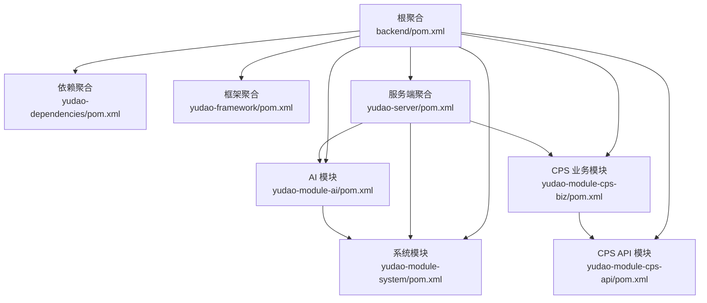
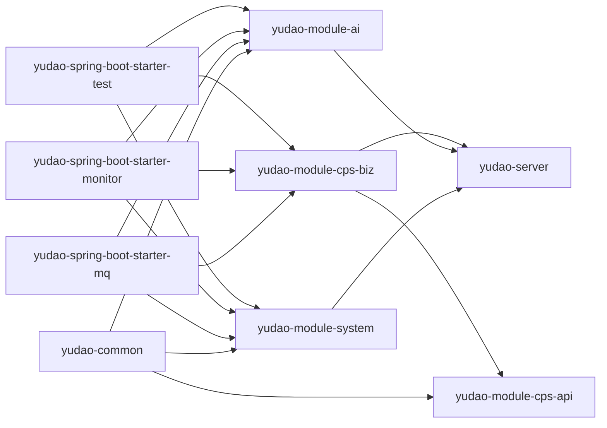
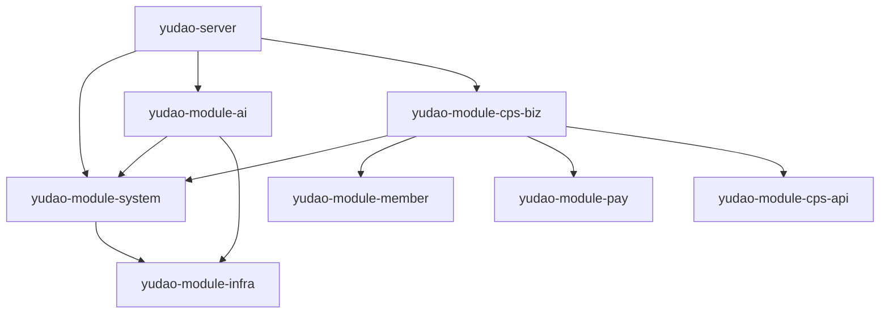

# 模块开发

<cite>
**本文引用的文件**
- [根 POM（backend/pom.xml）](file://backend/pom.xml)
- [依赖聚合 POM（yudao-dependencies/pom.xml）](file://backend/yudao-dependencies/pom.xml)
- [框架聚合 POM（yudao-framework/pom.xml）](file://backend/yudao-framework/pom.xml)
- [服务端聚合 POM（yudao-server/pom.xml）](file://backend/yudao-server/pom.xml)
- [公共基础库 POM（yudao-common/pom.xml）](file://backend/yudao-framework/yudao-common/pom.xml)
- [测试组件 POM（yudao-spring-boot-starter-test/pom.xml）](file://backend/yudao-framework/yudao-spring-boot-starter-test/pom.xml)
- [消息队列组件 POM（yudao-spring-boot-starter-mq/pom.xml）](file://backend/yudao-framework/yudao-spring-boot-starter-mq/pom.xml)
- [监控组件 POM（yudao-spring-boot-starter-monitor/pom.xml）](file://backend/yudao-framework/yudao-spring-boot-starter-monitor/pom.xml)
- [系统模块 POM（yudao-module-system/pom.xml）](file://backend/yudao-module-system/pom.xml)
- [AI 模块 POM（yudao-module-ai/pom.xml）](file://backend/yudao-module-ai/pom.xml)
- [CPS API 模块 POM（yudao-module-cps-api/pom.xml）](file://backend/yudao-module-cps/yudao-module-cps-api/pom.xml)
- [CPS 业务模块 POM（yudao-module-cps-biz/pom.xml）](file://backend/yudao-module-cps/yudao-module-cps-biz/pom.xml)
- [CPS 错误码常量（CpsErrorCodeConstants.java）](file://backend/yudao-module-cps/yudao-module-cps-api/src/main/java/cn/iocoder/yudao/module/cps/enums/CpsErrorCodeConstants.java)
</cite>

## 目录
1. [简介](#简介)
2. [项目结构](#项目结构)
3. [核心组件](#核心组件)
4. [架构总览](#架构总览)
5. [详细组件分析](#详细组件分析)
6. [依赖分析](#依赖分析)
7. [性能考虑](#性能考虑)
8. [故障排查指南](#故障排查指南)
9. [结论](#结论)
10. [附录](#附录)

## 简介
本指南面向在 AgenticCPS 多模块 Maven 项目中进行模块开发的工程师，系统阐述从“创建新模块”到“打包发布”的全流程，涵盖模块结构设计、依赖管理与循环依赖规避、模块接口设计原则、模块间通信与事件传递、数据共享、配置与动态加载、测试策略、性能监控与日志管理、以及错误处理最佳实践。文档以仓库现有模块为蓝本，结合实际 POM 配置与模块组织方式，给出可落地的实施建议。

## 项目结构
AgenticCPS 采用“顶层聚合 + 多模块”的 Maven 结构：
- 顶层聚合：backend/pom.xml，统一版本、插件与仓库配置，声明所有子模块。
- 依赖聚合：yudao-dependencies/pom.xml，集中管理第三方依赖版本与范围。
- 框架聚合：yudao-framework/pom.xml，封装通用技术组件（Web、MyBatis、Redis、安全、监控、消息队列、定时任务、Excel、测试等）。
- 服务端聚合：yudao-server/pom.xml，作为最终可执行应用容器，按需装配各业务模块。
- 业务模块：如 yudao-module-system、yudao-module-ai、yudao-module-cps 等，按领域拆分。
- API/Impl 分离：如 yudao-module-cps 下的 yudao-module-cps-api 与 yudao-module-cps-biz，遵循“接口对外、实现对内”的边界设计。

图表来源
- [根 POM（backend/pom.xml）:10-25](file://backend/pom.xml#L10-L25)
- [依赖聚合 POM（yudao-dependencies/pom.xml）:84-687](file://backend/yudao-dependencies/pom.xml#L84-L687)
- [框架聚合 POM（yudao-framework/pom.xml）:12-31](file://backend/yudao-framework/pom.xml#L12-L31)
- [服务端聚合 POM（yudao-server/pom.xml）:23-114](file://backend/yudao-server/pom.xml#L23-L114)
- [系统模块 POM（yudao-module-system/pom.xml）:20-122](file://backend/yudao-module-system/pom.xml#L20-L122)
- [AI 模块 POM（yudao-module-ai/pom.xml）:28-262](file://backend/yudao-module-ai/pom.xml#L28-L262)
- [CPS API 模块 POM（yudao-module-cps-api/pom.xml）:19-31](file://backend/yudao-module-cps/yudao-module-cps-api/pom.xml#L19-L31)
- [CPS 业务模块 POM（yudao-module-cps-biz/pom.xml）:20-100](file://backend/yudao-module-cps/yudao-module-cps-biz/pom.xml#L20-L100)

章节来源
- [根 POM（backend/pom.xml）:10-25](file://backend/pom.xml#L10-L25)
- [依赖聚合 POM（yudao-dependencies/pom.xml）:84-687](file://backend/yudao-dependencies/pom.xml#L84-L687)

## 核心组件
- 依赖版本治理：通过 yudao-dependencies/pom.xml 的 dependencyManagement 统一约束版本，避免子模块重复声明。
- 框架组件：yudao-framework 下的 starter 组件提供 Web、安全、MyBatis、Redis、监控、消息队列、定时任务、Excel、测试等能力，模块仅按需引入。
- 服务端装配：yudao-server/pom.xml 作为最终可执行应用，通过依赖声明装配所需模块，形成“容器 + 插件式模块”的架构。
- API/Impl 分离：CPS 模块采用 API/Impl 分离，API 模块仅暴露接口与通用类型，业务模块依赖 API，避免跨模块直接耦合。

章节来源
- [框架聚合 POM（yudao-framework/pom.xml）:12-31](file://backend/yudao-framework/pom.xml#L12-L31)
- [服务端聚合 POM（yudao-server/pom.xml）:23-114](file://backend/yudao-server/pom.xml#L23-L114)
- [CPS API 模块 POM（yudao-module-cps-api/pom.xml）:19-31](file://backend/yudao-module-cps/yudao-module-cps-api/pom.xml#L19-L31)
- [CPS 业务模块 POM（yudao-module-cps-biz/pom.xml）:20-100](file://backend/yudao-module-cps/yudao-module-cps-biz/pom.xml#L20-L100)

## 架构总览
模块间依赖遵循“单向依赖、接口外向”的原则：
- 低层模块（common、framework、server）向上层模块提供能力；上层模块向下层模块解耦。
- 业务模块之间通过 API 模块或通用组件进行交互，避免直接互相依赖。
- 服务端聚合模块按需装配，实现“按需启用、按需关闭”。

图表来源
- [公共基础库 POM（yudao-common/pom.xml）:18-147](file://backend/yudao-framework/yudao-common/pom.xml#L18-L147)
- [消息队列组件 POM（yudao-spring-boot-starter-mq/pom.xml）:18-41](file://backend/yudao-framework/yudao-spring-boot-starter-mq/pom.xml#L18-L41)
- [监控组件 POM（yudao-spring-boot-starter-monitor/pom.xml）:18-76](file://backend/yudao-framework/yudao-spring-boot-starter-monitor/pom.xml#L18-L76)
- [系统模块 POM（yudao-module-system/pom.xml）:20-122](file://backend/yudao-module-system/pom.xml#L20-L122)
- [AI 模块 POM（yudao-module-ai/pom.xml）:28-262](file://backend/yudao-module-ai/pom.xml#L28-L262)
- [CPS API 模块 POM（yudao-module-cps-api/pom.xml）:19-31](file://backend/yudao-module-cps/yudao-module-cps-api/pom.xml#L19-L31)
- [CPS 业务模块 POM（yudao-module-cps-biz/pom.xml）:20-100](file://backend/yudao-module-cps/yudao-module-cps-biz/pom.xml#L20-L100)
- [服务端聚合 POM（yudao-server/pom.xml）:23-114](file://backend/yudao-server/pom.xml#L23-L114)

## 详细组件分析

### 新模块创建步骤
- 在顶层聚合中新增模块目录与 pom.xml，确保继承根 POM 的 groupId、version 与属性。
- 若模块为 API/Impl 分离，先创建 API 模块（仅接口与通用类型），再创建 Impl 模块（业务实现），并在 Impl 中显式依赖 API。
- 在 yudao-server/pom.xml 中按需添加对新模块的依赖，实现“按需启用”。

章节来源
- [根 POM（backend/pom.xml）:31-45](file://backend/pom.xml#L31-L45)
- [CPS API 模块 POM（yudao-module-cps-api/pom.xml）:19-31](file://backend/yudao-module-cps/yudao-module-cps-api/pom.xml#L19-L31)
- [CPS 业务模块 POM（yudao-module-cps-biz/pom.xml）:20-100](file://backend/yudao-module-cps/yudao-module-cps-biz/pom.xml#L20-L100)
- [服务端聚合 POM（yudao-server/pom.xml）:23-114](file://backend/yudao-server/pom.xml#L23-L114)

### 模块结构设计与接口设计原则
- API/Impl 分离：API 模块只暴露稳定接口与通用类型，避免业务细节泄露；Impl 模块实现具体逻辑。
- 低耦合高内聚：模块内部职责单一，模块间通过清晰的接口契约交互。
- 无循环依赖：通过“上层模块依赖下层模块”的方向约束，避免环状依赖；必要时引入中间层或抽象。

章节来源
- [CPS API 模块 POM（yudao-module-cps-api/pom.xml）:19-31](file://backend/yudao-module-cps/yudao-module-cps-api/pom.xml#L19-L31)
- [CPS 业务模块 POM（yudao-module-cps-biz/pom.xml）:20-100](file://backend/yudao-module-cps/yudao-module-cps-biz/pom.xml#L20-L100)

### 依赖管理与版本治理
- 版本集中管理：在 yudao-dependencies/pom.xml 的 dependencyManagement 中统一声明版本号与可选依赖，模块仅需声明坐标即可。
- 按需引入：模块仅引入自身所需的 starter 组件，避免冗余依赖。
- 依赖范围控制：对 provided 依赖（如 Spring Web、Servlet API、OpenAPI）在公共库中提供，模块无需重复声明。

章节来源
- [依赖聚合 POM（yudao-dependencies/pom.xml）:84-687](file://backend/yudao-dependencies/pom.xml#L84-L687)
- [公共基础库 POM（yudao-common/pom.xml）:18-147](file://backend/yudao-framework/yudao-common/pom.xml#L18-L147)

### 模块打包与发布流程
- 统一版本：根 POM 使用 revision 属性统一版本，通过 flatten-maven-plugin 在构建时展开。
- 可执行应用：yudao-server/pom.xml 使用 spring-boot-maven-plugin 将依赖打包为可执行 jar。
- 发布策略：建议在 CI/CD 中统一执行 mvn clean install，生成 flattened POM 与可执行产物。

章节来源
- [根 POM（backend/pom.xml）:115-141](file://backend/pom.xml#L115-L141)
- [服务端聚合 POM（yudao-server/pom.xml）:116-134](file://backend/yudao-server/pom.xml#L116-L134)

### 模块间通信机制、事件传递与数据共享
- 消息队列：yudao-spring-boot-starter-mq 提供对 Kafka、RabbitMQ、RocketMQ 的支持，模块按需引入对应 starter。
- 事件驱动：可通过消息队列实现跨模块异步事件传递，避免强耦合同步调用。
- 数据共享：通过 API 模块共享实体与 DTO，配合 Redis/数据库实现共享状态；避免直接持有对方实现细节。

章节来源
- [消息队列组件 POM（yudao-spring-boot-starter-mq/pom.xml）:18-41](file://backend/yudao-framework/yudao-spring-boot-starter-mq/pom.xml#L18-L41)
- [CPS 业务模块 POM（yudao-module-cps-biz/pom.xml）:28-39](file://backend/yudao-module-cps/yudao-module-cps-biz/pom.xml#L28-L39)

### 配置文件管理、环境变量与动态配置加载
- 配置中心：建议在 yudao-server 中引入配置中心客户端（如 Nacos/Consul），实现动态配置刷新。
- 环境隔离：通过 Maven profiles 与 Spring Profiles 切换不同环境配置，结合 CI/CD 注入环境变量。
- 动态配置：模块通过 @ConfigurationProperties 或 @RefreshScope 实现配置热更新。

（本节为通用实践建议，未直接分析具体文件）

### 模块测试策略、单元测试与集成测试
- 单元测试：使用 yudao-spring-boot-starter-test 提供的 H2、jedis-mock、Mockito、Podam 等依赖，快速搭建测试环境。
- 集成测试：通过 yudao-spring-boot-starter-test 的 MyBatis 与 Redis Starter，模拟真实环境。
- 测试覆盖率：建议在 CI 中开启覆盖率报告，确保关键路径均有覆盖。

章节来源
- [测试组件 POM（yudao-spring-boot-starter-test/pom.xml）:18-59](file://backend/yudao-framework/yudao-spring-boot-starter-test/pom.xml#L18-L59)

### 性能监控、日志管理与错误处理
- 链路追踪：yudao-spring-boot-starter-monitor 提供 SkyWalking 与 OpenTracing 支持，模块按需引入。
- 指标采集：通过 Micrometer Prometheus 集成，暴露 JVM 与业务指标。
- 日志：结合 SkyWalking 日志工具包，统一日志格式与采样策略。
- 错误码：模块内部使用统一的错误码常量接口（参考 CPS 的 CpsErrorCodeConstants），便于前端与监控侧统一处理。

章节来源
- [监控组件 POM（yudao-spring-boot-starter-monitor/pom.xml）:18-76](file://backend/yudao-framework/yudao-spring-boot-starter-monitor/pom.xml#L18-L76)
- [CPS 错误码常量（CpsErrorCodeConstants.java）:10-64](file://backend/yudao-module-cps/yudao-module-cps-api/src/main/java/cn/iocoder/yudao/module/cps/enums/CpsErrorCodeConstants.java#L10-L64)

## 依赖分析
模块间依赖关系如下：
- yudao-module-system 依赖 yudao-module-infra 与各类框架组件，提供通用能力。
- yudao-module-ai 依赖 system 与 infra，同时引入多种 AI 模型与向量存储组件。
- yudao-module-cps-biz 依赖 cps-api、member、pay、system 与各类框架组件，体现业务复杂度与跨域协作。
- yudao-server 作为装配容器，按需引入上述模块。

图表来源
- [系统模块 POM（yudao-module-system/pom.xml）:20-122](file://backend/yudao-module-system/pom.xml#L20-L122)
- [AI 模块 POM（yudao-module-ai/pom.xml）:28-262](file://backend/yudao-module-ai/pom.xml#L28-L262)
- [CPS 业务模块 POM（yudao-module-cps-biz/pom.xml）:20-100](file://backend/yudao-module-cps/yudao-module-cps-biz/pom.xml#L20-L100)
- [服务端聚合 POM（yudao-server/pom.xml）:23-114](file://backend/yudao-server/pom.xml#L23-L114)

章节来源
- [系统模块 POM（yudao-module-system/pom.xml）:20-122](file://backend/yudao-module-system/pom.xml#L20-L122)
- [AI 模块 POM（yudao-module-ai/pom.xml）:28-262](file://backend/yudao-module-ai/pom.xml#L28-L262)
- [CPS 业务模块 POM（yudao-module-cps-biz/pom.xml）:20-100](file://backend/yudao-module-cps/yudao-module-cps-biz/pom.xml#L20-L100)
- [服务端聚合 POM（yudao-server/pom.xml）:23-114](file://backend/yudao-server/pom.xml#L23-L114)

## 性能考虑
- 依赖瘦身：仅引入必要 starter，避免不必要的自动配置与依赖注入开销。
- 缓存策略：合理使用 Redis 与本地缓存，减少重复计算与数据库压力。
- 异步化：对耗时操作（如通知、报表、同步）通过消息队列异步化，降低请求延迟。
- 监控与告警：开启链路追踪与指标采集，建立性能基线与异常阈值。

（本节为通用指导，未直接分析具体文件）

## 故障排查指南
- 循环依赖：若出现循环依赖，检查模块间依赖方向，优先将共享接口下沉至 API 模块或公共基础库。
- 版本冲突：通过 dependencyManagement 集中管理版本，避免子模块各自声明导致的冲突。
- 启动失败：优先查看 yudao-spring-boot-starter-monitor 与 yudao-spring-boot-starter-test 是否正确引入，确认配置是否生效。
- 错误码定位：使用模块内统一的错误码常量接口，便于前后端与监控侧快速定位问题。

章节来源
- [CPS 错误码常量（CpsErrorCodeConstants.java）:10-64](file://backend/yudao-module-cps/yudao-module-cps-api/src/main/java/cn/iocoder/yudao/module/cps/enums/CpsErrorCodeConstants.java#L10-L64)

## 结论
AgenticCPS 的多模块架构通过“依赖聚合 + 框架组件 + API/Impl 分离 + 服务端装配”的模式，实现了高内聚、低耦合与可扩展的模块化体系。遵循本文的模块创建流程、依赖管理与接口设计原则，结合消息队列、监控与测试策略，可在保证质量的前提下高效推进模块演进与交付。

## 附录

### 模块创建与配置清单
- 在根 POM 中注册新模块。
- API/Impl 分离：先创建 API 模块，再创建 Impl 模块并在 Impl 中显式依赖 API。
- 依赖引入：仅引入所需 starter，避免冗余。
- 测试：使用 yudao-spring-boot-starter-test 快速搭建测试环境。
- 监控：按需引入 yudao-spring-boot-starter-monitor，启用链路追踪与指标采集。
- 打包：在 yudao-server 中按需装配，使用 spring-boot-maven-plugin 打包。

章节来源
- [根 POM（backend/pom.xml）:10-25](file://backend/pom.xml#L10-L25)
- [CPS API 模块 POM（yudao-module-cps-api/pom.xml）:19-31](file://backend/yudao-module-cps/yudao-module-cps-api/pom.xml#L19-L31)
- [CPS 业务模块 POM（yudao-module-cps-biz/pom.xml）:20-100](file://backend/yudao-module-cps/yudao-module-cps-biz/pom.xml#L20-L100)
- [测试组件 POM（yudao-spring-boot-starter-test/pom.xml）:18-59](file://backend/yudao-framework/yudao-spring-boot-starter-test/pom.xml#L18-L59)
- [监控组件 POM（yudao-spring-boot-starter-monitor/pom.xml）:18-76](file://backend/yudao-framework/yudao-spring-boot-starter-monitor/pom.xml#L18-L76)
- [服务端聚合 POM（yudao-server/pom.xml）:116-134](file://backend/yudao-server/pom.xml#L116-L134)