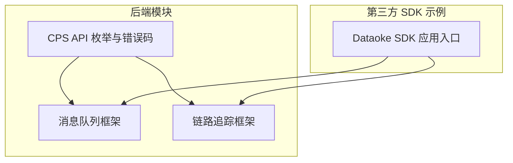
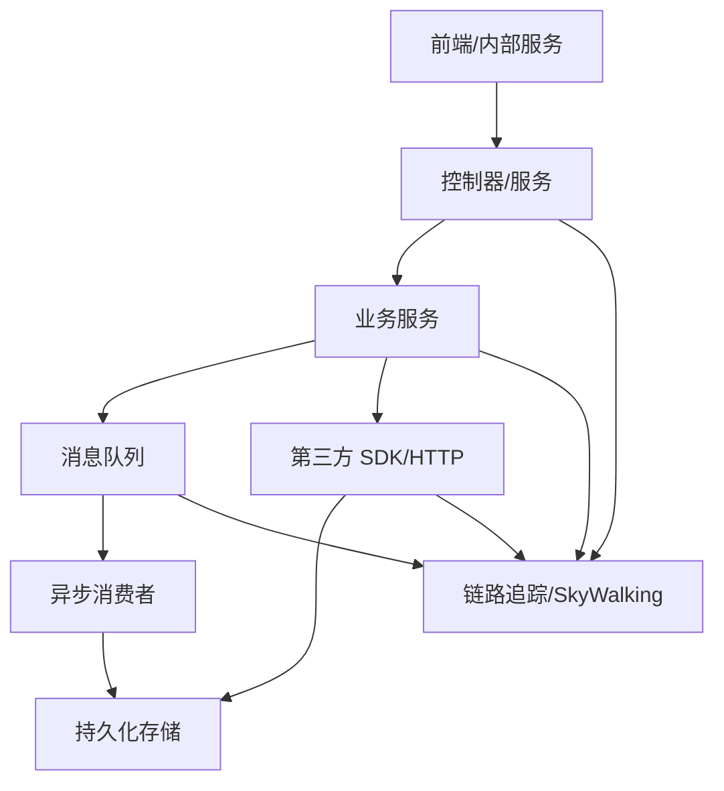
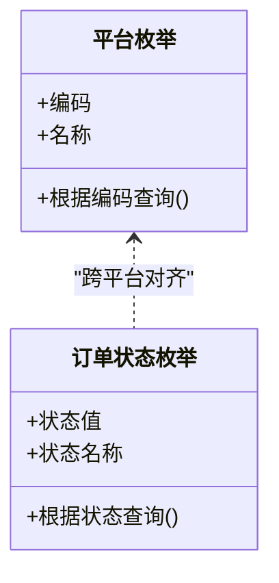
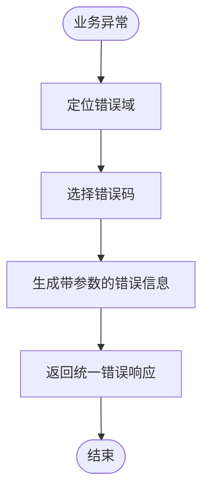
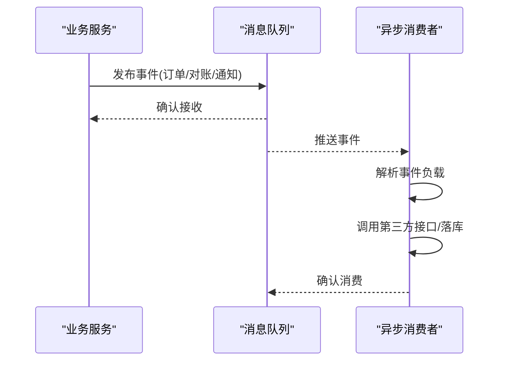
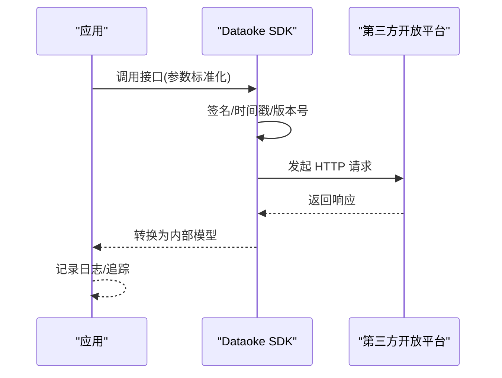
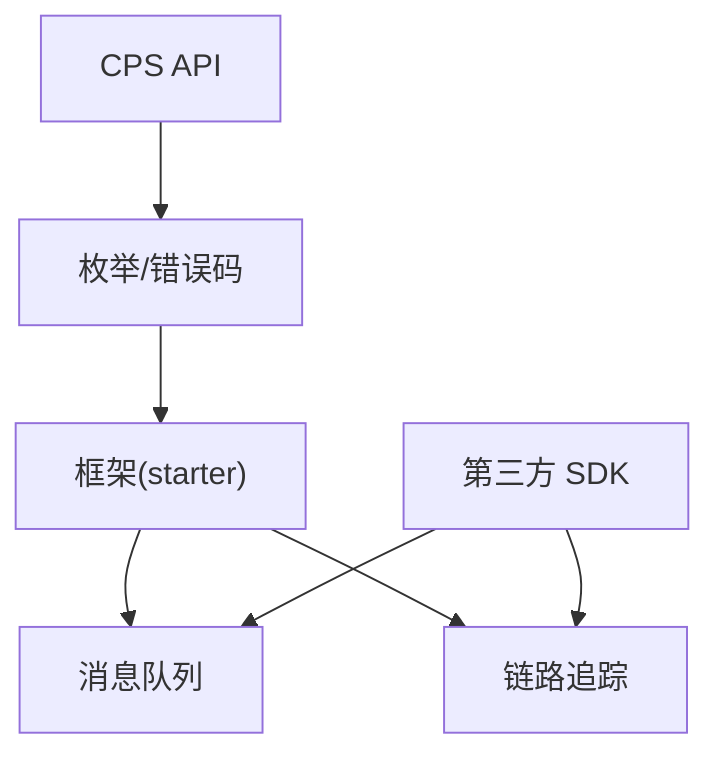

# 第三方系统集成

<cite>
**本文引用的文件**
- [CpsPlatformCodeEnum.java](file://backend/yudao-module-cps/yudao-module-cps-api/src/main/java/cn/iocoder/yudao/module/cps/enums/CpsPlatformCodeEnum.java)
- [CpsOrderStatusEnum.java](file://backend/yudao-module-cps/yudao-module-cps-api/src/main/java/cn/iocoder/yudao/module/cps/enums/CpsOrderStatusEnum.java)
- [CpsErrorCodeConstants.java](file://backend/yudao-module-cps/yudao-module-cps-api/src/main/java/cn/iocoder/yudao/module/cps/enums/CpsErrorCodeConstants.java)
- [package-info.java（消息队列）](file://backend/yudao-framework/yudao-spring-boot-starter-mq/src/main/java/cn/iocoder/yudao/framework/mq/package-info.java)
- [package-info.java（链路追踪）](file://backend/yudao-framework/yudao-spring-boot-starter-monitor/src/main/java/cn/iocoder/yudao/framework/tracer/package-info.java)
- [DtkJavaOpenPlatformSdkApplication.java](file://agent_improvement/sdk_demo/dataoke-sdk-java/src/main/java/com/dtk/api/DtkJavaOpenPlatformSdkApplication.java)
- [README.md（Dataoke SDK）](file://agent_improvement/sdk_demo/dataoke-sdk-java/README.md)
- [pom.xml（Dataoke SDK）](file://agent_improvement/sdk_demo/dataoke-sdk-java/pom.xml)
</cite>

## 目录
1. [引言](#引言)
2. [项目结构](#项目结构)
3. [核心组件](#核心组件)
4. [架构总览](#架构总览)
5. [详细组件分析](#详细组件分析)
6. [依赖分析](#依赖分析)
7. [性能考虑](#性能考虑)
8. [故障排查指南](#故障排查指南)
9. [结论](#结论)
10. [附录](#附录)

## 引言
本指南面向需要对接第三方系统的开发与运维人员，围绕以下目标展开：外部系统对接流程、API 封装与数据格式转换、认证授权与 OAuth2 集成、令牌管理、消息队列与事件驱动、配置中心与动态配置、数据同步策略与冲突解决、集成测试与 Mock、监控告警与日志追踪、以及故障恢复方案。本文以仓库中现有的模块与框架能力为基础，结合可复用的基础设施（消息队列、链路追踪等），给出可落地的实践建议。

## 项目结构
本项目采用多模块分层组织，其中与第三方系统集成密切相关的部分包括：
- CPS 模块（枚举与错误码定义）
- 框架层（消息队列、链路追踪等基础设施）
- 第三方 SDK 示例（如 Dataoke SDK）

图表来源
- [CpsPlatformCodeEnum.java:1-45](file://backend/yudao-module-cps/yudao-module-cps-api/src/main/java/cn/iocoder/yudao/module/cps/enums/CpsPlatformCodeEnum.java#L1-L45)
- [CpsOrderStatusEnum.java:1-48](file://backend/yudao-module-cps/yudao-module-cps-api/src/main/java/cn/iocoder/yudao/module/cps/enums/CpsOrderStatusEnum.java#L1-L48)
- [CpsErrorCodeConstants.java:1-65](file://backend/yudao-module-cps/yudao-module-cps-api/src/main/java/cn/iocoder/yudao/module/cps/enums/CpsErrorCodeConstants.java#L1-L65)
- [package-info.java（消息队列）:1-5](file://backend/yudao-framework/yudao-spring-boot-starter-mq/src/main/java/cn/iocoder/yudao/framework/mq/package-info.java#L1-L5)
- [package-info.java（链路追踪）:1-7](file://backend/yudao-framework/yudao-spring-boot-starter-monitor/src/main/java/cn/iocoder/yudao/framework/tracer/package-info.java#L1-L7)
- [DtkJavaOpenPlatformSdkApplication.java](file://agent_improvement/sdk_demo/dataoke-sdk-java/src/main/java/com/dtk/api/DtkJavaOpenPlatformSdkApplication.java)

章节来源
- [package-info.java（消息队列）:1-5](file://backend/yudao-framework/yudao-spring-boot-starter-mq/src/main/java/cn/iocoder/yudao/framework/mq/package-info.java#L1-L5)
- [package-info.java（链路追踪）:1-7](file://backend/yudao-framework/yudao-spring-boot-starter-monitor/src/main/java/cn/iocoder/yudao/framework/tracer/package-info.java#L1-L7)

## 核心组件
- 平台与订单状态枚举：用于统一第三方平台标识与订单状态映射，便于跨系统对齐。
- 错误码常量：集中定义业务错误域，便于对外输出一致的错误语义。
- 消息队列框架：提供多种 MQ 支持，适配事件驱动与异步处理。
- 链路追踪框架：基于 SkyWalking 的链路追踪与日志中心能力。
- 第三方 SDK 示例：以 Dataoke SDK 为例，展示如何封装第三方 API、进行数据转换与异常处理。

章节来源
- [CpsPlatformCodeEnum.java:1-45](file://backend/yudao-module-cps/yudao-module-cps-api/src/main/java/cn/iocoder/yudao/module/cps/enums/CpsPlatformCodeEnum.java#L1-L45)
- [CpsOrderStatusEnum.java:1-48](file://backend/yudao-module-cps/yudao-module-cps-api/src/main/java/cn/iocoder/yudao/module/cps/enums/CpsOrderStatusEnum.java#L1-L48)
- [CpsErrorCodeConstants.java:1-65](file://backend/yudao-module-cps/yudao-module-cps-api/src/main/java/cn/iocoder/yudao/module/cps/enums/CpsErrorCodeConstants.java#L1-L65)

## 架构总览
下图展示了第三方系统集成的整体架构：前端或内部服务触发请求，经由网关/控制器进入业务模块；业务模块通过消息队列解耦异步处理；对外调用第三方 SDK 或 HTTP 接口；链路追踪贯穿请求生命周期，统一采集日志与指标。

图表来源
- [package-info.java（消息队列）:1-5](file://backend/yudao-framework/yudao-spring-boot-starter-mq/src/main/java/cn/iocoder/yudao/framework/mq/package-info.java#L1-L5)
- [package-info.java（链路追踪）:1-7](file://backend/yudao-framework/yudao-spring-boot-starter-monitor/src/main/java/cn/iocoder/yudao/framework/tracer/package-info.java#L1-L7)

## 详细组件分析

### 平台与订单状态枚举
- 平台枚举：统一淘宝联盟、京东联盟、拼多多联盟、抖音联盟等平台编码，便于在不同系统间保持一致性。
- 订单状态枚举：覆盖已下单、已付款、已收货、已结算、已到账、已退款、已失效等状态，支撑跨平台订单对账与状态同步。

图表来源
- [CpsPlatformCodeEnum.java:1-45](file://backend/yudao-module-cps/yudao-module-cps-api/src/main/java/cn/iocoder/yudao/module/cps/enums/CpsPlatformCodeEnum.java#L1-L45)
- [CpsOrderStatusEnum.java:1-48](file://backend/yudao-module-cps/yudao-module-cps-api/src/main/java/cn/iocoder/yudao/module/cps/enums/CpsOrderStatusEnum.java#L1-L48)

章节来源
- [CpsPlatformCodeEnum.java:1-45](file://backend/yudao-module-cps/yudao-module-cps-api/src/main/java/cn/iocoder/yudao/module/cps/enums/CpsPlatformCodeEnum.java#L1-L45)
- [CpsOrderStatusEnum.java:1-48](file://backend/yudao-module-cps/yudao-module-cps-api/src/main/java/cn/iocoder/yudao/module/cps/enums/CpsOrderStatusEnum.java#L1-L48)

### 错误码常量与统一异常
- 错误码域划分：按“平台配置、推广位、订单、返利配置、返利记录、返利账户、提现、统计、MCP、转链、冻结、风控”等维度划分，便于定位问题与扩展。
- 建议：对外返回统一的错误对象，包含错误码、错误信息与上下文参数，便于前端与第三方系统消费。

图表来源
- [CpsErrorCodeConstants.java:1-65](file://backend/yudao-module-cps/yudao-module-cps-api/src/main/java/cn/iocoder/yudao/module/cps/enums/CpsErrorCodeConstants.java#L1-L65)

章节来源
- [CpsErrorCodeConstants.java:1-65](file://backend/yudao-module-cps/yudao-module-cps-api/src/main/java/cn/iocoder/yudao/module/cps/enums/CpsErrorCodeConstants.java#L1-L65)

### 消息队列与事件驱动
- 框架支持：Redis、RocketMQ、RabbitMQ、Kafka 多种消息中间件，便于按环境与场景选择。
- 建议模式：
  - 订单事件：下单成功后发布“订单创建”事件，异步拉取第三方订单详情并落库。
  - 对账事件：定时任务触发对账，差异事件入队，人工复核或自动补偿。
  - 通知事件：返利到账、提现完成等通知，异步发送站内信/短信/邮件。

图表来源
- [package-info.java（消息队列）:1-5](file://backend/yudao-framework/yudao-spring-boot-starter-mq/src/main/java/cn/iocoder/yudao/framework/mq/package-info.java#L1-L5)

章节来源
- [package-info.java（消息队列）:1-5](file://backend/yudao-framework/yudao-spring-boot-starter-mq/src/main/java/cn/iocoder/yudao/framework/mq/package-info.java#L1-L5)

### 链路追踪与日志中心
- SkyWalking 集成：统一链路追踪、日志中心，便于跨服务定位问题。
- 建议实践：
  - 为每个外部调用打上标签（如平台编码、订单号、用户 ID）。
  - 对第三方接口超时、异常进行告警与重试策略记录。
  - 结合日志中心查看上下游调用链路与耗时。

图表来源
- [package-info.java（链路追踪）:1-7](file://backend/yudao-framework/yudao-spring-boot-starter-monitor/src/main/java/cn/iocoder/yudao/framework/tracer/package-info.java#L1-L7)

章节来源
- [package-info.java（链路追踪）:1-7](file://backend/yudao-framework/yudao-spring-boot-starter-monitor/src/main/java/cn/iocoder/yudao/framework/tracer/package-info.java#L1-L7)

### 第三方 SDK 集成示例（Dataoke SDK）
- 应用入口：SDK 启动类负责初始化客户端、配置参数与注册组件。
- 建议封装：
  - 请求参数标准化：统一签名、时间戳、版本号、平台编码。
  - 响应数据转换：将第三方字段映射到内部模型，保留原始响应以便审计。
  - 异常处理：区分网络异常、鉴权失败、业务错误，分别走重试/熔断/告警。
  - 日志与追踪：为每次调用注入 TraceId，记录请求/响应摘要。

图表来源
- [DtkJavaOpenPlatformSdkApplication.java](file://agent_improvement/sdk_demo/dataoke-sdk-java/src/main/java/com/dtk/api/DtkJavaOpenPlatformSdkApplication.java)
- [README.md（Dataoke SDK）](file://agent_improvement/sdk_demo/dataoke-sdk-java/README.md)
- [pom.xml（Dataoke SDK）](file://agent_improvement/sdk_demo/dataoke-sdk-java/pom.xml)

章节来源
- [DtkJavaOpenPlatformSdkApplication.java](file://agent_improvement/sdk_demo/dataoke-sdk-java/src/main/java/com/dtk/api/DtkJavaOpenPlatformSdkApplication.java)
- [README.md（Dataoke SDK）](file://agent_improvement/sdk_demo/dataoke-sdk-java/README.md)
- [pom.xml（Dataoke SDK）](file://agent_improvement/sdk_demo/dataoke-sdk-java/pom.xml)

## 依赖分析
- 模块内聚：CPS 枚举与错误码位于 API 层，便于业务与框架共享。
- 外部依赖：第三方 SDK 通过 Maven 管理，建议在统一的依赖管理中锁定版本，避免冲突。
- 框架依赖：消息队列与链路追踪通过 starter 自动装配，降低接入成本。

图表来源
- [CpsPlatformCodeEnum.java:1-45](file://backend/yudao-module-cps/yudao-module-cps-api/src/main/java/cn/iocoder/yudao/module/cps/enums/CpsPlatformCodeEnum.java#L1-L45)
- [CpsErrorCodeConstants.java:1-65](file://backend/yudao-module-cps/yudao-module-cps-api/src/main/java/cn/iocoder/yudao/module/cps/enums/CpsErrorCodeConstants.java#L1-L65)
- [package-info.java（消息队列）:1-5](file://backend/yudao-framework/yudao-spring-boot-starter-mq/src/main/java/cn/iocoder/yudao/framework/mq/package-info.java#L1-L5)
- [package-info.java（链路追踪）:1-7](file://backend/yudao-framework/yudao-spring-boot-starter-monitor/src/main/java/cn/iocoder/yudao/framework/tracer/package-info.java#L1-L7)
- [pom.xml（Dataoke SDK）](file://agent_improvement/sdk_demo/dataoke-sdk-java/pom.xml)

章节来源
- [CpsPlatformCodeEnum.java:1-45](file://backend/yudao-module-cps/yudao-module-cps-api/src/main/java/cn/iocoder/yudao/module/cps/enums/CpsPlatformCodeEnum.java#L1-L45)
- [CpsErrorCodeConstants.java:1-65](file://backend/yudao-module-cps/yudao-module-cps-api/src/main/java/cn/iocoder/yudao/module/cps/enums/CpsErrorCodeConstants.java#L1-L65)
- [package-info.java（消息队列）:1-5](file://backend/yudao-framework/yudao-spring-boot-starter-mq/src/main/java/cn/iocoder/yudao/framework/mq/package-info.java#L1-L5)
- [package-info.java（链路追踪）:1-7](file://backend/yudao-framework/yudao-spring-boot-starter-monitor/src/main/java/cn/iocoder/yudao/framework/tracer/package-info.java#L1-L7)
- [pom.xml（Dataoke SDK）](file://agent_improvement/sdk_demo/dataoke-sdk-java/pom.xml)

## 性能考虑
- 异步化优先：对第三方调用尽量异步化，减少主流程阻塞。
- 批量处理：对账与同步任务采用批量拉取与批量入库，降低 IO 压力。
- 缓存策略：对高频只读数据（如平台配置、商品基础信息）引入缓存，设置合理过期与失效策略。
- 超时与重试：为第三方接口设置合理的超时与指数退避重试，避免雪崩。
- 监控与限流：结合链路追踪与指标监控，识别慢调用与异常峰值，必要时启用限流与熔断。

## 故障排查指南
- 链路追踪：通过 TraceId 快速定位异常请求的上游与下游，查看耗时与错误栈。
- 日志中心：集中检索第三方调用日志，核对签名、参数与响应体摘要。
- 错误码定位：依据错误码域快速判断问题类型（如平台配置缺失、订单状态非法、风控拦截等）。
- 重试与补偿：对可恢复异常自动重试，对不可恢复异常记录补偿任务，确保最终一致性。
- 告警联动：将超时、异常率、重试次数等指标接入告警系统，触发值班流程。

章节来源
- [CpsErrorCodeConstants.java:1-65](file://backend/yudao-module-cps/yudao-module-cps-api/src/main/java/cn/iocoder/yudao/module/cps/enums/CpsErrorCodeConstants.java#L1-L65)
- [package-info.java（链路追踪）:1-7](file://backend/yudao-framework/yudao-spring-boot-starter-monitor/src/main/java/cn/iocoder/yudao/framework/tracer/package-info.java#L1-L7)

## 结论
通过统一的平台与状态枚举、规范化的错误码域、事件驱动的消息队列与链路追踪能力，以及可复用的第三方 SDK 示例，本项目为第三方系统集成提供了清晰的实施路径。建议在实际落地中，结合自身业务场景完善认证授权、令牌管理、配置中心与动态参数、数据同步与冲突解决、测试与监控告警体系，确保系统稳定、可观测与可演进。

## 附录
- 外部系统对接流程建议
  - 明确平台编码与订单状态映射，统一内部模型。
  - 设计 API 封装层，负责参数标准化、签名、重试与异常转换。
  - 引入消息队列与异步消费者，实现事件驱动与削峰填谷。
  - 借助链路追踪与日志中心，建立端到端可观测性。
  - 制定测试与联调流程，覆盖 Mock 服务、回归与压测。
  - 建立监控告警与故障恢复预案，保障生产稳定。