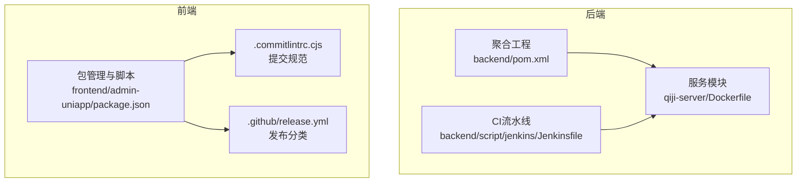
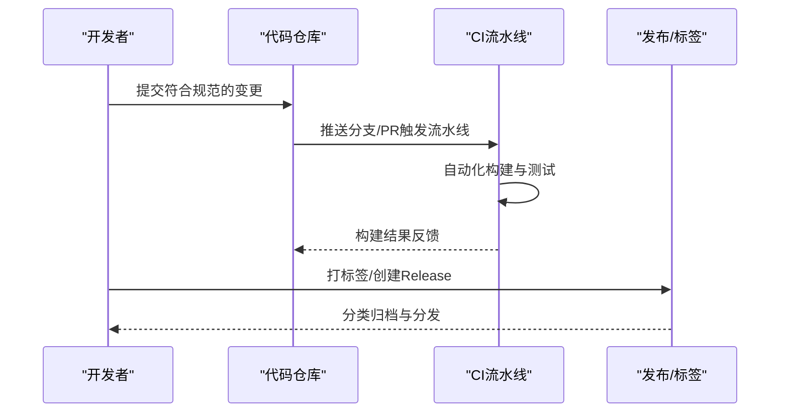
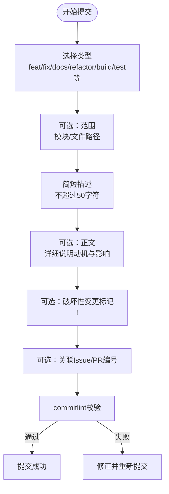
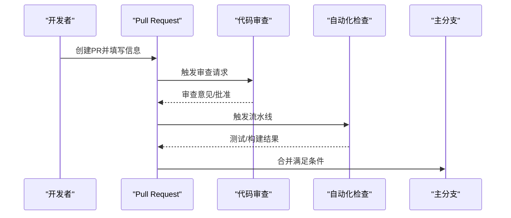
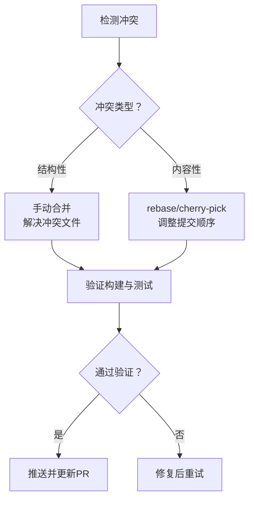
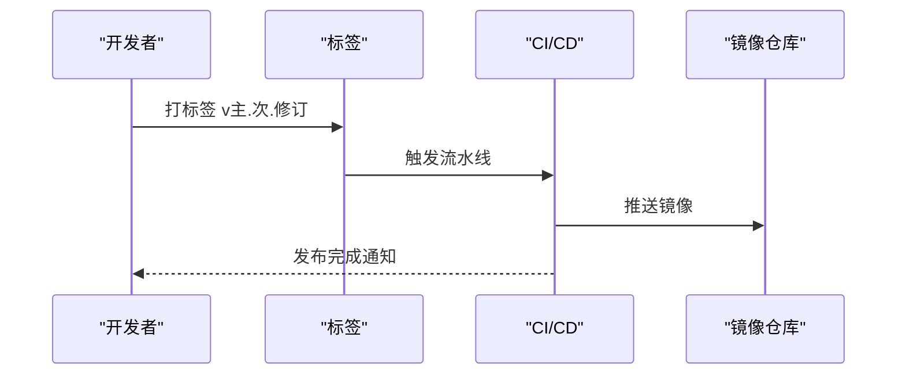
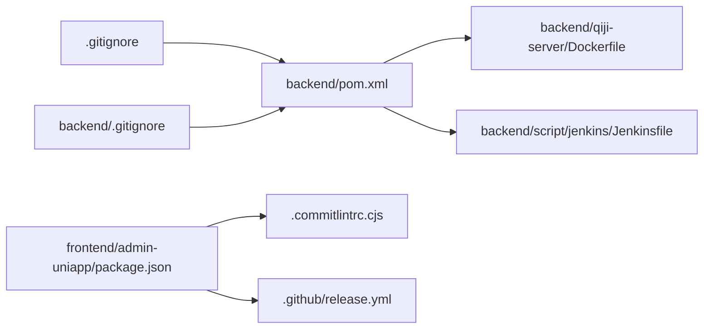

# Git工作流规范

<cite>
**本文引用的文件**
- [.gitignore](file://.gitignore)
- [backend/.gitignore](file://backend/.gitignore)
- [backend/script/jenkins/Jenkinsfile](file://backend/script/jenkins/Jenkinsfile)
- [backend/qiji-server/Dockerfile](file://backend/qiji-server/Dockerfile)
- [backend/pom.xml](file://backend/pom.xml)
- [frontend/admin-uniapp/.commitlintrc.cjs](file://frontend/admin-uniapp/.commitlintrc.cjs)
- [frontend/admin-uniapp/.github/release.yml](file://frontend/admin-uniapp/.github/release.yml)
- [frontend/admin-uniapp/package.json](file://frontend/admin-uniapp/package.json)
</cite>

## 目录
1. [引言](#引言)
2. [项目结构](#项目结构)
3. [核心组件](#核心组件)
4. [架构总览](#架构总览)
5. [详细组件分析](#详细组件分析)
6. [依赖关系分析](#依赖关系分析)
7. [性能考虑](#性能考虑)
8. [故障排查指南](#故障排查指南)
9. [结论](#结论)
10. [附录](#附录)

## 引言
本规范面向AgenticCPS项目的Git工作流，围绕分支管理、提交规范、合并策略、冲突解决、版本管理以及常用Git工具实践进行系统化梳理。结合仓库中现有的CI配置、提交规范与发布分类规则，帮助团队建立一致、可追溯、可自动化的协作流程。

## 项目结构
AgenticCPS采用多模块工程组织方式，前端与后端分别维护独立的版本与发布节奏。后端基于Maven聚合工程，前端基于包管理器与构建脚本。CI方面，后端使用Jenkins流水线，前端使用GitHub Actions的release分类规则。

**图示来源**
- [backend/pom.xml:1-176](file://backend/pom.xml#L1-L176)
- [backend/qiji-server/Dockerfile:1-24](file://backend/qiji-server/Dockerfile#L1-L24)
- [backend/script/jenkins/Jenkinsfile:1-61](file://backend/script/jenkins/Jenkinsfile#L1-L61)
- [frontend/admin-uniapp/package.json:1-194](file://frontend/admin-uniapp/package.json#L1-L194)
- [frontend/admin-uniapp/.commitlintrc.cjs:1-4](file://frontend/admin-uniapp/.commitlintrc.cjs#L1-L4)
- [frontend/admin-uniapp/.github/release.yml:1-32](file://frontend/admin-uniapp/.github/release.yml#L1-L32)

**章节来源**
- [backend/pom.xml:1-176](file://backend/pom.xml#L1-L176)
- [backend/qiji-server/Dockerfile:1-24](file://backend/qiji-server/Dockerfile#L1-L24)
- [backend/script/jenkins/Jenkinsfile:1-61](file://backend/script/jenkins/Jenkinsfile#L1-L61)
- [frontend/admin-uniapp/package.json:1-194](file://frontend/admin-uniapp/package.json#L1-L194)
- [frontend/admin-uniapp/.commitlintrc.cjs:1-4](file://frontend/admin-uniapp/.commitlintrc.cjs#L1-L4)
- [frontend/admin-uniapp/.github/release.yml:1-32](file://frontend/admin-uniapp/.github/release.yml#L1-L32)

## 核心组件
- 分支与版本治理：后端以Maven版本与Docker镜像为核心；前端以包版本与发布分类为主。
- 提交规范：前端采用Conventional Commits，配合commitlint校验。
- 合并与发布：前端使用GitHub Release分类；后端使用Jenkins流水线触发构建与部署。
- 冲突与回滚：建议遵循“预防优先、流程清晰、可回滚”的原则，结合rebase与cherry-pick实现可控变更。

**章节来源**
- [backend/pom.xml:31-45](file://backend/pom.xml#L31-L45)
- [backend/qiji-server/Dockerfile:1-24](file://backend/qiji-server/Dockerfile#L1-L24)
- [frontend/admin-uniapp/.commitlintrc.cjs:1-4](file://frontend/admin-uniapp/.commitlintrc.cjs#L1-L4)
- [frontend/admin-uniapp/.github/release.yml:1-32](file://frontend/admin-uniapp/.github/release.yml#L1-L32)
- [backend/script/jenkins/Jenkinsfile:1-61](file://backend/script/jenkins/Jenkinsfile#L1-L61)

## 架构总览
下图展示从开发到发布的整体流程，涵盖分支策略、提交规范、自动化检查与发布分类。

[此图为概念性流程示意，不直接映射具体文件，故无“图示来源”]

## 详细组件分析

### 分支管理策略
- 主分支保护：建议对主分支启用保护规则（如禁止直接推送、强制PR合并等），确保主干稳定。
- 功能分支命名：建议采用前缀区分，如feature/、bugfix/、chore/、hotfix/，便于自动化与审计。
- 发布分支管理：建议使用release/前缀或以版本号命名，合并后打标签并回并至主分支。

[本节为通用实践说明，未直接分析具体文件，故无“章节来源”]

### 提交规范
- 规范来源：前端使用Conventional Commits，通过commitlint进行校验。
- 关键要点：
  - 提交信息需包含类型与简短描述，必要时补充破坏性变更标记与范围。
  - 建议在本地安装husky与lint-staged，确保每次提交均通过校验。
- 与发布分类的关系：前端release.yml按标签对变更进行分类归档，便于生成变更日志。

**图示来源**
- [frontend/admin-uniapp/.commitlintrc.cjs:1-4](file://frontend/admin-uniapp/.commitlintrc.cjs#L1-L4)
- [frontend/admin-uniapp/package.json:96-97](file://frontend/admin-uniapp/package.json#L96-L97)
- [frontend/admin-uniapp/.github/release.yml:1-32](file://frontend/admin-uniapp/.github/release.yml#L1-L32)

**章节来源**
- [frontend/admin-uniapp/.commitlintrc.cjs:1-4](file://frontend/admin-uniapp/.commitlintrc.cjs#L1-L4)
- [frontend/admin-uniapp/package.json:96-97](file://frontend/admin-uniapp/package.json#L96-L97)
- [frontend/admin-uniapp/.github/release.yml:1-32](file://frontend/admin-uniapp/.github/release.yml#L1-L32)

### 合并策略
- Pull Request流程：
  - 从功能分支创建PR，填写摘要与变更说明，关联Issue。
  - 至少一名Reviewer批准后方可合并。
- 代码审查要求：
  - 关注安全性、可维护性与一致性；必要时要求补测。
- 自动化检查配置：
  - 前端：husky + lint-staged + ESLint；提交前自动修复。
  - 后端：Jenkins流水线执行构建与测试，失败需修复后再合入。

**图示来源**
- [backend/script/jenkins/Jenkinsfile:29-59](file://backend/script/jenkins/Jenkinsfile#L29-L59)
- [frontend/admin-uniapp/package.json:96-97](file://frontend/admin-uniapp/package.json#L96-L97)

**章节来源**
- [backend/script/jenkins/Jenkinsfile:29-59](file://backend/script/jenkins/Jenkinsfile#L29-L59)
- [frontend/admin-uniapp/package.json:96-97](file://frontend/admin-uniapp/package.json#L96-L97)

### 冲突解决机制
- 冲突预防：
  - 频繁同步主干，避免长时间偏离。
  - 小步提交、明确主题，减少合并冲突面。
- 解决流程：
  - rebase保持线性历史，或在允许的场景下使用merge。
  - 对于跨模块变更，先在小范围分支验证再合入。
- 回滚策略：
  - 通过cherry-pick回退特定提交，或以新提交抵消问题变更。
  - 对生产问题采用hotfix分支快速修复并回并主干。

[本图为通用流程示意，未直接映射具体文件，故无“图示来源”]

### 版本管理规范
- 语义化版本：
  - 后端：Maven聚合工程统一版本由属性控制，建议采用主版本.次版本-SNAPSHOT格式。
  - 前端：package.json中定义版本号，建议与后端版本保持协调。
- 标签管理：
  - 建议以“v主.次.修订”形式打标签，便于CI与发布系统识别。
- 发布流程：
  - 前端：依据release.yml的分类标签生成发布说明。
  - 后端：Jenkins流水线根据分支与参数构建镜像并部署。

**图示来源**
- [backend/pom.xml:31-45](file://backend/pom.xml#L31-L45)
- [backend/qiji-server/Dockerfile:1-24](file://backend/qiji-server/Dockerfile#L1-L24)
- [backend/script/jenkins/Jenkinsfile:1-61](file://backend/script/jenkins/Jenkinsfile#L1-L61)
- [frontend/admin-uniapp/.github/release.yml:1-32](file://frontend/admin-uniapp/.github/release.yml#L1-L32)

**章节来源**
- [backend/pom.xml:31-45](file://backend/pom.xml#L31-L45)
- [backend/qiji-server/Dockerfile:1-24](file://backend/qiji-server/Dockerfile#L1-L24)
- [backend/script/jenkins/Jenkinsfile:1-61](file://backend/script/jenkins/Jenkinsfile#L1-L61)
- [frontend/admin-uniapp/.github/release.yml:1-32](file://frontend/admin-uniapp/.github/release.yml#L1-L32)

### Git工具使用技巧
- rebase最佳实践：
  - 在功能分支内保持线性历史，避免不必要的merge commit。
  - 合并前先rebase主干，减少后期冲突。
- cherry-pick使用：
  - 用于将特定提交应用到其他分支（如hotfix）。
  - 注意处理可能的上下文差异，必要时手动调整。
- 历史重写注意事项：
  - 已推送的公共分支避免重写；改用cherry-pick或新提交修正。
  - 重写前备份当前分支，以便回退。

[本节为通用实践说明，未直接分析具体文件，故无“章节来源”]

## 依赖关系分析
- 后端依赖：
  - Maven聚合工程统一管理版本与插件，Dockerfile定义运行时镜像。
  - Jenkins流水线负责检出、构建与部署。
- 前端依赖：
  - package.json定义脚本与依赖，commitlint与release.yml支撑提交与发布。
- 仓库忽略：
  - 根与后端目录下的.gitignore用于排除IDE与构建产物，避免污染仓库。

**图示来源**
- [backend/pom.xml:1-176](file://backend/pom.xml#L1-L176)
- [backend/qiji-server/Dockerfile:1-24](file://backend/qiji-server/Dockerfile#L1-L24)
- [backend/script/jenkins/Jenkinsfile:1-61](file://backend/script/jenkins/Jenkinsfile#L1-L61)
- [frontend/admin-uniapp/package.json:1-194](file://frontend/admin-uniapp/package.json#L1-L194)
- [frontend/admin-uniapp/.commitlintrc.cjs:1-4](file://frontend/admin-uniapp/.commitlintrc.cjs#L1-L4)
- [frontend/admin-uniapp/.github/release.yml:1-32](file://frontend/admin-uniapp/.github/release.yml#L1-L32)
- [.gitignore:1-6](file://.gitignore#L1-L6)
- [backend/.gitignore](file://backend/.gitignore)

**章节来源**
- [backend/pom.xml:1-176](file://backend/pom.xml#L1-L176)
- [backend/qiji-server/Dockerfile:1-24](file://backend/qiji-server/Dockerfile#L1-L24)
- [backend/script/jenkins/Jenkinsfile:1-61](file://backend/script/jenkins/Jenkinsfile#L1-L61)
- [frontend/admin-uniapp/package.json:1-194](file://frontend/admin-uniapp/package.json#L1-L194)
- [frontend/admin-uniapp/.commitlintrc.cjs:1-4](file://frontend/admin-uniapp/.commitlintrc.cjs#L1-L4)
- [frontend/admin-uniapp/.github/release.yml:1-32](file://frontend/admin-uniapp/.github/release.yml#L1-L32)
- [.gitignore:1-6](file://.gitignore#L1-L6)
- [backend/.gitignore](file://backend/.gitignore)

## 性能考虑
- 提交粒度：小而专注的提交更易审查与回滚，降低CI运行时间。
- 构建缓存：合理利用依赖缓存与镜像层，缩短流水线时间。
- 并行化：在保证一致性的前提下，尽量并行执行测试与构建步骤。

[本节为通用指导，未直接分析具体文件，故无“章节来源”]

## 故障排查指南
- 提交被拒绝：
  - 检查commitlint配置与本地hook是否生效。
  - 确认提交信息符合Conventional Commits规范。
- CI构建失败：
  - 查看流水线日志定位失败阶段；优先修复测试与构建错误。
  - 确认Jenkins参数与凭证配置正确。
- 镜像部署异常：
  - 检查Dockerfile与环境变量；确认镜像推送权限与仓库地址。
- 发布说明缺失：
  - 确认PR标签与release.yml分类一致；确保打标签后触发了对应流程。

**章节来源**
- [frontend/admin-uniapp/.commitlintrc.cjs:1-4](file://frontend/admin-uniapp/.commitlintrc.cjs#L1-L4)
- [backend/script/jenkins/Jenkinsfile:1-61](file://backend/script/jenkins/Jenkinsfile#L1-L61)
- [backend/qiji-server/Dockerfile:1-24](file://backend/qiji-server/Dockerfile#L1-L24)
- [frontend/admin-uniapp/.github/release.yml:1-32](file://frontend/admin-uniapp/.github/release.yml#L1-L32)

## 结论
通过统一的分支策略、严格的提交规范、完善的自动化检查与清晰的发布流程，AgenticCPS可在保障质量的同时提升交付效率。建议团队持续完善CI配置与文档，确保新成员快速上手并长期维持高质量的协作节奏。

## 附录
- 常用命令参考（示例路径，非代码片段）：
  - 提交规范校验：[frontend/admin-uniapp/package.json:96-97](file://frontend/admin-uniapp/package.json#L96-L97)
  - 提交类型与分类：[frontend/admin-uniapp/.commitlintrc.cjs:1-4](file://frontend/admin-uniapp/.commitlintrc.cjs#L1-L4)、[frontend/admin-uniapp/.github/release.yml:1-32](file://frontend/admin-uniapp/.github/release.yml#L1-L32)
  - 版本与构建：[backend/pom.xml:31-45](file://backend/pom.xml#L31-L45)、[backend/qiji-server/Dockerfile:1-24](file://backend/qiji-server/Dockerfile#L1-L24)
  - CI触发与参数：[backend/script/jenkins/Jenkinsfile:1-61](file://backend/script/jenkins/Jenkinsfile#L1-L61)