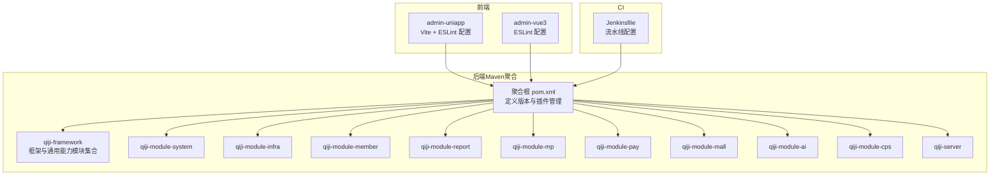
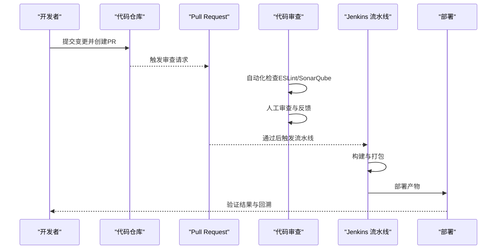
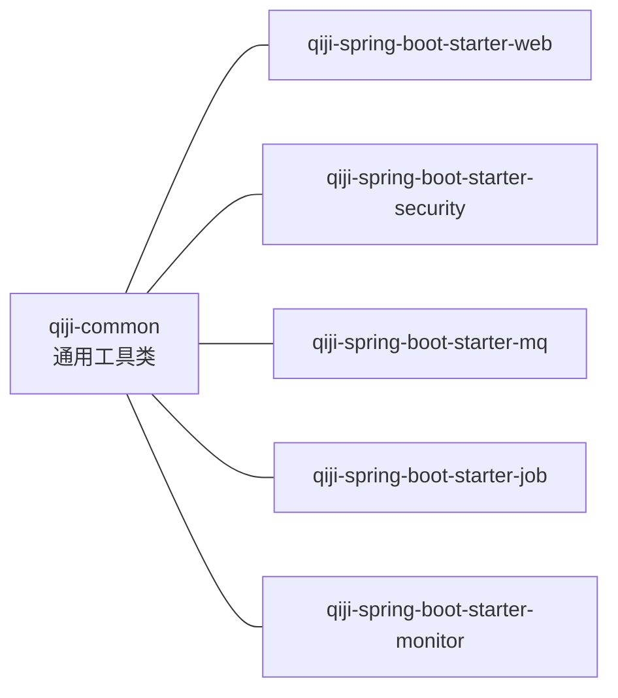
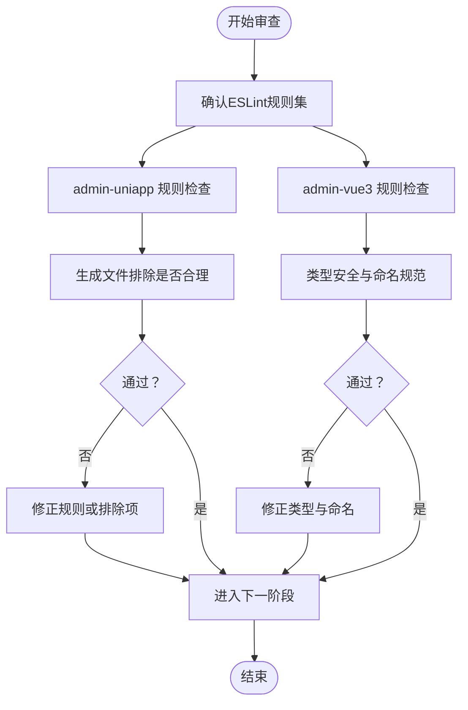
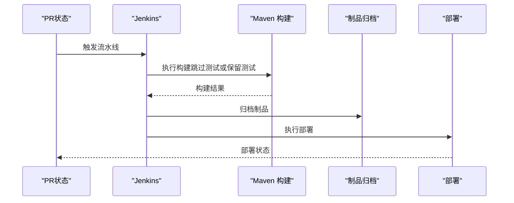
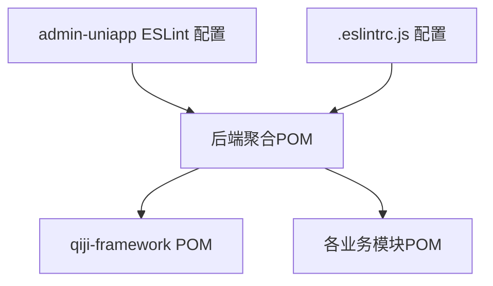

# 代码审查流程

<cite>
**本文引用的文件**
- [Jenkinsfile](file://backend/script/jenkins/Jenkinsfile)
- [.eslintrc.js](file://frontend/admin-vue3/.eslintrc.js)
- [eslint.config.mjs](file://frontend/admin-uniapp/eslint.config.mjs)
- [pom.xml（后端聚合工程）](file://backend/pom.xml)
- [pom.xml（qiji-framework模块）](file://backend/qiji-framework/pom.xml)
- [CollectionUtils.java](file://backend/qiji-framework/qiji-common/src/main/java/com/qiji/cps/framework/common/util/collection/CollectionUtils.java)
- [package-info.java（测试组件）](file://backend/qiji-framework/qiji-spring-boot-starter-test/src/main/java/com/qiji/cps/framework/test/package-info.java)
- [README.md（后端）](file://backend/README.md)
- [README.md（项目总览）](file://README.md)
</cite>

## 目录
1. [引言](#引言)
2. [项目结构](#项目结构)
3. [核心组件](#核心组件)
4. [架构总览](#架构总览)
5. [详细组件分析](#详细组件分析)
6. [依赖分析](#依赖分析)
7. [性能考量](#性能考量)
8. [故障排查指南](#故障排查指南)
9. [结论](#结论)
10. [附录](#附录)

## 引言
本规范面向AgenticCPS项目的代码审查工作，旨在建立统一、可执行、可量化的审查标准与流程。内容覆盖代码质量检查、设计模式应用、性能考虑、审查清单制定、工具链集成（含SonarQube建议）、审查流程执行（PR创建、审查者分配、问题跟踪）、反馈规范以及效率提升策略（批量审查、自动化工具、审查者培训）。文档同时结合仓库现有配置与实现，给出可落地的建议与图示。

## 项目结构
AgenticCPS采用前后端分离与多模块后端架构：
- 后端为Maven多模块聚合工程，包含依赖管理、框架模块、业务模块与服务端模块。
- 前端包含admin-uniapp与admin-vue3两套前端工程，分别采用Vite与ESLint配置。
- CI方面存在Jenkins流水线配置，用于构建与部署。

图表来源
- [pom.xml（后端聚合工程）:10-25](file://backend/pom.xml#L10-L25)
- [pom.xml（qiji-framework模块）:12-31](file://backend/qiji-framework/pom.xml#L12-L31)
- [Jenkinsfile:1-61](file://backend/script/jenkins/Jenkinsfile#L1-L61)

章节来源
- [pom.xml（后端聚合工程）:10-25](file://backend/pom.xml#L10-L25)
- [pom.xml（qiji-framework模块）:12-31](file://backend/qiji-framework/pom.xml#L12-L31)
- [Jenkinsfile:1-61](file://backend/script/jenkins/Jenkinsfile#L1-L61)

## 核心组件
- 后端多模块结构：通过聚合POM集中管理版本与插件，框架模块提供通用能力（如Web、安全、监控、消息队列、定时任务等），业务模块按领域拆分，服务端模块承载启动器与资源。
- 前端ESLint配置：admin-uniapp与admin-vue3分别采用不同配置风格，前者基于@uni-helper推荐配置，后者为Vue3 + TypeScript + Prettier组合，均强调可读性与一致性。
- CI流水线：Jenkinsfile定义了检出、构建、部署阶段，便于在审查后快速验证变更。

章节来源
- [pom.xml（后端聚合工程）:31-176](file://backend/pom.xml#L31-L176)
- [pom.xml（qiji-framework模块）:12-47](file://backend/qiji-framework/pom.xml#L12-L47)
- [.eslintrc.js:20-76](file://frontend/admin-vue3/.eslintrc.js#L20-L76)
- [eslint.config.mjs:3-65](file://frontend/admin-uniapp/eslint.config.mjs#L3-L65)
- [Jenkinsfile:29-58](file://backend/script/jenkins/Jenkinsfile#L29-L58)

## 架构总览
下图展示从代码提交到审查、再到CI验证的整体视图，帮助明确审查节点与工具集成位置。

图表来源
- [Jenkinsfile:29-58](file://backend/script/jenkins/Jenkinsfile#L29-L58)
- [.eslintrc.js:20-76](file://frontend/admin-vue3/.eslintrc.js#L20-L76)
- [eslint.config.mjs:3-65](file://frontend/admin-uniapp/eslint.config.mjs#L3-L65)

## 详细组件分析

### 后端多模块与审查要点
- 模块划分清晰，审查应关注模块间耦合度、接口稳定性与公共组件复用情况。
- 框架模块提供通用能力，审查需确保其扩展性与向后兼容性。
- 业务模块按领域拆分，审查应侧重领域内职责单一性与边界清晰性。

图表来源
- [pom.xml（qiji-framework模块）:12-31](file://backend/qiji-framework/pom.xml#L12-L31)

章节来源
- [pom.xml（qiji-framework模块）:12-31](file://backend/qiji-framework/pom.xml#L12-L31)

### 前端ESLint配置与审查要点
- admin-uniapp采用@uni-helper推荐配置，强调忽略生成文件、格式化器启用与块顺序约束，审查时应关注规则一致性与生成文件排除是否合理。
- admin-vue3采用Vue3推荐规则与TypeScript，审查时应关注类型安全、命名规范与空规则的取舍。

图表来源
- [eslint.config.mjs:3-65](file://frontend/admin-uniapp/eslint.config.mjs#L3-L65)
- [.eslintrc.js:20-76](file://frontend/admin-vue3/.eslintrc.js#L20-L76)

章节来源
- [eslint.config.mjs:3-65](file://frontend/admin-uniapp/eslint.config.mjs#L3-L65)
- [.eslintrc.js:20-76](file://frontend/admin-vue3/.eslintrc.js#L20-L76)

### CI流水线与审查验证
- Jenkinsfile定义了检出、构建、部署阶段，审查通过后可自动触发流水线，验证变更的可构建性与基本功能。
- 建议在流水线中增加静态分析与测试步骤，作为审查后的强制验证环节。

图表来源
- [Jenkinsfile:29-58](file://backend/script/jenkins/Jenkinsfile#L29-L58)

章节来源
- [Jenkinsfile:29-58](file://backend/script/jenkins/Jenkinsfile#L29-L58)

### 代码质量工具链建议（SonarQube集成）
- SonarQube可作为审查后的质量门禁，建议在流水线中增加分析步骤，输出覆盖率、重复率、技术债等指标。
- 针对Java模块，建议结合Maven插件与SonarScanner，统一分析范围与阈值。
- 针对前端，建议在CI中集成ESLint报告与Prettier格式化检查，形成统一的“可审查”基线。

（本节为概念性建议，未直接分析具体文件）

## 依赖分析
- 后端模块间通过聚合POM与依赖管理统一版本，审查时需关注传递依赖与冲突。
- 前端ESLint配置通过插件链式扩展，审查时需关注规则冲突与生成文件排除。

图表来源
- [pom.xml（后端聚合工程）:47-57](file://backend/pom.xml#L47-L57)
- [pom.xml（qiji-framework模块）:12-31](file://backend/qiji-framework/pom.xml#L12-L31)
- [eslint.config.mjs:3-65](file://frontend/admin-uniapp/eslint.config.mjs#L3-L65)
- [.eslintrc.js:20-26](file://frontend/admin-vue3/.eslintrc.js#L20-L26)

章节来源
- [pom.xml（后端聚合工程）:47-57](file://backend/pom.xml#L47-L57)
- [pom.xml（qiji-framework模块）:12-31](file://backend/qiji-framework/pom.xml#L12-L31)
- [eslint.config.mjs:3-65](file://frontend/admin-uniapp/eslint.config.mjs#L3-L65)
- [.eslintrc.js:20-26](file://frontend/admin-vue3/.eslintrc.js#L20-L26)

## 性能考量
- Java侧集合处理与流式转换：参考通用工具类中的集合转换与去重逻辑，审查时关注时间复杂度与内存占用，优先使用稳定的收集器与合并策略。
- 前端侧ESLint规则对编辑体验与构建性能的影响：适度放宽规则可减少IDE负担，但需保证最终提交质量。

章节来源
- [CollectionUtils.java:64-100](file://backend/qiji-framework/qiji-common/src/main/java/com/qiji/cps/framework/common/util/collection/CollectionUtils.java#L64-L100)
- [CollectionUtils.java:179-191](file://backend/qiji-framework/qiji-common/src/main/java/com/qiji/cps/framework/common/util/collection/CollectionUtils.java#L179-L191)
- [eslint.config.mjs:52-63](file://frontend/admin-uniapp/eslint.config.mjs#L52-L63)

## 故障排查指南
- Jenkins流水线构建失败：检查构建参数、凭证配置与制品归档路径，确认构建命令与环境变量一致。
- ESLint规则冲突：对比admin-uniapp与admin-vue3配置差异，统一团队规则或在各自配置中明确取舍。
- 测试组件缺失：测试组件包信息存在但具体实现文件缺失，需补充或调整审查范围。

章节来源
- [Jenkinsfile:10-27](file://backend/script/jenkins/Jenkinsfile#L10-L27)
- [Jenkinsfile:37-46](file://backend/script/jenkins/Jenkinsfile#L37-L46)
- [package-info.java（测试组件）:1-5](file://backend/qiji-framework/qiji-spring-boot-starter-test/src/main/java/com/qiji/cps/framework/test/package-info.java#L1-L5)

## 结论
AgenticCPS在后端采用成熟的多模块架构，在前端具备明确的ESLint配置体系，并在CI层面具备基础流水线能力。建议在现有基础上引入SonarQube作为质量门禁，完善PR审查清单与反馈模板，强化批量审查与自动化工具的应用，持续开展审查者培训，以进一步提升代码质量与交付效率。

## 附录

### 代码审查清单（示例）
- 功能性检查
  - 是否满足需求与接口契约
  - 是否覆盖边界条件与异常场景
- 安全性评估
  - 输入校验与权限控制
  - 敏感信息处理与日志脱敏
- 可维护性评价
  - 命名规范与注释完整性
  - 模块内聚与模块间耦合
- 性能考虑
  - 集合处理与流式转换的复杂度
  - 前端规则对开发体验与构建性能影响
- 工具与流程
  - 是否通过ESLint/Prettier等自动化检查
  - 是否通过CI流水线验证

（本节为通用清单，未直接分析具体文件）