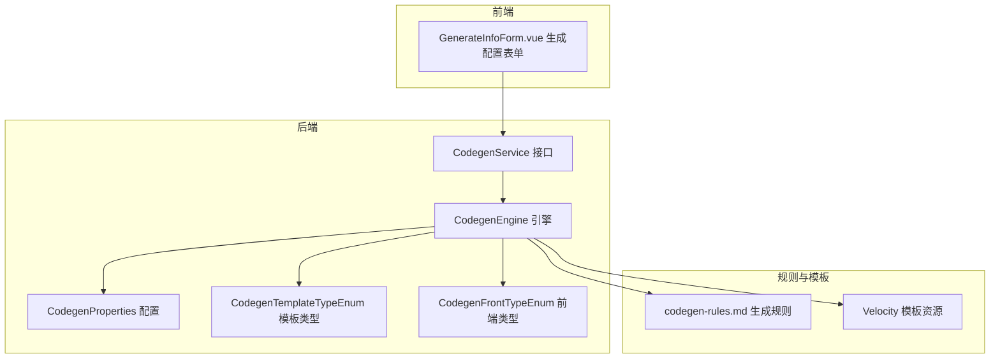
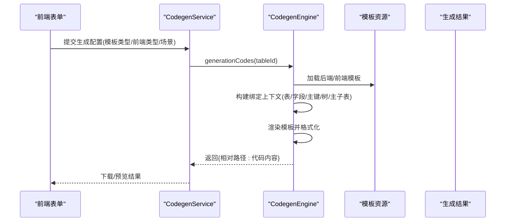
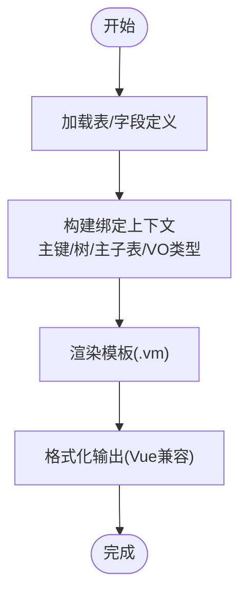
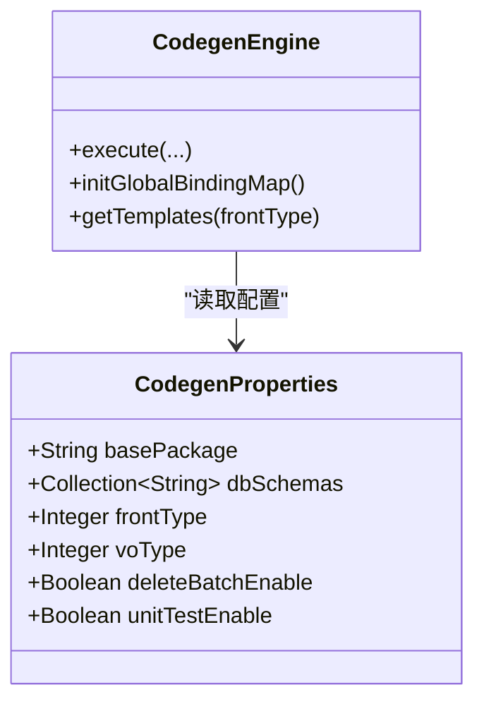
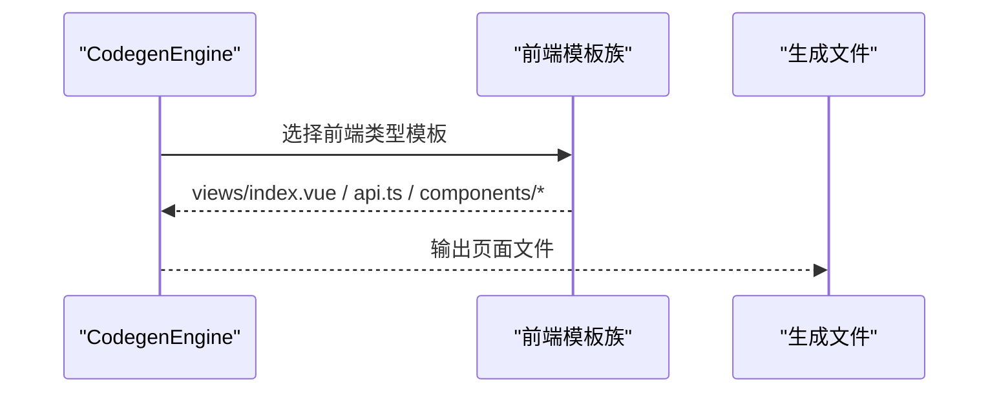
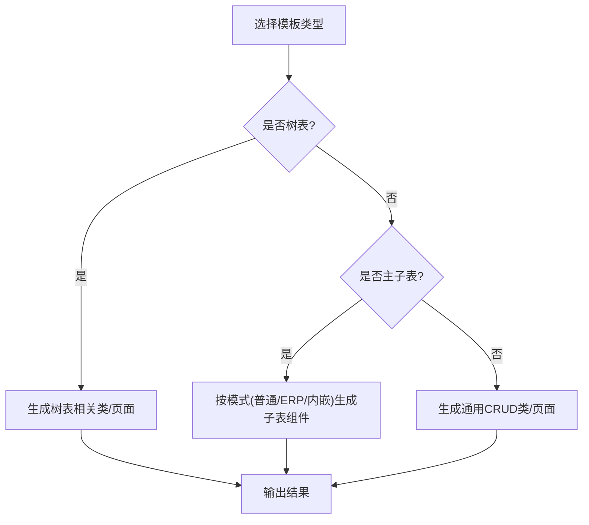
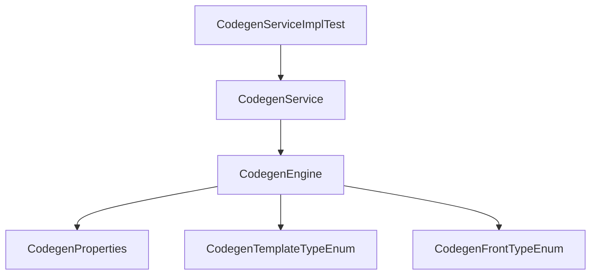

# 代码生成器使用

<cite>
**本文引用的文件**
- [codegen-rules.md](file://agent_improvement/memory/codegen-rules.md)
- [MEMORY.md](file://agent_improvement/memory/MEMORY.md)
- [CodegenEngine.java](file://backend/qiji-module-infra/src/main/java/com/qiji/cps/module/infra/service/codegen/inner/CodegenEngine.java)
- [CodegenService.java](file://backend/qiji-module-infra/src/main/java/com/qiji/cps/module/infra/service/codegen/CodegenService.java)
- [CodegenProperties.java](file://backend/qiji-module-infra/src/main/java/com/qiji/cps/module/infra/framework/codegen/config/CodegenProperties.java)
- [CodegenTemplateTypeEnum.java](file://backend/qiji-module-infra/src/main/java/com/qiji/cps/module/infra/enums/codegen/CodegenTemplateTypeEnum.java)
- [CodegenFrontTypeEnum.java](file://backend/qiji-module-infra/src/main/java/com/qiji/cps/module/infra/enums/codegen/CodegenFrontTypeEnum.java)
- [CodegenServiceImplTest.java](file://backend/qiji-module-infra/src/test/java/com/qiji/cps/module/infra/service/codegen/CodegenServiceImplTest.java)
- [DatabaseTableRespVO.java](file://backend/qiji-module-infra/src/main/java/com/qiji/cps/module/infra/controller/admin/codegen/vo/table/DatabaseTableRespVO.java)
- [GenerateInfoForm.vue](file://frontend/admin-vue3/src/views/infra/codegen/components/GenerateInfoForm.vue)
- [create_tables.sql](file://backend/qiji-module-infra/src/test/resources/sql/create_tables.sql)
</cite>

## 目录
1. [简介](#简介)
2. [项目结构](#项目结构)
3. [核心组件](#核心组件)
4. [架构总览](#架构总览)
5. [详细组件分析](#详细组件分析)
6. [依赖分析](#依赖分析)
7. [性能考虑](#性能考虑)
8. [故障排查指南](#故障排查指南)
9. [结论](#结论)
10. [附录](#附录)

## 简介
本指南面向使用 AgenticCPS 代码生成器的开发者，系统讲解从数据库表到实体类及前后端代码的自动化生成流程，覆盖表结构分析、字段类型映射、注解自动生成、模板选择与变量替换、CRUD 页面自动生成、命名与包结构约定、批量生成与多表关联处理、以及扩展开发（自定义模板、特殊字段处理、生成器配置优化）。文档同时提供可视化图示与实操步骤，帮助快速上手并稳定落地。

## 项目结构
AgenticCPS 的代码生成能力主要位于后端模块 infra 的服务层与引擎层，前端 admin-vue3 提供生成配置界面；规则与模板由内存中的规则文档与 Velocity 模板共同支撑。

图表来源
- [CodegenEngine.java:69-97](file://backend/qiji-module-infra/src/main/java/com/qiji/cps/module/infra/service/codegen/inner/CodegenEngine.java#L69-L97)
- [CodegenProperties.java:13-58](file://backend/qiji-module-infra/src/main/java/com/qiji/cps/module/infra/framework/codegen/config/CodegenProperties.java#L13-L58)
- [CodegenTemplateTypeEnum.java:14-53](file://backend/qiji-module-infra/src/main/java/com/qiji/cps/module/infra/enums/codegen/CodegenTemplateTypeEnum.java#L14-L53)
- [CodegenFrontTypeEnum.java:11-35](file://backend/qiji-module-infra/src/main/java/com/qiji/cps/module/infra/enums/codegen/CodegenFrontTypeEnum.java#L11-L35)
- [GenerateInfoForm.vue:1-40](file://frontend/admin-vue3/src/views/infra/codegen/components/GenerateInfoForm.vue#L1-L40)
- [codegen-rules.md:1-788](file://agent_improvement/memory/codegen-rules.md#L1-L788)

章节来源
- [CodegenEngine.java:69-97](file://backend/qiji-module-infra/src/main/java/com/qiji/cps/module/infra/service/codegen/inner/CodegenEngine.java#L69-L97)
- [CodegenProperties.java:13-58](file://backend/qiji-module-infra/src/main/java/com/qiji/cps/module/infra/framework/codegen/config/CodegenProperties.java#L13-L58)
- [CodegenTemplateTypeEnum.java:14-53](file://backend/qiji-module-infra/src/main/java/com/qiji/cps/module/infra/enums/codegen/CodegenTemplateTypeEnum.java#L14-L53)
- [CodegenFrontTypeEnum.java:11-35](file://backend/qiji-module-infra/src/main/java/com/qiji/cps/module/infra/enums/codegen/CodegenFrontTypeEnum.java#L11-L35)
- [GenerateInfoForm.vue:1-40](file://frontend/admin-vue3/src/views/infra/codegen/components/GenerateInfoForm.vue#L1-L40)
- [codegen-rules.md:1-788](file://agent_improvement/memory/codegen-rules.md#L1-L788)

## 核心组件
- 代码生成引擎（CodegenEngine）：负责加载模板、构建上下文、执行渲染、格式化输出，支持后端 Java 与前端多套模板族。
- 服务接口（CodegenService）：对外暴露创建、更新、同步、删除、分页查询、生成代码等能力。
- 配置（CodegenProperties）：基础包、数据库 schema、前端类型、VO 类型、批量删除开关、单元测试开关等。
- 模板类型与前端类型枚举：控制生成的模板族与页面风格。
- 规则文档（codegen-rules.md）：定义命名约定、包结构、注解、CRUD/树表/主子表规范、前后端模板变量与页面结构。

章节来源
- [CodegenEngine.java:61-680](file://backend/qiji-module-infra/src/main/java/com/qiji/cps/module/infra/service/codegen/inner/CodegenEngine.java#L61-L680)
- [CodegenService.java:14-109](file://backend/qiji-module-infra/src/main/java/com/qiji/cps/module/infra/service/codegen/CodegenService.java#L14-L109)
- [CodegenProperties.java:13-58](file://backend/qiji-module-infra/src/main/java/com/qiji/cps/module/infra/framework/codegen/config/CodegenProperties.java#L13-L58)
- [CodegenTemplateTypeEnum.java:14-53](file://backend/qiji-module-infra/src/main/java/com/qiji/cps/module/infra/enums/codegen/CodegenTemplateTypeEnum.java#L14-L53)
- [CodegenFrontTypeEnum.java:11-35](file://backend/qiji-module-infra/src/main/java/com/qiji/cps/module/infra/enums/codegen/CodegenFrontTypeEnum.java#L11-L35)
- [codegen-rules.md:1-788](file://agent_improvement/memory/codegen-rules.md#L1-L788)

## 架构总览
生成流程从“表结构 + 字段定义”出发，经由引擎装配上下文，按模板族渲染生成后端 Java 与前端代码，最终以文件路径映射返回。

图表来源
- [CodegenEngine.java:321-351](file://backend/qiji-module-infra/src/main/java/com/qiji/cps/module/infra/service/codegen/inner/CodegenEngine.java#L321-L351)
- [CodegenService.java:90-96](file://backend/qiji-module-infra/src/main/java/com/qiji/cps/module/infra/service/codegen/CodegenService.java#L90-L96)
- [GenerateInfoForm.vue:1-40](file://frontend/admin-vue3/src/views/infra/codegen/components/GenerateInfoForm.vue#L1-L40)

章节来源
- [CodegenEngine.java:321-351](file://backend/qiji-module-infra/src/main/java/com/qiji/cps/module/infra/service/codegen/inner/CodegenEngine.java#L321-L351)
- [CodegenService.java:90-96](file://backend/qiji-module-infra/src/main/java/com/qiji/cps/module/infra/service/codegen/CodegenService.java#L90-L96)
- [GenerateInfoForm.vue:1-40](file://frontend/admin-vue3/src/views/infra/codegen/components/GenerateInfoForm.vue#L1-L40)

## 详细组件分析

### 数据库表到实体类生成流程
- 表结构分析：通过表定义与字段定义（含主键、注释、Java 类型等）构建上下文。
- 字段类型映射：引擎根据数据库类型推导 Java 类型与注解（如主键、枚举、时间类型导入等）。
- 注解自动生成：依据规则文档生成 DO 注解、字段注解、Excel 导出注解等。
- 包结构与命名：遵循规则文档的命名与包结构约定，自动计算类名、变量名、权限前缀等。

图表来源
- [CodegenEngine.java:430-518](file://backend/qiji-module-infra/src/main/java/com/qiji/cps/module/infra/service/codegen/inner/CodegenEngine.java#L430-L518)
- [codegen-rules.md:51-78](file://agent_improvement/memory/codegen-rules.md#L51-L78)

章节来源
- [CodegenEngine.java:430-518](file://backend/qiji-module-infra/src/main/java/com/qiji/cps/module/infra/service/codegen/inner/CodegenEngine.java#L430-L518)
- [codegen-rules.md:51-78](file://agent_improvement/memory/codegen-rules.md#L51-L78)

### 前后端代码生成配置
- 模板选择：通过前端表单选择模板类型（通用/树表/主子表）与前端类型（Vue2/Vue3 Element Plus/Vben/Uniapp 等）。
- 变量替换：引擎注入基础包、场景包、类名、变量名、权限前缀、主键/树/主子表信息等。
- 代码定制化：可通过配置项控制 VO 类型（VO/DO）、是否生成批量删除、是否生成单元测试等。

图表来源
- [CodegenProperties.java:13-58](file://backend/qiji-module-infra/src/main/java/com/qiji/cps/module/infra/framework/codegen/config/CodegenProperties.java#L13-L58)
- [CodegenEngine.java:277-309](file://backend/qiji-module-infra/src/main/java/com/qiji/cps/module/infra/service/codegen/inner/CodegenEngine.java#L277-L309)

章节来源
- [GenerateInfoForm.vue:1-40](file://frontend/admin-vue3/src/views/infra/codegen/components/GenerateInfoForm.vue#L1-L40)
- [CodegenProperties.java:13-58](file://backend/qiji-module-infra/src/main/java/com/qiji/cps/module/infra/framework/codegen/config/CodegenProperties.java#L13-L58)
- [CodegenEngine.java:277-309](file://backend/qiji-module-infra/src/main/java/com/qiji/cps/module/infra/service/codegen/inner/CodegenEngine.java#L277-L309)

### CRUD 页面自动生成机制
- 列表页：根据前端类型生成对应页面（Element Plus/Vben/Uniapp），包含搜索表单、表格、分页、操作按钮。
- 表单页：生成新增/编辑弹窗，内置校验与提交逻辑。
- 详情页：在移动端模板中提供详情页入口与展示。
- 主子表：根据模板类型（普通/ERP/内嵌）生成子表组件与联动逻辑。

图表来源
- [CodegenEngine.java:106-232](file://backend/qiji-module-infra/src/main/java/com/qiji/cps/module/infra/service/codegen/inner/CodegenEngine.java#L106-L232)
- [codegen-rules.md:327-788](file://agent_improvement/memory/codegen-rules.md#L327-L788)

章节来源
- [CodegenEngine.java:106-232](file://backend/qiji-module-infra/src/main/java/com/qiji/cps/module/infra/service/codegen/inner/CodegenEngine.java#L106-L232)
- [codegen-rules.md:327-788](file://agent_improvement/memory/codegen-rules.md#L327-L788)

### 代码生成规则
- 命名约定：模块名、业务名、类名、变量名、包路径、HTTP 路径等均遵循规则文档。
- 包结构设计：按模块/业务/层级划分，控制器/服务/数据访问/枚举/SQL 等分类组织。
- 注释生成：按字段注释与业务注释生成响应 VO 与 Excel 导出注解。
- 模板类型：通用、树表、主子表（普通/ERP/内嵌）三类模板族。
- 前端模板变量：包含基础包、场景包、类名、变量名、权限前缀、主键/树/主子表字段等。

章节来源
- [codegen-rules.md:31-788](file://agent_improvement/memory/codegen-rules.md#L31-L788)

### 批量生成流程
- 多表关联：主子表通过关联字段与模板类型区分生成策略；树表通过父子字段生成树形结构。
- 复杂业务场景：ERP 模式下独立维护子表；内嵌模式下在主表页面内直接编辑子表。
- 生成结果验证：通过测试用例校验生成结果（如表/字段存在性、子表存在性、模板命中等）。

图表来源
- [CodegenTemplateTypeEnum.java:14-53](file://backend/qiji-module-infra/src/main/java/com/qiji/cps/module/infra/enums/codegen/CodegenTemplateTypeEnum.java#L14-L53)
- [CodegenEngine.java:362-389](file://backend/qiji-module-infra/src/main/java/com/qiji/cps/module/infra/service/codegen/inner/CodegenEngine.java#L362-L389)

章节来源
- [CodegenTemplateTypeEnum.java:14-53](file://backend/qiji-module-infra/src/main/java/com/qiji/cps/module/infra/enums/codegen/CodegenTemplateTypeEnum.java#L14-L53)
- [CodegenEngine.java:362-389](file://backend/qiji-module-infra/src/main/java/com/qiji/cps/module/infra/service/codegen/inner/CodegenEngine.java#L362-L389)
- [CodegenServiceImplTest.java:384-403](file://backend/qiji-module-infra/src/test/java/com/qiji/cps/module/infra/service/codegen/CodegenServiceImplTest.java#L384-L403)

### 代码生成器扩展开发
- 自定义模板：在引擎模板映射处增加后端/前端模板路径与目标文件路径映射。
- 特殊字段处理：在规则文档中扩展字段类型映射与注解生成逻辑。
- 生成器配置优化：通过配置项调整基础包、VO 类型、批量删除开关、单元测试开关等。

章节来源
- [CodegenEngine.java:69-97](file://backend/qiji-module-infra/src/main/java/com/qiji/cps/module/infra/service/codegen/inner/CodegenEngine.java#L69-L97)
- [CodegenEngine.java:520-543](file://backend/qiji-module-infra/src/main/java/com/qiji/cps/module/infra/service/codegen/inner/CodegenEngine.java#L520-L543)
- [codegen-rules.md:1-788](file://agent_improvement/memory/codegen-rules.md#L1-L788)

## 依赖分析
- 引擎依赖配置与枚举：引擎初始化全局绑定变量，按前端类型拼装模板集合，按配置开关裁剪模板。
- 服务层依赖：服务接口定义生成入口，测试用例覆盖异常分支与多表场景。
- 前端依赖：表单组件提供模板类型与前端类型选择，驱动后端模板渲染。

图表来源
- [CodegenEngine.java:234-253](file://backend/qiji-module-infra/src/main/java/com/qiji/cps/module/infra/service/codegen/inner/CodegenEngine.java#L234-L253)
- [CodegenProperties.java:13-58](file://backend/qiji-module-infra/src/main/java/com/qiji/cps/module/infra/framework/codegen/config/CodegenProperties.java#L13-L58)
- [CodegenTemplateTypeEnum.java:14-53](file://backend/qiji-module-infra/src/main/java/com/qiji/cps/module/infra/enums/codegen/CodegenTemplateTypeEnum.java#L14-L53)
- [CodegenFrontTypeEnum.java:11-35](file://backend/qiji-module-infra/src/main/java/com/qiji/cps/module/infra/enums/codegen/CodegenFrontTypeEnum.java#L11-L35)
- [CodegenService.java:14-109](file://backend/qiji-module-infra/src/main/java/com/qiji/cps/module/infra/service/codegen/CodegenService.java#L14-L109)
- [CodegenServiceImplTest.java:1-544](file://backend/qiji-module-infra/src/test/java/com/qiji/cps/module/infra/service/codegen/CodegenServiceImplTest.java#L1-L544)

章节来源
- [CodegenEngine.java:234-253](file://backend/qiji-module-infra/src/main/java/com/qiji/cps/module/infra/service/codegen/inner/CodegenEngine.java#L234-L253)
- [CodegenService.java:14-109](file://backend/qiji-module-infra/src/main/java/com/qiji/cps/module/infra/service/codegen/CodegenService.java#L14-L109)
- [CodegenServiceImplTest.java:1-544](file://backend/qiji-module-infra/src/test/java/com/qiji/cps/module/infra/service/codegen/CodegenServiceImplTest.java#L1-L544)

## 性能考虑
- 模板加载：使用 Velocity 引擎并启用类路径资源模式，减少 IO 开销。
- 上下文构建：一次性构建绑定变量，避免重复计算。
- 代码格式化：对前端模板进行轻量格式化，降低后续校验成本。
- 模板裁剪：按配置开关移除不必要的模板，减少生成数量。

## 故障排查指南
- 表/字段不存在：若表或字段定义缺失，生成会抛出相应异常，需先补齐定义。
- 子表缺失：主子表场景下若子表定义缺失，不会生成子表相关文件。
- 模板命中失败：确认前端类型与模板类型是否匹配，以及模板路径是否正确。
- 生成结果校验：参考测试用例断言生成结果与预期一致。

章节来源
- [CodegenServiceImplTest.java:384-403](file://backend/qiji-module-infra/src/test/java/com/qiji/cps/module/infra/service/codegen/CodegenServiceImplTest.java#L384-L403)
- [CodegenServiceImplTest.java:505-531](file://backend/qiji-module-infra/src/test/java/com/qiji/cps/module/infra/service/codegen/CodegenServiceImplTest.java#L505-L531)

## 结论
AgenticCPS 代码生成器以规则文档为纲、以模板引擎为体，实现了从数据库表到后端 Java 与前端页面的自动化生成。通过合理的配置与扩展，可在保证一致性的同时满足复杂业务场景的定制需求。建议在团队内固化规则与模板，配合 CI/CD 实现一键生成与质量校验。

## 附录

### 数据库表与字段定义（DDL）
- 表定义与字段定义的 DDL 参考测试资源中的建表语句，用于生成器的输入。

章节来源
- [create_tables.sql:164-196](file://backend/qiji-module-infra/src/test/resources/sql/create_tables.sql#L164-L196)

### 前端生成配置界面
- 前端表单提供模板类型、前端类型、生成场景的选择，驱动后端模板渲染。

章节来源
- [GenerateInfoForm.vue:1-40](file://frontend/admin-vue3/src/views/infra/codegen/components/GenerateInfoForm.vue#L1-L40)

### 生成规则速览
- 命名与包结构、DO/Mapper/Service/Controller/VO 规范、模板类型与前端模板变量、HTML 类型映射等详见规则文档。

章节来源
- [codegen-rules.md:31-788](file://agent_improvement/memory/codegen-rules.md#L31-L788)