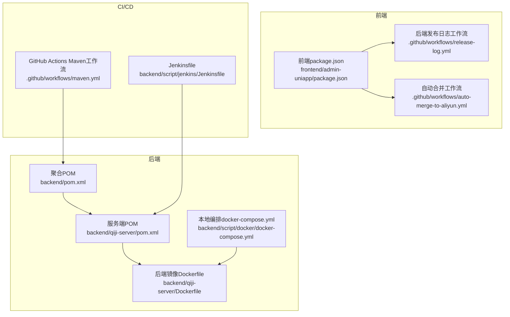
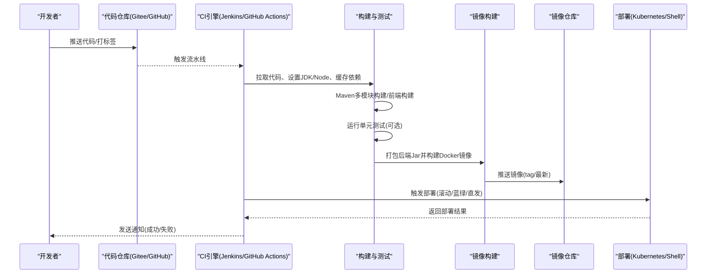
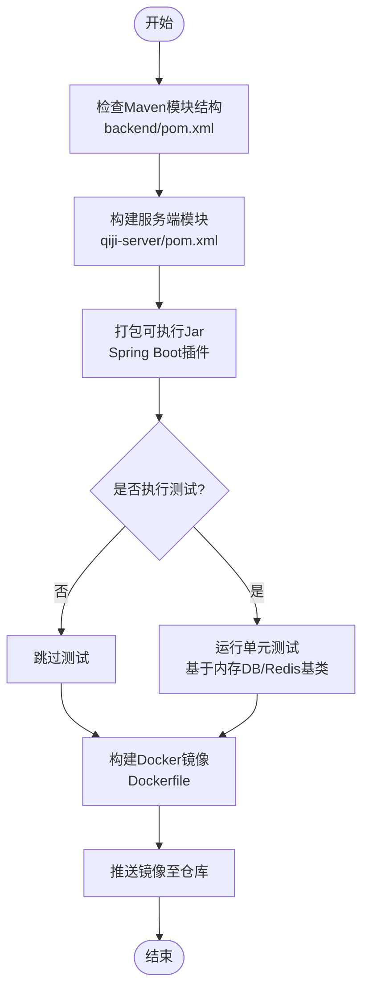
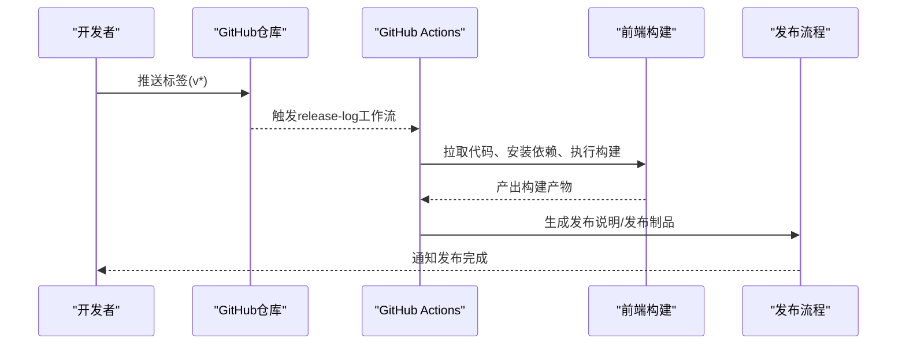
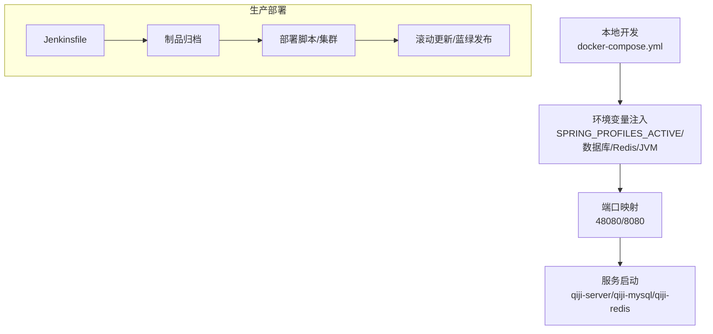
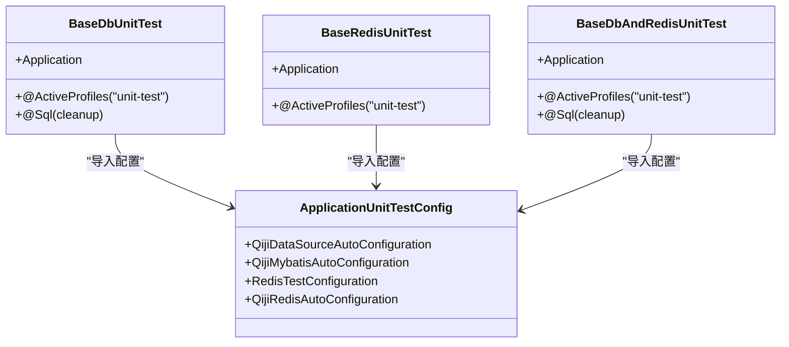
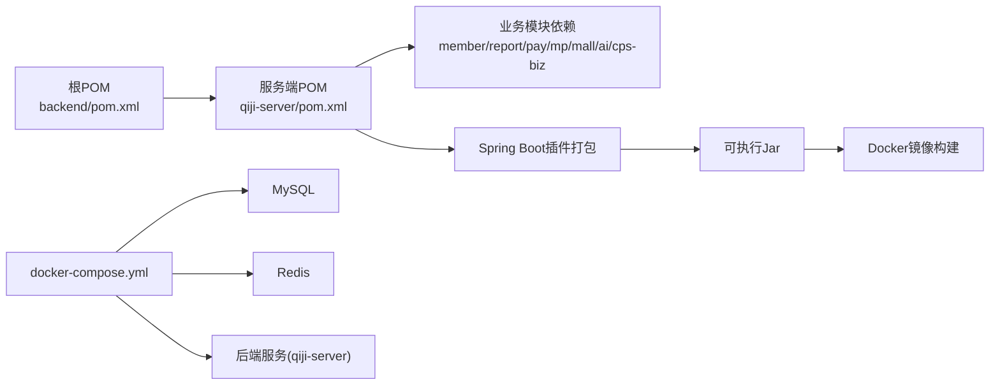

# 持续集成配置

<cite>
**本文引用的文件**
- [Jenkinsfile](file://backend/script/jenkins/Jenkinsfile)
- [docker-compose.yml](file://backend/script/docker/docker-compose.yml)
- [Dockerfile](file://backend/qiji-server/Dockerfile)
- [pom.xml](file://backend/pom.xml)
- [qiji-server/pom.xml](file://backend/qiji-server/pom.xml)
- [maven.yml](file://backend/.github/workflows/maven.yml)
- [package.json](file://frontend/admin-uniapp/package.json)
- [BaseDbAndRedisUnitTest.java](file://backend/qiji-framework/qiji-spring-boot-starter-test/src/main/java/com/qiji/cps/framework/test/core/ut/BaseDbAndRedisUnitTest.java)
- [BaseDbUnitTest.java](file://backend/qiji-framework/qiji-spring-boot-starter-test/src/main/java/com/qiji/cps/framework/test/core/ut/BaseDbUnitTest.java)
- [BaseRedisUnitTest.java](file://backend/qiji-framework/qiji-spring-boot-starter-test/src/main/java/com/qiji/cps/framework/test/core/ut/BaseRedisUnitTest.java)
- [application-unit-test.yaml](file://backend/qiji-module-infra/src/test/resources/application-unit-test.yaml)
- [release-log.yml](file://frontend/admin-uniapp/.github/workflows/release-log.yml)
- [auto-merge-to-aliyun.yml](file://frontend/admin-uniapp/.github/workflows/auto-merge-to-aliyun.yml)
</cite>

## 目录
1. [简介](#简介)
2. [项目结构](#项目结构)
3. [核心组件](#核心组件)
4. [架构总览](#架构总览)
5. [详细组件分析](#详细组件分析)
6. [依赖关系分析](#依赖关系分析)
7. [性能考虑](#性能考虑)
8. [故障排查指南](#故障排查指南)
9. [结论](#结论)
10. [附录](#附录)

## 简介
本指南面向AgenticCPS项目的持续集成与持续交付（CI/CD），围绕构建触发条件、测试执行策略、部署自动化、多环境与蓝绿/滚动更新、监控告警以及最佳实践展开，帮助团队建立稳定高效的流水线。文档同时给出基于现有仓库配置的落地步骤与可视化图示，便于快速实施。

## 项目结构
AgenticCPS采用前后端分离与多模块后端架构：
- 后端：Maven多模块聚合工程，包含依赖管理、框架模块、业务模块与服务端模块；提供Dockerfile与docker-compose编排。
- 前端：admin-uniapp基于uni-app生态，提供多端构建脚本与GitHub Actions工作流。
- CI/CD：既有Jenkins流水线，也有GitHub Actions工作流，覆盖后端与前端。

**图表来源**
- [pom.xml:1-176](file://backend/pom.xml#L1-L176)
- [qiji-server/pom.xml:1-137](file://backend/qiji-server/pom.xml#L1-L137)
- [Dockerfile:1-24](file://backend/qiji-server/Dockerfile#L1-L24)
- [docker-compose.yml:1-85](file://backend/script/docker/docker-compose.yml#L1-L85)
- [maven.yml:1-30](file://backend/.github/workflows/maven.yml#L1-L30)
- [package.json:1-194](file://frontend/admin-uniapp/package.json#L1-L194)
- [release-log.yml:1-49](file://frontend/admin-uniapp/.github/workflows/release-log.yml#L1-L49)
- [auto-merge-to-aliyun.yml:1-25](file://frontend/admin-uniapp/.github/workflows/auto-merge-to-aliyun.yml#L1-L25)

**章节来源**
- [pom.xml:1-176](file://backend/pom.xml#L1-L176)
- [qiji-server/pom.xml:1-137](file://backend/qiji-server/pom.xml#L1-L137)
- [docker-compose.yml:1-85](file://backend/script/docker/docker-compose.yml#L1-L85)
- [maven.yml:1-30](file://backend/.github/workflows/maven.yml#L1-L30)
- [package.json:1-194](file://frontend/admin-uniapp/package.json#L1-L194)

## 核心组件
- 构建与打包
  - 后端：Maven多模块聚合构建，服务端模块使用Spring Boot插件打包可执行Jar。
  - 前端：基于uni-app的多端构建脚本，统一通过package.json定义命令。
- 镜像与编排
  - 后端：基于Eclipse Temurin 21 JRE的精简镜像，暴露48080端口。
  - 本地：docker-compose一键拉起MySQL、Redis与后端服务。
- 测试基座
  - 提供基于内存数据库与Redis的单元测试基类，配合单元测试配置文件。
- CI/CD流水线
  - Jenkins：参数化构建、环境变量注入、制品归档与部署脚本调用。
  - GitHub Actions：后端多Java版本矩阵构建与缓存。

**章节来源**
- [pom.xml:1-176](file://backend/pom.xml#L1-L176)
- [qiji-server/pom.xml:116-134](file://backend/qiji-server/pom.xml#L116-L134)
- [Dockerfile:1-24](file://backend/qiji-server/Dockerfile#L1-L24)
- [docker-compose.yml:1-85](file://backend/script/docker/docker-compose.yml#L1-L85)
- [BaseDbAndRedisUnitTest.java:1-55](file://backend/qiji-framework/qiji-spring-boot-starter-test/src/main/java/com/qiji/cps/framework/test/core/ut/BaseDbAndRedisUnitTest.java#L1-L55)
- [BaseDbUnitTest.java:1-47](file://backend/qiji-framework/qiji-spring-boot-starter-test/src/main/java/com/qiji/cps/framework/test/core/ut/BaseDbUnitTest.java#L1-L47)
- [BaseRedisUnitTest.java:1-36](file://backend/qiji-framework/qiji-spring-boot-starter-test/src/main/java/com/qiji/cps/framework/test/core/ut/BaseRedisUnitTest.java#L1-L36)
- [application-unit-test.yaml](file://backend/qiji-module-infra/src/test/resources/application-unit-test.yaml)

## 架构总览
下图展示从代码提交到镜像构建与部署的关键路径，涵盖后端与前端两条主线。

**图表来源**
- [Jenkinsfile:1-61](file://backend/script/jenkins/Jenkinsfile#L1-L61)
- [maven.yml:1-30](file://backend/.github/workflows/maven.yml#L1-L30)
- [docker-compose.yml:1-85](file://backend/script/docker/docker-compose.yml#L1-L85)
- [Dockerfile:1-24](file://backend/qiji-server/Dockerfile#L1-L24)
- [package.json:29-98](file://frontend/admin-uniapp/package.json#L29-L98)

## 详细组件分析

### 后端构建与测试
- Maven多模块
  - 聚合POM定义模块列表与版本属性，服务端POM引入各业务模块依赖并通过Spring Boot插件打包。
  - 构建阶段可选择跳过测试以加速流水线，或在CI中单独执行测试作业。
- 测试基座
  - 提供内存数据库+Redis的单元测试基类，结合单元测试配置文件，确保测试隔离与可重复性。
- Docker镜像
  - 使用Eclipse Temurin 21 JRE，设置时区与JVM参数，暴露48080端口，CMD启动Jar。

**图表来源**
- [pom.xml:10-25](file://backend/pom.xml#L10-L25)
- [qiji-server/pom.xml:23-114](file://backend/qiji-server/pom.xml#L23-L114)
- [Dockerfile:1-24](file://backend/qiji-server/Dockerfile#L1-L24)
- [BaseDbAndRedisUnitTest.java:20-55](file://backend/qiji-framework/qiji-spring-boot-starter-test/src/main/java/com/qiji/cps/framework/test/core/ut/BaseDbAndRedisUnitTest.java#L20-L55)

**章节来源**
- [pom.xml:1-176](file://backend/pom.xml#L1-L176)
- [qiji-server/pom.xml:1-137](file://backend/qiji-server/pom.xml#L1-L137)
- [Dockerfile:1-24](file://backend/qiji-server/Dockerfile#L1-L24)
- [BaseDbAndRedisUnitTest.java:1-55](file://backend/qiji-framework/qiji-spring-boot-starter-test/src/main/java/com/qiji/cps/framework/test/core/ut/BaseDbAndRedisUnitTest.java#L1-L55)
- [BaseDbUnitTest.java:1-47](file://backend/qiji-framework/qiji-spring-boot-starter-test/src/main/java/com/qiji/cps/framework/test/core/ut/BaseDbUnitTest.java#L1-L47)
- [BaseRedisUnitTest.java:1-36](file://backend/qiji-framework/qiji-spring-boot-starter-test/src/main/java/com/qiji/cps/framework/test/core/ut/BaseRedisUnitTest.java#L1-L36)

### 前端构建与发布
- 构建脚本
  - package.json定义了多端构建命令，涵盖H5、小程序、App等平台，统一通过uni命令执行。
- 发布与日志
  - release-log.yml根据标签自动生成变更日志，配合release流程。
  - auto-merge-to-aliyun.yml支持将main分支自动合并到特定分支，便于多源同步。

**图表来源**
- [package.json:29-98](file://frontend/admin-uniapp/package.json#L29-L98)
- [release-log.yml:1-49](file://frontend/admin-uniapp/.github/workflows/release-log.yml#L1-L49)
- [auto-merge-to-aliyun.yml:1-25](file://frontend/admin-uniapp/.github/workflows/auto-merge-to-aliyun.yml#L1-L25)

**章节来源**
- [package.json:1-194](file://frontend/admin-uniapp/package.json#L1-L194)
- [release-log.yml:1-49](file://frontend/admin-uniapp/.github/workflows/release-log.yml#L1-L49)
- [auto-merge-to-aliyun.yml:1-25](file://frontend/admin-uniapp/.github/workflows/auto-merge-to-aliyun.yml#L1-L25)

### 部署自动化与多环境
- 本地开发
  - docker-compose一键拉起MySQL、Redis与后端服务，设置环境变量与端口映射，适合本地联调。
- 生产部署
  - Jenkinsfile展示了制品归档与部署脚本调用流程，可扩展为Kubernetes部署（滚动/蓝绿）或传统服务器直发。
- 环境变量
  - 通过环境变量覆盖数据库、Redis、JVM参数等，满足不同环境差异。

**图表来源**
- [docker-compose.yml:29-78](file://backend/script/docker/docker-compose.yml#L29-L78)
- [Jenkinsfile:50-58](file://backend/script/jenkins/Jenkinsfile#L50-L58)

**章节来源**
- [docker-compose.yml:1-85](file://backend/script/docker/docker-compose.yml#L1-L85)
- [Jenkinsfile:1-61](file://backend/script/jenkins/Jenkinsfile#L1-L61)

### 测试集成策略
- 单元测试
  - 基于内存数据库与Redis的测试基类，确保测试隔离与快速执行。
  - 可在CI中拆分为“构建+测试”两步，提高失败反馈速度。
- 集成测试与性能测试
  - 建议在独立作业中执行，使用专用测试配置文件与测试数据库实例，避免与单元测试冲突。
  - 性能测试可结合压测工具在预发环境执行，输出报告并纳入质量门禁。

**图表来源**
- [BaseDbUnitTest.java:24-47](file://backend/qiji-framework/qiji-spring-boot-starter-test/src/main/java/com/qiji/cps/framework/test/core/ut/BaseDbUnitTest.java#L24-L47)
- [BaseRedisUnitTest.java:19-36](file://backend/qiji-framework/qiji-spring-boot-starter-test/src/main/java/com/qiji/cps/framework/test/core/ut/BaseRedisUnitTest.java#L19-L36)
- [BaseDbAndRedisUnitTest.java:30-55](file://backend/qiji-framework/qiji-spring-boot-starter-test/src/main/java/com/qiji/cps/framework/test/core/ut/BaseDbAndRedisUnitTest.java#L30-L55)

**章节来源**
- [BaseDbUnitTest.java:1-47](file://backend/qiji-framework/qiji-spring-boot-starter-test/src/main/java/com/qiji/cps/framework/test/core/ut/BaseDbUnitTest.java#L1-L47)
- [BaseRedisUnitTest.java:1-36](file://backend/qiji-framework/qiji-spring-boot-starter-test/src/main/java/com/qiji/cps/framework/test/core/ut/BaseRedisUnitTest.java#L1-L36)
- [BaseDbAndRedisUnitTest.java:1-55](file://backend/qiji-framework/qiji-spring-boot-starter-test/src/main/java/com/qiji/cps/framework/test/core/ut/BaseDbAndRedisUnitTest.java#L1-L55)
- [application-unit-test.yaml](file://backend/qiji-module-infra/src/test/resources/application-unit-test.yaml)

### 监控告警与通知
- 构建状态通知
  - 在Jenkins中配置邮件/IM通知；在GitHub Actions中可集成通知服务。
- 部署结果监控
  - 部署后执行健康检查与端到端验证，失败时回滚或告警。
- 故障告警
  - 结合日志与指标系统，对异常错误率、响应时间、资源使用率设置阈值告警。

[本节为通用实践说明，不直接分析具体文件，故无章节来源]

## 依赖关系分析
后端模块间存在清晰的依赖层次：聚合POM管理版本与插件，服务端POM聚合业务模块，最终打包为可执行Jar；docker-compose提供本地依赖服务。

**图表来源**
- [pom.xml:10-25](file://backend/pom.xml#L10-L25)
- [qiji-server/pom.xml:23-114](file://backend/qiji-server/pom.xml#L23-L114)
- [docker-compose.yml:6-56](file://backend/script/docker/docker-compose.yml#L6-L56)

**章节来源**
- [pom.xml:1-176](file://backend/pom.xml#L1-L176)
- [qiji-server/pom.xml:1-137](file://backend/qiji-server/pom.xml#L1-L137)
- [docker-compose.yml:1-85](file://backend/script/docker/docker-compose.yml#L1-L85)

## 性能考虑
- 并行构建优化
  - Maven多模块可利用并行度参数与CI缓存，减少重复下载与编译时间。
- 缓存策略
  - Maven与Node依赖缓存优先命中，避免每次重新下载。
- 安全扫描
  - 在CI中集成漏洞扫描与许可证检查，前置质量门禁。
- 资源限制
  - Docker镜像JVM参数与容器资源限制需与负载匹配，避免资源争用。

[本节为通用实践说明，不直接分析具体文件，故无章节来源]

## 故障排查指南
- 构建失败
  - 检查JDK版本与Maven缓存；确认Jenkins参数与环境变量是否正确注入。
- 测试失败
  - 查看单元测试基类使用的内存数据库/Redis配置，确认测试配置文件加载顺序。
- 部署异常
  - 核对docker-compose服务依赖与端口占用，确认镜像版本与环境变量。

**章节来源**
- [Jenkinsfile:1-61](file://backend/script/jenkins/Jenkinsfile#L1-L61)
- [application-unit-test.yaml](file://backend/qiji-module-infra/src/test/resources/application-unit-test.yaml)
- [docker-compose.yml:1-85](file://backend/script/docker/docker-compose.yml#L1-L85)

## 结论
通过整合Jenkins与GitHub Actions，结合Maven多模块构建、Docker镜像与docker-compose编排，AgenticCPS可实现从代码提交到部署的全链路自动化。配合测试基座与发布工作流，能够稳定支撑多环境与多端交付。建议后续完善质量门禁、安全扫描与监控告警体系，持续提升CI/CD的可靠性与效率。

## 附录
- 关键文件速览
  - 后端构建与打包：[pom.xml:1-176](file://backend/pom.xml#L1-L176)、[qiji-server/pom.xml:1-137](file://backend/qiji-server/pom.xml#L1-L137)
  - 镜像与编排：[Dockerfile:1-24](file://backend/qiji-server/Dockerfile#L1-L24)、[docker-compose.yml:1-85](file://backend/script/docker/docker-compose.yml#L1-L85)
  - CI/CD：[Jenkinsfile:1-61](file://backend/script/jenkins/Jenkinsfile#L1-L61)、[maven.yml:1-30](file://backend/.github/workflows/maven.yml#L1-L30)
  - 前端：[package.json:1-194](file://frontend/admin-uniapp/package.json#L1-L194)、[release-log.yml:1-49](file://frontend/admin-uniapp/.github/workflows/release-log.yml#L1-L49)、[auto-merge-to-aliyun.yml:1-25](file://frontend/admin-uniapp/.github/workflows/auto-merge-to-aliyun.yml#L1-L25)
  - 测试基座：[BaseDbAndRedisUnitTest.java:1-55](file://backend/qiji-framework/qiji-spring-boot-starter-test/src/main/java/com/qiji/cps/framework/test/core/ut/BaseDbAndRedisUnitTest.java#L1-L55)、[BaseDbUnitTest.java:1-47](file://backend/qiji-framework/qiji-spring-boot-starter-test/src/main/java/com/qiji/cps/framework/test/core/ut/BaseDbUnitTest.java#L1-L47)、[BaseRedisUnitTest.java:1-36](file://backend/qiji-framework/qiji-spring-boot-starter-test/src/main/java/com/qiji/cps/framework/test/core/ut/BaseRedisUnitTest.java#L1-L36)