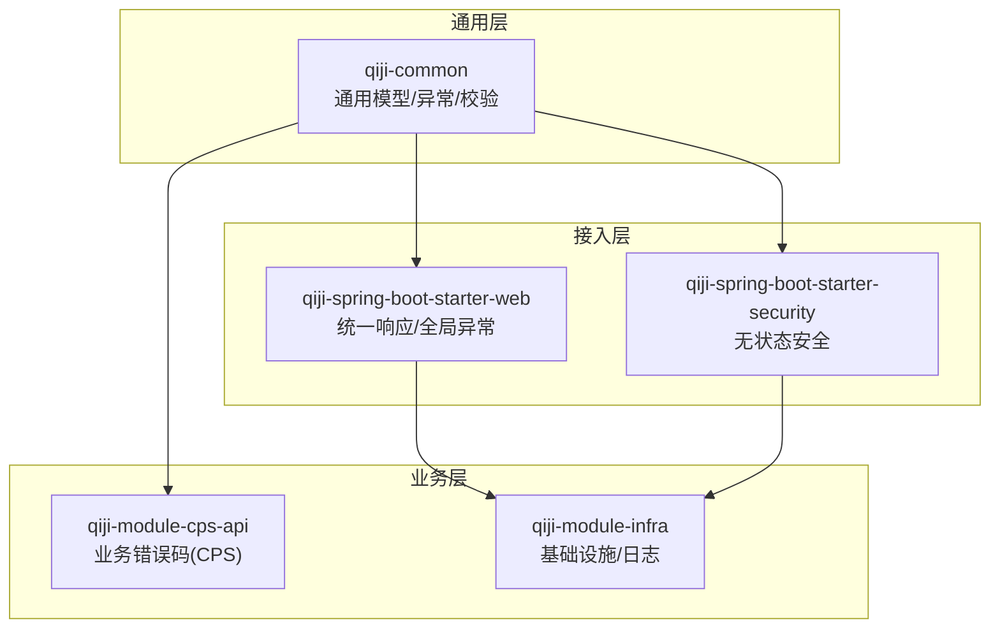
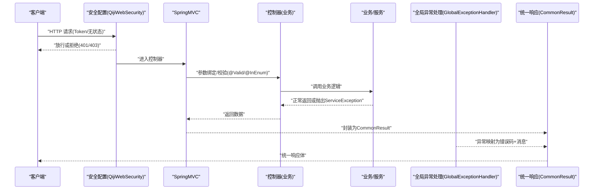
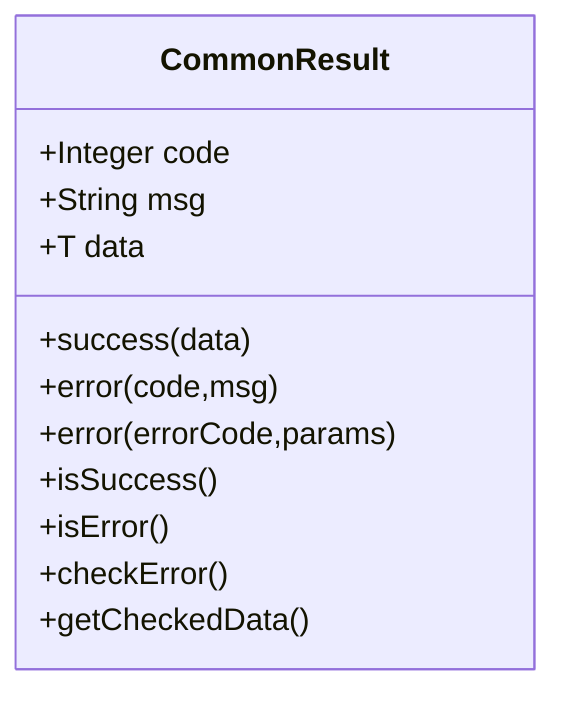
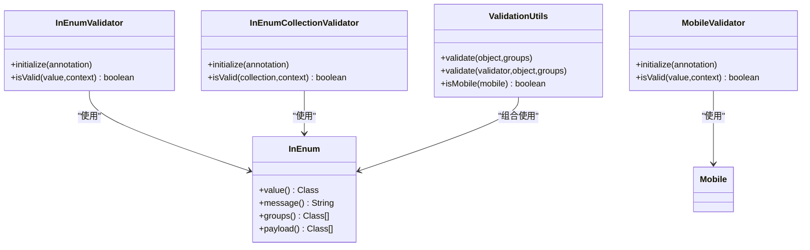
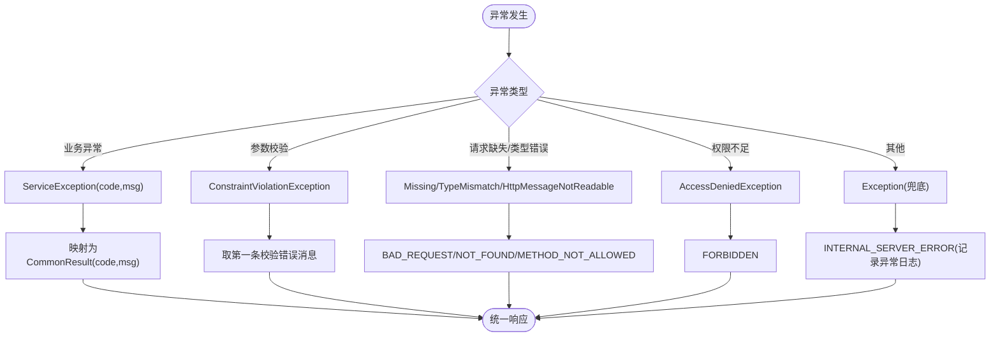
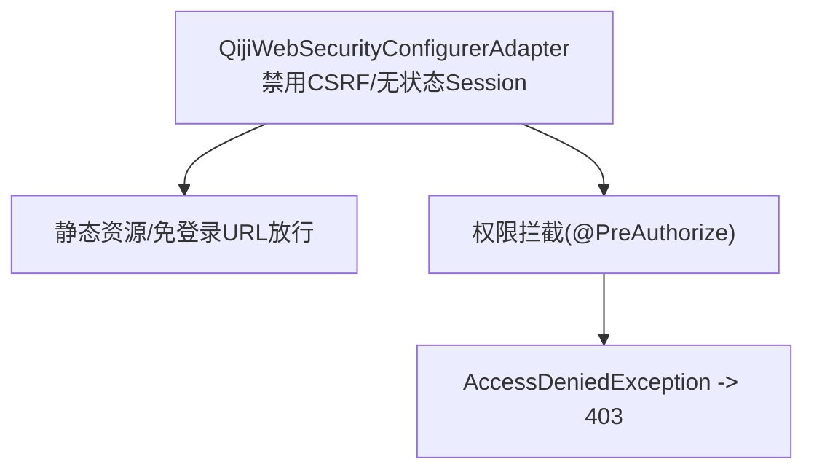
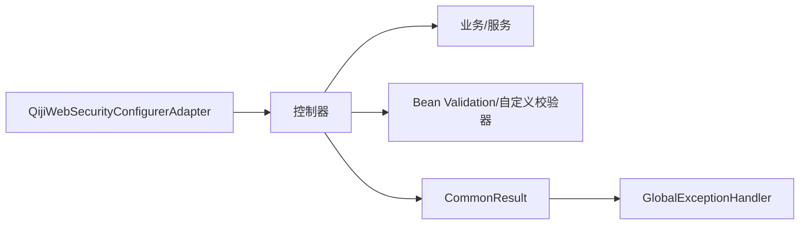
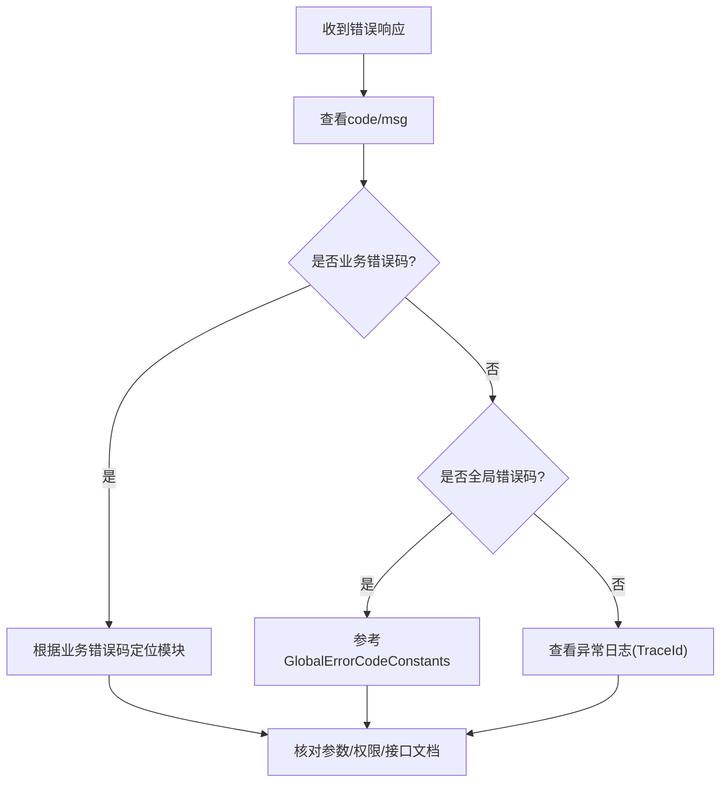

# 接口设计规范

<cite>
**本文引用的文件**   
- [CommonResult.java](file://backend/qiji-framework/qiji-common/src/main/java/com/qiji/cps/framework/common/pojo/CommonResult.java)
- [GlobalErrorCodeConstants.java](file://backend/qiji-framework/qiji-common/src/main/java/com/qiji/cps/framework/common/exception/enums/GlobalErrorCodeConstants.java)
- [CpsErrorCodeConstants.java](file://backend/qiji-module-cps/qiji-module-cps-api/src/main/java/com/qiji/cps/module/cps/enums/CpsErrorCodeConstants.java)
- [GlobalExceptionHandler.java](file://backend/qiji-framework/qiji-spring-boot-starter-web/src/main/java/com/qiji/cps/framework/web/core/handler/GlobalExceptionHandler.java)
- [InEnum.java](file://backend/qiji-framework/qiji-common/src/main/java/com/qiji/cps/framework/common/validation/InEnum.java)
- [InEnumValidator.java](file://backend/qiji-framework/qiji-common/src/main/java/com/qiji/cps/framework/common/validation/InEnumValidator.java)
- [InEnumCollectionValidator.java](file://backend/qiji-framework/qiji-common/src/main/java/com/qiji/cps/framework/common/validation/InEnumCollectionValidator.java)
- [MobileValidator.java](file://backend/qiji-framework/qiji-common/src/main/java/com/qiji/cps/framework/common/validation/MobileValidator.java)
- [ValidationUtils.java](file://backend/qiji-framework/qiji-common/src/main/java/com/qiji/cps/framework/common/util/validation/ValidationUtils.java)
- [QijiWebSecurityConfigurerAdapter.java](file://backend/qiji-framework/qiji-spring-boot-starter-security/src/main/java/com/qiji/cps/framework/security/config/QijiWebSecurityConfigurerAdapter.java)
- [ApiErrorLogRespVO.java](file://backend/qiji-module-infra/src/main/java/com/qiji/cps/module/infra/controller/admin/logger/vo/apierrorlog/ApiErrorLogRespVO.java)
</cite>

## 目录
1. [引言](#引言)
2. [项目结构](#项目结构)
3. [核心组件](#核心组件)
4. [架构总览](#架构总览)
5. [详细组件分析](#详细组件分析)
6. [依赖分析](#依赖分析)
7. [性能考量](#性能考量)
8. [故障排查指南](#故障排查指南)
9. [结论](#结论)
10. [附录](#附录)

## 引言
本规范面向 AgenticCPS 后端接口设计与实现，系统化阐述 REST API 设计原则、参数校验规则、响应格式标准化、错误码体系、安全规范、版本管理与兼容性策略以及 API 文档生成最佳实践。目标是统一接口风格、提升可维护性与可扩展性，降低前后端协作成本。

## 项目结构
AgenticCPS 采用多模块分层架构，接口相关的关键模块与职责如下：
- qiji-common：通用模型、异常与校验基础能力
- qiji-spring-boot-starter-web：统一响应包装、全局异常处理
- qiji-spring-boot-starter-security：基于 Token 的无状态安全配置
- qiji-module-cps-api：业务错误码定义（CPS 子系统）
- qiji-module-infra：基础设施能力（含错误日志导出等）

**图示来源**
- [CommonResult.java:1-122](file://backend/qiji-framework/qiji-common/src/main/java/com/qiji/cps/framework/common/pojo/CommonResult.java#L1-L122)
- [GlobalExceptionHandler.java:1-454](file://backend/qiji-framework/qiji-spring-boot-starter-web/src/main/java/com/qiji/cps/framework/web/core/handler/GlobalExceptionHandler.java#L1-L454)
- [QijiWebSecurityConfigurerAdapter.java:115-134](file://backend/qiji-framework/qiji-spring-boot-starter-security/src/main/java/com/qiji/cps/framework/security/config/QijiWebSecurityConfigurerAdapter.java#L115-L134)
- [CpsErrorCodeConstants.java:1-69](file://backend/qiji-module-cps/qiji-module-cps-api/src/main/java/com/qiji/cps/module/cps/enums/CpsErrorCodeConstants.java#L1-L69)

**章节来源**
- [CommonResult.java:1-122](file://backend/qiji-framework/qiji-common/src/main/java/com/qiji/cps/framework/common/pojo/CommonResult.java#L1-L122)
- [GlobalExceptionHandler.java:1-454](file://backend/qiji-framework/qiji-spring-boot-starter-web/src/main/java/com/qiji/cps/framework/web/core/handler/GlobalExceptionHandler.java#L1-L454)
- [QijiWebSecurityConfigurerAdapter.java:115-134](file://backend/qiji-framework/qiji-spring-boot-starter-security/src/main/java/com/qiji/cps/framework/security/config/QijiWebSecurityConfigurerAdapter.java#L115-L134)
- [CpsErrorCodeConstants.java:1-69](file://backend/qiji-module-cps/qiji-module-cps-api/src/main/java/com/qiji/cps/module/cps/enums/CpsErrorCodeConstants.java#L1-L69)

## 核心组件
- 统一响应包装：所有接口返回统一结构，便于前端解析与错误处理
- 全局异常处理：将各类异常映射为统一响应与错误码
- Bean Validation 校验：结合自定义注解与校验器，覆盖常用业务约束
- 错误码体系：按全局与业务域划分，支持参数化消息与扩展
- 安全配置：无状态 Token 认证、CSRF 禁用、细粒度权限控制
- 日志与可观测性：异常日志采集与导出，辅助问题定位

**章节来源**
- [CommonResult.java:1-122](file://backend/qiji-framework/qiji-common/src/main/java/com/qiji/cps/framework/common/pojo/CommonResult.java#L1-L122)
- [GlobalExceptionHandler.java:1-454](file://backend/qiji-framework/qiji-spring-boot-starter-web/src/main/java/com/qiji/cps/framework/web/core/handler/GlobalExceptionHandler.java#L1-L454)
- [GlobalErrorCodeConstants.java:1-42](file://backend/qiji-framework/qiji-common/src/main/java/com/qiji/cps/framework/common/exception/enums/GlobalErrorCodeConstants.java#L1-L42)
- [CpsErrorCodeConstants.java:1-69](file://backend/qiji-module-cps/qiji-module-cps-api/src/main/java/com/qiji/cps/module/cps/enums/CpsErrorCodeConstants.java#L1-L69)

## 架构总览
下图展示一次典型请求从客户端到业务处理再到统一响应返回的完整链路，包括参数校验、异常处理与安全拦截。

**图示来源**
- [QijiWebSecurityConfigurerAdapter.java:115-134](file://backend/qiji-framework/qiji-spring-boot-starter-security/src/main/java/com/qiji/cps/framework/security/config/QijiWebSecurityConfigurerAdapter.java#L115-L134)
- [GlobalExceptionHandler.java:1-454](file://backend/qiji-framework/qiji-spring-boot-starter-web/src/main/java/com/qiji/cps/framework/web/core/handler/GlobalExceptionHandler.java#L1-L454)
- [CommonResult.java:1-122](file://backend/qiji-framework/qiji-common/src/main/java/com/qiji/cps/framework/common/pojo/CommonResult.java#L1-L122)

## 详细组件分析

### 统一响应包装与状态码规范
- 响应结构：包含 code、msg、data 三要素；成功时 code 为 0，msg 为空字符串
- 成功与错误工厂方法：提供 success(data)、error(code,message)、error(errorCode,...) 等便捷方法
- 与异常体系集成：支持 checkError()/getCheckedData() 将错误转换为 ServiceException 抛出
- 状态码规范：优先复用 HTTP 状态码语义，配合全局错误码常量使用

**图示来源**
- [CommonResult.java:1-122](file://backend/qiji-framework/qiji-common/src/main/java/com/qiji/cps/framework/common/pojo/CommonResult.java#L1-L122)

**章节来源**
- [CommonResult.java:1-122](file://backend/qiji-framework/qiji-common/src/main/java/com/qiji/cps/framework/common/pojo/CommonResult.java#L1-L122)
- [GlobalErrorCodeConstants.java:1-42](file://backend/qiji-framework/qiji-common/src/main/java/com/qiji/cps/framework/common/exception/enums/GlobalErrorCodeConstants.java#L1-L42)

### 参数校验规则与 Bean Validation
- 校验注解使用：在控制器参数与请求体上使用 @Valid、@NotNull、@Min、@Max、@Pattern 等
- 自定义校验器：
  - InEnum：校验值是否在枚举数组范围内，支持集合全包含校验
  - Mobile：手机号格式校验（空值默认跳过）
- 工具类 ValidationUtils：提供 validate() 方法，统一触发 Bean Validation 并抛出 ConstraintViolationException
- 校验异常映射：由全局异常处理器统一捕获并返回统一响应

**图示来源**
- [InEnum.java:1-35](file://backend/qiji-framework/qiji-common/src/main/java/com/qiji/cps/framework/common/validation/InEnum.java#L1-L35)
- [InEnumValidator.java:1-43](file://backend/qiji-framework/qiji-common/src/main/java/com/qiji/cps/framework/common/validation/InEnumValidator.java#L1-L43)
- [InEnumCollectionValidator.java:1-44](file://backend/qiji-framework/qiji-common/src/main/java/com/qiji/cps/framework/common/validation/InEnumCollectionValidator.java#L1-L44)
- [MobileValidator.java:1-25](file://backend/qiji-framework/qiji-common/src/main/java/com/qiji/cps/framework/common/validation/MobileValidator.java#L1-L25)
- [ValidationUtils.java:1-55](file://backend/qiji-framework/qiji-common/src/main/java/com/qiji/cps/framework/common/util/validation/ValidationUtils.java#L1-L55)

**章节来源**
- [InEnum.java:1-35](file://backend/qiji-framework/qiji-common/src/main/java/com/qiji/cps/framework/common/validation/InEnum.java#L1-L35)
- [InEnumValidator.java:1-43](file://backend/qiji-framework/qiji-common/src/main/java/com/qiji/cps/framework/common/validation/InEnumValidator.java#L1-L43)
- [InEnumCollectionValidator.java:1-44](file://backend/qiji-framework/qiji-common/src/main/java/com/qiji/cps/framework/common/validation/InEnumCollectionValidator.java#L1-L44)
- [MobileValidator.java:1-25](file://backend/qiji-framework/qiji-common/src/main/java/com/qiji/cps/framework/common/validation/MobileValidator.java#L1-L25)
- [ValidationUtils.java:1-55](file://backend/qiji-framework/qiji-common/src/main/java/com/qiji/cps/framework/common/util/validation/ValidationUtils.java#L1-L55)

### 错误码体系设计
- 全局错误码：覆盖客户端错误（400/401/403/404/405/423/429）、服务端错误（500/501/502）与自定义（900/901/999）
- 业务错误码：CPS 子系统使用 1-100-xxx-xxx 区间，按“系统-模块-子模块-序号”分段
- 参数化消息：通过 ServiceExceptionUtil 支持占位符替换，便于国际化扩展
- 异常映射：全局异常处理器将各类异常映射为统一错误码与消息

**图示来源**
- [GlobalExceptionHandler.java:1-454](file://backend/qiji-framework/qiji-spring-boot-starter-web/src/main/java/com/qiji/cps/framework/web/core/handler/GlobalExceptionHandler.java#L1-L454)
- [GlobalErrorCodeConstants.java:1-42](file://backend/qiji-framework/qiji-common/src/main/java/com/qiji/cps/framework/common/exception/enums/GlobalErrorCodeConstants.java#L1-L42)
- [CpsErrorCodeConstants.java:1-69](file://backend/qiji-module-cps/qiji-module-cps-api/src/main/java/com/qiji/cps/module/cps/enums/CpsErrorCodeConstants.java#L1-L69)

**章节来源**
- [GlobalErrorCodeConstants.java:1-42](file://backend/qiji-framework/qiji-common/src/main/java/com/qiji/cps/framework/common/exception/enums/GlobalErrorCodeConstants.java#L1-L42)
- [CpsErrorCodeConstants.java:1-69](file://backend/qiji-module-cps/qiji-module-cps-api/src/main/java/com/qiji/cps/module/cps/enums/CpsErrorCodeConstants.java#L1-L69)
- [GlobalExceptionHandler.java:1-454](file://backend/qiji-framework/qiji-spring-boot-starter-web/src/main/java/com/qiji/cps/framework/web/core/handler/GlobalExceptionHandler.java#L1-L454)

### 接口安全规范
- 认证授权：基于 Token 的无状态认证，禁用 Session；通过 Spring Security 配置放行静态资源与免登录路径
- CSRF 防护：禁用 CSRF（无 Session 场景），通过 Token 保障安全性
- 参数过滤：结合 Bean Validation 与自定义校验器，确保输入合法性
- 权限控制：使用 @PreAuthorize 等注解进行细粒度权限拦截，异常统一映射为 403

**图示来源**
- [QijiWebSecurityConfigurerAdapter.java:115-134](file://backend/qiji-framework/qiji-spring-boot-starter-security/src/main/java/com/qiji/cps/framework/security/config/QijiWebSecurityConfigurerAdapter.java#L115-L134)

**章节来源**
- [QijiWebSecurityConfigurerAdapter.java:115-134](file://backend/qiji-framework/qiji-spring-boot-starter-security/src/main/java/com/qiji/cps/framework/security/config/QijiWebSecurityConfigurerAdapter.java#L115-L134)

### 接口版本管理与兼容性
- 版本策略：建议通过 URL 路径前缀或请求头区分版本（如 /api/v1/... 或 X-API-Version），便于平滑演进
- 向后兼容：新增字段采用可选策略，变更字段保持语义不变；对废弃接口提供过渡期与明确弃用时间线
- 配置迁移：通过环境变量或配置中心动态开关新旧接口，降低升级风险

[本节为通用最佳实践，不直接分析具体文件]

### API 文档生成最佳实践
- OpenAPI/Swagger：结合模块内 API 定义与注解，自动生成接口文档，便于前后端协同
- 文档一致性：接口描述、参数说明、示例与错误码需与实现一致，避免脱节
- 文档发布：将文档托管于内部平台，提供查询与下载能力，支持版本切换

[本节为通用最佳实践，不直接分析具体文件]

## 依赖分析
- 控制器与服务层：通过统一响应与异常处理解耦，便于扩展与测试
- 校验层：自定义注解与校验器形成可复用的约束集，减少重复代码
- 安全层：无状态配置与权限注解共同保障接口安全

**图示来源**
- [GlobalExceptionHandler.java:1-454](file://backend/qiji-framework/qiji-spring-boot-starter-web/src/main/java/com/qiji/cps/framework/web/core/handler/GlobalExceptionHandler.java#L1-L454)
- [CommonResult.java:1-122](file://backend/qiji-framework/qiji-common/src/main/java/com/qiji/cps/framework/common/pojo/CommonResult.java#L1-L122)
- [QijiWebSecurityConfigurerAdapter.java:115-134](file://backend/qiji-framework/qiji-spring-boot-starter-security/src/main/java/com/qiji/cps/framework/security/config/QijiWebSecurityConfigurerAdapter.java#L115-L134)

**章节来源**
- [GlobalExceptionHandler.java:1-454](file://backend/qiji-framework/qiji-spring-boot-starter-web/src/main/java/com/qiji/cps/framework/web/core/handler/GlobalExceptionHandler.java#L1-L454)
- [CommonResult.java:1-122](file://backend/qiji-framework/qiji-common/src/main/java/com/qiji/cps/framework/common/pojo/CommonResult.java#L1-L122)
- [QijiWebSecurityConfigurerAdapter.java:115-134](file://backend/qiji-framework/qiji-spring-boot-starter-security/src/main/java/com/qiji/cps/framework/security/config/QijiWebSecurityConfigurerAdapter.java#L115-L134)

## 性能考量
- 响应序列化：统一响应结构简单，序列化开销低；避免在 data 中返回大对象，必要时采用分页或懒加载
- 校验开销：合理使用 @Valid 与自定义校验器，避免过度嵌套与重复校验
- 异常处理：异常路径尽量短路，避免在异常处理中执行耗时操作
- 安全拦截：无状态认证与权限检查应轻量化，避免额外网络调用

[本节提供通用指导，不直接分析具体文件]

## 故障排查指南
- 统一错误日志：全局异常处理器会异步记录异常日志，包含请求上下文、堆栈信息与 TraceId
- 错误日志导出：通过 ApiErrorLogRespVO 结构化导出，便于审计与问题复盘
- 常见问题定位：
  - 参数校验失败：查看 ConstraintViolationException 映射的错误消息
  - 权限不足：确认 @PreAuthorize 配置与用户角色
  - 404/405：核对请求路径与 HTTP 方法
  - 500：结合 TraceId 与异常日志定位根因

**图示来源**
- [GlobalExceptionHandler.java:342-383](file://backend/qiji-framework/qiji-spring-boot-starter-web/src/main/java/com/qiji/cps/framework/web/core/handler/GlobalExceptionHandler.java#L342-L383)
- [ApiErrorLogRespVO.java:1-33](file://backend/qiji-module-infra/src/main/java/com/qiji/cps/module/infra/controller/admin/logger/vo/apierrorlog/ApiErrorLogRespVO.java#L1-L33)

**章节来源**
- [GlobalExceptionHandler.java:342-383](file://backend/qiji-framework/qiji-spring-boot-starter-web/src/main/java/com/qiji/cps/framework/web/core/handler/GlobalExceptionHandler.java#L342-L383)
- [ApiErrorLogRespVO.java:1-33](file://backend/qiji-module-infra/src/main/java/com/qiji/cps/module/infra/controller/admin/logger/vo/apierrorlog/ApiErrorLogRespVO.java#L1-L33)

## 结论
AgenticCPS 的接口设计以统一响应、严格校验、清晰错误码与无状态安全为核心，辅以完善的异常处理与日志体系，能够有效提升接口质量与开发效率。遵循本文规范可在保证向后兼容的前提下持续演进接口能力。

## 附录
- REST 设计原则
  - HTTP 方法选择：GET/POST/PUT/DELETE/ PATCH 对应查询/创建/更新/删除/部分更新
  - URL 命名规范：使用名词复数形式，小写与连字符，避免动词
  - 资源命名约定：资源路径体现层级关系，参数通过查询参数或路径变量传递
- 参数校验清单
  - 必填字段：@NotNull/@NotBlank
  - 数值范围：@Min/@Max
  - 字符串格式：@Pattern/@Email
  - 枚举校验：@InEnum
  - 手机号：@Mobile
- 响应与错误码
  - 成功：code=0，msg 为空
  - 失败：code 参考全局/业务错误码，msg 为人类可读提示
- 安全与合规
  - 所有接口启用 Token 认证
  - 禁用 CSRF，确保无状态
  - 对敏感参数进行白名单过滤与长度限制

[本节为通用附录，不直接分析具体文件]