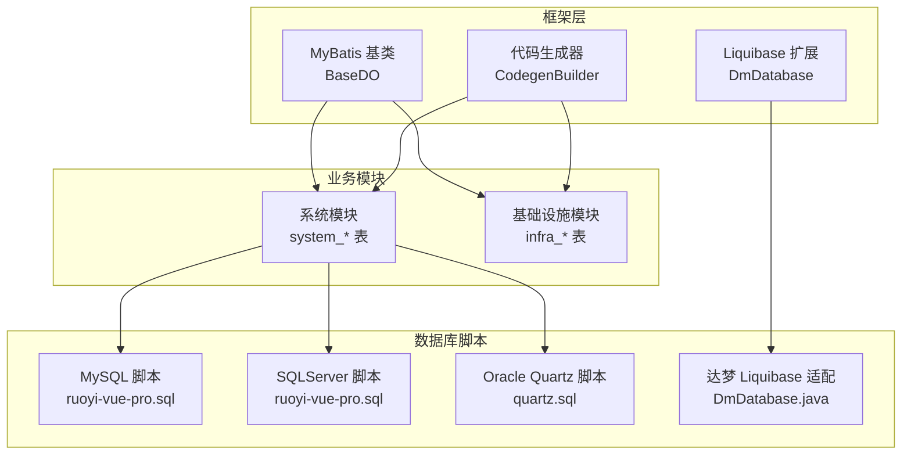
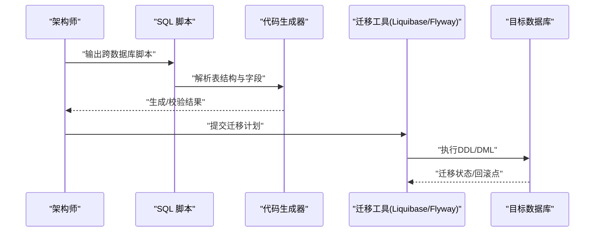
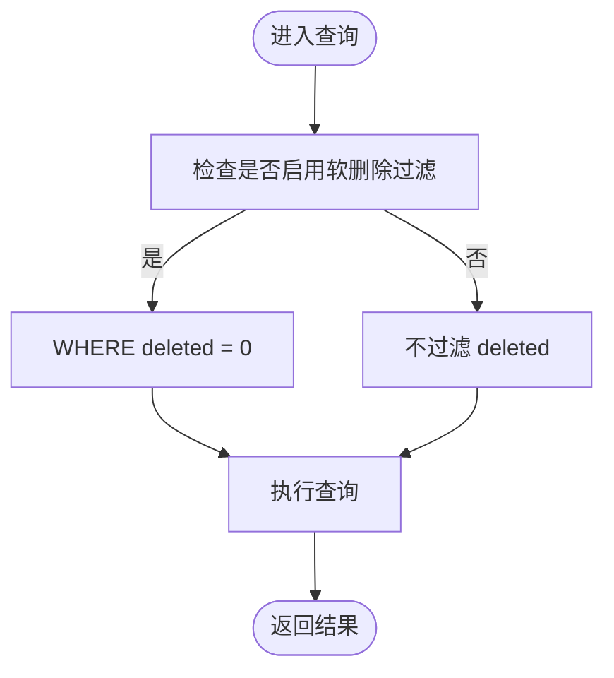
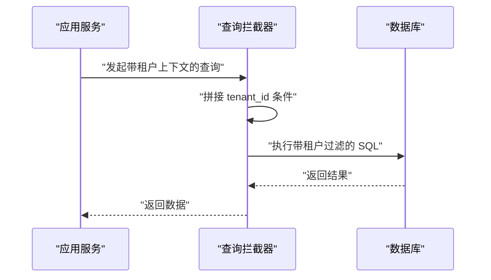
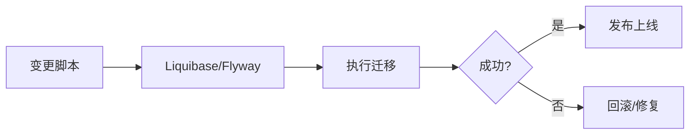
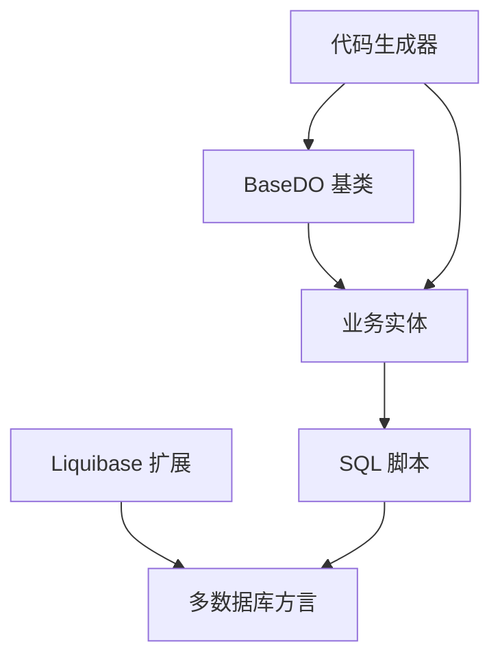

# 数据库变更规范

<cite>
**本文引用的文件**   
- [BaseDO.java](file://backend/qiji-framework/qiji-spring-boot-starter-mybatis/src/main/java/com/qiji/cps/framework/mybatis/core/dataobject/BaseDO.java)
- [ruoyi-vue-pro.sql](file://backend/sql/mysql/ruoyi-vue-pro.sql)
- [create_tables.sql](file://backend/qiji-module-system/src/test/resources/sql/create_tables.sql)
- [DmDatabase.java](file://backend/sql/dm/flowable-patch/src/main/java/liquibase/database/core/DmDatabase.java)
- [AbstractEngineConfiguration.java](file://backend/sql/dm/flowable-patch/src/main/java/org/flowable/common/engine/impl/AbstractEngineConfiguration.java)
- [CodegenBuilder.java](file://backend/qiji-module-infra/src/main/java/com/qiji/cps/module/infra/service/codegen/inner/CodegenBuilder.java)
- [ruoyi-vue-pro.sql](file://backend/sql/sqlserver/ruoyi-vue-pro.sql)
- [quartz.sql](file://backend/sql/oracle/quartz.sql)
</cite>

## 目录
1. [简介](#简介)
2. [项目结构](#项目结构)
3. [核心组件](#核心组件)
4. [架构总览](#架构总览)
5. [详细组件分析](#详细组件分析)
6. [依赖分析](#依赖分析)
7. [性能考虑](#性能考虑)
8. [故障排查指南](#故障排查指南)
9. [结论](#结论)
10. [附录](#附录)

## 简介
本规范面向 AgenticCPS 数据库变更与演进，聚焦以下关键主题：
- 表结构设计原则：命名规范、字段命名约定、主键设计策略
- 索引优化策略：单列索引、复合索引、唯一索引选择原则与性能测试方法
- 软删除实现：deleted 字段设计、逻辑删除注解使用、查询过滤配置
- 多租户支持：tenant_id 字段设计、租户隔离策略、数据权限控制
- 数据库迁移管理：Flyway/Liquibase 使用、版本控制策略、回滚机制
- 数据一致性与事务：一致性保证、事务设计原则、并发控制策略

本规范在不展示具体代码的前提下，结合现有仓库中的 SQL 脚本、MyBatis 基类、代码生成器与 Liquibase 扩展，给出可落地的设计与实施建议。

## 项目结构
AgenticCPS 后端采用模块化分层，数据库相关能力主要分布在如下位置：
- MyBatis 基类与通用实体：提供统一的审计字段与软删除能力
- 测试脚本与多数据库 SQL：覆盖 MySQL、SQLServer、Oracle、达梦等方言
- 代码生成器：基于表结构自动生成基础 DO/DTO/DAO/Service 等
- Liquibase 扩展：适配特定数据库（如达梦）的差异特性

**图示来源**
- [BaseDO.java:1-67](file://backend/qiji-framework/qiji-spring-boot-starter-mybatis/src/main/java/com/qiji/cps/framework/mybatis/core/dataobject/BaseDO.java#L1-L67)
- [CodegenBuilder.java:84-111](file://backend/qiji-module-infra/src/main/java/com/qiji/cps/module/infra/service/codegen/inner/CodegenBuilder.java#L84-L111)
- [DmDatabase.java:309-451](file://backend/sql/dm/flowable-patch/src/main/java/liquibase/database/core/DmDatabase.java#L309-L451)
- [ruoyi-vue-pro.sql:1-200](file://backend/sql/mysql/ruoyi-vue-pro.sql#L1-L200)
- [ruoyi-vue-pro.sql:6835-10968](file://backend/sql/sqlserver/ruoyi-vue-pro.sql#L6835-L10968)
- [quartz.sql:724-792](file://backend/sql/oracle/quartz.sql#L724-L792)

**章节来源**
- [BaseDO.java:1-67](file://backend/qiji-framework/qiji-spring-boot-starter-mybatis/src/main/java/com/qiji/cps/framework/mybatis/core/dataobject/BaseDO.java#L1-L67)
- [CodegenBuilder.java:84-111](file://backend/qiji-module-infra/src/main/java/com/qiji/cps/module/infra/service/codegen/inner/CodegenBuilder.java#L84-L111)
- [DmDatabase.java:309-451](file://backend/sql/dm/flowable-patch/src/main/java/liquibase/database/core/DmDatabase.java#L309-L451)
- [ruoyi-vue-pro.sql:1-200](file://backend/sql/mysql/ruoyi-vue-pro.sql#L1-L200)
- [ruoyi-vue-pro.sql:6835-10968](file://backend/sql/sqlserver/ruoyi-vue-pro.sql#L6835-L10968)
- [quartz.sql:724-792](file://backend/sql/oracle/quartz.sql#L724-L792)

## 核心组件
- 统一审计与软删除基类：所有业务表继承该基类，自动具备创建/更新时间、创建者/更新者、逻辑删除字段
- 代码生成器：根据表结构生成基础实体与字段白名单，自动排除审计与租户字段
- 多数据库脚本：覆盖主流数据库方言，确保索引、约束、注释等特性一致
- Liquibase 扩展：针对特定数据库（如达梦）屏蔽系统表、兼容数据类型与存储参数

**章节来源**
- [BaseDO.java:22-66](file://backend/qiji-framework/qiji-spring-boot-starter-mybatis/src/main/java/com/qiji/cps/framework/mybatis/core/dataobject/BaseDO.java#L22-L66)
- [CodegenBuilder.java:84-111](file://backend/qiji-module-infra/src/main/java/com/qiji/cps/module/infra/service/codegen/inner/CodegenBuilder.java#L84-L111)

## 架构总览
数据库变更遵循“脚本先行 + 代码生成 + 迁移工具”的闭环流程：
- 设计阶段：确定表结构、字段、索引与约束
- 实施阶段：编写 SQL 脚本并同步到多数据库方言
- 验证阶段：通过代码生成器校验字段一致性
- 运行阶段：借助 Liquibase/Flyway 执行迁移与回滚

**图示来源**
- [ruoyi-vue-pro.sql:1-200](file://backend/sql/mysql/ruoyi-vue-pro.sql#L1-L200)
- [CodegenBuilder.java:84-111](file://backend/qiji-module-infra/src/main/java/com/qiji/cps/module/infra/service/codegen/inner/CodegenBuilder.java#L84-L111)
- [DmDatabase.java:309-451](file://backend/sql/dm/flowable-patch/src/main/java/liquibase/database/core/DmDatabase.java#L309-L451)

## 详细组件分析

### 表结构设计原则
- 表命名规范
  - 建议采用小写下划线风格，前缀区分模块（如 system_、infra_），语义清晰且便于扫描
  - 示例：系统模块使用 system_ 前缀，基础设施模块使用 infra_ 前缀
- 字段命名约定
  - 使用小写下划线风格；布尔字段使用 bit 或 tinyint，并明确默认值
  - 审计字段统一：create_time、update_time、creator、updater、deleted
  - 多租户字段：tenant_id，建议默认 0 或显式非空
- 主键设计策略
  - 建议使用自增主键或全局唯一 ID；避免业务字段作为主键
  - 对于高并发写入场景，优先考虑全局 ID 以降低热点
  - 示例：多处表定义使用自增主键，符合常规实践

**章节来源**
- [create_tables.sql:1-200](file://backend/qiji-module-system/src/test/resources/sql/create_tables.sql#L1-L200)
- [ruoyi-vue-pro.sql:20-94](file://backend/sql/mysql/ruoyi-vue-pro.sql#L20-L94)

### 索引优化策略
- 单列索引
  - 适用于等值/范围查询的高频字段，如 tenant_id、deleted、create_time
  - 示例：API 访问日志表对 create_time 建有单列索引
- 复合索引
  - 将最左前缀命中率高的列放在前面；避免过多组合导致维护成本上升
  - 示例：Oracle Quartz 触发器表对 (SCHED_NAME, JOB_NAME, JOB_GROUP) 建有复合索引
- 唯一索引
  - 用于保证业务唯一性（如字典类型、登录名等）
- 性能测试方法
  - 使用 EXPLAIN 分析执行计划，关注 rows、filtered、key、Extra
  - 建立基准测试集，对比加/减索引前后 QPS、P95 延迟变化
  - 结合慢查询日志与数据库性能视图进行回归验证

**章节来源**
- [ruoyi-vue-pro.sql:48-52](file://backend/sql/mysql/ruoyi-vue-pro.sql#L48-L52)
- [quartz.sql:724-792](file://backend/sql/oracle/quartz.sql#L724-L792)

### 软删除实现机制
- deleted 字段设计
  - 建议使用 bit 或 tinyint，默认 0；逻辑删除后仍保留数据以便审计与恢复
- 逻辑删除注解使用
  - MyBatis Plus 提供逻辑删除注解，配合全局配置实现自动过滤
  - 基类中已定义 deleted 字段，所有实体继承后自动生效
- 查询过滤配置
  - 代码生成器在构建表定义时，会自动排除审计与租户字段，确保软删除逻辑不被误用
  - 建议在通用查询层默认开启软删除过滤，避免误查

**图示来源**
- [BaseDO.java:52-54](file://backend/qiji-framework/qiji-spring-boot-starter-mybatis/src/main/java/com/qiji/cps/framework/mybatis/core/dataobject/BaseDO.java#L52-L54)
- [CodegenBuilder.java:84-97](file://backend/qiji-module-infra/src/main/java/com/qiji/cps/module/infra/service/codegen/inner/CodegenBuilder.java#L84-L97)

**章节来源**
- [BaseDO.java:22-66](file://backend/qiji-framework/qiji-spring-boot-starter-mybatis/src/main/java/com/qiji/cps/framework/mybatis/core/dataobject/BaseDO.java#L22-L66)
- [CodegenBuilder.java:84-111](file://backend/qiji-module-infra/src/main/java/com/qiji/cps/module/infra/service/codegen/inner/CodegenBuilder.java#L84-L111)

### 多租户支持实现
- tenant_id 字段设计
  - 建议所有业务表均包含 tenant_id 字段，统一默认 0 或显式非空
  - 示例：系统模块多张表包含 tenant_id 字段
- 租户隔离策略
  - 查询层强制按 tenant_id 过滤；写入层在创建时注入当前租户上下文
  - 对高频查询建立 (tenant_id, create_time) 等复合索引提升性能
- 数据权限控制
  - 结合角色/部门/岗位等维度，形成最小授权集合
  - 代码生成器已将 TENANT_ID_FIELD 加入字段白名单，避免误删

**图示来源**
- [create_tables.sql:14-16](file://backend/qiji-module-system/src/test/resources/sql/create_tables.sql#L14-L16)
- [CodegenBuilder.java:88-96](file://backend/qiji-module-infra/src/main/java/com/qiji/cps/module/infra/service/codegen/inner/CodegenBuilder.java#L88-L96)

**章节来源**
- [create_tables.sql:1-200](file://backend/qiji-module-system/src/test/resources/sql/create_tables.sql#L1-L200)
- [CodegenBuilder.java:84-111](file://backend/qiji-module-infra/src/main/java/com/qiji/cps/module/infra/service/codegen/inner/CodegenBuilder.java#L84-L111)

### 数据库迁移管理
- Flyway/Liquibase 使用
  - Liquibase 已扩展达梦数据库适配，屏蔽系统表与兼容数据类型
  - 建议在 CI 中执行迁移脚本，失败即回滚
- 版本控制策略
  - 采用增量版本号，每次变更对应一个变更集；变更集内保持原子性
  - 对大表变更采用分批执行与影子表策略
- 回滚机制
  - 通过回滚脚本或 Liquibase rollback 功能实现；生产环境需严格审批

**图示来源**
- [DmDatabase.java:309-451](file://backend/sql/dm/flowable-patch/src/main/java/liquibase/database/core/DmDatabase.java#L309-L451)

**章节来源**
- [DmDatabase.java:309-451](file://backend/sql/dm/flowable-patch/src/main/java/liquibase/database/core/DmDatabase.java#L309-L451)

### 数据一致性与事务设计
- 一致性保证
  - 使用数据库事务包裹关键路径，确保写入/更新/删除的原子性
  - 对跨表写入采用统一事务边界，避免部分提交
- 事务设计原则
  - 保持事务短小精悍，减少锁持有时间
  - 对批量写入采用分页/批处理，降低锁竞争
- 并发控制策略
  - 写入冲突使用乐观锁（版本号）或分布式锁
  - 读多写少场景引入缓存与最终一致性模型

[本节为通用指导，无需列出具体文件来源]

## 依赖分析
- 组件耦合
  - BaseDO 为所有业务实体提供统一基类，降低重复实现
  - 代码生成器依赖 BaseDO 字段集合，确保生成代码与数据库结构一致
  - Liquibase 扩展依赖数据库方言特性，保障迁移兼容性
- 外部依赖
  - MySQL、SQLServer、Oracle、达梦等多数据库方言脚本并行维护
  - Quartz 索引脚本体现 Oracle 方言下的索引策略

**图示来源**
- [BaseDO.java:22-66](file://backend/qiji-framework/qiji-spring-boot-starter-mybatis/src/main/java/com/qiji/cps/framework/mybatis/core/dataobject/BaseDO.java#L22-L66)
- [CodegenBuilder.java:84-111](file://backend/qiji-module-infra/src/main/java/com/qiji/cps/module/infra/service/codegen/inner/CodegenBuilder.java#L84-L111)
- [DmDatabase.java:309-451](file://backend/sql/dm/flowable-patch/src/main/java/liquibase/database/core/DmDatabase.java#L309-L451)

**章节来源**
- [BaseDO.java:22-66](file://backend/qiji-framework/qiji-spring-boot-starter-mybatis/src/main/java/com/qiji/cps/framework/mybatis/core/dataobject/BaseDO.java#L22-L66)
- [CodegenBuilder.java:84-111](file://backend/qiji-module-infra/src/main/java/com/qiji/cps/module/infra/service/codegen/inner/CodegenBuilder.java#L84-L111)
- [DmDatabase.java:309-451](file://backend/sql/dm/flowable-patch/src/main/java/liquibase/database/core/DmDatabase.java#L309-L451)

## 性能考虑
- 索引设计
  - 优先覆盖高频查询与聚合场景；定期评估索引选择性与维护成本
  - 对时间序列数据建立单列索引或分区表
- 查询优化
  - 使用 LIMIT/分页避免一次性加载大量数据
  - 避免 SELECT *，仅取必要字段
- 写入优化
  - 批量写入合并为事务；控制单事务大小
  - 对热点表采用分库分表或异步写入

[本节为通用指导，无需列出具体文件来源]

## 故障排查指南
- 软删除导致查询不到数据
  - 检查是否启用了软删除过滤；确认 deleted 字段默认值与查询条件
- 多租户数据隔离失效
  - 核对查询层是否注入 tenant_id；确认写入时是否正确设置
- 迁移失败
  - 查看迁移日志与回滚点；核对数据库方言差异与系统表屏蔽规则
- 索引未生效
  - 使用 EXPLAIN 分析执行计划；检查统计信息与查询谓词是否匹配索引

**章节来源**
- [BaseDO.java:52-54](file://backend/qiji-framework/qiji-spring-boot-starter-mybatis/src/main/java/com/qiji/cps/framework/mybatis/core/dataobject/BaseDO.java#L52-L54)
- [CodegenBuilder.java:84-97](file://backend/qiji-module-infra/src/main/java/com/qiji/cps/module/infra/service/codegen/inner/CodegenBuilder.java#L84-L97)
- [DmDatabase.java:309-451](file://backend/sql/dm/flowable-patch/src/main/java/liquibase/database/core/DmDatabase.java#L309-L451)

## 结论
AgenticCPS 的数据库变更规范以“统一基类 + 代码生成 + 多方言脚本 + 迁移工具”为核心，辅以软删除与多租户的标准化实现。遵循本规范可在保证数据一致性与性能的同时，提升变更效率与可维护性。

[本节为总结性内容，无需列出具体文件来源]

## 附录
- 参考脚本位置
  - MySQL 脚本：backend/sql/mysql/ruoyi-vue-pro.sql
  - SQLServer 脚本：backend/sql/sqlserver/ruoyi-vue-pro.sql
  - Oracle Quartz 脚本：backend/sql/oracle/quartz.sql
  - 达梦 Liquibase 适配：backend/sql/dm/flowable-patch/src/main/java/liquibase/database/core/DmDatabase.java
- 关键类参考
  - 基类：backend/qiji-framework/qiji-spring-boot-starter-mybatis/src/main/java/com/qiji/cps/framework/mybatis/core/dataobject/BaseDO.java
  - 代码生成器：backend/qiji-module-infra/src/main/java/com/qiji/cps/module/infra/service/codegen/inner/CodegenBuilder.java
  - Flowable 租户配置：backend/sql/dm/flowable-patch/src/main/java/org/flowable/common/engine/impl/AbstractEngineConfiguration.java

[本节为附录性内容，无需列出具体文件来源]