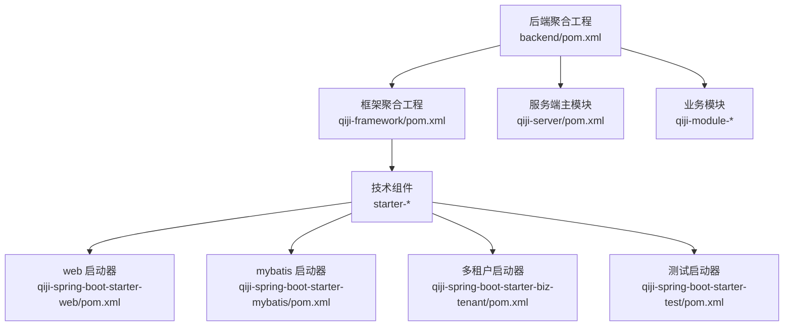
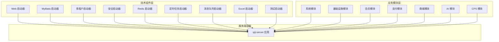
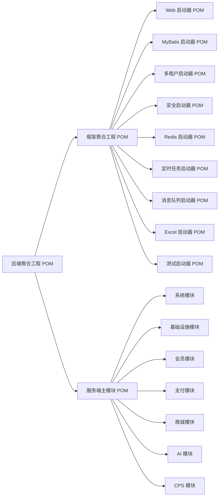

# 新功能开发流程

<cite>
**本文引用的文件**
- [后端聚合工程 POM](file://backend/pom.xml)
- [框架聚合工程 POM](file://backend/qiji-framework/pom.xml)
- [服务端主模块 POM](file://backend/qiji-server/pom.xml)
- [Web 启动器 POM](file://backend/qiji-framework/qiji-spring-boot-starter-web/pom.xml)
- [MyBatis 启动器 POM](file://backend/qiji-framework/qiji-spring-boot-starter-mybatis/pom.xml)
- [多租户启动器 POM](file://backend/qiji-framework/qiji-spring-boot-starter-biz-tenant/pom.xml)
- [测试启动器 POM](file://backend/qiji-framework/qiji-spring-boot-starter-test/pom.xml)
- [Jenkins 流水线](file://backend/script/jenkins/Jenkinsfile)
- [前端管理端包配置](file://frontend/admin-uniapp/package.json)
</cite>

## 目录
1. [简介](#简介)
2. [项目结构](#项目结构)
3. [核心组件](#核心组件)
4. [架构总览](#架构总览)
5. [详细组件分析](#详细组件分析)
6. [依赖关系分析](#依赖关系分析)
7. [性能与可维护性建议](#性能与可维护性建议)
8. [故障排查指南](#故障排查指南)
9. [结论](#结论)
10. [附录](#附录)

## 简介
本指导文档面向 AgenticCPS 新功能开发流程，覆盖从模块创建、Maven 构建配置、Spring Bean 注册与依赖注入、REST API 设计与参数校验、数据库变更规范、测试用例编写、代码生成器使用，到代码审查、Git 工作流与持续集成的最佳实践。内容以仓库现有框架与模块为基础，结合通用工程化经验，帮助团队高效、一致地交付高质量功能。

## 项目结构
AgenticCPS 采用多模块 Maven 聚合工程组织，后端以 qiji 为核心父工程，下辖 qiji-framework 技术组件层与多个业务模块；前端提供管理端与小程序端示例。整体结构清晰，便于按领域拆分与独立演进。

图示来源
- [后端聚合工程 POM:10-25](file://backend/pom.xml#L10-L25)
- [框架聚合工程 POM:12-31](file://backend/qiji-framework/pom.xml#L12-L31)
- [服务端主模块 POM:23-114](file://backend/qiji-server/pom.xml#L23-L114)
- [Web 启动器 POM:18-79](file://backend/qiji-framework/qiji-spring-boot-starter-web/pom.xml#L18-L79)
- [MyBatis 启动器 POM:18-108](file://backend/qiji-framework/qiji-spring-boot-starter-mybatis/pom.xml#L18-L108)
- [多租户启动器 POM:18-81](file://backend/qiji-framework/qiji-spring-boot-starter-biz-tenant/pom.xml#L18-L81)
- [测试启动器 POM:18-59](file://backend/qiji-framework/qiji-spring-boot-starter-test/pom.xml#L18-L59)

章节来源
- [后端聚合工程 POM:1-176](file://backend/pom.xml#L1-L176)
- [框架聚合工程 POM:1-47](file://backend/qiji-framework/pom.xml#L1-L47)
- [服务端主模块 POM:1-137](file://backend/qiji-server/pom.xml#L1-L137)

## 核心组件
- Maven 多模块与版本管理：统一版本号、插件与仓库配置，确保依赖一致性与构建稳定性。
- 技术组件层（starter-*）：封装 Web、MyBatis、安全、监控、消息队列、定时任务、Excel、测试等能力，按需装配。
- 业务模块层（qiji-module-*）：按领域划分，如系统、基础设施、会员、支付、商城、AI、CPS 等，彼此解耦。
- 服务端主模块：聚合业务模块并打包为可执行应用，作为对外提供 API 的容器。

章节来源
- [后端聚合工程 POM:31-57](file://backend/pom.xml#L31-L57)
- [框架聚合工程 POM:33-46](file://backend/qiji-framework/pom.xml#L33-L46)
- [服务端主模块 POM:16-114](file://backend/qiji-server/pom.xml#L16-L114)

## 架构总览
后端采用“技术组件 + 业务模块 + 服务端容器”的分层架构。技术组件通过 starter 形式提供能力，业务模块通过依赖注入与自动装配组合使用；服务端主模块负责装配模块并打包发布。

图示来源
- [Web 启动器 POM:18-79](file://backend/qiji-framework/qiji-spring-boot-starter-web/pom.xml#L18-L79)
- [MyBatis 启动器 POM:18-108](file://backend/qiji-framework/qiji-spring-boot-starter-mybatis/pom.xml#L18-L108)
- [多租户启动器 POM:18-81](file://backend/qiji-framework/qiji-spring-boot-starter-biz-tenant/pom.xml#L18-L81)
- [服务端主模块 POM:23-114](file://backend/qiji-server/pom.xml#L23-L114)

## 详细组件分析

### 新模块创建步骤
- 在后端根目录创建新模块子目录，并在 qiji-framework 或 qiji-server 下新增对应模块 POM。
- 在后端聚合工程中注册新模块，确保版本与依赖管理一致。
- 在服务端主模块中添加对新模块的依赖，或在需要的业务模块中引入。
- 在前端管理端 package.json 中按需增加前端依赖与构建脚本（如涉及前端页面）。

章节来源
- [后端聚合工程 POM:10-25](file://backend/pom.xml#L10-L25)
- [服务端主模块 POM:23-114](file://backend/qiji-server/pom.xml#L23-L114)
- [前端管理端包配置:29-98](file://frontend/admin-uniapp/package.json#L29-L98)

### Maven 模块配置要点
- 版本与插件：统一使用父工程的版本变量与插件配置，避免版本漂移。
- 依赖范围：合理设置 provided、optional，减少传递依赖带来的冲突。
- 仓库镜像：优先使用华为云/阿里云 Maven 源，提升构建速度与稳定性。

章节来源
- [后端聚合工程 POM:31-57](file://backend/pom.xml#L31-L57)
- [后端聚合工程 POM:144-173](file://backend/pom.xml#L144-L173)

### Spring Bean 注册与依赖注入
- 自动装配：技术组件通过 starter 提供自动配置，业务模块直接通过 @Autowired/@Resource 获取服务。
- 条件装配：根据配置开关启用/禁用组件（如多租户、定时任务等），避免不必要的资源占用。
- 配置类：在模块中提供@ConfigurationProperties绑定配置项，确保外部化配置可维护。

章节来源
- [Web 启动器 POM:18-79](file://backend/qiji-framework/qiji-spring-boot-starter-web/pom.xml#L18-L79)
- [MyBatis 启动器 POM:18-108](file://backend/qiji-framework/qiji-spring-boot-starter-mybatis/pom.xml#L18-L108)
- [多租户启动器 POM:18-81](file://backend/qiji-framework/qiji-spring-boot-starter-biz-tenant/pom.xml#L18-L81)

### 接口设计规范
- REST API 设计原则
  - 资源命名：使用名词复数，路径层级清晰，避免动词。
  - HTTP 方法：GET/POST/PUT/DELETE 明确语义，幂等性与状态变更一致。
  - 路径参数与查询参数：区分必需与可选，保持参数最小化。
  - 分页与排序：统一分页参数与排序字段，避免歧义。
- 参数校验规则
  - 使用参数校验注解（如非空、长度、格式、枚举值等），在控制器层统一拦截处理。
  - 对敏感字段进行脱敏输出，遵循最小暴露原则。
- 响应格式标准化
  - 统一返回体结构（成功/失败标志、数据载体、错误码与信息），便于前端统一处理。
- 错误码定义
  - 按模块划分错误码空间，避免冲突；错误码与国际化消息解耦，支持多语言扩展。

章节来源
- [Web 启动器 POM:18-79](file://backend/qiji-framework/qiji-spring-boot-starter-web/pom.xml#L18-L79)

### 数据库变更规范
- 表结构设计原则
  - 字段命名与类型选择：明确业务含义，避免冗余字段；时间戳使用统一精度。
  - 主键策略：优先使用自增或分布式 ID，避免跨库关联主键。
  - 约束与索引：合理设置唯一约束、外键与索引，平衡查询与写入性能。
- 索引优化策略
  - 前缀匹配与范围查询：针对高频过滤条件建立复合索引。
  - 覆盖索引：尽量让热点查询走索引，减少回表。
  - 定期评估：通过慢查询日志与执行计划分析，剔除无效索引。
- 软删除实现
  - 引入逻辑删除字段，配合查询拦截器或 ORM 层面默认过滤已删除记录。
- 多租户支持
  - 在实体与查询层面加入租户维度，确保数据隔离；必要时通过动态数据源或行级策略实现。

章节来源
- [MyBatis 启动器 POM:18-108](file://backend/qiji-framework/qiji-spring-boot-starter-mybatis/pom.xml#L18-L108)
- [多租户启动器 POM:18-81](file://backend/qiji-framework/qiji-spring-boot-starter-biz-tenant/pom.xml#L18-L81)

### 测试用例编写指导
- 单元测试
  - 使用测试启动器提供的 H2 内嵌数据库与 Redis Mock，快速验证业务逻辑。
  - 使用 Podam 等库生成随机 POJO，提高测试覆盖面。
- 集成测试
  - 通过 @SpringBootTest 启动完整上下文，验证模块间协作与依赖注入。
- Mock 数据管理
  - 统一在测试资源中维护初始化 SQL 与 Mock 数据，保证测试可重复性。
- 测试覆盖率
  - 建议关键业务路径覆盖率不低于 80%，接口层与核心服务层不低于 90%。

章节来源
- [测试启动器 POM:18-59](file://backend/qiji-framework/qiji-spring-boot-starter-test/pom.xml#L18-L59)

### 代码生成器使用
- 数据库表到实体类生成
  - 基于 MyBatis Plus 与数据库连接信息，生成实体、Mapper、Service、Controller 基础代码，降低重复劳动。
- 前后端代码生成
  - 结合接口文档（Knife4j/SpringDoc）生成前端调用示例与类型定义，减少对接成本。
- CRUD 页面自动生成
  - 通过模板引擎生成基础页面与路由配置，开发者在此基础上进行定制化扩展。

章节来源
- [MyBatis 启动器 POM:72-108](file://backend/qiji-framework/qiji-spring-boot-starter-mybatis/pom.xml#L72-L108)
- [Web 启动器 POM:42-48](file://backend/qiji-framework/qiji-spring-boot-starter-web/pom.xml#L42-L48)

### 代码审查流程
- 规范检查：命名、注释、异常处理、日志级别、参数校验、安全防护。
- 设计一致性：是否遵循模块边界、是否滥用全局状态、是否引入循环依赖。
- 性能与可维护性：复杂度控制、缓存策略、数据库访问模式、异常传播链路。
- 测试完备性：单元测试与集成测试覆盖情况，Mock 数据与边界场景。

### Git 工作流规范
- 分支策略：主分支保护、特性分支、热修复分支，提交信息遵循约定式规范。
- 提交与合并：小步提交、清晰描述、关联 Issue；合并前必须通过 CI 与代码审查。
- 标签与发布：版本标签与变更日志同步更新，确保可追溯性。

### 持续集成配置最佳实践
- 构建与测试：统一 Maven 参数，跳过测试阶段用于快速构建，完整流水线中开启测试。
- 部署与发布：容器化打包，镜像推送与集群部署自动化；支持多环境配置注入。
- 监控与回滚：健康检查、日志采集、失败告警与一键回滚策略。

章节来源
- [Jenkins 流水线:1-61](file://backend/script/jenkins/Jenkinsfile#L1-L61)

## 依赖关系分析
技术组件与业务模块之间通过 starter 与模块依赖解耦，服务端主模块集中装配，形成清晰的依赖层次。

图示来源
- [后端聚合工程 POM:10-25](file://backend/pom.xml#L10-L25)
- [框架聚合工程 POM:12-31](file://backend/qiji-framework/pom.xml#L12-L31)
- [服务端主模块 POM:23-114](file://backend/qiji-server/pom.xml#L23-L114)
- [Web 启动器 POM:18-79](file://backend/qiji-framework/qiji-spring-boot-starter-web/pom.xml#L18-L79)
- [MyBatis 启动器 POM:18-108](file://backend/qiji-framework/qiji-spring-boot-starter-mybatis/pom.xml#L18-L108)
- [多租户启动器 POM:18-81](file://backend/qiji-framework/qiji-spring-boot-starter-biz-tenant/pom.xml#L18-L81)
- [测试启动器 POM:18-59](file://backend/qiji-framework/qiji-spring-boot-starter-test/pom.xml#L18-L59)

章节来源
- [后端聚合工程 POM:1-176](file://backend/pom.xml#L1-L176)
- [框架聚合工程 POM:1-47](file://backend/qiji-framework/pom.xml#L1-L47)
- [服务端主模块 POM:1-137](file://backend/qiji-server/pom.xml#L1-L137)

## 性能与可维护性建议
- 依赖精简：仅引入必要 starter，避免过度装配导致启动与运行开销增大。
- 查询优化：遵循索引设计原则，限制 N+1 查询，使用批量操作与缓存。
- 幂等与重试：对外接口实现幂等，内部调用考虑超时与重试策略。
- 配置治理：将敏感配置与环境差异通过外部化配置管理，避免硬编码。

## 故障排查指南
- 构建失败
  - 检查本地 Maven 仓库与镜像源可用性，清理并重新构建。
  - 关注编译插件与 Java 版本兼容性（Java 17）。
- 运行异常
  - 查看服务端主模块的依赖装配顺序，确认模块依赖正确引入。
  - 检查数据库连接、Redis 连接与消息队列配置。
- 测试不通过
  - 确认测试启动器依赖已引入，H2 与 Redis Mock 初始化正常。
  - 核对 Mock 数据与断言逻辑，关注边界条件与异常路径。

章节来源
- [后端聚合工程 POM:144-173](file://backend/pom.xml#L144-L173)
- [服务端主模块 POM:101-114](file://backend/qiji-server/pom.xml#L101-L114)
- [测试启动器 POM:45-59](file://backend/qiji-framework/qiji-spring-boot-starter-test/pom.xml#L45-L59)

## 结论
通过遵循本指导文档中的模块创建、Maven 配置、Spring 组件装配、接口设计、数据库变更、测试与 CI/CD 规范，AgenticCPS 团队可以高效、稳定地交付新功能。建议在每次迭代中固化流程与模板，持续优化依赖与性能，确保系统长期可维护性与可扩展性。

## 附录
- 前端管理端脚本与依赖参考：用于理解前端构建与运行方式，便于前后端联调与联测。
  
章节来源
- [前端管理端包配置:29-98](file://frontend/admin-uniapp/package.json#L29-L98)