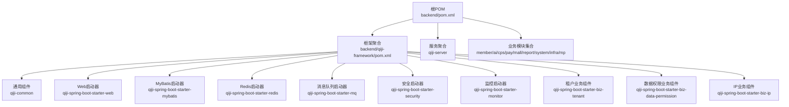
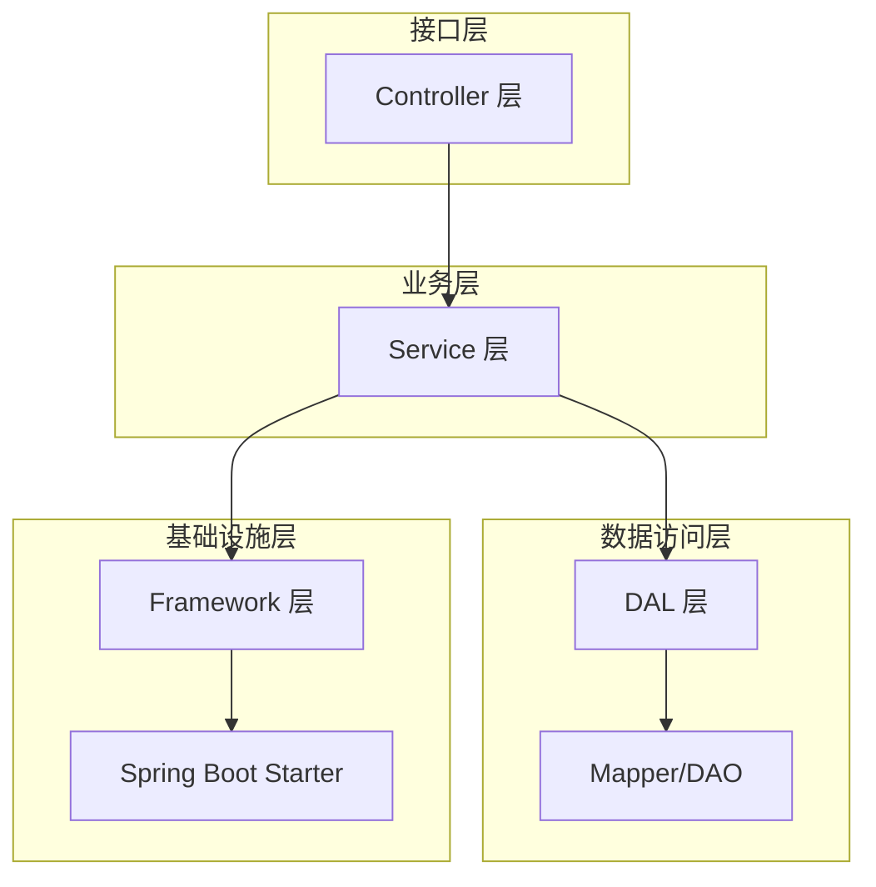
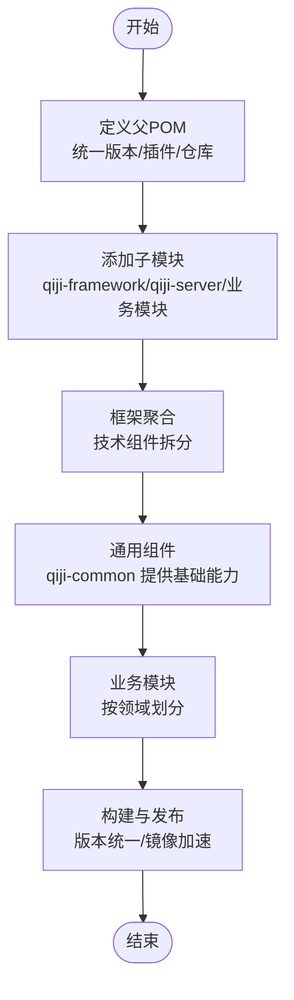
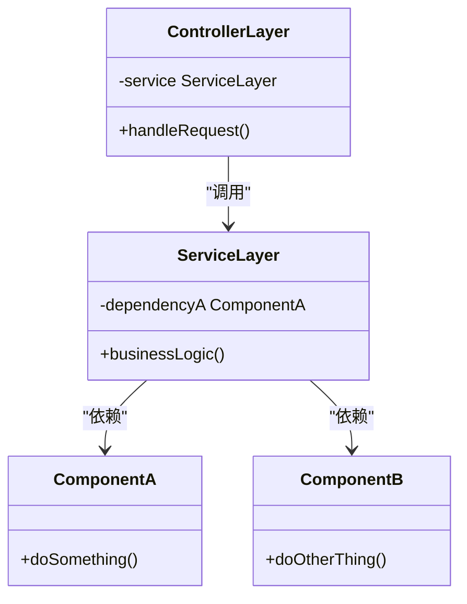
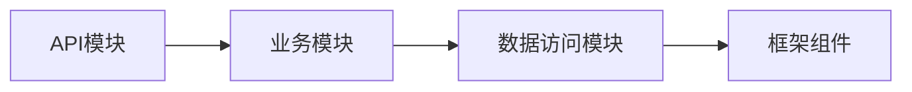
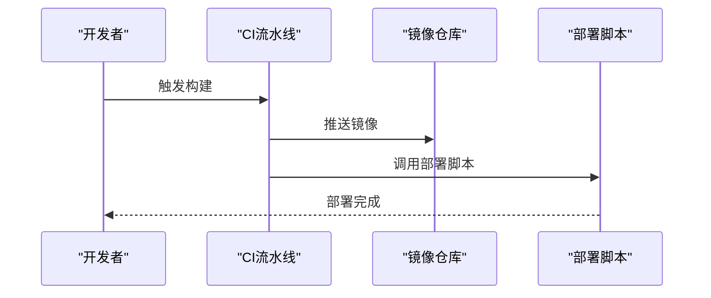
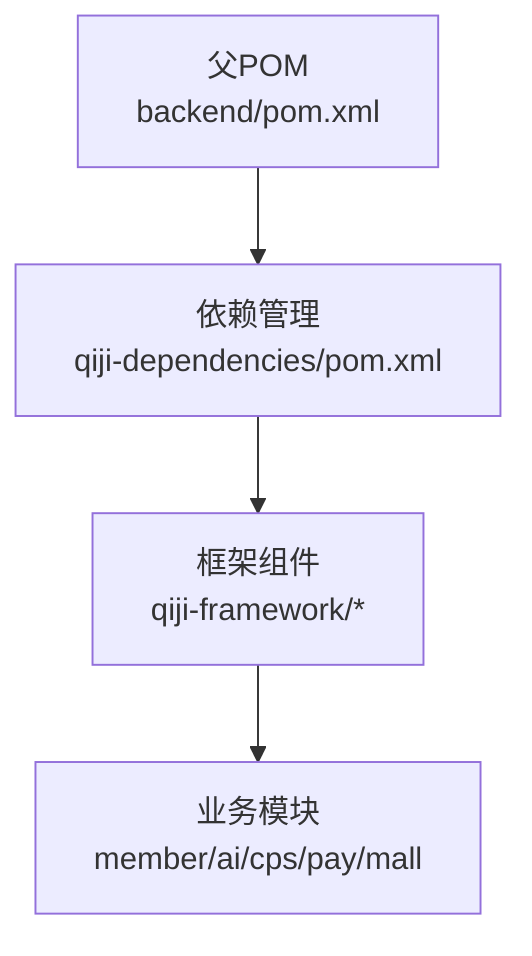

# 模块开发流程

<cite>
**本文引用的文件**
- [backend/pom.xml](file://backend/pom.xml)
- [backend/qiji-framework/pom.xml](file://backend/qiji-framework/pom.xml)
- [backend/qiji-framework/qiji-common/pom.xml](file://backend/qiji-framework/qiji-common/pom.xml)
- [backend/qiji-module-member/src/main/java/com/qiji/cps/module/member/package-info.java](file://backend/qiji-module-member/src/main/java/com/qiji/cps/module/member/package-info.java)
- [backend/qiji-module-ai/src/main/java/com/qiji/cps/module/ai/framework/ai/core/package-info.java](file://backend/qiji-module-ai/src/main/java/com/qiji/cps/module/ai/framework/ai/core/package-info.java)
- [backend/qiji-module-cps/qiji-module-cps-api/src/main/java/com/qiji/cps/module/cps/enums/CpsAdzoneTypeEnum.java](file://backend/qiji-module-cps/qiji-module-cps-api/src/main/java/com/qiji/cps/module/cps/enums/CpsAdzoneTypeEnum.java)
- [backend/qiji-module-cps/qiji-module-cps-biz/src/main/java/com/qiji/cps/module/cps/package-info.java](file://backend/qiji-module-cps/qiji-module-cps-biz/src/main/java/com/qiji/cps/module/cps/package-info.java)
- [backend/qiji-server/src/main/resources/application.yml](file://backend/qiji-server/src/main/resources/application.yml)
- [backend/script/docker/docker-compose.yml](file://backend/script/docker/docker-compose.yml)
- [backend/script/shell/deploy.sh](file://backend/script/shell/deploy.sh)
- [backend/sql/mysql/ruoyi-vue-pro.sql](file://backend/sql/mysql/ruoyi-vue-pro.sql)
- [backend/qiji-dependencies/pom.xml](file://backend/qiji-dependencies/pom.xml)
</cite>

## 目录
1. [引言](#引言)
2. [项目结构](#项目结构)
3. [核心组件](#核心组件)
4. [架构总览](#架构总览)
5. [详细组件分析](#详细组件分析)
6. [依赖分析](#依赖分析)
7. [性能考虑](#性能考虑)
8. [故障排查指南](#故障排查指南)
9. [结论](#结论)
10. [附录](#附录)

## 引言
本技术文档面向AgenticCPS项目的模块开发者，系统性阐述新模块从创建到上线的完整流程，涵盖Maven模块配置、pom.xml依赖管理、模块间依赖关系设计；Spring Bean注册机制与自动装配、循环依赖处理；模块架构设计原则（分层架构、接口设计、依赖注入最佳实践）；模块开发示例（创建业务模块、模块间通信、模块化测试）；以及模块部署配置、版本管理策略与模块生命周期管理的实操指导。

## 项目结构
AgenticCPS采用多模块Maven聚合工程，顶层父POM统一管理版本与插件，qiji-framework作为技术组件层，各业务模块位于独立子模块中，qiji-server作为应用打包入口。模块命名遵循清晰的业务域划分，如member、ai、cps、pay、mall等，便于职责边界与依赖控制。

图表来源
- [backend/pom.xml:10-25](file://backend/pom.xml#L10-L25)
- [backend/qiji-framework/pom.xml:12-31](file://backend/qiji-framework/pom.xml#L12-L31)

章节来源
- [backend/pom.xml:1-176](file://backend/pom.xml#L1-L176)
- [backend/qiji-framework/pom.xml:1-47](file://backend/qiji-framework/pom.xml#L1-L47)

## 核心组件
- 顶层聚合POM：集中管理版本号、插件、仓库镜像与模块列表，确保跨模块一致性。
- 框架聚合POM：将技术组件按“框架组件”和“业务组件”两类进行模块化封装，便于按需引入。
- 通用组件qiji-common：提供基础POJO、枚举、工具类与公共依赖，供其他模块复用。
- 业务模块：以领域为核心划分，如member、ai、cps、pay、mall等，各自包含controller、service、dal、enums、framework等层次化目录。

章节来源
- [backend/qiji-framework/qiji-common/pom.xml:18-147](file://backend/qiji-framework/qiji-common/pom.xml#L18-L147)
- [backend/qiji-module-member/src/main/java/com/qiji/cps/module/member/package-info.java:1-9](file://backend/qiji-module-member/src/main/java/com/qiji/cps/module/member/package-info.java#L1-L9)

## 架构总览
AgenticCPS采用分层架构与模块化设计：
- 分层架构：controller（接口层）、service（业务层）、dal（数据访问层）、framework（基础设施层）
- 模块边界：以业务域划分，模块间通过API模块或接口契约进行解耦
- 依赖方向：上层依赖下层，避免循环依赖；公共能力下沉至框架组件

## 详细组件分析

### Maven模块配置与依赖管理
- 父POM统一版本与插件：通过revision变量与flatten-maven-plugin统一版本，确保发布一致性。
- 框架组件按需聚合：qiji-framework将常用技术组件拆分为独立模块，业务模块仅引入所需组件。
- 依赖范围控制：qiji-common对非核心依赖设置provided作用域，降低传递依赖风险。
- 仓库镜像加速：内置华为云与阿里云Maven镜像，提升构建速度。

图表来源
- [backend/pom.xml:31-57](file://backend/pom.xml#L31-L57)
- [backend/qiji-framework/pom.xml:12-31](file://backend/qiji-framework/pom.xml#L12-L31)
- [backend/qiji-framework/qiji-common/pom.xml:18-147](file://backend/qiji-framework/qiji-common/pom.xml#L18-L147)

章节来源
- [backend/pom.xml:1-176](file://backend/pom.xml#L1-L176)
- [backend/qiji-framework/pom.xml:1-47](file://backend/qiji-framework/pom.xml#L1-L47)
- [backend/qiji-framework/qiji-common/pom.xml:1-150](file://backend/qiji-framework/qiji-common/pom.xml#L1-L150)

### Spring Bean注册机制与自动装配
- 注解使用规范：
  - @Component：通用组件扫描与注册
  - @Service：业务服务层组件
  - @Repository：数据访问层组件
- 自动装配：通过构造器注入或字段注入实现依赖注入，优先使用构造器注入保证不可变性与线程安全
- 循环依赖处理：尽量通过接口抽象与依赖倒置避免循环依赖；若不可避免，使用@Lazy或@PostConstruct延迟初始化

### 模块间依赖关系设计
- 依赖方向：上层模块依赖下层模块，避免跨层级依赖
- 接口契约：通过API模块或接口定义进行解耦，减少直接耦合
- 版本管理：统一由父POM管理，确保模块间版本一致

章节来源
- [backend/qiji-module-cps/qiji-module-cps-api/src/main/java/com/qiji/cps/module/cps/enums/CpsAdzoneTypeEnum.java](file://backend/qiji-module-cps/qiji-module-cps-api/src/main/java/com/qiji/cps/module/cps/enums/CpsAdzoneTypeEnum.java)
- [backend/qiji-module-cps/qiji-module-cps-biz/src/main/java/com/qiji/cps/module/cps/package-info.java](file://backend/qiji-module-cps/qiji-module-cps-biz/src/main/java/com/qiji/cps/module/cps/package-info.java)

### 模块架构设计原则
- 分层架构实现：controller/service/dal/framework清晰分层，职责单一
- 接口设计规范：对外暴露稳定接口，内部实现可演进
- 依赖注入最佳实践：构造器注入优先，避免静态状态，减少全局共享

章节来源
- [backend/qiji-module-member/src/main/java/com/qiji/cps/module/member/package-info.java:1-9](file://backend/qiji-module-member/src/main/java/com/qiji/cps/module/member/package-info.java#L1-L9)
- [backend/qiji-module-ai/src/main/java/com/qiji/cps/module/ai/framework/ai/core/package-info.java](file://backend/qiji-module-ai/src/main/java/com/qiji/cps/module/ai/framework/ai/core/package-info.java)

### 模块开发具体示例
- 创建新的业务模块步骤：
  1) 在根POM中新增模块声明
  2) 在qiji-framework中创建对应技术组件（如starter）
  3) 在业务模块中建立controller/service/dal/framework目录
  4) 通过API模块定义对外接口契约
  5) 配置模块间依赖与版本管理
- 模块间通信：
  - 通过HTTP接口或消息队列进行异步通信
  - 使用统一的DTO/VO与枚举进行数据契约约定
- 模块化测试：
  - 使用qiji-spring-boot-starter-test提供的测试能力
  - 针对service层编写单元测试，针对controller层编写集成测试

章节来源
- [backend/pom.xml:10-25](file://backend/pom.xml#L10-L25)
- [backend/qiji-framework/pom.xml:12-31](file://backend/qiji-framework/pom.xml#L12-L31)

### 模块部署配置
- 应用配置：qiji-server中的application.yml用于环境配置与参数管理
- 容器编排：docker-compose.yml定义容器编排与网络配置
- 部署脚本：deploy.sh提供一键部署流程

图表来源
- [backend/qiji-server/src/main/resources/application.yml](file://backend/qiji-server/src/main/resources/application.yml)
- [backend/script/docker/docker-compose.yml](file://backend/script/docker/docker-compose.yml)
- [backend/script/shell/deploy.sh](file://backend/script/shell/deploy.sh)

章节来源
- [backend/qiji-server/src/main/resources/application.yml](file://backend/qiji-server/src/main/resources/application.yml)
- [backend/script/docker/docker-compose.yml](file://backend/script/docker/docker-compose.yml)
- [backend/script/shell/deploy.sh](file://backend/script/shell/deploy.sh)

### 版本管理策略
- 使用Maven版本号与flatten插件统一版本，避免版本漂移
- 依赖版本通过qiji-dependencies统一管理，确保模块间一致性

章节来源
- [backend/pom.xml:31-57](file://backend/pom.xml#L31-L57)
- [backend/qiji-dependencies/pom.xml](file://backend/qiji-dependencies/pom.xml)

### 模块生命周期管理
- 开发阶段：本地IDE调试、单元测试、集成测试
- 构建阶段：Maven构建、代码检查、打包
- 发布阶段：镜像构建、推送、部署
- 运维阶段：监控、日志、回滚

章节来源
- [backend/pom.xml:114-142](file://backend/pom.xml#L114-L142)

## 依赖分析
- 顶层依赖：通过qiji-dependencies集中管理第三方依赖版本
- 框架组件：按功能拆分，业务模块按需引入
- 传递依赖：通过provided作用域控制，避免不必要的传递

图表来源
- [backend/pom.xml:47-57](file://backend/pom.xml#L47-L57)
- [backend/qiji-dependencies/pom.xml](file://backend/qiji-dependencies/pom.xml)

章节来源
- [backend/pom.xml:47-57](file://backend/pom.xml#L47-L57)
- [backend/qiji-dependencies/pom.xml](file://backend/qiji-dependencies/pom.xml)

## 性能考虑
- 构建性能：启用镜像仓库与并行构建，减少依赖下载时间
- 运行性能：合理拆分模块，避免过度耦合导致的启动与运行时开销
- 监控与可观测性：通过监控启动器与链路追踪组件提升问题定位效率

## 故障排查指南
- 构建失败：检查父POM版本与插件配置是否一致
- 依赖冲突：通过dependencyManagement统一版本，避免传递依赖冲突
- 部署异常：核对docker-compose与部署脚本中的环境变量与端口映射

章节来源
- [backend/pom.xml:144-173](file://backend/pom.xml#L144-L173)
- [backend/script/docker/docker-compose.yml](file://backend/script/docker/docker-compose.yml)

## 结论
通过统一的Maven多模块架构、清晰的分层设计与严格的依赖管理，AgenticCPS实现了高内聚、低耦合的模块化体系。遵循本文档的开发流程与最佳实践，可高效地创建与维护新模块，并确保其在开发、构建、部署与运维全生命周期的稳定性与可扩展性。

## 附录
- 数据库初始化：参考sql脚本进行数据库初始化与表结构准备
- 环境准备：确保JDK版本与Maven版本满足项目要求

章节来源
- [backend/sql/mysql/ruoyi-vue-pro.sql](file://backend/sql/mysql/ruoyi-vue-pro.sql)