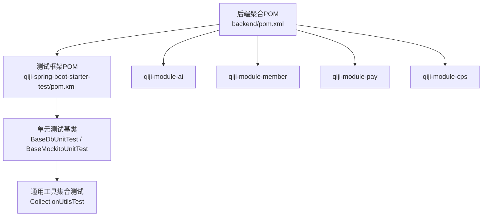
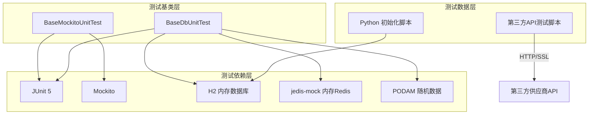
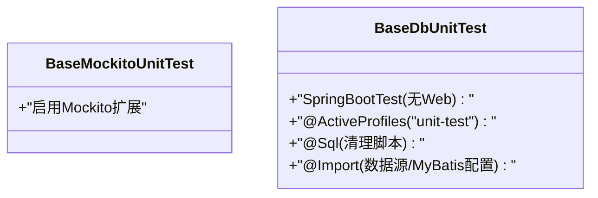
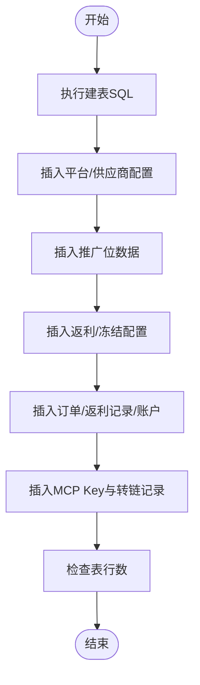
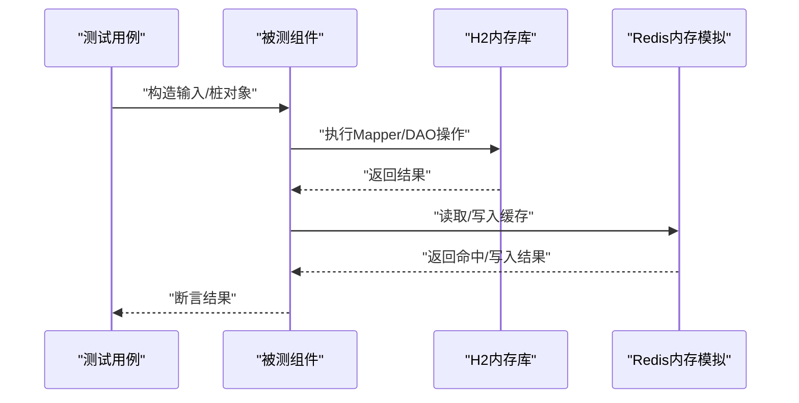
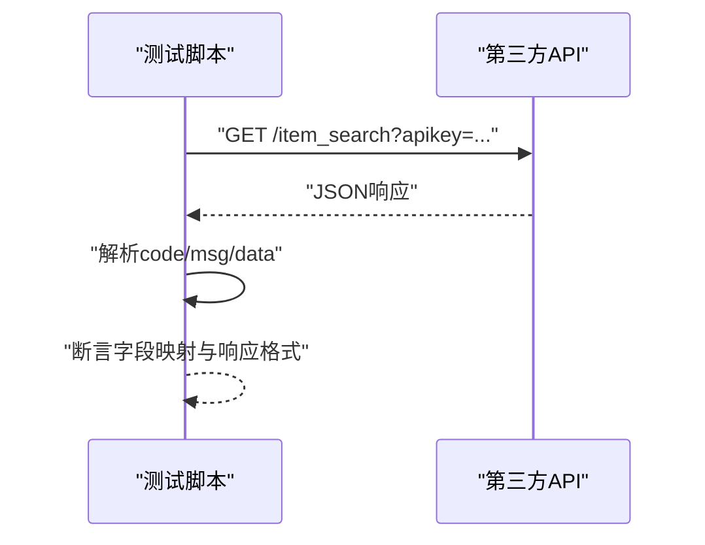
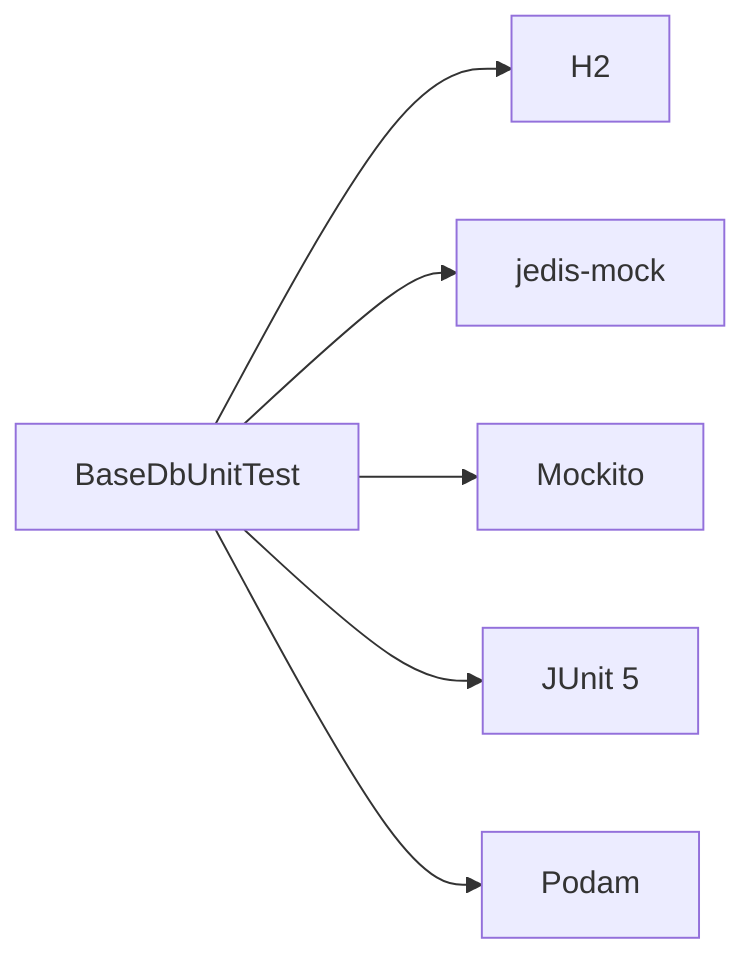

# 测试用例编写

<cite>
**本文引用的文件**   
- [后端聚合POM](file://backend/pom.xml)
- [测试框架POM](file://backend/qiji-framework/qiji-spring-boot-starter-test/pom.xml)
- [测试基类：纯Mockito单元测试](file://backend/qiji-framework/qiji-spring-boot-starter-test/src/main/java/com/qiji/cps/framework/test/core/ut/BaseMockitoUnitTest.java)
- [测试基类：依赖内存DB的单元测试](file://backend/qiji-framework/qiji-spring-boot-starter-test/src/main/java/com/qiji/cps/framework/test/core/ut/BaseDbUnitTest.java)
- [通用工具集合测试](file://backend/qiji-framework/qiji-common/src/test/java/com/qiji/cps/framework/common/util/collection/CollectionUtilsTest.java)
- [CPS测试数据初始化脚本](file://script/test/init_cps_test_data.py)
- [好单库API测试脚本](file://script/test/test_hdk_api.py)
- [后端根POM](file://backend/pom.xml)
</cite>

## 目录
1. [引言](#引言)
2. [项目结构](#项目结构)
3. [核心组件](#核心组件)
4. [架构总览](#架构总览)
5. [详细组件分析](#详细组件分析)
6. [依赖分析](#依赖分析)
7. [性能考虑](#性能考虑)
8. [故障排查指南](#故障排查指南)
9. [结论](#结论)
10. [附录](#附录)

## 引言
本指导文档面向AgenticCPS项目的测试用例编写，围绕单元测试与集成测试两大维度，结合项目现有测试基础设施，给出可落地的规范与最佳实践。内容涵盖：
- 单元测试规范：JUnit 5使用、Mockito模拟对象、测试数据准备
- 集成测试设计：Spring Boot Test配置、数据库测试、外部服务模拟
- Mock数据管理：测试数据生成、数据清理、测试环境隔离
- 测试覆盖率：覆盖率工具使用、关键路径与边界条件测试
- API接口测试：REST Assured使用、响应验证、性能测试
- 测试自动化：CI/CD集成、自动化测试脚本、测试报告生成

## 项目结构
AgenticCPS采用多模块Maven聚合工程，测试相关能力主要由“qiji-spring-boot-starter-test”测试框架提供，并在各业务模块中以继承统一基类的方式落地。

图表来源
- [后端聚合POM:1-176](file://backend/pom.xml#L1-L176)
- [测试框架POM:1-61](file://backend/qiji-framework/qiji-spring-boot-starter-test/pom.xml#L1-L61)

章节来源
- [后端聚合POM:1-176](file://backend/pom.xml#L1-L176)
- [测试框架POM:1-61](file://backend/qiji-framework/qiji-spring-boot-starter-test/pom.xml#L1-L61)

## 核心组件
- 测试基类体系
  - BaseMockitoUnitTest：基于JUnit 5 + Mockito扩展的纯Mock单元测试基类，适用于不依赖数据库或外部系统的纯逻辑测试。
  - BaseDbUnitTest：基于Spring Boot Test + H2内存数据库的单元测试基类，适用于需要访问Mapper/DAO的场景；同时支持Redis内存模拟。
- 测试依赖与工具
  - JUnit 5：统一测试引擎，配合Surefire插件运行。
  - Mockito：用于桩对象与行为模拟。
  - H2：内存数据库，快速回滚与隔离。
  - jedis-mock：内存Redis模拟，避免真实缓存干扰。
  - podam：POJO随机填充，辅助构造测试数据。
- 测试数据准备
  - Python脚本：一键初始化CPS测试数据，含建表、平台/供应商配置、推广位、返利/冻结配置、订单/返利记录、账户、MCP Key与转链记录。
  - API测试脚本：对第三方供应商接口进行连通性与字段映射验证。

章节来源
- [测试基类：纯Mockito单元测试:1-14](file://backend/qiji-framework/qiji-spring-boot-starter-test/src/main/java/com/qiji/cps/framework/test/core/ut/BaseMockitoUnitTest.java#L1-L14)
- [测试基类：依赖内存DB的单元测试:1-48](file://backend/qiji-framework/qiji-spring-boot-starter-test/src/main/java/com/qiji/cps/framework/test/core/ut/BaseDbUnitTest.java#L1-L48)
- [测试框架POM:1-61](file://backend/qiji-framework/qiji-spring-boot-starter-test/pom.xml#L1-L61)
- [CPS测试数据初始化脚本:1-413](file://script/test/init_cps_test_data.py#L1-L413)
- [好单库API测试脚本:1-205](file://script/test/test_hdk_api.py#L1-L205)

## 架构总览
测试架构围绕“基类抽象 + 内存数据库/缓存 + 外部服务模拟”的思路构建，确保单元测试快速、稳定、可重复。

图表来源
- [测试基类：纯Mockito单元测试:1-14](file://backend/qiji-framework/qiji-spring-boot-starter-test/src/main/java/com/qiji/cps/framework/test/core/ut/BaseMockitoUnitTest.java#L1-L14)
- [测试基类：依赖内存DB的单元测试:1-48](file://backend/qiji-framework/qiji-spring-boot-starter-test/src/main/java/com/qiji/cps/framework/test/core/ut/BaseDbUnitTest.java#L1-L48)
- [测试框架POM:1-61](file://backend/qiji-framework/qiji-spring-boot-starter-test/pom.xml#L1-L61)
- [CPS测试数据初始化脚本:1-413](file://script/test/init_cps_test_data.py#L1-L413)
- [好单库API测试脚本:1-205](file://script/test/test_hdk_api.py#L1-L205)

## 详细组件分析

### 单元测试基类与规范
- BaseMockitoUnitTest
  - 作用：为纯逻辑单元测试提供Mockito扩展，无需启动Spring容器，适合纯函数/工具类/简单服务层。
  - 使用建议：仅对直接依赖的对象进行桩，避免过度Mock导致测试脆弱。
- BaseDbUnitTest
  - 作用：加载最小化Spring上下文，引入内存数据库与Redis模拟，支持SQL清理脚本。
  - 关键点：
    - 使用@ActiveProfiles激活测试配置文件
    - 使用@Sql在测试结束后自动清理数据
    - 通过@Import引入数据源、MyBatis、Join等配置类
  - 适用范围：涉及Mapper/DAO的单元测试；跨模块调用建议对被测模块外的Service进行Mock。

图表来源
- [测试基类：纯Mockito单元测试:1-14](file://backend/qiji-framework/qiji-spring-boot-starter-test/src/main/java/com/qiji/cps/framework/test/core/ut/BaseMockitoUnitTest.java#L1-L14)
- [测试基类：依赖内存DB的单元测试:1-48](file://backend/qiji-framework/qiji-spring-boot-starter-test/src/main/java/com/qiji/cps/framework/test/core/ut/BaseDbUnitTest.java#L1-L48)

章节来源
- [测试基类：纯Mockito单元测试:1-14](file://backend/qiji-framework/qiji-spring-boot-starter-test/src/main/java/com/qiji/cps/framework/test/core/ut/BaseMockitoUnitTest.java#L1-L14)
- [测试基类：依赖内存DB的单元测试:1-48](file://backend/qiji-framework/qiji-spring-boot-starter-test/src/main/java/com/qiji/cps/framework/test/core/ut/BaseDbUnitTest.java#L1-L48)

### 测试数据准备与管理
- Python初始化脚本
  - 功能：按步骤执行建表、平台/供应商配置、推广位、返利/冻结配置、订单/返利记录、账户、MCP Key与转链记录。
  - 优点：一次性准备全量测试数据，便于集成测试与端到端验证。
  - 注意：脚本内置异常处理与回滚，确保失败时不影响生产数据。
- API测试脚本
  - 功能：对第三方供应商接口进行连通性与字段映射验证，支持多域名/路径尝试与超时控制。
  - 优点：快速验证外部接口可用性与响应稳定性。
- 数据清理
  - 建议：在单元测试中使用@Sql清理脚本；在集成测试中使用初始化脚本前先清空目标表空间。

图表来源
- [CPS测试数据初始化脚本:1-413](file://script/test/init_cps_test_data.py#L1-L413)

章节来源
- [CPS测试数据初始化脚本:1-413](file://script/test/init_cps_test_data.py#L1-L413)
- [好单库API测试脚本:1-205](file://script/test/test_hdk_api.py#L1-L205)

### 集成测试设计
- Spring Boot Test配置要点
  - Web环境：BaseDbUnitTest禁用Web环境，如需控制器测试可切换至Web测试配置。
  - Profile：使用unit-test配置文件，隔离开发与测试配置。
  - SQL清理：每个测试方法结束后执行清理脚本，保证测试隔离。
- 数据库测试
  - 内存数据库：H2内存库，速度快、可回滚。
  - 跨模块调用：对非被测模块的Service进行Mock，聚焦被测模块内部逻辑。
- 外部服务模拟
  - 对第三方供应商接口，优先使用本地Mock或占位实现，必要时使用API测试脚本验证连通性。

图表来源
- [测试基类：依赖内存DB的单元测试:1-48](file://backend/qiji-framework/qiji-spring-boot-starter-test/src/main/java/com/qiji/cps/framework/test/core/ut/BaseDbUnitTest.java#L1-L48)
- [测试框架POM:1-61](file://backend/qiji-framework/qiji-spring-boot-starter-test/pom.xml#L1-L61)

章节来源
- [测试基类：依赖内存DB的单元测试:1-48](file://backend/qiji-framework/qiji-spring-boot-starter-test/src/main/java/com/qiji/cps/framework/test/core/ut/BaseDbUnitTest.java#L1-L48)
- [测试框架POM:1-61](file://backend/qiji-framework/qiji-spring-boot-starter-test/pom.xml#L1-L61)

### API接口测试方法
- HTTP客户端与响应验证
  - 使用标准HTTP库发起GET请求，设置User-Agent与Accept头，忽略SSL证书验证（仅测试环境）。
  - 解析JSON响应，断言code字段与关键字段存在性与类型。
- 性能测试
  - 记录请求耗时，输出响应长度，便于对比不同域名/路径的性能差异。
- 第三方接口适配
  - 支持多种路径变体，自动尝试可用路径，提升测试鲁棒性。

图表来源
- [好单库API测试脚本:1-205](file://script/test/test_hdk_api.py#L1-L205)

章节来源
- [好单库API测试脚本:1-205](file://script/test/test_hdk_api.py#L1-L205)

### 测试覆盖率与关键路径
- 覆盖率工具
  - 建议使用JaCoCo或类似工具在CI中统计覆盖率，结合Maven Surefire插件运行测试。
- 关键路径测试
  - 包含正常流程、异常分支、边界值（空值、极值、非法输入）。
- 边界条件测试
  - 如空集合、空字符串、零值、负数、超长字符串等，确保健壮性。

章节来源
- [后端聚合POM:62-68](file://backend/pom.xml#L62-L68)

### 测试自动化配置
- CI/CD集成
  - 在流水线中执行mvn test，确保JUnit 5与Surefire插件正确运行。
  - 建议在CI中执行Python初始化脚本，准备测试数据库与缓存数据。
- 自动化测试脚本
  - 将API测试脚本纳入CI定时任务，监控第三方接口可用性。
- 测试报告生成
  - 使用Surefire报告与覆盖率报告，结合CI制品库归档。

章节来源
- [后端聚合POM:62-68](file://backend/pom.xml#L62-L68)
- [CPS测试数据初始化脚本:1-413](file://script/test/init_cps_test_data.py#L1-L413)
- [好单库API测试脚本:1-205](file://script/test/test_hdk_api.py#L1-L205)

## 依赖分析
测试相关依赖集中在测试框架模块，核心包括：
- JUnit 5：测试引擎
- Mockito：桩与行为模拟
- H2：内存数据库
- jedis-mock：内存Redis
- podam：随机数据生成

图表来源
- [测试框架POM:1-61](file://backend/qiji-framework/qiji-spring-boot-starter-test/pom.xml#L1-L61)

章节来源
- [测试框架POM:1-61](file://backend/qiji-framework/qiji-spring-boot-starter-test/pom.xml#L1-L61)

## 性能考虑
- 单元测试优先：通过内存数据库与Mock减少IO开销。
- API测试限流：对外部接口设置合理超时与重试策略，避免阻塞测试。
- 清理策略：测试结束后立即清理，避免数据膨胀影响后续测试。

## 故障排查指南
- 数据库初始化失败
  - 检查数据库连接参数与权限；确认初始化脚本路径与编码。
- 测试数据污染
  - 确认@Sql清理脚本是否生效；检查测试Profile是否正确加载。
- 外部接口不稳定
  - 使用API测试脚本验证连通性；记录响应时间与错误码以便定位。

章节来源
- [CPS测试数据初始化脚本:1-413](file://script/test/init_cps_test_data.py#L1-L413)
- [好单库API测试脚本:1-205](file://script/test/test_hdk_api.py#L1-L205)

## 结论
通过统一的测试基类、内存数据库与Mock策略，AgenticCPS能够高效地编写高质量的单元与集成测试。配合Python初始化脚本与第三方API测试脚本，可实现从数据到接口的全链路验证。建议在CI中持续运行测试与覆盖率统计，确保代码质量与交付效率。

## 附录
- 示例参考
  - 通用工具集合测试：展示如何使用JUnit 5断言与构造测试数据。
- 最佳实践清单
  - 单元测试：优先Mock外部依赖；关注关键路径与边界条件。
  - 集成测试：使用内存数据库；每个测试后清理数据。
  - API测试：记录耗时与字段映射；多路径/域名容错。
  - 覆盖率：在CI中统计并设定阈值；定期回顾未覆盖区域。

章节来源
- [通用工具集合测试:1-65](file://backend/qiji-framework/qiji-common/src/test/java/com/qiji/cps/framework/common/util/collection/CollectionUtilsTest.java#L1-L65)