# 第三方平台接入

<cite>
**本文引用的文件**   
- [CpsPlatformClient.java](file://backend/qiji-module-cps/qiji-module-cps-biz/src/main/java/com/qiji/cps/module/cps/client/CpsPlatformClient.java)
- [CpsApiVendorClient.java](file://backend/qiji-module-cps/qiji-module-cps-biz/src/main/java/com/qiji/cps/module/cps/client/CpsApiVendorClient.java)
- [CpsPlatformClientFactory.java](file://backend/qiji-module-cps/qiji-module-cps-biz/src/main/java/com/qiji/cps/module/cps/client/CpsPlatformClientFactory.java)
- [CpsPlatformClientFactoryTest.java](file://backend/qiji-module-cps/qiji-module-cps-biz/src/test/java/com/qiji/cps/module/cps/client/CpsPlatformClientFactoryTest.java)
- [CpsVendorConfig.java](file://backend/qiji-module-cps/qiji-module-cps-biz/src/main/java/com/qiji/cps/module/cps/client/dto/CpsVendorConfig.java)
- [CpsGoodsSearchRequest.java](file://backend/qiji-module-cps/qiji-module-cps-biz/src/main/java/com/qiji/cps/module/cps/client/dto/CpsGoodsSearchRequest.java)
- [CpsPlatformCodeEnum.java](file://backend/qiji-module-cps/qiji-module-cps-api/src/main/java/com/qiji/cps/module/cps/enums/CpsPlatformCodeEnum.java)
- [CpsErrorCodeConstants.java](file://backend/qiji-module-cps/qiji-module-cps-api/src/main/java/com/qiji/cps/module/cps/enums/CpsErrorCodeConstants.java)
- [index.vue](file://frontend/admin-vue3/src/views/cps/platform/index.vue)
- [platform.ts](file://frontend/admin-vue3/src/api/cps/platform.ts)
- [WebUtils.java](file://agent_improvement/sdk_demo/dataoke-sdk-java/src/main/java/com/dtk/api/http/WebUtils.java)
- [Logger.java](file://agent_improvement/sdk_demo/dataoke-sdk-java/src/main/java/com/dtk/api/http/Logger.java)
- [CacheUtils.java](file://backend/qiji-framework/qiji-common/src/main/java/com/qiji/cps/framework/common/util/cache/CacheUtils.java)
- [useNetwork.ts](file://frontend/admin-vue3/src/hooks/web/useNetwork.ts)
- [error.vue](file://frontend/mall-uniapp/pages/public/error.vue)
- [service.ts](file://frontend/admin-vue3/src/config/axios/service.ts)
- [index.js](file://frontend/mall-uniapp/sheep/request/index.js)
</cite>

## 目录
1. [简介](#简介)
2. [项目结构](#项目结构)
3. [核心组件](#核心组件)
4. [架构总览](#架构总览)
5. [详细组件分析](#详细组件分析)
6. [依赖分析](#依赖分析)
7. [性能考虑](#性能考虑)
8. [故障排查指南](#故障排查指南)
9. [结论](#结论)
10. [附录](#附录)

## 简介
本指南面向需要为 AgenticCPS 接入第三方平台（电商联盟/聚合平台）的开发者，围绕平台适配器开发、策略与工厂模式、Spring Bean 注册与管理、API 文档解析、错误处理与重试、性能优化以及平台注册流程展开。文档同时提供新增平台接入的完整步骤与最佳实践，帮助快速、安全、稳定地完成对接。

## 项目结构
- 后端模块
  - qiji-module-cps-api：平台枚举、错误码等公共定义
  - qiji-module-cps-biz：平台适配器接口与工厂、DTO、业务服务
  - qiji-framework：通用能力（如缓存工具）
- 前端模块
  - admin-vue3：平台配置管理界面与 API 封装
  - mall-uniapp：移动端错误页面与请求封装
- SDK 示例
  - dataoke-sdk-java：第三方平台 SDK 的网络与日志实现，可复用其网络与异常处理思路

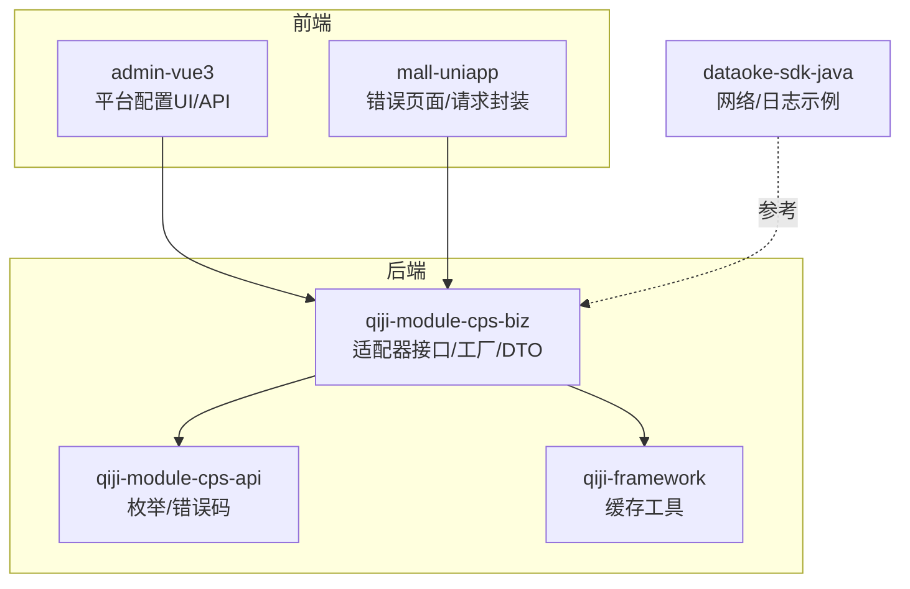

**图示来源**
- [CpsPlatformClient.java:1-55](file://backend/qiji-module-cps/qiji-module-cps-biz/src/main/java/com/qiji/cps/module/cps/client/CpsPlatformClient.java#L1-L55)
- [CpsPlatformClientFactory.java:1-139](file://backend/qiji-module-cps/qiji-module-cps-biz/src/main/java/com/qiji/cps/module/cps/client/CpsPlatformClientFactory.java#L1-L139)
- [CpsPlatformCodeEnum.java:1-47](file://backend/qiji-module-cps/qiji-module-cps-api/src/main/java/com/qiji/cps/module/cps/enums/CpsPlatformCodeEnum.java#L1-L47)
- [index.vue:315-369](file://frontend/admin-vue3/src/views/cps/platform/index.vue#L315-L369)
- [platform.ts:1-59](file://frontend/admin-vue3/src/api/cps/platform.ts#L1-L59)
- [CacheUtils.java:1-61](file://backend/qiji-framework/qiji-common/src/main/java/com/qiji/cps/framework/common/util/cache/CacheUtils.java#L1-L61)

**章节来源**
- [CpsPlatformClient.java:1-55](file://backend/qiji-module-cps/qiji-module-cps-biz/src/main/java/com/qiji/cps/module/cps/client/CpsPlatformClient.java#L1-L55)
- [CpsPlatformClientFactory.java:1-139](file://backend/qiji-module-cps/qiji-module-cps-biz/src/main/java/com/qiji/cps/module/cps/client/CpsPlatformClientFactory.java#L1-L139)
- [CpsPlatformCodeEnum.java:1-47](file://backend/qiji-module-cps/qiji-module-cps-api/src/main/java/com/qiji/cps/module/cps/enums/CpsPlatformCodeEnum.java#L1-L47)
- [index.vue:315-369](file://frontend/admin-vue3/src/views/cps/platform/index.vue#L315-L369)
- [platform.ts:1-59](file://frontend/admin-vue3/src/api/cps/platform.ts#L1-L59)
- [CacheUtils.java:1-61](file://backend/qiji-framework/qiji-common/src/main/java/com/qiji/cps/framework/common/util/cache/CacheUtils.java#L1-L61)

## 核心组件
- 平台适配器接口：CpsPlatformClient，定义按平台抽象的能力（搜索商品、生成推广链接、查询订单、测试连接）
- 供应商适配器接口：CpsApiVendorClient，定义按供应商×平台双维度抽象的能力
- 工厂与注册：CpsPlatformClientFactory，基于 Spring Bean 自动注册与路由，支持平台与供应商双维度
- 配置 DTO：CpsVendorConfig，承载供应商配置（appKey/appSecret/apiBaseUrl/defaultAdzoneId 等）
- 平台枚举与错误码：CpsPlatformCodeEnum、CpsErrorCodeConstants，统一平台编码与错误语义
- 前端平台配置：index.vue + platform.ts，提供平台配置的增删改查与测试连接入口

**章节来源**
- [CpsPlatformClient.java:14-54](file://backend/qiji-module-cps/qiji-module-cps-biz/src/main/java/com/qiji/cps/module/cps/client/CpsPlatformClient.java#L14-L54)
- [CpsApiVendorClient.java:25-83](file://backend/qiji-module-cps/qiji-module-cps-biz/src/main/java/com/qiji/cps/module/cps/client/CpsApiVendorClient.java#L25-L83)
- [CpsPlatformClientFactory.java:30-132](file://backend/qiji-module-cps/qiji-module-cps-biz/src/main/java/com/qiji/cps/module/cps/client/CpsPlatformClientFactory.java#L30-L132)
- [CpsVendorConfig.java:16-65](file://backend/qiji-module-cps/qiji-module-cps-biz/src/main/java/com/qiji/cps/module/cps/client/dto/CpsVendorConfig.java#L16-L65)
- [CpsPlatformCodeEnum.java:14-46](file://backend/qiji-module-cps/qiji-module-cps-api/src/main/java/com/qiji/cps/module/cps/enums/CpsPlatformCodeEnum.java#L14-L46)
- [CpsErrorCodeConstants.java:10-68](file://backend/qiji-module-cps/qiji-module-cps-api/src/main/java/com/qiji/cps/module/cps/enums/CpsErrorCodeConstants.java#L10-L68)
- [index.vue:315-369](file://frontend/admin-vue3/src/views/cps/platform/index.vue#L315-L369)
- [platform.ts:51-59](file://frontend/admin-vue3/src/api/cps/platform.ts#L51-L59)

## 架构总览
AgenticCPS 采用“策略模式 + 工厂 + Spring Bean 注册”的架构：
- 开发者实现 CpsPlatformClient 或 CpsApiVendorClient 接口，即可自动被工厂注册并按平台或供应商×平台路由
- 业务层通过平台编码调用适配器；底层通过供应商配置驱动具体实现
- 前端提供平台配置与测试连接 UI，后端通过工厂与服务层协同完成路由与执行

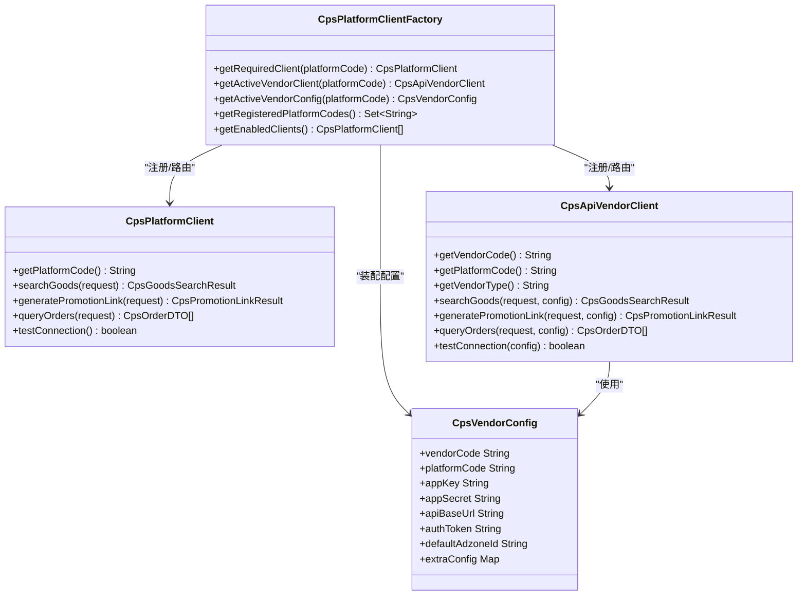

**图示来源**
- [CpsPlatformClient.java:14-54](file://backend/qiji-module-cps/qiji-module-cps-biz/src/main/java/com/qiji/cps/module/cps/client/CpsPlatformClient.java#L14-L54)
- [CpsApiVendorClient.java:25-83](file://backend/qiji-module-cps/qiji-module-cps-biz/src/main/java/com/qiji/cps/module/cps/client/CpsApiVendorClient.java#L25-L83)
- [CpsPlatformClientFactory.java:30-132](file://backend/qiji-module-cps/qiji-module-cps-biz/src/main/java/com/qiji/cps/module/cps/client/CpsPlatformClientFactory.java#L30-L132)
- [CpsVendorConfig.java:16-65](file://backend/qiji-module-cps/qiji-module-cps-biz/src/main/java/com/qiji/cps/module/cps/client/dto/CpsVendorConfig.java#L16-L65)

## 详细组件分析

### 平台适配器接口与策略模式
- CpsPlatformClient 抽象平台能力，getPlatformCode 返回平台编码（如 taobao/jd），业务层以该编码路由到具体实现
- 新平台接入只需实现该接口并声明为 Spring Bean，无需改动工厂与路由逻辑，符合开放-封闭原则

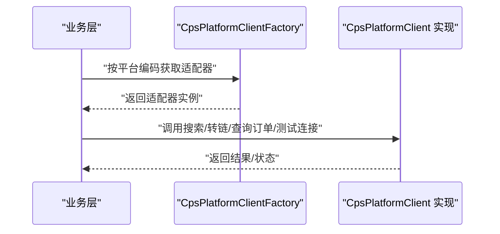

**图示来源**
- [CpsPlatformClient.java:14-54](file://backend/qiji-module-cps/qiji-module-cps-biz/src/main/java/com/qiji/cps/module/cps/client/CpsPlatformClient.java#L14-L54)
- [CpsPlatformClientFactory.java:104-110](file://backend/qiji-module-cps/qiji-module-cps-biz/src/main/java/com/qiji/cps/module/cps/client/CpsPlatformClientFactory.java#L104-L110)

**章节来源**
- [CpsPlatformClient.java:14-54](file://backend/qiji-module-cps/qiji-module-cps-biz/src/main/java/com/qiji/cps/module/cps/client/CpsPlatformClient.java#L14-L54)
- [CpsPlatformClientFactory.java:104-110](file://backend/qiji-module-cps/qiji-module-cps-biz/src/main/java/com/qiji/cps/module/cps/client/CpsPlatformClientFactory.java#L104-L110)

### 供应商适配器接口与双维度路由
- CpsApiVendorClient 抽象“供应商×平台”的能力，getVendorCode+getPlatformCode 作为双维度键
- 工厂支持按平台获取活动供应商客户端与配置，实现“同一平台对接多个供应商”的灵活扩展

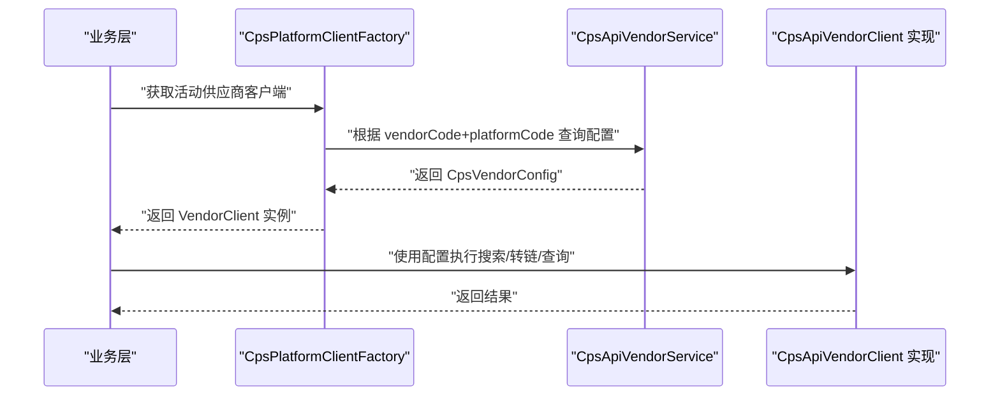

**图示来源**
- [CpsPlatformClientFactory.java:134-139](file://backend/qiji-module-cps/qiji-module-cps-biz/src/main/java/com/qiji/cps/module/cps/client/CpsPlatformClientFactory.java#L134-L139)
- [CpsApiVendorClient.java:25-83](file://backend/qiji-module-cps/qiji-module-cps-biz/src/main/java/com/qiji/cps/module/cps/client/CpsApiVendorClient.java#L25-L83)
- [CpsVendorConfig.java:16-65](file://backend/qiji-module-cps/qiji-module-cps-biz/src/main/java/com/qiji/cps/module/cps/client/dto/CpsVendorConfig.java#L16-L65)

**章节来源**
- [CpsPlatformClientFactory.java:134-139](file://backend/qiji-module-cps/qiji-module-cps-biz/src/main/java/com/qiji/cps/module/cps/client/CpsPlatformClientFactory.java#L134-L139)
- [CpsApiVendorClient.java:25-83](file://backend/qiji-module-cps/qiji-module-cps-biz/src/main/java/com/qiji/cps/module/cps/client/CpsApiVendorClient.java#L25-L83)
- [CpsVendorConfig.java:16-65](file://backend/qiji-module-cps/qiji-module-cps-biz/src/main/java/com/qiji/cps/module/cps/client/dto/CpsVendorConfig.java#L16-L65)

### Spring Bean 注册与工厂初始化
- 工厂通过 @PostConstruct 初始化，扫描所有 CpsPlatformClient 与 CpsApiVendorClient 实现，自动注册到内存映射表
- 支持按平台编码获取已启用客户端列表，结合平台服务过滤状态

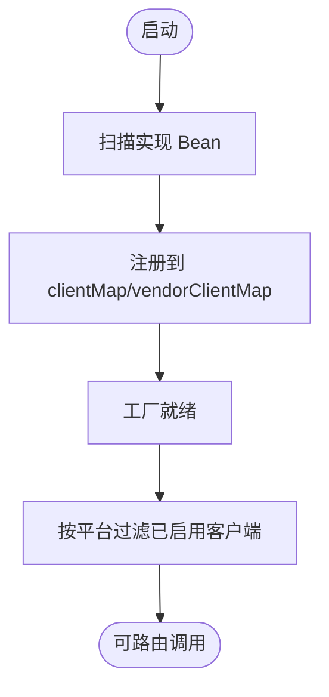

**图示来源**
- [CpsPlatformClientFactory.java:60-69](file://backend/qiji-module-cps/qiji-module-cps-biz/src/main/java/com/qiji/cps/module/cps/client/CpsPlatformClientFactory.java#L60-L69)
- [CpsPlatformClientFactory.java:126-132](file://backend/qiji-module-cps/qiji-module-cps-biz/src/main/java/com/qiji/cps/module/cps/client/CpsPlatformClientFactory.java#L126-L132)

**章节来源**
- [CpsPlatformClientFactory.java:60-69](file://backend/qiji-module-cps/qiji-module-cps-biz/src/main/java/com/qiji/cps/module/cps/client/CpsPlatformClientFactory.java#L60-L69)
- [CpsPlatformClientFactory.java:126-132](file://backend/qiji-module-cps/qiji-module-cps-biz/src/main/java/com/qiji/cps/module/cps/client/CpsPlatformClientFactory.java#L126-L132)

### API 文档解析与参数提取
- 平台接口参数与响应结构通过 DTO 与枚举统一定义，避免硬编码
- 前端平台配置 VO 与后端保存 VO 明确字段含义，便于接口契约约束
- SDK 示例中的 WebUtils/Logger 展示了网络请求与错误日志的参考实现，可用于对接第三方平台

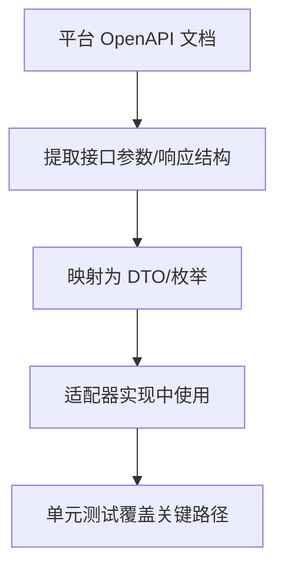

**图示来源**
- [CpsGoodsSearchRequest.java:12-60](file://backend/qiji-module-cps/qiji-module-cps-biz/src/main/java/com/qiji/cps/module/cps/client/dto/CpsGoodsSearchRequest.java#L12-L60)
- [platform.ts:4-39](file://frontend/admin-vue3/src/api/cps/platform.ts#L4-L39)
- [WebUtils.java:151-187](file://agent_improvement/sdk_demo/dataoke-sdk-java/src/main/java/com/dtk/api/http/WebUtils.java#L151-L187)
- [Logger.java:45-194](file://agent_improvement/sdk_demo/dataoke-sdk-java/src/main/java/com/dtk/api/http/Logger.java#L45-L194)

**章节来源**
- [CpsGoodsSearchRequest.java:12-60](file://backend/qiji-module-cps/qiji-module-cps-biz/src/main/java/com/qiji/cps/module/cps/client/dto/CpsGoodsSearchRequest.java#L12-L60)
- [platform.ts:4-39](file://frontend/admin-vue3/src/api/cps/platform.ts#L4-L39)
- [WebUtils.java:151-187](file://agent_improvement/sdk_demo/dataoke-sdk-java/src/main/java/com/dtk/api/http/WebUtils.java#L151-L187)
- [Logger.java:45-194](file://agent_improvement/sdk_demo/dataoke-sdk-java/src/main/java/com/dtk/api/http/Logger.java#L45-L194)

### 错误处理机制
- 后端错误码集中定义于 CpsErrorCodeConstants，便于统一映射与前端展示
- 前端请求封装与移动端请求封装对常见 HTTP 状态码与网络错误进行分类处理
- SDK 日志组件记录通信错误，便于定位问题

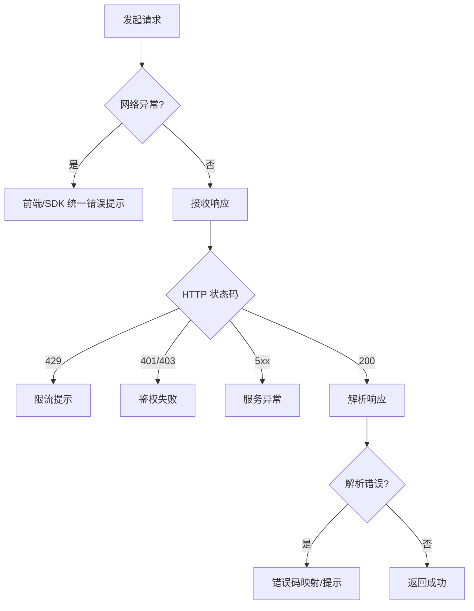

**图示来源**
- [CpsErrorCodeConstants.java:10-68](file://backend/qiji-module-cps/qiji-module-cps-api/src/main/java/com/qiji/cps/module/cps/enums/CpsErrorCodeConstants.java#L10-L68)
- [service.ts:141-174](file://frontend/admin-vue3/src/config/axios/service.ts#L141-L174)
- [index.js:164-206](file://frontend/mall-uniapp/sheep/request/index.js#L164-L206)
- [Logger.java:157-194](file://agent_improvement/sdk_demo/dataoke-sdk-java/src/main/java/com/dtk/api/http/Logger.java#L157-L194)

**章节来源**
- [CpsErrorCodeConstants.java:10-68](file://backend/qiji-module-cps/qiji-module-cps-api/src/main/java/com/qiji/cps/module/cps/enums/CpsErrorCodeConstants.java#L10-L68)
- [service.ts:141-174](file://frontend/admin-vue3/src/config/axios/service.ts#L141-L174)
- [index.js:164-206](file://frontend/mall-uniapp/sheep/request/index.js#L164-L206)
- [Logger.java:157-194](file://agent_improvement/sdk_demo/dataoke-sdk-java/src/main/java/com/dtk/api/http/Logger.java#L157-L194)

### 性能优化建议
- 缓存策略：使用 LoadingCache 异步刷新，降低重复计算与 IO 压力
- 并发控制：在适配器实现中限制并发数，避免触发第三方限流
- 异步处理：对非关键路径（如日志上报、统计）采用异步执行
- 连接池配置：参考 SDK 的连接建立与代理设置，合理配置超时与重试

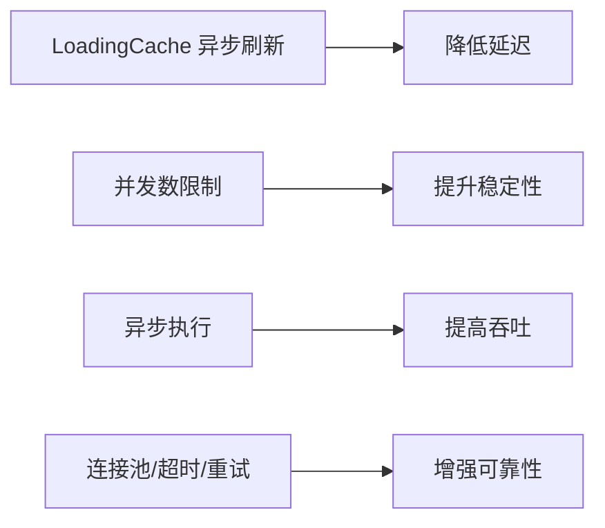

**图示来源**
- [CacheUtils.java:37-59](file://backend/qiji-framework/qiji-common/src/main/java/com/qiji/cps/framework/common/util/cache/CacheUtils.java#L37-L59)

**章节来源**
- [CacheUtils.java:37-59](file://backend/qiji-framework/qiji-common/src/main/java/com/qiji/cps/framework/common/util/cache/CacheUtils.java#L37-L59)

### 平台注册流程
- 平台配置管理：前端提供平台配置的增删改查与测试连接功能
- API 密钥配置：平台配置中包含 appKey/appSecret/apiBaseUrl 等字段
- 测试连接验证：调用适配器 testConnection 或供应商客户端 testConnection
- 生产环境部署：通过平台枚举与错误码统一平台编码与错误语义，确保一致性

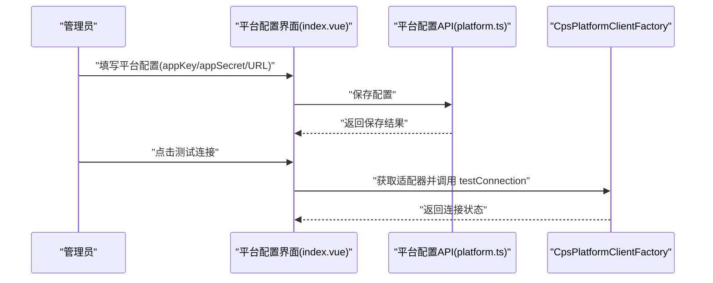

**图示来源**
- [index.vue:315-369](file://frontend/admin-vue3/src/views/cps/platform/index.vue#L315-L369)
- [platform.ts:51-59](file://frontend/admin-vue3/src/api/cps/platform.ts#L51-L59)
- [CpsPlatformClientFactory.java:104-110](file://backend/qiji-module-cps/qiji-module-cps-biz/src/main/java/com/qiji/cps/module/cps/client/CpsPlatformClientFactory.java#L104-L110)

**章节来源**
- [index.vue:315-369](file://frontend/admin-vue3/src/views/cps/platform/index.vue#L315-L369)
- [platform.ts:51-59](file://frontend/admin-vue3/src/api/cps/platform.ts#L51-L59)
- [CpsPlatformClientFactory.java:104-110](file://backend/qiji-module-cps/qiji-module-cps-biz/src/main/java/com/qiji/cps/module/cps/client/CpsPlatformClientFactory.java#L104-L110)

### 新增平台接入完整示例与最佳实践
- 步骤
  1) 定义平台枚举：在 CpsPlatformCodeEnum 中添加新平台编码
  2) 实现适配器：实现 CpsPlatformClient，返回唯一平台编码
  3) 实现供应商适配器（可选）：实现 CpsApiVendorClient，返回供应商编码与平台编码
  4) 配置前端：在平台配置界面中支持新平台字段
  5) 测试：调用 testConnection 验证连通性
  6) 上线：通过工厂路由与错误码统一处理异常
- 最佳实践
  - 使用 DTO 统一参数与响应结构
  - 在工厂中注册 Bean，避免硬编码路由
  - 使用错误码常量集中管理错误语义
  - 参考 SDK 的网络与日志实现，完善异常处理与可观测性

**章节来源**
- [CpsPlatformCodeEnum.java:14-46](file://backend/qiji-module-cps/qiji-module-cps-api/src/main/java/com/qiji/cps/module/cps/enums/CpsPlatformCodeEnum.java#L14-L46)
- [CpsPlatformClient.java:14-54](file://backend/qiji-module-cps/qiji-module-cps-biz/src/main/java/com/qiji/cps/module/cps/client/CpsPlatformClient.java#L14-L54)
- [CpsApiVendorClient.java:25-83](file://backend/qiji-module-cps/qiji-module-cps-biz/src/main/java/com/qiji/cps/module/cps/client/CpsApiVendorClient.java#L25-L83)
- [index.vue:315-369](file://frontend/admin-vue3/src/views/cps/platform/index.vue#L315-L369)
- [CpsErrorCodeConstants.java:10-68](file://backend/qiji-module-cps/qiji-module-cps-api/src/main/java/com/qiji/cps/module/cps/enums/CpsErrorCodeConstants.java#L10-L68)

## 依赖分析
- 组件耦合
  - 工厂与适配器：通过接口解耦，工厂仅依赖接口与配置
  - 适配器与配置：通过 CpsVendorConfig 解耦供应商细节
  - 前端与后端：通过 API VO 与接口契约解耦
- 外部依赖
  - SDK 示例提供网络与日志实现参考
  - 前端请求封装与移动端请求封装提供错误处理参考

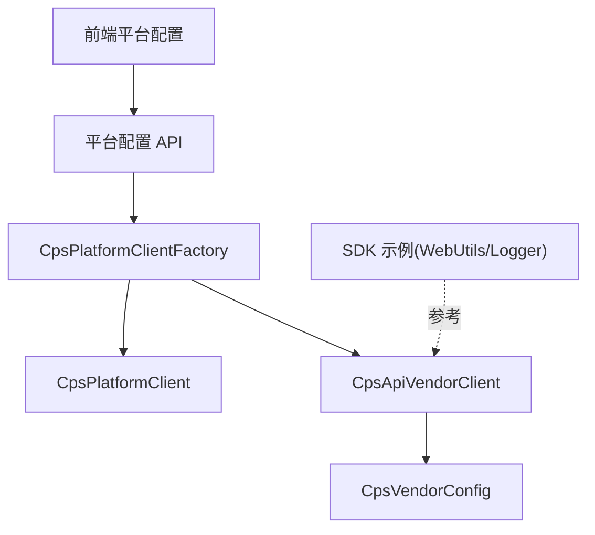

**图示来源**
- [CpsPlatformClientFactory.java:30-132](file://backend/qiji-module-cps/qiji-module-cps-biz/src/main/java/com/qiji/cps/module/cps/client/CpsPlatformClientFactory.java#L30-L132)
- [CpsApiVendorClient.java:25-83](file://backend/qiji-module-cps/qiji-module-cps-biz/src/main/java/com/qiji/cps/module/cps/client/CpsApiVendorClient.java#L25-L83)
- [CpsVendorConfig.java:16-65](file://backend/qiji-module-cps/qiji-module-cps-biz/src/main/java/com/qiji/cps/module/cps/client/dto/CpsVendorConfig.java#L16-L65)
- [platform.ts:51-59](file://frontend/admin-vue3/src/api/cps/platform.ts#L51-L59)
- [WebUtils.java:151-187](file://agent_improvement/sdk_demo/dataoke-sdk-java/src/main/java/com/dtk/api/http/WebUtils.java#L151-L187)
- [Logger.java:45-194](file://agent_improvement/sdk_demo/dataoke-sdk-java/src/main/java/com/dtk/api/http/Logger.java#L45-L194)

**章节来源**
- [CpsPlatformClientFactory.java:30-132](file://backend/qiji-module-cps/qiji-module-cps-biz/src/main/java/com/qiji/cps/module/cps/client/CpsPlatformClientFactory.java#L30-L132)
- [CpsApiVendorClient.java:25-83](file://backend/qiji-module-cps/qiji-module-cps-biz/src/main/java/com/qiji/cps/module/cps/client/CpsApiVendorClient.java#L25-L83)
- [CpsVendorConfig.java:16-65](file://backend/qiji-module-cps/qiji-module-cps-biz/src/main/java/com/qiji/cps/module/cps/client/dto/CpsVendorConfig.java#L16-L65)
- [platform.ts:51-59](file://frontend/admin-vue3/src/api/cps/platform.ts#L51-L59)
- [WebUtils.java:151-187](file://agent_improvement/sdk_demo/dataoke-sdk-java/src/main/java/com/dtk/api/http/WebUtils.java#L151-L187)
- [Logger.java:45-194](file://agent_improvement/sdk_demo/dataoke-sdk-java/src/main/java/com/dtk/api/http/Logger.java#L45-L194)

## 性能考虑
- 缓存：使用 LoadingCache 异步刷新，减少热点数据的重复计算与 IO
- 并发：在适配器实现中限制并发，避免触发第三方限流
- 异步：对非关键路径采用异步执行，提高吞吐
- 连接池：参考 SDK 的连接建立与代理设置，合理配置超时与重试

**章节来源**
- [CacheUtils.java:37-59](file://backend/qiji-framework/qiji-common/src/main/java/com/qiji/cps/framework/common/util/cache/CacheUtils.java#L37-L59)

## 故障排查指南
- 网络异常
  - 前端：监听在线状态与错误提示，必要时引导用户重试
  - 移动端：针对 401/403/404/408/429/5xx 等状态码给出明确提示
- API 限流
  - 前端/SDK：识别 429，提示用户稍后再试
- 数据解析错误
  - 使用错误码常量映射统一提示
- 重试机制
  - 建议在适配器实现中引入指数退避重试，避免雪崩

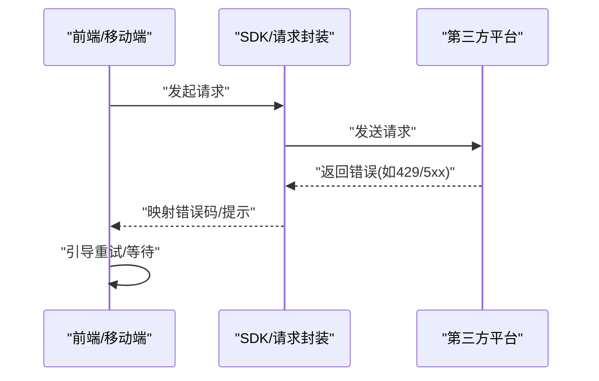

**图示来源**
- [useNetwork.ts:1-21](file://frontend/admin-vue3/src/hooks/web/useNetwork.ts#L1-L21)
- [error.vue:1-60](file://frontend/mall-uniapp/pages/public/error.vue#L1-L60)
- [service.ts:141-174](file://frontend/admin-vue3/src/config/axios/service.ts#L141-L174)
- [index.js:164-206](file://frontend/mall-uniapp/sheep/request/index.js#L164-L206)
- [CpsErrorCodeConstants.java:10-68](file://backend/qiji-module-cps/qiji-module-cps-api/src/main/java/com/qiji/cps/module/cps/enums/CpsErrorCodeConstants.java#L10-L68)

**章节来源**
- [useNetwork.ts:1-21](file://frontend/admin-vue3/src/hooks/web/useNetwork.ts#L1-L21)
- [error.vue:1-60](file://frontend/mall-uniapp/pages/public/error.vue#L1-L60)
- [service.ts:141-174](file://frontend/admin-vue3/src/config/axios/service.ts#L141-L174)
- [index.js:164-206](file://frontend/mall-uniapp/sheep/request/index.js#L164-L206)
- [CpsErrorCodeConstants.java:10-68](file://backend/qiji-module-cps/qiji-module-cps-api/src/main/java/com/qiji/cps/module/cps/enums/CpsErrorCodeConstants.java#L10-L68)

## 结论
通过策略模式与工厂注册，AgenticCPS 实现了对第三方平台的灵活接入与统一管理。配合 DTO/枚举/错误码的标准化定义、前端配置与测试连接、以及 SDK 的网络与日志参考实现，开发者可以快速、安全、稳定地完成新平台接入，并在性能与可靠性方面获得良好保障。

## 附录
- 平台枚举与错误码
  - 平台编码：taobao/jd/pdd/douyin/vip/meituan
  - 错误码段落：平台配置/推广位/订单/返利/提现/统计/MCP/转链/冻结/风控/API供应商
- 前端平台配置
  - 平台配置 VO/保存 VO/分页请求 VO
  - 平台配置 API（创建/更新/分页）

**章节来源**
- [CpsPlatformCodeEnum.java:14-46](file://backend/qiji-module-cps/qiji-module-cps-api/src/main/java/com/qiji/cps/module/cps/enums/CpsPlatformCodeEnum.java#L14-L46)
- [CpsErrorCodeConstants.java:10-68](file://backend/qiji-module-cps/qiji-module-cps-api/src/main/java/com/qiji/cps/module/cps/enums/CpsErrorCodeConstants.java#L10-L68)
- [platform.ts:4-39](file://frontend/admin-vue3/src/api/cps/platform.ts#L4-L39)