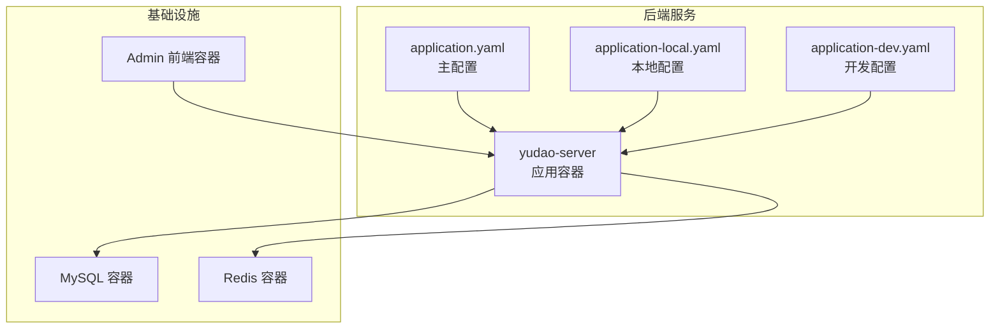
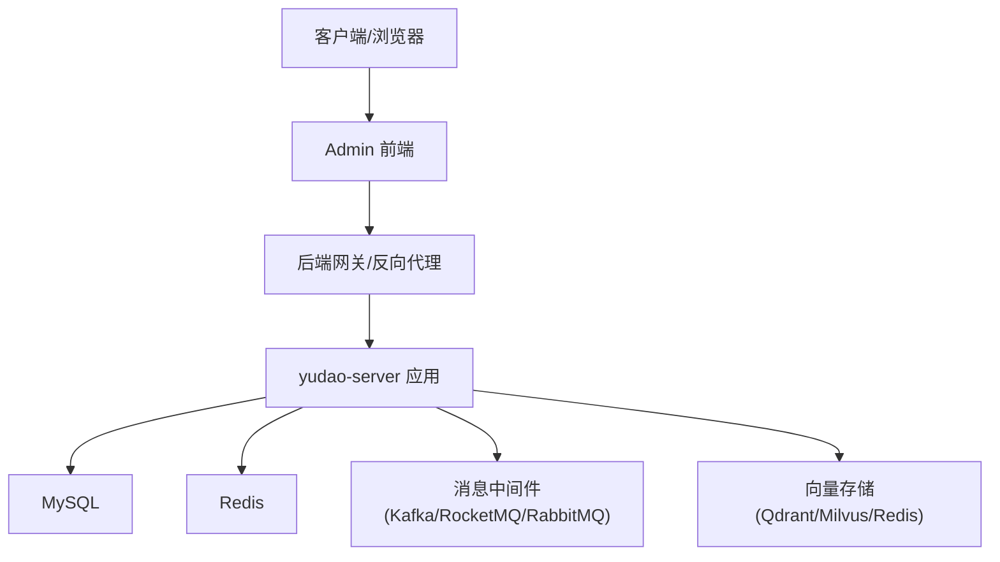
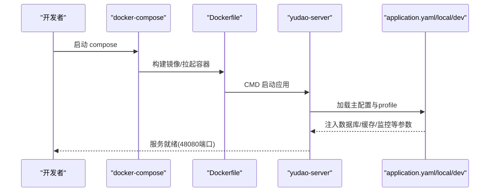
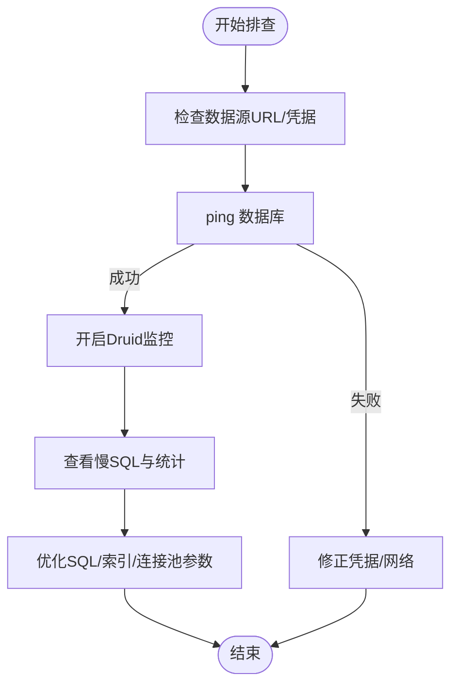
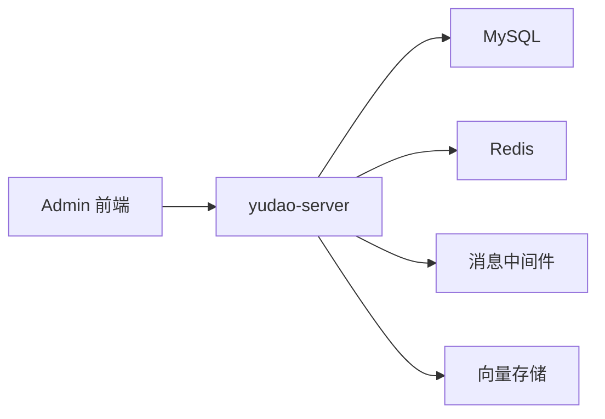

# 调试与故障排查

<cite>
**本文引用的文件**
- [docker-compose.yml](file://backend/script/docker/docker-compose.yml)
- [Dockerfile](file://backend/yudao-server/Dockerfile)
- [application.yaml](file://backend/yudao-server/src/main/resources/application.yaml)
- [application-local.yaml](file://backend/yudao-server/src/main/resources/application-local.yaml)
- [application-dev.yaml](file://backend/yudao-server/src/main/resources/application-dev.yaml)
- [http-client.env.json](file://backend/script/idea/http-client.env.json)
</cite>

## 目录
1. [简介](#简介)
2. [项目结构](#项目结构)
3. [核心组件](#核心组件)
4. [架构总览](#架构总览)
5. [详细组件分析](#详细组件分析)
6. [依赖分析](#依赖分析)
7. [性能考虑](#性能考虑)
8. [故障排查指南](#故障排查指南)
9. [结论](#结论)
10. [附录](#附录)

## 简介
本指南面向开发与运维工程师，围绕 AgenticCPS 后端系统提供一套完整的调试与故障排查方法论。内容涵盖：
- 开发环境调试技巧、断点设置与变量检查策略
- 生产环境日志分析、错误追踪与性能诊断
- 数据库连接问题排查、缓存异常处理、网络通信故障排除
- API 接口调试、参数验证错误与响应异常分析
- 内存泄漏检测、CPU 占用过高与并发问题排查
- 容器化部署问题、Docker 网络与 Kubernetes 调度问题定位
- 监控告警配置、指标收集与根因分析
- 常见错误代码解读与解决方案汇总

## 项目结构
后端采用多模块 Maven 结构，核心运行时位于 yudao-server，配合 Docker Compose 快速拉起 MySQL、Redis 与 Admin 管理前端。关键配置集中在 application.yaml 及其 profile 下的 local/dev。

图表来源
- [docker-compose.yml:1-85](file://backend/script/docker/docker-compose.yml#L1-L85)
- [Dockerfile:1-24](file://backend/yudao-server/Dockerfile#L1-L24)
- [application.yaml:1-362](file://backend/yudao-server/src/main/resources/application.yaml#L1-L362)
- [application-local.yaml:1-294](file://backend/yudao-server/src/main/resources/application-local.yaml#L1-L294)
- [application-dev.yaml:1-213](file://backend/yudao-server/src/main/resources/application-dev.yaml#L1-L213)

章节来源
- [docker-compose.yml:1-85](file://backend/script/docker/docker-compose.yml#L1-L85)
- [Dockerfile:1-24](file://backend/yudao-server/Dockerfile#L1-L24)
- [application.yaml:1-362](file://backend/yudao-server/src/main/resources/application.yaml#L1-L362)

## 核心组件
- 应用配置体系
  - 主配置 application.yaml：集中管理 Spring、MyBatis、Redis、Actuator、Swagger、AI 多向量存储、消息队列、安全与租户等全局能力开关与默认值。
  - Profile 配置：application-local.yaml（本地开发）、application-dev.yaml（测试/预发）分别覆盖数据库、缓存、Quartz、消息中间件、监控与日志等差异化需求。
- 容器编排
  - docker-compose.yml：定义 mysql、redis、server、admin 四个服务，含端口映射、环境变量注入与卷挂载。
  - Dockerfile：基于 Eclipse Temurin 21 JRE 构建，暴露 48080 端口，支持 JAVA_OPTS 与 ARGS 注入。
- 调试与测试环境
  - http-client.env.json：IDE HTTP 客户端环境变量，包含本地与网关两种 baseUrl，便于快速发起 admin-api 与 app-api 请求。

章节来源
- [application.yaml:1-362](file://backend/yudao-server/src/main/resources/application.yaml#L1-L362)
- [application-local.yaml:1-294](file://backend/yudao-server/src/main/resources/application-local.yaml#L1-L294)
- [application-dev.yaml:1-213](file://backend/yudao-server/src/main/resources/application-dev.yaml#L1-L213)
- [docker-compose.yml:1-85](file://backend/script/docker/docker-compose.yml#L1-L85)
- [Dockerfile:1-24](file://backend/yudao-server/Dockerfile#L1-L24)
- [http-client.env.json:1-21](file://backend/script/idea/http-client.env.json#L1-L21)

## 架构总览
后端服务通过 Spring Boot 启动，依赖 MySQL 与 Redis，对外提供 Admin 与 App 两套 API 前缀。容器化部署时，server 服务通过环境变量注入数据库与缓存地址，admin 服务依赖 server 提供的后端接口。

图表来源
- [docker-compose.yml:29-78](file://backend/script/docker/docker-compose.yml#L29-L78)
- [application.yaml:120-225](file://backend/yudao-server/src/main/resources/application.yaml#L120-L225)
- [application-local.yaml:119-135](file://backend/yudao-server/src/main/resources/application-local.yaml#L119-L135)
- [application-dev.yaml:98-114](file://backend/yudao-server/src/main/resources/application-dev.yaml#L98-L114)

## 详细组件分析

### 组件一：配置与启动流程
- 启动入口
  - Dockerfile 中 CMD java ${JAVA_OPTS} -jar app.jar $ARGS，支持通过环境变量覆盖 JVM 参数与应用参数。
  - docker-compose.yml 中通过 environment/ARGS 注入数据源、Redis 主机等关键配置。
- 配置加载顺序
  - application.yaml 为默认配置，application-local.yaml 与 application-dev.yaml 通过 spring.profiles.active 激活，覆盖默认值。
- 关键配置要点
  - Actuator 暴露端点：management.endpoints.web.exposure.include=*，便于健康检查与指标导出。
  - Spring Boot Admin：client.url 与 context-path 配置，便于集中监控。
  - 日志：logging.level 对特定模块设置 debug/info，便于定位问题。

图表来源
- [Dockerfile:1-24](file://backend/yudao-server/Dockerfile#L1-L24)
- [docker-compose.yml:29-56](file://backend/script/docker/docker-compose.yml#L29-L56)
- [application.yaml:1-362](file://backend/yudao-server/src/main/resources/application.yaml#L1-L362)
- [application-local.yaml:1-294](file://backend/yudao-server/src/main/resources/application-local.yaml#L1-L294)
- [application-dev.yaml:1-213](file://backend/yudao-server/src/main/resources/application-dev.yaml#L1-L213)

章节来源
- [Dockerfile:1-24](file://backend/yudao-server/Dockerfile#L1-L24)
- [docker-compose.yml:1-85](file://backend/script/docker/docker-compose.yml#L1-L85)
- [application.yaml:146-225](file://backend/yudao-server/src/main/resources/application.yaml#L146-L225)
- [application-local.yaml:146-194](file://backend/yudao-server/src/main/resources/application-local.yaml#L146-L194)
- [application-dev.yaml:124-150](file://backend/yudao-server/src/main/resources/application-dev.yaml#L124-L150)

### 组件二：数据库连接与慢查询定位
- 连接池与监控
  - Druid 连接池在 local/dev profile 中开启 web-stat-filter、stat-view-servlet，支持慢 SQL 记录与 SQL 统计。
  - 动态数据源配置包含 master/slave，支持懒加载与批量语句重写。
- 故障排查步骤
  - 检查 datasource.url、username、password 是否正确，以及数据库可达性。
  - 查看 Druid 监控页 /druid，关注活跃连接数、慢查询、SQL 超时与异常。
  - 在 application.yaml 中开启 MyBatis 日志，结合慢查询记录定位问题 SQL。

图表来源
- [application-local.yaml:13-79](file://backend/yudao-server/src/main/resources/application-local.yaml#L13-L79)
- [application-dev.yaml:13-57](file://backend/yudao-server/src/main/resources/application-dev.yaml#L13-L57)
- [application.yaml:66-82](file://backend/yudao-server/src/main/resources/application.yaml#L66-L82)

章节来源
- [application-local.yaml:13-79](file://backend/yudao-server/src/main/resources/application-local.yaml#L13-L79)
- [application-dev.yaml:13-57](file://backend/yudao-server/src/main/resources/application-dev.yaml#L13-L57)
- [application.yaml:66-82](file://backend/yudao-server/src/main/resources/application.yaml#L66-L82)

### 组件三：缓存异常与一致性
- 缓存配置
  - application.yaml 指定 Cache 类型为 REDIS，并设置 TTL。
  - application-local.yaml/ application-dev.yaml 提供 Redis 地址、端口、密码与数据库索引。
- 常见问题
  - 缓存不可用：检查 Redis 连接参数与网络连通性。
  - 缓存穿透/击穿：结合业务层缓存策略与限流。
  - 缓存不一致：检查分布式锁与更新顺序。
- 排查步骤
  - 使用 Redis 客户端连接目标实例，验证连通性与命令可用性。
  - 在 application.yaml 中开启相应模块的日志级别，定位缓存读写链路。

章节来源
- [application.yaml:26-31](file://backend/yudao-server/src/main/resources/application.yaml#L26-L31)
- [application-local.yaml:80-87](file://backend/yudao-server/src/main/resources/application-local.yaml#L80-L87)
- [application-dev.yaml:59-66](file://backend/yudao-server/src/main/resources/application-dev.yaml#L59-L66)

### 组件四：消息队列与异步处理
- 配置范围
  - application.yaml：RocketMQ 生产者分组等基础配置。
  - application-local.yaml / application-dev.yaml：Kafka/RocketMQ/RabbitMQ 的地址与认证。
- 故障排查
  - 检查 broker/nameserver 地址与网络可达性。
  - 关注消费者组偏移、主题是否存在、反序列化配置。
  - 结合业务日志与消息中间件控制台定位积压与重复消费。

章节来源
- [application.yaml:120-145](file://backend/yudao-server/src/main/resources/application.yaml#L120-L145)
- [application-local.yaml:121-135](file://backend/yudao-server/src/main/resources/application-local.yaml#L121-L135)
- [application-dev.yaml:100-114](file://backend/yudao-server/src/main/resources/application-dev.yaml#L100-L114)

### 组件五：AI 向量存储与 MCP 服务
- 配置要点
  - application.yaml 中定义向量存储（Redis/Qdrant/Milvus）与 MCP 服务端口、SSE 端点等。
- 故障排查
  - 检查向量存储服务可达性与索引/集合初始化状态。
  - MCP 服务端口与 SSE 端点是否被防火墙阻断。
  - 结合 AI 模块日志定位模型调用异常。

章节来源
- [application.yaml:146-225](file://backend/yudao-server/src/main/resources/application.yaml#L146-L225)

### 组件六：API 接口调试与参数校验
- 调试入口
  - http-client.env.json 提供本地与网关两种环境的 baseUrl，便于快速发起 admin-api 与 app-api 请求。
- 参数校验
  - application.yaml 中包含《芋道 Spring Boot 参数校验 Validation 入门》文档链接，建议结合注解与全局异常统一处理。
- 响应异常分析
  - 结合 Actuator /health 与业务日志，定位异常链路与错误码。

章节来源
- [http-client.env.json:1-21](file://backend/script/idea/http-client.env.json#L1-L21)
- [application.yaml:1-362](file://backend/yudao-server/src/main/resources/application.yaml#L1-L362)

## 依赖分析
- 组件耦合
  - yudao-server 对 MySQL、Redis、消息中间件与向量存储存在强依赖；通过 application.yaml 与 profile 配置实现解耦。
- 外部依赖
  - Docker Compose 将服务解耦为独立容器，便于横向扩展与故障隔离。
- 潜在风险
  - 依赖服务网络连通性与配置一致性；需建立健康检查与告警联动。

图表来源
- [docker-compose.yml:29-78](file://backend/script/docker/docker-compose.yml#L29-L78)
- [application.yaml:120-225](file://backend/yudao-server/src/main/resources/application.yaml#L120-L225)

章节来源
- [docker-compose.yml:1-85](file://backend/script/docker/docker-compose.yml#L1-L85)
- [application.yaml:1-362](file://backend/yudao-server/src/main/resources/application.yaml#L1-L362)

## 性能考虑
- JVM 与容器
  - Dockerfile 中 JAVA_OPTS 默认堆大小为 512m，可根据负载调整；通过 ARGS 注入动态参数。
- 数据库与缓存
  - 连接池参数（初始/最大/空闲/超时）直接影响吞吐与延迟；结合慢查询与连接数监控优化。
- 监控与可观测性
  - management.endpoints.web.exposure.include=* 开放所有端点，便于 Prometheus/Grafana 抓取指标。
  - logging.level 针对关键模块设置 debug/info，平衡可观测性与性能。

章节来源
- [Dockerfile:13-14](file://backend/yudao-server/Dockerfile#L13-L14)
- [application-local.yaml:146-194](file://backend/yudao-server/src/main/resources/application-local.yaml#L146-L194)
- [application-dev.yaml:124-150](file://backend/yudao-server/src/main/resources/application-dev.yaml#L124-L150)

## 故障排查指南

### 开发环境调试技巧
- 断点设置
  - 在 IDE 中针对控制器、服务层与 DAO 层设置断点，逐步缩小问题范围。
  - 对参数校验、异常处理与事务边界处设置条件断点。
- 变量检查策略
  - 关注关键上下文对象（如用户会话、租户信息、请求参数）与中间结果（如查询结果集、缓存键）。
  - 使用表达式断点观察复杂计算或聚合结果。
- 配置切换
  - 通过 spring.profiles.active 切换 local/dev，验证不同环境下的行为差异。

章节来源
- [application.yaml:5-6](file://backend/yudao-server/src/main/resources/application.yaml#L5-L6)
- [application-local.yaml:1-294](file://backend/yudao-server/src/main/resources/application-local.yaml#L1-L294)
- [application-dev.yaml:1-213](file://backend/yudao-server/src/main/resources/application-dev.yaml#L1-L213)

### 生产环境日志分析与错误追踪
- 日志级别
  - application-local.yaml 与 application-dev.yaml 对大量模块设置了 debug/info 级别，便于问题定位。
- 错误追踪
  - 结合 Actuator /health 与业务异常日志，定位异常栈与耗时环节。
- 指标采集
  - management.endpoints.web.exposure.include=* 开放端点，便于集成监控系统。

章节来源
- [application-local.yaml:167-194](file://backend/yudao-server/src/main/resources/application-local.yaml#L167-L194)
- [application-dev.yaml:124-150](file://backend/yudao-server/src/main/resources/application-dev.yaml#L124-L150)
- [application.yaml:1-362](file://backend/yudao-server/src/main/resources/application.yaml#L1-L362)

### 数据库连接问题排查
- 步骤
  - 校验 datasource.url、username、password 与数据库实例可达性。
  - 查看 Druid 监控页 /druid，关注慢 SQL、连接池状态与异常。
  - 在 application.yaml 中开启 MyBatis 日志，定位具体 SQL。
- 常见原因
  - 凭据错误、网络 ACL、防火墙、SSL/时区参数不匹配。

章节来源
- [application-local.yaml:13-79](file://backend/yudao-server/src/main/resources/application-local.yaml#L13-L79)
- [application-dev.yaml:13-57](file://backend/yudao-server/src/main/resources/application-dev.yaml#L13-L57)
- [application.yaml:66-82](file://backend/yudao-server/src/main/resources/application.yaml#L66-L82)

### 缓存异常处理
- 步骤
  - 校验 Redis 地址、端口、密码与数据库索引。
  - 使用 Redis 客户端连接验证连通性与命令可用性。
  - 在 application.yaml 中开启相应模块日志，定位读写链路。
- 常见原因
  - 连接不可用、键空间冲突、TTL 设置不当、序列化异常。

章节来源
- [application.yaml:26-31](file://backend/yudao-server/src/main/resources/application.yaml#L26-L31)
- [application-local.yaml:80-87](file://backend/yudao-server/src/main/resources/application-local.yaml#L80-L87)
- [application-dev.yaml:59-66](file://backend/yudao-server/src/main/resources/application-dev.yaml#L59-L66)

### 网络通信故障排除
- 服务间通信
  - docker-compose.yml 中服务通过内部网络互通；若出现跨服务调用失败，检查服务名与端口映射。
- API 调试
  - 使用 http-client.env.json 中的 baseUrl 快速发起请求，验证鉴权与路由。
- 常见原因
  - 端口未映射、服务未就绪、跨域与 CORS 配置缺失。

章节来源
- [docker-compose.yml:29-78](file://backend/script/docker/docker-compose.yml#L29-L78)
- [http-client.env.json:1-21](file://backend/script/idea/http-client.env.json#L1-L21)

### API 接口调试与参数验证
- 调试方法
  - 通过 http-client.env.json 选择本地或网关环境，构造 admin-api 与 app-api 请求。
  - 关注全局异常处理与参数校验注解，结合日志定位错误码与提示。
- 响应异常分析
  - 结合 Actuator /health 与业务日志，定位异常链路与耗时环节。

章节来源
- [http-client.env.json:1-21](file://backend/script/idea/http-client.env.json#L1-L21)
- [application.yaml:1-362](file://backend/yudao-server/src/main/resources/application.yaml#L1-L362)

### 内存泄漏、CPU 占用过高与并发问题
- 内存泄漏
  - 使用 JVM 堆快照与 GC 日志分析，关注长时间存活对象与线程池资源未释放。
- CPU 占用过高
  - 结合火焰图与线程转储，定位热点方法与死循环/忙等待。
- 并发问题
  - 检查分布式锁、线程池大小与队列长度，关注竞态条件与死锁。

章节来源
- [Dockerfile:13-14](file://backend/yudao-server/Dockerfile#L13-L14)
- [application-local.yaml:146-194](file://backend/yudao-server/src/main/resources/application-local.yaml#L146-L194)
- [application-dev.yaml:124-150](file://backend/yudao-server/src/main/resources/application-dev.yaml#L124-L150)

### 容器化部署问题、Docker 网络与 Kubernetes 调度
- 容器化部署
  - Dockerfile 使用 Eclipse Temurin 21 JRE，确保时区与 JVM 参数正确注入。
  - docker-compose.yml 通过 environment/ARGS 注入数据库与缓存地址，确保服务发现与网络互通。
- Docker 网络
  - 服务间通过内部网络通信；若出现连通性问题，检查容器日志与网络模式。
- Kubernetes 调度
  - 关注资源配额、探针健康检查与滚动更新策略；结合 Pod 日志与事件定位调度异常。

章节来源
- [Dockerfile:1-24](file://backend/yudao-server/Dockerfile#L1-L24)
- [docker-compose.yml:1-85](file://backend/script/docker/docker-compose.yml#L1-L85)

### 监控告警配置、指标收集与根因分析
- 指标收集
  - management.endpoints.web.exposure.include=* 开放 Actuator 端点，便于 Prometheus 抓取。
- 告警配置
  - 建议基于健康状态、JVM 指标、数据库连接池与慢查询阈值设置告警。
- 根因分析
  - 以日志与指标为依据，结合调用链追踪（如引入链路追踪组件）定位瓶颈与异常。

章节来源
- [application-local.yaml:146-194](file://backend/yudao-server/src/main/resources/application-local.yaml#L146-L194)
- [application-dev.yaml:124-150](file://backend/yudao-server/src/main/resources/application-dev.yaml#L124-L150)
- [application.yaml:1-362](file://backend/yudao-server/src/main/resources/application.yaml#L1-L362)

### 常见错误代码解读与解决方案汇总
- 数据库连接失败
  - 检查 datasource.url、凭据与网络；必要时开启 SSL 与时区参数。
- 缓存不可用
  - 校验 Redis 地址与认证；检查键空间与序列化配置。
- API 参数校验失败
  - 检查请求体与路径参数，结合全局异常处理返回的错误码与提示。
- 消息队列消费异常
  - 校验 broker/nameserver 地址与主题存在性；关注反序列化与消费者组偏移。
- 向量存储不可用
  - 校验 Redis/Qdrant/Milvus 地址与初始化状态；检查索引/集合名称。

章节来源
- [application-local.yaml:13-79](file://backend/yudao-server/src/main/resources/application-local.yaml#L13-L79)
- [application-dev.yaml:13-57](file://backend/yudao-server/src/main/resources/application-dev.yaml#L13-L57)
- [application.yaml:120-225](file://backend/yudao-server/src/main/resources/application.yaml#L120-L225)

## 结论
本指南提供了从开发调试到生产故障排查的完整方法论，结合配置文件与容器编排，能够快速定位数据库、缓存、网络与 API 等关键问题。建议在团队内形成标准化的调试流程与告警规范，持续优化性能与稳定性。

## 附录
- 快速检查清单
  - 数据库：URL/凭据/网络/慢查询
  - 缓存：地址/认证/键空间/序列化
  - 消息队列：地址/主题/消费者组/反序列化
  - API：baseUrl/鉴权/参数校验/响应异常
  - 容器：端口映射/环境变量/网络连通
  - 监控：端点暴露/指标抓取/告警规则