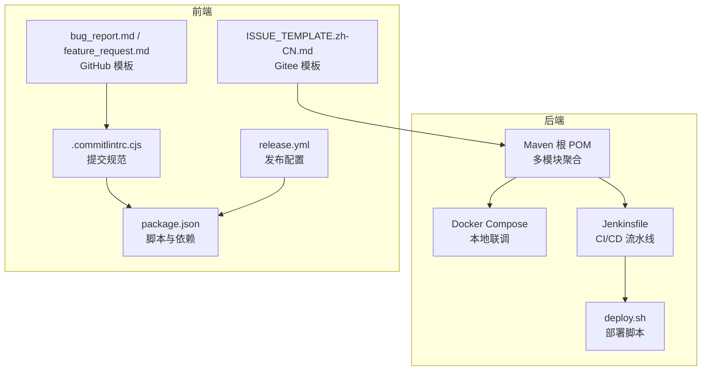
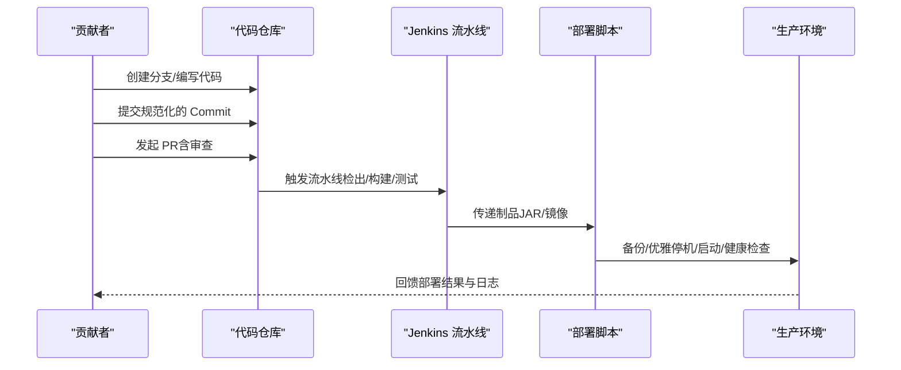
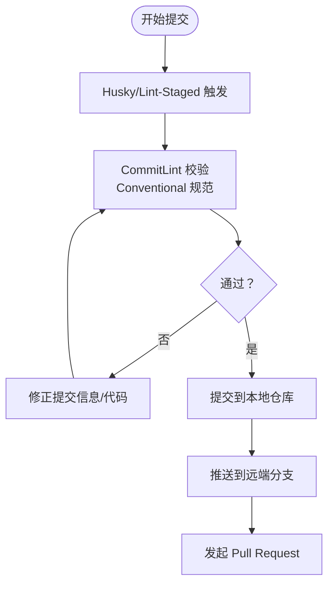
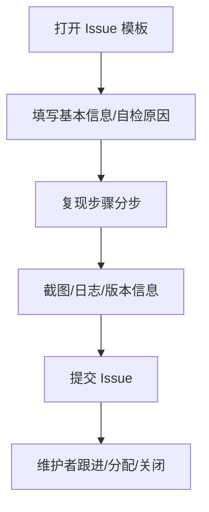
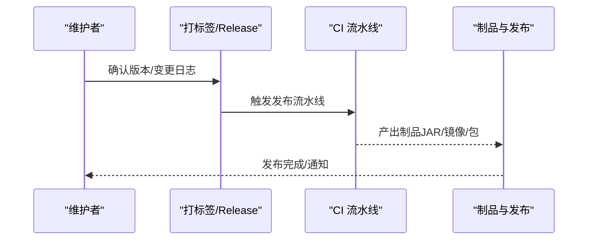
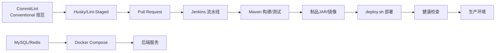

# 贡献指南

<cite>
**本文引用的文件**
- [Jenkinsfile](file://backend/script/jenkins/Jenkinsfile)
- [ISSUE_TEMPLATE.zh-CN.md](file://backend/.gitee/ISSUE_TEMPLATE.zh-CN.md)
- [.commitlintrc.cjs](file://frontend/admin-uniapp/.commitlintrc.cjs)
- [package.json](file://frontend/admin-uniapp/package.json)
- [docker-compose.yml](file://backend/script/docker/docker-compose.yml)
- [deploy.sh](file://backend/script/shell/deploy.sh)
- [bug_report.md](file://frontend/admin-uniapp/.github/ISSUE_TEMPLATE/bug_report.md)
- [feature_request.md](file://frontend/admin-uniapp/.github/ISSUE_TEMPLATE/feature_request.md)
- [release.yml](file://frontend/admin-uniapp/.github/release.yml)
- [pom.xml](file://backend/pom.xml)
</cite>

## 目录
1. [简介](#简介)
2. [项目结构](#项目结构)
3. [核心组件](#核心组件)
4. [架构总览](#架构总览)
5. [详细组件分析](#详细组件分析)
6. [依赖关系分析](#依赖关系分析)
7. [性能考虑](#性能考虑)
8. [故障排查指南](#故障排查指南)
9. [结论](#结论)
10. [附录](#附录)

## 简介
本贡献指南面向所有希望参与 AgenticCPS 项目的开发者与维护者，旨在提供一套清晰、可执行的协作开发规范。内容覆盖 Git 分支管理策略、代码提交规范、Pull Request 流程、Issue 提交规范、代码审查流程、测试要求、文档更新要求、版本发布流程，以及贡献者协议、行为准则与社区参与方式。我们鼓励贡献者遵循统一的工作流，以确保高质量交付与高效的团队协作。

## 项目结构
AgenticCPS 采用前后端分离与模块化多仓库协同的组织方式：
- 后端基于 Maven 多模块工程，包含依赖聚合、框架层、业务模块与服务端应用等。
- 前端包含多个子项目（如 admin-uniapp、admin-vue3、mall-uniapp），各自独立开发与发布。
- DevOps 层面提供 Docker Compose 快速本地联调、Jenkins 自动化流水线与 Shell 部署脚本。
- Issue 模板与提交规范分别在后端 Gitee 与前端 GitHub 下维护，保证问题与变更的标准化。

**图表来源**
- [pom.xml:1-175](file://backend/pom.xml#L1-L175)
- [docker-compose.yml:1-85](file://backend/script/docker/docker-compose.yml#L1-L85)
- [Jenkinsfile:1-61](file://backend/script/jenkins/Jenkinsfile#L1-L61)
- [deploy.sh:1-161](file://backend/script/shell/deploy.sh#L1-L161)
- [.commitlintrc.cjs:1-4](file://frontend/admin-uniapp/.commitlintrc.cjs#L1-L4)
- [package.json:1-194](file://frontend/admin-uniapp/package.json#L1-L194)
- [ISSUE_TEMPLATE.zh-CN.md:1-26](file://backend/.gitee/ISSUE_TEMPLATE.zh-CN.md#L1-L26)
- [bug_report.md:1-25](file://frontend/admin-uniapp/.github/ISSUE_TEMPLATE/bug_report.md#L1-L25)
- [feature_request.md:1-7](file://frontend/admin-uniapp/.github/ISSUE_TEMPLATE/feature_request.md#L1-L7)
- [release.yml](file://frontend/admin-uniapp/.github/release.yml)

**章节来源**
- [pom.xml:1-175](file://backend/pom.xml#L1-L175)
- [docker-compose.yml:1-85](file://backend/script/docker/docker-compose.yml#L1-L85)
- [Jenkinsfile:1-61](file://backend/script/jenkins/Jenkinsfile#L1-L61)
- [deploy.sh:1-161](file://backend/script/shell/deploy.sh#L1-L161)
- [.commitlintrc.cjs:1-4](file://frontend/admin-uniapp/.commitlintrc.cjs#L1-L4)
- [package.json:1-194](file://frontend/admin-uniapp/package.json#L1-L194)
- [ISSUE_TEMPLATE.zh-CN.md:1-26](file://backend/.gitee/ISSUE_TEMPLATE.zh-CN.md#L1-L26)
- [bug_report.md:1-25](file://frontend/admin-uniapp/.github/ISSUE_TEMPLATE/bug_report.md#L1-L25)
- [feature_request.md:1-7](file://frontend/admin-uniapp/.github/ISSUE_TEMPLATE/feature_request.md#L1-L7)
- [release.yml](file://frontend/admin-uniapp/.github/release.yml)

## 核心组件
- 提交规范与质量门禁
  - 前端使用 CommitLint 与 Conventional 规范，结合 Husky/Lint-Staged 在提交前进行校验与格式化。
  - 后端通过 Maven 插件与 Surefire 运行单元测试，确保构建阶段的质量门禁。
- Issue 模板
  - 后端 Gitee 模板与前端 GitHub 模板分别约束问题描述、复现步骤与预期结果，提高问题闭环效率。
- CI/CD 流水线
  - Jenkinsfile 定义检出、构建、打包与部署阶段；Shell 脚本负责备份、优雅停机、启动与健康检查。
- 本地联调
  - Docker Compose 提供 MySQL、Redis 与服务端容器编排，一键启动后端与前端管理端。

**章节来源**
- [.commitlintrc.cjs:1-4](file://frontend/admin-uniapp/.commitlintrc.cjs#L1-L4)
- [package.json:190-194](file://frontend/admin-uniapp/package.json#L190-L194)
- [ISSUE_TEMPLATE.zh-CN.md:1-26](file://backend/.gitee/ISSUE_TEMPLATE.zh-CN.md#L1-L26)
- [bug_report.md:1-25](file://frontend/admin-uniapp/.github/ISSUE_TEMPLATE/bug_report.md#L1-L25)
- [feature_request.md:1-7](file://frontend/admin-uniapp/.github/ISSUE_TEMPLATE/feature_request.md#L1-L7)
- [Jenkinsfile:1-61](file://backend/script/jenkins/Jenkinsfile#L1-L61)
- [deploy.sh:1-161](file://backend/script/shell/deploy.sh#L1-L161)
- [docker-compose.yml:1-85](file://backend/script/docker/docker-compose.yml#L1-L85)
- [pom.xml:58-141](file://backend/pom.xml#L58-L141)

## 架构总览
下图展示从“本地开发”到“自动化流水线”的整体协作路径，包括分支策略、提交规范、代码审查与发布流程的关键节点。

**图表来源**
- [Jenkinsfile:1-61](file://backend/script/jenkins/Jenkinsfile#L1-L61)
- [deploy.sh:146-161](file://backend/script/shell/deploy.sh#L146-L161)
- [.commitlintrc.cjs:1-4](file://frontend/admin-uniapp/.commitlintrc.cjs#L1-L4)
- [package.json:190-194](file://frontend/admin-uniapp/package.json#L190-L194)

## 详细组件分析

### Git 分支管理策略
- 基线分支
  - main/master：稳定发布分支，仅合并经审查的 PR。
  - develop/dev：日常集成分支，优先在此合并特性与修复。
- 功能分支
  - feature/<issue-id>-短描述：用于实现新功能或需求变更。
  - hotfix/<issue-id>-短描述：紧急修复线上问题。
- 合并与保护
  - 通过 Pull Request 合并，禁止直接 push 到受保护分支。
  - PR 合并前需满足：通过 CI、代码审查通过、无冲突、文档更新到位。

[本节为通用策略说明，不直接分析具体文件，故无“章节来源”]

### 代码提交规范
- 前端
  - 使用 Conventional Commits，结合 CommitLint 与 Husky/Lint-Staged，在提交前自动校验与修复。
  - 关键脚本与依赖位于 package.json 的 scripts 字段与 lint-staged 配置。
- 后端
  - 通过 Maven 插件链（Surefire、Compiler 等）在构建阶段执行测试与编译，确保质量门禁。

**图表来源**
- [.commitlintrc.cjs:1-4](file://frontend/admin-uniapp/.commitlintrc.cjs#L1-L4)
- [package.json:190-194](file://frontend/admin-uniapp/package.json#L190-L194)

**章节来源**
- [.commitlintrc.cjs:1-4](file://frontend/admin-uniapp/.commitlintrc.cjs#L1-L4)
- [package.json:190-194](file://frontend/admin-uniapp/package.json#L190-L194)
- [pom.xml:58-141](file://backend/pom.xml#L58-L141)

### Pull Request 流程
- PR 要求
  - 必须关联 Issue 或需求背景；描述变更动机、影响范围与测试要点。
  - 通过 CI（构建、测试）、代码审查（至少一名维护者同意）。
  - 合并前解决所有评论与冲突。
- 合并策略
  - Squash 合并以保持主干整洁；Rebase 以避免无关提交历史。

[本节为通用流程说明，不直接分析具体文件，故无“章节来源”]

### Issue 提交规范
- 后端（Gitee）
  - 模板包含基本信息、自检原因、复现步骤与报错信息，要求按模板填写，否则可能被系统自动删除。
- 前端（GitHub）
  - 提供 Bug 报告与功能请求模板，明确问题描述、复现步骤与期望结果。

**图表来源**
- [ISSUE_TEMPLATE.zh-CN.md:1-26](file://backend/.gitee/ISSUE_TEMPLATE.zh-CN.md#L1-L26)
- [bug_report.md:1-25](file://frontend/admin-uniapp/.github/ISSUE_TEMPLATE/bug_report.md#L1-L25)
- [feature_request.md:1-7](file://frontend/admin-uniapp/.github/ISSUE_TEMPLATE/feature_request.md#L1-L7)

**章节来源**
- [ISSUE_TEMPLATE.zh-CN.md:1-26](file://backend/.gitee/ISSUE_TEMPLATE.zh-CN.md#L1-L26)
- [bug_report.md:1-25](file://frontend/admin-uniapp/.github/ISSUE_TEMPLATE/bug_report.md#L1-L25)
- [feature_request.md:1-7](file://frontend/admin-uniapp/.github/ISSUE_TEMPLATE/feature_request.md#L1-L7)

### 代码审查流程
- 审查要点
  - 代码正确性、可读性、性能与安全性；是否符合设计与模块边界；测试覆盖情况。
- 工具与流程
  - PR 评审通过后方可合并；必要时要求二次审查或回退修改。
- 审查记录
  - 保留评论与决策记录，便于追溯与知识沉淀。

[本节为通用流程说明，不直接分析具体文件，故无“章节来源”]

### 测试要求
- 单元测试
  - 后端通过 Maven Surefire 插件在构建阶段运行测试，确保测试覆盖率与稳定性。
- 本地验证
  - 前端使用 Lint 与类型检查；后端使用 Docker Compose 快速拉起数据库与服务端，进行端到端联调。

**章节来源**
- [pom.xml:58-141](file://backend/pom.xml#L58-L141)
- [docker-compose.yml:1-85](file://backend/script/docker/docker-compose.yml#L1-L85)
- [package.json:96-97](file://frontend/admin-uniapp/package.json#L96-L97)

### 文档更新要求
- 新增/变更功能必须同步更新相关文档（README、设计文档、API 文档）。
- 文档变更应与代码变更在同一 PR 中提交，确保一致性。

[本节为通用要求说明，不直接分析具体文件，故无“章节来源”]

### 版本发布流程
- 版本号管理
  - 后端使用 Maven 版本属性统一管理；前端使用 package.json 的版本字段。
- 发布制品
  - Jenkins 流水线产出制品（JAR/镜像），配合部署脚本进行灰度/全量发布。
- 发布配置
  - 前端 release.yml 可用于 GitHub Release 的自动化配置（如资产上传、正文模板等）。

**图表来源**
- [Jenkinsfile:1-61](file://backend/script/jenkins/Jenkinsfile#L1-L61)
- [release.yml](file://frontend/admin-uniapp/.github/release.yml)
- [pom.xml:30-44](file://backend/pom.xml#L30-L44)
- [package.json:4-7](file://frontend/admin-uniapp/package.json#L4-L7)

**章节来源**
- [Jenkinsfile:1-61](file://backend/script/jenkins/Jenkinsfile#L1-L61)
- [release.yml](file://frontend/admin-uniapp/.github/release.yml)
- [pom.xml:30-44](file://backend/pom.xml#L30-L44)
- [package.json:4-7](file://frontend/admin-uniapp/package.json#L4-L7)

### 贡献者协议与行为准则
- 贡献者协议
  - 所有贡献需遵守项目 LICENSE（MIT）与贡献者许可协议（CLA）要求。
- 行为准则
  - 尊重、包容、专业，禁止任何形式的骚扰与歧视；维护开放、友好的社区氛围。

[本节为通用准则说明，不直接分析具体文件，故无“章节来源”]

### 社区参与指南
- 交流渠道
  - Issues 讨论问题与需求；PR 进行代码协作；邮件/即时通讯群组进行日常沟通。
- 反馈与改进
  - 鼓励提出改进建议与优化方案，共同完善项目质量与体验。

[本节为通用指南说明，不直接分析具体文件，故无“章节来源”]

### 功能开发流程
- 需求与设计
  - 明确需求背景与验收标准；必要时输出设计文档与接口定义。
- 开发与测试
  - 在 feature 分支开发，提交符合规范的 Commit；确保本地测试通过。
- 合并与发布
  - 发起 PR，通过审查与 CI；合并后进入发布流程。

[本节为通用流程说明，不直接分析具体文件，故无“章节来源”]

### Bug 修复流程
- 重现与定位
  - 使用模板填写复现步骤与环境信息；定位问题根因与影响范围。
- 修复与验证
  - 在 hotfix 分支修复；补充/回归测试；本地联调验证。
- 发布与跟进
  - 合并后发布修复版本，持续关注反馈。

**章节来源**
- [ISSUE_TEMPLATE.zh-CN.md:1-26](file://backend/.gitee/ISSUE_TEMPLATE.zh-CN.md#L1-L26)
- [bug_report.md:1-25](file://frontend/admin-uniapp/.github/ISSUE_TEMPLATE/bug_report.md#L1-L25)

### 文档贡献流程
- 文档与代码同 PR
  - 文档变更与功能变更同步提交，确保一致性与可追溯性。
- 审查与发布
  - 文档通过审查后合并，随版本发布同步更新。

[本节为通用流程说明，不直接分析具体文件，故无“章节来源”]

## 依赖关系分析
- 提交规范依赖
  - 前端：CommitLint 依赖 conventional 规范；Husky/Lint-Staged 在提交前触发校验。
- 构建与测试依赖
  - 后端：Maven Surefire 插件负责测试执行；编译插件处理注解处理器与参数名发现。
- 部署与运行依赖
  - Jenkinsfile 定义流水线参数与环境变量；deploy.sh 负责备份、优雅停机、启动与健康检查；docker-compose 提供数据库与服务端容器编排。

**图表来源**
- [.commitlintrc.cjs:1-4](file://frontend/admin-uniapp/.commitlintrc.cjs#L1-L4)
- [package.json:190-194](file://frontend/admin-uniapp/package.json#L190-L194)
- [Jenkinsfile:1-61](file://backend/script/jenkins/Jenkinsfile#L1-L61)
- [pom.xml:58-141](file://backend/pom.xml#L58-L141)
- [deploy.sh:146-161](file://backend/script/shell/deploy.sh#L146-L161)
- [docker-compose.yml:1-85](file://backend/script/docker/docker-compose.yml#L1-L85)

**章节来源**
- [.commitlintrc.cjs:1-4](file://frontend/admin-uniapp/.commitlintrc.cjs#L1-L4)
- [package.json:190-194](file://frontend/admin-uniapp/package.json#L190-L194)
- [Jenkinsfile:1-61](file://backend/script/jenkins/Jenkinsfile#L1-L61)
- [pom.xml:58-141](file://backend/pom.xml#L58-L141)
- [deploy.sh:146-161](file://backend/script/shell/deploy.sh#L146-L161)
- [docker-compose.yml:1-85](file://backend/script/docker/docker-compose.yml#L1-L85)

## 性能考虑
- 构建性能
  - 合理配置 Maven 插件参数与并行度；缓存依赖与制品，减少重复构建时间。
- 部署性能
  - 使用优雅停机与健康检查，降低发布窗口内的不可用时间；必要时采用蓝绿/灰度发布策略。
- 本地联调
  - Docker Compose 统一环境，减少环境差异导致的性能波动与调试成本。

[本节提供通用指导，不直接分析具体文件，故无“章节来源”]

## 故障排查指南
- 提交失败（CommitLint）
  - 检查提交信息是否符合 Conventional 规范；确认 Husky/Lint-Staged 是否正确安装与触发。
- 构建失败（Maven/Surefire）
  - 查看构建日志中的测试失败与编译错误；确保本地环境满足 JDK/依赖版本要求。
- 部署失败（Jenkins/deploy.sh）
  - 检查健康检查 URL 与返回码；查看 nohup 日志尾部输出；确认备份与优雅停机逻辑是否执行。
- 本地联调失败（Docker Compose）
  - 确认数据库初始化 SQL 是否加载；检查容器间网络与端口映射；核对环境变量与挂载卷。

**章节来源**
- [.commitlintrc.cjs:1-4](file://frontend/admin-uniapp/.commitlintrc.cjs#L1-L4)
- [package.json:190-194](file://frontend/admin-uniapp/package.json#L190-L194)
- [pom.xml:58-141](file://backend/pom.xml#L58-L141)
- [deploy.sh:107-143](file://backend/script/shell/deploy.sh#L107-L143)
- [docker-compose.yml:1-85](file://backend/script/docker/docker-compose.yml#L1-L85)

## 结论
本贡献指南提供了从分支策略、提交规范、PR 流程到 Issue 模板、CI/CD 与发布流程的完整协作规范。建议贡献者在每次提交前先阅读对应章节，确保变更符合团队约定，从而提升协作效率与项目质量。对于未尽事宜，欢迎在社区讨论中补充完善。

## 附录
- 常用命令与脚本
  - 前端：lint、lint:fix、type-check、dev:*、build:* 等。
  - 后端：Maven 构建与测试命令；Docker Compose 启动/停止。
- 参考文件清单
  - 提交规范与质量门禁：.commitlintrc.cjs、package.json
  - Issue 模板：ISSUE_TEMPLATE.zh-CN.md、bug_report.md、feature_request.md
  - CI/CD：Jenkinsfile、deploy.sh、docker-compose.yml
  - 版本与构建：pom.xml、package.json、release.yml

[本节为附录汇总，不直接分析具体文件，故无“章节来源”]