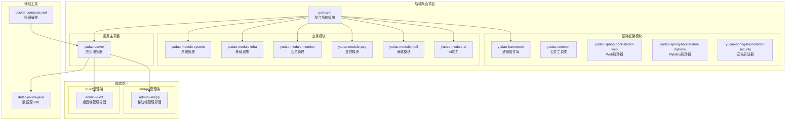
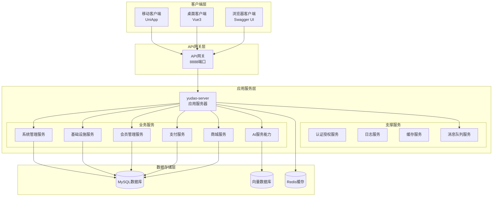
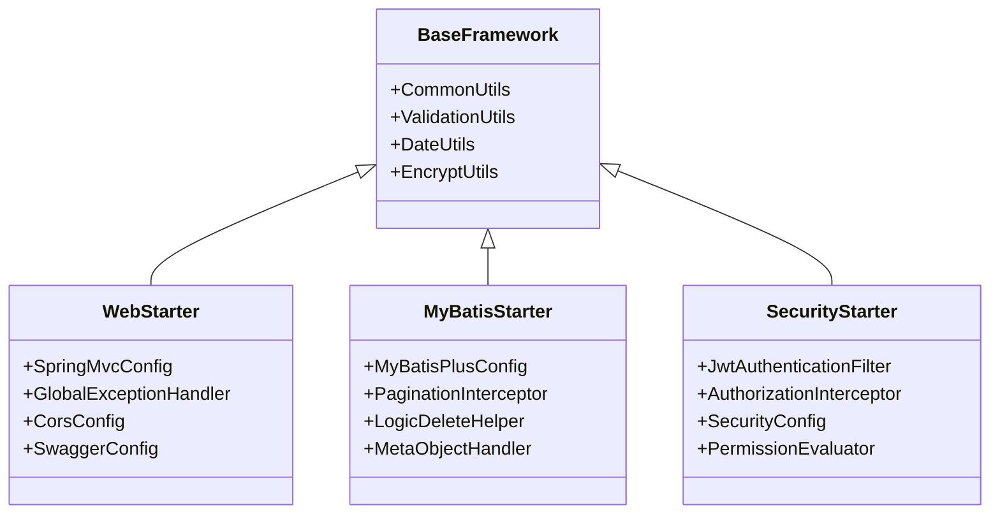
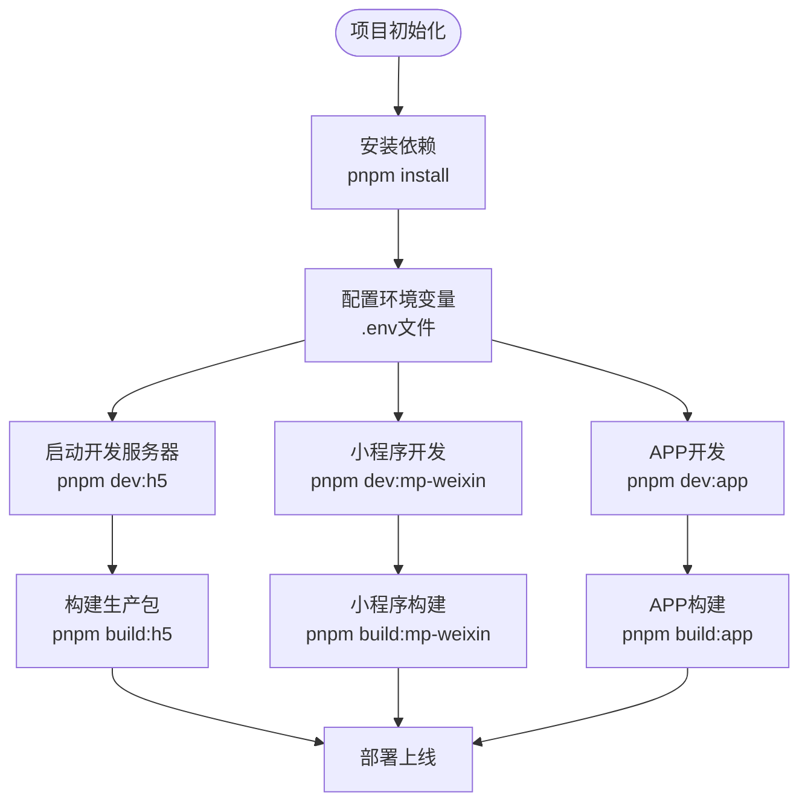
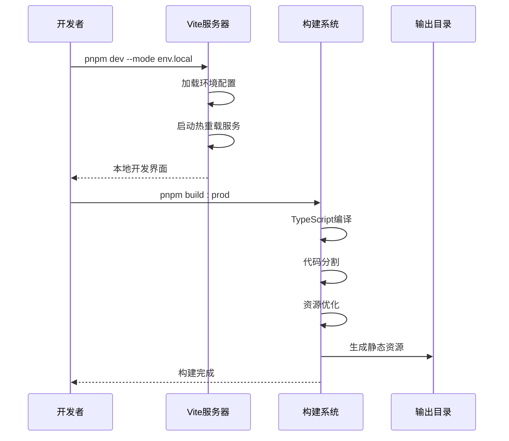
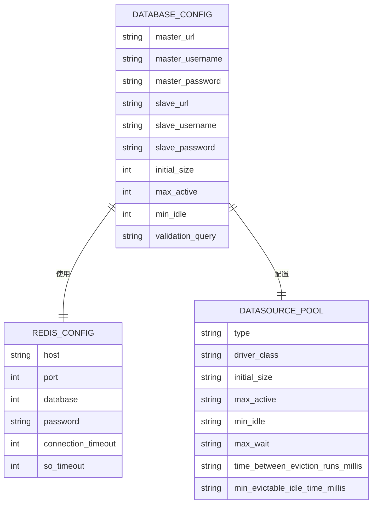
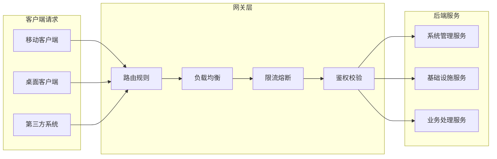
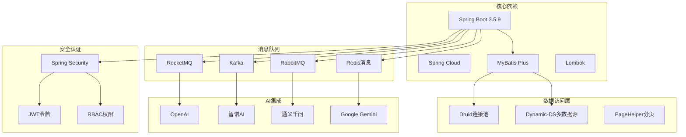
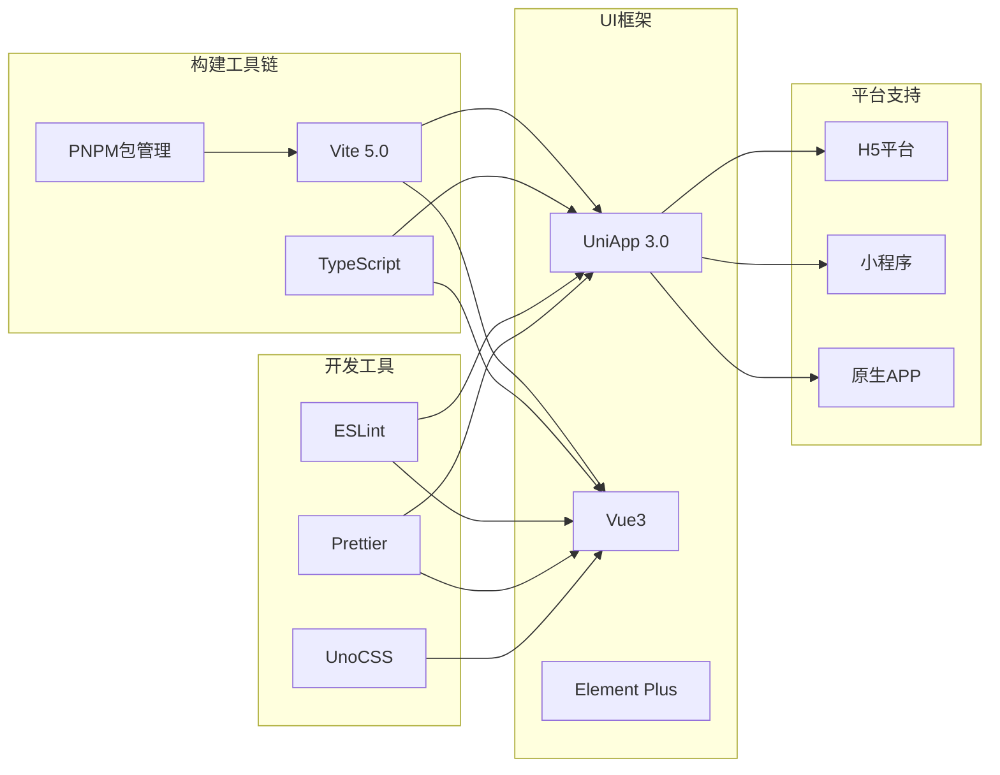

# 项目导入与配置

<cite>
**本文引用的文件**
- [后端聚合POM](file://backend/pom.xml)
- [后端服务配置(application.yaml)](file://backend/yudao-server/src/main/resources/application.yaml)
- [后端开发配置(application-dev.yaml)](file://backend/yudao-server/src/main/resources/application-dev.yaml)
- [后端Docker Compose](file://backend/script/docker/docker-compose.yml)
- [后端Docker环境变量](file://backend/script/docker/docker.env)
- [后端IDE HTTP客户端环境](file://backend/script/idea/http-client.env.json)
- [前端UniApp包配置(package.json)](file://frontend/admin-uniapp/package.json)
- [前端UniApp构建配置(vite.config.ts)](file://frontend/admin-uniapp/vite.config.ts)
- [前端Vue3包配置(package.json)](file://frontend/admin-vue3/package.json)
- [前端Vue3构建配置(vite.config.ts)](file://frontend/admin-vue3/vite.config.ts)
- [数据源SDK包配置(pom.xml)](file://agent_improvement/sdk_demo/dataoke-sdk-java/pom.xml)
</cite>

## 目录
1. [简介](#简介)
2. [项目结构](#项目结构)
3. [核心组件](#核心组件)
4. [架构概览](#架构概览)
5. [详细组件分析](#详细组件分析)
6. [依赖分析](#依赖分析)
7. [性能考虑](#性能考虑)
8. [故障排除指南](#故障排除指南)
9. [结论](#结论)
10. [附录](#附录)

## 简介
本指南面向开发者，提供AgenticCPS项目的完整导入与配置方案。项目采用前后端分离架构：后端为基于Spring Boot的多模块Maven项目，前端包含UniApp移动端管理界面和Vue3桌面端管理界面。项目支持多种数据库、消息队列和AI服务集成，提供Docker一键部署能力。

## 项目结构
项目采用多模块Maven聚合结构，后端包含基础框架、业务模块和服务主项目，前端提供多套UI实现。

**图表来源**
- [后端聚合POM:10-24](file://backend/pom.xml#L10-L24)
- [后端服务配置(application.yaml):1-50](file://backend/yudao-server/src/main/resources/application.yaml#L1-L50)

**章节来源**
- [后端聚合POM:1-175](file://backend/pom.xml#L1-L175)
- [后端服务配置(application.yaml):1-362](file://backend/yudao-server/src/main/resources/application.yaml#L1-L362)

## 核心组件
项目的核心组件包括：

### 后端技术栈
- **基础框架**: Spring Boot 3.5.9 + Java 17
- **数据库**: MySQL 8.0 + Redis 6.0 + 多数据源支持
- **消息队列**: RocketMQ、Kafka、RabbitMQ、Redis
- **AI集成**: 多家AI服务商API集成
- **安全框架**: Spring Security + JWT认证
- **监控**: Actuator + Spring Boot Admin

### 前端技术栈
- **UniApp**: 移动端跨平台开发，支持H5、小程序、APP
- **Vue3**: 桌面端管理界面，Element Plus + TypeScript
- **构建工具**: Vite 5.0 + PNPM包管理

**章节来源**
- [后端聚合POM:30-44](file://backend/pom.xml#L30-L44)
- [前端UniApp包配置(package.json):25-28](file://frontend/admin-uniapp/package.json#L25-L28)
- [前端Vue3包配置(package.json):155-158](file://frontend/admin-vue3/package.json#L155-L158)

## 架构概览
项目采用微服务化的单体架构设计，通过模块化组织业务功能，统一由yudao-server提供HTTP服务。

**图表来源**
- [后端服务配置(application.yaml):120-225](file://backend/yudao-server/src/main/resources/application.yaml#L120-L225)
- [后端开发配置(application-dev.yaml):4-114](file://backend/yudao-server/src/main/resources/application-dev.yaml#L4-L114)

## 详细组件分析

### 后端模块结构分析

#### 基础框架模块
基础框架模块提供通用的基础设施组件，包括：

**图表来源**
- [后端聚合POM:12-13](file://backend/pom.xml#L12-L13)

#### 业务模块划分
业务模块按照功能领域进行划分，每个模块独立开发和维护：

| 模块名称 | 功能描述 | 主要特性 |
|---------|----------|----------|
| yudao-module-system | 系统管理 | 用户管理、角色权限、菜单管理、字典数据 |
| yudao-module-infra | 基础设施 | 文件管理、操作日志、API监控、定时任务 |
| yudao-module-member | 会员管理 | 会员信息、等级体系、积分管理 |
| yudao-module-pay | 支付模块 | 支付订单、退款处理、支付通知 |
| yudao-module-mall | 商城模块 | 商品管理、订单处理、促销活动 |
| yudao-module-ai | AI能力 | 向量存储、多模型集成、Agent工具 |

**章节来源**
- [后端聚合POM:16-23](file://backend/pom.xml#L16-L23)

### 前端项目配置分析

#### UniApp管理端配置
UniApp项目提供移动端跨平台解决方案，支持多种小程序平台和原生APP：

**图表来源**
- [前端UniApp包配置(package.json):29-98](file://frontend/admin-uniapp/package.json#L29-L98)
- [前端UniApp构建配置(vite.config.ts):33-62](file://frontend/admin-uniapp/vite.config.ts#L33-L62)

#### Vue3管理端配置
Vue3项目提供桌面端管理界面，采用现代化的前端技术栈：

**图表来源**
- [前端Vue3包配置(package.json):7-26](file://frontend/admin-vue3/package.json#L7-L26)
- [前端Vue3构建配置(vite.config.ts):15-22](file://frontend/admin-vue3/vite.config.ts#L15-L22)

**章节来源**
- [前端UniApp包配置(package.json):1-194](file://frontend/admin-uniapp/package.json#L1-L194)
- [前端Vue3包配置(package.json):1-160](file://frontend/admin-vue3/package.json#L1-L160)

### 数据库连接配置分析
项目支持多种数据库和连接池配置，提供灵活的数据存储方案：

**图表来源**
- [后端开发配置(application-dev.yaml):48-66](file://backend/yudao-server/src/main/resources/application-dev.yaml#L48-L66)

**章节来源**
- [后端开发配置(application-dev.yaml):13-66](file://backend/yudao-server/src/main/resources/application-dev.yaml#L13-L66)

### API网关配置分析
项目提供灵活的API网关配置，支持多种路由规则和负载均衡策略：

**图表来源**
- [后端服务配置(application.yaml):120-145](file://backend/yudao-server/src/main/resources/application.yaml#L120-L145)

**章节来源**
- [后端服务配置(application.yaml):120-145](file://backend/yudao-server/src/main/resources/application.yaml#L120-L145)

## 依赖分析

### 后端模块依赖关系
后端采用层次化的模块依赖结构，确保模块间的松耦合和高内聚：

**图表来源**
- [后端聚合POM:46-56](file://backend/pom.xml#L46-L56)

### 前端依赖关系
前端项目采用现代化的依赖管理策略，支持多平台开发：

**图表来源**
- [前端UniApp包配置(package.json):99-177](file://frontend/admin-uniapp/package.json#L99-L177)
- [前端Vue3包配置(package.json):85-144](file://frontend/admin-vue3/package.json#L85-L144)

**章节来源**
- [后端聚合POM:46-56](file://backend/pom.xml#L46-L56)
- [前端UniApp包配置(package.json):99-177](file://frontend/admin-uniapp/package.json#L99-L177)
- [前端Vue3包配置(package.json):85-144](file://frontend/admin-vue3/package.json#L85-L144)

## 性能考虑
项目在性能方面采用了多项优化策略：

### 后端性能优化
- **连接池优化**: Druid连接池配置了合理的初始大小、最大活跃数和空闲检查
- **缓存策略**: Redis缓存配置了1小时TTL，支持多种消息队列的分布式缓存
- **数据库优化**: MyBatis Plus配置了驼峰命名映射和逻辑删除支持
- **AI性能**: 向量存储支持Redis、Qdrant、Milvus多种方案，可根据需求选择

### 前端性能优化
- **代码分割**: Vite配置了按需加载和代码分割策略
- **资源压缩**: 生产环境启用ESBuild压缩和Tree Shaking
- **构建优化**: 支持多平台并行构建，减少构建时间
- **缓存策略**: 静态资源配置了合适的缓存头

## 故障排除指南

### 常见启动问题
1. **数据库连接失败**
   - 检查application-dev.yaml中的数据库连接配置
   - 确认MySQL服务正常运行
   - 验证用户名密码正确性

2. **Redis连接问题**
   - 检查Redis服务端口和密码配置
   - 确认网络连通性
   - 验证Redis认证配置

3. **端口冲突**
   - 修改application-dev.yaml中的server.port
   - 检查Docker容器端口映射
   - 使用netstat查看端口占用

### 前端开发问题
1. **依赖安装失败**
   - 清理node_modules和package-lock.json
   - 更换为pnpm进行依赖安装
   - 检查网络代理设置

2. **热重载失效**
   - 检查vite.config.ts配置
   - 验证文件监听权限
   - 重启开发服务器

3. **跨域问题**
   - 配置VITE_APP_PROXY_ENABLE环境变量
   - 检查代理规则配置
   - 验证后端CORS设置

**章节来源**
- [后端开发配置(application-dev.yaml):1-213](file://backend/yudao-server/src/main/resources/application-dev.yaml#L1-L213)
- [前端UniApp构建配置(vite.config.ts):185-200](file://frontend/admin-uniapp/vite.config.ts#L185-L200)

## 结论
AgenticCPS项目提供了完整的现代化企业级应用解决方案。通过清晰的模块化架构、完善的技术栈选择和丰富的配置选项，开发者可以快速搭建和扩展业务功能。项目支持多种部署方式，从本地开发到生产环境都有完善的配置指导。

## 附录

### IDE导入配置

#### IntelliJ IDEA导入步骤
1. 打开IntelliJ IDEA
2. 选择"Open"
3. 选择项目根目录
4. 等待Maven依赖下载完成
5. 配置JDK 17
6. 启动后端服务

#### WebStorm导入步骤
1. 打开WebStorm
2. 选择"Open"
3. 选择frontend/admin-uniapp目录
4. 安装依赖：`pnpm install`
5. 启动开发服务器：`pnpm dev:h5`

#### VS Code导入步骤
1. 打开VS Code
2. 选择"Open Folder"
3. 选择项目根目录
4. 安装推荐扩展
5. 在终端中执行Maven命令

### 项目启动顺序
1. 启动数据库服务（MySQL + Redis）
2. 启动消息队列服务（可选）
3. 启动后端服务
4. 启动前端服务

### 环境变量配置
- **后端**: application-dev.yaml中的配置项
- **前端**: env/目录下的环境文件
- **Docker**: docker.env中的环境变量

### 热部署配置
- 后端：Spring Boot DevTools自动重启
- 前端：Vite HMR热模块替换
- 配置文件：vite.config.ts中的热重载设置