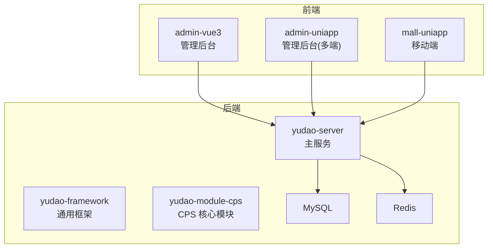
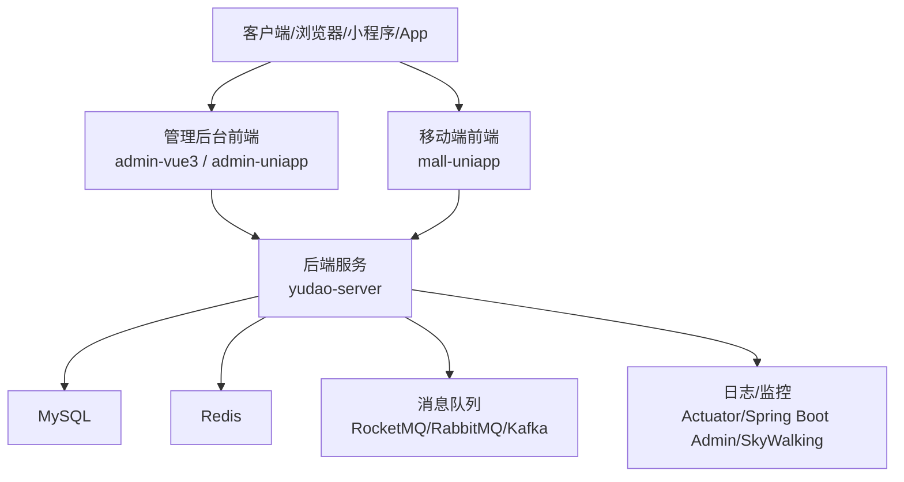
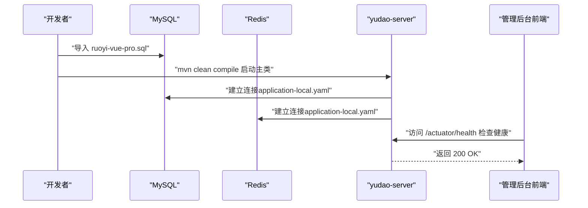
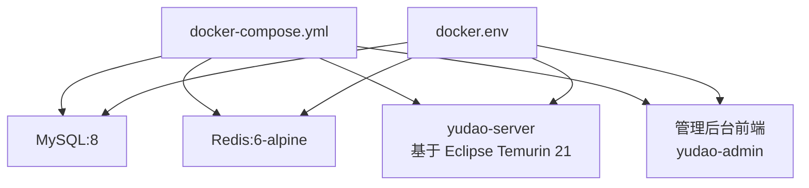
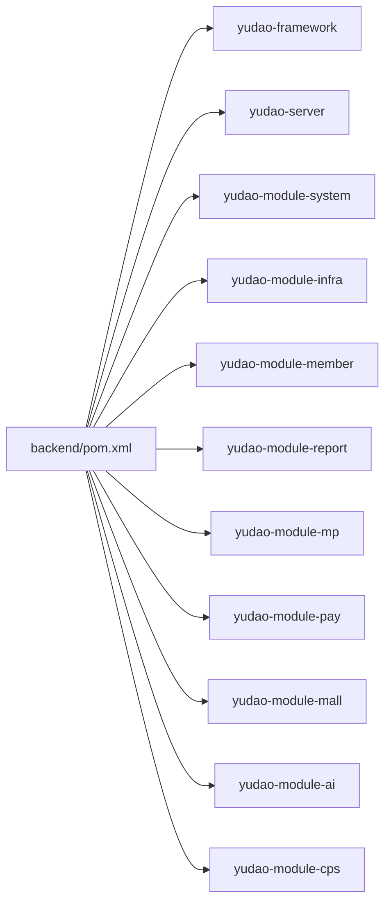

# 快速开始

<cite>
**本文引用的文件**
- [README.md](file://README.md)
- [pom.xml](file://backend/pom.xml)
- [docker-compose.yml](file://backend/script/docker/docker-compose.yml)
- [docker.env](file://backend/script/docker/docker.env)
- [Dockerfile](file://backend/yudao-server/Dockerfile)
- [application-local.yaml](file://backend/yudao-server/src/main/resources/application-local.yaml)
- [ruoyi-vue-pro.sql](file://backend/sql/mysql/ruoyi-vue-pro.sql)
- [package.json（管理后台 uniapp）](file://frontend/admin-uniapp/package.json)
- [vite.config.ts（管理后台 uniapp）](file://frontend/admin-uniapp/vite.config.ts)
- [package.json（管理后台 vue3）](file://frontend/admin-vue3/package.json)
- [package.json（移动端 uniapp）](file://frontend/mall-uniapp/package.json)
- [vite.config.js（移动端 uniapp）](file://frontend/mall-uniapp/vite.config.js)
- [deploy.sh](file://backend/script/shell/deploy.sh)
</cite>

## 目录
1. [简介](#简介)
2. [项目结构](#项目结构)
3. [核心组件](#核心组件)
4. [架构总览](#架构总览)
5. [详细组件分析](#详细组件分析)
6. [依赖关系分析](#依赖关系分析)
7. [性能考虑](#性能考虑)
8. [故障排查指南](#故障排查指南)
9. [结论](#结论)
10. [附录](#附录)

## 简介
AgenticCPS 是一套“开箱即用”的智能 CPS 联盟返利平台，融合 Vibe Coding、低代码与 AI 自主编程，支持多平台（淘宝/京东/拼多多/抖音）返利闭环，提供 MCP AI 接口与可视化报表、工作流等能力。本文面向首次使用者，提供从环境准备到三步启动、Docker 部署、本地开发配置、前端启动与常见问题排查的完整指南。

## 项目结构
- 后端采用 Maven 多模块结构，核心模块包括 yudao-server（主服务）、yudao-module-cps（CPS 核心）、yudao-framework（通用框架）等。
- 前端包含管理后台（admin-vue3）与移动端（admin-uniapp、mall-uniapp）两套应用。
- 提供 Docker Compose 一键拉起 MySQL、Redis、后端服务与管理后台前端的编排方案。

章节来源
- [README.md: 267-302:267-302](file://README.md#L267-L302)
- [pom.xml: 10-25:10-25](file://backend/pom.xml#L10-L25)

## 核心组件
- 后端主服务：yudao-server，负责对外提供 API、定时任务、消息队列、监控等。
- CPS 核心模块：yudao-module-cps，包含平台适配器（淘宝/京东/拼多多/抖音）、订单追踪、返利结算、MCP 接口等。
- 基础框架：yudao-framework，提供安全、缓存、权限、多租户、定时任务、消息队列、监控等通用能力。
- 前端管理后台：admin-vue3（Vue3 + Vite）与 admin-uniapp（UniApp），支持多端构建与 H5 预览。
- 前端移动端：mall-uniapp（UniApp），覆盖 App/H5/小程序等多端。

章节来源
- [README.md: 267-302:267-302](file://README.md#L267-L302)
- [pom.xml: 10-25:10-25](file://backend/pom.xml#L10-L25)

## 架构总览
后端通过 Spring Boot 3.5.9 与多数据源（MySQL）、缓存（Redis）、任务调度（Quartz）、消息队列（RocketMQ/RabbitMQ/Kafka）等组成。前端通过 Vite/UniApp 构建，管理后台支持多端与 H5，移动端覆盖 App/H5/小程序。

图表来源
- [application-local.yaml: 1-L294:1-294](file://backend/yudao-server/src/main/resources/application-local.yaml#L1-L294)
- [Dockerfile: 1-L24:1-24](file://backend/yudao-server/Dockerfile#L1-L24)

章节来源
- [application-local.yaml: 1-L294:1-294](file://backend/yudao-server/src/main/resources/application-local.yaml#L1-L294)
- [Dockerfile: 1-L24:1-24](file://backend/yudao-server/Dockerfile#L1-L24)

## 详细组件分析

### 环境要求
- JDK：17 或 21（推荐 21）
- MySQL：5.7 或 8.0+
- Redis：5.0+
- Maven：3.8+
- Node.js：16+（前端构建）
- 前端包管理器：pnpm（管理后台 uniapp 要求 pnpm>=9；管理后台 vue3 要求 pnpm>=8.6）

章节来源
- [README.md: 307-316:307-316](file://README.md#L307-L316)
- [pom.xml: 34-L44:34-44](file://backend/pom.xml#L34-L44)
- [package.json（管理后台 uniapp）: 25-28:25-28](file://frontend/admin-uniapp/package.json#L25-L28)
- [package.json（管理后台 vue3）: 155-158:155-158](file://frontend/admin-vue3/package.json#L155-L158)

### 三步启动流程
1) 克隆项目
- 使用 Git 克隆后端仓库（参考 README 的三步启动说明）。
- 前端项目位于 frontend 目录，分别对应管理后台与移动端。

2) 初始化数据库
- 导入后端 SQL：backend/sql/mysql/ruoyi-vue-pro.sql
- 根据实际需要，也可导入模块级 SQL（如 CPS 模块的 schema 脚本）
- 确认数据库连接参数与账号密码正确

3) 启动后端
- 使用 Maven 编译并运行主类（yudao-server）
- 默认监听端口 48080，可通过 application-local.yaml 调整

图表来源
- [ruoyi-vue-pro.sql: 1-L200:1-200](file://backend/sql/mysql/ruoyi-vue-pro.sql#L1-L200)
- [application-local.yaml: 1-L294:1-294](file://backend/yudao-server/src/main/resources/application-local.yaml#L1-L294)
- [deploy.sh: 106-143:106-143](file://backend/script/shell/deploy.sh#L106-L143)

章节来源
- [README.md: 317-330:317-330](file://README.md#L317-L330)
- [ruoyi-vue-pro.sql: 1-L200:1-200](file://backend/sql/mysql/ruoyi-vue-pro.sql#L1-L200)
- [application-local.yaml: 1-L294:1-294](file://backend/yudao-server/src/main/resources/application-local.yaml#L1-L294)
- [deploy.sh: 106-143:106-143](file://backend/script/shell/deploy.sh#L106-L143)

### Docker 部署选项
- 使用 docker-compose.yml 一键拉起 MySQL、Redis、后端服务与管理后台前端
- 环境变量通过 docker.env 配置，包含数据库、Redis、后端 JVM 参数与前端构建参数
- 后端镜像基于 Eclipse Temurin 21 JRE，暴露 48080 端口

图表来源
- [docker-compose.yml: 1-L85:1-85](file://backend/script/docker/docker-compose.yml#L1-L85)
- [docker.env: 1-L26:1-26](file://backend/script/docker/docker-compose.yml#L1-L26)
- [Dockerfile: 1-L24:1-24](file://backend/yudao-server/Dockerfile#L1-L24)

章节来源
- [docker-compose.yml: 1-L85:1-85](file://backend/script/docker/docker-compose.yml#L1-L85)
- [docker.env: 1-L26:1-26](file://backend/script/docker/docker-compose.yml#L1-L26)
- [Dockerfile: 1-L24:1-24](file://backend/yudao-server/Dockerfile#L1-L24)

### 本地开发环境配置
- 后端本地配置：application-local.yaml 提供数据库、Redis、定时任务、消息队列、监控等默认配置，可按需调整
- 前端管理后台（admin-uniapp）：Vite 配置支持多端开发，H5 端可通过代理转发到后端 API；支持分包优化与组件自动导入
- 前端管理后台（admin-vue3）：Vite + Vue3，支持多环境构建与预览
- 前端移动端（mall-uniapp）：UniApp 多端构建，支持 App/H5/小程序

章节来源
- [application-local.yaml: 1-L294:1-294](file://backend/yudao-server/src/main/resources/application-local.yaml#L1-L294)
- [vite.config.ts（管理后台 uniapp）: 33-L214:33-214](file://frontend/admin-uniapp/vite.config.ts#L33-L214)
- [package.json（管理后台 uniapp）: 25-28:25-28](file://frontend/admin-uniapp/package.json#L25-L28)
- [package.json（管理后台 vue3）: 155-158:155-158](file://frontend/admin-vue3/package.json#L155-L158)
- [vite.config.js（移动端 uniapp）: 10-L35:10-35](file://frontend/mall-uniapp/vite.config.js#L10-L35)

### 前端应用启动说明
- 管理后台（admin-vue3）
  - Node.js 版本要求：>= 16
  - 使用 pnpm 安装依赖后，通过不同模式脚本启动 dev/build
- 管理后台（admin-uniapp）
  - Node.js 版本要求：>= 20
  - pnpm 版本要求：>= 9
  - 支持多端开发（H5/小程序/App），通过 uni 命令启动
- 移动端（mall-uniapp）
  - 基于 UniApp，支持多端构建与开发

章节来源
- [package.json（管理后台 vue3）: 155-158:155-158](file://frontend/admin-vue3/package.json#L155-L158)
- [package.json（管理后台 uniapp）: 25-28:25-28](file://frontend/admin-uniapp/package.json#L25-L28)
- [package.json（移动端 uniapp）: 1-L104:1-104](file://frontend/mall-uniapp/package.json#L1-L104)

## 依赖关系分析
- 后端模块间依赖：yudao-server 依赖 yudao-framework 与各业务模块（system/infra/member/report/mp/pay/mall/ai/cps 等）
- Maven 编译插件：maven-compiler-plugin、maven-surefire-plugin、flatten-maven-plugin 等
- 源站配置：使用华为云/阿里云 Maven 源提升依赖下载速度

图表来源
- [pom.xml: 10-25:10-25](file://backend/pom.xml#L10-L25)

章节来源
- [pom.xml: 10-25:10-25](file://backend/pom.xml#L10-L25)
- [pom.xml: 145-173:145-173](file://backend/pom.xml#L145-L173)

## 性能考虑
- 搜索与比价：P99 延迟 < 5 秒
- 转链生成：< 1 秒
- 订单同步延迟：< 30 分钟
- 返利入账：平台结算后 24 小时内
- MCP Tool 调用：搜索类 < 3 秒，查询类 < 1 秒

章节来源
- [README.md: 332-341:332-341](file://README.md#L332-L341)

## 故障排查指南
- 后端启动失败（端口占用）
  - 检查 server.port（默认 48080）是否被占用，可在 application-local.yaml 中修改
- 数据库连接失败
  - 核对 datasource.url、username、password 与数据库版本（5.7/8.0+）
  - 确认 MySQL 已导入 ruoyi-vue-pro.sql
- Redis 连接失败
  - 核对 application-local.yaml 中 Redis host/port/password
- 前端无法访问后端 API
  - 管理后台 uniapp：确认 vite.config.ts 中代理配置与后端 API 前缀一致
  - 管理后台 vue3：确认 Vite 环境变量与后端地址一致
- 健康检查失败
  - 使用 curl 访问 /actuator/health，或参考 deploy.sh 的健康检查逻辑

章节来源
- [application-local.yaml: 1-L294:1-294](file://backend/yudao-server/src/main/resources/application-local.yaml#L1-L294)
- [vite.config.ts（管理后台 uniapp）: 185-L200:185-200](file://frontend/admin-uniapp/vite.config.ts#L185-L200)
- [deploy.sh: 106-143:106-143](file://backend/script/shell/deploy.sh#L106-L143)

## 结论
按照本文的环境要求与三步启动流程，结合 Docker 编排或本地开发配置，您可以在最短时间内成功运行 AgenticCPS，体验多平台返利、MCP AI 接口与可视化报表等核心功能。遇到问题时，可依据故障排查指南快速定位并解决。

## 附录
- 后端主服务端口：48080（application-local.yaml）
- Docker 端口映射：后端 48080 → 48080，Redis 6379 → 6379，MySQL 3306 → 3306，管理后台前端 80 → 8080
- 部署脚本：deploy.sh 提供备份、停止、传输、启动与健康检查的自动化流程

章节来源
- [application-local.yaml: 1-L294:1-294](file://backend/yudao-server/src/main/resources/application-local.yaml#L1-L294)
- [docker-compose.yml: 1-L85:1-85](file://backend/script/docker/docker-compose.yml#L1-L85)
- [deploy.sh: 1-L161:1-161](file://backend/script/shell/deploy.sh#L1-L161)