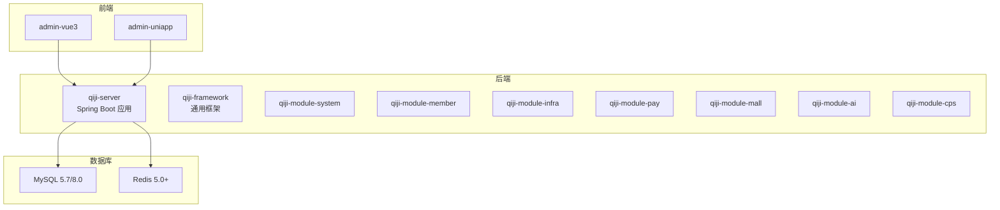
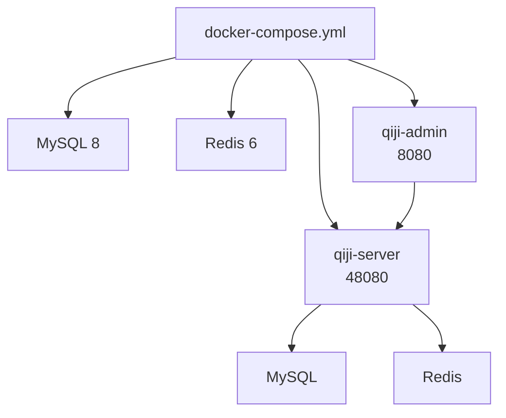
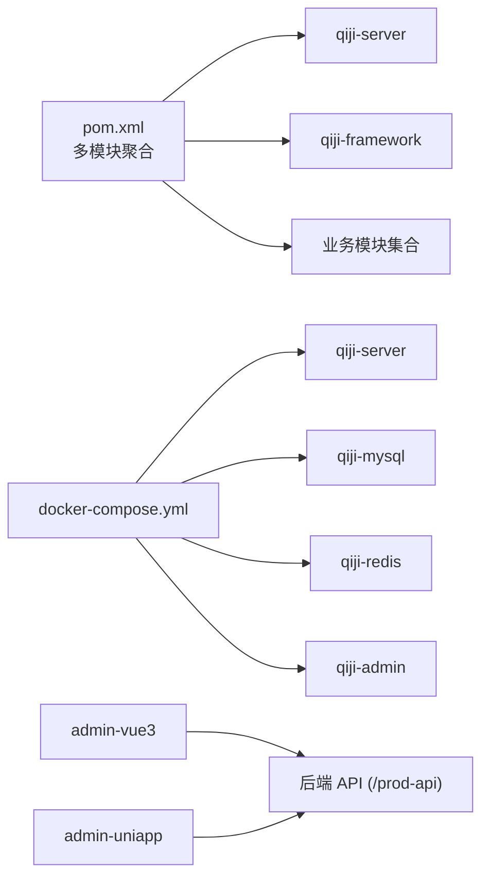

# 快速开始

<cite>
**本文引用的文件**
- [README.md](file://README.md)
- [backend/README.md](file://backend/README.md)
- [frontend/admin-vue3/README.md](file://frontend/admin-vue3/README.md)
- [frontend/admin-uniapp/README.md](file://frontend/admin-uniapp/README.md)
- [backend/script/docker/docker-compose.yml](file://backend/script/docker/docker-compose.yml)
- [backend/script/docker/docker.env](file://backend/script/docker/docker.env)
- [backend/pom.xml](file://backend/pom.xml)
- [backend/qiji-server/Dockerfile](file://backend/qiji-server/Dockerfile)
- [backend/qiji-server/src/main/resources/application-local.yaml](file://backend/qiji-server/src/main/resources/application-local.yaml)
- [frontend/admin-vue3/package.json](file://frontend/admin-vue3/package.json)
- [frontend/admin-uniapp/package.json](file://frontend/admin-uniapp/package.json)
- [backend/sql/mysql/ruoyi-vue-pro.sql](file://backend/sql/mysql/ruoyi-vue-pro.sql)
</cite>

## 目录
1. [简介](#简介)
2. [项目结构](#项目结构)
3. [核心组件](#核心组件)
4. [架构总览](#架构总览)
5. [详细组件分析](#详细组件分析)
6. [依赖关系分析](#依赖关系分析)
7. [性能考虑](#性能考虑)
8. [故障排查指南](#故障排查指南)
9. [结论](#结论)
10. [附录](#附录)

## 简介
AgenticCPS 是一套“开箱即用”的智能 CPS 联盟返利平台，融合 Vibe Coding、低代码与 AI 自主编程理念，支持从搜索到返利提现的完整闭环。本指南面向新手，提供环境要求、三步启动流程、Docker 一键部署、前端启动方式与性能指标参考，帮助你在 30 分钟内成功运行项目。

## 项目结构
- 后端（Spring Boot 3.5.9 + Maven 多模块）
  - 模块：qiji-dependencies、qiji-framework、qiji-server、各业务模块（system、infra、member、report、mp、pay、mall、ai、cps）
  - Docker 化：提供 docker-compose 一键拉起 MySQL 8、Redis 6、后端服务与前端面板
- 前端
  - admin-vue3：Vue3 + Element Plus 管理后台
  - admin-uniapp：基于 uni-app 的移动端跨端管理后台
- 数据库脚本：提供 ruoyi-vue-pro.sql 等初始化脚本

**章节来源**
- [backend/README.md:261-296](file://backend/README.md#L261-L296)
- [README.md:267-302](file://README.md#L267-L302)

## 核心组件
- 后端服务
  - 主服务端：qiji-server（容器化镜像基于 Eclipse Temurin 21 JRE）
  - 多模块：系统管理、基础设施、会员中心、支付、商城、AI、CPS 等
- 前端
  - admin-vue3：Vue3 + Element Plus，pnpm >= 8.6，Node.js >= 16
  - admin-uniapp：Vue3 + uni-app，pnpm >= 9，Node.js >= 20
- 数据库与缓存
  - MySQL 5.7 / 8.0+
  - Redis 5.0+

**章节来源**
- [backend/pom.xml:10-25](file://backend/pom.xml#L10-L25)
- [backend/qiji-server/Dockerfile:3](file://backend/qiji-server/Dockerfile#L3)
- [README.md:309-316](file://README.md#L309-L316)

## 架构总览
后端通过 docker-compose 启动 MySQL、Redis、后端服务与前端面板，前端通过 /prod-api 访问后端接口。

**图表来源**
- [backend/script/docker/docker-compose.yml:1-85](file://backend/script/docker/docker-compose.yml#L1-L85)

**章节来源**
- [backend/script/docker/docker-compose.yml:1-85](file://backend/script/docker/docker-compose.yml#L1-L85)
- [backend/script/docker/docker.env:1-26](file://backend/script/docker/docker.env#L1-L26)

## 详细组件分析

### 环境要求与版本说明
- JDK：17 或 21（推荐 21）
- MySQL：5.7 或 8.0+
- Redis：5.0+
- Maven：3.8+
- Node.js：
  - admin-vue3：>= 16（pnpm >= 8.6）
  - admin-uniapp：>= 20（pnpm >= 9）

**章节来源**
- [README.md:309-316](file://README.md#L309-L316)
- [frontend/admin-vue3/package.json:155-158](file://frontend/admin-vue3/package.json#L155-L158)
- [frontend/admin-uniapp/package.json:25-28](file://frontend/admin-uniapp/package.json#L25-L28)

### 三步启动流程
1) 克隆项目
- 进入 backend 目录
- 参考：[README.md:320-333](file://README.md#L320-L333)

2) 初始化数据库
- 导入主库 SQL：sql/mysql/ruoyi-vue-pro.sql
- 按需导入模块子 SQL（如 CPS 模块）
- 配置 application-local.yaml 中的数据库连接信息（默认指向 127.0.0.1）
- 参考：[backend/qiji-server/src/main/resources/application-local.yaml:50-70](file://backend/qiji-server/src/main/resources/application-local.yaml#L50-L70)、[backend/sql/mysql/ruoyi-vue-pro.sql:1-50](file://backend/sql/mysql/ruoyi-vue-pro.sql#L1-L50)

3) 启动后端
- Maven 编译并运行主类（端口：48080）
- 参考：[README.md:330-333](file://README.md#L330-L333)

**章节来源**
- [README.md:318-333](file://README.md#L318-L333)
- [backend/qiji-server/src/main/resources/application-local.yaml:50-70](file://backend/qiji-server/src/main/resources/application-local.yaml#L50-L70)

### Docker 一键部署
- 进入 backend/script/docker
- 拉起所有服务：docker-compose up -d
- 查看服务日志：docker-compose logs -f server
- 停止服务：docker-compose down
- 端口映射：后端 48080 → 48080，MySQL 3306 → 3306，Redis 6379 → 6379，前端 80 → 8080
- 环境变量：docker.env 中配置数据库、Redis、前端参数
- 参考：[backend/script/docker/docker-compose.yml:1-85](file://backend/script/docker/docker-compose.yml#L1-L85)、[backend/script/docker/docker.env:1-26](file://backend/script/docker/docker.env#L1-L26)

**章节来源**
- [README.md:335-350](file://README.md#L335-L350)
- [backend/script/docker/docker-compose.yml:1-85](file://backend/script/docker/docker-compose.yml#L1-L85)
- [backend/script/docker/docker.env:1-26](file://backend/script/docker/docker.env#L1-L26)

### 前端启动指南
- 管理后台（admin-vue3）
  - 进入 frontend/admin-vue3
  - 安装依赖：pnpm install（Node.js >= 16，pnpm >= 8.6）
  - 启动：pnpm dev
  - 生产打包：pnpm build:prod
  - 参考：[README.md:354-367](file://README.md#L354-L367)、[frontend/admin-vue3/package.json:155-158](file://frontend/admin-vue3/package.json#L155-L158)

- 管理后台（admin-uniapp）
  - 进入 frontend/admin-uniapp
  - 安装依赖：pnpm install（Node.js >= 20，pnpm >= 9）
  - 启动 H5：pnpm dev:h5
  - 生产打包：pnpm build:prod
  - 参考：[README.md:354-367](file://README.md#L354-L367)、[frontend/admin-uniapp/package.json:25-28](file://frontend/admin-uniapp/package.json#L25-L28)

**章节来源**
- [README.md:352-367](file://README.md#L352-L367)
- [frontend/admin-vue3/package.json:155-158](file://frontend/admin-vue3/package.json#L155-L158)
- [frontend/admin-uniapp/package.json:25-28](file://frontend/admin-uniapp/package.json#L25-L28)

### 性能指标参考
- 单平台搜索：P99 < 2 秒
- 多平台比价：P99 < 5 秒
- 转链生成：P99 < 1 秒
- 订单同步延迟：P99 < 30 分钟
- 返利入账：平台结算后 24 小时内
- MCP Tool 调用：搜索类 < 3 秒，查询类 < 1 秒

**章节来源**
- [README.md:369-379](file://README.md#L369-L379)

## 依赖关系分析
- 后端模块依赖
  - qiji-server 依赖 qiji-framework 与各业务模块
  - qiji-framework 提供安全、缓存、权限、多租户等通用能力
- Docker 服务依赖
  - qiji-server 依赖 qiji-mysql 与 qiji-redis
  - qiji-admin 依赖 qiji-server
- 前端依赖
  - admin-vue3：Vue3、Element Plus、TypeScript、Vite 等
  - admin-uniapp：Vue3、uni-app、wot-design-uni、z-paging 等

**图表来源**
- [backend/pom.xml:10-25](file://backend/pom.xml#L10-L25)
- [backend/script/docker/docker-compose.yml:1-85](file://backend/script/docker/docker-compose.yml#L1-L85)

**章节来源**
- [backend/pom.xml:10-25](file://backend/pom.xml#L10-L25)
- [backend/script/docker/docker-compose.yml:1-85](file://backend/script/docker/docker-compose.yml#L1-L85)

## 性能考虑
- 搜索与比价
  - 建议启用缓存与索引优化，控制单平台搜索与多平台比价的 P99 延迟
- 订单同步
  - 使用定时任务与消息队列，确保订单同步延迟不超过 30 分钟
- 转链生成
  - 优化第三方平台接口调用与短链生成逻辑，降低 P99 延迟
- 返利入账
  - 与平台结算时间协同，确保在 24 小时内完成入账
- MCP Tool
  - 对搜索类与查询类接口分别设定调用上限，保障用户体验

**章节来源**
- [README.md:369-379](file://README.md#L369-L379)

## 故障排查指南
- 数据库连接失败
  - 检查 application-local.yaml 中的数据库 URL、用户名、密码
  - 若使用 Docker，确认 docker.env 中 MASTER/SLAVE 数据源配置一致
  - 参考：[backend/qiji-server/src/main/resources/application-local.yaml:50-70](file://backend/qiji-server/src/main/resources/application-local.yaml#L50-L70)、[backend/script/docker/docker.env:8-14](file://backend/script/docker/docker.env#L8-L14)
- Redis 连接异常
  - 确认 Redis 地址与端口，必要时调整 application-local.yaml 中的 Redis 配置
  - 参考：[backend/qiji-server/src/main/resources/application-local.yaml:80-87](file://backend/qiji-server/src/main/resources/application-local.yaml#L80-L87)
- 前端无法访问后端接口
  - 确认前端环境变量 VUE_APP_BASE_API 指向 /prod-api
  - 参考：[backend/script/docker/docker.env:20](file://backend/script/docker/docker.env#L20)
- Docker 服务启动失败
  - 查看后端服务日志：docker-compose logs -f server
  - 检查端口占用与网络连通性
  - 参考：[backend/script/docker/docker-compose.yml:35-56](file://backend/script/docker/docker-compose.yml#L35-L56)

**章节来源**
- [backend/qiji-server/src/main/resources/application-local.yaml:50-87](file://backend/qiji-server/src/main/resources/application-local.yaml#L50-L87)
- [backend/script/docker/docker.env:8-20](file://backend/script/docker/docker.env#L8-L20)
- [backend/script/docker/docker-compose.yml:35-56](file://backend/script/docker/docker-compose.yml#L35-L56)

## 结论
通过本快速开始指南，你可以：
- 明确环境要求与版本约束
- 在 30 分钟内完成三步启动（克隆 → 初始化数据库 → 启动后端）
- 使用 Docker 一键部署后端与前端
- 分别启动 admin-vue3 与 admin-uniapp 前端
- 依据性能指标进行优化与监控

## 附录
- 后端主服务端镜像基于 Eclipse Temurin 21 JRE，容器暴露 48080 端口
  - 参考：[backend/qiji-server/Dockerfile:3](file://backend/qiji-server/Dockerfile#L3)
- 数据库初始化脚本位于 sql/mysql/ruoyi-vue-pro.sql
  - 参考：[backend/sql/mysql/ruoyi-vue-pro.sql:1-50](file://backend/sql/mysql/ruoyi-vue-pro.sql#L1-L50)