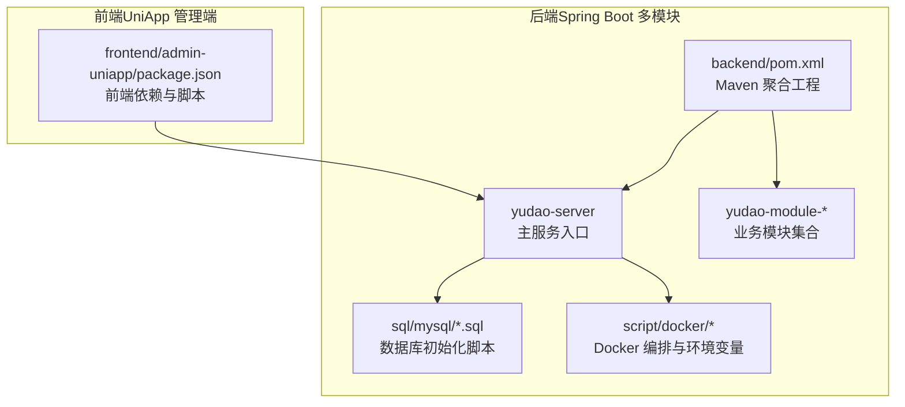
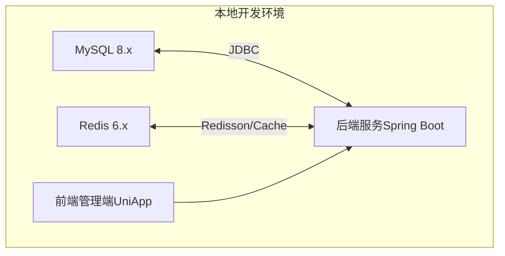
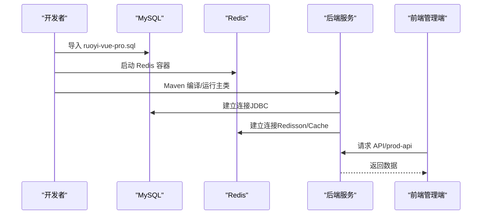
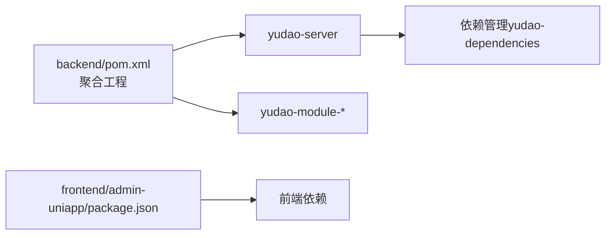

# 快速开始

<cite>
**本文引用的文件**   
- [README.md](file://README.md)
- [pom.xml](file://backend/pom.xml)
- [ruoyi-vue-pro.sql](file://backend/sql/mysql/ruoyi-vue-pro.sql)
- [docker-compose.yml](file://backend/script/docker/docker-compose.yml)
- [docker.env](file://backend/script/docker/docker.env)
- [YudaoServerApplication.java](file://backend/yudao-server/src/main/java/cn/iocoder/yudao/server/YudaoServerApplication.java)
- [package.json](file://frontend/admin-uniapp/package.json)
- [settings.local.json](file://.claude/settings.local.json)
</cite>

## 目录
1. [简介](#简介)
2. [项目结构](#项目结构)
3. [核心组件](#核心组件)
4. [架构概览](#架构概览)
5. [详细组件分析](#详细组件分析)
6. [依赖分析](#依赖分析)
7. [性能考虑](#性能考虑)
8. [故障排除指南](#故障排除指南)
9. [结论](#结论)
10. [附录](#附录)

## 简介
本指南面向初学者，帮助你在本地快速搭建并运行 AgenticCPS 项目。内容涵盖环境要求、三步启动流程（克隆项目、初始化数据库、启动后端服务）、开发环境配置、常用命令与配置说明，以及常见问题排查方法。目标是让你从零开始，顺利启动后端服务，并为后续前端开发打下基础。

## 项目结构
AgenticCPS 采用前后端分离架构，后端基于 Spring Boot 多模块工程，前端提供多个可选的管理端与移动端模板。仓库包含后端 Maven 工程、前端 UniApp 管理端、SQL 初始化脚本、以及 Docker 编排文件等。

**图表来源**
- [pom.xml:10-24](file://backend/pom.xml#L10-L24)
- [docker-compose.yml:1-85](file://backend/script/docker/docker-compose.yml#L1-L85)
- [package.json:25-98](file://frontend/admin-uniapp/package.json#L25-L98)

**章节来源**
- [README.md: 267-302:267-302](file://README.md#L267-L302)
- [pom.xml: 10-24:10-24](file://backend/pom.xml#L10-L24)
- [docker-compose.yml: 1-85:1-85](file://backend/script/docker/docker-compose.yml#L1-L85)
- [package.json: 25-98:25-98](file://frontend/admin-uniapp/package.json#L25-L98)

## 核心组件
- 后端主服务入口：Spring Boot 启动类，负责加载模块与运行服务。
- 数据库初始化脚本：包含基础设施与系统基础表结构，用于首次启动。
- Docker 编排：一键拉起 MySQL、Redis 与后端服务，便于本地快速验证。
- 前端管理端：基于 UniApp 的管理后台，提供开发与调试入口。

**章节来源**
- [YudaoServerApplication.java: 15-28:15-28](file://backend/yudao-server/src/main/java/cn/iocoder/yudao/server/YudaoServerApplication.java#L15-L28)
- [ruoyi-vue-pro.sql: 17-200:17-200](file://backend/sql/mysql/ruoyi-vue-pro.sql#L17-L200)
- [docker-compose.yml: 5-57:5-57](file://backend/script/docker/docker-compose.yml#L5-L57)
- [package.json: 29-98:29-98](file://frontend/admin-uniapp/package.json#L29-L98)

## 架构概览
后端通过 Maven 多模块组织，主服务模块负责装配与启动；数据库与缓存通过 Docker 编排统一管理；前端通过包管理工具安装依赖并启动开发服务器。

**图表来源**
- [docker-compose.yml: 6-28:6-28](file://backend/script/docker/docker-compose.yml#L6-L28)
- [docker.env: 1-26:1-26](file://backend/script/docker/docker.env#L1-L26)
- [pom.xml: 30-44:30-44](file://backend/pom.xml#L30-L44)

## 详细组件分析

### 环境要求
- JDK：17 或 21
- MySQL：5.7 或 8.0+
- Redis：5.0+
- Maven：3.8+
- Node.js：16+（前端构建）

上述版本要求来自项目文档与后端工程配置。

**章节来源**
- [README.md: 307-316:307-316](file://README.md#L307-L316)
- [pom.xml: 30-44:30-44](file://backend/pom.xml#L30-L44)
- [package.json: 25-28:25-28](file://frontend/admin-uniapp/package.json#L25-L28)

### 三步启动流程
1) 克隆项目  
   使用 Git 克隆后端仓库到本地目录。

2) 初始化数据库  
   - 使用数据库客户端导入 SQL 脚本：  
     - 基础脚本：backend/sql/mysql/ruoyi-vue-pro.sql  
     - 可选模块脚本：backend/sql/mysql/ 下的模块相关 SQL（如需启用特定模块）
   - 若使用 Docker，可直接参考 docker-compose.yml 的初始化卷挂载，容器启动时会自动执行初始化脚本。

3) 启动后端服务  
   - 本地启动：在后端根目录执行 Maven 编译与打包命令，然后运行 Spring Boot 主类。
   - Docker 启动：在 backend/script/docker 目录执行 docker-compose 命令，等待服务启动。

**图表来源**
- [ruoyi-vue-pro.sql: 17-200:17-200](file://backend/sql/mysql/ruoyi-vue-pro.sql#L17-L200)
- [docker-compose.yml: 6-28:6-28](file://backend/script/docker/docker-compose.yml#L6-L28)
- [YudaoServerApplication.java: 19-24:19-24](file://backend/yudao-server/src/main/java/cn/iocoder/yudao/server/YudaoServerApplication.java#L19-L24)

**章节来源**
- [README.md: 317-330:317-330](file://README.md#L317-L330)
- [docker-compose.yml: 18-18:18-18](file://backend/script/docker/docker-compose.yml#L18-L18)
- [YudaoServerApplication.java: 19-24:19-24](file://backend/yudao-server/src/main/java/cn/iocoder/yudao/server/YudaoServerApplication.java#L19-L24)

### 开发环境配置步骤
- 后端（Maven + Spring Boot）
  - 设置 JAVA_VERSION 为 17 或 21，确保 Maven 使用对应 JDK。
  - 在后端根目录执行 Maven 编译与打包命令，然后运行主类。
  - 若使用 Docker，可在 backend/script/docker 目录设置 docker.env 中的数据库与缓存连接参数，再执行 docker-compose up。

- 前端（UniApp 管理端）
  - Node.js 版本需满足 package.json 中 engines 字段要求（>=20）。
  - 使用包管理器安装依赖后，可通过 npm scripts 启动不同平台的开发模式（如 dev:h5、dev:mp-weixin 等）。
  - 若需要 Claude 工具访问前端目录，可参考 .claude/settings.local.json 的权限配置。

**章节来源**
- [pom.xml: 30-44:30-44](file://backend/pom.xml#L30-L44)
- [package.json: 25-98:25-98](file://frontend/admin-uniapp/package.json#L25-L98)
- [.claude/settings.local.json: 1-8:1-8](file://.claude/settings.local.json#L1-L8)

### 配置文件说明
- 后端主配置（Spring Boot）
  - application.yaml：默认配置
  - application-local.yaml / application-dev.yaml：本地与开发环境配置
  - yudao-server 模块包含这些配置文件，用于切换环境与加载模块

- Docker 环境变量
  - docker.env：集中定义数据库、缓存、前端参数等环境变量
  - docker-compose.yml：声明 MySQL、Redis、后端与前端镜像及端口映射

- 前端包管理与脚本
  - package.json：定义 Node.js 与 pnpm 版本要求、脚本命令、依赖项
  - 前端通过 uni 命令启动多端开发（H5、小程序、App 等）

**章节来源**
- [docker.env: 1-26:1-26](file://backend/script/docker/docker.env#L1-L26)
- [docker-compose.yml: 1-L57:1-57](file://backend/script/docker/docker-compose.yml#L1-L57)
- [package.json: 25-98:25-98](file://frontend/admin-uniapp/package.json#L25-L98)

### 常见启动问题排查
- 数据库连接失败
  - 检查 MySQL 是否正常运行且端口开放
  - 核对后端数据源连接串与账号密码（可参考 docker.env 中的 MASTER_DATASOURCE_* 配置）
  - 若使用 Docker，确认容器网络与端口映射正确

- 缓存连接失败
  - 检查 Redis 是否运行，端口是否映射
  - 核对后端 Redis 主机与端口配置

- 启动类无法运行
  - 确认已使用 JDK 17 或 21
  - 确认 Maven 编译通过，主类路径正确

- 前端依赖安装失败
  - 确认 Node.js 版本满足 engines 要求
  - 使用包管理器安装依赖后再启动开发脚本

**章节来源**
- [docker.env: 8-14:8-14](file://backend/script/docker/docker.env#L8-L14)
- [docker-compose.yml: 47-53:47-53](file://backend/script/docker/docker-compose.yml#L47-L53)
- [package.json: 25-28:25-28](file://frontend/admin-uniapp/package.json#L25-L28)
- [YudaoServerApplication.java: 15-28:15-28](file://backend/yudao-server/src/main/java/cn/iocoder/yudao/server/YudaoServerApplication.java#L15-L28)

## 依赖分析
后端通过 Maven 聚合工程管理模块，统一版本与插件配置；前端通过包管理器管理依赖与脚本。

**图表来源**
- [pom.xml: 10-24:10-24](file://backend/pom.xml#L10-L24)
- [pom.xml: 46-56:46-56](file://backend/pom.xml#L46-L56)
- [package.json: 99-177:99-177](file://frontend/admin-uniapp/package.json#L99-L177)

**章节来源**
- [pom.xml: 10-24:10-24](file://backend/pom.xml#L10-L24)
- [pom.xml: 46-56:46-56](file://backend/pom.xml#L46-L56)
- [package.json: 99-177:99-177](file://frontend/admin-uniapp/package.json#L99-L177)

## 性能考虑
- 搜索与比价：单平台搜索 < 2 秒（P99），多平台比价 < 5 秒（P99）
- 转链生成：< 1 秒
- 订单同步延迟：< 30 分钟
- 返利入账：平台结算后 24 小时内
- MCP Tool 调用：搜索类 < 3 秒，查询类 < 1 秒

以上指标用于指导开发与压测方向，确保系统在高并发场景下的稳定性与响应速度。

**章节来源**
- [README.md: 332-341:332-341](file://README.md#L332-L341)

## 故障排除指南
- 启动类日志提示“请阅读快速开始文档”
  - 参考后端启动类注释中的文档链接，逐项检查环境与配置

- 数据库初始化失败
  - 确认 SQL 文件路径与数据库字符集设置
  - 若使用 Docker，确认初始化脚本挂载路径与只读权限

- 前端开发端口占用
  - 更改 package.json 中的 dev:* 脚本端口或释放占用端口

- Docker 无法拉取镜像
  - 切换国内镜像源或使用本地已有镜像

**章节来源**
- [YudaoServerApplication.java: 9-11:9-11](file://backend/yudao-server/src/main/java/cn/iocoder/yudao/server/YudaoServerApplication.java#L9-L11)
- [docker-compose.yml: 18-18:18-18](file://backend/script/docker/docker-compose.yml#L18-L18)
- [package.json: 41-58:41-58](file://frontend/admin-uniapp/package.json#L41-L58)

## 结论
按照本指南的环境准备、三步启动与配置说明，你可以快速在本地完成 AgenticCPS 的后端与数据库初始化，并通过 Docker 或本地方式启动服务。随后可进入前端开发阶段，结合文档与脚本命令完成多端调试与联调。遇到问题时，可依据故障排除章节逐步定位并解决。

## 附录
- 快速命令摘要（示例）
  - 克隆后端仓库
  - 导入 SQL 脚本
  - Maven 编译与运行主类
  - Docker 启动（可选）
  - 前端安装依赖与启动开发脚本

- 参考文件
  - 后端启动类：YudaoServerApplication.java
  - 数据库脚本：ruoyi-vue-pro.sql
  - Docker 编排：docker-compose.yml 与 docker.env
  - 前端脚本：frontend/admin-uniapp/package.json

**章节来源**
- [README.md: 317-330:317-330](file://README.md#L317-L330)
- [YudaoServerApplication.java: 19-24:19-24](file://backend/yudao-server/src/main/java/cn/iocoder/yudao/server/YudaoServerApplication.java#L19-L24)
- [docker-compose.yml: 18-18:18-18](file://backend/script/docker/docker-compose.yml#L18-L18)
- [package.json: 29-98:29-98](file://frontend/admin-uniapp/package.json#L29-L98)