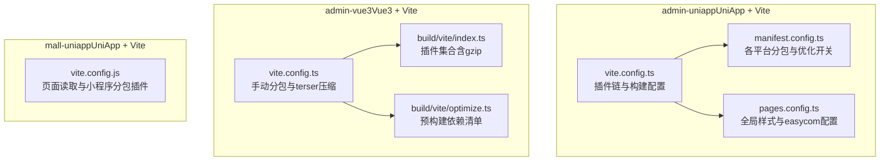
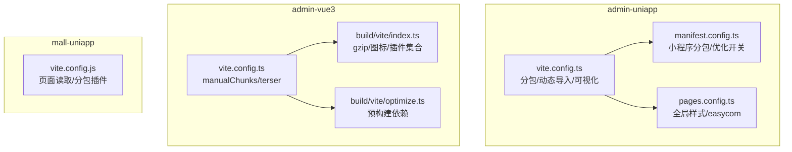
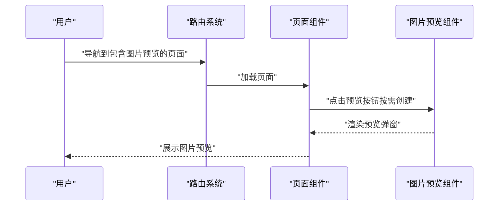
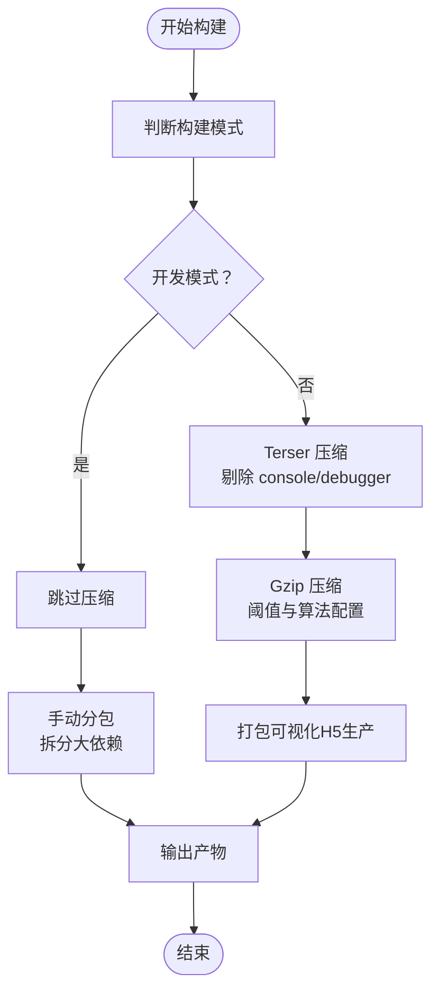
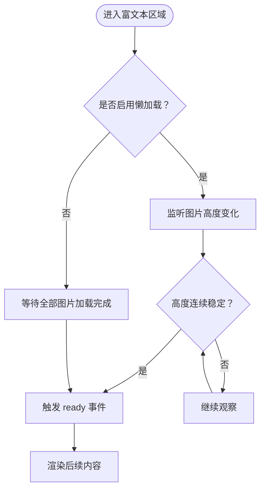
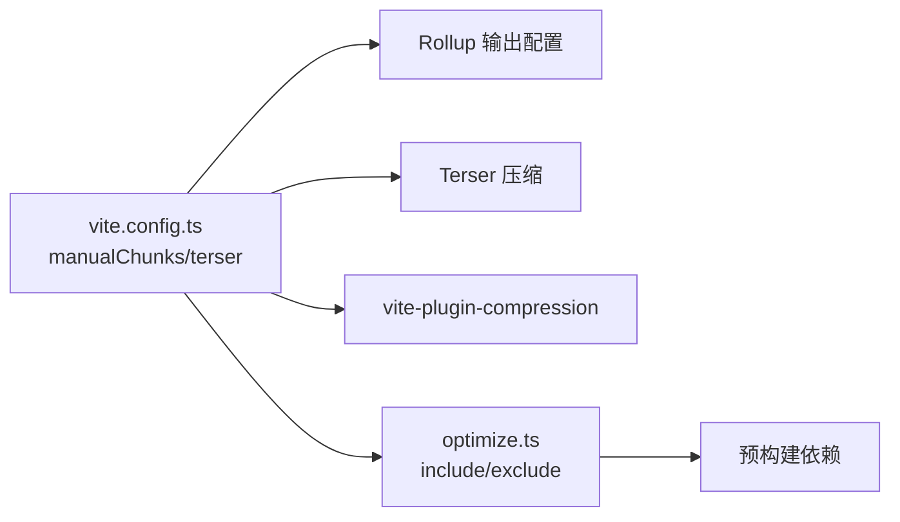

# 前端性能优化

<cite>
**本文引用的文件**   
- [vite.config.ts](file://frontend/admin-uniapp/vite.config.ts)
- [manifest.config.ts](file://frontend/admin-uniapp/manifest.config.ts)
- [pages.config.ts](file://frontend/admin-uniapp/pages.config.ts)
- [vite.config.ts](file://frontend/admin-vue3/vite.config.ts)
- [index.ts](file://frontend/admin-vue3/build/vite/index.ts)
- [optimize.ts](file://frontend/admin-vue3/build/vite/optimize.ts)
- [vite.config.js](file://frontend/mall-uniapp/vite.config.js)
- [index.ts](file://frontend/admin-vue3/src/router/index.ts)
- [ImageViewer.vue](file://frontend/admin-vue3/src/components/ImageViewer/src/ImageViewer.vue)
- [index.ts](file://frontend/admin-vue3/src/components/ImageViewer/index.ts)
- [mp-html.vue](file://frontend/mall-uniapp/uni_modules/mp-html/components/mp-html/mp-html.vue)
</cite>

## 目录
1. [简介](#简介)
2. [项目结构](#项目结构)
3. [核心组件](#核心组件)
4. [架构总览](#架构总览)
5. [详细组件分析](#详细组件分析)
6. [依赖分析](#依赖分析)
7. [性能考量](#性能考量)
8. [故障排查指南](#故障排查指南)
9. [结论](#结论)
10. [附录](#附录)

## 简介
本指南聚焦于前端性能优化，结合仓库中的实际配置与实现，系统阐述以下主题：
- 代码分割策略：路由级代码分割、动态导入与懒加载
- 资源压缩技术：Webpack/Vite 配置、静态资源优化与 Gzip 压缩
- 组件懒加载：虚拟滚动、图片懒加载与按需加载策略
- CDN 使用配置：静态资源分发、缓存策略与回源配置
- 移动端优化方案：UniApp 性能优化、WebView 加速与网络请求优化
- 性能监控工具使用、页面加载时间分析与用户体验优化建议

## 项目结构
本仓库包含多个前端工程，其中与性能优化直接相关的关键工程如下：
- admin-uniapp（基于 Vite + UniApp）：包含路由分包、动态导入、组件自动导入、打包可视化与源码映射控制等配置
- admin-vue3（基于 Vite + Vue3）：包含手动分包、第三方依赖预构建、Gzip 压缩、Top-Level Await 等优化
- mall-uniapp（基于 Vite + UniApp）：包含页面读取插件、小程序分包配置与开发服务器配置

**图表来源**
- [vite.config.ts:64-212](file://frontend/admin-uniapp/vite.config.ts#L64-L212)
- [manifest.config.ts:24-164](file://frontend/admin-uniapp/manifest.config.ts#L24-L164)
- [pages.config.ts:4-23](file://frontend/admin-uniapp/pages.config.ts#L4-L23)
- [vite.config.ts:65-86](file://frontend/admin-vue3/vite.config.ts#L65-L86)
- [index.ts:19-99](file://frontend/admin-vue3/build/vite/index.ts#L19-L99)
- [optimize.ts:1-125](file://frontend/admin-vue3/build/vite/optimize.ts#L1-L125)
- [vite.config.js:10-34](file://frontend/mall-uniapp/vite.config.js#L10-L34)

**章节来源**
- [vite.config.ts:64-212](file://frontend/admin-uniapp/vite.config.ts#L64-L212)
- [manifest.config.ts:24-164](file://frontend/admin-uniapp/manifest.config.ts#L24-L164)
- [pages.config.ts:4-23](file://frontend/admin-uniapp/pages.config.ts#L4-L23)
- [vite.config.ts:65-86](file://frontend/admin-vue3/vite.config.ts#L65-L86)
- [index.ts:19-99](file://frontend/admin-vue3/build/vite/index.ts#L19-L99)
- [optimize.ts:1-125](file://frontend/admin-vue3/build/vite/optimize.ts#L1-L125)
- [vite.config.js:10-34](file://frontend/mall-uniapp/vite.config.js#L10-L34)

## 核心组件
- 代码分割与动态导入
  - admin-uniapp 通过分包插件与优化插件实现模块异步跨包调用与组件异步跨包引用，减少首屏体积并提升加载速度
  - admin-vue3 通过手动分包配置将大体积依赖（如图表库）拆分为独立 chunk，降低主包体积
- 资源压缩与静态资源优化
  - admin-vue3 使用 gzip 压缩插件对产物进行压缩，并通过 Terser 控制 console 与 debugger 的剔除
  - admin-uniapp 在生产环境对 H5 平台启用打包可视化，辅助定位体积热点
- 组件懒加载与按需加载
  - admin-vue3 提供图片预览组件按需创建与挂载，避免不必要的初始化
  - mall-uniapp 的富文本组件支持图片懒加载与 ready 触发逻辑，优化渲染性能
- CDN 与缓存策略
  - 通过 manifest 配置与 base 路径设置，结合 CDN 分发静态资源，配合浏览器缓存与服务端缓存头策略
- 移动端优化
  - UniApp 平台分包配置、小程序优化开关与平台特定设置，结合 WebView 渲染优化与网络请求节流

**章节来源**
- [vite.config.ts:84-94](file://frontend/admin-uniapp/vite.config.ts#L84-L94)
- [vite.config.ts:76-84](file://frontend/admin-vue3/vite.config.ts#L76-L84)
- [index.ts:82-89](file://frontend/admin-vue3/build/vite/index.ts#L82-L89)
- [vite.config.ts:70-75](file://frontend/admin-vue3/vite.config.ts#L70-L75)
- [vite.config.ts:139-146](file://frontend/admin-uniapp/vite.config.ts#L139-L146)
- [manifest.config.ts:120-137](file://frontend/admin-uniapp/manifest.config.ts#L120-L137)
- [ImageViewer.vue:1-36](file://frontend/admin-vue3/src/components/ImageViewer/src/ImageViewer.vue#L1-L36)
- [index.ts:1-33](file://frontend/admin-vue3/src/components/ImageViewer/index.ts#L1-L33)
- [mp-html.vue:332-357](file://frontend/mall-uniapp/uni_modules/mp-html/components/mp-html/mp-html.vue#L332-L357)

## 架构总览
下图展示三个前端工程的构建与优化关键路径，以及与性能相关的配置点。

**图表来源**
- [vite.config.ts:64-212](file://frontend/admin-uniapp/vite.config.ts#L64-L212)
- [manifest.config.ts:24-164](file://frontend/admin-uniapp/manifest.config.ts#L24-L164)
- [pages.config.ts:4-23](file://frontend/admin-uniapp/pages.config.ts#L4-L23)
- [vite.config.ts:65-86](file://frontend/admin-vue3/vite.config.ts#L65-L86)
- [index.ts:19-99](file://frontend/admin-vue3/build/vite/index.ts#L19-L99)
- [optimize.ts:1-125](file://frontend/admin-vue3/build/vite/optimize.ts#L1-L125)
- [vite.config.js:10-34](file://frontend/mall-uniapp/vite.config.js#L10-L34)

## 详细组件分析

### 代码分割与动态导入（路由级与组件级）
- 路由级代码分割与动态导入
  - admin-uniapp 通过分包优化插件与页面插件，将不同业务模块（如系统管理、基础设施、工作流程）拆分为独立分包，实现按需加载
  - 该策略显著降低首屏加载的 JS 体积，提升首屏渲染速度
- 组件级动态导入与懒加载
  - admin-vue3 的图片预览组件采用按需创建与挂载，仅在需要时渲染，避免常驻内存
  - mall-uniapp 富文本组件支持图片懒加载与 ready 触发，减少初始渲染压力

**图表来源**
- [index.ts:1-37](file://frontend/admin-vue3/src/router/index.ts#L1-L37)
- [ImageViewer.vue:1-36](file://frontend/admin-vue3/src/components/ImageViewer/src/ImageViewer.vue#L1-L36)
- [index.ts:1-33](file://frontend/admin-vue3/src/components/ImageViewer/index.ts#L1-L33)

**章节来源**
- [vite.config.ts:71-94](file://frontend/admin-uniapp/vite.config.ts#L71-L94)
- [manifest.config.ts:120-137](file://frontend/admin-uniapp/manifest.config.ts#L120-L137)
- [index.ts:1-37](file://frontend/admin-vue3/src/router/index.ts#L1-L37)
- [ImageViewer.vue:1-36](file://frontend/admin-vue3/src/components/ImageViewer/src/ImageViewer.vue#L1-L36)
- [index.ts:1-33](file://frontend/admin-vue3/src/components/ImageViewer/index.ts#L1-L33)

### 资源压缩与静态资源优化
- Gzip 压缩与体积分析
  - admin-vue3 使用 gzip 压缩插件对产物进行压缩，阈值与算法可配置；同时通过 Terser 剔除 console 与 debugger，减小体积
  - admin-uniapp 在 H5 生产环境启用打包可视化，便于识别体积热点与重复依赖
- 预构建与手动分包
  - admin-vue3 对大体积依赖（如图表库）进行手动分包，避免被主包引用导致体积膨胀
  - admin-vue3 的预构建清单集中管理第三方依赖，提升二次构建速度

**图表来源**
- [vite.config.ts:65-86](file://frontend/admin-vue3/vite.config.ts#L65-L86)
- [index.ts:82-89](file://frontend/admin-vue3/build/vite/index.ts#L82-L89)
- [vite.config.ts:139-146](file://frontend/admin-uniapp/vite.config.ts#L139-L146)

**章节来源**
- [vite.config.ts:65-86](file://frontend/admin-vue3/vite.config.ts#L65-L86)
- [index.ts:82-89](file://frontend/admin-vue3/build/vite/index.ts#L82-L89)
- [vite.config.ts:139-146](file://frontend/admin-uniapp/vite.config.ts#L139-L146)

### 组件懒加载与按需加载策略
- 图片懒加载与 ready 触发
  - mall-uniapp 富文本组件根据图片加载状态与高度变化触发 ready 事件，避免过早渲染造成的布局抖动
- 组件按需创建
  - admin-vue3 图片预览组件仅在用户交互时创建与挂载，减少常驻内存与初始化成本

**图表来源**
- [mp-html.vue:332-357](file://frontend/mall-uniapp/uni_modules/mp-html/components/mp-html/mp-html.vue#L332-L357)

**章节来源**
- [mp-html.vue:332-357](file://frontend/mall-uniapp/uni_modules/mp-html/components/mp-html/mp-html.vue#L332-L357)
- [ImageViewer.vue:1-36](file://frontend/admin-vue3/src/components/ImageViewer/src/ImageViewer.vue#L1-L36)
- [index.ts:1-33](file://frontend/admin-vue3/src/components/ImageViewer/index.ts#L1-L33)

### CDN 使用配置与缓存策略
- 静态资源分发与基础路径
  - 通过配置 base 与各平台 manifest，结合 CDN 域名，实现静态资源的就近分发
- 缓存与回源
  - 建议对静态资源设置长缓存（如强缓存与 ETag），对 HTML 设置较短缓存或协商缓存；对版本化资源（带哈希）采用永久缓存
  - 回源策略应区分静态资源与动态接口，确保缓存命中率与数据新鲜度平衡

[本节为通用实践说明，无需具体文件分析]

### 移动端优化方案（UniApp、WebView 与网络请求）
- UniApp 分包与平台优化
  - 通过 manifest 中的小程序分包开关与平台特定设置，减少首屏包体并提升启动速度
- WebView 加速与网络请求优化
  - 合理使用分包与懒加载，避免一次性加载过多资源；对网络请求进行去抖与合并，减少请求数量与带宽占用

**章节来源**
- [manifest.config.ts:120-137](file://frontend/admin-uniapp/manifest.config.ts#L120-L137)
- [vite.config.ts:71-94](file://frontend/admin-uniapp/vite.config.ts#L71-L94)

## 依赖分析
- admin-vue3 的构建依赖关系
  - 手动分包依赖于 Rollup 的 output.manualChunks 配置
  - Gzip 压缩依赖于 vite-plugin-compression 插件
  - 预构建依赖于 optimizeDeps.include/exclude 清单

**图表来源**
- [vite.config.ts:65-86](file://frontend/admin-vue3/vite.config.ts#L65-L86)
- [index.ts:82-89](file://frontend/admin-vue3/build/vite/index.ts#L82-L89)
- [optimize.ts:1-125](file://frontend/admin-vue3/build/vite/optimize.ts#L1-L125)

**章节来源**
- [vite.config.ts:65-86](file://frontend/admin-vue3/vite.config.ts#L65-L86)
- [index.ts:82-89](file://frontend/admin-vue3/build/vite/index.ts#L82-L89)
- [optimize.ts:1-125](file://frontend/admin-vue3/build/vite/optimize.ts#L1-L125)

## 性能考量
- 代码分割与动态导入
  - 优先将大体积依赖与非首屏模块拆分，结合路由级分包，降低首屏 JS 体积
- 资源压缩
  - 在生产环境启用 Gzip/Brotli 压缩，合理设置阈值；对开发环境关闭压缩以提升构建速度
- 组件懒加载
  - 图片与富文本组件采用懒加载与 ready 触发，避免阻塞主线程
- CDN 与缓存
  - 静态资源版本化与长缓存策略结合，HTML 与接口缓存策略差异化
- 移动端
  - UniApp 分包与平台优化开关配合 WebView 渲染优化，减少白屏与卡顿

[本节为通用指导，无需具体文件分析]

## 故障排查指南
- 构建体积异常增大
  - 检查 manualChunks 配置是否正确拆分大依赖；确认 gzip 插件已启用且阈值合理
- 首屏加载缓慢
  - 检查路由分包与动态导入是否生效；确认图片懒加载与 ready 触发逻辑正常
- 开发调试困难
  - 确认 esbuild 或 terser 的 console/debugger 剔除配置；必要时开启 sourcemap 以便定位问题

**章节来源**
- [vite.config.ts:65-86](file://frontend/admin-vue3/vite.config.ts#L65-L86)
- [index.ts:82-89](file://frontend/admin-vue3/build/vite/index.ts#L82-L89)
- [vite.config.ts:201-211](file://frontend/admin-uniapp/vite.config.ts#L201-L211)

## 结论
通过在 admin-uniapp 与 admin-vue3 工程中实施分包与动态导入、Gzip 压缩、组件懒加载与 CDN 缓存策略，并结合 UniApp 平台优化与移动端 WebView 加速，可显著提升页面加载速度与用户体验。建议持续利用打包可视化与性能监控工具，定期评估与迭代优化策略。

[本节为总结性内容，无需具体文件分析]

## 附录
- 关键配置要点速览
  - admin-uniapp：分包优化插件、页面插件、打包可视化、动态导入与组件异步跨包引用
  - admin-vue3：manualChunks、terserOptions、vite-plugin-compression、optimizeDeps
  - mall-uniapp：页面读取插件、小程序分包插件、开发服务器配置

**章节来源**
- [vite.config.ts:64-212](file://frontend/admin-uniapp/vite.config.ts#L64-L212)
- [vite.config.ts:65-86](file://frontend/admin-vue3/vite.config.ts#L65-L86)
- [index.ts:82-89](file://frontend/admin-vue3/build/vite/index.ts#L82-L89)
- [optimize.ts:1-125](file://frontend/admin-vue3/build/vite/optimize.ts#L1-L125)
- [vite.config.js:10-34](file://frontend/mall-uniapp/vite.config.js#L10-L34)