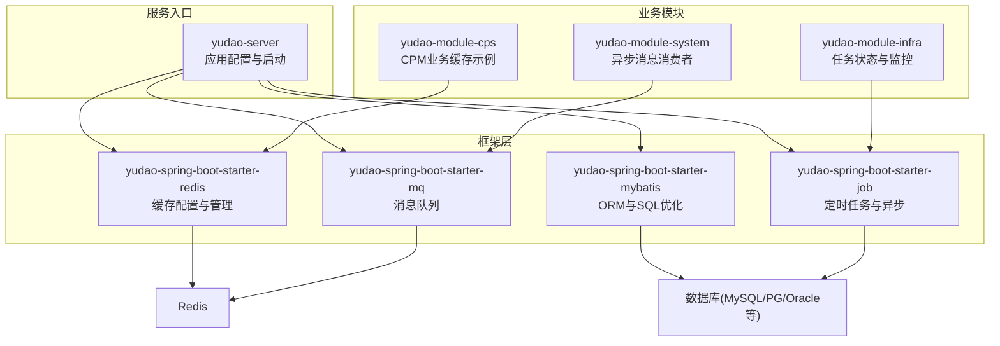
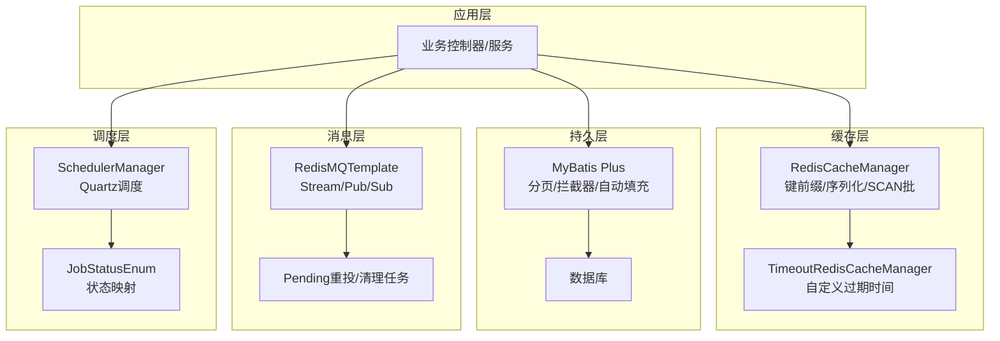
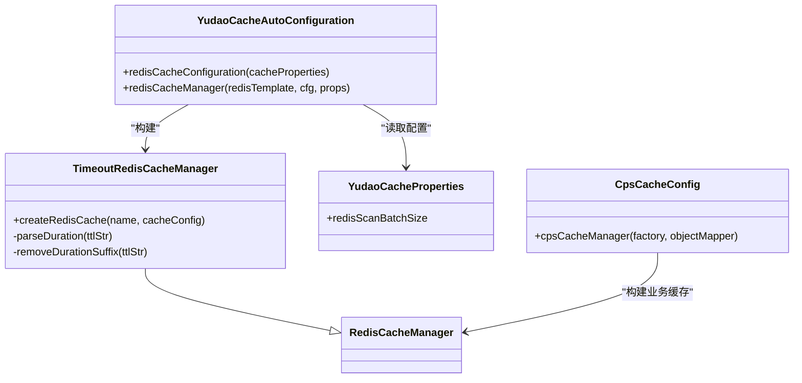
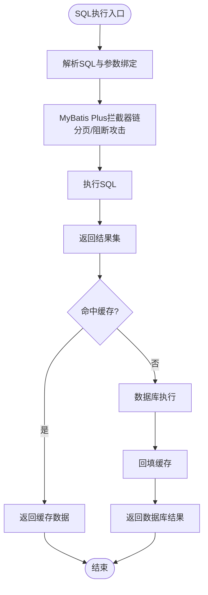
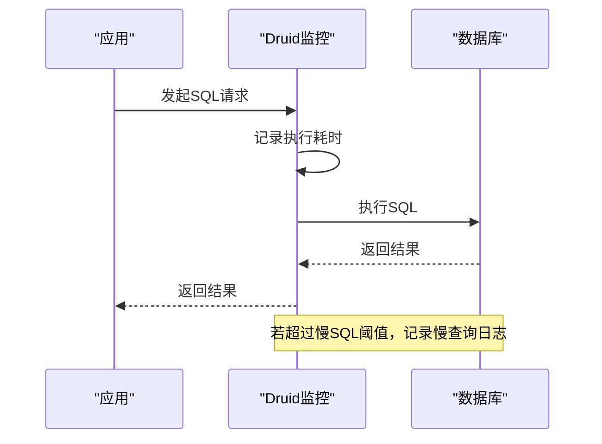
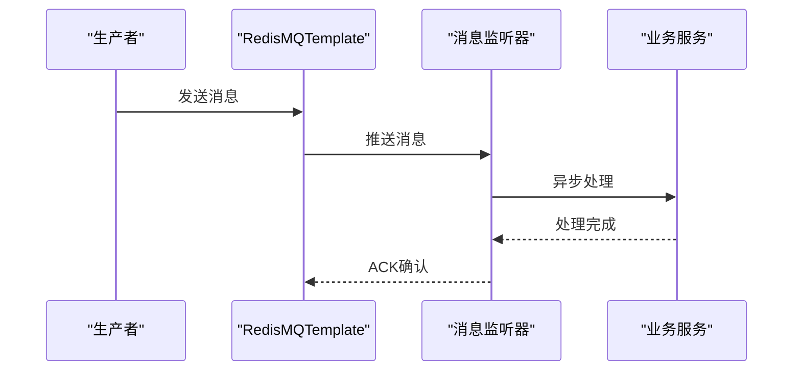
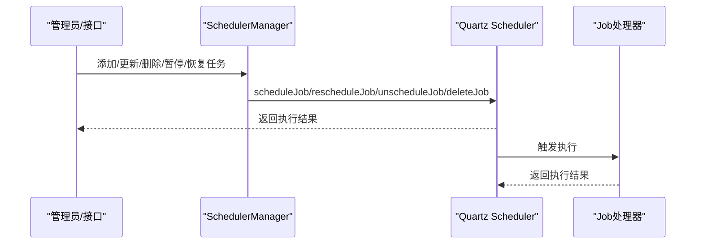
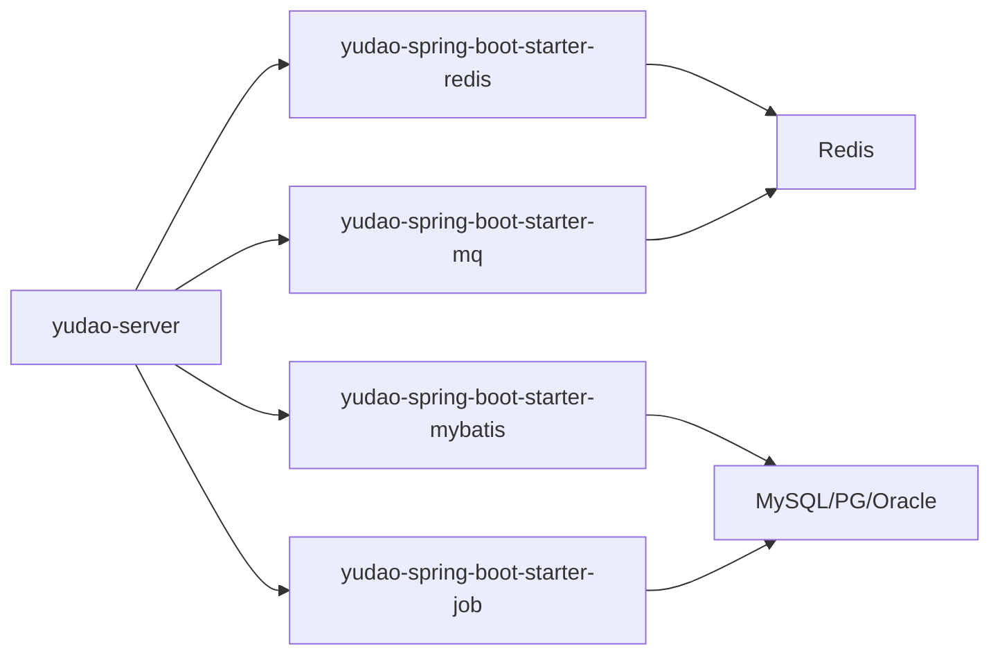

# 后端性能优化

<cite>
**本文引用的文件**
- [application-local.yaml](file://backend/yudao-server/src/main/resources/application-local.yaml)
- [application-dev.yaml](file://backend/yudao-server/src/main/resources/application-dev.yaml)
- [YudaoCacheAutoConfiguration.java](file://backend/yudao-framework/yudao-spring-boot-starter-redis/src/main/java/cn/iocoder/yudao/framework/redis/config/YudaoCacheAutoConfiguration.java)
- [YudaoCacheProperties.java](file://backend/yudao-framework/yudao-spring-boot-starter-redis/src/main/java/cn/iocoder/yudao/framework/redis/config/YudaoCacheProperties.java)
- [TimeoutRedisCacheManager.java](file://backend/yudao-framework/yudao-spring-boot-starter-redis/src/main/java/cn/iocoder/yudao/framework/redis/core/TimeoutRedisCacheManager.java)
- [CpsCacheConfig.java](file://backend/yudao-module-cps/yudao-module-cps-biz/src/main/java/cn/iocoder/yudao/module/cps/config/CpsCacheConfig.java)
- [YudaoMybatisAutoConfiguration.java](file://backend/yudao-framework/yudao-spring-boot-starter-mybatis/src/main/java/cn/iocoder/yudao/framework/mybatis/config/YudaoMybatisAutoConfiguration.java)
- [DbTypeEnum.java](file://backend/yudao-framework/yudao-spring-boot-starter-mybatis/src/main/java/cn/iocoder/yudao/framework/mybatis/core/enums/DbTypeEnum.java)
- [MyBatisUtils.java](file://backend/yudao-framework/yudao-spring-boot-starter-mybatis/src/main/java/cn/iocoder/yudao/framework/mybatis/core/util/MyBatisUtils.java)
- [SchedulerManager.java](file://backend/yudao-framework/yudao-spring-boot-starter-job/src/main/java/cn/iocoder/yudao/framework/quartz/core/scheduler/SchedulerManager.java)
- [YudaoAsyncAutoConfiguration.java](file://backend/yudao-framework/yudao-spring-boot-starter-job/src/main/java/cn/iocoder/yudao/framework/quartz/config/YudaoAsyncAutoConfiguration.java)
- [RedisPendingMessageResendJob.java](file://backend/yudao-framework/yudao-spring-boot-starter-mq/src/main/java/cn/iocoder/yudao/framework/mq/redis/core/job/RedisPendingMessageResendJob.java)
- [RedisStreamMessageCleanupJob.java](file://backend/yudao-framework/yudao-spring-boot-starter-mq/src/main/java/cn/iocoder/yudao/framework/mq/redis/core/job/RedisStreamMessageCleanupJob.java)
- [RedisMQTemplate.java](file://backend/yudao-framework/yudao-spring-boot-starter-mq/src/main/java/cn/iocoder/yudao/framework/mq/redis/core/RedisMQTemplate.java)
- [RedisMessageInterceptor.java](file://backend/yudao-framework/yudao-spring-boot-starter-mq/src/main/java/cn/iocoder/yudao/framework/mq/redis/core/interceptor/RedisMessageInterceptor.java)
- [SmsSendConsumer.java](file://backend/yudao-module-system/src/main/java/cn/iocoder/yudao/module/system/mq/consumer/sms/SmsSendConsumer.java)
- [MailSendConsumer.java](file://backend/yudao-module-system/src/main/java/cn/iocoder/yudao/module/system/mq/consumer/mail/MailSendConsumer.java)
- [JobStatusEnum.java](file://backend/yudao-module-infra/src/main/java/cn/iocoder/yudao/module/infra/enums/job/JobStatusEnum.java)
- [quartz.sql（MySQL）](file://backend/sql/mysql/quartz.sql)
</cite>

## 目录
1. [简介](#简介)
2. [项目结构](#项目结构)
3. [核心组件](#核心组件)
4. [架构总览](#架构总览)
5. [详细组件分析](#详细组件分析)
6. [依赖分析](#依赖分析)
7. [性能考量](#性能考量)
8. [故障排查指南](#故障排查指南)
9. [结论](#结论)
10. [附录](#附录)

## 简介
本指南聚焦后端性能优化，围绕以下主题展开：
- 缓存策略设计：Redis 缓存配置、缓存穿透防护、缓存雪崩处理与缓存一致性保证
- 数据库优化：MyBatis Plus 查询优化、索引设计策略、连接池配置与慢查询分析
- 异步处理机制：消息队列使用、异步任务调度与并发处理策略
- 定时任务优化：Quartz 调度配置、任务监控与资源管理
- 提供具体配置示例、性能测试方法与调优参数设置

## 项目结构
后端采用模块化分层设计，核心框架位于 yudao-framework，业务模块位于 yudao-module-*，服务入口位于 yudao-server。性能优化相关能力主要分布在：
- 缓存：yudao-spring-boot-starter-redis
- ORM/SQL：yudao-spring-boot-starter-mybatis
- 定时任务：yudao-spring-boot-starter-job
- 消息队列：yudao-spring-boot-starter-mq
- 业务模块：如 yudao-module-cps、yudao-module-system 等

**图表来源**
- [application-local.yaml:1-294](file://backend/yudao-server/src/main/resources/application-local.yaml#L1-L294)
- [YudaoCacheAutoConfiguration.java:29-82](file://backend/yudao-framework/yudao-spring-boot-starter-redis/src/main/java/cn/iocoder/yudao/framework/redis/config/YudaoCacheAutoConfiguration.java#L29-L82)
- [YudaoMybatisAutoConfiguration.java:29-96](file://backend/yudao-framework/yudao-spring-boot-starter-mybatis/src/main/java/cn/iocoder/yudao/framework/mybatis/config/YudaoMybatisAutoConfiguration.java#L29-L96)
- [SchedulerManager.java:1-151](file://backend/yudao-framework/yudao-spring-boot-starter-job/src/main/java/cn/iocoder/yudao/framework/quartz/core/scheduler/SchedulerManager.java#L1-L151)
- [RedisMQTemplate.java:1-41](file://backend/yudao-framework/yudao-spring-boot-starter-mq/src/main/java/cn/iocoder/yudao/framework/mq/redis/core/RedisMQTemplate.java#L1-L41)

**章节来源**
- [application-local.yaml:1-294](file://backend/yudao-server/src/main/resources/application-local.yaml#L1-L294)

## 核心组件
- Redis 缓存配置与管理：提供默认缓存配置、键前缀策略、JSON 序列化、SCAN 批量策略与自定义过期时间管理
- MyBatis Plus 优化：动态 SQL 解析缓存、分页插件、自动填充、按需启用阻断攻击插件
- 定时任务与异步：Quartz 调度器管理、线程池装饰器、任务状态映射
- 消息队列：Redis Stream/Pub/Sub、Pending 消息重投、消息清理、拦截器扩展
- 连接池与慢查询：Druid 连接池配置、慢 SQL 记录与阈值、SQL 索引建议

**章节来源**
- [YudaoCacheAutoConfiguration.java:29-82](file://backend/yudao-framework/yudao-spring-boot-starter-redis/src/main/java/cn/iocoder/yudao/framework/redis/config/YudaoCacheAutoConfiguration.java#L29-L82)
- [YudaoMybatisAutoConfiguration.java:29-96](file://backend/yudao-framework/yudao-spring-boot-starter-mybatis/src/main/java/cn/iocoder/yudao/framework/mybatis/config/YudaoMybatisAutoConfiguration.java#L29-L96)
- [SchedulerManager.java:1-151](file://backend/yudao-framework/yudao-spring-boot-starter-job/src/main/java/cn/iocoder/yudao/framework/quartz/core/scheduler/SchedulerManager.java#L1-L151)
- [RedisMQTemplate.java:1-41](file://backend/yudao-framework/yudao-spring-boot-starter-mq/src/main/java/cn/iocoder/yudao/framework/mq/redis/core/RedisMQTemplate.java#L1-L41)

## 架构总览
下图展示缓存、数据库、消息队列与定时任务在系统中的交互关系及优化要点。

**图表来源**
- [YudaoCacheAutoConfiguration.java:29-82](file://backend/yudao-framework/yudao-spring-boot-starter-redis/src/main/java/cn/iocoder/yudao/framework/redis/config/YudaoCacheAutoConfiguration.java#L29-L82)
- [TimeoutRedisCacheManager.java:13-87](file://backend/yudao-framework/yudao-spring-boot-starter-redis/src/main/java/cn/iocoder/yudao/framework/redis/core/TimeoutRedisCacheManager.java#L13-L87)
- [YudaoMybatisAutoConfiguration.java:29-96](file://backend/yudao-framework/yudao-spring-boot-starter-mybatis/src/main/java/cn/iocoder/yudao/framework/mybatis/config/YudaoMybatisAutoConfiguration.java#L29-L96)
- [RedisMQTemplate.java:1-41](file://backend/yudao-framework/yudao-spring-boot-starter-mq/src/main/java/cn/iocoder/yudao/framework/mq/redis/core/RedisMQTemplate.java#L1-L41)
- [RedisPendingMessageResendJob.java:1-99](file://backend/yudao-framework/yudao-spring-boot-starter-mq/src/main/java/cn/iocoder/yudao/framework/mq/redis/core/job/RedisPendingMessageResendJob.java#L1-L99)
- [RedisStreamMessageCleanupJob.java:1-41](file://backend/yudao-framework/yudao-spring-boot-starter-mq/src/main/java/cn/iocoder/yudao/framework/mq/redis/core/job/RedisStreamMessageCleanupJob.java#L1-L41)
- [SchedulerManager.java:1-151](file://backend/yudao-framework/yudao-spring-boot-starter-job/src/main/java/cn/iocoder/yudao/framework/quartz/core/scheduler/SchedulerManager.java#L1-L151)
- [JobStatusEnum.java:1-42](file://backend/yudao-module-infra/src/main/java/cn/iocoder/yudao/module/infra/enums/job/JobStatusEnum.java#L1-L42)

## 详细组件分析

### 缓存策略设计与实现
- 默认缓存配置：统一键前缀、JSON 序列化、禁用空值缓存、基于 CacheProperties 的 TTL 设置
- SCAN 批量策略：通过 BatchStrategies.scan 控制 Redis 扫描批次大小，降低内存压力
- 自定义过期时间：支持在缓存名中以“名称#ttl”形式声明过期时间，单位支持 d/h/m/s
- 业务缓存示例：CPS 模块按不同业务场景设置不同的默认 TTL，提升命中率与时效性

**图表来源**
- [TimeoutRedisCacheManager.java:13-87](file://backend/yudao-framework/yudao-spring-boot-starter-redis/src/main/java/cn/iocoder/yudao/framework/redis/core/TimeoutRedisCacheManager.java#L13-L87)
- [YudaoCacheAutoConfiguration.java:29-82](file://backend/yudao-framework/yudao-spring-boot-starter-redis/src/main/java/cn/iocoder/yudao/framework/redis/config/YudaoCacheAutoConfiguration.java#L29-L82)
- [YudaoCacheProperties.java:1-28](file://backend/yudao-framework/yudao-spring-boot-starter-redis/src/main/java/cn/iocoder/yudao/framework/redis/config/YudaoCacheProperties.java#L1-L28)
- [CpsCacheConfig.java:33-60](file://backend/yudao-module-cps/yudao-module-cps-biz/src/main/java/cn/iocoder/yudao/module/cps/config/CpsCacheConfig.java#L33-L60)

**章节来源**
- [YudaoCacheAutoConfiguration.java:29-82](file://backend/yudao-framework/yudao-spring-boot-starter-redis/src/main/java/cn/iocoder/yudao/framework/redis/config/YudaoCacheAutoConfiguration.java#L29-L82)
- [YudaoCacheProperties.java:1-28](file://backend/yudao-framework/yudao-spring-boot-starter-redis/src/main/java/cn/iocoder/yudao/framework/redis/config/YudaoCacheProperties.java#L1-L28)
- [TimeoutRedisCacheManager.java:13-87](file://backend/yudao-framework/yudao-spring-boot-starter-redis/src/main/java/cn/iocoder/yudao/framework/redis/core/TimeoutRedisCacheManager.java#L13-L87)
- [CpsCacheConfig.java:33-60](file://backend/yudao-module-cps/yudao-module-cps-biz/src/main/java/cn/iocoder/yudao/module/cps/config/CpsCacheConfig.java#L33-L60)

#### 缓存穿透防护
- 空值缓存：通过禁用空值缓存或显式缓存空对象，避免重复查询数据库
- 唯一索引与参数校验：确保查询参数合法，减少无效请求
- 布隆过滤器（建议）：在高并发场景下，可在业务层引入布隆过滤器快速判断 Key 是否存在

#### 缓存雪崩处理
- 过期时间随机化：为热点 Key 添加随机抖动，避免同时过期
- 多级缓存：本地缓存 + Redis 缓存，降低单一节点压力
- 降级与熔断：在下游不可用时返回兜底数据或错误码

#### 缓存一致性保证
- 写策略：先更新数据库，再删除缓存（或更新缓存），避免脏读
- 读策略：缓存未命中时从数据库加载并回填缓存
- 幂等性：确保重复操作不影响最终一致性

### 数据库优化技术
- MyBatis Plus 插件：
  - 分页插件：避免一次性加载大量数据
  - 动态 SQL 解析缓存：提升复杂 SQL 解析效率
  - 自动填充：统一字段填充，减少手误
  - 按需启用阻断攻击插件：防止无条件 UPDATE/DELETE
- 连接池配置（Druid）：
  - 最大活跃连接数、空闲连接存活时间、获取连接等待超时
  - 预编译语句缓存与每个连接的最大缓存数量
  - 空闲检测与有效性检查 SQL
- 慢查询分析：
  - 开启慢 SQL 记录与阈值设置
  - 结合数据库慢日志与执行计划分析

**图表来源**
- [YudaoMybatisAutoConfiguration.java:29-96](file://backend/yudao-framework/yudao-spring-boot-starter-mybatis/src/main/java/cn/iocoder/yudao/framework/mybatis/config/YudaoMybatisAutoConfiguration.java#L29-L96)
- [application-local.yaml:33-50](file://backend/yudao-server/src/main/resources/application-local.yaml#L33-L50)
- [application-dev.yaml:36-54](file://backend/yudao-server/src/main/resources/application-dev.yaml#L36-L54)

**章节来源**
- [YudaoMybatisAutoConfiguration.java:29-96](file://backend/yudao-framework/yudao-spring-boot-starter-mybatis/src/main/java/cn/iocoder/yudao/framework/mybatis/config/YudaoMybatisAutoConfiguration.java#L29-L96)
- [application-local.yaml:33-50](file://backend/yudao-server/src/main/resources/application-local.yaml#L33-L50)
- [application-dev.yaml:36-54](file://backend/yudao-server/src/main/resources/application-dev.yaml#L36-L54)

#### 索引设计策略
- 唯一索引：保证业务唯一性，减少重复数据
- 复合索引：覆盖常见查询条件，避免回表
- 前缀匹配：对 LIKE '%keyword%' 进行全文检索或函数索引替代
- 统计信息：定期更新表统计信息，帮助优化器选择最优执行计划

#### 慢查询分析流程

**图表来源**
- [application-local.yaml:14-32](file://backend/yudao-server/src/main/resources/application-local.yaml#L14-L32)

### 异步处理机制
- 消息队列：
  - Redis Stream：支持 ACK、Pending 消息重投与清理
  - Pub/Sub：轻量广播/订阅
  - 拦截器：消息发送/消费前后钩子，便于多租户等扩展
- 异步任务：
  - Spring Async + 线程池装饰器，支持 TtlRunnable 传递上下文
  - Quartz 调度：基于 CRON 表达式的任务管理与重试控制

**图表来源**
- [RedisMQTemplate.java:1-41](file://backend/yudao-framework/yudao-spring-boot-starter-mq/src/main/java/cn/iocoder/yudao/framework/mq/redis/core/RedisMQTemplate.java#L1-L41)
- [RedisPendingMessageResendJob.java:1-99](file://backend/yudao-framework/yudao-spring-boot-starter-mq/src/main/java/cn/iocoder/yudao/framework/mq/redis/core/job/RedisPendingMessageResendJob.java#L1-L99)
- [RedisStreamMessageCleanupJob.java:1-41](file://backend/yudao-framework/yudao-spring-boot-starter-mq/src/main/java/cn/iocoder/yudao/framework/mq/redis/core/job/RedisStreamMessageCleanupJob.java#L1-L41)
- [YudaoAsyncAutoConfiguration.java:1-45](file://backend/yudao-framework/yudao-spring-boot-starter-job/src/main/java/cn/iocoder/yudao/framework/quartz/config/YudaoAsyncAutoConfiguration.java#L1-L45)

**章节来源**
- [RedisMQTemplate.java:1-41](file://backend/yudao-framework/yudao-spring-boot-starter-mq/src/main/java/cn/iocoder/yudao/framework/mq/redis/core/RedisMQTemplate.java#L1-L41)
- [RedisPendingMessageResendJob.java:1-99](file://backend/yudao-framework/yudao-spring-boot-starter-mq/src/main/java/cn/iocoder/yudao/framework/mq/redis/core/job/RedisPendingMessageResendJob.java#L1-L99)
- [RedisStreamMessageCleanupJob.java:1-41](file://backend/yudao-framework/yudao-spring-boot-starter-mq/src/main/java/cn/iocoder/yudao/framework/mq/redis/core/job/RedisStreamMessageCleanupJob.java#L1-L41)
- [YudaoAsyncAutoConfiguration.java:1-45](file://backend/yudao-framework/yudao-spring-boot-starter-job/src/main/java/cn/iocoder/yudao/framework/quartz/config/YudaoAsyncAutoConfiguration.java#L1-L45)
- [SmsSendConsumer.java:1-31](file://backend/yudao-module-system/src/main/java/cn/iocoder/yudao/module/system/mq/consumer/sms/SmsSendConsumer.java#L1-L31)
- [MailSendConsumer.java:1-31](file://backend/yudao-module-system/src/main/java/cn/iocoder/yudao/module/system/mq/consumer/mail/MailSendConsumer.java#L1-L31)

#### 并发处理策略
- 线程池参数：核心线程数、最大线程数、队列容量、拒绝策略
- 上下文传递：使用线程池装饰器传递 MDC/Tenant 等上下文
- 限流与熔断：对外部依赖增加限流与熔断保护

### 定时任务优化
- Quartz 配置：
  - JDBC JobStore：持久化任务，支持集群
  - 线程池大小与优先级：根据任务负载调整
  - 集群检查与 Misfire 阈值：避免任务丢失或重复执行
- 任务生命周期管理：
  - 添加、更新、暂停、恢复、立即触发
  - 重试次数与间隔控制
- 任务状态映射：与 Quartz 触发器状态对应，便于监控

**图表来源**
- [SchedulerManager.java:1-151](file://backend/yudao-framework/yudao-spring-boot-starter-job/src/main/java/cn/iocoder/yudao/framework/quartz/core/scheduler/SchedulerManager.java#L1-L151)
- [application-local.yaml:90-118](file://backend/yudao-server/src/main/resources/application-local.yaml#L90-L118)
- [JobStatusEnum.java:1-42](file://backend/yudao-module-infra/src/main/java/cn/iocoder/yudao/module/infra/enums/job/JobStatusEnum.java#L1-L42)

**章节来源**
- [SchedulerManager.java:1-151](file://backend/yudao-framework/yudao-spring-boot-starter-job/src/main/java/cn/iocoder/yudao/framework/quartz/core/scheduler/SchedulerManager.java#L1-L151)
- [application-local.yaml:90-118](file://backend/yudao-server/src/main/resources/application-local.yaml#L90-L118)
- [JobStatusEnum.java:1-42](file://backend/yudao-module-infra/src/main/java/cn/iocoder/yudao/module/infra/enums/job/JobStatusEnum.java#L1-L42)

## 依赖分析
- 框架与模块耦合：
  - yudao-server 依赖各 starter 模块，提供统一配置入口
  - 业务模块通过 starter 使用缓存、消息、定时任务能力
- 外部依赖：
  - Redis：缓存与消息队列
  - 数据库：MySQL/PG/Oracle 等，通过 MyBatis Plus 访问
  - Quartz：持久化任务存储与调度

**图表来源**
- [application-local.yaml:1-294](file://backend/yudao-server/src/main/resources/application-local.yaml#L1-L294)

**章节来源**
- [application-local.yaml:1-294](file://backend/yudao-server/src/main/resources/application-local.yaml#L1-L294)

## 性能考量
- 缓存层
  - 合理设置过期时间，避免热点 Key 集中失效
  - 使用 SCAN 批量策略，避免阻塞
  - 业务缓存差异化 TTL，兼顾时效与命中率
- 数据库层
  - 分页查询与 LIMIT 控制，避免全表扫描
  - 连接池参数与预编译语句缓存平衡
  - 慢 SQL 监控与索引优化
- 消息队列
  - Pending 消息重投与清理任务，保障消息不丢失
  - 消费幂等与去重，避免重复处理
- 定时任务
  - 集群模式与 Misfire 阈值，确保任务稳定执行
  - 线程池大小与任务粒度匹配，避免资源争用

## 故障排查指南
- 缓存问题
  - 现象：缓存穿透/击穿/雪崩
  - 措施：空值缓存、热点 Key 随机过期、多级缓存、布隆过滤器
- 数据库问题
  - 现象：慢查询、连接池耗尽
  - 措施：开启慢 SQL 记录、优化索引、调整连接池参数
- 消息队列问题
  - 现象：消息堆积、重复消费
  - 措施：Pending 重投与清理任务、幂等处理、合理分区
- 定时任务问题
  - 现象：任务丢失、重复执行
  - 措施：JDBC JobStore、Misfire 阈值、状态监控

**章节来源**
- [RedisPendingMessageResendJob.java:1-99](file://backend/yudao-framework/yudao-spring-boot-starter-mq/src/main/java/cn/iocoder/yudao/framework/mq/redis/core/job/RedisPendingMessageResendJob.java#L1-L99)
- [RedisStreamMessageCleanupJob.java:1-41](file://backend/yudao-framework/yudao-spring-boot-starter-mq/src/main/java/cn/iocoder/yudao/framework/mq/redis/core/job/RedisStreamMessageCleanupJob.java#L1-L41)
- [application-local.yaml:14-32](file://backend/yudao-server/src/main/resources/application-local.yaml#L14-L32)

## 结论
通过在缓存、数据库、消息队列与定时任务四个层面实施针对性优化，并结合监控与告警体系，可显著提升系统的吞吐与稳定性。建议在生产环境中持续关注慢查询、缓存命中率与消息积压情况，定期复盘并迭代优化参数与策略。

## 附录
- 配置示例定位
  - Redis 缓存配置与 SCAN 批量策略：[YudaoCacheAutoConfiguration.java:29-82](file://backend/yudao-framework/yudao-spring-boot-starter-redis/src/main/java/cn/iocoder/yudao/framework/redis/config/YudaoCacheAutoConfiguration.java#L29-L82)
  - 自定义过期时间管理：[TimeoutRedisCacheManager.java:13-87](file://backend/yudao-framework/yudao-spring-boot-starter-redis/src/main/java/cn/iocoder/yudao/framework/redis/core/TimeoutRedisCacheManager.java#L13-L87)
  - 业务缓存 TTL 示例：[CpsCacheConfig.java:33-60](file://backend/yudao-module-cps/yudao-module-cps-biz/src/main/java/cn/iocoder/yudao/module/cps/config/CpsCacheConfig.java#L33-L60)
  - MyBatis Plus 插件与自动填充：[YudaoMybatisAutoConfiguration.java:29-96](file://backend/yudao-framework/yudao-spring-boot-starter-mybatis/src/main/java/cn/iocoder/yudao/framework/mybatis/config/YudaoMybatisAutoConfiguration.java#L29-L96)
  - 连接池与慢查询配置：[application-local.yaml:33-50](file://backend/yudao-server/src/main/resources/application-local.yaml#L33-L50)
  - Quartz 调度配置：[application-local.yaml:90-118](file://backend/yudao-server/src/main/resources/application-local.yaml#L90-L118)
  - 消息队列与拦截器：[RedisMQTemplate.java:1-41](file://backend/yudao-framework/yudao-spring-boot-starter-mq/src/main/java/cn/iocoder/yudao/framework/mq/redis/core/RedisMQTemplate.java#L1-L41)
  - Pending 重投与清理任务：[RedisPendingMessageResendJob.java:1-99](file://backend/yudao-framework/yudao-spring-boot-starter-mq/src/main/java/cn/iocoder/yudao/framework/mq/redis/core/job/RedisPendingMessageResendJob.java#L1-L99)、[RedisStreamMessageCleanupJob.java:1-41](file://backend/yudao-framework/yudao-spring-boot-starter-mq/src/main/java/cn/iocoder/yudao/framework/mq/redis/core/job/RedisStreamMessageCleanupJob.java#L1-L41)
  - 异步任务与线程池装饰器：[YudaoAsyncAutoConfiguration.java:1-45](file://backend/yudao-framework/yudao-spring-boot-starter-job/src/main/java/cn/iocoder/yudao/framework/quartz/config/YudaoAsyncAutoConfiguration.java#L1-L45)
  - Quartz 表结构（MySQL）：[quartz.sql（MySQL）](file://backend/sql/mysql/quartz.sql)