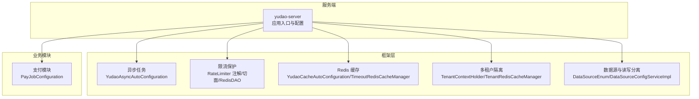
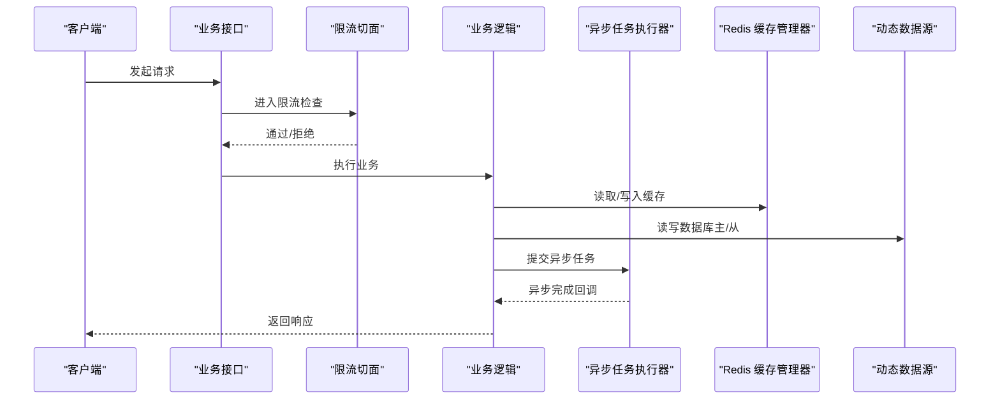
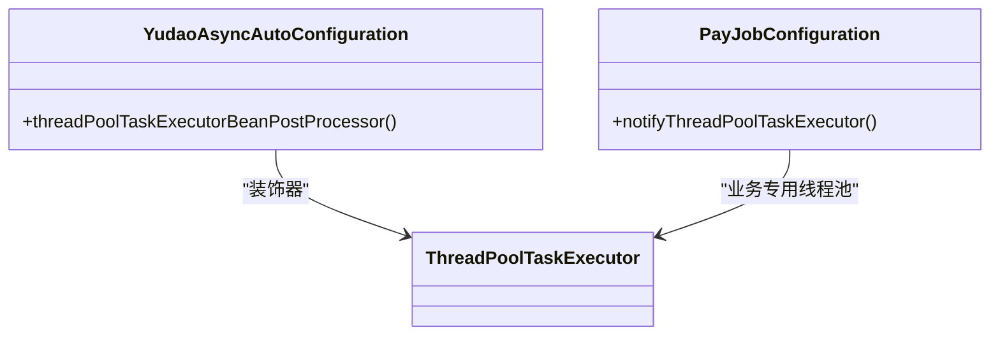
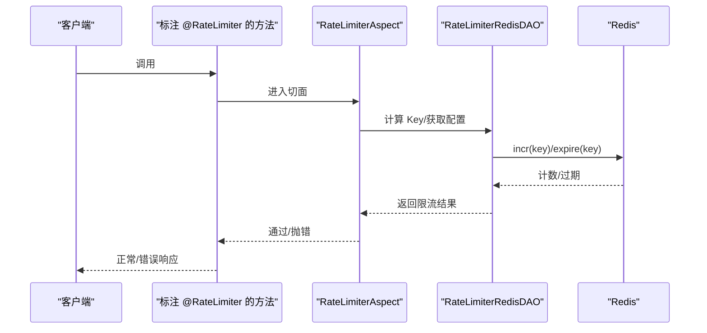
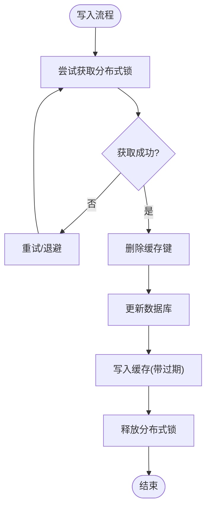
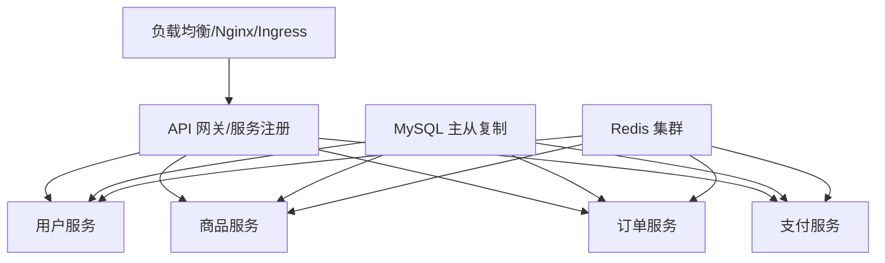
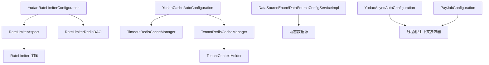

# 并发与扩展

<cite>
**本文引用的文件**
- [application-dev.yaml](file://backend/yudao-server/src/main/resources/application-dev.yaml)
- [application-local.yaml](file://backend/yudao-server/src/main/resources/application-local.yaml)
- [docker-compose.yml](file://backend/script/docker/docker-compose.yml)
- [docker.env](file://backend/script/docker/docker.env)
- [YudaoAsyncAutoConfiguration.java](file://backend/yudao-framework/yudao-spring-boot-starter-job/src/main/java/cn/iocoder/yudao/framework/quartz/config/YudaoAsyncAutoConfiguration.java)
- [PayJobConfiguration.java](file://backend/yudao-module-pay/src/main/java/cn/iocoder/yudao/module/pay/framework/job/config/PayJobConfiguration.java)
- [RateLimiter.java](file://backend/yudao-framework/yudao-spring-boot-starter-protection/src/main/java/cn/iocoder/yudao/framework/ratelimiter/core/annotation/RateLimiter.java)
- [RateLimiterAspect.java](file://backend/yudao-framework/yudao-spring-boot-starter-protection/src/main/java/cn/iocoder/yudao/framework/ratelimiter/core/aop/RateLimiterAspect.java)
- [YudaoRateLimiterConfiguration.java](file://backend/yudao-framework/yudao-spring-boot-starter-protection/src/main/java/cn/iocoder/yudao/framework/ratelimiter/config/YudaoRateLimiterConfiguration.java)
- [RateLimiterRedisDAO.java](file://backend/yudao-framework/yudao-spring-boot-starter-protection/src/main/java/cn/iocoder/yudao/framework/ratelimiter/core/redis/RateLimiterRedisDAO.java)
- [Lock4jRedisKeyConstants.java](file://backend/yudao-framework/yudao-spring-boot-starter-protection/src/main/java/cn/iocoder/yudao/framework/lock4j/core/Lock4jRedisKeyConstants.java)
- [YudaoCacheAutoConfiguration.java](file://backend/yudao-framework/yudao-spring-boot-starter-redis/src/main/java/cn/iocoder/yudao/framework/redis/config/YudaoCacheAutoConfiguration.java)
- [TimeoutRedisCacheManager.java](file://backend/yudao-framework/yudao-spring-boot-starter-redis/src/main/java/cn/iocoder/yudao/framework/redis/core/TimeoutRedisCacheManager.java)
- [TenantRedisCacheManager.java](file://backend/yudao-framework/yudao-spring-boot-starter-biz-tenant/src/main/java/cn/iocoder/yudao/framework/tenant/core/redis/TenantRedisCacheManager.java)
- [TenantContextHolder.java](file://backend/yudao-framework/yudao-spring-boot-starter-biz-tenant/src/main/java/cn/iocoder/yudao/framework/tenant/core/context/TenantContextHolder.java)
- [DataSourceEnum.java](file://backend/yudao-framework/yudao-spring-boot-starter-mybatis/src/main/java/cn/iocoder/yudao/framework/datasource/core/enums/DataSourceEnum.java)
- [DataSourceConfigServiceImpl.java](file://backend/yudao-module-infra/src/main/java/cn/iocoder/yudao/module/infra/service/db/DataSourceConfigServiceImpl.java)
- [CpsRiskServiceImplTest.java](file://backend/yudao-module-cps/yudao-module-cps-biz/src/test/java/cn/iocoder/yudao/module/cps/service/risk/CpsRiskServiceImplTest.java)
- [YudaoQuartzAutoConfiguration.java](file://backend/yudao-framework/yudao-spring-boot-starter-job/src/main/java/cn/iocoder/yudao/framework/quartz/config/YudaoQuartzAutoConfiguration.java)
- [CPS系统PRD文档.md](file://docs/CPS系统PRD文档.md)
</cite>

## 目录
1. [引言](#引言)
2. [项目结构](#项目结构)
3. [核心组件](#核心组件)
4. [架构总览](#架构总览)
5. [详细组件分析](#详细组件分析)
6. [依赖分析](#依赖分析)
7. [性能考虑](#性能考虑)
8. [故障排查指南](#故障排查指南)
9. [结论](#结论)
10. [附录](#附录)

## 引言
本指南聚焦高并发与扩展性优化，结合代码库中的现有实现，系统阐述以下主题：
- 并发处理策略：线程池配置、异步编程与线程上下文传递、非阻塞 I/O 的应用现状与建议
- 限流与熔断：基于注解的限流切面、Redis 限流实现与降级策略
- 分布式锁与缓存一致性：Redis 分布式锁键空间、缓存过期与多租户隔离
- 水平扩展：微服务拆分思路、负载均衡与容器编排
- 集群部署优化：数据库主从复制、读写分离与缓存集群配置
- 容量规划：性能基线、压测方法与扩容策略

## 项目结构
后端采用多模块聚合工程，围绕“框架层 + 业务模块 + 服务端”组织。并发与扩展相关的关键位置包括：
- 框架层：异步任务、限流保护、Redis 缓存与多租户隔离
- 业务模块：支付通知等异步任务线程池
- 服务端：数据库连接池与读写分离配置、容器编排与环境变量



图示来源
- [YudaoAsyncAutoConfiguration.java:1-45](file://backend/yudao-framework/yudao-spring-boot-starter-job/src/main/java/cn/iocoder/yudao/framework/quartz/config/YudaoAsyncAutoConfiguration.java#L1-L45)
- [RateLimiter.java:1-62](file://backend/yudao-framework/yudao-spring-boot-starter-protection/src/main/java/cn/iocoder/yudao/framework/ratelimiter/core/annotation/RateLimiter.java#L1-L62)
- [RateLimiterAspect.java:1-35](file://backend/yudao-framework/yudao-spring-boot-starter-protection/src/main/java/cn/iocoder/yudao/framework/ratelimiter/core/aop/RateLimiterAspect.java#L1-L35)
- [RateLimiterRedisDAO.java:43-66](file://backend/yudao-framework/yudao-spring-boot-starter-protection/src/main/java/cn/iocoder/yudao/framework/ratelimiter/core/redis/RateLimiterRedisDAO.java#L43-L66)
- [YudaoCacheAutoConfiguration.java:29-82](file://backend/yudao-framework/yudao-spring-boot-starter-redis/src/main/java/cn/iocoder/yudao/framework/redis/config/YudaoCacheAutoConfiguration.java#L29-L82)
- [TimeoutRedisCacheManager.java:1-87](file://backend/yudao-framework/yudao-spring-boot-starter-redis/src/main/java/cn/iocoder/yudao/framework/redis/core/TimeoutRedisCacheManager.java#L1-L87)
- [TenantContextHolder.java:1-69](file://backend/yudao-framework/yudao-spring-boot-starter-biz-tenant/src/main/java/cn/iocoder/yudao/framework/tenant/core/context/TenantContextHolder.java#L1-L69)
- [TenantRedisCacheManager.java:1-38](file://backend/yudao-framework/yudao-spring-boot-starter-biz-tenant/src/main/java/cn/iocoder/yudao/framework/tenant/core/redis/TenantRedisCacheManager.java#L1-L38)
- [DataSourceEnum.java:1-22](file://backend/yudao-framework/yudao-spring-boot-starter-mybatis/src/main/java/cn/iocoder/yudao/framework/datasource/core/enums/DataSourceEnum.java#L1-L22)
- [DataSourceConfigServiceImpl.java:72-111](file://backend/yudao-module-infra/src/main/java/cn/iocoder/yudao/module/infra/service/db/DataSourceConfigServiceImpl.java#L72-L111)
- [PayJobConfiguration.java:1-28](file://backend/yudao-module-pay/src/main/java/cn/iocoder/yudao/module/pay/framework/job/config/PayJobConfiguration.java#L1-L28)

章节来源
- [application-dev.yaml:36-54](file://backend/yudao-server/src/main/resources/application-dev.yaml#L36-L54)
- [application-local.yaml:51-66](file://backend/yudao-server/src/main/resources/application-local.yaml#L51-L66)
- [docker-compose.yml:48-84](file://backend/script/docker/docker-compose.yml#L48-L84)
- [docker.env:1-25](file://backend/script/docker/docker.env#L1-L25)

## 核心组件
- 异步任务与线程池
  - 框架层提供异步任务自动装配与线程上下文传递装饰器，确保跨线程传递租户等上下文
  - 业务模块提供独立的通知线程池，用于异步回调处理
- 限流保护
  - 注解驱动的限流，支持多种 Key 解析器（全局、用户、IP、节点、表达式）
  - 基于 Redis 的限流实现与切面拦截
- 缓存与多租户
  - Redis 缓存管理器支持自定义过期时间，缓存键格式为“名称#ttl”
  - 多租户缓存管理器在缓存键中自动拼接租户标识，实现租户隔离
- 数据源与读写分离
  - 通过枚举与配置服务区分主从库，支持懒加载从库以提升启动速度
- 容器编排与环境
  - docker-compose 定义服务依赖与网络，docker.env 统一注入数据库与 Redis 连接参数

章节来源
- [YudaoAsyncAutoConfiguration.java:1-45](file://backend/yudao-framework/yudao-spring-boot-starter-job/src/main/java/cn/iocoder/yudao/framework/quartz/config/YudaoAsyncAutoConfiguration.java#L1-L45)
- [PayJobConfiguration.java:1-28](file://backend/yudao-module-pay/src/main/java/cn/iocoder/yudao/module/pay/framework/job/config/PayJobConfiguration.java#L1-L28)
- [RateLimiter.java:1-62](file://backend/yudao-framework/yudao-spring-boot-starter-protection/src/main/java/cn/iocoder/yudao/framework/ratelimiter/core/annotation/RateLimiter.java#L1-L62)
- [RateLimiterAspect.java:1-35](file://backend/yudao-framework/yudao-spring-boot-starter-protection/src/main/java/cn/iocoder/yudao/framework/ratelimiter/core/aop/RateLimiterAspect.java#L1-L35)
- [RateLimiterRedisDAO.java:43-66](file://backend/yudao-framework/yudao-spring-boot-starter-protection/src/main/java/cn/iocoder/yudao/framework/ratelimiter/core/redis/RateLimiterRedisDAO.java#L43-L66)
- [YudaoCacheAutoConfiguration.java:29-82](file://backend/yudao-framework/yudao-spring-boot-starter-redis/src/main/java/cn/iocoder/yudao/framework/redis/config/YudaoCacheAutoConfiguration.java#L29-L82)
- [TimeoutRedisCacheManager.java:1-87](file://backend/yudao-framework/yudao-spring-boot-starter-redis/src/main/java/cn/iocoder/yudao/framework/redis/core/TimeoutRedisCacheManager.java#L1-L87)
- [TenantContextHolder.java:1-69](file://backend/yudao-framework/yudao-spring-boot-starter-biz-tenant/src/main/java/cn/iocoder/yudao/framework/tenant/core/context/TenantContextHolder.java#L1-L69)
- [TenantRedisCacheManager.java:1-38](file://backend/yudao-framework/yudao-spring-boot-starter-biz-tenant/src/main/java/cn/iocoder/yudao/framework/tenant/core/redis/TenantRedisCacheManager.java#L1-L38)
- [DataSourceEnum.java:1-22](file://backend/yudao-framework/yudao-spring-boot-starter-mybatis/src/main/java/cn/iocoder/yudao/framework/datasource/core/enums/DataSourceEnum.java#L1-L22)
- [DataSourceConfigServiceImpl.java:72-111](file://backend/yudao-module-infra/src/main/java/cn/iocoder/yudao/module/infra/service/db/DataSourceConfigServiceImpl.java#L72-L111)

## 架构总览
下图展示了并发与扩展相关的关键交互：请求经由限流切面进入业务，异步任务通过线程池执行，缓存与多租户上下文贯穿其中，数据库通过动态数据源实现读写分离。



图示来源
- [RateLimiterAspect.java:1-35](file://backend/yudao-framework/yudao-spring-boot-starter-protection/src/main/java/cn/iocoder/yudao/framework/ratelimiter/core/aop/RateLimiterAspect.java#L1-L35)
- [YudaoAsyncAutoConfiguration.java:1-45](file://backend/yudao-framework/yudao-spring-boot-starter-job/src/main/java/cn/iocoder/yudao/framework/quartz/config/YudaoAsyncAutoConfiguration.java#L1-L45)
- [YudaoCacheAutoConfiguration.java:29-82](file://backend/yudao-framework/yudao-spring-boot-starter-redis/src/main/java/cn/iocoder/yudao/framework/redis/config/YudaoCacheAutoConfiguration.java#L29-L82)
- [DataSourceEnum.java:1-22](file://backend/yudao-framework/yudao-spring-boot-starter-mybatis/src/main/java/cn/iocoder/yudao/framework/datasource/core/enums/DataSourceEnum.java#L1-L22)

## 详细组件分析

### 并发处理策略：线程池配置、异步编程与非阻塞 I/O
- 线程池配置
  - 框架层提供通用异步任务执行器，支持线程上下文传递装饰器，保障跨线程传递租户等信息
  - 业务模块提供独立的通知线程池，核心线程、最大线程、队列长度与拒绝策略按业务需求定制
- 异步编程
  - 通过注解启用异步任务，结合线程上下文装饰器，避免上下文丢失
- 非阻塞 I/O
  - 代码库未直接体现 Netty 或 WebFlux 等非阻塞 I/O 实现；建议在高并发场景引入响应式栈或非阻塞 Web 服务器，减少阻塞线程占用



图示来源
- [YudaoAsyncAutoConfiguration.java:1-45](file://backend/yudao-framework/yudao-spring-boot-starter-job/src/main/java/cn/iocoder/yudao/framework/quartz/config/YudaoAsyncAutoConfiguration.java#L1-L45)
- [PayJobConfiguration.java:1-28](file://backend/yudao-module-pay/src/main/java/cn/iocoder/yudao/module/pay/framework/job/config/PayJobConfiguration.java#L1-L28)

章节来源
- [YudaoAsyncAutoConfiguration.java:1-45](file://backend/yudao-framework/yudao-spring-boot-starter-job/src/main/java/cn/iocoder/yudao/framework/quartz/config/YudaoAsyncAutoConfiguration.java#L1-L45)
- [PayJobConfiguration.java:1-28](file://backend/yudao-module-pay/src/main/java/cn/iocoder/yudao/module/pay/framework/job/config/PayJobConfiguration.java#L1-L28)

### 限流熔断机制：Sentinel 集成、熔断器模式与降级策略
- 限流注解与切面
  - 注解支持时间窗口、次数、提示信息与多种 Key 解析器
  - 切面在方法执行前进行限流判断，失败抛出统一错误码
- Redis 限流实现
  - 通过 DAO 设置/更新限流速率与过期时间，首次计数时设置 TTL，后续不再重复设置
- 熔断与降级
  - 代码库未发现 Sentinel 集成与熔断器模式实现；建议引入 Sentinel 或 Resilience4j，在网关或服务层实现熔断与降级



图示来源
- [RateLimiter.java:1-62](file://backend/yudao-framework/yudao-spring-boot-starter-protection/src/main/java/cn/iocoder/yudao/framework/ratelimiter/core/annotation/RateLimiter.java#L1-L62)
- [RateLimiterAspect.java:1-35](file://backend/yudao-framework/yudao-spring-boot-starter-protection/src/main/java/cn/iocoder/yudao/framework/ratelimiter/core/aop/RateLimiterAspect.java#L1-L35)
- [RateLimiterRedisDAO.java:43-66](file://backend/yudao-framework/yudao-spring-boot-starter-protection/src/main/java/cn/iocoder/yudao/framework/ratelimiter/core/redis/RateLimiterRedisDAO.java#L43-L66)
- [CpsRiskServiceImplTest.java:101-134](file://backend/yudao-module-cps/yudao-module-cps-biz/src/test/java/cn/iocoder/yudao/module/cps/service/risk/CpsRiskServiceImplTest.java#L101-L134)

章节来源
- [RateLimiter.java:1-62](file://backend/yudao-framework/yudao-spring-boot-starter-protection/src/main/java/cn/iocoder/yudao/framework/ratelimiter/core/annotation/RateLimiter.java#L1-L62)
- [RateLimiterAspect.java:1-35](file://backend/yudao-framework/yudao-spring-boot-starter-protection/src/main/java/cn/iocoder/yudao/framework/ratelimiter/core/aop/RateLimiterAspect.java#L1-L35)
- [RateLimiterRedisDAO.java:43-66](file://backend/yudao-framework/yudao-spring-boot-starter-protection/src/main/java/cn/iocoder/yudao/framework/ratelimiter/core/redis/RateLimiterRedisDAO.java#L43-L66)
- [CpsRiskServiceImplTest.java:101-134](file://backend/yudao-module-cps/yudao-module-cps-biz/src/test/java/cn/iocoder/yudao/module/cps/service/risk/CpsRiskServiceImplTest.java#L101-L134)

### 分布式锁与缓存一致性：Redis 分布式锁、缓存更新策略
- 分布式锁
  - 锁键命名空间采用统一前缀，值使用 Hash 结构存储锁对象
  - 建议结合 Redlock 算法或 Redission 提供的 RedLock 实现，提升高可用性
- 缓存一致性
  - 缓存管理器支持“名称#ttl”格式的自定义过期时间
  - 多租户缓存管理器在键中拼接租户标识，避免数据串扰
  - 建议在写路径采用“先删后写/写后删”策略，或使用版本号/时间戳实现缓存失效与最终一致



图示来源
- [Lock4jRedisKeyConstants.java:1-20](file://backend/yudao-framework/yudao-spring-boot-starter-protection/src/main/java/cn/iocoder/yudao/framework/lock4j/core/Lock4jRedisKeyConstants.java#L1-L20)
- [TimeoutRedisCacheManager.java:1-87](file://backend/yudao-framework/yudao-spring-boot-starter-redis/src/main/java/cn/iocoder/yudao/framework/redis/core/TimeoutRedisCacheManager.java#L1-L87)
- [TenantRedisCacheManager.java:1-38](file://backend/yudao-framework/yudao-spring-boot-starter-biz-tenant/src/main/java/cn/iocoder/yudao/framework/tenant/core/redis/TenantRedisCacheManager.java#L1-L38)

章节来源
- [Lock4jRedisKeyConstants.java:1-20](file://backend/yudao-framework/yudao-spring-boot-starter-protection/src/main/java/cn/iocoder/yudao/framework/lock4j/core/Lock4jRedisKeyConstants.java#L1-L20)
- [TimeoutRedisCacheManager.java:1-87](file://backend/yudao-framework/yudao-spring-boot-starter-redis/src/main/java/cn/iocoder/yudao/framework/redis/core/TimeoutRedisCacheManager.java#L1-L87)
- [TenantRedisCacheManager.java:1-38](file://backend/yudao-framework/yudao-spring-boot-starter-biz-tenant/src/main/java/cn/iocoder/yudao/framework/tenant/core/redis/TenantRedisCacheManager.java#L1-L38)

### 水平扩展方案：微服务拆分、负载均衡与容器编排
- 微服务拆分
  - 建议按业务域拆分：用户中心、商品中心、订单中心、支付中心、风控中心
  - 每个服务独立数据库与缓存，通过消息队列或 RPC 通信
- 负载均衡
  - 使用 Nginx/Ingress 做七层路由与健康检查
  - 服务内可结合 Ribbon/LoadBalancer 实现客户端负载均衡
- 容器编排
  - docker-compose 定义服务依赖与网络，建议引入 Kubernetes 进行弹性扩缩容与滚动升级



图示来源
- [docker-compose.yml:48-84](file://backend/script/docker/docker-compose.yml#L48-L84)
- [docker.env:1-25](file://backend/script/docker/docker.env#L1-L25)

章节来源
- [docker-compose.yml:48-84](file://backend/script/docker/docker-compose.yml#L48-L84)
- [docker.env:1-25](file://backend/script/docker/docker.env#L1-L25)

### 集群部署优化：数据库主从复制、读写分离与缓存集群配置
- 数据库主从复制与读写分离
  - 通过动态数据源枚举区分主从库，懒加载从库以提升启动速度
  - 连接池参数在开发/本地配置中给出示例，生产需根据 QPS 调整
- 缓存集群
  - Redis 缓存管理器支持自定义过期时间与租户隔离
  - 建议使用 Redis 集群或哨兵模式，配合持久化与备份

```mermaid
graph LR
Master["MySQL 主库"] <- --> |只读| Slave["MySQL 从库"]
App["应用"] --> |写| Master
App --> |读| Slave
App --> Redis["Redis 集群"]
```

图示来源
- [DataSourceEnum.java:1-22](file://backend/yudao-framework/yudao-spring-boot-starter-mybatis/src/main/java/cn/iocoder/yudao/framework/datasource/core/enums/DataSourceEnum.java#L1-L22)
- [DataSourceConfigServiceImpl.java:72-111](file://backend/yudao-module-infra/src/main/java/cn/iocoder/yudao/module/infra/service/db/DataSourceConfigServiceImpl.java#L72-L111)
- [application-dev.yaml:36-54](file://backend/yudao-server/src/main/resources/application-dev.yaml#L36-L54)
- [application-local.yaml:51-66](file://backend/yudao-server/src/main/resources/application-local.yaml#L51-L66)

章节来源
- [DataSourceEnum.java:1-22](file://backend/yudao-framework/yudao-spring-boot-starter-mybatis/src/main/java/cn/iocoder/yudao/framework/datasource/core/enums/DataSourceEnum.java#L1-L22)
- [DataSourceConfigServiceImpl.java:72-111](file://backend/yudao-module-infra/src/main/java/cn/iocoder/yudao/module/infra/service/db/DataSourceConfigServiceImpl.java#L72-L111)
- [application-dev.yaml:36-54](file://backend/yudao-server/src/main/resources/application-dev.yaml#L36-L54)
- [application-local.yaml:51-66](file://backend/yudao-server/src/main/resources/application-local.yaml#L51-L66)

### 容量规划方法、性能基线与扩容策略
- 容量规划
  - 基于 PRD 的并发与性能验收标准，制定 P0 验收项与 P99 响应时间目标
- 性能基线
  - 建立压测基线：单机 QPS、P99 延迟、缓存命中率、数据库连接池利用率
- 扩容策略
  - 读扩容：增加从库副本与缓存节点
  - 写扩容：分库分表、异步削峰、消息队列解耦
  - 服务扩容：水平扩展服务实例，结合负载均衡与弹性伸缩

章节来源
- [CPS系统PRD文档.md:1008-1016](file://docs/CPS系统PRD文档.md#L1008-L1016)

## 依赖分析
并发与扩展相关组件之间的依赖关系如下：



图示来源
- [YudaoRateLimiterConfiguration.java:31-55](file://backend/yudao-framework/yudao-spring-boot-starter-protection/src/main/java/cn/iocoder/yudao/framework/ratelimiter/config/YudaoRateLimiterConfiguration.java#L31-L55)
- [RateLimiterAspect.java:1-35](file://backend/yudao-framework/yudao-spring-boot-starter-protection/src/main/java/cn/iocoder/yudao/framework/ratelimiter/core/aop/RateLimiterAspect.java#L1-L35)
- [RateLimiterRedisDAO.java:43-66](file://backend/yudao-framework/yudao-spring-boot-starter-protection/src/main/java/cn/iocoder/yudao/framework/ratelimiter/core/redis/RateLimiterRedisDAO.java#L43-L66)
- [RateLimiter.java:1-62](file://backend/yudao-framework/yudao-spring-boot-starter-protection/src/main/java/cn/iocoder/yudao/framework/ratelimiter/core/annotation/RateLimiter.java#L1-L62)
- [YudaoCacheAutoConfiguration.java:29-82](file://backend/yudao-framework/yudao-spring-boot-starter-redis/src/main/java/cn/iocoder/yudao/framework/redis/config/YudaoCacheAutoConfiguration.java#L29-L82)
- [TimeoutRedisCacheManager.java:1-87](file://backend/yudao-framework/yudao-spring-boot-starter-redis/src/main/java/cn/iocoder/yudao/framework/redis/core/TimeoutRedisCacheManager.java#L1-L87)
- [TenantRedisCacheManager.java:1-38](file://backend/yudao-framework/yudao-spring-boot-starter-biz-tenant/src/main/java/cn/iocoder/yudao/framework/tenant/core/redis/TenantRedisCacheManager.java#L1-L38)
- [TenantContextHolder.java:1-69](file://backend/yudao-framework/yudao-spring-boot-starter-biz-tenant/src/main/java/cn/iocoder/yudao/framework/tenant/core/context/TenantContextHolder.java#L1-L69)
- [DataSourceEnum.java:1-22](file://backend/yudao-framework/yudao-spring-boot-starter-mybatis/src/main/java/cn/iocoder/yudao/framework/datasource/core/enums/DataSourceEnum.java#L1-L22)
- [DataSourceConfigServiceImpl.java:72-111](file://backend/yudao-module-infra/src/main/java/cn/iocoder/yudao/module/infra/service/db/DataSourceConfigServiceImpl.java#L72-L111)
- [YudaoAsyncAutoConfiguration.java:1-45](file://backend/yudao-framework/yudao-spring-boot-starter-job/src/main/java/cn/iocoder/yudao/framework/quartz/config/YudaoAsyncAutoConfiguration.java#L1-L45)
- [PayJobConfiguration.java:1-28](file://backend/yudao-module-pay/src/main/java/cn/iocoder/yudao/module/pay/framework/job/config/PayJobConfiguration.java#L1-L28)

## 性能考虑
- 线程池调优
  - 根据 CPU 核心数与 IO 密集度设置核心线程与最大线程
  - 合理设置队列长度与拒绝策略，避免内存压力与延迟尖刺
- 缓存策略
  - 使用“名称#ttl”为热点数据设置短 TTL，降低陈旧数据影响
  - 多租户场景下确保键空间隔离，避免跨租户污染
- 数据库连接池
  - 参考开发配置中的连接池参数，结合压测结果调整最大连接数与等待时间
- 异步削峰
  - 对外回调、日志上报等非关键路径放入异步线程池，降低主流程阻塞

## 故障排查指南
- 限流频繁触发
  - 检查 Key 解析器是否合理（用户/IP/节点），确认 Redis 计数与过期时间设置
  - 首次计数设置 TTL 的行为可通过单元测试验证
- 缓存一致性问题
  - 核对缓存键格式与过期时间解析逻辑，确认多租户键拼接
- 分布式锁竞争激烈
  - 检查锁粒度与持有时间，避免长事务持锁；必要时引入 Redlock 或更细粒度锁
- 数据库连接池耗尽
  - 检查最大连接数、等待时间与慢查询，结合压测结果逐步扩容

章节来源
- [CpsRiskServiceImplTest.java:101-134](file://backend/yudao-module-cps/yudao-module-cps-biz/src/test/java/cn/iocoder/yudao/module/cps/service/risk/CpsRiskServiceImplTest.java#L101-L134)
- [TimeoutRedisCacheManager.java:1-87](file://backend/yudao-framework/yudao-spring-boot-starter-redis/src/main/java/cn/iocoder/yudao/framework/redis/core/TimeoutRedisCacheManager.java#L1-L87)
- [TenantRedisCacheManager.java:1-38](file://backend/yudao-framework/yudao-spring-boot-starter-biz-tenant/src/main/java/cn/iocoder/yudao/framework/tenant/core/redis/TenantRedisCacheManager.java#L1-L38)
- [application-dev.yaml:36-54](file://backend/yudao-server/src/main/resources/application-dev.yaml#L36-L54)

## 结论
本指南基于现有代码库总结了并发与扩展的关键实践：异步线程池、注解限流、Redis 缓存与多租户隔离、动态数据源读写分离。针对 Sentinel 熔断、Redlock 分布式锁与非阻塞 I/O，建议按需引入以进一步增强系统的高并发与高可用能力。同时，结合 PRD 的性能验收标准制定容量规划与扩容策略，确保系统在增长过程中保持稳定与高效。

## 附录
- 关键配置参考
  - 数据库连接池与读写分离：[application-dev.yaml:36-54](file://backend/yudao-server/src/main/resources/application-dev.yaml#L36-L54)、[application-local.yaml:51-66](file://backend/yudao-server/src/main/resources/application-local.yaml#L51-L66)
  - 容器编排与环境变量：[docker-compose.yml:48-84](file://backend/script/docker/docker-compose.yml#L48-L84)、[docker.env:1-25](file://backend/script/docker/docker.env#L1-L25)
- 性能验收标准参考
  - [CPS系统PRD文档.md:1008-1016](file://docs/CPS系统PRD文档.md#L1008-L1016)