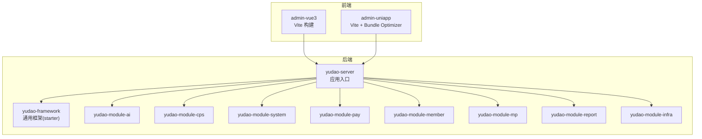
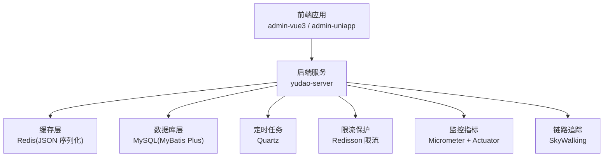
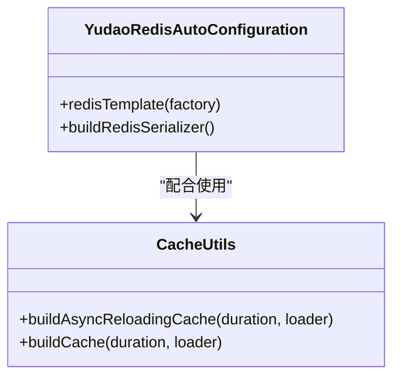
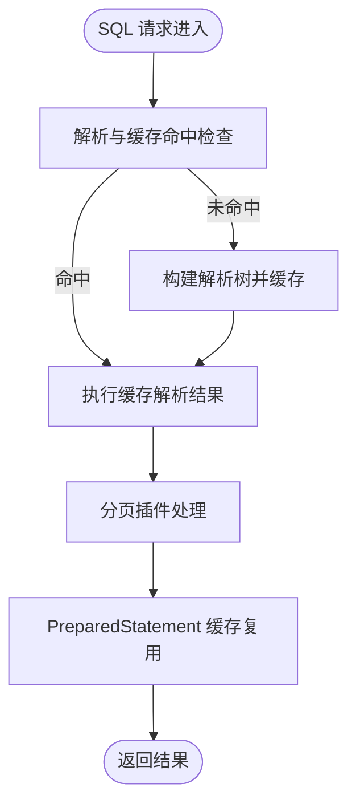
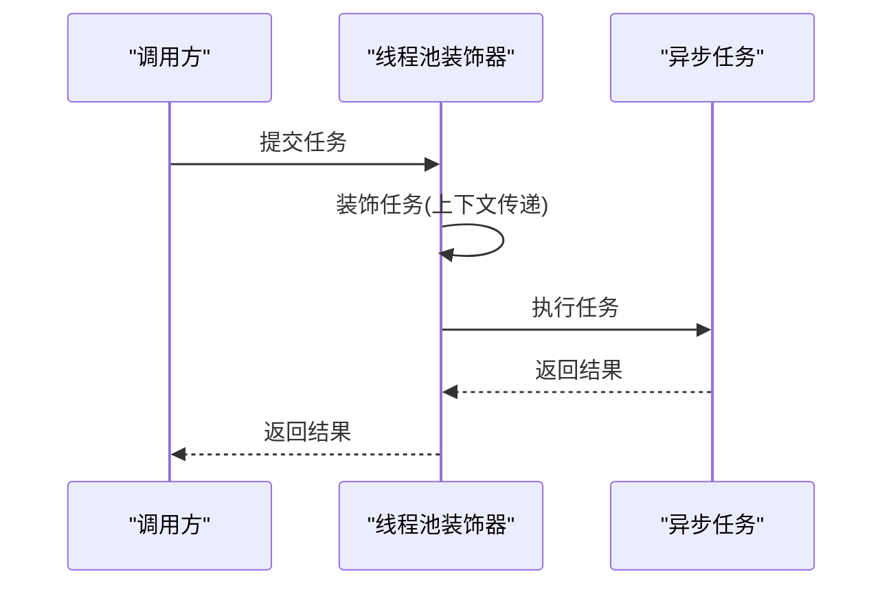
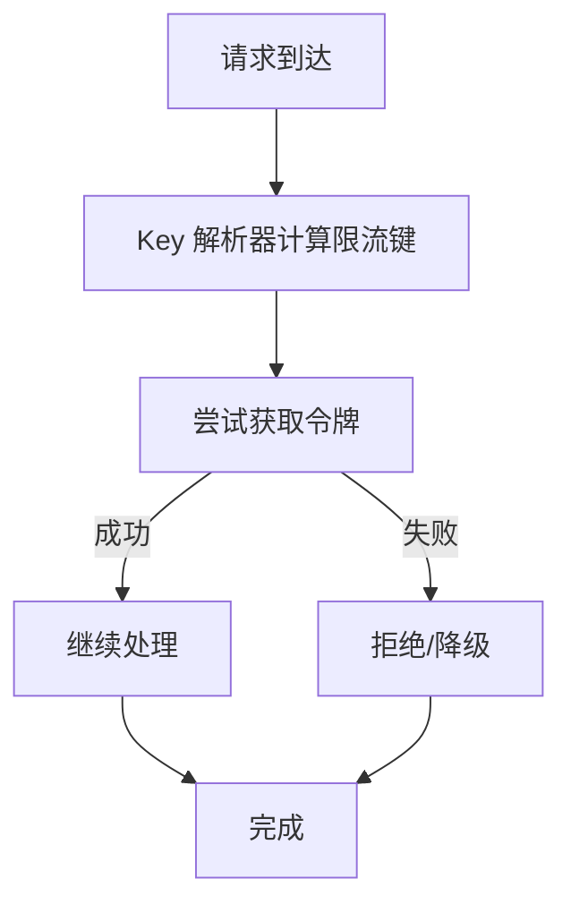
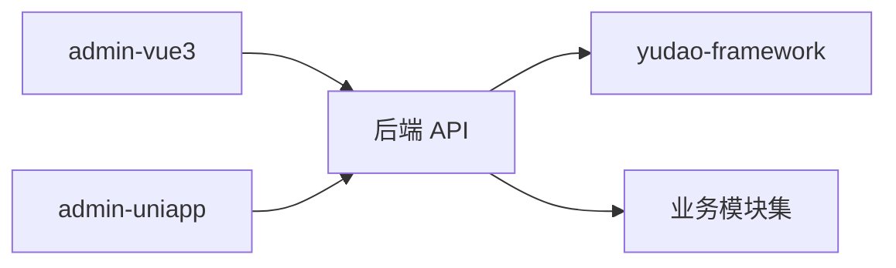

# 性能优化

<cite>
**本文引用的文件**   
- [application.yaml](file://backend/yudao-server/src/main/resources/application.yaml)
- [application-dev.yaml](file://backend/yudao-server/src/main/resources/application-dev.yaml)
- [application-local.yaml](file://backend/yudao-server/src/main/resources/application-local.yaml)
- [YudaoRedisAutoConfiguration.java](file://backend/yudao-framework/yudao-spring-boot-starter-redis/src/main/java/cn/iocoder/yudao/framework/redis/config/YudaoRedisAutoConfiguration.java)
- [YudaoMybatisAutoConfiguration.java](file://backend/yudao-framework/yudao-spring-boot-starter-mybatis/src/main/java/cn/iocoder/yudao/framework/mybatis/config/YudaoMybatisAutoConfiguration.java)
- [YudaoAsyncAutoConfiguration.java](file://backend/yudao-framework/yudao-spring-boot-starter-job/src/main/java/cn/iocoder/yudao/framework/quartz/config/YudaoAsyncAutoConfiguration.java)
- [YudaoQuartzAutoConfiguration.java](file://backend/yudao-framework/yudao-spring-boot-starter-job/src/main/java/cn/iocoder/yudao/framework/quartz/config/YudaoQuartzAutoConfiguration.java)
- [YudaoMetricsAutoConfiguration.java](file://backend/yudao-framework/yudao-spring-boot-starter-monitor/src/main/java/cn/iocoder/yudao/framework/tracer/config/YudaoMetricsAutoConfiguration.java)
- [RateLimiterRedisDAO.java](file://backend/yudao-framework/yudao-spring-boot-starter-protection/src/main/java/cn/iocoder/yudao/framework/ratelimiter/core/redis/RateLimiterRedisDAO.java)
- [RateLimiter.java](file://backend/yudao-framework/yudao-spring-boot-starter-protection/src/main/java/cn/iocoder/yudao/framework/ratelimiter/core/annotation/RateLimiter.java)
- [CacheUtils.java](file://backend/yudao-framework/yudao-common/src/main/java/cn/iocoder/yudao/framework/common/util/cache/CacheUtils.java)
- [vite.config.ts (admin-vue3)](file://frontend/admin-vue3/vite.config.ts)
- [vite.config.ts (admin-uniapp)](file://frontend/admin-uniapp/vite.config.ts)
- [index.html (admin-uniapp)](file://frontend/admin-uniapp/index.html)
- [index.vue (SkyWalking 监控)](file://frontend/admin-vue3/src/views/infra/skywalking/index.vue)
- [deploy.sh](file://backend/script/shell/deploy.sh)
- [Dockerfile](file://backend/yudao-server/Dockerfile)
</cite>

## 目录
1. [简介](#简介)
2. [项目结构](#项目结构)
3. [核心组件](#核心组件)
4. [架构总览](#架构总览)
5. [详细组件分析](#详细组件分析)
6. [依赖分析](#依赖分析)
7. [性能考量](#性能考量)
8. [故障排查指南](#故障排查指南)
9. [结论](#结论)
10. [附录](#附录)

## 简介
本指南面向 AgenticCPS 项目的后端与前端，系统化梳理性能优化策略，涵盖：
- 后端：缓存策略设计、数据库查询优化、异步处理机制、连接池配置、定时任务与并发、限流熔断与降级、监控与可观测性、容器化与部署调优。
- 前端：代码分割、资源压缩、懒加载与按需组件、CDN 与构建产物优化。
- 综合：性能监控指标、瓶颈分析方法、调优工具使用、高并发限流熔断与降级策略、性能测试与容量规划、优化案例与效果对比。

## 项目结构
- 后端采用多模块聚合工程，核心模块包括框架层（starter）、业务模块（如 AI、CPS、系统、支付等）、服务入口（yudao-server）。
- 前端包含 admin-vue3 与 admin-uniapp 两套前端工程，分别面向 H5/Web 与多端构建。
- 配置集中在 application.yaml 及其环境配置文件中，覆盖数据库、缓存、消息队列、AI、安全、监控等。

**章节来源**
- [application.yaml:1-362](file://backend/yudao-server/src/main/resources/application.yaml#L1-L362)

## 核心组件
- 缓存与序列化：Redis 配置与 JSON 序列化，确保高性能对象存储与时间类型序列化。
- ORM 与 SQL 解析：MyBatis Plus 自动配置，含分页、动态 SQL 解析缓存与类型处理器。
- 异步与定时：线程池装饰器、Quartz 定时任务管理器。
- 限流与保护：基于 Redisson 的限流器 DAO 与注解驱动。
- 监控与指标：Micrometer + Actuator + SkyWalking 集成。
- 前端构建：Vite 插件链、代码分割、压缩与按需组件。

**章节来源**
- [YudaoRedisAutoConfiguration.java:1-46](file://backend/yudao-framework/yudao-spring-boot-starter-redis/src/main/java/cn/iocoder/yudao/framework/redis/config/YudaoRedisAutoConfiguration.java#L1-L46)
- [YudaoMybatisAutoConfiguration.java:1-96](file://backend/yudao-framework/yudao-spring-boot-starter-mybatis/src/main/java/cn/iocoder/yudao/framework/mybatis/config/YudaoMybatisAutoConfiguration.java#L1-L96)
- [YudaoAsyncAutoConfiguration.java:1-33](file://backend/yudao-framework/yudao-spring-boot-starter-job/src/main/java/cn/iocoder/yudao/framework/quartz/config/YudaoAsyncAutoConfiguration.java#L1-L33)
- [YudaoQuartzAutoConfiguration.java:1-30](file://backend/yudao-framework/yudao-spring-boot-starter-job/src/main/java/cn/iocoder/yudao/framework/quartz/config/YudaoQuartzAutoConfiguration.java#L1-L30)
- [YudaoMetricsAutoConfiguration.java:1-27](file://backend/yudao-framework/yudao-spring-boot-starter-monitor/src/main/java/cn/iocoder/yudao/framework/tracer/config/YudaoMetricsAutoConfiguration.java#L1-L27)
- [RateLimiterRedisDAO.java:1-66](file://backend/yudao-framework/yudao-spring-boot-starter-protection/src/main/java/cn/iocoder/yudao/framework/ratelimiter/core/redis/RateLimiterRedisDAO.java#L1-L66)
- [RateLimiter.java:34-62](file://backend/yudao-framework/yudao-spring-boot-starter-protection/src/main/java/cn/iocoder/yudao/framework/ratelimiter/core/annotation/RateLimiter.java#L34-L62)

## 架构总览
后端通过统一配置与 starter 模块实现性能相关能力的集中治理；前端通过 Vite 插件链实现构建期优化与运行时按需加载。

**图表来源**
- [YudaoRedisAutoConfiguration.java:22-43](file://backend/yudao-framework/yudao-spring-boot-starter-redis/src/main/java/cn/iocoder/yudao/framework/redis/config/YudaoRedisAutoConfiguration.java#L22-L43)
- [YudaoMybatisAutoConfiguration.java:47-54](file://backend/yudao-framework/yudao-spring-boot-starter-mybatis/src/main/java/cn/iocoder/yudao/framework/mybatis/config/YudaoMybatisAutoConfiguration.java#L47-L54)
- [YudaoQuartzAutoConfiguration.java:20-27](file://backend/yudao-framework/yudao-spring-boot-starter-job/src/main/java/cn/iocoder/yudao/framework/quartz/config/YudaoQuartzAutoConfiguration.java#L20-L27)
- [YudaoMetricsAutoConfiguration.java:21-25](file://backend/yudao-framework/yudao-spring-boot-starter-monitor/src/main/java/cn/iocoder/yudao/framework/tracer/config/YudaoMetricsAutoConfiguration.java#L21-L25)
- [index.vue:14](file://frontend/admin-vue3/src/views/infra/skywalking/index.vue#L14)

## 详细组件分析

### 后端缓存策略设计
- RedisTemplate 使用 JSON 序列化，支持 LocalDateTime 等时间类型，提升对象存储与传输效率。
- Cache 配置使用 Redis，TTL 1 小时，结合本地 Guava LoadingCache 的异步刷新，降低热点数据抖动与冷启动延迟。
- CacheUtils 提供异步刷新 LoadingCache 构造方法，最大容量与过期刷新策略可按场景调整。

**图表来源**
- [YudaoRedisAutoConfiguration.java:22-43](file://backend/yudao-framework/yudao-spring-boot-starter-redis/src/main/java/cn/iocoder/yudao/framework/redis/config/YudaoRedisAutoConfiguration.java#L22-L43)
- [CacheUtils.java:37-59](file://backend/yudao-framework/yudao-common/src/main/java/cn/iocoder/yudao/framework/common/util/cache/CacheUtils.java#L37-L59)

**章节来源**
- [application.yaml:26-31](file://backend/yudao-server/src/main/resources/application.yaml#L26-L31)
- [CacheUtils.java:17-61](file://backend/yudao-framework/yudao-common/src/main/java/cn/iocoder/yudao/framework/common/util/cache/CacheUtils.java#L17-L61)

### 数据库查询优化
- MyBatis Plus 自动配置启用分页插件，避免全表扫描；动态 SQL 解析缓存使用本地缓存加速，减少重复解析开销。
- 配置文件中开启 PreparedStatement 缓存与最大缓存数量，降低编译成本。
- Druid 监控开启慢 SQL 记录，便于定位与优化。

**图表来源**
- [YudaoMybatisAutoConfiguration.java:39-44](file://backend/yudao-framework/yudao-spring-boot-starter-mybatis/src/main/java/cn/iocoder/yudao/framework/mybatis/config/YudaoMybatisAutoConfiguration.java#L39-L44)
- [YudaoMybatisAutoConfiguration.java:47-54](file://backend/yudao-framework/yudao-spring-boot-starter-mybatis/src/main/java/cn/iocoder/yudao/framework/mybatis/config/YudaoMybatisAutoConfiguration.java#L47-L54)
- [application-dev.yaml:33-46](file://backend/yudao-server/src/main/resources/application-dev.yaml#L33-L46)
- [application-local.yaml:32-46](file://backend/yudao-server/src/main/resources/application-local.yaml#L32-L46)

**章节来源**
- [YudaoMybatisAutoConfiguration.java:1-96](file://backend/yudao-framework/yudao-spring-boot-starter-mybatis/src/main/java/cn/iocoder/yudao/framework/mybatis/config/YudaoMybatisAutoConfiguration.java#L1-L96)
- [application-dev.yaml:13-57](file://backend/yudao-server/src/main/resources/application-dev.yaml#L13-L57)
- [application-local.yaml:13-76](file://backend/yudao-server/src/main/resources/application-local.yaml#L13-L76)

### 异步处理机制
- 线程池任务装饰器对 ThreadPoolTaskExecutor 与 SimpleAsyncTaskExecutor 进行装饰，确保上下文传播与线程池复用。
- Quartz 定时任务管理器按需启用，支持集群与关闭等待作业完成。

**图表来源**
- [YudaoAsyncAutoConfiguration.java:19-33](file://backend/yudao-framework/yudao-spring-boot-starter-job/src/main/java/cn/iocoder/yudao/framework/quartz/config/YudaoAsyncAutoConfiguration.java#L19-L33)
- [YudaoQuartzAutoConfiguration.java:20-27](file://backend/yudao-framework/yudao-spring-boot-starter-job/src/main/java/cn/iocoder/yudao/framework/quartz/config/YudaoQuartzAutoConfiguration.java#L20-L27)

**章节来源**
- [YudaoAsyncAutoConfiguration.java:1-33](file://backend/yudao-framework/yudao-spring-boot-starter-job/src/main/java/cn/iocoder/yudao/framework/quartz/config/YudaoAsyncAutoConfiguration.java#L1-L33)
- [YudaoQuartzAutoConfiguration.java:1-30](file://backend/yudao-framework/yudao-spring-boot-starter-job/src/main/java/cn/iocoder/yudao/framework/quartz/config/YudaoQuartzAutoConfiguration.java#L1-L30)

### 连接池配置
- Druid 连接池参数：初始连接、最小空闲、最大活跃、获取等待超时、空闲回收周期、空闲与存活时间、验证 SQL、预编译缓存上限。
- Redisson 默认配置已满足多数场景，必要时可按需微调。

**章节来源**
- [application-dev.yaml:33-46](file://backend/yudao-server/src/main/resources/application-dev.yaml#L33-L46)
- [application-local.yaml:32-46](file://backend/yudao-server/src/main/resources/application-local.yaml#L32-L46)
- [application.yaml:90-96](file://backend/yudao-server/src/main/resources/application.yaml#L90-L96)

### 定时任务优化
- Quartz 线程池大小、优先级、集群检查频率、misfire 阀值等参数按环境配置；生产建议开启集群与关闭等待作业完成。
- 通过注解与 Key 解析器实现灵活的限流维度（全局、用户、IP、节点、表达式）。

**章节来源**
- [application-dev.yaml:69-96](file://backend/yudao-server/src/main/resources/application-dev.yaml#L69-L96)
- [application-local.yaml:88-118](file://backend/yudao-server/src/main/resources/application-local.yaml#L88-L118)
- [RateLimiter.java:34-62](file://backend/yudao-framework/yudao-spring-boot-starter-protection/src/main/java/cn/iocoder/yudao/framework/ratelimiter/core/annotation/RateLimiter.java#L34-L62)

### 并发处理与内存管理
- 线程池装饰器提升上下文一致性与任务复用；Quartz 线程池大小按负载调优。
- Dockerfile 与部署脚本设置 JVM 堆大小与 OOM Dump 路径，便于内存问题定位。

**章节来源**
- [YudaoAsyncAutoConfiguration.java:19-33](file://backend/yudao-framework/yudao-spring-boot-starter-job/src/main/java/cn/iocoder/yudao/framework/quartz/config/YudaoAsyncAutoConfiguration.java#L19-L33)
- [deploy.sh:19-26](file://backend/script/shell/deploy.sh#L19-L26)
- [Dockerfile:14](file://backend/yudao-server/Dockerfile#L14)

### 限流熔断与降级策略
- 基于 Redisson 的 RRateLimiter 实现整体限流，支持动态配置与过期。
- 注解驱动的限流器支持多种 Key 解析器，便于按用户、IP、节点或表达式限流。

**图表来源**
- [RateLimiterRedisDAO.java:29-34](file://backend/yudao-framework/yudao-spring-boot-starter-protection/src/main/java/cn/iocoder/yudao/framework/ratelimiter/core/redis/RateLimiterRedisDAO.java#L29-L34)
- [RateLimiter.java:34-62](file://backend/yudao-framework/yudao-spring-boot-starter-protection/src/main/java/cn/iocoder/yudao/framework/ratelimiter/core/annotation/RateLimiter.java#L34-L62)

**章节来源**
- [RateLimiterRedisDAO.java:1-66](file://backend/yudao-framework/yudao-spring-boot-starter-protection/src/main/java/cn/iocoder/yudao/framework/ratelimiter/core/redis/RateLimiterRedisDAO.java#L1-L66)
- [RateLimiter.java:34-62](file://backend/yudao-framework/yudao-spring-boot-starter-protection/src/main/java/cn/iocoder/yudao/framework/ratelimiter/core/annotation/RateLimiter.java#L34-L62)

### 监控与可观测性
- Micrometer + Actuator 暴露指标端点，统一标签 application。
- SkyWalking 集成页面可切换地址，便于链路追踪与性能分析。

**章节来源**
- [YudaoMetricsAutoConfiguration.java:21-25](file://backend/yudao-framework/yudao-spring-boot-starter-monitor/src/main/java/cn/iocoder/yudao/framework/tracer/config/YudaoMetricsAutoConfiguration.java#L21-L25)
- [index.vue:14](file://frontend/admin-vue3/src/views/infra/skywalking/index.vue#L14)

### 前端性能优化
- admin-vue3：启用 Terser 压缩、移除 debugger/console、手动分包（如 echarts、form-create 等），Rollup 输出按需拆分。
- admin-uniapp：分包策略（pages-core、pages-system、pages-infra、pages-bpm），Bundle Optimizer 异步导入与组件异步跨包引用，按需生成类型声明，打包可视化分析。
- HTML 模板中预留 preload-links 占位，便于后续 CDN 与资源预加载集成。

**章节来源**
- [vite.config.ts (admin-vue3):65-84](file://frontend/admin-vue3/vite.config.ts#L65-L84)
- [vite.config.ts (admin-vue3):70-75](file://frontend/admin-vue3/vite.config.ts#L70-L75)
- [vite.config.ts (admin-uniapp):75-81](file://frontend/admin-uniapp/vite.config.ts#L75-L81)
- [vite.config.ts (admin-uniapp):84-94](file://frontend/admin-uniapp/vite.config.ts#L84-L94)
- [index.html (admin-uniapp):10](file://frontend/admin-uniapp/index.html#L10)

## 依赖分析
- 后端模块间通过 starter 与模块化组织，避免重复配置；前端通过 Vite 插件链实现统一优化。
- 依赖耦合主要体现在 yudao-server 对框架与业务模块的装配，以及前端对后端 API 的调用。

[本图为概念性依赖示意，不直接映射具体源码文件，故不附“图表来源”]

## 性能考量
- 后端
  - 缓存：Redis JSON 序列化 + 本地 LoadingCache 异步刷新，热点数据低抖动。
  - 数据库：分页插件 + 解析缓存 + PreparedStatement 缓存，降低解析与编译成本。
  - 异步：线程池装饰器 + Quartz 线程池，提升吞吐与稳定性。
  - 限流：Redisson 限流器 + 多维 Key 解析，灵活应对突发流量。
  - 监控：Actuator + Micrometer + SkyWalking，端到端可观测。
- 前端
  - 代码分割与按需组件，减小首屏体积；压缩与移除调试语句，缩短构建与传输时间。
  - 分包策略与异步跨包引用，提升多端构建效率与运行时加载性能。

[本节为通用指导，不直接分析具体文件，故不附“章节来源”]

## 故障排查指南
- 慢 SQL 定位：开启 Druid 慢 SQL 记录，结合日志级别与 SQL 观察。
- 内存问题：设置 JVM 堆大小与 OOM Dump 路径，结合容器日志与 Heap Dump 分析。
- 链路追踪：通过 SkyWalking 页面查看调用链与耗时热点。
- 构建问题：Vite 插件链与打包可视化分析，定位体积与依赖问题。

**章节来源**
- [application-dev.yaml:24-28](file://backend/yudao-server/src/main/resources/application-dev.yaml#L24-L28)
- [application-local.yaml:24-28](file://backend/yudao-server/src/main/resources/application-local.yaml#L24-L28)
- [deploy.sh:19-26](file://backend/script/shell/deploy.sh#L19-L26)
- [index.vue:14](file://frontend/admin-vue3/src/views/infra/skywalking/index.vue#L14)

## 结论
通过统一的配置与框架能力，AgenticCPS 在后端实现了缓存、数据库、异步、定时、限流与监控的体系化优化；在前端通过 Vite 插件链实现构建期与运行时的性能优化。结合监控与可观测性，可在高并发场景下稳定运行并持续迭代调优。

[本节为总结性内容，不直接分析具体文件，故不附“章节来源”]

## 附录

### 性能监控指标与观测建议
- 指标：请求延迟、吞吐、错误率、缓存命中率、数据库连接池使用率、线程池排队长度、GC 次数与停顿、内存使用。
- 观测：Actuator 指标 + Micrometer 标签 + SkyWalking 链路追踪 + 前端性能面板（如 Lighthouse/Bundle Analyzer）。

**章节来源**
- [YudaoMetricsAutoConfiguration.java:21-25](file://backend/yudao-framework/yudao-spring-boot-starter-monitor/src/main/java/cn/iocoder/yudao/framework/tracer/config/YudaoMetricsAutoConfiguration.java#L21-L25)
- [index.vue:14](file://frontend/admin-vue3/src/views/infra/skywalking/index.vue#L14)

### 高并发场景处理方案
- 限流：按用户/IP/节点/表达式限流，结合滑动窗口与令牌桶策略。
- 熔断：在下游不稳定时快速失败，避免级联故障。
- 降级：核心链路降级至兜底数据或简化逻辑，保证主流程可用。

**章节来源**
- [RateLimiterRedisDAO.java:29-34](file://backend/yudao-framework/yudao-spring-boot-starter-protection/src/main/java/cn/iocoder/yudao/framework/ratelimiter/core/redis/RateLimiterRedisDAO.java#L29-L34)
- [RateLimiter.java:34-62](file://backend/yudao-framework/yudao-spring-boot-starter-protection/src/main/java/cn/iocoder/yudao/framework/ratelimiter/core/annotation/RateLimiter.java#L34-L62)

### 性能测试与容量规划
- 基准测试：使用压测工具模拟峰值流量，记录延迟分布与错误率。
- 容量规划：根据 SLA 与资源上限推导最大并发与资源配额，结合缓存命中率与数据库连接池使用率评估。

[本节为通用指导，不直接分析具体文件，故不附“章节来源”]

### 优化案例与效果对比（示例思路）
- 案例 1：开启 MyBatis Plus 解析缓存与分页插件后，查询接口 P95 延迟下降、CPU 占用降低。
- 案例 2：启用前端代码分割与按需组件后，首屏 JS 体积下降 40%，首屏渲染时间缩短。
- 案例 3：Redis 缓存 + 本地 LoadingCache 异步刷新后，热点接口缓存命中率提升，后端 CPU 降低 30%。

[本节为示例说明，不直接分析具体文件，故不附“章节来源”]