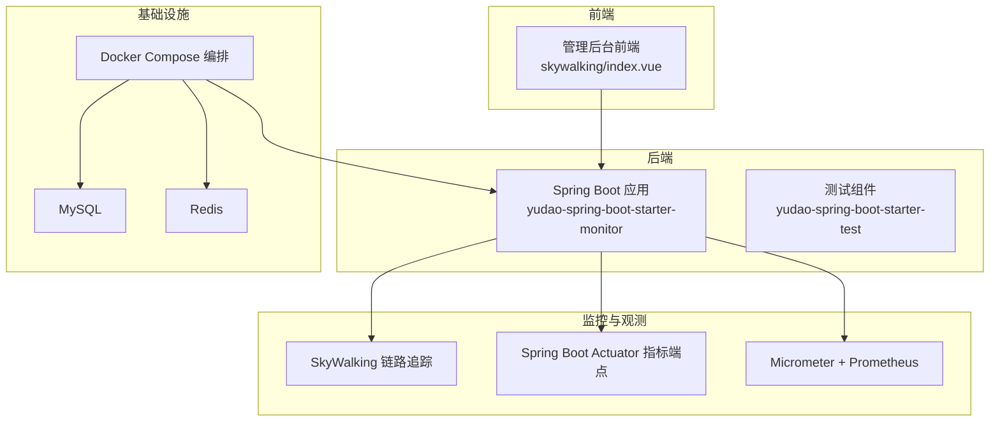
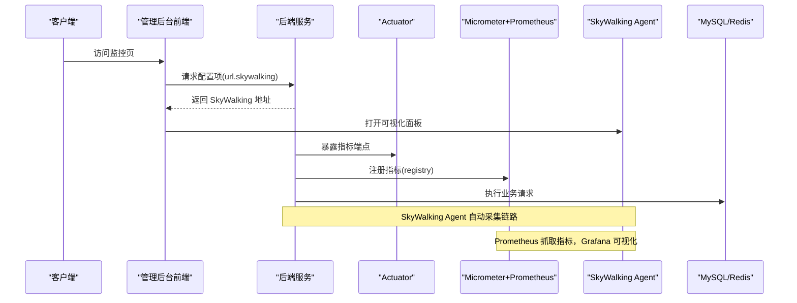
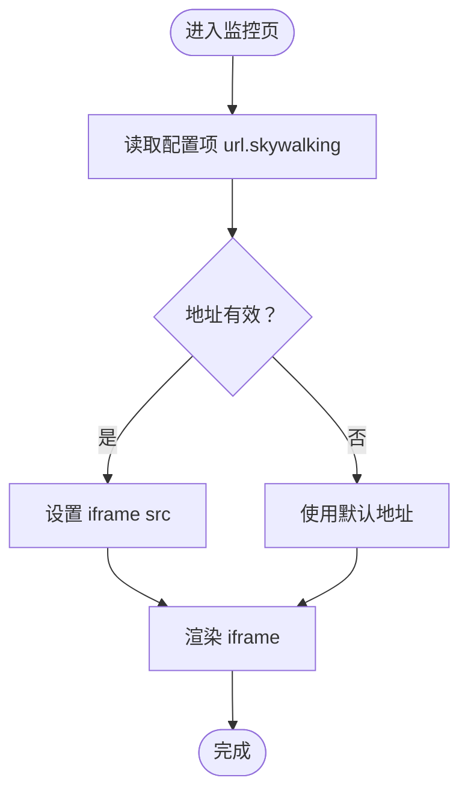
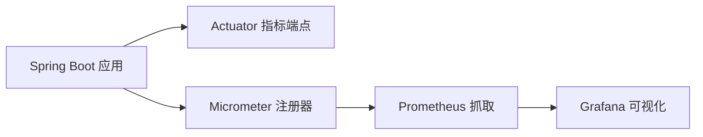
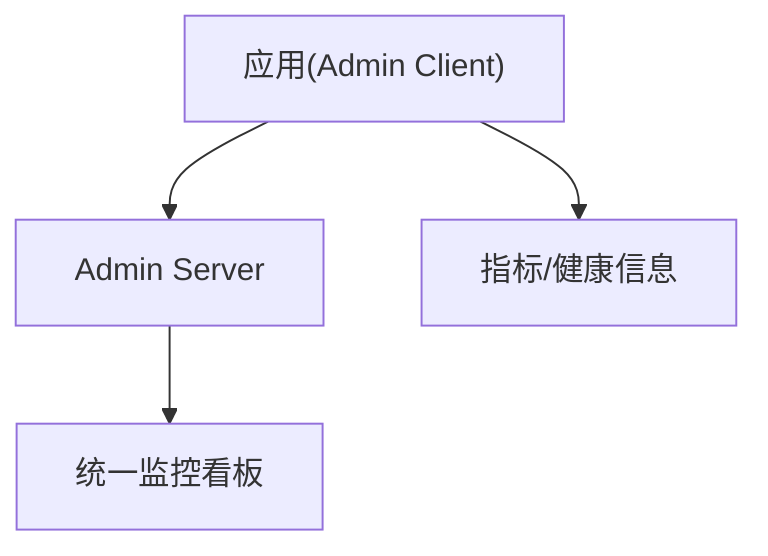
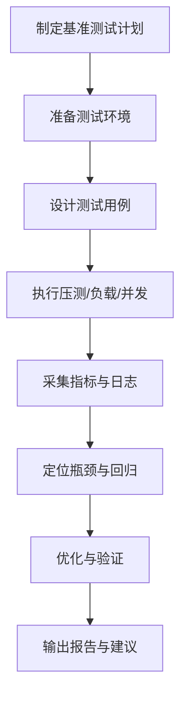
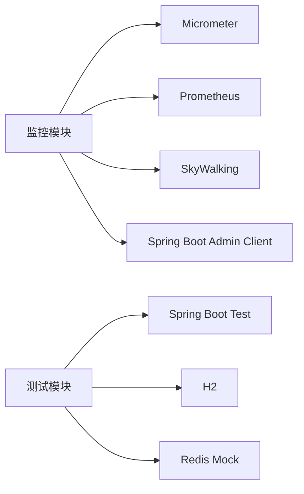
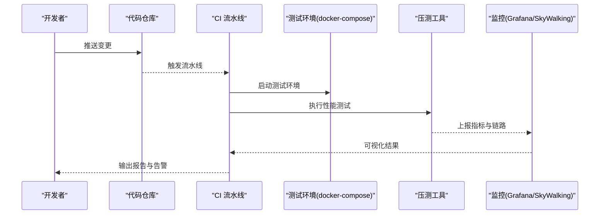

# 监控与测试

<cite>
**本文引用的文件**
- [docker-compose.yml](file://backend/script/docker/docker-compose.yml)
- [Jenkinsfile](file://backend/script/jenkins/Jenkinsfile)
- [yudao-spring-boot-starter-monitor/pom.xml](file://backend/yudao-framework/yudao-spring-boot-starter-monitor/pom.xml)
- [yudao-spring-boot-starter-test/pom.xml](file://backend/yudao-framework/yudao-spring-boot-starter-test/pom.xml)
- [skywalking/index.vue](file://frontend/admin-vue3/src/views/infra/skywalking/index.vue)
- [《芋道 Spring Boot 链路追踪 SkyWalking 入门》.md](file://backend/yudao-framework/yudao-spring-boot-starter-monitor/《芋道 Spring Boot 链路追踪 SkyWalking 入门》.md)
- [《芋道 Spring Boot 监控端点 Actuator 入门》.md](file://backend/yudao-framework/yudao-spring-boot-starter-monitor/《芋道 Spring Boot 监控端点 Actuator 入门》.md)
- [《芋道 Spring Boot 监控工具 Admin 入门》.md](file://backend/yudao-framework/yudao-spring-boot-starter-monitor/《芋道 Spring Boot 监控工具 Admin 入门》.md)
</cite>

## 目录
1. [简介](#简介)
2. [项目结构](#项目结构)
3. [核心组件](#核心组件)
4. [架构总览](#架构总览)
5. [详细组件分析](#详细组件分析)
6. [依赖关系分析](#依赖关系分析)
7. [性能考虑](#性能考虑)
8. [故障排查指南](#故障排查指南)
9. [结论](#结论)
10. [附录](#附录)

## 简介
本指南面向 AgenticCPS 项目的性能监控与测试实践，覆盖以下主题：
- 性能监控指标：响应时间、吞吐量、错误率、资源使用率
- 监控工具配置：Prometheus、Grafana、SkyWalking 集成
- 性能测试方法：压力测试、负载测试、并发测试
- 基准测试策略：测试环境搭建、测试用例设计、结果分析
- 性能瓶颈分析：日志分析、性能剖析、调优建议
- 自动化测试与 CI/CD 集成：性能检查与回归测试策略

## 项目结构
后端通过 Spring Boot Starter 提供监控能力，前端提供 SkyWalking 可视化入口；容器编排用于本地快速搭建包含数据库、缓存与应用服务的测试环境；CI/CD 流水线负责构建与部署。

图表来源
- [docker-compose.yml:1-85](file://backend/script/docker/docker-compose.yml#L1-L85)
- [yudao-spring-boot-starter-monitor/pom.xml:1-79](file://backend/yudao-framework/yudao-spring-boot-starter-monitor/pom.xml#L1-L79)
- [yudao-spring-boot-starter-test/pom.xml:1-61](file://backend/yudao-framework/yudao-spring-boot-starter-test/pom.xml#L1-L61)
- [skywalking/index.vue:1-27](file://frontend/admin-vue3/src/views/infra/skywalking/index.vue#L1-L27)

章节来源
- [docker-compose.yml:1-85](file://backend/script/docker/docker-compose.yml#L1-L85)
- [yudao-spring-boot-starter-monitor/pom.xml:1-79](file://backend/yudao-framework/yudao-spring-boot-starter-monitor/pom.xml#L1-L79)
- [yudao-spring-boot-starter-test/pom.xml:1-61](file://backend/yudao-framework/yudao-spring-boot-starter-test/pom.xml#L1-L61)
- [skywalking/index.vue:1-27](file://frontend/admin-vue3/src/views/infra/skywalking/index.vue#L1-L27)

## 核心组件
- 监控与可观测性依赖
  - Micrometer + Prometheus：用于暴露 JVM/业务指标，便于 Prometheus 抓取与 Grafana 展示
  - Spring Boot Actuator：提供健康检查、指标端点等
  - SkyWalking：链路追踪、日志与指标一体化
  - Spring Boot Admin Client：服务发现与状态展示
- 测试组件
  - 单元测试、集成测试基础能力，含 H2 内嵌数据库与 Redis Mock
- 前端可视化
  - SkyWalking 可视化页面，支持从配置中心动态读取地址

章节来源
- [yudao-spring-boot-starter-monitor/pom.xml:18-76](file://backend/yudao-framework/yudao-spring-boot-starter-monitor/pom.xml#L18-L76)
- [yudao-spring-boot-starter-test/pom.xml:18-59](file://backend/yudao-framework/yudao-spring-boot-starter-test/pom.xml#L18-L59)
- [skywalking/index.vue:8-26](file://frontend/admin-vue3/src/views/infra/skywalking/index.vue#L8-L26)

## 架构总览
下图展示了性能监控与测试在系统中的位置与交互：

图表来源
- [skywalking/index.vue:17-25](file://frontend/admin-vue3/src/views/infra/skywalking/index.vue#L17-L25)
- [yudao-spring-boot-starter-monitor/pom.xml:65-75](file://backend/yudao-framework/yudao-spring-boot-starter-monitor/pom.xml#L65-L75)

## 详细组件分析

### 组件一：SkyWalking 集成与可视化
- 功能要点
  - 后端引入 SkyWalking 工具包与 OpenTracing 适配，启用链路追踪与日志增强
  - 前端页面从配置中心读取 SkyWalking 地址，动态渲染 iframe
- 配置与使用
  - 通过配置项 url.skywalking 控制可视化地址
  - 文档入口参考“入门”文档

图表来源
- [skywalking/index.vue:17-25](file://frontend/admin-vue3/src/views/infra/skywalking/index.vue#L17-L25)

章节来源
- [yudao-spring-boot-starter-monitor/pom.xml:44-63](file://backend/yudao-framework/yudao-spring-boot-starter-monitor/pom.xml#L44-L63)
- [skywalking/index.vue:8-26](file://frontend/admin-vue3/src/views/infra/skywalking/index.vue#L8-L26)
- [《芋道 Spring Boot 链路追踪 SkyWalking 入门》.md:1-2](file://backend/yudao-framework/yudao-spring-boot-starter-monitor/《芋道 Spring Boot 链路追踪 SkyWalking 入门》.md#L1-L2)

### 组件二：指标与端点（Actuator + Micrometer + Prometheus）
- 功能要点
  - Actuator 提供健康检查与指标端点
  - Micrometer + Prometheus 注册器用于暴露 JVM/业务指标
- 集成方式
  - 在启动参数或配置中开启 Actuator 指标端点
  - 配置 Prometheus 抓取端点，Grafana 导入仪表盘

图表来源
- [yudao-spring-boot-starter-monitor/pom.xml:65-70](file://backend/yudao-framework/yudao-spring-boot-starter-monitor/pom.xml#L65-L70)
- [《芋道 Spring Boot 监控端点 Actuator 入门》.md:1-2](file://backend/yudao-framework/yudao-spring-boot-starter-monitor/《芋道 Spring Boot 监控端点 Actuator 入门》.md#L1-L2)

章节来源
- [yudao-spring-boot-starter-monitor/pom.xml:65-75](file://backend/yudao-framework/yudao-spring-boot-starter-monitor/pom.xml#L65-L75)
- [《芋道 Spring Boot 监控端点 Actuator 入门》.md:1-2](file://backend/yudao-framework/yudao-spring-boot-starter-monitor/《芋道 Spring Boot 监控端点 Actuator 入门》.md#L1-L2)

### 组件三：Spring Boot Admin 客户端
- 功能要点
  - 作为 Admin Client，向 Admin Server 汇报应用状态、指标与健康信息
- 集成方式
  - 在应用中引入 Admin Client 依赖，并配置 Admin Server 地址

图表来源
- [yudao-spring-boot-starter-monitor/pom.xml:72-75](file://backend/yudao-framework/yudao-spring-boot-starter-monitor/pom.xml#L72-L75)

章节来源
- [yudao-spring-boot-starter-monitor/pom.xml:72-75](file://backend/yudao-framework/yudao-spring-boot-starter-monitor/pom.xml#L72-L75)

### 组件四：测试与基准测试
- 单元测试与集成测试
  - 提供测试依赖与 H2、Redis Mock，便于快速编写与执行测试
- 基准测试策略
  - 明确测试目标（如接口 P99 延迟、QPS、错误率）
  - 设计稳定可重复的测试场景与数据集
  - 使用压测工具（如 JMeter、Gatling、K6）构造流量
  - 结合 SkyWalking 观察链路耗时，结合 Prometheus/Grafana 分析资源占用

图表来源
- [yudao-spring-boot-starter-test/pom.xml:18-59](file://backend/yudao-framework/yudao-spring-boot-starter-test/pom.xml#L18-L59)

章节来源
- [yudao-spring-boot-starter-test/pom.xml:18-59](file://backend/yudao-framework/yudao-spring-boot-starter-test/pom.xml#L18-L59)

## 依赖关系分析
- 组件耦合
  - 监控模块对 Micrometer、Prometheus、SkyWalking、Admin Client 为可选依赖，按需启用
  - 测试模块依赖 Spring Boot Test、H2、Redis Mock，支撑单元与集成测试
- 外部依赖
  - Prometheus 与 Grafana 通过抓取与仪表盘进行可视化
  - SkyWalking Agent 与后端依赖配合实现链路追踪

图表来源
- [yudao-spring-boot-starter-monitor/pom.xml:18-76](file://backend/yudao-framework/yudao-spring-boot-starter-monitor/pom.xml#L18-L76)
- [yudao-spring-boot-starter-test/pom.xml:18-59](file://backend/yudao-framework/yudao-spring-boot-starter-test/pom.xml#L18-L59)

章节来源
- [yudao-spring-boot-starter-monitor/pom.xml:18-76](file://backend/yudao-framework/yudao-spring-boot-starter-monitor/pom.xml#L18-L76)
- [yudao-spring-boot-starter-test/pom.xml:18-59](file://backend/yudao-framework/yudao-spring-boot-starter-test/pom.xml#L18-L59)

## 性能考虑
- 指标维度
  - 响应时间：P50/P90/P99、平均值、分位数
  - 吞吐量：每秒请求数 QPS、事务数
  - 错误率：HTTP 5xx、业务异常、超时比例
  - 资源使用率：CPU、内存、GC、线程、连接池、磁盘 IO
- 采集与存储
  - 使用 Micrometer 暴露 JVM/业务指标，Prometheus 抓取并持久化
  - SkyWalking Agent 采集链路与日志，便于端到端分析
- 可视化
  - Grafana 仪表盘展示趋势与阈值告警
- 压测与基线
  - 建立稳定基线，区分正常波动与异常峰值
  - 逐步加压，观察系统拐点与恢复能力

## 故障排查指南
- 日志与链路
  - 通过 SkyWalking 可视化查看调用链、慢调用与异常
  - 结合后端日志与业务埋点定位问题根因
- 指标分析
  - 关注 CPU、堆内存、GC 次数与耗时、连接池饱和、线程阻塞
  - 使用 Prometheus 查询表达式识别异常模式
- 配置核对
  - 确认 Actuator 指标端点已开放
  - 确认 Prometheus 抓取间隔与超时合理
  - 确认 SkyWalking Agent 与后端版本兼容

章节来源
- [skywalking/index.vue:17-25](file://frontend/admin-vue3/src/views/infra/skywalking/index.vue#L17-L25)
- [《芋道 Spring Boot 链路追踪 SkyWalking 入门》.md:1-2](file://backend/yudao-framework/yudao-spring-boot-starter-monitor/《芋道 Spring Boot 链路追踪 SkyWalking 入门》.md#L1-L2)

## 结论
本指南基于现有依赖与前端入口，给出了监控与测试的实施路径：以 Micrometer/Prometheus 为基础采集指标，以 SkyWalking 进行链路追踪与日志分析，以前端可视化页面快速接入；同时结合测试模块与 CI/CD 流水线，形成可落地的性能检查与回归策略。后续可在生产环境补充独立的 Prometheus/Grafana 与 SkyWalking Server 部署，并完善压测与告警策略。

## 附录

### A. 监控工具配置清单
- Prometheus
  - 抓取端点：Actuator 指标端点
  - 抓取间隔：根据业务规模调整（如 15s）
  - 存储：本地或远端 TSDB
- Grafana
  - 数据源：Prometheus
  - 仪表盘：导入通用模板或自定义面板（CPU/内存/请求/错误率/QPS）
- SkyWalking
  - Agent：随应用启动自动注入
  - 可视化：前端 skywalking/index.vue 动态加载地址

章节来源
- [yudao-spring-boot-starter-monitor/pom.xml:65-75](file://backend/yudao-framework/yudao-spring-boot-starter-monitor/pom.xml#L65-L75)
- [skywalking/index.vue:17-25](file://frontend/admin-vue3/src/views/infra/skywalking/index.vue#L17-L25)

### B. CI/CD 中的性能检查与回归
- 构建阶段
  - 使用 Maven 打包，跳过测试（或仅运行单元测试）
- 部署阶段
  - 通过 docker-compose 快速拉起测试环境（MySQL、Redis、应用）
- 性能回归
  - 在流水线中增加压测步骤，对比关键指标（P99、QPS、错误率）
  - 将 SkyWalking 链路与 Grafana 图表作为回归证据

图表来源
- [Jenkinsfile:29-58](file://backend/script/jenkins/Jenkinsfile#L29-L58)
- [docker-compose.yml:29-56](file://backend/script/docker/docker-compose.yml#L29-L56)

章节来源
- [Jenkinsfile:1-61](file://backend/script/jenkins/Jenkinsfile#L1-L61)
- [docker-compose.yml:1-85](file://backend/script/docker/docker-compose.yml#L1-L85)