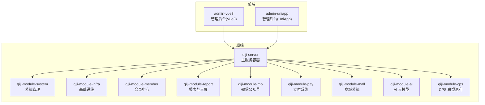
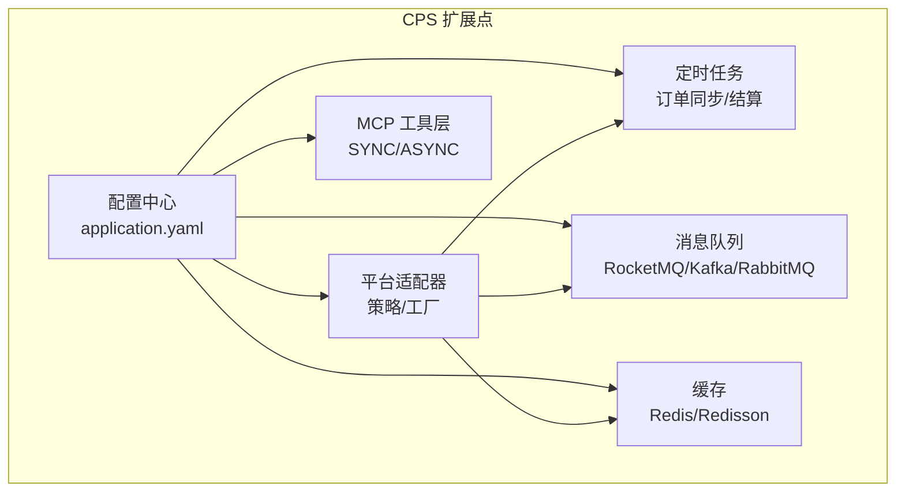
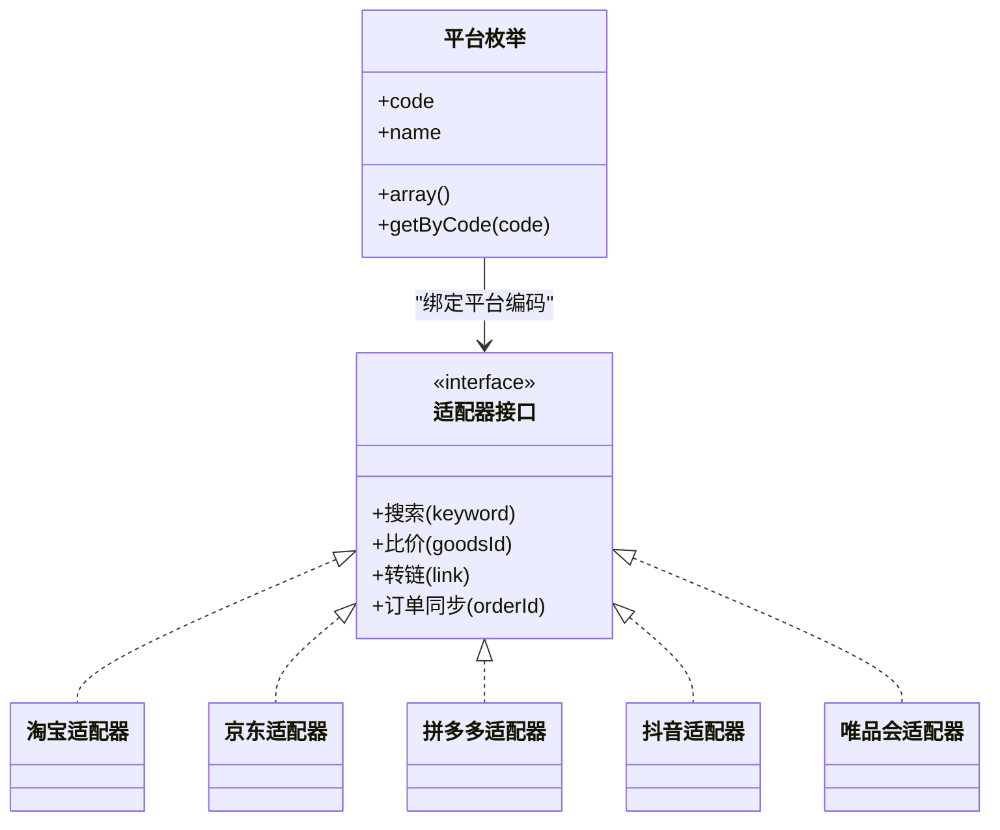
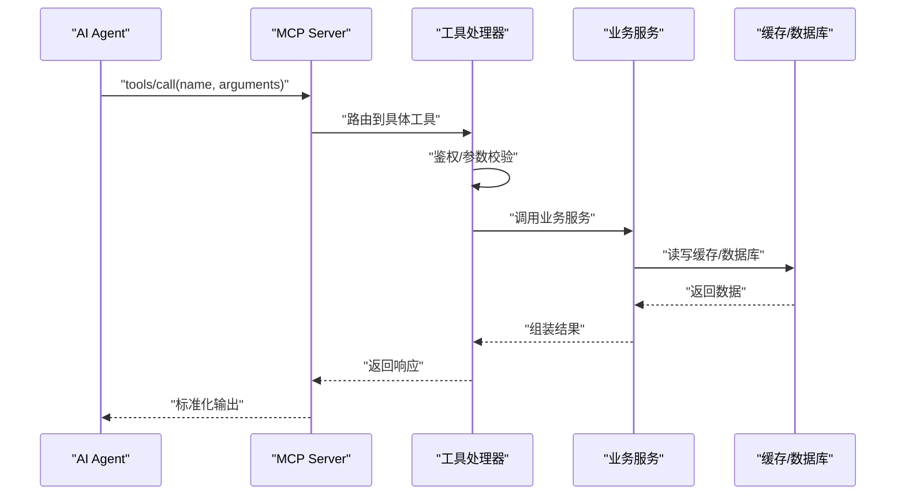
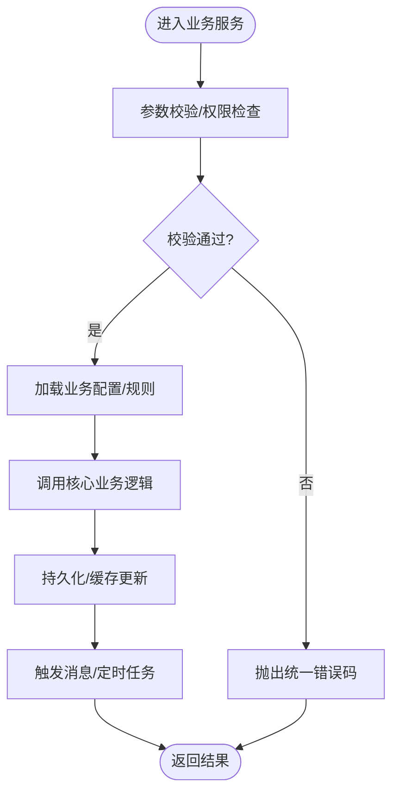
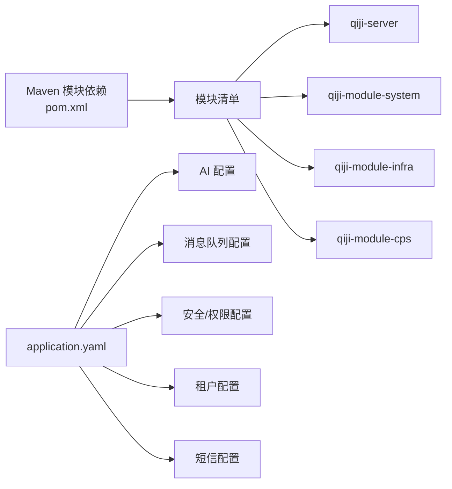

# 扩展开发

<cite>
**本文引用的文件**
- [README.md](file://README.md)
- [pom.xml](file://backend/pom.xml)
- [application.yaml](file://backend/qiji-server/src/main/resources/application.yaml)
- [CpsPlatformCodeEnum.java](file://backend/qiji-module-cps/qiji-module-cps-api/src/main/java/com/qiji/cps/module/cps/enums/CpsPlatformCodeEnum.java)
- [CpsErrorCodeConstants.java](file://backend/qiji-module-cps/qiji-module-cps-api/src/main/java/com/qiji/cps/module/cps/enums/CpsErrorCodeConstants.java)
- [docker-compose.yml](file://backend/script/docker/docker-compose.yml)
</cite>

## 目录
1. [简介](#简介)
2. [项目结构](#项目结构)
3. [核心组件](#核心组件)
4. [架构总览](#架构总览)
5. [详细组件分析](#详细组件分析)
6. [依赖分析](#依赖分析)
7. [性能考虑](#性能考虑)
8. [故障排查指南](#故障排查指南)
9. [结论](#结论)
10. [附录](#附录)

## 简介
本指南面向希望在 AgenticCPS 平台上进行扩展开发的工程师，围绕平台适配器扩展、AI 工具开发、业务服务扩展、UI 组件开发四大方向，系统讲解如何在现有模块化架构上进行插件化扩展；同时提供自定义配置方法（系统参数、业务规则、权限控制、集成配置）、第三方集成（API/SDK/Webhook/数据同步）的完整实施流程，并总结最佳实践（模块化设计、接口规范、性能优化、安全加固）、扩展点识别、插件架构设计、版本兼容与升级迁移策略，帮助开发者构建稳定、可维护、可演进的系统扩展与定制化解决方案。

## 项目结构
AgenticCPS 采用多模块 Maven 工程组织，后端以 qiji-server 为核心容器，按领域拆分为系统管理、基础设施、会员中心、报表、微信公众号、支付、商城、AI、CPS 等模块；前端包含 Vue3 管理后台与 UniApp 多端应用。整体采用 Spring Boot 3.5.9 + Spring AI + MyBatis Plus + Redis + Flowable + Vue3/UniApp 技术栈，具备完善的 CI/CD、Docker 一键部署能力。

**图表来源**
- [pom.xml:10-25](file://backend/pom.xml#L10-L25)
- [README.md:267-284](file://README.md#L267-L284)

**章节来源**
- [pom.xml:10-25](file://backend/pom.xml#L10-L25)
- [README.md:267-284](file://README.md#L267-L284)

## 核心组件
- 平台适配器扩展：CPS 模块提供 taobao/jd/pdd/douyin 等平台适配器，采用策略/工厂模式，新增平台只需实现统一接口并注册，即可无缝接入搜索、比价、转链、订单同步等能力。
- AI 工具开发：通过 MCP（Model Context Protocol）协议暴露 5 个开箱即用的 AI Tools，支持外部 Agent 直接调用；系统内置多模型厂商配置，便于扩展新的大模型接入。
- 业务服务扩展：以模块化服务层为核心，结合枚举与错误码常量定义业务域规则，便于在不破坏契约的前提下扩展业务逻辑。
- UI 组件开发：前端提供 Vue3 与 UniApp 两套管理后台，支持插件化 UI 组件与路由配置，便于按需扩展页面与交互。

**章节来源**
- [README.md:229-249](file://README.md#L229-L249)
- [CpsPlatformCodeEnum.java:16-24](file://backend/qiji-module-cps/qiji-module-cps-api/src/main/java/com/qiji/cps/module/cps/enums/CpsPlatformCodeEnum.java#L16-L24)
- [CpsErrorCodeConstants.java:10-68](file://backend/qiji-module-cps/qiji-module-cps-api/src/main/java/com/qiji/cps/module/cps/enums/CpsErrorCodeConstants.java#L10-L68)

## 架构总览
系统采用“模块化 + 插件化 + 配置驱动”的架构设计。后端通过 Spring Boot 自动装配与 YAML 配置实现灵活扩展；CPS 模块以平台适配器为核心扩展点，结合定时任务、消息队列、缓存与安全框架，形成从搜索到结算的闭环；前端通过路由与组件插件化实现页面级扩展。

**图表来源**
- [application.yaml:146-225](file://backend/qiji-server/src/main/resources/application.yaml#L146-L225)
- [README.md:229-249](file://README.md#L229-L249)

**章节来源**
- [application.yaml:146-225](file://backend/qiji-server/src/main/resources/application.yaml#L146-L225)
- [README.md:229-249](file://README.md#L229-L249)

## 详细组件分析

### 平台适配器扩展（策略/工厂）
- 扩展目标：新增平台（如唯品会、美团等）适配器，实现统一的搜索、比价、转链、订单同步接口。
- 扩展步骤
  1) 在平台枚举中新增平台编码与名称，确保平台识别一致。
  2) 实现统一适配器接口，完成平台 API 请求封装、签名/鉴权、响应解析。
  3) 在工厂/策略注册器中注册新适配器，绑定平台编码与实现类。
  4) 新增平台配置项（如 AppKey/AppSecret、推广位、回调地址等）。
  5) 编写单元测试与集成测试，覆盖正常/异常路径。
  6) 更新文档与 MCP 工具说明，确保 AI Agent 可调用。
- 关键配置
  - 平台枚举：CpsPlatformCodeEnum
  - 平台配置：application.yaml 中的 qiji.trade.* 与各平台厂商配置段
  - 定时任务：订单同步、结算对账等
- 数据与流程
  - 输入：关键词/商品链接/用户上下文
  - 输出：商品信息、比价结果、推广链接、订单状态
  - 依赖：缓存、消息队列、数据库、第三方 SDK

**图表来源**
- [CpsPlatformCodeEnum.java:16-46](file://backend/qiji-module-cps/qiji-module-cps-api/src/main/java/com/qiji/cps/module/cps/enums/CpsPlatformCodeEnum.java#L16-L46)

**章节来源**
- [CpsPlatformCodeEnum.java:16-46](file://backend/qiji-module-cps/qiji-module-cps-api/src/main/java/com/qiji/cps/module/cps/enums/CpsPlatformCodeEnum.java#L16-L46)
- [application.yaml:343-358](file://backend/qiji-server/src/main/resources/application.yaml#L343-L358)

### AI 工具开发（MCP 协议）
- 扩展目标：为新业务场景提供 MCP 工具，使外部 Agent 可直接调用系统能力。
- 扩展步骤
  1) 在 MCP Server 配置中声明工具名称、描述与参数。
  2) 实现工具处理器，完成鉴权、参数校验、业务调用、结果封装。
  3) 配置工具类型（SYNC/ASYNC）与 SSE 端点。
  4) 编写工具测试与文档，确保稳定性与易用性。
- 关键配置
  - MCP Server：application.yaml 中的 spring.ai.mcp.server.*
  - 多模型厂商：dashscope/openai/azure/anthropic 等配置段
- 调用流程

**图表来源**
- [application.yaml:199-225](file://backend/qiji-server/src/main/resources/application.yaml#L199-L225)

**章节来源**
- [application.yaml:199-225](file://backend/qiji-server/src/main/resources/application.yaml#L199-L225)

### 业务服务扩展（模块化设计）
- 扩展目标：在不破坏现有契约的前提下，新增或修改业务规则、流程与数据结构。
- 扩展步骤
  1) 明确业务域与边界，划分服务层与 DAO 层。
  2) 定义枚举与错误码常量，统一业务语义与异常处理。
  3) 编写 DTO/VO/Converter，保持前后端契约稳定。
  4) 使用 MapStruct、MyBatis Plus 等工具提升开发效率。
  5) 编写单元测试与集成测试，覆盖关键路径。
- 关键规范
  - 枚举：CpsPlatformCodeEnum、CpsErrorCodeConstants 等
  - 错误码：统一的错误码段落与消息模板
  - 配置：application.yaml 中的 qiji.* 与业务相关段落

**图表来源**
- [CpsErrorCodeConstants.java:10-68](file://backend/qiji-module-cps/qiji-module-cps-api/src/main/java/com/qiji/cps/module/cps/enums/CpsErrorCodeConstants.java#L10-L68)

**章节来源**
- [CpsErrorCodeConstants.java:10-68](file://backend/qiji-module-cps/qiji-module-cps-api/src/main/java/com/qiji/cps/module/cps/enums/CpsErrorCodeConstants.java#L10-L68)

### UI 组件开发（插件化页面与路由）
- 扩展目标：在管理后台中新增页面、组件与交互，支持多端（H5/小程序/APP）。
- 扩展步骤
  1) 在路由配置中新增页面路由与权限标识。
  2) 编写页面组件与业务逻辑，遵循现有样式与交互规范。
  3) 使用前端插件化机制（如按需引入、动态组件）实现可插拔。
  4) 编写单元测试与端到端测试，覆盖关键交互。
- 前端生态
  - Vue3 管理后台：admin-vue3
  - UniApp 管理后台：admin-uniapp
  - 插件与组件：按模块化目录组织，支持热插拔

**章节来源**
- [README.md:352-367](file://README.md#L352-L367)

## 依赖分析
- 模块依赖：后端通过 Maven 管理模块依赖，qiji-server 作为容器聚合各模块；前端通过包管理器管理依赖。
- 外部依赖：Spring 生态（Security/AI/Cache/Task）、数据库（MySQL/达梦/人大金仓/GaussDB/openGauss/Oracle/PG/SQLServer）、消息队列（RocketMQ/Kafka/RabbitMQ）、缓存（Redis/Redisson）、工作流（Flowable）、AI 向量存储（Redis/Qdrant/Milvus）。
- 配置依赖：application.yaml 中的多段配置（AI、消息队列、缓存、安全、租户、短信等）决定系统行为与扩展能力。

**图表来源**
- [pom.xml:10-25](file://backend/pom.xml#L10-L25)
- [application.yaml:146-361](file://backend/qiji-server/src/main/resources/application.yaml#L146-L361)

**章节来源**
- [pom.xml:10-25](file://backend/pom.xml#L10-L25)
- [application.yaml:146-361](file://backend/qiji-server/src/main/resources/application.yaml#L146-L361)

## 性能考虑
- 搜索与比价：利用缓存（Redis/Redisson）降低第三方平台调用频次；对热点数据设置合理 TTL；对慢查询进行索引优化与 SQL 调优。
- 订单同步：采用异步消息队列（RocketMQ/Kafka/RabbitMQ）削峰填谷；分片与幂等设计确保一致性；定时任务批量化处理。
- MCP 工具：区分 SYNC/ASYNC 类型，对耗时工具采用异步与 SSE 流式输出；对高频工具增加限流与熔断。
- 前端性能：按需加载组件与路由；使用缓存与懒加载减少首屏压力；多端适配统一资源与接口。

**章节来源**
- [README.md:369-379](file://README.md#L369-L379)
- [application.yaml:120-145](file://backend/qiji-server/src/main/resources/application.yaml#L120-L145)

## 故障排查指南
- 平台对接问题
  - 现象：搜索/比价失败、订单未同步
  - 排查：核对平台枚举与配置、检查签名/鉴权参数、查看第三方回调与日志
  - 参考：CpsPlatformCodeEnum、CpsErrorCodeConstants
- MCP 工具异常
  - 现象：工具调用超时、返回空结果
  - 排查：检查 MCP Server 配置、工具处理器日志、异步 SSE 端点连通性
  - 参考：application.yaml 中 mcp 配置段
- 配置错误
  - 现象：启动失败、功能不可用
  - 排查：核对 application.yaml 中各配置段（AI/消息队列/安全/租户/短信）
- 安全与权限
  - 现象：接口 403/401
  - 排查：核对 qiji.security.permit-all_urls 与业务权限配置

**章节来源**
- [CpsErrorCodeConstants.java:10-68](file://backend/qiji-module-cps/qiji-module-cps-api/src/main/java/com/qiji/cps/module/cps/enums/CpsErrorCodeConstants.java#L10-L68)
- [application.yaml:199-225](file://backend/qiji-server/src/main/resources/application.yaml#L199-L225)
- [application.yaml:281-290](file://backend/qiji-server/src/main/resources/application.yaml#L281-L290)

## 结论
AgenticCPS 通过模块化架构、插件化扩展点与配置驱动，为开发者提供了强大的扩展能力。围绕平台适配器、AI 工具、业务服务与 UI 组件的扩展路径清晰，配合完善的配置与安全机制，能够支撑从单人创业到企业级定制的多样化需求。建议在扩展过程中严格遵循接口契约、统一错误码与配置规范，结合性能与安全最佳实践，确保系统稳定与可演进。

## 附录

### 自定义配置方法
- 系统参数配置
  - 位置：application.yaml
  - 关键段：spring.ai.mcp.server.*、rocketmq、kafka、redis、cache、security、tenant、sms-code、trade.order.* 等
- 业务规则配置
  - 位置：平台枚举与错误码常量、业务配置表（数据库）
  - 参考：CpsPlatformCodeEnum、CpsErrorCodeConstants
- 权限控制配置
  - 位置：application.yaml 中 qiji.security.permit-all_urls 与业务权限
- 集成配置管理
  - 位置：各厂商配置段（dashscope/openai/azure/anthropic 等）
  - 建议：集中管理密钥与回调地址，启用加密与轮换机制

**章节来源**
- [application.yaml:146-361](file://backend/qiji-server/src/main/resources/application.yaml#L146-L361)
- [CpsPlatformCodeEnum.java:16-46](file://backend/qiji-module-cps/qiji-module-cps-api/src/main/java/com/qiji/cps/module/cps/enums/CpsPlatformCodeEnum.java#L16-L46)
- [CpsErrorCodeConstants.java:10-68](file://backend/qiji-module-cps/qiji-module-cps-api/src/main/java/com/qiji/cps/module/cps/enums/CpsErrorCodeConstants.java#L10-L68)

### 第三方集成指南
- API 集成
  - 步骤：注册平台适配器、实现请求封装与签名、配置回调与密钥、编写测试
  - 参考：平台枚举与 MCP 工具配置
- SDK 使用
  - 建议：统一 SDK 初始化与异常处理；对 SDK 调用进行超时与重试控制
- Webhook 配置
  - 建议：回调地址集中管理、签名校验、幂等处理、失败重试与死信队列
- 数据同步策略
  - 建议：增量同步 + 定时全量校验；消息队列削峰；缓存热点数据；幂等与去重

**章节来源**
- [CpsPlatformCodeEnum.java:16-46](file://backend/qiji-module-cps/qiji-module-cps-api/src/main/java/com/qiji/cps/module/cps/enums/CpsPlatformCodeEnum.java#L16-L46)
- [application.yaml:199-225](file://backend/qiji-server/src/main/resources/application.yaml#L199-L225)

### 最佳实践
- 模块化设计原则
  - 领域内聚、边界清晰；接口最小化、契约稳定
- 接口设计规范
  - 统一错误码与消息模板；参数校验前置；幂等设计
- 性能优化策略
  - 缓存命中、异步化、批量化、限流熔断
- 安全考虑
  - 密钥管理与轮换、传输加密、鉴权与授权、敏感信息脱敏

**章节来源**
- [CpsErrorCodeConstants.java:10-68](file://backend/qiji-module-cps/qiji-module-cps-api/src/main/java/com/qiji/cps/module/cps/enums/CpsErrorCodeConstants.java#L10-L68)
- [application.yaml:281-290](file://backend/qiji-server/src/main/resources/application.yaml#L281-L290)

### 扩展点识别与插件架构设计
- 扩展点识别
  - 平台适配器：策略/工厂模式，统一接口
  - MCP 工具：SYNC/ASYNC 工具处理器
  - 业务服务：服务层与 DAO 层，枚举与错误码常量
  - UI 组件：路由与组件插件化
- 插件架构设计
  - 配置驱动：application.yaml 集中管理
  - 模块化：按领域拆分，依赖倒置
  - 可观测性：日志、链路追踪、指标埋点

**章节来源**
- [README.md:229-249](file://README.md#L229-L249)
- [application.yaml:146-225](file://backend/qiji-server/src/main/resources/application.yaml#L146-L225)

### 版本兼容性管理与升级迁移策略
- 版本兼容
  - Maven 版本管理：qiji-dependencies 统一依赖版本
  - Spring Boot 3.x 与 JDK 17/21 兼容性
- 升级迁移
  - 逐步替换依赖版本；保留向后兼容的配置段
  - 数据库迁移脚本与灰度发布策略
  - Docker 一键部署与回滚

**章节来源**
- [pom.xml:31-57](file://backend/pom.xml#L31-L57)
- [README.md:305-349](file://README.md#L305-L349)
- [docker-compose.yml](file://backend/script/docker/docker-compose.yml)