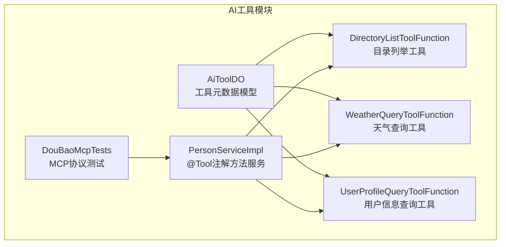
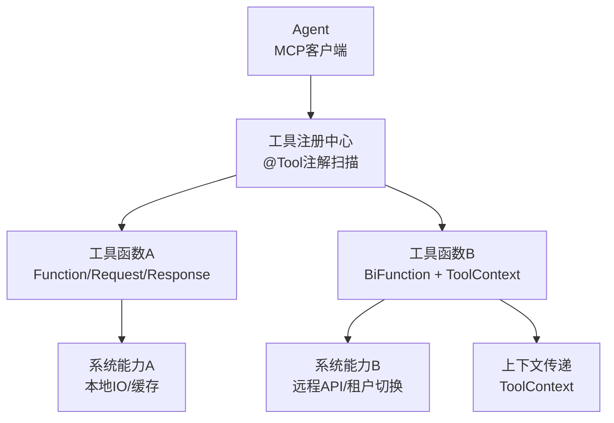
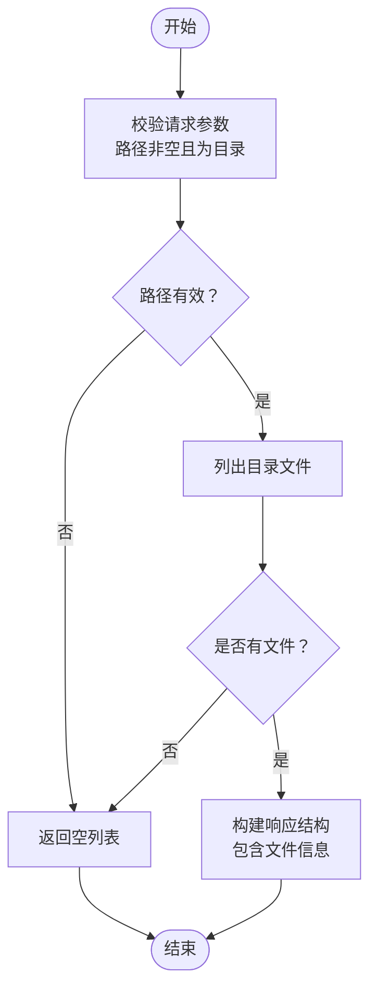
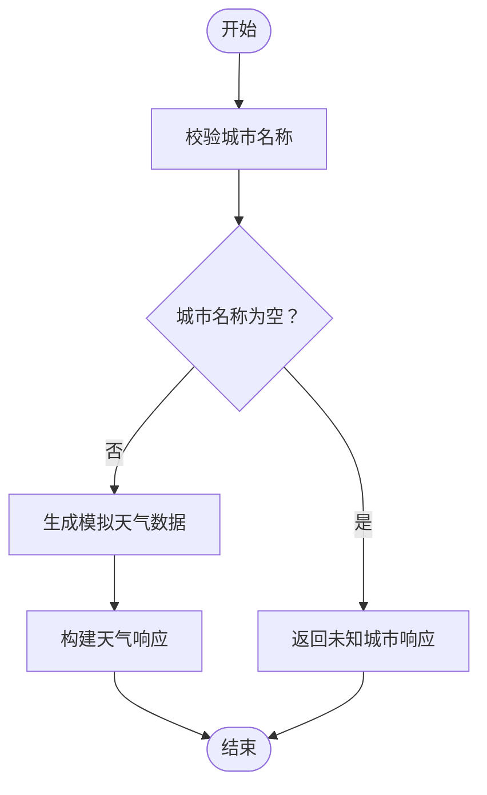
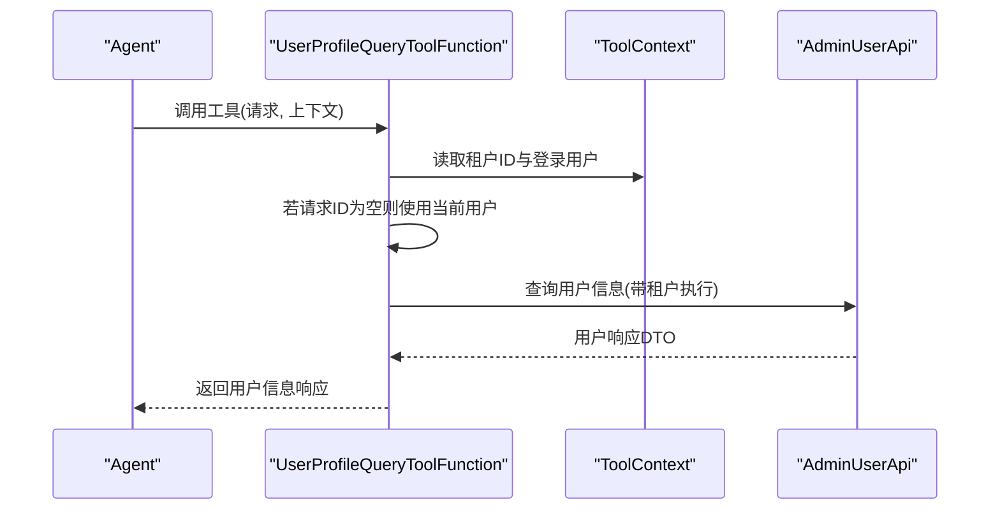
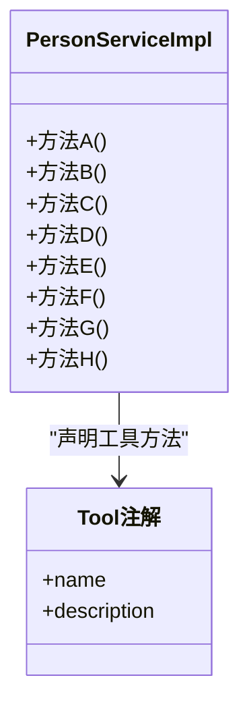
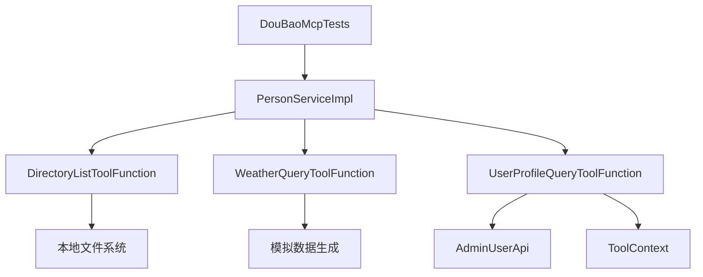

# AI工具插件

<cite>
**本文引用的文件**
- [AiToolDO.java](file://backend/qiji-module-ai/src/main/java/com/qiji/cps/module/ai/dal/dataobject/model/AiToolDO.java)
- [DirectoryListToolFunction.java](file://backend/qiji-module-ai/src/main/java/com/qiji/cps/module/ai/tool/function/DirectoryListToolFunction.java)
- [WeatherQueryToolFunction.java](file://backend/qiji-module-ai/src/main/java/com/qiji/cps/module/ai/tool/function/WeatherQueryToolFunction.java)
- [UserProfileQueryToolFunction.java](file://backend/qiji-module-ai/src/main/java/com/qiji/cps/module/ai/tool/function/UserProfileQueryToolFunction.java)
- [PersonServiceImpl.java](file://backend/qiji-module-ai/src/main/java/com/qiji/cps/module/ai/tool/method/PersonServiceImpl.java)
- [DouBaoMcpTests.java](file://backend/qiji-module-ai/src/test/java/com/qiji/cps/module/ai/framework/ai/core/model/mcp/DouBaoMcpTests.java)
- [AGENTS.md](file://AGENTS.md)
- [README.md](file://README.md)
</cite>

## 目录
1. [简介](#简介)
2. [项目结构](#项目结构)
3. [核心组件](#核心组件)
4. [架构总览](#架构总览)
5. [详细组件分析](#详细组件分析)
6. [依赖分析](#依赖分析)
7. [性能考虑](#性能考虑)
8. [故障排查指南](#故障排查指南)
9. [结论](#结论)
10. [附录](#附录)

## 简介
本技术指导文档面向AI工具插件开发，围绕ToolFunction接口的实现方法与MCP协议下的AI工具开发进行系统化说明。内容涵盖工具函数的基本结构、参数定义、返回值处理、异常处理、工具注册机制、Agent集成方式、会话管理与上下文传递等关键技术细节，并结合仓库中的具体实现示例（目录列举、天气查询、用户信息查询等），给出可操作的开发范式与最佳实践。

## 项目结构
AI工具相关代码主要位于后端模块的AI子模块中，采用按功能域划分的层次化组织方式：
- 数据对象层：定义AI工具的持久化模型
- 工具函数层：实现具体的ToolFunction，支持Function与BiFunction两种签名
- 方法服务层：通过注解驱动的方式声明工具方法，便于统一注册与调用
- 测试层：覆盖MCP协议场景下的工具注册与调用流程

**图表来源**
- [AiToolDO.java:11-48](file://backend/qiji-module-ai/src/main/java/com/qiji/cps/module/ai/dal/dataobject/model/AiToolDO.java#L11-L48)
- [DirectoryListToolFunction.java:24-99](file://backend/qiji-module-ai/src/main/java/com/qiji/cps/module/ai/tool/function/DirectoryListToolFunction.java#L24-L99)
- [WeatherQueryToolFunction.java:19-118](file://backend/qiji-module-ai/src/main/java/com/qiji/cps/module/ai/tool/function/WeatherQueryToolFunction.java#L19-L118)
- [UserProfileQueryToolFunction.java:21-93](file://backend/qiji-module-ai/src/main/java/com/qiji/cps/module/ai/tool/function/UserProfileQueryToolFunction.java#L21-L93)
- [PersonServiceImpl.java:195-319](file://backend/qiji-module-ai/src/main/java/com/qiji/cps/module/ai/tool/method/PersonServiceImpl.java#L195-L319)
- [DouBaoMcpTests.java:84-114](file://backend/qiji-module-ai/src/test/java/com/qiji/cps/module/ai/framework/ai/core/model/mcp/DouBaoMcpTests.java#L84-L114)

**章节来源**
- [AiToolDO.java:11-48](file://backend/qiji-module-ai/src/main/java/com/qiji/cps/module/ai/dal/dataobject/model/AiToolDO.java#L11-L48)
- [DirectoryListToolFunction.java:24-99](file://backend/qiji-module-ai/src/main/java/com/qiji/cps/module/ai/tool/function/DirectoryListToolFunction.java#L24-L99)
- [WeatherQueryToolFunction.java:19-118](file://backend/qiji-module-ai/src/main/java/com/qiji/cps/module/ai/tool/function/WeatherQueryToolFunction.java#L19-L118)
- [UserProfileQueryToolFunction.java:21-93](file://backend/qiji-module-ai/src/main/java/com/qiji/cps/module/ai/tool/function/UserProfileQueryToolFunction.java#L21-L93)
- [PersonServiceImpl.java:195-319](file://backend/qiji-module-ai/src/main/java/com/qiji/cps/module/ai/tool/method/PersonServiceImpl.java#L195-L319)
- [DouBaoMcpTests.java:84-114](file://backend/qiji-module-ai/src/test/java/com/qiji/cps/module/ai/framework/ai/core/model/mcp/DouBaoMcpTests.java#L84-L114)

## 核心组件
本节聚焦ToolFunction接口的实现要点与MCP协议下的工具开发模式，结合仓库中的具体实现进行说明。

- 工具函数基本结构
  - 使用Spring组件注解标识，Bean名称即工具名，用于在Agent侧注册与调用
  - 支持Function与BiFunction两种签名：前者仅接收请求参数；后者额外接收ToolContext上下文
  - 请求与响应类通常使用JSON注解进行参数描述与必填约束

- 参数定义与校验
  - 使用JSON注解声明参数的必填性与描述，便于Agent解析与提示
  - 在工具内部进行输入校验，确保参数完整性与有效性

- 返回值处理
  - 返回值应遵循统一的数据结构，便于Agent消费
  - 对于BiFunction，可从ToolContext中提取上下文信息，影响返回结果

- 异常处理
  - 对无效输入或异常情况返回空结果或默认值，避免抛出异常导致Agent中断
  - 可在工具内部捕获异常并记录日志，保证流程稳定性

- 工具注册机制
  - 通过方法服务上的注解声明工具方法，实现自动注册与统一管理
  - MCP协议测试用例展示了如何在特定模型环境下注册与调用工具

**章节来源**
- [DirectoryListToolFunction.java:29-43](file://backend/qiji-module-ai/src/main/java/com/qiji/cps/module/ai/tool/function/DirectoryListToolFunction.java#L29-L43)
- [WeatherQueryToolFunction.java:24-41](file://backend/qiji-module-ai/src/main/java/com/qiji/cps/module/ai/tool/function/WeatherQueryToolFunction.java#L24-L41)
- [UserProfileQueryToolFunction.java:28-46](file://backend/qiji-module-ai/src/main/java/com/qiji/cps/module/ai/tool/function/UserProfileQueryToolFunction.java#L28-L46)
- [PersonServiceImpl.java:195-319](file://backend/qiji-module-ai/src/main/java/com/qiji/cps/module/ai/tool/method/PersonServiceImpl.java#L195-L319)
- [DouBaoMcpTests.java:84-114](file://backend/qiji-module-ai/src/test/java/com/qiji/cps/module/ai/framework/ai/core/model/mcp/DouBaoMcpTests.java#L84-L114)

## 架构总览
下图展示了AI工具在系统中的位置与交互关系：工具函数作为底层能力，通过方法服务统一注册，供Agent在MCP协议下发现与调用；同时，工具可访问系统提供的上下文信息（如租户、登录用户）以增强业务能力。

**图表来源**
- [PersonServiceImpl.java:195-319](file://backend/qiji-module-ai/src/main/java/com/qiji/cps/module/ai/tool/method/PersonServiceImpl.java#L195-L319)
- [DirectoryListToolFunction.java:29-99](file://backend/qiji-module-ai/src/main/java/com/qiji/cps/module/ai/tool/function/DirectoryListToolFunction.java#L29-L99)
- [WeatherQueryToolFunction.java:24-118](file://backend/qiji-module-ai/src/main/java/com/qiji/cps/module/ai/tool/function/WeatherQueryToolFunction.java#L24-L118)
- [UserProfileQueryToolFunction.java:28-93](file://backend/qiji-module-ai/src/main/java/com/qiji/cps/module/ai/tool/function/UserProfileQueryToolFunction.java#L28-L93)

## 详细组件分析

### 目录列举工具（DirectoryListToolFunction）
该工具实现“列出指定目录的文件列表”，演示了工具函数的基本结构与参数校验逻辑。

- 结构要点
  - 组件注解指定Bean名称，作为工具名
  - 请求类包含路径参数，使用JSON注解声明必填与描述
  - 响应类包含文件列表，每项包含目录/文件标识、名称、大小、最后修改时间等字段

- 处理流程
  - 校验路径是否存在且为目录
  - 列出目录内容，转换为统一的响应结构
  - 对空结果返回空列表，避免异常传播

**图表来源**
- [DirectoryListToolFunction.java:82-99](file://backend/qiji-module-ai/src/main/java/com/qiji/cps/module/ai/tool/function/DirectoryListToolFunction.java#L82-L99)

**章节来源**
- [DirectoryListToolFunction.java:29-99](file://backend/qiji-module-ai/src/main/java/com/qiji/cps/module/ai/tool/function/DirectoryListToolFunction.java#L29-L99)

### 天气查询工具（WeatherQueryToolFunction）
该工具实现“查询指定城市的天气信息”，演示了模拟数据生成与响应封装。

- 结构要点
  - 组件注解指定Bean名称
  - 请求类包含城市名称参数
  - 响应类包含城市名与天气信息（温度、天气状况、湿度、风速、查询时间）

- 处理流程
  - 校验城市名称是否为空
  - 生成模拟天气数据（温度、湿度、风速、天气状况、查询时间）
  - 返回包含城市与天气信息的响应

**图表来源**
- [WeatherQueryToolFunction.java:92-118](file://backend/qiji-module-ai/src/main/java/com/qiji/cps/module/ai/tool/function/WeatherQueryToolFunction.java#L92-L118)

**章节来源**
- [WeatherQueryToolFunction.java:24-118](file://backend/qiji-module-ai/src/main/java/com/qiji/cps/module/ai/tool/function/WeatherQueryToolFunction.java#L24-L118)

### 用户信息查询工具（UserProfileQueryToolFunction）
该工具实现“用户信息查询”，并展示如何使用ToolContext上下文（租户ID、登录用户）增强工具能力。

- 结构要点
  - 组件注解指定Bean名称
  - 请求类包含用户编号参数（可为空，表示查询当前用户）
  - 响应类包含用户ID、昵称、手机号、头像等字段
  - 实现BiFunction签名，接收ToolContext上下文

- 处理流程
  - 从ToolContext中提取租户ID与登录用户信息
  - 若用户编号为空，则使用当前登录用户
  - 在租户范围内查询用户信息并转换为响应结构

**图表来源**
- [UserProfileQueryToolFunction.java:73-93](file://backend/qiji-module-ai/src/main/java/com/qiji/cps/module/ai/tool/function/UserProfileQueryToolFunction.java#L73-L93)

**章节来源**
- [UserProfileQueryToolFunction.java:28-93](file://backend/qiji-module-ai/src/main/java/com/qiji/cps/module/ai/tool/function/UserProfileQueryToolFunction.java#L28-L93)

### 方法服务中的工具注册（PersonServiceImpl）
该服务通过注解声明多个工具方法，展示统一的工具注册与调用方式。

- 注解使用
  - 使用注解声明工具方法，包含工具名称与描述
  - 方法签名可为Function或BiFunction，对应不同工具类型

- 注册机制
  - 通过注解扫描实现工具方法的自动注册
  - 在MCP协议测试中验证工具的可用性

**图表来源**
- [PersonServiceImpl.java:195-319](file://backend/qiji-module-ai/src/main/java/com/qiji/cps/module/ai/tool/method/PersonServiceImpl.java#L195-L319)

**章节来源**
- [PersonServiceImpl.java:195-319](file://backend/qiji-module-ai/src/main/java/com/qiji/cps/module/ai/tool/method/PersonServiceImpl.java#L195-L319)

### MCP协议下的工具注册与调用（DouBaoMcpTests）
该测试用例展示了在特定模型环境下如何注册与调用工具，体现MCP协议的集成方式。

- 测试要点
  - 使用注解声明多个工具方法，验证其在MCP协议下的可用性
  - 展示工具名称与描述的配置方式

**章节来源**
- [DouBaoMcpTests.java:84-114](file://backend/qiji-module-ai/src/test/java/com/qiji/cps/module/ai/framework/ai/core/model/mcp/DouBaoMcpTests.java#L84-L114)

## 依赖分析
AI工具模块的依赖关系相对简单，主要体现为工具函数与系统能力之间的耦合：

- 工具函数与系统能力
  - 目录列举工具依赖本地文件系统能力
  - 天气查询工具依赖模拟数据生成
  - 用户信息查询工具依赖远程用户服务与上下文传递

- 注册与调用
  - 方法服务通过注解统一声明工具方法
  - MCP测试用例验证工具在协议环境下的可用性

**图表来源**
- [DirectoryListToolFunction.java:82-99](file://backend/qiji-module-ai/src/main/java/com/qiji/cps/module/ai/tool/function/DirectoryListToolFunction.java#L82-L99)
- [WeatherQueryToolFunction.java:109-118](file://backend/qiji-module-ai/src/main/java/com/qiji/cps/module/ai/tool/function/WeatherQueryToolFunction.java#L109-L118)
- [UserProfileQueryToolFunction.java:73-93](file://backend/qiji-module-ai/src/main/java/com/qiji/cps/module/ai/tool/function/UserProfileQueryToolFunction.java#L73-L93)
- [PersonServiceImpl.java:195-319](file://backend/qiji-module-ai/src/main/java/com/qiji/cps/module/ai/tool/method/PersonServiceImpl.java#L195-L319)
- [DouBaoMcpTests.java:84-114](file://backend/qiji-module-ai/src/test/java/com/qiji/cps/module/ai/framework/ai/core/model/mcp/DouBaoMcpTests.java#L84-L114)

**章节来源**
- [AiToolDO.java:11-48](file://backend/qiji-module-ai/src/main/java/com/qiji/cps/module/ai/dal/dataobject/model/AiToolDO.java#L11-L48)
- [DirectoryListToolFunction.java:29-99](file://backend/qiji-module-ai/src/main/java/com/qiji/cps/module/ai/tool/function/DirectoryListToolFunction.java#L29-L99)
- [WeatherQueryToolFunction.java:24-118](file://backend/qiji-module-ai/src/main/java/com/qiji/cps/module/ai/tool/function/WeatherQueryToolFunction.java#L24-L118)
- [UserProfileQueryToolFunction.java:28-93](file://backend/qiji-module-ai/src/main/java/com/qiji/cps/module/ai/tool/function/UserProfileQueryToolFunction.java#L28-L93)
- [PersonServiceImpl.java:195-319](file://backend/qiji-module-ai/src/main/java/com/qiji/cps/module/ai/tool/method/PersonServiceImpl.java#L195-L319)
- [DouBaoMcpTests.java:84-114](file://backend/qiji-module-ai/src/test/java/com/qiji/cps/module/ai/framework/ai/core/model/mcp/DouBaoMcpTests.java#L84-L114)

## 性能考虑
- 输入校验前置：在工具入口快速校验参数，避免无效请求进入复杂处理逻辑
- 资源访问优化：对于文件系统访问，尽量减少IO次数，批量处理文件信息
- 远程调用降级：对于依赖外部系统的工具，建议增加超时与熔断机制，避免阻塞Agent
- 上下文复用：ToolContext中的信息可复用，减少重复查询与计算
- 缓存策略：对热点数据（如用户信息）可引入缓存，降低远程调用频率

## 故障排查指南
- 工具无法被Agent发现
  - 检查方法服务是否正确使用注解声明工具方法
  - 确认MCP协议测试用例是否通过

- 工具调用失败
  - 查看工具内部的参数校验逻辑，确认输入是否符合要求
  - 检查远程服务调用状态与超时设置

- 上下文信息缺失
  - 确认ToolContext中是否正确注入租户ID与登录用户信息
  - 检查租户切换与用户查询的执行链路

**章节来源**
- [PersonServiceImpl.java:195-319](file://backend/qiji-module-ai/src/main/java/com/qiji/cps/module/ai/tool/method/PersonServiceImpl.java#L195-L319)
- [UserProfileQueryToolFunction.java:73-93](file://backend/qiji-module-ai/src/main/java/com/qiji/cps/module/ai/tool/function/UserProfileQueryToolFunction.java#L73-L93)
- [DouBaoMcpTests.java:84-114](file://backend/qiji-module-ai/src/test/java/com/qiji/cps/module/ai/framework/ai/core/model/mcp/DouBaoMcpTests.java#L84-L114)

## 结论
本项目提供了清晰的AI工具插件开发范式：通过ToolFunction接口实现具体能力，使用注解统一注册，借助MCP协议完成Agent集成。工具函数既可独立运行，也可通过ToolContext访问系统上下文，满足复杂业务场景的需求。建议在实际开发中遵循参数校验、异常处理、性能优化与故障排查的最佳实践，确保工具的稳定性与可维护性。

## 附录
- 工具函数配置管理
  - 通过Bean名称与注解描述实现工具元数据管理
  - 工具状态可通过元数据模型进行统一管理

- 版本控制与热更新
  - 建议对工具函数进行版本标记，配合配置中心实现灰度发布
  - 对于需要热更新的工具，优先采用无状态设计，减少重启影响

- 测试验证方法
  - 单元测试：针对工具函数的核心逻辑进行断言
  - 集成测试：在MCP协议环境下验证工具注册与调用
  - 性能测试：评估工具在高并发下的响应时间与资源占用

**章节来源**
- [AiToolDO.java:11-48](file://backend/qiji-module-ai/src/main/java/com/qiji/cps/module/ai/dal/dataobject/model/AiToolDO.java#L11-L48)
- [AGENTS.md](file://AGENTS.md)
- [README.md](file://README.md)