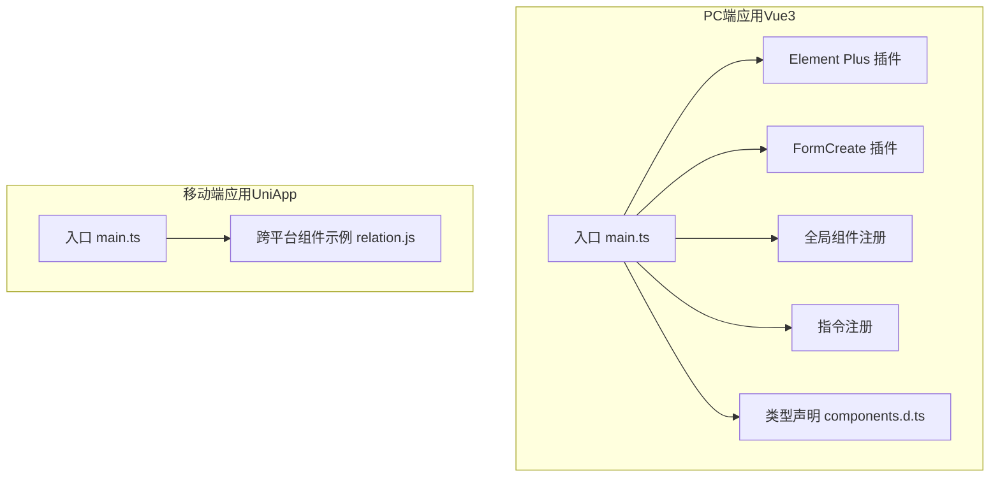
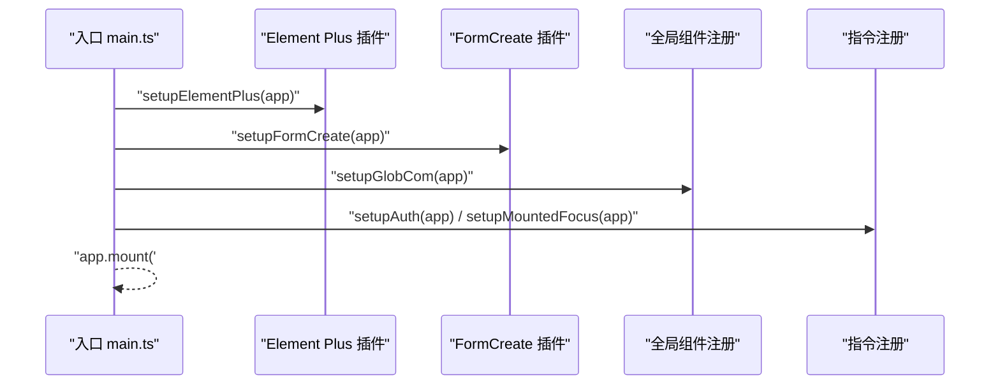
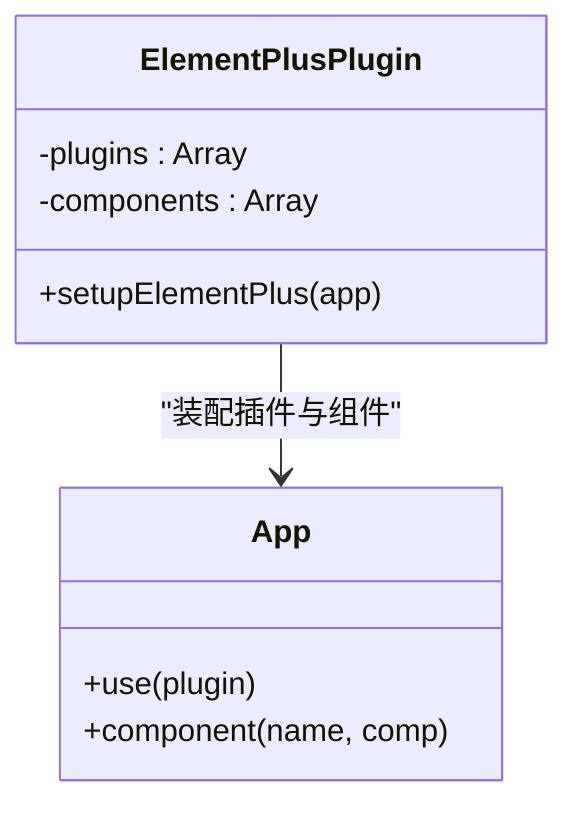
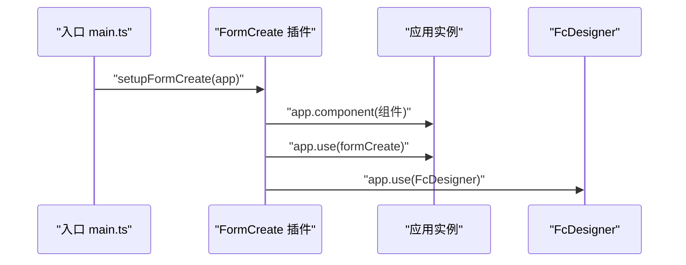
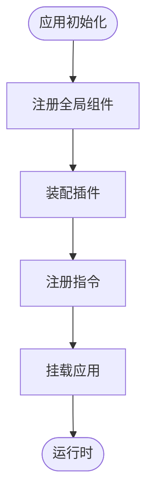
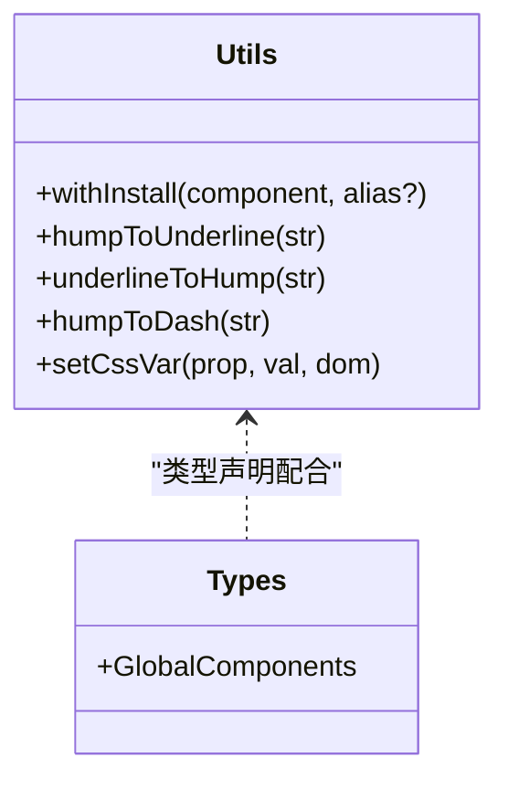
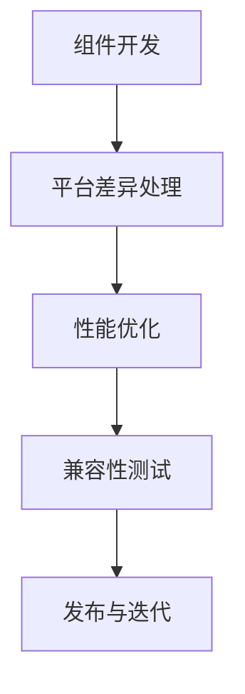
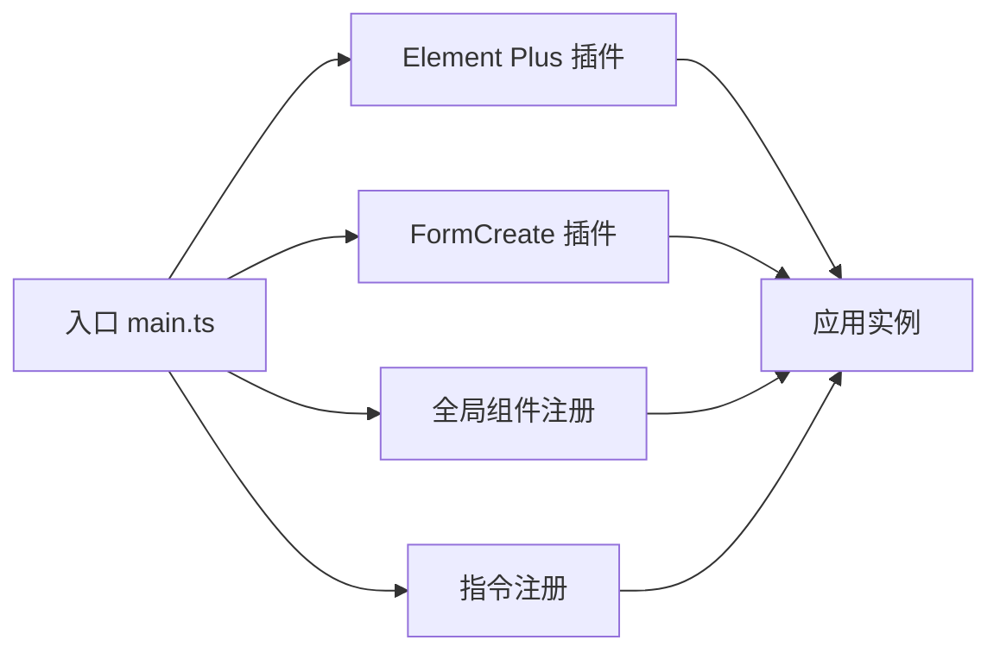

# UI组件插件

<cite>
**本文引用的文件**
- [frontend/admin-vue3/src/main.ts](file://frontend/admin-vue3/src/main.ts)
- [frontend/admin-vue3/src/plugins/elementPlus/index.ts](file://frontend/admin-vue3/src/plugins/elementPlus/index.ts)
- [frontend/admin-vue3/src/plugins/formCreate/index.ts](file://frontend/admin-vue3/src/plugins/formCreate/index.ts)
- [frontend/admin-vue3/src/components/index.ts](file://frontend/admin-vue3/src/components/index.ts)
- [frontend/admin-vue3/src/utils/index.ts](file://frontend/admin-vue3/src/utils/index.ts)
- [frontend/admin-vue3/src/directives/index.ts](file://frontend/admin-vue3/src/directives/index.ts)
- [frontend/admin-vue3/types/components.d.ts](file://frontend/admin-vue3/types/components.d.ts)
- [frontend/admin-uniapp/src/main.ts](file://frontend/admin-uniapp/src/main.ts)
- [frontend/mall-uniapp/uni_modules/lime-painter/components/common/relation.js](file://frontend/mall-uniapp/uni_modules/lime-painter/components/common/relation.js)
</cite>

## 目录
1. [引言](#引言)
2. [项目结构](#项目结构)
3. [核心组件与插件](#核心组件与插件)
4. [架构总览](#架构总览)
5. [详细组件分析](#详细组件分析)
6. [依赖关系分析](#依赖关系分析)
7. [性能考量](#性能考量)
8. [故障排查指南](#故障排查指南)
9. [结论](#结论)
10. [附录](#附录)

## 引言
本指南面向前端开发者，系统化讲解如何在Vue生态中开发高质量的UI组件插件，涵盖组件注册机制、Props定义、事件处理、插槽使用等基础能力；深入Element Plus组件的二次封装实践，包括组件继承、样式定制、主题适配与响应式设计；同时总结UniApp跨平台组件开发中的平台差异处理、性能优化与兼容性测试要点。最后提供一套可落地的配置管理方案（全局/局部/动态），以及文档编写、示例与测试用例的质量保障流程。

## 项目结构
本仓库包含两套前端工程：admin-vue3（PC端Vue3应用）与admin-uniapp（基于Vue3的UniApp移动端应用）。两者均采用“入口引导 + 插件化装配”的初始化模式，通过统一的入口函数或主程序完成插件注册、全局组件挂载、路由与状态管理初始化等步骤。

- PC端入口与插件装配
  - 应用入口：[frontend/admin-vue3/src/main.ts](file://frontend/admin-vue3/src/main.ts)
  - Element Plus插件：[frontend/admin-vue3/src/plugins/elementPlus/index.ts](file://frontend/admin-vue3/src/plugins/elementPlus/index.ts)
  - FormCreate插件：[frontend/admin-vue3/src/plugins/formCreate/index.ts](file://frontend/admin-vue3/src/plugins/formCreate/index.ts)
  - 全局组件注册：[frontend/admin-vue3/src/components/index.ts](file://frontend/admin-vue3/src/components/index.ts)
  - 指令注册：[frontend/admin-vue3/src/directives/index.ts](file://frontend/admin-vue3/src/directives/index.ts)
  - 类型声明：[frontend/admin-vue3/types/components.d.ts](file://frontend/admin-vue3/types/components.d.ts)

- 移动端入口与插件装配
  - 应用入口：[frontend/admin-uniapp/src/main.ts](file://frontend/admin-uniapp/src/main.ts)

- UniApp跨平台组件示例
  - 组件关系与注入示例：[frontend/mall-uniapp/uni_modules/lime-painter/components/common/relation.js](file://frontend/mall-uniapp/uni_modules/lime-painter/components/common/relation.js)

图表来源
- [frontend/admin-vue3/src/main.ts:1-86](file://frontend/admin-vue3/src/main.ts#L1-L86)
- [frontend/admin-vue3/src/plugins/elementPlus/index.ts:1-18](file://frontend/admin-vue3/src/plugins/elementPlus/index.ts#L1-L18)
- [frontend/admin-vue3/src/plugins/formCreate/index.ts:1-135](file://frontend/admin-vue3/src/plugins/formCreate/index.ts#L1-L135)
- [frontend/admin-vue3/src/components/index.ts:1-6](file://frontend/admin-vue3/src/components/index.ts#L1-L6)
- [frontend/admin-vue3/src/directives/index.ts:1-25](file://frontend/admin-vue3/src/directives/index.ts#L1-L25)
- [frontend/admin-vue3/types/components.d.ts:1-8](file://frontend/admin-vue3/types/components.d.ts#L1-L8)
- [frontend/admin-uniapp/src/main.ts:1-20](file://frontend/admin-uniapp/src/main.ts#L1-L20)
- [frontend/mall-uniapp/uni_modules/lime-painter/components/common/relation.js:1-60](file://frontend/mall-uniapp/uni_modules/lime-painter/components/common/relation.js#L1-L60)

章节来源
- [frontend/admin-vue3/src/main.ts:1-86](file://frontend/admin-vue3/src/main.ts#L1-L86)
- [frontend/admin-uniapp/src/main.ts:1-20](file://frontend/admin-uniapp/src/main.ts#L1-L20)

## 核心组件与插件
本节聚焦于组件插件开发的关键要素：组件注册、Props定义、事件处理、插槽使用、插件装配与类型声明。

- 组件注册机制
  - 全局组件注册：通过统一入口调用 app.component 注册组件，便于在任意模板中直接使用。
  - 插件安装：提供 withInstall 工具函数，支持组件install方法与全局属性别名注册，满足插件化分发需求。
  - 类型声明：在组件类型声明文件中导出全局组件类型，确保TS环境下具备完整的类型推断。

- Props定义与事件处理
  - 使用 defineProps/defineEmits 或组合式API进行Props与事件声明，保持类型安全与文档友好。
  - 对外暴露的事件建议遵循语义化命名，避免与原生事件冲突，并提供必要的参数说明。

- 插槽使用
  - 合理划分默认插槽、具名插槽与作用域插槽，提升组件复用性与可扩展性。
  - 插槽内容尽量保持最小耦合，必要时通过Props传递渲染上下文。

- 插件装配与初始化
  - PC端通过入口函数集中装配插件：Element Plus、FormCreate、全局组件、指令等。
  - 移动端通过入口函数完成应用初始化与插件挂载，确保运行时环境一致。

章节来源
- [frontend/admin-vue3/src/components/index.ts:1-6](file://frontend/admin-vue3/src/components/index.ts#L1-L6)
- [frontend/admin-vue3/src/utils/index.ts:9-18](file://frontend/admin-vue3/src/utils/index.ts#L9-L18)
- [frontend/admin-vue3/types/components.d.ts:1-8](file://frontend/admin-vue3/types/components.d.ts#L1-L8)
- [frontend/admin-vue3/src/plugins/elementPlus/index.ts:1-18](file://frontend/admin-vue3/src/plugins/elementPlus/index.ts#L1-L18)
- [frontend/admin-vue3/src/plugins/formCreate/index.ts:1-135](file://frontend/admin-vue3/src/plugins/formCreate/index.ts#L1-L135)
- [frontend/admin-vue3/src/directives/index.ts:1-25](file://frontend/admin-vue3/src/directives/index.ts#L1-L25)

## 架构总览
下图展示了PC端应用的初始化流程与插件装配顺序，体现从入口到各功能模块的装配关系。

图表来源
- [frontend/admin-vue3/src/main.ts:51-81](file://frontend/admin-vue3/src/main.ts#L51-L81)
- [frontend/admin-vue3/src/plugins/elementPlus/index.ts:9-17](file://frontend/admin-vue3/src/plugins/elementPlus/index.ts#L9-L17)
- [frontend/admin-vue3/src/plugins/formCreate/index.ts:127-134](file://frontend/admin-vue3/src/plugins/formCreate/index.ts#L127-L134)
- [frontend/admin-vue3/src/components/index.ts:4-6](file://frontend/admin-vue3/src/components/index.ts#L4-L6)
- [frontend/admin-vue3/src/directives/index.ts:10-24](file://frontend/admin-vue3/src/directives/index.ts#L10-L24)

## 详细组件分析

### Element Plus插件二次封装
Element Plus作为UI基础库，项目中通过插件方式按需引入与全局注册，确保组件样式一致性与功能完备性。

- 关键点
  - 按需引入：仅引入必要的组件与插件，减少打包体积。
  - 全局注册：对常用组件进行全局注册，简化模板使用。
  - 样式与主题：结合UnoCSS与主题变量，实现样式定制与主题适配。
  - 响应式设计：在组件Props中暴露尺寸、密度等响应式参数，配合媒体查询实现自适应。

图表来源
- [frontend/admin-vue3/src/plugins/elementPlus/index.ts:1-18](file://frontend/admin-vue3/src/plugins/elementPlus/index.ts#L1-L18)

章节来源
- [frontend/admin-vue3/src/plugins/elementPlus/index.ts:1-18](file://frontend/admin-vue3/src/plugins/elementPlus/index.ts#L1-L18)

### FormCreate插件二次封装
FormCreate用于快速构建表单，项目中将其与Element Plus深度集成，并注册自定义组件与设计器。

- 关键点
  - 组件注册：将Element Plus组件与自定义组件统一注册到应用实例。
  - 自定义组件：封装上传、编辑器、选择器等业务组件，统一命名与参数规范。
  - 设计器集成：启用设计器以可视化方式生成表单配置。

图表来源
- [frontend/admin-vue3/src/plugins/formCreate/index.ts:127-134](file://frontend/admin-vue3/src/plugins/formCreate/index.ts#L127-L134)
- [frontend/admin-vue3/src/main.ts:60-62](file://frontend/admin-vue3/src/main.ts#L60-L62)

章节来源
- [frontend/admin-vue3/src/plugins/formCreate/index.ts:1-135](file://frontend/admin-vue3/src/plugins/formCreate/index.ts#L1-L135)
- [frontend/admin-vue3/src/main.ts:51-81](file://frontend/admin-vue3/src/main.ts#L51-L81)

### 全局组件与指令
- 全局组件：通过统一入口注册Icon等通用组件，便于在模板中直接使用。
- 指令：提供权限指令与生命周期指令，增强组件行为控制与可维护性。

图表来源
- [frontend/admin-vue3/src/components/index.ts:4-6](file://frontend/admin-vue3/src/components/index.ts#L4-L6)
- [frontend/admin-vue3/src/directives/index.ts:10-24](file://frontend/admin-vue3/src/directives/index.ts#L10-L24)
- [frontend/admin-vue3/src/main.ts:51-81](file://frontend/admin-vue3/src/main.ts#L51-L81)

章节来源
- [frontend/admin-vue3/src/components/index.ts:1-6](file://frontend/admin-vue3/src/components/index.ts#L1-L6)
- [frontend/admin-vue3/src/directives/index.ts:1-25](file://frontend/admin-vue3/src/directives/index.ts#L1-L25)
- [frontend/admin-vue3/src/main.ts:51-81](file://frontend/admin-vue3/src/main.ts#L51-L81)

### 通用工具与类型声明
- withInstall：提供组件install方法与全局属性别名注册，便于插件化发布与使用。
- 类型声明：在全局组件类型声明中导出组件类型，确保TS环境下的类型安全。

图表来源
- [frontend/admin-vue3/src/utils/index.ts:9-18](file://frontend/admin-vue3/src/utils/index.ts#L9-L18)
- [frontend/admin-vue3/types/components.d.ts:1-8](file://frontend/admin-vue3/types/components.d.ts#L1-L8)

章节来源
- [frontend/admin-vue3/src/utils/index.ts:1-55](file://frontend/admin-vue3/src/utils/index.ts#L1-L55)
- [frontend/admin-vue3/types/components.d.ts:1-8](file://frontend/admin-vue3/types/components.d.ts#L1-L8)

### UniApp跨平台组件开发
- 平台差异处理：通过条件编译与平台API适配，确保组件在不同平台的一致性。
- 性能优化：减少不必要的重渲染、按需加载资源、合理使用虚拟列表与懒加载。
- 兼容性测试：覆盖主流平台与设备，验证交互、样式与功能的稳定性。

图表来源
- [frontend/admin-uniapp/src/main.ts:1-20](file://frontend/admin-uniapp/src/main.ts#L1-L20)
- [frontend/mall-uniapp/uni_modules/lime-painter/components/common/relation.js:1-60](file://frontend/mall-uniapp/uni_modules/lime-painter/components/common/relation.js#L1-L60)

章节来源
- [frontend/admin-uniapp/src/main.ts:1-20](file://frontend/admin-uniapp/src/main.ts#L1-L20)
- [frontend/mall-uniapp/uni_modules/lime-painter/components/common/relation.js:1-60](file://frontend/mall-uniapp/uni_modules/lime-painter/components/common/relation.js#L1-L60)

## 依赖关系分析
- 组件注册与插件装配
  - 入口文件负责装配Element Plus、FormCreate、全局组件与指令。
  - 插件内部再进行组件注册与第三方库初始化。
- 类型声明
  - 全局组件类型在类型声明文件中导出，确保IDE与TS检查可用。
- 运行时依赖
  - Vue应用实例贯穿整个装配流程，所有插件与组件均通过app.use/app.component接入。

图表来源
- [frontend/admin-vue3/src/main.ts:51-81](file://frontend/admin-vue3/src/main.ts#L51-L81)
- [frontend/admin-vue3/src/plugins/elementPlus/index.ts:9-17](file://frontend/admin-vue3/src/plugins/elementPlus/index.ts#L9-L17)
- [frontend/admin-vue3/src/plugins/formCreate/index.ts:127-134](file://frontend/admin-vue3/src/plugins/formCreate/index.ts#L127-L134)
- [frontend/admin-vue3/src/components/index.ts:4-6](file://frontend/admin-vue3/src/components/index.ts#L4-L6)
- [frontend/admin-vue3/src/directives/index.ts:10-24](file://frontend/admin-vue3/src/directives/index.ts#L10-L24)

章节来源
- [frontend/admin-vue3/src/main.ts:51-81](file://frontend/admin-vue3/src/main.ts#L51-L81)

## 性能考量
- 按需引入与Tree Shaking：仅引入所需组件与插件，减少打包体积。
- 组件懒加载：对非首屏组件采用异步组件与动态导入，降低初始加载压力。
- 渲染优化：避免深层嵌套与重复计算，合理使用key与缓存策略。
- 主题与样式：通过CSS变量与主题切换，减少样式重排与重绘。
- 资源优化：图片与字体资源按需加载，使用CDN与压缩策略。

## 故障排查指南
- 插件未生效
  - 检查入口是否正确调用插件装配函数。
  - 确认插件内部是否正确注册组件与插件实例。
- 全局组件不可用
  - 核对全局组件注册逻辑与组件名称。
  - 检查类型声明是否导出对应组件类型。
- 指令不生效
  - 确认指令注册时机与生命周期钩子使用是否正确。
- UniApp平台差异
  - 使用条件编译区分平台差异，核对平台API与事件绑定方式。
  - 在目标平台模拟器或真机上进行回归测试。

章节来源
- [frontend/admin-vue3/src/main.ts:51-81](file://frontend/admin-vue3/src/main.ts#L51-L81)
- [frontend/admin-vue3/src/plugins/elementPlus/index.ts:9-17](file://frontend/admin-vue3/src/plugins/elementPlus/index.ts#L9-L17)
- [frontend/admin-vue3/src/plugins/formCreate/index.ts:127-134](file://frontend/admin-vue3/src/plugins/formCreate/index.ts#L127-L134)
- [frontend/admin-vue3/src/components/index.ts:4-6](file://frontend/admin-vue3/src/components/index.ts#L4-L6)
- [frontend/admin-vue3/src/directives/index.ts:10-24](file://frontend/admin-vue3/src/directives/index.ts#L10-L24)

## 结论
本指南基于实际项目代码，总结了Vue组件插件开发的完整路径：从入口装配到插件化注册，从基础能力到高级封装，再到跨平台实践与质量保障。遵循本文的架构与最佳实践，可在保证类型安全与可维护性的前提下，高效产出高质量的UI组件插件。

## 附录
- 配置管理方案
  - 全局配置：在入口或插件中集中初始化全局配置，确保应用启动时即生效。
  - 局部配置：通过组件Props或上下文注入方式，允许局部覆盖默认配置。
  - 动态配置：监听运行时配置变化并触发组件更新，支持主题切换与布局调整。
- 文档与示例
  - 为每个组件提供使用示例与API文档，标注Props、Events、Slots与插槽作用域。
  - 为插件提供安装与卸载说明，以及常见问题解答。
- 测试用例
  - 单元测试：覆盖组件核心逻辑与边界条件。
  - 端到端测试：在不同平台与设备上验证交互与渲染一致性。
  - 回归测试：在版本升级后执行关键路径回归，确保兼容性。