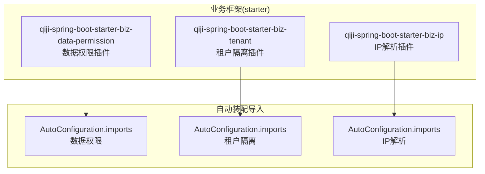
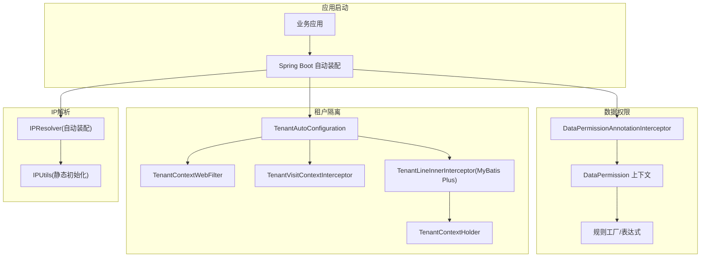
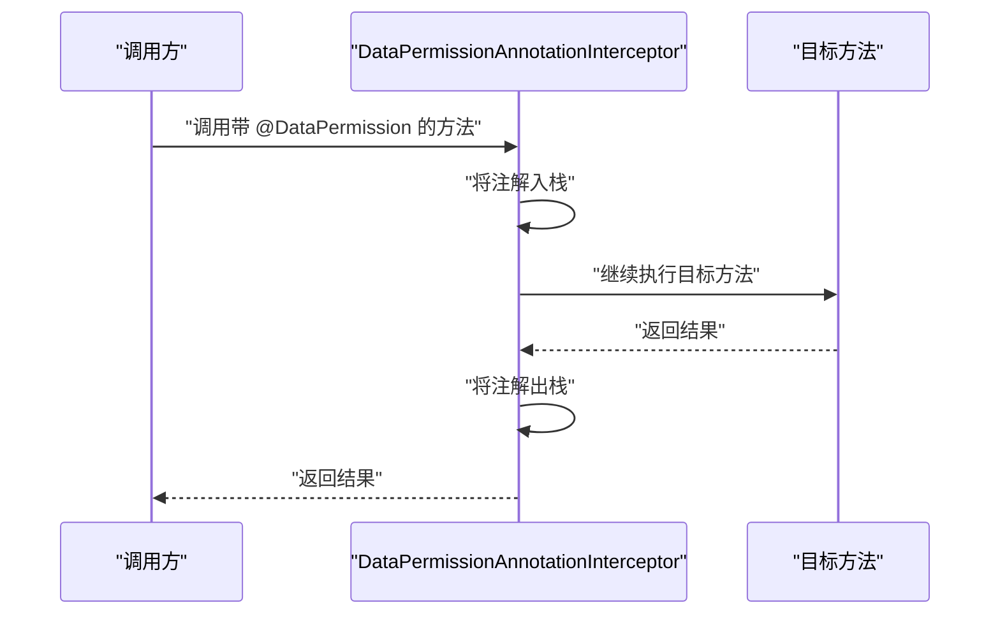
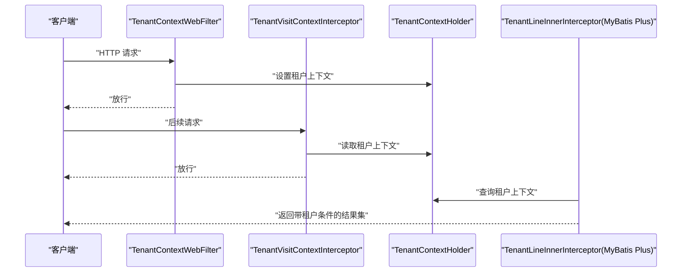
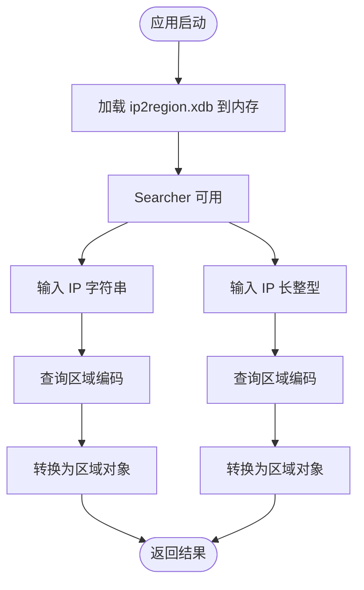
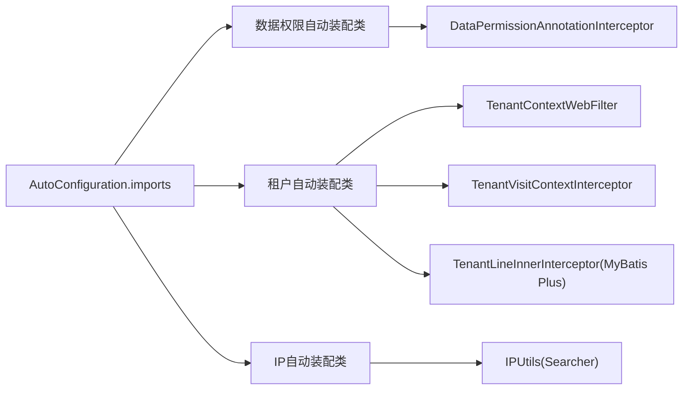

# 业务服务插件

<cite>
**本文引用的文件**
- [qiji-spring-boot-starter-biz-data-permission AutoConfiguration.imports](file://backend/qiji-framework/qiji-spring-boot-starter-biz-data-permission/src/main/resources/META-INF/spring/org.springframework.boot.autoconfigure.AutoConfiguration.imports)
- [qiji-spring-boot-starter-biz-tenant AutoConfiguration.imports](file://backend/qiji-framework/qiji-spring-boot-starter-biz-tenant/src/main/resources/META-INF/spring/org.springframework.boot.autoconfigure.AutoConfiguration.imports)
- [qiji-spring-boot-starter-biz-ip AutoConfiguration.imports](file://backend/qiji-framework/qiji-spring-boot-starter-biz-ip/src/main/resources/META-INF/spring/org.springframework.boot.autoconfigure.AutoConfiguration.imports)
- [DataPermissionAnnotationInterceptor.java](file://backend/qiji-framework/qiji-spring-boot-starter-biz-data-permission/src/main/java/com/qiji/cps/framework/datapermission/core/aop/DataPermissionAnnotationInterceptor.java)
- [DataPermissionContextHolderTest.java](file://backend/qiji-framework/qiji-spring-boot-starter-biz-data-permission/src/test/java/com/qiji/cps/framework/datapermission/core/aop/DataPermissionContextHolderTest.java)
- [DataPermissionRuleFactoryImplTest.java](file://backend/qiji-framework/qiji-spring-boot-starter-biz-data-permission/src/test/java/com/qiji/cps/framework/datapermission/core/rule/DataPermissionRuleFactoryImplTest.java)
- [QijiTenantAutoConfiguration.java](file://backend/qiji-framework/qiji-spring-boot-starter-biz-tenant/src/main/java/com/qiji/cps/framework/tenant/config/QijiTenantAutoConfiguration.java)
- [TenantContextHolder.java](file://backend/qiji-framework/qiji-spring-boot-starter-biz-tenant/src/main/java/com/qiji/cps/framework/tenant/core/context/TenantContextHolder.java)
- [TenantFrameworkService.java](file://backend/qiji-framework/qiji-spring-boot-starter-biz-tenant/src/main/java/com/qiji/cps/framework/tenant/core/service/TenantFrameworkService.java)
- [TenantInfoHandler.java](file://backend/qiji-module-system/src/main/java/com/qiji/cps/module/system/service/tenant/handler/TenantInfoHandler.java)
- [IPResolver.java](file://backend/qiji-framework/qiji-spring-boot-starter-biz-ip/src/main/java/com/qiji/cps/framework/ip/core/IPResolver.java)
- [IPUtils.java](file://backend/qiji-framework/qiji-spring-boot-starter-biz-ip/src/main/java/com/qiji/cps/framework/ip/core/utils/IPUtils.java)
- [package-info.java (IP)](file://backend/qiji-framework/qiji-spring-boot-starter-biz-ip/src/main/java/com/qiji/cps/framework/ip/package-info.java)
- [qiji-spring-boot-starter-biz-ip pom.xml](file://backend/qiji-framework/qiji-spring-boot-starter-biz-ip/pom.xml)
- [IPUtilsTest.java](file://backend/qiji-framework/qiji-spring-boot-starter-biz-ip/src/test/java/com/qiji/cps/framework/ip/core/utils/IPUtilsTest.java)
</cite>

## 目录
1. [引言](#引言)
2. [项目结构](#项目结构)
3. [核心组件](#核心组件)
4. [架构总览](#架构总览)
5. [详细组件分析](#详细组件分析)
6. [依赖关系分析](#依赖关系分析)
7. [性能考虑](#性能考虑)
8. [故障排查指南](#故障排查指南)
9. [结论](#结论)
10. [附录](#附录)

## 引言
本指南面向业务服务插件开发者，围绕 Spring Bean 扩展机制与业务中间件（数据权限、租户隔离、IP 解析）的插件化实现，系统讲解服务接口设计、实现类注册、依赖注入配置、生命周期管理、条件装配、循环依赖处理、配置管理（属性绑定、环境变量、动态更新）、以及监控与日志集成等关键主题。读者无需深入源码即可按图索骥完成高质量插件开发。

## 项目结构
本仓库采用多模块聚合工程组织，业务服务插件主要分布在 qiji-framework 的若干 starter 模块中，并在各模块内通过 Spring Boot 自动装配机制进行装配。以下图示展示与本文相关的模块与装配入口：

图表来源
- [qiji-spring-boot-starter-biz-data-permission AutoConfiguration.imports](file://backend/qiji-framework/qiji-spring-boot-starter-biz-data-permission/src/main/resources/META-INF/spring/org.springframework.boot.autoconfigure.AutoConfiguration.imports)
- [qiji-spring-boot-starter-biz-tenant AutoConfiguration.imports](file://backend/qiji-framework/qiji-spring-boot-starter-biz-tenant/src/main/resources/META-INF/spring/org.springframework.boot.autoconfigure.AutoConfiguration.imports)
- [qiji-spring-boot-starter-biz-ip AutoConfiguration.imports](file://backend/qiji-framework/qiji-spring-boot-starter-biz-ip/src/main/resources/META-INF/spring/org.springframework.boot.autoconfigure.AutoConfiguration.imports)

章节来源
- [qiji-spring-boot-starter-biz-data-permission AutoConfiguration.imports](file://backend/qiji-framework/qiji-spring-boot-starter-biz-data-permission/src/main/resources/META-INF/spring/org.springframework.boot.autoconfigure.AutoConfiguration.imports)
- [qiji-spring-boot-starter-biz-tenant AutoConfiguration.imports](file://backend/qiji-framework/qiji-spring-boot-starter-biz-tenant/src/main/resources/META-INF/spring/org.springframework.boot.autoconfigure.AutoConfiguration.imports)
- [qiji-spring-boot-starter-biz-ip AutoConfiguration.imports](file://backend/qiji-framework/qiji-spring-boot-starter-biz-ip/src/main/resources/META-INF/spring/org.springframework.boot.autoconfigure.AutoConfiguration.imports)

## 核心组件
- 数据权限插件：通过注解驱动与 AOP 拦截，在方法调用前后维护数据权限上下文，结合规则工厂生成 SQL 过滤表达式，实现透明的数据级访问控制。
- 租户隔离插件：提供线程安全的租户上下文持有者、Web 层过滤器与拦截器、MyBatis Plus 内部拦截器，确保跨租户数据隔离与访问控制。
- IP 解析插件：封装 ip2region 库，提供 IP 到区域编码与区域对象的查询能力，内置静态资源加载与初始化流程。

章节来源
- [DataPermissionAnnotationInterceptor.java](file://backend/qiji-framework/qiji-spring-boot-starter-biz-data-permission/src/main/java/com/qiji/cps/framework/datapermission/core/aop/DataPermissionAnnotationInterceptor.java)
- [QijiTenantAutoConfiguration.java](file://backend/qiji-framework/qiji-spring-boot-starter-biz-tenant/src/main/java/com/qiji/cps/framework/tenant/config/QijiTenantAutoConfiguration.java)
- [TenantContextHolder.java](file://backend/qiji-framework/qiji-spring-boot-starter-biz-tenant/src/main/java/com/qiji/cps/framework/tenant/core/context/TenantContextHolder.java)
- [IPUtils.java](file://backend/qiji-framework/qiji-spring-boot-starter-biz-ip/src/main/java/com/qiji/cps/framework/ip/core/utils/IPUtils.java)

## 架构总览
下图展示了三个业务插件的装配与运行时交互关系，体现“自动装配 → Bean 注册 → 运行时拦截/过滤”的典型 Spring Boot 插件化模式：

图表来源
- [qiji-spring-boot-starter-biz-data-permission AutoConfiguration.imports](file://backend/qiji-framework/qiji-spring-boot-starter-biz-data-permission/src/main/resources/META-INF/spring/org.springframework.boot.autoconfigure.AutoConfiguration.imports)
- [qiji-spring-boot-starter-biz-tenant AutoConfiguration.imports](file://backend/qiji-framework/qiji-spring-boot-starter-biz-tenant/src/main/resources/META-INF/spring/org.springframework.boot.autoconfigure.AutoConfiguration.imports)
- [qiji-spring-boot-starter-biz-ip AutoConfiguration.imports](file://backend/qiji-framework/qiji-spring-boot-starter-biz-ip/src/main/resources/META-INF/spring/org.springframework.boot.autoconfigure.AutoConfiguration.imports)
- [DataPermissionAnnotationInterceptor.java](file://backend/qiji-framework/qiji-spring-boot-starter-biz-data-permission/src/main/java/com/qiji/cps/framework/datapermission/core/aop/DataPermissionAnnotationInterceptor.java)
- [QijiTenantAutoConfiguration.java](file://backend/qiji-framework/qiji-spring-boot-starter-biz-tenant/src/main/java/com/qiji/cps/framework/tenant/config/QijiTenantAutoConfiguration.java)
- [TenantContextHolder.java](file://backend/qiji-framework/qiji-spring-boot-starter-biz-tenant/src/main/java/com/qiji/cps/framework/tenant/core/context/TenantContextHolder.java)
- [IPUtils.java](file://backend/qiji-framework/qiji-spring-boot-starter-biz-ip/src/main/java/com/qiji/cps/framework/ip/core/utils/IPUtils.java)

## 详细组件分析

### 数据权限插件：注解拦截与上下文管理
- 设计要点
  - 使用注解标记目标方法，拦截器在方法调用前后维护注解栈，保证嵌套调用场景下的正确性。
  - 提供上下文持有者，便于规则工厂与 SQL 构造器读取当前生效的数据权限配置。
  - 缓存注解解析结果，降低反射开销。
- 生命周期与装配
  - 通过 AutoConfiguration.imports 导入自动装配类，自动注册 AOP 拦截器 Bean。
- 关键流程（方法调用链）
  - 方法进入 → 入栈注解 → 继续执行 → 出栈注解 → 返回结果

图表来源
- [DataPermissionAnnotationInterceptor.java](file://backend/qiji-framework/qiji-spring-boot-starter-biz-data-permission/src/main/java/com/qiji/cps/framework/datapermission/core/aop/DataPermissionAnnotationInterceptor.java)

章节来源
- [DataPermissionAnnotationInterceptor.java](file://backend/qiji-framework/qiji-spring-boot-starter-biz-data-permission/src/main/java/com/qiji/cps/framework/datapermission/core/aop/DataPermissionAnnotationInterceptor.java)
- [DataPermissionContextHolderTest.java](file://backend/qiji-framework/qiji-spring-boot-starter-biz-data-permission/src/test/java/com/qiji/cps/framework/datapermission/core/aop/DataPermissionContextHolderTest.java)
- [DataPermissionRuleFactoryImplTest.java](file://backend/qiji-framework/qiji-spring-boot-starter-biz-data-permission/src/test/java/com/qiji/cps/framework/datapermission/core/rule/DataPermissionRuleFactoryImplTest.java)

### 租户隔离插件：上下文、过滤与拦截
- 设计要点
  - 提供线程安全的租户上下文持有者，支持获取/设置租户 ID、忽略标志与清理。
  - Web 层通过过滤器与拦截器注入租户上下文；持久层通过 MyBatis Plus 内部拦截器在 SQL 中注入租户条件。
  - 提供租户框架服务接口，统一对外暴露租户 ID 获取与合法性校验能力。
- 生命周期与装配
  - 自动装配类注册过滤器、拦截器与 MyBatis Plus 拦截器 Bean。
- 关键流程（Web 请求）
  - 过滤器/拦截器从请求中提取租户信息 → 设置上下文 → 放行请求 → 持久层拦截器根据上下文拼接租户条件

图表来源
- [QijiTenantAutoConfiguration.java](file://backend/qiji-framework/qiji-spring-boot-starter-biz-tenant/src/main/java/com/qiji/cps/framework/tenant/config/QijiTenantAutoConfiguration.java)
- [TenantContextHolder.java](file://backend/qiji-framework/qiji-spring-boot-starter-biz-tenant/src/main/java/com/qiji/cps/framework/tenant/core/context/TenantContextHolder.java)
- [TenantFrameworkService.java](file://backend/qiji-framework/qiji-spring-boot-starter-biz-tenant/src/main/java/com/qiji/cps/framework/tenant/core/service/TenantFrameworkService.java)

章节来源
- [QijiTenantAutoConfiguration.java](file://backend/qiji-framework/qiji-spring-boot-starter-biz-tenant/src/main/java/com/qiji/cps/framework/tenant/config/QijiTenantAutoConfiguration.java)
- [TenantContextHolder.java](file://backend/qiji-framework/qiji-spring-boot-starter-biz-tenant/src/main/java/com/qiji/cps/framework/tenant/core/context/TenantContextHolder.java)
- [TenantFrameworkService.java](file://backend/qiji-framework/qiji-spring-boot-starter-biz-tenant/src/main/java/com/qiji/cps/framework/tenant/core/service/TenantFrameworkService.java)
- [TenantInfoHandler.java](file://backend/qiji-module-system/src/main/java/com/qiji/cps/module/system/service/tenant/handler/TenantInfoHandler.java)

### IP 解析插件：静态初始化与查询工具
- 设计要点
  - 封装 ip2region 搜索器，启动阶段将 xdb 数据加载至内存，避免每次查询 IO。
  - 提供字符串与长整型两种 IP 输入形式的查询接口，返回区域编码或区域对象。
- 生命周期与装配
  - 通过 AutoConfiguration.imports 导入自动装配类，自动注册相关 Bean。
- 关键流程（IP 查询）
  - 启动加载 → 缓存 Searcher → 查询区域编码/区域对象

图表来源
- [IPUtils.java](file://backend/qiji-framework/qiji-spring-boot-starter-biz-ip/src/main/java/com/qiji/cps/framework/ip/core/utils/IPUtils.java)
- [package-info.java (IP)](file://backend/qiji-framework/qiji-spring-boot-starter-biz-ip/src/main/java/com/qiji/cps/framework/ip/package-info.java)

章节来源
- [IPUtils.java](file://backend/qiji-framework/qiji-spring-boot-starter-biz-ip/src/main/java/com/qiji/cps/framework/ip/core/utils/IPUtils.java)
- [package-info.java (IP)](file://backend/qiji-framework/qiji-spring-boot-starter-biz-ip/src/main/java/com/qiji/cps/framework/ip/package-info.java)
- [qiji-spring-boot-starter-biz-ip pom.xml](file://backend/qiji-framework/qiji-spring-boot-starter-biz-ip/pom.xml)
- [IPUtilsTest.java](file://backend/qiji-framework/qiji-spring-boot-starter-biz-ip/src/test/java/com/qiji/cps/framework/ip/core/utils/IPUtilsTest.java)

## 依赖关系分析
- 自动装配导入
  - 各插件通过 META-INF/spring/org.springframework.boot.autoconfigure.AutoConfiguration.imports 文件声明自动装配类，Spring Boot 启动时扫描并注册。
- 组件间耦合
  - 数据权限插件与规则工厂存在运行时耦合，但通过注解与上下文解耦。
  - 租户插件在 Web 与持久层分别通过过滤器/拦截器与 MyBatis Plus 拦截器实现横切，彼此独立。
  - IP 插件与业务模块松耦合，仅通过工具类提供查询能力。
- 外部依赖
  - IP 插件依赖 ip2region 库与资源文件 ip2region.xdb。
  - 租户插件依赖 MyBatis Plus 拦截器基础设施。

图表来源
- [qiji-spring-boot-starter-biz-data-permission AutoConfiguration.imports](file://backend/qiji-framework/qiji-spring-boot-starter-biz-data-permission/src/main/resources/META-INF/spring/org.springframework.boot.autoconfigure.AutoConfiguration.imports)
- [qiji-spring-boot-starter-biz-tenant AutoConfiguration.imports](file://backend/qiji-framework/qiji-spring-boot-starter-biz-tenant/src/main/resources/META-INF/spring/org.springframework.boot.autoconfigure.AutoConfiguration.imports)
- [qiji-spring-boot-starter-biz-ip AutoConfiguration.imports](file://backend/qiji-framework/qiji-spring-boot-starter-biz-ip/src/main/resources/META-INF/spring/org.springframework.boot.autoconfigure.AutoConfiguration.imports)

章节来源
- [qiji-spring-boot-starter-biz-data-permission AutoConfiguration.imports](file://backend/qiji-framework/qiji-spring-boot-starter-biz-data-permission/src/main/resources/META-INF/spring/org.springframework.boot.autoconfigure.AutoConfiguration.imports)
- [qiji-spring-boot-starter-biz-tenant AutoConfiguration.imports](file://backend/qiji-framework/qiji-spring-boot-starter-biz-tenant/src/main/resources/META-INF/spring/org.springframework.boot.autoconfigure.AutoConfiguration.imports)
- [qiji-spring-boot-starter-biz-ip AutoConfiguration.imports](file://backend/qiji-framework/qiji-spring-boot-starter-biz-ip/src/main/resources/META-INF/spring/org.springframework.boot.autoconfigure.AutoConfiguration.imports)

## 性能考虑
- 静态初始化与缓存
  - IP 插件在启动阶段将搜索器加载到内存，避免重复 IO；建议对大体量资源采用懒加载或异步初始化策略。
- AOP 与拦截器开销
  - 数据权限注解拦截器与租户拦截器均在方法调用前后执行，需关注拦截链长度与异常处理成本。
- 线程安全
  - 租户上下文使用 TransmittableThreadLocal，确保多线程与线程池场景下的数据一致性。
- 规则缓存
  - 数据权限注解解析结果缓存可显著降低反射成本，建议结合方法签名与类名进行缓存键设计。

## 故障排查指南
- 数据权限注解无效
  - 检查是否正确引入自动装配导入文件；确认目标方法被代理（同包/同类调用不会触发 AOP）。
  - 核对注解栈行为与上下文持有者状态，必要时清理上下文。
- 租户条件未生效
  - 检查过滤器/拦截器顺序与注册位置；确认 MyBatis Plus 拦截器已添加至首个位置。
  - 核对租户上下文是否正确设置，忽略标志是否被错误置位。
- IP 查询异常
  - 检查 ip2region.xdb 资源是否存在且可读；确认初始化日志输出。
  - 使用单元测试验证不同输入格式（字符串/长整型）的查询结果。

章节来源
- [DataPermissionAnnotationInterceptor.java](file://backend/qiji-framework/qiji-spring-boot-starter-biz-data-permission/src/main/java/com/qiji/cps/framework/datapermission/core/aop/DataPermissionAnnotationInterceptor.java)
- [QijiTenantAutoConfiguration.java](file://backend/qiji-framework/qiji-spring-boot-starter-biz-tenant/src/main/java/com/qiji/cps/framework/tenant/config/QijiTenantAutoConfiguration.java)
- [IPUtils.java](file://backend/qiji-framework/qiji-spring-boot-starter-biz-ip/src/main/java/com/qiji/cps/framework/ip/core/utils/IPUtils.java)

## 结论
本文从 Spring Bean 扩展机制出发，系统梳理了数据权限、租户隔离与 IP 解析三大业务插件的设计与实现要点，给出了装配、生命周期、依赖注入、条件装配、循环依赖处理、配置管理与运维集成的实践路径。遵循本文指南，开发者可快速构建高内聚、低耦合、易维护的业务服务插件体系。

## 附录
- 开发最佳实践
  - 明确插件边界与职责，避免过度耦合。
  - 使用自动装配导入文件集中声明装配类，保持装配入口清晰。
  - 对关键资源进行静态初始化与缓存，提升启动与运行性能。
  - 通过线程安全容器与上下文持有者保障并发场景正确性。
  - 提供完善的单元测试与集成测试，覆盖关键路径与异常分支。
- 监控与日志
  - 在插件关键节点埋点（如初始化、拦截、查询），输出结构化日志。
  - 结合指标采集与告警策略，及时发现性能瓶颈与异常波动。