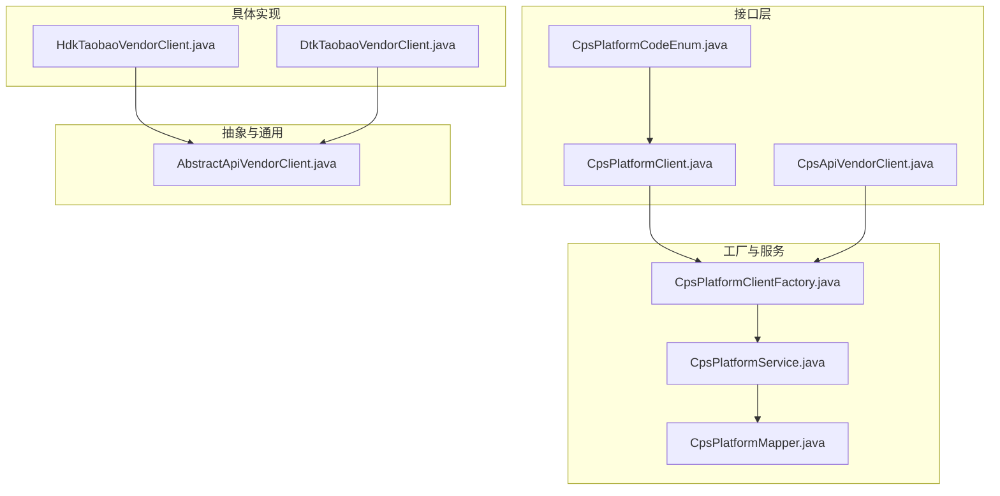
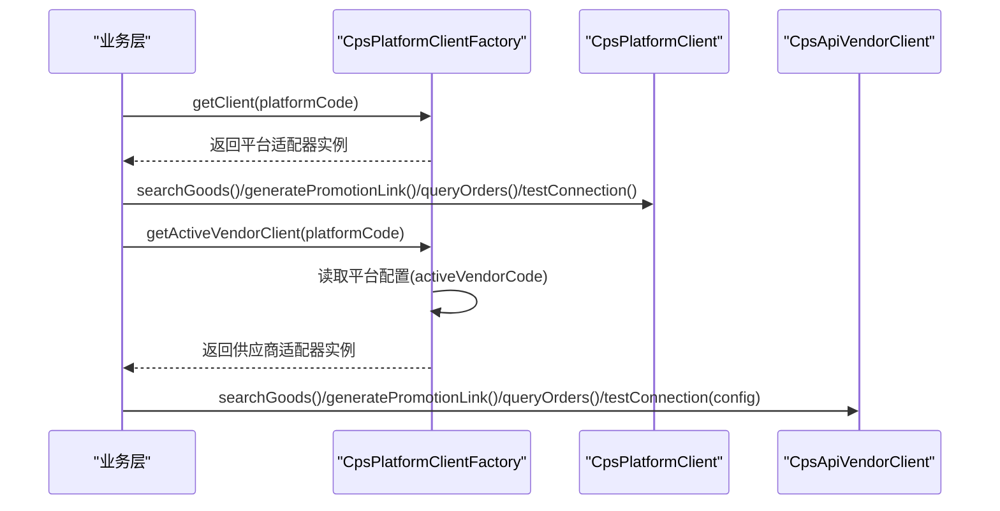
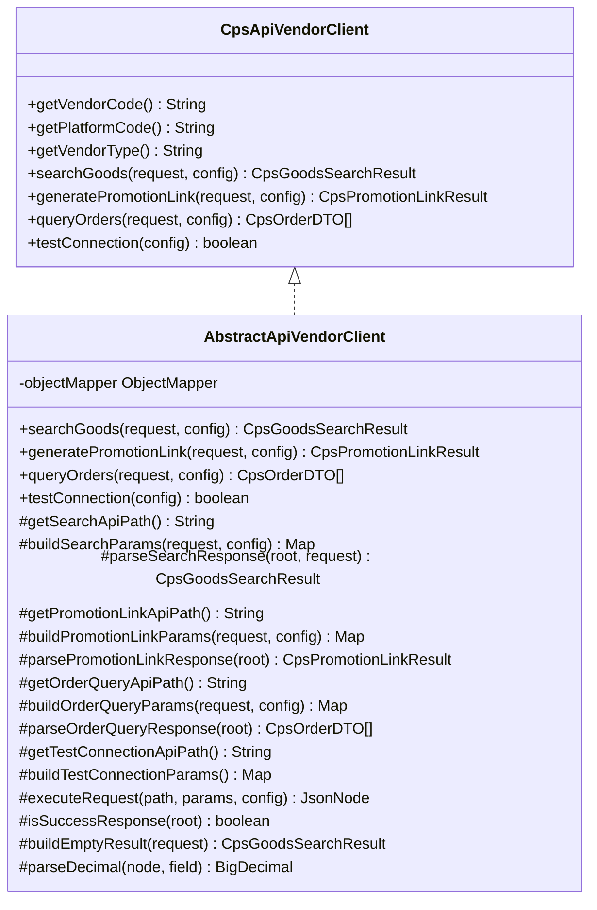
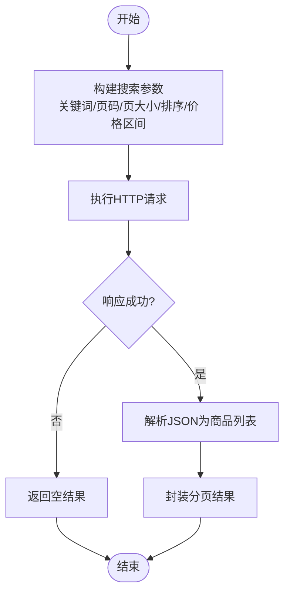
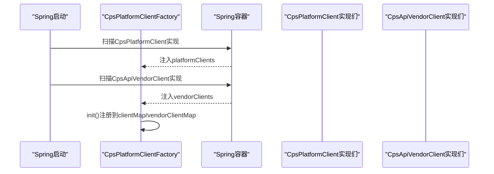
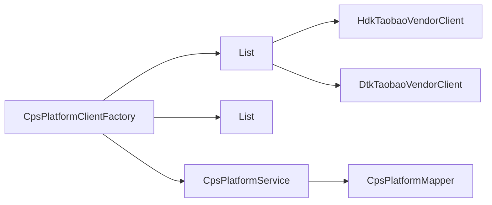

# 平台适配器插件

<cite>
**本文引用的文件**
- [CpsPlatformClient.java](file://backend/qiji-module-cps/qiji-module-cps-biz/src/main/java/com/qiji/cps/module/cps/client/CpsPlatformClient.java)
- [CpsApiVendorClient.java](file://backend/qiji-module-cps/qiji-module-cps-biz/src/main/java/com/qiji/cps/module/cps/client/CpsApiVendorClient.java)
- [CpsPlatformClientFactory.java](file://backend/qiji-module-cps/qiji-module-cps-biz/src/main/java/com/qiji/cps/module/cps/client/CpsPlatformClientFactory.java)
- [AbstractApiVendorClient.java](file://backend/qiji-module-cps/qiji-module-cps-biz/src/main/java/com/qiji/cps/module/cps/client/common/AbstractApiVendorClient.java)
- [HdkTaobaoVendorClient.java](file://backend/qiji-module-cps/qiji-module-cps-biz/src/main/java/com/qiji/cps/module/cps/client/haodanku/HdkTaobaoVendorClient.java)
- [DtkTaobaoVendorClient.java](file://backend/qiji-module-cps/qiji-module-cps-biz/src/main/java/com/qiji/cps/module/cps/client/dataoke/DtkTaobaoVendorClient.java)
- [CpsPlatformCodeEnum.java](file://backend/qiji-module-cps/qiji-module-cps-api/src/main/java/com/qiji/cps/module/cps/enums/CpsPlatformCodeEnum.java)
- [CpsGoodsSearchRequest.java](file://backend/qiji-module-cps/qiji-module-cps-biz/src/main/java/com/qiji/cps/module/cps/client/dto/CpsGoodsSearchRequest.java)
- [CpsOrderDTO.java](file://backend/qiji-module-cps/qiji-module-cps-biz/src/main/java/com/qiji/cps/module/cps/client/dto/CpsOrderDTO.java)
- [CpsPlatformService.java](file://backend/qiji-module-cps/qiji-module-cps-biz/src/main/java/com/qiji/cps/module/cps/service/platform/CpsPlatformService.java)
- [CpsPlatformMapper.java](file://backend/qiji-module-cps/qiji-module-cps-biz/src/main/java/com/qiji/cps/module/cps/dal/mysql/platform/CpsPlatformMapper.java)
- [CpsPlatformClientFactoryTest.java](file://backend/qiji-module-cps/qiji-module-cps-biz/src/test/java/com/qiji/cps/module/cps/client/CpsPlatformClientFactoryTest.java)
- [test_hdk_three_platforms.py](file://script/test/test_hdk_three_platforms.py)
</cite>

## 目录
1. [简介](#简介)
2. [项目结构](#项目结构)
3. [核心组件](#核心组件)
4. [架构总览](#架构总览)
5. [详细组件分析](#详细组件分析)
6. [依赖分析](#依赖分析)
7. [性能考虑](#性能考虑)
8. [故障排查指南](#故障排查指南)
9. [结论](#结论)
10. [附录](#附录)

## 简介
本技术文档围绕CPS平台适配器插件展开，目标是帮助开发者快速理解并实现新的电商适配器，覆盖以下关键能力：
- 平台适配器接口CpsPlatformClient的实现方法：getPlatformCode()、searchGoods()、generatePromotionLink()、queryOrders()、testConnection()
- 供应商适配器接口CpsApiVendorClient的实现要点与模板方法模式
- 工厂注册机制：Spring Bean自动发现、接口实现类命名规范、配置文件注册方式
- 各电商平台（淘宝、京东、拼多多、抖音等）适配器实现差异：API调用方式、数据格式转换、错误处理策略
- 完整的适配器开发流程：从接口实现到测试验证

## 项目结构
CPS模块采用“接口 + 抽象基类 + 具体实现 + 工厂”的分层设计，核心位于qiji-module-cps-biz模块，接口与枚举位于qiji-module-cps-api模块。

图表来源
- [CpsPlatformClient.java:1-55](file://backend/qiji-module-cps/qiji-module-cps-biz/src/main/java/com/qiji/cps/module/cps/client/CpsPlatformClient.java#L1-L55)
- [CpsApiVendorClient.java:1-84](file://backend/qiji-module-cps/qiji-module-cps-biz/src/main/java/com/qiji/cps/module/cps/client/CpsApiVendorClient.java#L1-L84)
- [AbstractApiVendorClient.java:1-225](file://backend/qiji-module-cps/qiji-module-cps-biz/src/main/java/com/qiji/cps/module/cps/client/common/AbstractApiVendorClient.java#L1-L225)
- [HdkTaobaoVendorClient.java:1-193](file://backend/qiji-module-cps/qiji-module-cps-biz/src/main/java/com/qiji/cps/module/cps/client/haodanku/HdkTaobaoVendorClient.java#L1-L193)
- [DtkTaobaoVendorClient.java:1-216](file://backend/qiji-module-cps/qiji-module-cps-biz/src/main/java/com/qiji/cps/module/cps/client/dataoke/DtkTaobaoVendorClient.java#L1-L216)
- [CpsPlatformClientFactory.java:1-167](file://backend/qiji-module-cps/qiji-module-cps-biz/src/main/java/com/qiji/cps/module/cps/client/CpsPlatformClientFactory.java#L1-L167)
- [CpsPlatformService.java:1-53](file://backend/qiji-module-cps/qiji-module-cps-biz/src/main/java/com/qiji/cps/module/cps/service/platform/CpsPlatformService.java#L1-L53)
- [CpsPlatformMapper.java:1-36](file://backend/qiji-module-cps/qiji-module-cps-biz/src/main/java/com/qiji/cps/module/cps/dal/mysql/platform/CpsPlatformMapper.java#L1-L36)
- [CpsPlatformCodeEnum.java:1-46](file://backend/qiji-module-cps/qiji-module-cps-api/src/main/java/com/qiji/cps/module/cps/enums/CpsPlatformCodeEnum.java#L1-L46)

章节来源
- [CpsPlatformClient.java:1-55](file://backend/qiji-module-cps/qiji-module-cps-biz/src/main/java/com/qiji/cps/module/cps/client/CpsPlatformClient.java#L1-L55)
- [CpsApiVendorClient.java:1-84](file://backend/qiji-module-cps/qiji-module-cps-biz/src/main/java/com/qiji/cps/module/cps/client/CpsApiVendorClient.java#L1-L84)
- [CpsPlatformClientFactory.java:1-167](file://backend/qiji-module-cps/qiji-module-cps-biz/src/main/java/com/qiji/cps/module/cps/client/CpsPlatformClientFactory.java#L1-L167)
- [AbstractApiVendorClient.java:1-225](file://backend/qiji-module-cps/qiji-module-cps-biz/src/main/java/com/qiji/cps/module/cps/client/common/AbstractApiVendorClient.java#L1-L225)
- [CpsPlatformCodeEnum.java:1-46](file://backend/qiji-module-cps/qiji-module-cps-api/src/main/java/com/qiji/cps/module/cps/enums/CpsPlatformCodeEnum.java#L1-L46)

## 核心组件
- 平台适配器接口CpsPlatformClient：定义平台维度的统一能力，包括平台编码、商品搜索、推广链接生成、订单查询、连接测试。
- 供应商适配器接口CpsApiVendorClient：定义供应商×平台双维度能力，参数中显式传入CpsVendorConfig以实现配置与逻辑解耦。
- 抽象供应商客户端AbstractApiVendorClient：提供模板方法模式的统一执行流程，子类仅需实现差异化的API路径、参数构建、响应解析。
- 工厂CpsPlatformClientFactory：基于Spring Bean自动发现机制，注册所有CpsPlatformClient与CpsApiVendorClient实现；支持按平台编码与供应商×平台键值获取适配器实例。

章节来源
- [CpsPlatformClient.java:14-52](file://backend/qiji-module-cps/qiji-module-cps-biz/src/main/java/com/qiji/cps/module/cps/client/CpsPlatformClient.java#L14-L52)
- [CpsApiVendorClient.java:25-81](file://backend/qiji-module-cps/qiji-module-cps-biz/src/main/java/com/qiji/cps/module/cps/client/CpsApiVendorClient.java#L25-L81)
- [AbstractApiVendorClient.java:29-166](file://backend/qiji-module-cps/qiji-module-cps-biz/src/main/java/com/qiji/cps/module/cps/client/common/AbstractApiVendorClient.java#L29-L166)
- [CpsPlatformClientFactory.java:30-80](file://backend/qiji-module-cps/qiji-module-cps-biz/src/main/java/com/qiji/cps/module/cps/client/CpsPlatformClientFactory.java#L30-L80)

## 架构总览
CPS适配器采用“策略+工厂”模式，结合“平台维度路由 + 供应商×平台路由”，实现对多平台、多供应商的灵活扩展。

图表来源
- [CpsPlatformClientFactory.java:90-167](file://backend/qiji-module-cps/qiji-module-cps-biz/src/main/java/com/qiji/cps/module/cps/client/CpsPlatformClientFactory.java#L90-L167)
- [CpsPlatformClient.java:21-52](file://backend/qiji-module-cps/qiji-module-cps-biz/src/main/java/com/qiji/cps/module/cps/client/CpsPlatformClient.java#L21-L52)
- [CpsApiVendorClient.java:32-81](file://backend/qiji-module-cps/qiji-module-cps-biz/src/main/java/com/qiji/cps/module/cps/client/CpsApiVendorClient.java#L32-L81)

## 详细组件分析

### 接口实现：CpsPlatformClient
- getPlatformCode()：返回平台编码，与CpsPlatformCodeEnum保持一致。
- searchGoods()：接收CpsGoodsSearchRequest，返回分页搜索结果。
- generatePromotionLink()：接收CpsPromotionLinkRequest，返回推广链接结果。
- queryOrders()：接收CpsOrderQueryRequest，返回订单列表。
- testConnection()：返回连接可用性布尔值。

章节来源
- [CpsPlatformClient.java:14-52](file://backend/qiji-module-cps/qiji-module-cps-biz/src/main/java/com/qiji/cps/module/cps/client/CpsPlatformClient.java#L14-L52)
- [CpsPlatformCodeEnum.java:16-26](file://backend/qiji-module-cps/qiji-module-cps-api/src/main/java/com/qiji/cps/module/cps/enums/CpsPlatformCodeEnum.java#L16-L26)

### 接口实现：CpsApiVendorClient
- getVendorCode()/getPlatformCode()/getVendorType()：供应商与平台标识。
- searchGoods()/generatePromotionLink()/queryOrders()/testConnection(config)：均以CpsVendorConfig为参数，便于测试与多租户支持。

章节来源
- [CpsApiVendorClient.java:25-81](file://backend/qiji-module-cps/qiji-module-cps-biz/src/main/java/com/qiji/cps/module/cps/client/CpsApiVendorClient.java#L25-L81)

### 抽象实现：AbstractApiVendorClient
- 模板方法：searchGoods()/generatePromotionLink()/queryOrders()/testConnection()定义统一流程。
- 子类需实现：API路径、参数构建、响应解析、HTTP执行、成功判断。
- 工具方法：空结果构建、安全数值解析。

图表来源
- [CpsApiVendorClient.java:25-81](file://backend/qiji-module-cps/qiji-module-cps-biz/src/main/java/com/qiji/cps/module/cps/client/CpsApiVendorClient.java#L25-L81)
- [AbstractApiVendorClient.java:29-200](file://backend/qiji-module-cps/qiji-module-cps-biz/src/main/java/com/qiji/cps/module/cps/client/common/AbstractApiVendorClient.java#L29-L200)

章节来源
- [AbstractApiVendorClient.java:29-200](file://backend/qiji-module-cps/qiji-module-cps-biz/src/main/java/com/qiji/cps/module/cps/client/common/AbstractApiVendorClient.java#L29-L200)

### 具体实现：HdkTaobaoVendorClient（好单库-淘宝）
- 平台编码：通过CpsPlatformCodeEnum.TAOBAO.getCode()返回。
- 商品搜索：API路径、参数构建、响应解析、排序转换。
- 推广转链：API路径、参数构建（含推广位、授权账号）、响应解析。
- 订单查询：API路径、参数构建、响应解析。
- 连接测试：使用搜索端点进行轻量测试。

图表来源
- [HdkTaobaoVendorClient.java:30-70](file://backend/qiji-module-cps/qiji-module-cps-biz/src/main/java/com/qiji/cps/module/cps/client/haodanku/HdkTaobaoVendorClient.java#L30-L70)
- [AbstractApiVendorClient.java:101-117](file://backend/qiji-module-cps/qiji-module-cps-biz/src/main/java/com/qiji/cps/module/cps/client/common/AbstractApiVendorClient.java#L101-L117)

章节来源
- [HdkTaobaoVendorClient.java:21-193](file://backend/qiji-module-cps/qiji-module-cps-biz/src/main/java/com/qiji/cps/module/cps/client/haodanku/HdkTaobaoVendorClient.java#L21-L193)
- [CpsPlatformCodeEnum.java:18](file://backend/qiji-module-cps/qiji-module-cps-api/src/main/java/com/qiji/cps/module/cps/enums/CpsPlatformCodeEnum.java#L18)

### 具体实现：DtkTaobaoVendorClient（大淘客-淘宝）
- API路径与参数键名与好单库不同，体现“模板方法”差异化。
- 推广转链支持渠道ID、外部ID等扩展字段。
- 订单查询支持positionIndex滚动分页。

章节来源
- [DtkTaobaoVendorClient.java:21-216](file://backend/qiji-module-cps/qiji-module-cps-biz/src/main/java/com/qiji/cps/module/cps/client/dataoke/DtkTaobaoVendorClient.java#L21-L216)

### 工厂注册机制与路由
- Spring自动发现：工厂注入List<CpsPlatformClient>与List<CpsApiVendorClient>，在初始化时注册到Map。
- 平台维度路由：getClient(platformCode)按平台编码获取适配器。
- 供应商×平台路由：getVendorClient(vendorCode, platformCode)与getActiveVendorClient(platformCode)。
- 平台配置来源：CpsPlatformService与CpsPlatformMapper提供activeVendorCode等配置。

图表来源
- [CpsPlatformClientFactory.java:60-80](file://backend/qiji-module-cps/qiji-module-cps-biz/src/main/java/com/qiji/cps/module/cps/client/CpsPlatformClientFactory.java#L60-L80)
- [CpsPlatformClientFactory.java:143-167](file://backend/qiji-module-cps/qiji-module-cps-biz/src/main/java/com/qiji/cps/module/cps/client/CpsPlatformClientFactory.java#L143-L167)

章节来源
- [CpsPlatformClientFactory.java:30-80](file://backend/qiji-module-cps/qiji-module-cps-biz/src/main/java/com/qiji/cps/module/cps/client/CpsPlatformClientFactory.java#L30-L80)
- [CpsPlatformClientFactory.java:137-167](file://backend/qiji-module-cps/qiji-module-cps-biz/src/main/java/com/qiji/cps/module/cps/client/CpsPlatformClientFactory.java#L137-L167)
- [CpsPlatformService.java:48-52](file://backend/qiji-module-cps/qiji-module-cps-biz/src/main/java/com/qiji/cps/module/cps/service/platform/CpsPlatformService.java#L48-L52)
- [CpsPlatformMapper.java:28-30](file://backend/qiji-module-cps/qiji-module-cps-biz/src/main/java/com/qiji/cps/module/cps/dal/mysql/platform/CpsPlatformMapper.java#L28-L30)

### 平台适配器注册机制
- Spring Bean自动发现：实现类使用@Component注解，工厂通过@Resource注入List集合自动收集。
- 接口实现类命名规范：建议采用“[Vendor][Platform]VendorClient”形式，如HdkTaobaoVendorClient、DtkTaobaoVendorClient。
- 配置文件注册方式：可通过application.yml中的包扫描路径确保实现类被Spring扫描到。

章节来源
- [CpsPlatformClientFactory.java:44-52](file://backend/qiji-module-cps/qiji-module-cps-biz/src/main/java/com/qiji/cps/module/cps/client/CpsPlatformClientFactory.java#L44-L52)
- [HdkTaobaoVendorClient.java:21](file://backend/qiji-module-cps/qiji-module-cps-biz/src/main/java/com/qiji/cps/module/cps/client/haodanku/HdkTaobaoVendorClient.java#L21)
- [DtkTaobaoVendorClient.java:21](file://backend/qiji-module-cps/qiji-module-cps-biz/src/main/java/com/qiji/cps/module/cps/client/dataoke/DtkTaobaoVendorClient.java#L21)

### 各电商平台适配器实现差异
- 淘宝（淘宝联盟）
  - 好单库实现：搜索端点/supersearch，转链端点/ratesurl，订单端点/order_list。
  - 大淘客实现：搜索端点/goods/get-dtk-search-goods，转链端点/tb-service/get-privilege-link，订单端点/tb-service/get-order-details。
  - 排序与参数键名存在差异，需在子类中转换。
- 京东、拼多多、抖音等
  - 通过CpsPlatformCodeEnum定义平台编码，适配器实现类命名遵循“[Vendor][Platform]VendorClient”规范。
  - 具体API路径与参数键名需在子类中实现，遵循AbstractApiVendorClient模板方法。

章节来源
- [HdkTaobaoVendorClient.java:30-161](file://backend/qiji-module-cps/qiji-module-cps-biz/src/main/java/com/qiji/cps/module/cps/client/haodanku/HdkTaobaoVendorClient.java#L30-L161)
- [DtkTaobaoVendorClient.java:30-160](file://backend/qiji-module-cps/qiji-module-cps-biz/src/main/java/com/qiji/cps/module/cps/client/dataoke/DtkTaobaoVendorClient.java#L30-L160)
- [CpsPlatformCodeEnum.java:18-23](file://backend/qiji-module-cps/qiji-module-cps-api/src/main/java/com/qiji/cps/module/cps/enums/CpsPlatformCodeEnum.java#L18-L23)

### 数据模型与请求/响应
- 搜索请求：CpsGoodsSearchRequest，包含关键词、页码、页大小、价格区间、排序、是否有券、推广位ID、外部ID等。
- 订单模型：CpsOrderDTO，包含平台编码、平台订单号、父订单号、商品信息、价格、佣金、数量、时间等。

章节来源
- [CpsGoodsSearchRequest.java:12-60](file://backend/qiji-module-cps/qiji-module-cps-biz/src/main/java/com/qiji/cps/module/cps/client/dto/CpsGoodsSearchRequest.java#L12-L60)
- [CpsOrderDTO.java:13-77](file://backend/qiji-module-cps/qiji-module-cps-biz/src/main/java/com/qiji/cps/module/cps/client/dto/CpsOrderDTO.java#L13-L77)

## 依赖分析
- 组件内聚与耦合
  - 工厂负责注册与路由，低耦合地持有实现列表，业务层仅依赖接口。
  - 抽象基类提供模板方法，子类仅关注差异化部分，提升内聚性。
- 外部依赖
  - JSON解析：Jackson ObjectMapper，忽略未知属性。
  - 日志：SLF4J，统一记录异常与警告。
- 循环依赖
  - 工厂依赖服务层读取平台配置，但服务层不依赖工厂，避免循环。

图表来源
- [CpsPlatformClientFactory.java:44-58](file://backend/qiji-module-cps/qiji-module-cps-biz/src/main/java/com/qiji/cps/module/cps/client/CpsPlatformClientFactory.java#L44-L58)
- [CpsPlatformService.java:48-52](file://backend/qiji-module-cps/qiji-module-cps-biz/src/main/java/com/qiji/cps/module/cps/service/platform/CpsPlatformService.java#L48-L52)
- [CpsPlatformMapper.java:28-30](file://backend/qiji-module-cps/qiji-module-cps-biz/src/main/java/com/qiji/cps/module/cps/dal/mysql/platform/CpsPlatformMapper.java#L28-L30)

章节来源
- [CpsPlatformClientFactory.java:44-58](file://backend/qiji-module-cps/qiji-module-cps-biz/src/main/java/com/qiji/cps/module/cps/client/CpsPlatformClientFactory.java#L44-L58)
- [CpsPlatformService.java:48-52](file://backend/qiji-module-cps/qiji-module-cps-biz/src/main/java/com/qiji/cps/module/cps/service/platform/CpsPlatformService.java#L48-L52)
- [CpsPlatformMapper.java:28-30](file://backend/qiji-module-cps/qiji-module-cps-biz/src/main/java/com/qiji/cps/module/cps/dal/mysql/platform/CpsPlatformMapper.java#L28-L30)

## 性能考虑
- 模板方法减少重复代码，降低运行时开销。
- 使用并发Map存储适配器实例，保证线程安全与查找效率。
- 响应解析采用安全数值转换，避免异常导致的性能损耗。
- 建议：在供应商实现中缓存常用配置，减少重复网络请求。

## 故障排查指南
- 工厂未注册适配器
  - 检查实现类是否标注@Component且在Spring扫描范围内。
  - 确认工厂init()是否执行，日志是否输出注册信息。
- 供应商×平台路由失败
  - 检查平台配置表中activeVendorCode是否正确。
  - 使用getVendorClient(vendorCode, platformCode)直接定位问题。
- 连接测试失败
  - 使用testConnection()或testConnection(config)方法验证。
  - 参考测试脚本对端点可用性进行探测。

章节来源
- [CpsPlatformClientFactoryTest.java:125-152](file://backend/qiji-module-cps/qiji-module-cps-biz/src/test/java/com/qiji/cps/module/cps/client/CpsPlatformClientFactoryTest.java#L125-L152)
- [test_hdk_three_platforms.py:357-371](file://script/test/test_hdk_three_platforms.py#L357-L371)

## 结论
通过接口 + 抽象基类 + 工厂的架构设计，CPS平台适配器插件实现了对多平台、多供应商的灵活扩展。开发者只需遵循模板方法与命名规范，即可快速接入新平台或新供应商，同时借助工厂的路由能力与测试脚本，保障系统的稳定性与可维护性。

## 附录
- 开发流程建议
  - 明确平台编码与供应商类型，选择合适的抽象基类实现。
  - 实现模板方法：API路径、参数构建、响应解析。
  - 编写单元测试与集成测试，参考现有测试用例。
  - 使用测试脚本对端点可用性进行验证。
  - 将实现类纳入Spring扫描范围，确保工厂自动注册。