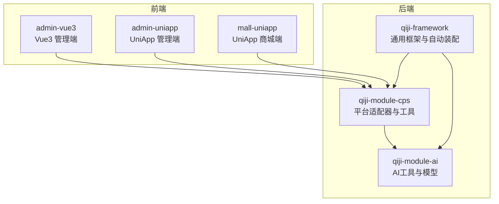
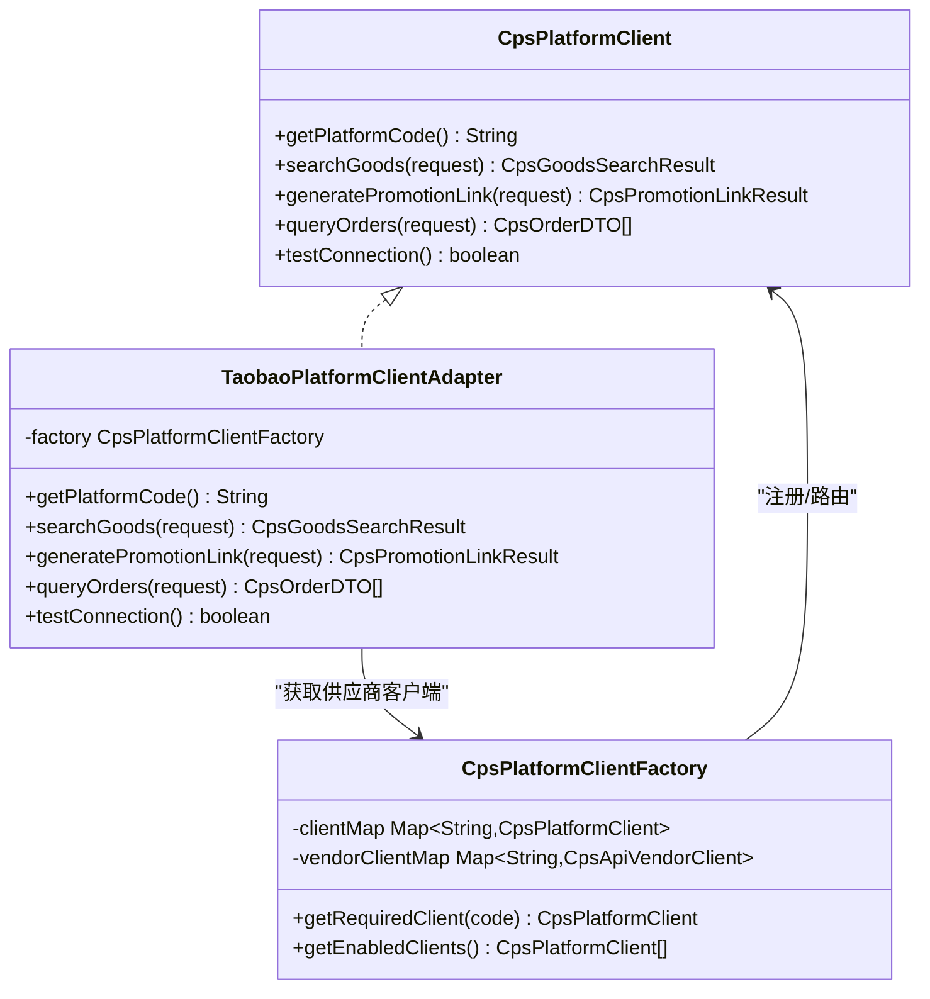
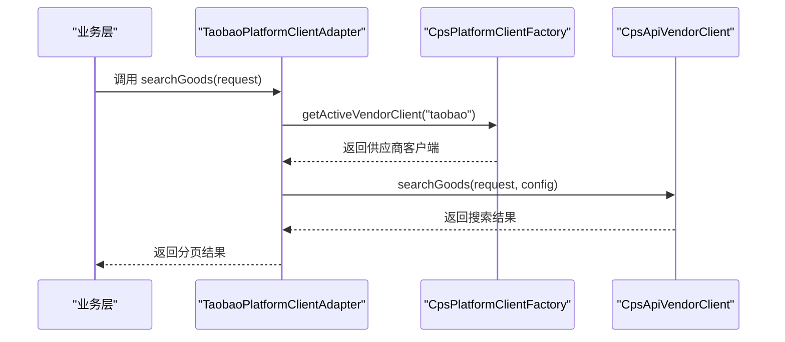
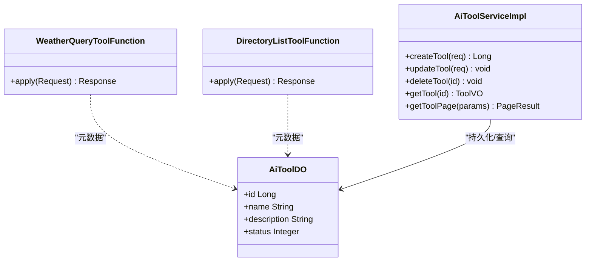
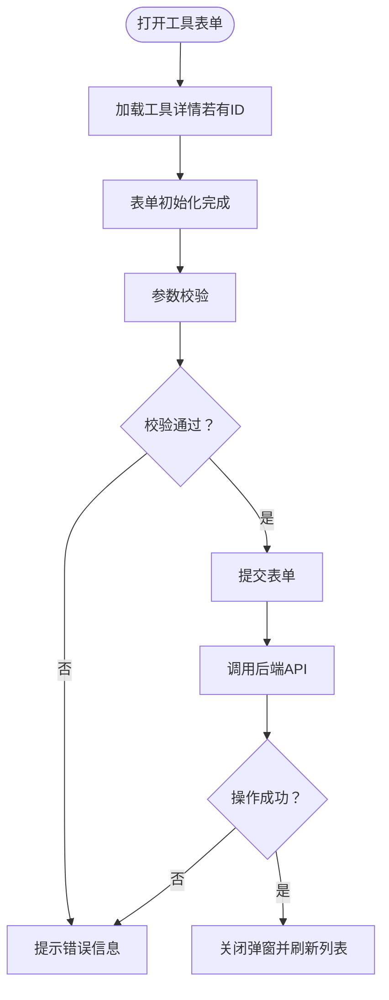
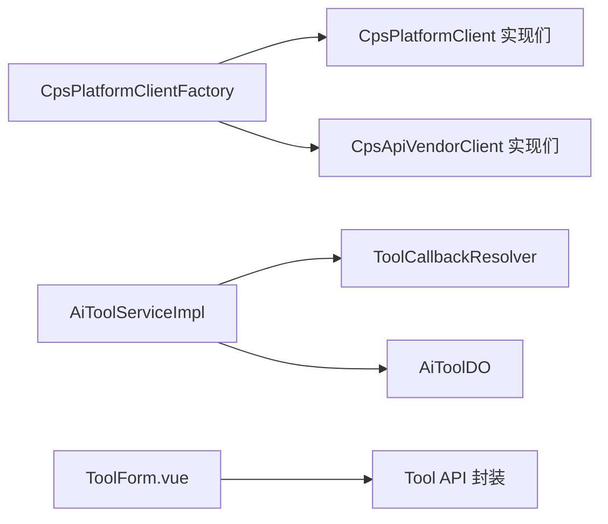

# 插件开发

<cite>
**本文引用的文件**
- [CpsPlatformClient.java](file://backend/qiji-module-cps/qiji-module-cps-biz/src/main/java/com/qiji/cps/module/cps/client/CpsPlatformClient.java)
- [CpsPlatformClientFactory.java](file://backend/qiji-module-cps/qiji-module-cps-biz/src/main/java/com/qiji/cps/module/cps/client/CpsPlatformClientFactory.java)
- [TaobaoPlatformClientAdapter.java](file://backend/qiji-module-cps/qiji-module-cps-biz/src/main/java/com/qiji/cps/module/cps/client/taobao/TaobaoPlatformClientAdapter.java)
- [CpsSearchGoodsToolFunction.java](file://backend/qiji-module-cps/qiji-module-cps-biz/src/main/java/com/qiji/cps/module/cps/mcp/tool/CpsSearchGoodsToolFunction.java)
- [WeatherQueryToolFunction.java](file://backend/qiji-module-ai/src/main/java/com/qiji/cps/module/ai/tool/function/WeatherQueryToolFunction.java)
- [DirectoryListToolFunction.java](file://backend/qiji-module-ai/src/main/java/com/qiji/cps/module/ai/tool/function/DirectoryListToolFunction.java)
- [AiToolDO.java](file://backend/qiji-module-ai/src/main/java/com/qiji/cps/module/ai/dal/dataobject/model/AiToolDO.java)
- [AiToolServiceImpl.java](file://backend/qiji-module-ai/src/main/java/com/qiji/cps/module/ai/service/model/AiToolServiceImpl.java)
- [ToolForm.vue](file://frontend/admin-vue3/src/views/ai/model/tool/ToolForm.vue)
- [index.ts](file://frontend/admin-vue3/src/api/ai/model/tool/index.ts)
- [QijiWebAutoConfiguration.java](file://backend/qiji-framework/qiji-spring-boot-starter-web/src/main/java/com/qiji/cps/framework/web/config/QijiWebAutoConfiguration.java)
- [Knife4jOpenApiCustomizer.java](file://backend/qiji-framework/qiji-spring-boot-starter-web/src/main/java/com/qiji/cps/framework/swagger/config/Knife4jOpenApiCustomizer.java)
- [SpringUtils.java](file://backend/qiji-framework/qiji-common/src/main/java/com/qiji/cps/framework/common/util/spring/SpringUtils.java)
- [SpringExpressionUtils.java](file://backend/qiji-framework/qiji-common/src/main/java/com/qiji/cps/framework/common/util/spring/SpringExpressionUtils.java)
- [sync-manifest-plugins.ts](file://frontend/admin-uniapp/vite-plugins/sync-manifest-plugins.ts)
- [vite.config.ts](file://frontend/admin-uniapp/vite.config.ts)
- [uni-scss 颜色变量](file://frontend/mall-uniapp/uni_modules/uni-scss/styles/setting/_color.scss)
- [uni-scss 样式示例](file://frontend/mall-uniapp/uni_modules/uni-scss/styles/setting/_variables.scss)
</cite>

## 目录
1. [引言](#引言)
2. [项目结构](#项目结构)
3. [核心组件](#核心组件)
4. [架构总览](#架构总览)
5. [详细组件分析](#详细组件分析)
6. [依赖分析](#依赖分析)
7. [性能考虑](#性能考虑)
8. [故障排查指南](#故障排查指南)
9. [结论](#结论)
10. [附录](#附录)

## 引言
本指南面向AgenticCPS插件开发者，围绕四大方向提供系统化开发指引：
- 平台适配器插件：实现CpsPlatformClient接口，完成商品搜索、推广链接生成、订单查询等能力，并通过工厂进行注册与路由。
- AI工具插件：实现ToolFunction接口（Spring Bean），完成工具函数注册、参数校验、错误处理与统一回调解析。
- 业务服务插件扩展：基于Spring Bean机制注册服务、依赖注入、事务管理与安全控制的最佳实践。
- UI组件插件：前端组件注册、样式定制、事件与状态管理，以及构建期插件同步与热更新相关配置。

## 项目结构
AgenticCPS采用前后端分离与模块化架构，后端以Spring Boot为核心，前端包含admin-vue3与admin-uniapp两套管理端，另有mall-uniapp面向终端用户的移动端应用。插件开发涉及后端模块（qiji-module-cps、qiji-module-ai、qiji-framework）与前端模块（admin-vue3、admin-uniapp、mall-uniapp）。

## 核心组件
- 平台适配器接口与工厂
  - 接口：CpsPlatformClient，定义平台编码、商品搜索、推广链接生成、订单查询、连通性测试等能力。
  - 工厂：CpsPlatformClientFactory，负责收集所有实现的适配器并按平台编码路由，同时支持供应商维度路由。
- AI工具函数与服务
  - 工具函数：实现Function接口的Spring Bean，如WeatherQueryToolFunction、DirectoryListToolFunction。
  - 服务：AiToolServiceImpl结合ToolCallbackResolver统一解析工具调用。
  - 数据对象：AiToolDO承载工具元数据（名称、描述、状态）。
- 前端工具页面与API
  - ToolForm.vue提供AI工具的增删改查表单交互。
  - index.ts封装工具API调用。

章节来源
- [CpsPlatformClient.java:1-55](file://backend/qiji-module-cps/qiji-module-cps-biz/src/main/java/com/qiji/cps/module/cps/client/CpsPlatformClient.java#L1-L55)
- [CpsPlatformClientFactory.java:1-139](file://backend/qiji-module-cps/qiji-module-cps-biz/src/main/java/com/qiji/cps/module/cps/client/CpsPlatformClientFactory.java#L1-L139)
- [WeatherQueryToolFunction.java:1-118](file://backend/qiji-module-ai/src/main/java/com/qiji/cps/module/ai/tool/function/WeatherQueryToolFunction.java#L1-L118)
- [DirectoryListToolFunction.java:1-99](file://backend/qiji-module-ai/src/main/java/com/qiji/cps/module/ai/tool/function/DirectoryListToolFunction.java#L1-L99)
- [AiToolServiceImpl.java:1-38](file://backend/qiji-module-ai/src/main/java/com/qiji/cps/module/ai/service/model/AiToolServiceImpl.java#L1-L38)
- [AiToolDO.java:1-48](file://backend/qiji-module-ai/src/main/java/com/qiji/cps/module/ai/dal/dataobject/model/AiToolDO.java#L1-L48)
- [ToolForm.vue:36-78](file://frontend/admin-vue3/src/views/ai/model/tool/ToolForm.vue#L36-L78)
- [index.ts:1-42](file://frontend/admin-vue3/src/api/ai/model/tool/index.ts#L1-L42)

## 架构总览
平台适配器采用“顶层适配器 + 供应商客户端”的双层委托模式：业务层通过顶层适配器调用，顶层适配器再根据当前激活的供应商客户端执行具体API。

图表来源
- [CpsPlatformClient.java:14-54](file://backend/qiji-module-cps/qiji-module-cps-biz/src/main/java/com/qiji/cps/module/cps/client/CpsPlatformClient.java#L14-L54)
- [CpsPlatformClientFactory.java:30-132](file://backend/qiji-module-cps/qiji-module-cps-biz/src/main/java/com/qiji/cps/module/cps/client/CpsPlatformClientFactory.java#L30-L132)
- [TaobaoPlatformClientAdapter.java:25-90](file://backend/qiji-module-cps/qiji-module-cps-biz/src/main/java/com/qiji/cps/module/cps/client/taobao/TaobaoPlatformClientAdapter.java#L25-L90)

## 详细组件分析

### 平台适配器插件开发
- 实现步骤
  - 实现CpsPlatformClient接口，提供平台编码与三大核心能力：商品搜索、推广链接生成、订单查询。
  - 将实现类标注为Spring组件，确保被工厂自动收集。
  - 通过CpsPlatformClientFactory按平台编码获取实例；若需供应商维度，使用供应商客户端接口与配置。
- 平台编码规范
  - 平台编码需与枚举一致，便于统一管理与路由。
- 商品搜索接口
  - 输入：搜索请求对象（关键词、分页等）。
  - 输出：分页结果（列表、总数、页码、页大小）。
- 推广链接生成
  - 输入：转链请求（含商品ID、推广位等）。
  - 输出：推广链接结果（短链、长链、渠道标识等）。
- 订单查询接口
  - 输入：订单查询请求（时间区间、订单号等）。
  - 输出：订单列表（标准化字段）。
- 连通性测试
  - 用于平台配置保存前的可用性校验。

图表来源
- [TaobaoPlatformClientAdapter.java:37-46](file://backend/qiji-module-cps/qiji-module-cps-biz/src/main/java/com/qiji/cps/module/cps/client/taobao/TaobaoPlatformClientAdapter.java#L37-L46)
- [CpsPlatformClientFactory.java:104-110](file://backend/qiji-module-cps/qiji-module-cps-biz/src/main/java/com/qiji/cps/module/cps/client/CpsPlatformClientFactory.java#L104-L110)

章节来源
- [CpsPlatformClient.java:14-54](file://backend/qiji-module-cps/qiji-module-cps-biz/src/main/java/com/qiji/cps/module/cps/client/CpsPlatformClient.java#L14-L54)
- [CpsPlatformClientFactory.java:30-132](file://backend/qiji-module-cps/qiji-module-cps-biz/src/main/java/com/qiji/cps/module/cps/client/CpsPlatformClientFactory.java#L30-L132)
- [TaobaoPlatformClientAdapter.java:25-90](file://backend/qiji-module-cps/qiji-module-cps-biz/src/main/java/com/qiji/cps/module/cps/client/taobao/TaobaoPlatformClientAdapter.java#L25-L90)

### AI工具插件开发
- ToolFunction接口实现
  - 工具函数实现Function接口，作为Spring Bean注册（@Component)，Bean名称即工具名称。
  - 请求/响应对象使用Jackson注解声明参数与描述，便于LLM理解。
- 工具函数注册
  - 通过Spring容器自动扫描注册，无需手工维护注册表。
- 参数验证与错误处理
  - 在工具函数内部进行参数校验，必要时抛出业务异常或返回错误信息。
  - 服务层AiToolServiceImpl结合ToolCallbackResolver统一解析工具调用。
- 工具元数据管理
  - AiToolDO承载工具名称、描述、状态等元信息，配合前端ToolForm.vue与API进行CRUD。

图表来源
- [WeatherQueryToolFunction.java:24-103](file://backend/qiji-module-ai/src/main/java/com/qiji/cps/module/ai/tool/function/WeatherQueryToolFunction.java#L24-L103)
- [DirectoryListToolFunction.java:29-97](file://backend/qiji-module-ai/src/main/java/com/qiji/cps/module/ai/tool/function/DirectoryListToolFunction.java#L29-L97)
- [AiToolServiceImpl.java:27-38](file://backend/qiji-module-ai/src/main/java/com/qiji/cps/module/ai/service/model/AiToolServiceImpl.java#L27-L38)
- [AiToolDO.java:22-47](file://backend/qiji-module-ai/src/main/java/com/qiji/cps/module/ai/dal/dataobject/model/AiToolDO.java#L22-L47)

章节来源
- [WeatherQueryToolFunction.java:1-118](file://backend/qiji-module-ai/src/main/java/com/qiji/cps/module/ai/tool/function/WeatherQueryToolFunction.java#L1-L118)
- [DirectoryListToolFunction.java:1-99](file://backend/qiji-module-ai/src/main/java/com/qiji/cps/module/ai/tool/function/DirectoryListToolFunction.java#L1-L99)
- [AiToolServiceImpl.java:1-38](file://backend/qiji-module-ai/src/main/java/com/qiji/cps/module/ai/service/model/AiToolServiceImpl.java#L1-L38)
- [AiToolDO.java:1-48](file://backend/qiji-module-ai/src/main/java/com/qiji/cps/module/ai/dal/dataobject/model/AiToolDO.java#L1-L48)
- [ToolForm.vue:36-78](file://frontend/admin-vue3/src/views/ai/model/tool/ToolForm.vue#L36-L78)
- [index.ts:12-42](file://frontend/admin-vue3/src/api/ai/model/tool/index.ts#L12-L42)

### 业务服务插件扩展
- Spring Bean注册
  - 使用@Component等注解将服务类注册为Bean，工厂自动装配。
- 服务接口设计
  - 明确职责边界，避免跨模块耦合；通过接口隔离具体实现。
- 依赖注入
  - 使用@Resource/@Autowired进行字段注入或构造注入，确保线程安全与可测试性。
- 事务管理
  - 使用@Transactional标注服务方法，结合传播行为与异常回滚策略。
- 安全与配置
  - 通过QijiWebAutoConfiguration、Knife4jOpenApiCustomizer等自动装配组件，统一拦截器、RestTemplate、Swagger等配置。

章节来源
- [QijiWebAutoConfiguration.java:140-155](file://backend/qiji-framework/qiji-spring-boot-starter-web/src/main/java/com/qiji/cps/framework/web/config/QijiWebAutoConfiguration.java#L140-L155)
- [Knife4jOpenApiCustomizer.java:107-146](file://backend/qiji-framework/qiji-spring-boot-starter-web/src/main/java/com/qiji/cps/framework/swagger/config/Knife4jOpenApiCustomizer.java#L107-L146)
- [SpringUtils.java:12-24](file://backend/qiji-framework/qiji-common/src/main/java/com/qiji/cps/framework/common/util/spring/SpringUtils.java#L12-L24)
- [SpringExpressionUtils.java:29-39](file://backend/qiji-framework/qiji-common/src/main/java/com/qiji/cps/framework/common/util/spring/SpringExpressionUtils.java#L29-L39)

### UI组件插件开发指南
- 组件注册
  - 在前端工程中通过标准组件注册方式引入，保持命名规范与作用域隔离。
- 样式定制
  - 使用uni-scss变量体系（如_color.scss、_variables.scss）统一主题与尺寸，避免硬编码。
- 事件处理与状态管理
  - 使用表单Ref与状态变量（dialogVisible、formLoading等）管理交互流程；结合API封装进行数据加载与提交。
- 构建与热更新
  - 通过vite.config.ts与sync-manifest-plugins.ts在构建阶段同步manifest与资源，保障多端一致性与增量更新。

图表来源
- [ToolForm.vue:60-78](file://frontend/admin-vue3/src/views/ai/model/tool/ToolForm.vue#L60-L78)
- [index.ts:14-41](file://frontend/admin-vue3/src/api/ai/model/tool/index.ts#L14-L41)

章节来源
- [ToolForm.vue:36-78](file://frontend/admin-vue3/src/views/ai/model/tool/ToolForm.vue#L36-L78)
- [index.ts:1-42](file://frontend/admin-vue3/src/api/ai/model/tool/index.ts#L1-L42)
- [uni-scss 颜色变量:10-66](file://frontend/mall-uniapp/uni_modules/uni-scss/styles/setting/_color.scss#L10-L66)
- [uni-scss 样式示例](file://frontend/mall-uniapp/uni_modules/uni-scss/styles/setting/_variables.scss)
- [sync-manifest-plugins.ts:19-46](file://frontend/admin-uniapp/vite-plugins/sync-manifest-plugins.ts#L19-L46)
- [vite.config.ts:26-56](file://frontend/admin-uniapp/vite.config.ts#L26-L56)

## 依赖分析
- 后端依赖
  - 模块间：qiji-module-cps依赖qiji-framework提供的自动装配与通用工具；qiji-module-ai同样依赖框架层能力。
  - 工具函数与服务：AiToolServiceImpl依赖ToolCallbackResolver进行工具解析，结合AiToolDO进行元数据管理。
- 前端依赖
  - admin-vue3通过API封装与组件表单实现工具管理；admin-uniapp与mall-uniapp通过Vite插件与SCSS变量体系保证样式一致性与构建效率。

图表来源
- [CpsPlatformClientFactory.java:30-58](file://backend/qiji-module-cps/qiji-module-cps-biz/src/main/java/com/qiji/cps/module/cps/client/CpsPlatformClientFactory.java#L30-L58)
- [AiToolServiceImpl.java:31-36](file://backend/qiji-module-ai/src/main/java/com/qiji/cps/module/ai/service/model/AiToolServiceImpl.java#L31-L36)
- [AiToolDO.java:22-47](file://backend/qiji-module-ai/src/main/java/com/qiji/cps/module/ai/dal/dataobject/model/AiToolDO.java#L22-L47)
- [ToolForm.vue:60-78](file://frontend/admin-vue3/src/views/ai/model/tool/ToolForm.vue#L60-L78)
- [index.ts:12-41](file://frontend/admin-vue3/src/api/ai/model/tool/index.ts#L12-L41)

## 性能考虑
- 平台适配器
  - 使用ConcurrentHashMap缓存客户端映射，减少重复查找成本；在顶层适配器中进行空值保护与快速失败。
- AI工具
  - 工具函数内部尽量避免阻塞操作；对外部API调用进行超时与重试策略配置。
- 前端
  - 组件状态与表单加载状态分离，避免不必要的重渲染；SCSS变量集中管理，减少样式冲突与重复计算。

## 故障排查指南
- 平台适配器
  - 若出现“未找到平台适配器”，检查工厂是否正确注册、平台编码是否匹配、供应商配置是否激活。
- AI工具
  - 若工具调用失败，检查请求参数、工具Bean名称与注册、ToolCallbackResolver是否生效。
- 前端
  - 若表单无法提交，检查API返回状态与错误提示；确认Vite插件是否正确同步manifest与资源。

章节来源
- [CpsPlatformClientFactory.java:104-110](file://backend/qiji-module-cps/qiji-module-cps-biz/src/main/java/com/qiji/cps/module/cps/client/CpsPlatformClientFactory.java#L104-L110)
- [AiToolServiceImpl.java:18-21](file://backend/qiji-module-ai/src/main/java/com/qiji/cps/module/ai/service/model/AiToolServiceImpl.java#L18-L21)
- [ToolForm.vue:60-78](file://frontend/admin-vue3/src/views/ai/model/tool/ToolForm.vue#L60-L78)

## 结论
通过接口抽象与工厂注册机制，平台适配器插件可实现“即插即用”；AI工具插件遵循Spring Bean与参数描述规范，具备良好的可发现性与可维护性；业务服务与UI组件插件在框架与前端工程内均有完善的自动化与构建支持。建议在开发过程中严格遵循编码规范、参数校验与错误处理，确保插件在多平台与多端场景下的稳定性与一致性。

## 附录
- 关键文件索引
  - 平台适配器接口与工厂：[CpsPlatformClient.java](file://backend/qiji-module-cps/qiji-module-cps-biz/src/main/java/com/qiji/cps/module/cps/client/CpsPlatformClient.java)、[CpsPlatformClientFactory.java](file://backend/qiji-module-cps/qiji-module-cps-biz/src/main/java/com/qiji/cps/module/cps/client/CpsPlatformClientFactory.java)
  - 适配器实现示例：[TaobaoPlatformClientAdapter.java](file://backend/qiji-module-cps/qiji-module-cps-biz/src/main/java/com/qiji/cps/module/cps/client/taobao/TaobaoPlatformClientAdapter.java)
  - AI工具函数与服务：[WeatherQueryToolFunction.java](file://backend/qiji-module-ai/src/main/java/com/qiji/cps/module/ai/tool/function/WeatherQueryToolFunction.java)、[DirectoryListToolFunction.java](file://backend/qiji-module-ai/src/main/java/com/qiji/cps/module/ai/tool/function/DirectoryListToolFunction.java)、[AiToolServiceImpl.java](file://backend/qiji-module-ai/src/main/java/com/qiji/cps/module/ai/service/model/AiToolServiceImpl.java)、[AiToolDO.java](file://backend/qiji-module-ai/src/main/java/com/qiji/cps/module/ai/dal/dataobject/model/AiToolDO.java)
  - 前端工具页面与API：[ToolForm.vue](file://frontend/admin-vue3/src/views/ai/model/tool/ToolForm.vue)、[index.ts](file://frontend/admin-vue3/src/api/ai/model/tool/index.ts)
  - 前端构建与样式：[sync-manifest-plugins.ts](file://frontend/admin-uniapp/vite-plugins/sync-manifest-plugins.ts)、[vite.config.ts](file://frontend/admin-uniapp/vite.config.ts)、[uni-scss 颜色变量](file://frontend/mall-uniapp/uni_modules/uni-scss/styles/setting/_color.scss)、[uni-scss 样式示例](file://frontend/mall-uniapp/uni_modules/uni-scss/styles/setting/_variables.scss)
  - 框架自动装配：[QijiWebAutoConfiguration.java](file://backend/qiji-framework/qiji-spring-boot-starter-web/src/main/java/com/qiji/cps/framework/web/config/QijiWebAutoConfiguration.java)、[Knife4jOpenApiCustomizer.java](file://backend/qiji-framework/qiji-spring-boot-starter-web/src/main/java/com/qiji/cps/framework/swagger/config/Knife4jOpenApiCustomizer.java)、[SpringUtils.java](file://backend/qiji-framework/qiji-common/src/main/java/com/qiji/cps/framework/common/util/spring/SpringUtils.java)、[SpringExpressionUtils.java](file://backend/qiji-framework/qiji-common/src/main/java/com/qiji/cps/framework/common/util/spring/SpringExpressionUtils.java)