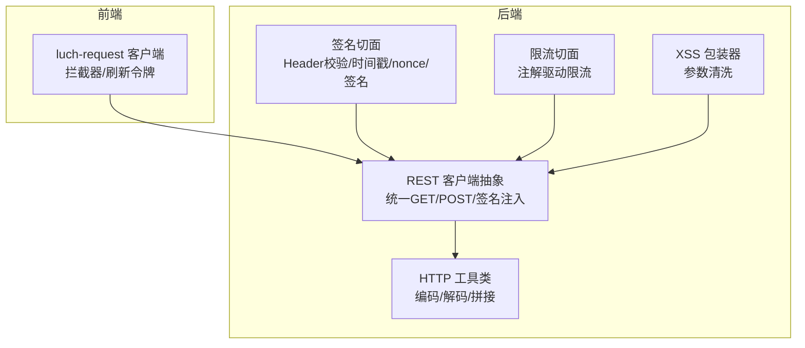
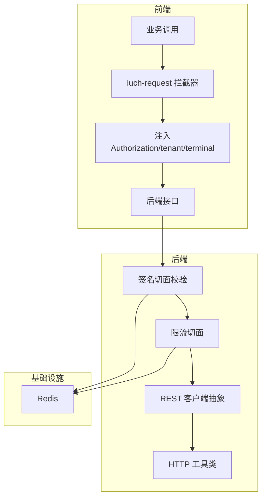
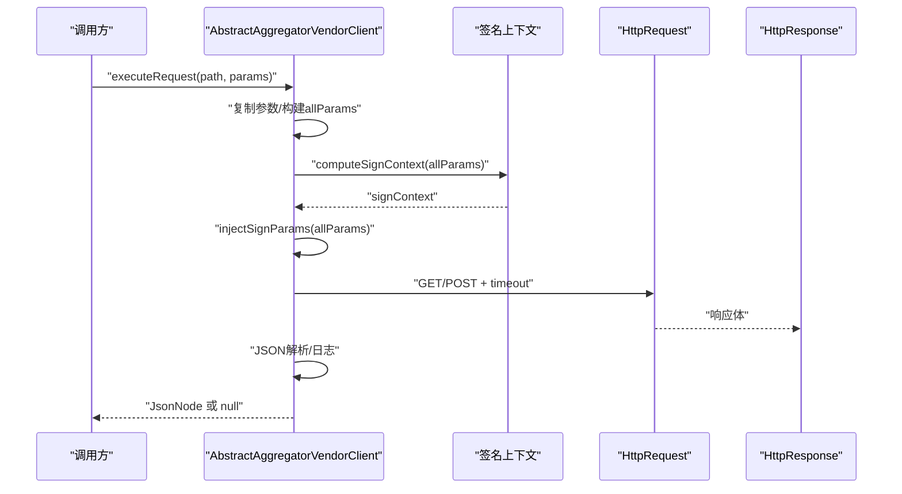
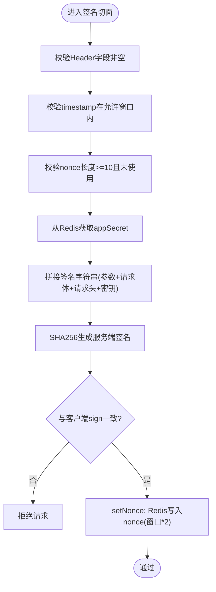
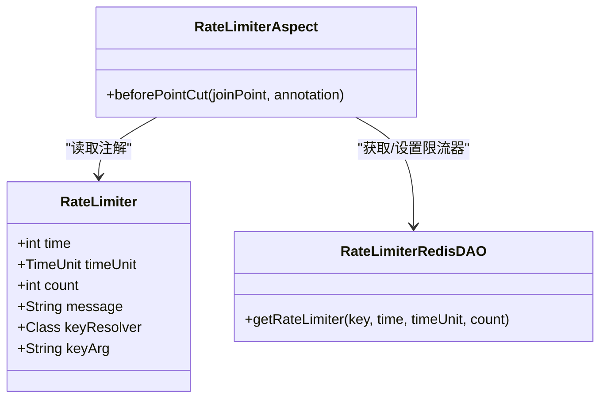
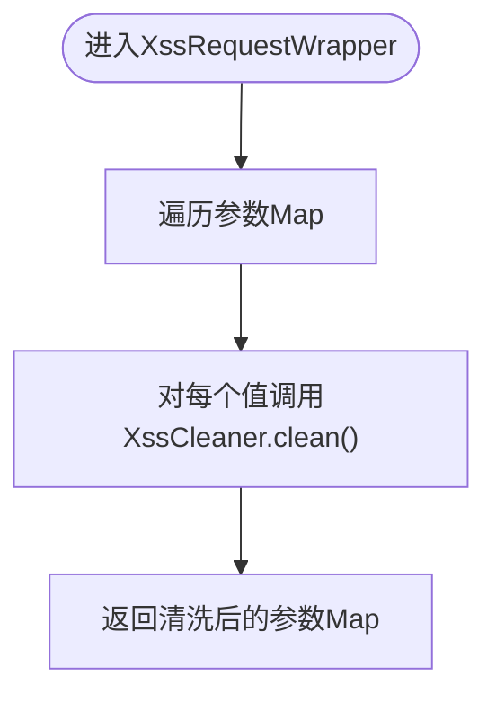
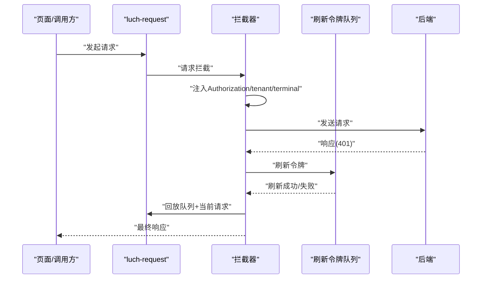
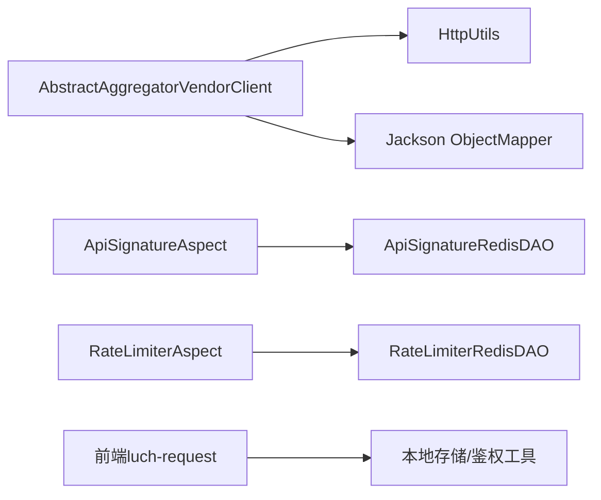

# API集成

<cite>
**本文引用的文件**
- [AbstractAggregatorVendorClient.java](file://backend/qiji-module-cps/qiji-module-cps-biz/src/main/java/com/qiji/cps/module/cps/client/common/AbstractAggregatorVendorClient.java)
- [HttpUtils.java](file://backend/qiji-framework/qiji-common/src/main/java/com/qiji/cps/framework/common/util/http/HttpUtils.java)
- [ApiSignatureAspect.java](file://backend/qiji-framework/qiji-spring-boot-starter-protection/src/main/java/com/qiji/cps/framework/signature/core/aop/ApiSignatureAspect.java)
- [ApiSignature.java](file://backend/qiji-framework/qiji-spring-boot-starter-protection/src/main/java/com/qiji/cps/framework/signature/core/annotation/ApiSignature.java)
- [ApiSignatureRedisDAO.java](file://backend/qiji-framework/qiji-spring-boot-starter-protection/src/main/java/com/qiji/cps/framework/signature/core/redis/ApiSignatureRedisDAO.java)
- [RateLimiterAspect.java](file://backend/qiji-framework/qiji-spring-boot-starter-protection/src/main/java/com/qiji/cps/framework/ratelimiter/core/aop/RateLimiterAspect.java)
- [RateLimiter.java](file://backend/qiji-framework/qiji-spring-boot-starter-protection/src/main/java/com/qiji/cps/framework/ratelimiter/core/annotation/RateLimiter.java)
- [RateLimiterRedisDAO.java](file://backend/qiji-framework/qiji-spring-boot-starter-protection/src/main/java/com/qiji/cps/framework/ratelimiter/core/redis/RateLimiterRedisDAO.java)
- [XssRequestWrapper.java](file://backend/qiji-framework/qiji-spring-boot-starter-web/src/main/java/com/qiji/cps/framework/xss/core/filter/XssRequestWrapper.java)
- [index.js](file://frontend/mall-uniapp/sheep/request/index.js)
- [application.yaml](file://backend/qiji-server/src/main/resources/application.yaml)
- [application-dev.yaml](file://backend/qiji-server/src/main/resources/application-dev.yaml)
</cite>

## 目录
1. [简介](#简介)
2. [项目结构](#项目结构)
3. [核心组件](#核心组件)
4. [架构总览](#架构总览)
5. [详细组件分析](#详细组件分析)
6. [依赖分析](#依赖分析)
7. [性能考虑](#性能考虑)
8. [故障排查指南](#故障排查指南)
9. [结论](#结论)
10. [附录](#附录)

## 简介
本文件面向AgenticCPS的API集成功能，系统性梳理后端REST客户端封装、前端请求拦截与认证刷新、以及安全与可靠性保障（签名、时间戳与防重放、限流、幂等、XSS防护）等关键技术点。文档同时给出面向工程落地的实现建议与最佳实践，帮助读者快速理解并扩展API集成能力。

## 项目结构
围绕API集成的关键位置如下：
- 后端REST客户端封装与HTTP工具：位于后端模块，负责统一发起HTTP请求、参数序列化、响应解析与错误处理。
- 后端安全与可靠性：基于注解与AOP实现API签名、时间戳校验、nonce防重放、限流与幂等。
- 前端请求拦截与认证刷新：基于luch-request封装，统一注入头、处理401刷新令牌、队列回放。
- 配置中心：Spring Boot配置文件集中管理缓存、接口文档、AI相关、安全与加密等。

**图表来源**
- [AbstractAggregatorVendorClient.java:55-115](file://backend/qiji-module-cps/qiji-module-cps-biz/src/main/java/com/qiji/cps/module/cps/client/common/AbstractAggregatorVendorClient.java#L55-L115)
- [HttpUtils.java:1-210](file://backend/qiji-framework/qiji-common/src/main/java/com/qiji/cps/framework/common/util/http/HttpUtils.java#L1-L210)
- [ApiSignatureAspect.java:54-80](file://backend/qiji-framework/qiji-spring-boot-starter-protection/src/main/java/com/qiji/cps/framework/signature/core/aop/ApiSignatureAspect.java#L54-L80)
- [RateLimiterAspect.java:1-36](file://backend/qiji-framework/qiji-spring-boot-starter-protection/src/main/java/com/qiji/cps/framework/ratelimiter/core/aop/RateLimiterAspect.java#L1-L36)
- [XssRequestWrapper.java:15-42](file://backend/qiji-framework/qiji-spring-boot-starter-web/src/main/java/com/qiji/cps/framework/xss/core/filter/XssRequestWrapper.java#L15-L42)
- [index.js:72-107](file://frontend/mall-uniapp/sheep/request/index.js#L72-L107)

**章节来源**
- [AbstractAggregatorVendorClient.java:1-118](file://backend/qiji-module-cps/qiji-module-cps-biz/src/main/java/com/qiji/cps/module/cps/client/common/AbstractAggregatorVendorClient.java#L1-L118)
- [HttpUtils.java:1-210](file://backend/qiji-framework/qiji-common/src/main/java/com/qiji/cps/framework/common/util/http/HttpUtils.java#L1-L210)
- [ApiSignatureAspect.java:1-174](file://backend/qiji-framework/qiji-spring-boot-starter-protection/src/main/java/com/qiji/cps/framework/signature/core/aop/ApiSignatureAspect.java#L1-L174)
- [RateLimiterAspect.java:1-36](file://backend/qiji-framework/qiji-spring-boot-starter-protection/src/main/java/com/qiji/cps/framework/ratelimiter/core/aop/RateLimiterAspect.java#L1-L36)
- [XssRequestWrapper.java:1-42](file://backend/qiji-framework/qiji-spring-boot-starter-web/src/main/java/com/qiji/cps/framework/xss/core/filter/XssRequestWrapper.java#L1-L42)
- [index.js:1-311](file://frontend/mall-uniapp/sheep/request/index.js#L1-L311)

## 核心组件
- REST客户端抽象与HTTP工具
  - 抽象类封装统一GET/POST请求、签名上下文计算与注入、URL拼接、超时控制与JSON解析。
  - HTTP工具类提供URL编解码、查询参数替换与移除、基本认证提取、带headers的GET/POST等。
- 安全与可靠性
  - API签名注解与切面：校验Header、时间戳窗口、nonce唯一性、服务端签名比对、Redis缓存nonce。
  - 限流注解与切面：基于注解的限流策略，支持多种Key解析器，Redis实现RateLimiter。
  - XSS参数包装：对请求参数进行清洗，降低XSS风险。
- 前端请求拦截与认证刷新
  - luch-request封装：统一baseURL、header、loading、错误提示。
  - 请求拦截：注入Authorization、terminal、tenant-id等。
  - 响应拦截：识别401并触发刷新令牌，队列回放，兜底登出。
  - 无感知刷新：并发请求排队，避免重复刷新。

**章节来源**
- [AbstractAggregatorVendorClient.java:55-115](file://backend/qiji-module-cps/qiji-module-cps-biz/src/main/java/com/qiji/cps/module/cps/client/common/AbstractAggregatorVendorClient.java#L55-L115)
- [HttpUtils.java:150-207](file://backend/qiji-framework/qiji-common/src/main/java/com/qiji/cps/framework/common/util/http/HttpUtils.java#L150-L207)
- [ApiSignature.java:1-60](file://backend/qiji-framework/qiji-spring-boot-starter-protection/src/main/java/com/qiji/cps/framework/signature/core/annotation/ApiSignature.java#L1-L60)
- [ApiSignatureAspect.java:54-80](file://backend/qiji-framework/qiji-spring-boot-starter-protection/src/main/java/com/qiji/cps/framework/signature/core/aop/ApiSignatureAspect.java#L54-L80)
- [RateLimiter.java:1-62](file://backend/qiji-framework/qiji-spring-boot-starter-protection/src/main/java/com/qiji/cps/framework/ratelimiter/core/annotation/RateLimiter.java#L1-L62)
- [RateLimiterAspect.java:1-36](file://backend/qiji-framework/qiji-spring-boot-starter-protection/src/main/java/com/qiji/cps/framework/ratelimiter/core/aop/RateLimiterAspect.java#L1-L36)
- [XssRequestWrapper.java:25-42](file://backend/qiji-framework/qiji-spring-boot-starter-web/src/main/java/com/qiji/cps/framework/xss/core/filter/XssRequestWrapper.java#L25-L42)
- [index.js:72-107](file://frontend/mall-uniapp/sheep/request/index.js#L72-L107)

## 架构总览
后端API集成以“注解+AOP+客户端抽象”为核心，前端以“拦截器+刷新令牌队列”为核心，二者通过统一的签名与限流策略协同，确保安全性与可靠性。

**图表来源**
- [index.js:72-107](file://frontend/mall-uniapp/sheep/request/index.js#L72-L107)
- [ApiSignatureAspect.java:40-52](file://backend/qiji-framework/qiji-spring-boot-starter-protection/src/main/java/com/qiji/cps/framework/signature/core/aop/ApiSignatureAspect.java#L40-L52)
- [RateLimiterAspect.java:26-36](file://backend/qiji-framework/qiji-spring-boot-starter-protection/src/main/java/com/qiji/cps/framework/ratelimiter/core/aop/RateLimiterAspect.java#L26-L36)
- [AbstractAggregatorVendorClient.java:55-115](file://backend/qiji-module-cps/qiji-module-cps-biz/src/main/java/com/qiji/cps/module/cps/client/common/AbstractAggregatorVendorClient.java#L55-L115)
- [HttpUtils.java:1-210](file://backend/qiji-framework/qiji-common/src/main/java/com/qiji/cps/framework/common/util/http/HttpUtils.java#L1-L210)

## 详细组件分析

### 后端REST客户端抽象与HTTP工具
- 统一HTTP请求
  - GET：复制参数、计算签名上下文、注入签名参数、构建URL、发起请求、解析JSON。
  - POST：与GET类似，但以表单形式提交参数。
  - 超时控制：统一超时时间，便于统一治理。
- HTTP工具
  - URL参数编码/解码、路径解码、查询参数替换与移除、URL拼接、Basic认证提取、带headers的GET/POST。

**图表来源**
- [AbstractAggregatorVendorClient.java:55-115](file://backend/qiji-module-cps/qiji-module-cps-biz/src/main/java/com/qiji/cps/module/cps/client/common/AbstractAggregatorVendorClient.java#L55-L115)

**章节来源**
- [AbstractAggregatorVendorClient.java:28-115](file://backend/qiji-module-cps/qiji-module-cps-biz/src/main/java/com/qiji/cps/module/cps/client/common/AbstractAggregatorVendorClient.java#L28-L115)
- [HttpUtils.java:29-207](file://backend/qiji-framework/qiji-common/src/main/java/com/qiji/cps/framework/common/util/http/HttpUtils.java#L29-L207)

### API签名与防重放（时间戳+Nonce）
- 注解与切面
  - 注解定义appId、timestamp、nonce、sign字段名与超时窗口。
  - 切面前置校验：Header非空、时间戳在窗口内、nonce未使用过。
  - 服务端签名：按约定拼接参数、请求体、请求头与密钥，SHA256生成服务端签名，与客户端比对。
  - Redis缓存nonce，TTL设为超时窗口的倍数，避免重放。
- Redis数据结构
  - nonce键：api_signature_nonce:{appId}:{nonce}，值任意，TTL为窗口时间。
  - appSecret哈希：api_signature_app，field为appId，value为密钥。

**图表来源**
- [ApiSignature.java:18-58](file://backend/qiji-framework/qiji-spring-boot-starter-protection/src/main/java/com/qiji/cps/framework/signature/core/annotation/ApiSignature.java#L18-L58)
- [ApiSignatureAspect.java:54-80](file://backend/qiji-framework/qiji-spring-boot-starter-protection/src/main/java/com/qiji/cps/framework/signature/core/aop/ApiSignatureAspect.java#L54-L80)
- [ApiSignatureRedisDAO.java:39-55](file://backend/qiji-framework/qiji-spring-boot-starter-protection/src/main/java/com/qiji/cps/framework/signature/core/redis/ApiSignatureRedisDAO.java#L39-L55)

**章节来源**
- [ApiSignature.java:1-60](file://backend/qiji-framework/qiji-spring-boot-starter-protection/src/main/java/com/qiji/cps/framework/signature/core/annotation/ApiSignature.java#L1-L60)
- [ApiSignatureAspect.java:87-123](file://backend/qiji-framework/qiji-spring-boot-starter-protection/src/main/java/com/qiji/cps/framework/signature/core/aop/ApiSignatureAspect.java#L87-L123)
- [ApiSignatureRedisDAO.java:1-58](file://backend/qiji-framework/qiji-spring-boot-starter-protection/src/main/java/com/qiji/cps/framework/signature/core/redis/ApiSignatureRedisDAO.java#L1-L58)

### 限流与幂等（注解驱动）
- 限流注解
  - 支持time、timeUnit、count、message、keyResolver、keyArg等。
  - Key解析器支持全局、用户、客户端IP、服务器节点、表达式等。
- 限流切面
  - 基于Redis的RateLimiter，动态设置速率与过期时间，避免重复初始化。
- 幂等注解
  - 支持timeout、timeUnit、message与多种Key解析器，避免重复执行。

**图表来源**
- [RateLimiter.java:24-61](file://backend/qiji-framework/qiji-spring-boot-starter-protection/src/main/java/com/qiji/cps/framework/ratelimiter/core/annotation/RateLimiter.java#L24-L61)
- [RateLimiterAspect.java:26-36](file://backend/qiji-framework/qiji-spring-boot-starter-protection/src/main/java/com/qiji/cps/framework/ratelimiter/core/aop/RateLimiterAspect.java#L26-L36)
- [RateLimiterRedisDAO.java:43-66](file://backend/qiji-framework/qiji-spring-boot-starter-protection/src/main/java/com/qiji/cps/framework/ratelimiter/core/redis/RateLimiterRedisDAO.java#L43-L66)

**章节来源**
- [RateLimiter.java:1-62](file://backend/qiji-framework/qiji-spring-boot-starter-protection/src/main/java/com/qiji/cps/framework/ratelimiter/core/annotation/RateLimiter.java#L1-L62)
- [RateLimiterAspect.java:1-36](file://backend/qiji-framework/qiji-spring-boot-starter-protection/src/main/java/com/qiji/cps/framework/ratelimiter/core/aop/RateLimiterAspect.java#L1-L36)
- [RateLimiterRedisDAO.java:43-66](file://backend/qiji-framework/qiji-spring-boot-starter-protection/src/main/java/com/qiji/cps/framework/ratelimiter/core/redis/RateLimiterRedisDAO.java#L43-L66)

### XSS防护（请求参数清洗）
- 对请求参数Map逐项进行XSS清洗，避免恶意输入进入后端处理逻辑。
- 通过包装HttpServletRequest实现参数清洗。

**图表来源**
- [XssRequestWrapper.java:25-42](file://backend/qiji-framework/qiji-spring-boot-starter-web/src/main/java/com/qiji/cps/framework/xss/core/filter/XssRequestWrapper.java#L25-L42)

**章节来源**
- [XssRequestWrapper.java:1-42](file://backend/qiji-framework/qiji-spring-boot-starter-web/src/main/java/com/qiji/cps/framework/xss/core/filter/XssRequestWrapper.java#L1-L42)

### 前端API客户端封装与认证刷新
- 请求拦截器
  - 注入Authorization、terminal、tenant-id等头。
  - 统一loading、错误提示。
- 响应拦截器
  - 登录相关接口自动保存令牌。
  - 401错误触发刷新令牌流程。
- 无感知刷新令牌
  - 并发请求排队，避免重复刷新。
  - 刷新成功后回放队列与当前请求，失败则登出并提示。

**图表来源**
- [index.js:72-107](file://frontend/mall-uniapp/sheep/request/index.js#L72-L107)
- [index.js:225-275](file://frontend/mall-uniapp/sheep/request/index.js#L225-L275)

**章节来源**
- [index.js:14-67](file://frontend/mall-uniapp/sheep/request/index.js#L14-L67)
- [index.js:72-107](file://frontend/mall-uniapp/sheep/request/index.js#L72-L107)
- [index.js:112-156](file://frontend/mall-uniapp/sheep/request/index.js#L112-L156)
- [index.js:225-275](file://frontend/mall-uniapp/sheep/request/index.js#L225-L275)

## 依赖分析
- 后端REST客户端依赖HTTP工具与Jackson，负责参数签名注入与JSON解析。
- 签名切面依赖RedisDAO与Digest工具，负责nonce缓存与签名比对。
- 限流切面依赖RedisDAO与Key解析器，负责限流策略执行。
- 前端luch-request依赖本地存储与鉴权工具，负责令牌注入与刷新队列。

**图表来源**
- [AbstractAggregatorVendorClient.java:3-10](file://backend/qiji-module-cps/qiji-module-cps-biz/src/main/java/com/qiji/cps/module/cps/client/common/AbstractAggregatorVendorClient.java#L3-L10)
- [HttpUtils.java:1-210](file://backend/qiji-framework/qiji-common/src/main/java/com/qiji/cps/framework/common/util/http/HttpUtils.java#L1-L210)
- [ApiSignatureAspect.java:38-39](file://backend/qiji-framework/qiji-spring-boot-starter-protection/src/main/java/com/qiji/cps/framework/signature/core/aop/ApiSignatureAspect.java#L38-L39)
- [ApiSignatureRedisDAO.java:13-16](file://backend/qiji-framework/qiji-spring-boot-starter-protection/src/main/java/com/qiji/cps/framework/signature/core/redis/ApiSignatureRedisDAO.java#L13-L16)
- [RateLimiterAspect.java:33-35](file://backend/qiji-framework/qiji-spring-boot-starter-protection/src/main/java/com/qiji/cps/framework/ratelimiter/core/aop/RateLimiterAspect.java#L33-L35)
- [RateLimiterRedisDAO.java:43-66](file://backend/qiji-framework/qiji-spring-boot-starter-protection/src/main/java/com/qiji/cps/framework/ratelimiter/core/redis/RateLimiterRedisDAO.java#L43-L66)
- [index.js:1-311](file://frontend/mall-uniapp/sheep/request/index.js#L1-L311)

**章节来源**
- [AbstractAggregatorVendorClient.java:1-118](file://backend/qiji-module-cps/qiji-module-cps-biz/src/main/java/com/qiji/cps/module/cps/client/common/AbstractAggregatorVendorClient.java#L1-L118)
- [ApiSignatureAspect.java:1-174](file://backend/qiji-framework/qiji-spring-boot-starter-protection/src/main/java/com/qiji/cps/framework/signature/core/aop/ApiSignatureAspect.java#L1-L174)
- [RateLimiterAspect.java:1-36](file://backend/qiji-framework/qiji-spring-boot-starter-protection/src/main/java/com/qiji/cps/framework/ratelimiter/core/aop/RateLimiterAspect.java#L1-L36)
- [index.js:1-311](file://frontend/mall-uniapp/sheep/request/index.js#L1-L311)

## 性能考虑
- 连接池与超时
  - 后端REST客户端统一超时时间，便于统一治理；数据库连接池在开发配置中已给出示例参数，可按需调整。
- 并发控制
  - 前端刷新令牌采用队列回放，避免并发刷新带来的抖动。
- 缓存策略
  - 签名nonce与限流器均使用Redis，建议合理设置TTL与键空间，避免热点与碎片。
- 批量处理
  - 对外聚合平台接口尽量复用签名上下文与HTTP连接，减少重复计算与握手成本。

**章节来源**
- [AbstractAggregatorVendorClient.java:28-29](file://backend/qiji-module-cps/qiji-module-cps-biz/src/main/java/com/qiji/cps/module/cps/client/common/AbstractAggregatorVendorClient.java#L28-L29)
- [application-dev.yaml:33-46](file://backend/qiji-server/src/main/resources/application-dev.yaml#L33-L46)
- [index.js:225-275](file://frontend/mall-uniapp/sheep/request/index.js#L225-L275)

## 故障排查指南
- 401未授权
  - 前端：检查Authorization头是否注入、刷新令牌是否成功、是否触发登出。
  - 后端：确认签名切面是否通过、nonce是否被使用过。
- 签名失败
  - 检查Header字段是否齐全、时间戳是否在窗口内、nonce长度与唯一性、服务端签名字符串拼接顺序与密钥。
- 限流触发
  - 检查限流Key解析器是否正确、Redis限流器是否初始化、TTL是否过短。
- XSS拦截
  - 检查参数是否被正确清洗，必要时放宽白名单或在接口层关闭包装。

**章节来源**
- [index.js:112-156](file://frontend/mall-uniapp/sheep/request/index.js#L112-L156)
- [ApiSignatureAspect.java:94-123](file://backend/qiji-framework/qiji-spring-boot-starter-protection/src/main/java/com/qiji/cps/framework/signature/core/aop/ApiSignatureAspect.java#L94-L123)
- [RateLimiterAspect.java:26-36](file://backend/qiji-framework/qiji-spring-boot-starter-protection/src/main/java/com/qiji/cps/framework/ratelimiter/core/aop/RateLimiterAspect.java#L26-L36)
- [XssRequestWrapper.java:25-42](file://backend/qiji-framework/qiji-spring-boot-starter-web/src/main/java/com/qiji/cps/framework/xss/core/filter/XssRequestWrapper.java#L25-L42)

## 结论
AgenticCPS的API集成功能以“注解+AOP+客户端抽象+前端拦截器”为核心，实现了统一的HTTP请求、签名与防重放、限流与幂等、XSS防护以及无感知认证刷新。通过Redis与统一超时配置，兼顾了性能与可靠性。建议在生产环境中进一步完善日志埋点、指标监控与告警策略，持续优化签名与限流策略的粒度与效果。

## 附录
- 配置要点
  - 接口文档：Knife4j/SpringDoc启用与路径。
  - 缓存：Redis TTL与类型配置。
  - 安全：API加密开关与算法、XSS开关。
  - 开发环境：数据库连接池、Redis、消息队列、Actuator暴露等。

**章节来源**
- [application.yaml:41-54](file://backend/qiji-server/src/main/resources/application.yaml#L41-L54)
- [application.yaml:28-31](file://backend/qiji-server/src/main/resources/application.yaml#L28-L31)
- [application.yaml:284-290](file://backend/qiji-server/src/main/resources/application.yaml#L284-L290)
- [application.yaml:276-280](file://backend/qiji-server/src/main/resources/application.yaml#L276-L280)
- [application-dev.yaml:125-131](file://backend/qiji-server/src/main/resources/application-dev.yaml#L125-L131)