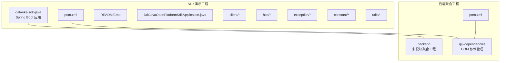
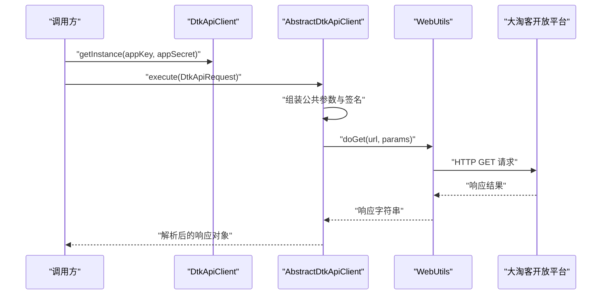
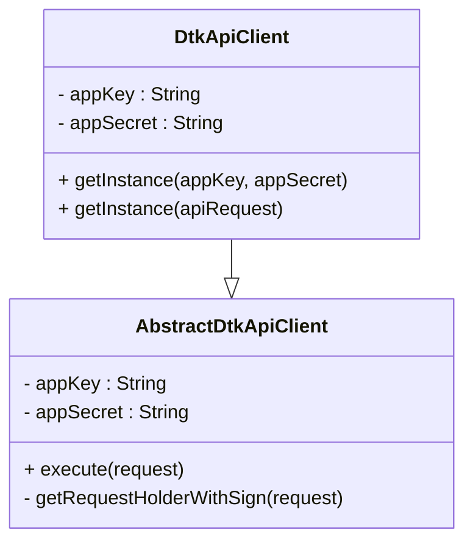
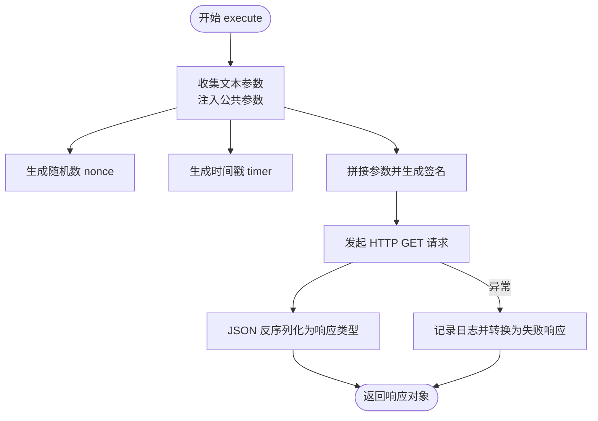
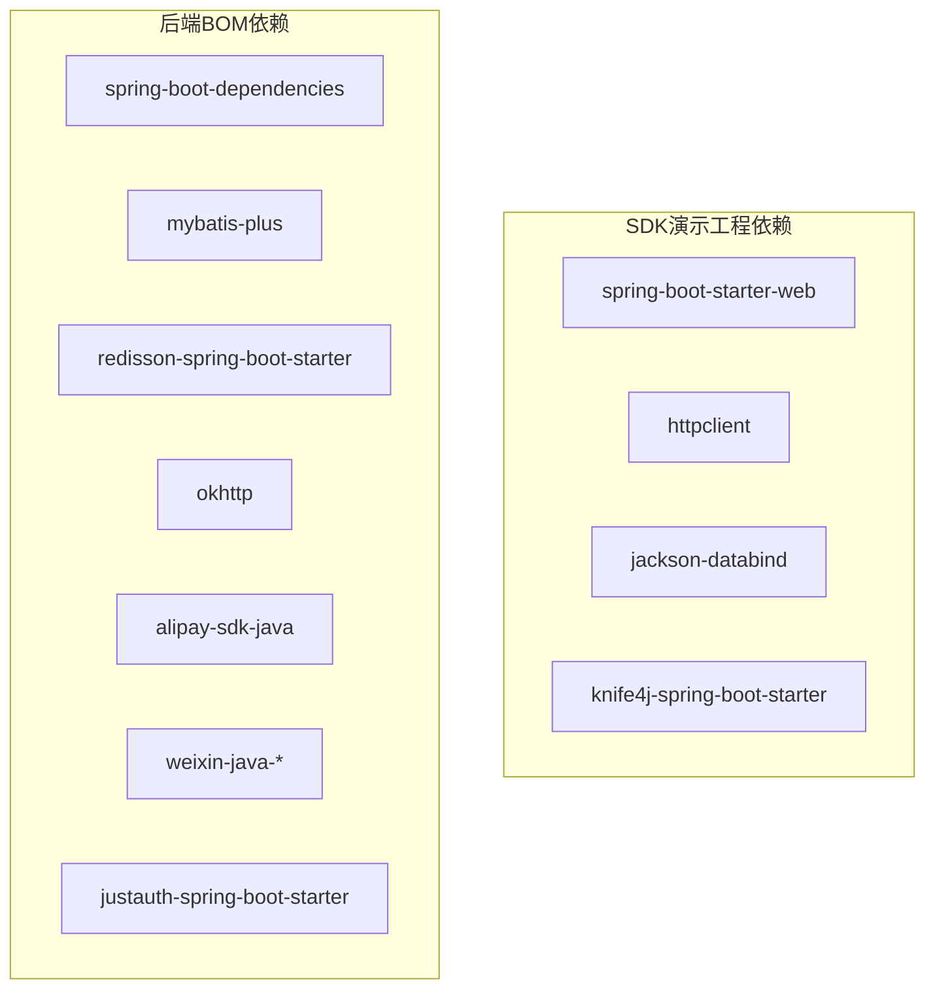

# SDK集成

<cite>
**本文引用的文件**
- [pom.xml](file://agent_improvement/sdk_demo/dataoke-sdk-java/pom.xml)
- [README.md](file://agent_improvement/sdk_demo/dataoke-sdk-java/README.md)
- [DtkJavaOpenPlatformSdkApplication.java](file://agent_improvement/sdk_demo/dataoke-sdk-java/src/main/java/com/dtk/api/DtkJavaOpenPlatformSdkApplication.java)
- [DtkApiClient.java](file://agent_improvement/sdk_demo/dataoke-sdk-java/src/main/java/com/dtk/api/client/DtkApiClient.java)
- [AbstractDtkApiClient.java](file://agent_improvement/sdk_demo/dataoke-sdk-java/src/main/java/com/dtk/api/client/AbstractDtkApiClient.java)
- [DtkApiConstant.java](file://agent_improvement/sdk_demo/dataoke-sdk-java/src/main/java/com/dtk/api/constant/DtkApiConstant.java)
- [WebUtils.java](file://agent_improvement/sdk_demo/dataoke-sdk-java/src/main/java/com/dtk/api/http/WebUtils.java)
- [Assert.java](file://agent_improvement/sdk_demo/dataoke-sdk-java/src/main/java/com/dtk/api/utils/Assert.java)
- [DtkApiException.java](file://agent_improvement/sdk_demo/dataoke-sdk-java/src/main/java/com/dtk/api/exception/DtkApiException.java)
- [pom.xml](file://backend/qiji-dependencies/pom.xml)
- [pom.xml](file://backend/pom.xml)
</cite>

## 目录
1. [简介](#简介)
2. [项目结构](#项目结构)
3. [核心组件](#核心组件)
4. [架构总览](#架构总览)
5. [详细组件分析](#详细组件分析)
6. [依赖分析](#依赖分析)
7. [性能考量](#性能考量)
8. [故障排查指南](#故障排查指南)
9. [结论](#结论)
10. [附录](#附录)

## 简介
本指南面向AgenticCPS的SDK集成场景，围绕“SDK选择标准、版本管理策略、依赖配置管理、接口封装方法、异常处理机制”五个维度，结合仓库中的大淘客Java SDK与后端聚合工程，给出可落地的实施建议与最佳实践。读者无需深入编程背景，也能理解并应用这些方法论。

## 项目结构
AgenticCPS包含两部分与SDK集成密切相关的工程：
- SDK演示工程：基于Spring Boot的独立模块，提供大淘客开放平台Java SDK的完整实现与示例。
- 后端聚合工程：通过BOM统一管理各模块依赖，为SDK在后端系统中的集成提供统一的版本与治理能力。

图示来源
- [pom.xml:1-124](file://agent_improvement/sdk_demo/dataoke-sdk-java/pom.xml#L1-L124)
- [pom.xml:1-176](file://backend/pom.xml#L1-L176)
- [pom.xml:1-721](file://backend/qiji-dependencies/pom.xml#L1-L721)

章节来源
- [pom.xml:1-124](file://agent_improvement/sdk_demo/dataoke-sdk-java/pom.xml#L1-L124)
- [README.md:1-18](file://agent_improvement/sdk_demo/dataoke-sdk-java/README.md#L1-L18)
- [pom.xml:1-176](file://backend/pom.xml#L1-L176)
- [pom.xml:1-721](file://backend/qiji-dependencies/pom.xml#L1-L721)

## 核心组件
- SDK客户端层：负责请求组装、签名、网络调用与响应解析。
- 常量与配置：集中管理域名、版本、字符集、公共参数键等。
- 网络工具：封装HTTP(S)请求、SSL校验、Keep-Alive优化、编码解码等。
- 断言与异常：统一参数校验与异常抛出，保证调用方契约清晰。
- Spring Boot启动入口：提供可运行的SDK示例应用。

章节来源
- [DtkApiClient.java:1-41](file://agent_improvement/sdk_demo/dataoke-sdk-java/src/main/java/com/dtk/api/client/DtkApiClient.java#L1-L41)
- [AbstractDtkApiClient.java:1-123](file://agent_improvement/sdk_demo/dataoke-sdk-java/src/main/java/com/dtk/api/client/AbstractDtkApiClient.java#L1-L123)
- [DtkApiConstant.java:1-49](file://agent_improvement/sdk_demo/dataoke-sdk-java/src/main/java/com/dtk/api/constant/DtkApiConstant.java#L1-L49)
- [WebUtils.java:1-485](file://agent_improvement/sdk_demo/dataoke-sdk-java/src/main/java/com/dtk/api/http/WebUtils.java#L1-L485)
- [Assert.java:1-44](file://agent_improvement/sdk_demo/dataoke-sdk-java/src/main/java/com/dtk/api/utils/Assert.java#L1-L44)
- [DtkApiException.java:1-29](file://agent_improvement/sdk_demo/dataoke-sdk-java/src/main/java/com/dtk/api/exception/DtkApiException.java#L1-L29)
- [DtkJavaOpenPlatformSdkApplication.java:1-14](file://agent_improvement/sdk_demo/dataoke-sdk-java/src/main/java/com/dtk/api/DtkJavaOpenPlatformSdkApplication.java#L1-L14)

## 架构总览
SDK整体采用“客户端抽象 + 请求参数模型 + 网络工具 + 异常与断言”的分层架构，核心流程为：调用方构造请求参数 → 客户端组装签名 → 发起HTTP请求 → 解析响应 → 返回结果或抛出异常。

图示来源
- [DtkApiClient.java:23-39](file://agent_improvement/sdk_demo/dataoke-sdk-java/src/main/java/com/dtk/api/client/DtkApiClient.java#L23-L39)
- [AbstractDtkApiClient.java:44-74](file://agent_improvement/sdk_demo/dataoke-sdk-java/src/main/java/com/dtk/api/client/AbstractDtkApiClient.java#L44-L74)
- [WebUtils.java:125-167](file://agent_improvement/sdk_demo/dataoke-sdk-java/src/main/java/com/dtk/api/http/WebUtils.java#L125-L167)

## 详细组件分析

### SDK客户端与工厂
- 单例客户端：通过双重检查锁定实现线程安全的单例实例，确保全局共享的SDK实例。
- 参数校验：在获取实例时对appKey与appSecret进行非空校验，避免后续调用阶段的空指针风险。

图示来源
- [DtkApiClient.java:12-40](file://agent_improvement/sdk_demo/dataoke-sdk-java/src/main/java/com/dtk/api/client/DtkApiClient.java#L12-L40)
- [AbstractDtkApiClient.java:31-40](file://agent_improvement/sdk_demo/dataoke-sdk-java/src/main/java/com/dtk/api/client/AbstractDtkApiClient.java#L31-L40)

章节来源
- [DtkApiClient.java:1-41](file://agent_improvement/sdk_demo/dataoke-sdk-java/src/main/java/com/dtk/api/client/DtkApiClient.java#L1-L41)
- [AbstractDtkApiClient.java:1-123](file://agent_improvement/sdk_demo/dataoke-sdk-java/src/main/java/com/dtk/api/client/AbstractDtkApiClient.java#L1-L123)

### 请求执行与签名流程
- 参数组装：遍历请求对象字段，收集文本参数，并注入公共参数（appKey、nonce、timer）。
- 签名生成：依据约定规则拼接参数并使用MD5生成签名，写入请求参数。
- 网络调用：通过WebUtils发起HTTP GET请求，捕获异常并转换为统一响应失败结构。

图示来源
- [AbstractDtkApiClient.java:82-112](file://agent_improvement/sdk_demo/dataoke-sdk-java/src/main/java/com/dtk/api/client/AbstractDtkApiClient.java#L82-L112)
- [WebUtils.java:125-167](file://agent_improvement/sdk_demo/dataoke-sdk-java/src/main/java/com/dtk/api/http/WebUtils.java#L125-L167)

章节来源
- [AbstractDtkApiClient.java:44-112](file://agent_improvement/sdk_demo/dataoke-sdk-java/src/main/java/com/dtk/api/client/AbstractDtkApiClient.java#L44-L112)
- [WebUtils.java:1-485](file://agent_improvement/sdk_demo/dataoke-sdk-java/src/main/java/com/dtk/api/http/WebUtils.java#L1-L485)

### 常量与配置
- 域名与版本：集中维护生产域名、SDK版本号、默认字符集与时区等常量，便于统一升级与替换。
- 公共参数键：统一管理签名、随机串、时间戳、appKey等公共参数键，降低耦合度。

章节来源
- [DtkApiConstant.java:1-49](file://agent_improvement/sdk_demo/dataoke-sdk-java/src/main/java/com/dtk/api/constant/DtkApiConstant.java#L1-L49)

### 网络工具与SSL优化
- HTTP(S)封装：支持GET请求、参数编码、响应读取、字符集推断、错误流处理。
- SSL校验：提供可选的SSL服务端证书校验开关，以及Keep-Alive超时设置（通过反射优化底层连接复用）。
- 代理支持：可配置HTTP代理，便于内网或测试环境访问。

章节来源
- [WebUtils.java:1-485](file://agent_improvement/sdk_demo/dataoke-sdk-java/src/main/java/com/dtk/api/http/WebUtils.java#L1-L485)

### 断言与异常
- 断言工具：提供非空、布尔条件、字符串空白等断言方法，统一触发业务异常。
- 自定义异常：封装业务异常枚举，支持异常栈抑制以减少开销。

章节来源
- [Assert.java:1-44](file://agent_improvement/sdk_demo/dataoke-sdk-java/src/main/java/com/dtk/api/utils/Assert.java#L1-L44)
- [DtkApiException.java:1-29](file://agent_improvement/sdk_demo/dataoke-sdk-java/src/main/java/com/dtk/api/exception/DtkApiException.java#L1-L29)

## 依赖分析
- SDK演示工程依赖Spring Boot Starter Web、HTTP组件、Jackson、Knife4j等，体现其作为独立SDK示例的轻量特性。
- 后端聚合工程通过qiji-dependencies提供统一的BOM版本管理，覆盖Spring Boot、MyBatis、Redisson、OkHttp、JustAuth、Alipay SDK、Weixin SDK等生态组件，形成统一的依赖治理基线。

图示来源
- [pom.xml:26-83](file://agent_improvement/sdk_demo/dataoke-sdk-java/pom.xml#L26-L83)
- [pom.xml:84-687](file://backend/qiji-dependencies/pom.xml#L84-L687)

章节来源
- [pom.xml:1-124](file://agent_improvement/sdk_demo/dataoke-sdk-java/pom.xml#L1-L124)
- [pom.xml:1-176](file://backend/pom.xml#L1-L176)
- [pom.xml:1-721](file://backend/qiji-dependencies/pom.xml#L1-L721)

## 性能考量
- 连接复用：通过WebUtils设置Keep-Alive超时，减少TCP握手与TLS建连开销，提升批量请求吞吐。
- 字符集与编码：统一UTF-8字符集，避免跨域或第三方接口字符集差异导致的解析错误与重试。
- 异常快速失败：在参数校验阶段尽早失败，减少无效网络调用。
- 日志与可观测：在异常路径记录请求URL、参数与响应摘要，便于定位问题但避免泄露敏感信息。

## 故障排查指南
- 网络异常
  - 症状：HTTP 4xx/5xx、连接超时、证书校验失败。
  - 排查：确认域名与证书状态；必要时临时关闭SSL校验（仅限测试环境）；检查代理配置。
  - 参考：WebUtils的SSL校验开关与错误流处理。
- 业务异常
  - 症状：返回统一失败结构或抛出自定义异常。
  - 排查：核对appKey/appSecret、签名参数顺序与字符集；检查必填字段注解。
  - 参考：断言工具与异常封装。
- 超时与重试
  - 建议：在调用层增加指数退避重试策略，避免雪崩效应；区分可重试与不可重试错误码。
- 版本与兼容
  - 建议：严格遵循语义化版本；在BOM中锁定SDK版本，避免隐式升级破坏兼容。

章节来源
- [WebUtils.java:48-111](file://agent_improvement/sdk_demo/dataoke-sdk-java/src/main/java/com/dtk/api/http/WebUtils.java#L48-L111)
- [Assert.java:20-42](file://agent_improvement/sdk_demo/dataoke-sdk-java/src/main/java/com/dtk/api/utils/Assert.java#L20-L42)
- [DtkApiException.java:11-28](file://agent_improvement/sdk_demo/dataoke-sdk-java/src/main/java/com/dtk/api/exception/DtkApiException.java#L11-L28)

## 结论
通过将SDK演示工程与后端BOM依赖体系相结合，AgenticCPS可以在保证功能完整性的同时，获得稳定的版本治理与统一的依赖约束。建议在集成时遵循本文提出的“选择标准、版本策略、依赖治理、接口封装、异常处理”五位一体的方法论，以实现可演进、可维护、可监控的SDK集成方案。

## 附录

### SDK选择标准（集成参考）
- 功能完整性：接口覆盖度、参数模型完备性、示例与测试用例。
- 稳定性评估：发布频次、变更日志、回归测试覆盖率。
- 社区活跃度：Issue响应、PR合并速度、文档更新频率。
- 文档质量：接口文档、示例代码、常见问题解答。
- 许可证兼容性：与项目许可证一致性，避免衍生法律风险。

### 版本管理策略（集成参考）
- 版本号规范：采用语义化版本，明确主/次/补丁号含义。
- 升级路径规划：制定灰度发布与回滚预案，优先在测试环境验证。
- 向后兼容性：严格遵守兼容性承诺，避免破坏性变更。
- 废弃API处理：提前标注废弃并提供迁移指引，保留过渡期。

### 依赖配置管理（集成参考）
- Maven/Gradle配置：统一在BOM中声明版本，模块间共享依赖。
- 依赖冲突解决：利用Maven/Gradle的依赖解析与排除机制，优先选择高版本。
- 传递依赖管理：限制传递依赖深度，避免引入不必要的第三方库。
- 安全漏洞扫描：定期扫描依赖漏洞，及时升级至修复版本。

### SDK接口封装方法（设计模式参考）
- 适配器模式：对外暴露统一接口，内部适配不同SDK实现。
- 装饰器模式：在不改变原接口的前提下，增强日志、鉴权、重试等功能。
- 代理模式：集中处理网络异常、超时与重试，屏蔽SDK细节。

### 异常处理机制（集成参考）
- 网络异常：区分DNS解析、连接、读取超时，分别采取不同重试与降级策略。
- 业务异常：解析第三方返回的错误码与消息，映射为统一异常类型。
- 超时异常：设置合理超时阈值，结合熔断与隔离策略。
- 重试异常：仅对幂等操作进行有限次数的指数退避重试，避免放大故障。