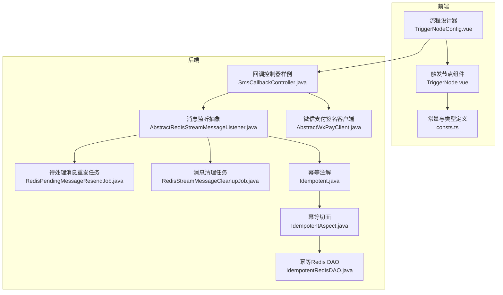
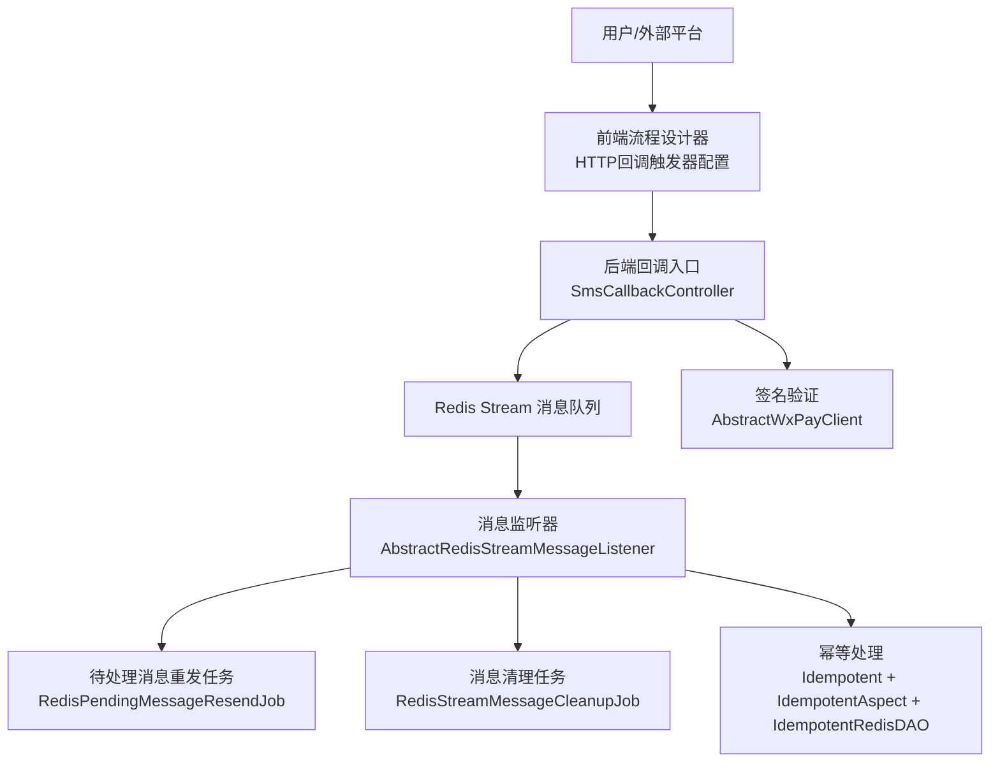
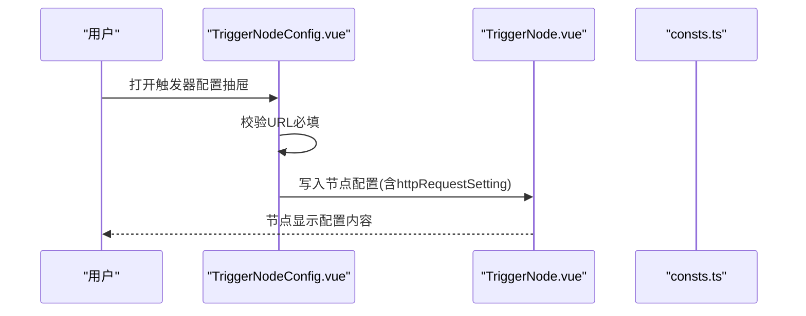
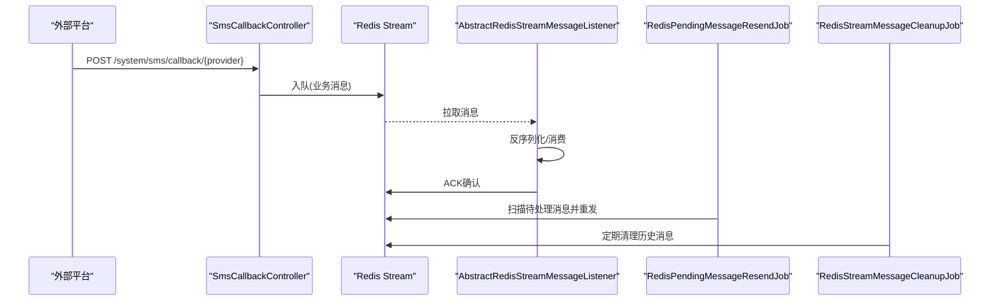
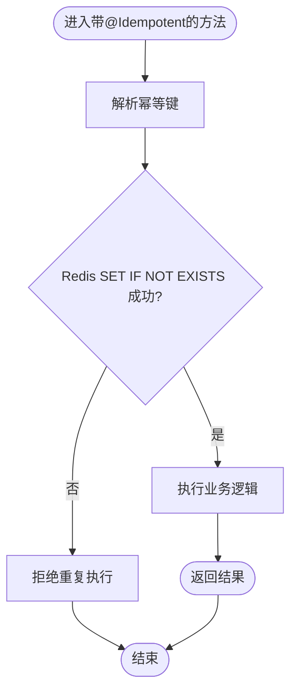
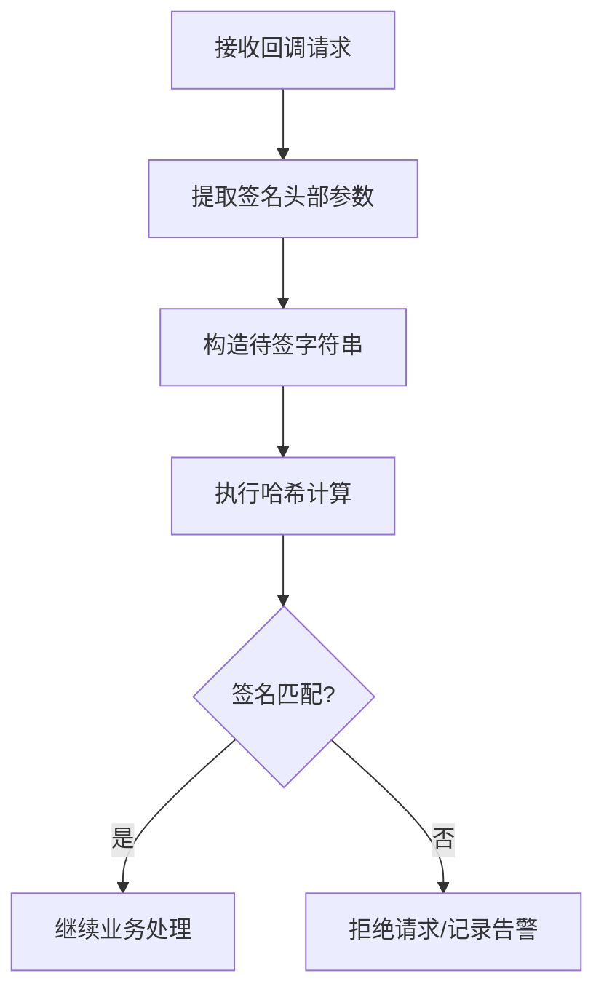
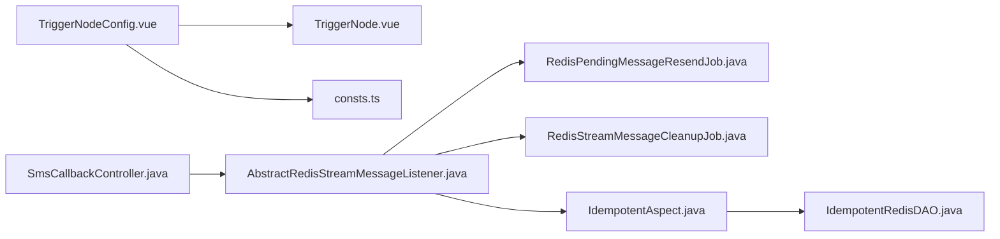

# Webhook集成

<cite>
**本文引用的文件**
- [SmsCallbackController.java](file://backend/qiji-module-system/src/main/java/com/qiji/cps/module/system/controller/admin/sms/SmsCallbackController.java)
- [TriggerNodeConfig.vue](file://frontend/admin-vue3/src/components/SimpleProcessDesignerV2/src/nodes-config/TriggerNodeConfig.vue)
- [TriggerNode.vue](file://frontend/admin-vue3/src/components/SimpleProcessDesignerV2/src/nodes/TriggerNode.vue)
- [consts.ts](file://frontend/admin-vue3/src/components/SimpleProcessDesignerV2/src/consts.ts)
- [AbstractRedisStreamMessageListener.java](file://backend/qiji-framework/qiji-spring-boot-starter-mq/src/main/java/com/qiji/cps/framework/mq/redis/core/stream/AbstractRedisStreamMessageListener.java)
- [RedisPendingMessageResendJob.java](file://backend/qiji-framework/qiji-spring-boot-starter-mq/src/main/java/com/qiji/cps/framework/mq/redis/core/job/RedisPendingMessageResendJob.java)
- [RedisStreamMessageCleanupJob.java](file://backend/qiji-framework/qiji-spring-boot-starter-mq/src/main/java/com/qiji/cps/framework/mq/redis/core/job/RedisStreamMessageCleanupJob.java)
- [Idempotent.java](file://backend/qiji-framework/qiji-spring-boot-starter-protection/src/main/java/com/qiji/cps/framework/idempotent/core/annotation/Idempotent.java)
- [IdempotentAspect.java](file://backend/qiji-framework/qiji-spring-boot-starter-protection/src/main/java/com/qiji/cps/framework/idempotent/core/aop/IdempotentAspect.java)
- [IdempotentRedisDAO.java](file://backend/qiji-framework/qiji-spring-boot-starter-protection/src/main/java/com/qiji/cps/framework/idempotent/core/redis/IdempotentRedisDAO.java)
- [AbstractWxPayClient.java](file://backend/qiji-module-pay/src/main/java/com/qiji/cps/module/pay/framework/pay/core/client/impl/weixin/AbstractWxPayClient.java)
- [validator.ts](file://frontend/admin-uniapp/src/utils/validator.ts)
</cite>

## 目录
1. [简介](#简介)
2. [项目结构](#项目结构)
3. [核心组件](#核心组件)
4. [架构总览](#架构总览)
5. [详细组件分析](#详细组件分析)
6. [依赖关系分析](#依赖关系分析)
7. [性能考量](#性能考量)
8. [故障排查指南](#故障排查指南)
9. [结论](#结论)
10. [附录](#附录)

## 简介
本技术文档面向AgenticCPS的Webhook集成功能，围绕“回调地址配置、签名验证、消息处理流程、状态跟踪与治理、测试验证”五个维度，给出可落地的实现指南。文档既关注前端流程设计器中的“HTTP回调触发器”配置能力，也覆盖后端基于Redis Stream的异步消息处理、幂等性保障、重试与死信治理等工程实践，并提供可操作的测试建议。

## 项目结构
AgenticCPS采用前后端分离架构，Webhook相关能力主要体现在：
- 前端流程设计器：提供“HTTP回调触发器”的可视化配置界面，支持URL、Header、Body、响应映射等参数。
- 后端系统模块：提供短信回调等Webhook样例，展示回调入口、请求体解析与业务处理。
- 消息中间件与保护层：基于Redis Stream的异步消息处理、重试与清理任务，以及幂等性注解与Redis存储。

**图表来源**
- [TriggerNodeConfig.vue:1-532](file://frontend/admin-vue3/src/components/SimpleProcessDesignerV2/src/nodes-config/TriggerNodeConfig.vue#L1-L532)
- [TriggerNode.vue:36-78](file://frontend/admin-vue3/src/components/SimpleProcessDesignerV2/src/nodes/TriggerNode.vue#L36-L78)
- [consts.ts:747-819](file://frontend/admin-vue3/src/components/SimpleProcessDesignerV2/src/consts.ts#L747-L819)
- [SmsCallbackController.java:1-65](file://backend/qiji-module-system/src/main/java/com/qiji/cps/module/system/controller/admin/sms/SmsCallbackController.java#L1-L65)
- [AbstractRedisStreamMessageListener.java:40-77](file://backend/qiji-framework/qiji-spring-boot-starter-mq/src/main/java/com/qiji/cps/framework/mq/redis/core/stream/AbstractRedisStreamMessageListener.java#L40-L77)
- [RedisPendingMessageResendJob.java:1-99](file://backend/qiji-framework/qiji-spring-boot-starter-mq/src/main/java/com/qiji/cps/framework/mq/redis/core/job/RedisPendingMessageResendJob.java#L1-L99)
- [RedisStreamMessageCleanupJob.java:1-41](file://backend/qiji-framework/qiji-spring-boot-starter-mq/src/main/java/com/qiji/cps/framework/mq/redis/core/job/RedisStreamMessageCleanupJob.java#L1-L41)
- [Idempotent.java:40-63](file://backend/qiji-framework/qiji-spring-boot-starter-protection/src/main/java/com/qiji/cps/framework/idempotent/core/annotation/Idempotent.java#L40-L63)
- [IdempotentAspect.java:1-37](file://backend/qiji-framework/qiji-spring-boot-starter-protection/src/main/java/com/qiji/cps/framework/idempotent/core/aop/IdempotentAspect.java#L1-L37)
- [IdempotentRedisDAO.java:1-41](file://backend/qiji-framework/qiji-spring-boot-starter-protection/src/main/java/com/qiji/cps/framework/idempotent/core/redis/IdempotentRedisDAO.java#L1-L41)
- [AbstractWxPayClient.java:543-575](file://backend/qiji-module-pay/src/main/java/com/qiji/cps/module/pay/framework/pay/core/client/impl/weixin/AbstractWxPayClient.java#L543-L575)

**章节来源**
- [TriggerNodeConfig.vue:1-532](file://frontend/admin-vue3/src/components/SimpleProcessDesignerV2/src/nodes-config/TriggerNodeConfig.vue#L1-L532)
- [TriggerNode.vue:36-78](file://frontend/admin-vue3/src/components/SimpleProcessDesignerV2/src/nodes/TriggerNode.vue#L36-L78)
- [consts.ts:747-819](file://frontend/admin-vue3/src/components/SimpleProcessDesignerV2/src/consts.ts#L747-L819)
- [SmsCallbackController.java:1-65](file://backend/qiji-module-system/src/main/java/com/qiji/cps/module/system/controller/admin/sms/SmsCallbackController.java#L1-L65)

## 核心组件
- 前端触发器配置：提供“HTTP回调触发器”的URL、Header、Body、响应映射等配置项，便于在流程中定义回调目标。
- 后端回调入口：以短信回调为例，展示如何接收外部平台推送的回调请求并进行业务处理。
- 消息中间件：基于Redis Stream的异步消息处理，包含消费者ACK、待处理消息重发、消息清理等机制。
- 幂等保护：通过注解与切面实现幂等键生成、Redis去重与异常时的键清理策略。
- 签名验证：参考微信支付签名客户端，提取头部签名参数并进行校验，作为Webhook安全防护的范式。

**章节来源**
- [TriggerNodeConfig.vue:28-37](file://frontend/admin-vue3/src/components/SimpleProcessDesignerV2/src/nodes-config/TriggerNodeConfig.vue#L28-L37)
- [SmsCallbackController.java:26-63](file://backend/qiji-module-system/src/main/java/com/qiji/cps/module/system/controller/admin/sms/SmsCallbackController.java#L26-L63)
- [AbstractRedisStreamMessageListener.java:62-77](file://backend/qiji-framework/qiji-spring-boot-starter-mq/src/main/java/com/qiji/cps/framework/mq/redis/core/stream/AbstractRedisStreamMessageListener.java#L62-L77)
- [Idempotent.java:40-63](file://backend/qiji-framework/qiji-spring-boot-starter-protection/src/main/java/com/qiji/cps/framework/idempotent/core/annotation/Idempotent.java#L40-L63)
- [AbstractWxPayClient.java:543-575](file://backend/qiji-module-pay/src/main/java/com/qiji/cps/module/pay/framework/pay/core/client/impl/weixin/AbstractWxPayClient.java#L543-L575)

## 架构总览
下图展示了从流程设计器到后端回调处理、消息中间件与幂等治理的整体架构。

**图表来源**
- [TriggerNodeConfig.vue:38-44](file://frontend/admin-vue3/src/components/SimpleProcessDesignerV2/src/nodes-config/TriggerNodeConfig.vue#L38-L44)
- [SmsCallbackController.java:26-63](file://backend/qiji-module-system/src/main/java/com/qiji/cps/module/system/controller/admin/sms/SmsCallbackController.java#L26-L63)
- [AbstractRedisStreamMessageListener.java:62-77](file://backend/qiji-framework/qiji-spring-boot-starter-mq/src/main/java/com/qiji/cps/framework/mq/redis/core/stream/AbstractRedisStreamMessageListener.java#L62-L77)
- [RedisPendingMessageResendJob.java:43-56](file://backend/qiji-framework/qiji-spring-boot-starter-mq/src/main/java/com/qiji/cps/framework/mq/redis/core/job/RedisPendingMessageResendJob.java#L43-L56)
- [RedisStreamMessageCleanupJob.java:40-41](file://backend/qiji-framework/qiji-spring-boot-starter-mq/src/main/java/com/qiji/cps/framework/mq/redis/core/job/RedisStreamMessageCleanupJob.java#L40-L41)
- [IdempotentAspect.java:23-37](file://backend/qiji-framework/qiji-spring-boot-starter-protection/src/main/java/com/qiji/cps/framework/idempotent/core/aop/IdempotentAspect.java#L23-L37)
- [IdempotentRedisDAO.java:13-41](file://backend/qiji-framework/qiji-spring-boot-starter-protection/src/main/java/com/qiji/cps/framework/idempotent/core/redis/IdempotentRedisDAO.java#L13-L41)
- [AbstractWxPayClient.java:543-575](file://backend/qiji-module-pay/src/main/java/com/qiji/cps/module/pay/framework/pay/core/client/impl/weixin/AbstractWxPayClient.java#L543-L575)

## 详细组件分析

### 前端：HTTP回调触发器配置
- 配置项：URL、Header、Body、响应映射等，用于定义回调目标与参数。
- 校验规则：表单对URL必填进行校验，确保回调地址有效。
- 交互流程：在流程设计器中选择“HTTP回调”，打开抽屉配置面板，填写完成后保存到节点配置。

**图表来源**
- [TriggerNodeConfig.vue:279-282](file://frontend/admin-vue3/src/components/SimpleProcessDesignerV2/src/nodes-config/TriggerNodeConfig.vue#L279-L282)
- [TriggerNodeConfig.vue:442-468](file://frontend/admin-vue3/src/components/SimpleProcessDesignerV2/src/nodes-config/TriggerNodeConfig.vue#L442-L468)
- [TriggerNode.vue:50-51](file://frontend/admin-vue3/src/components/SimpleProcessDesignerV2/src/nodes/TriggerNode.vue#L50-L51)
- [consts.ts:751-791](file://frontend/admin-vue3/src/components/SimpleProcessDesignerV2/src/consts.ts#L751-L791)

**章节来源**
- [TriggerNodeConfig.vue:279-282](file://frontend/admin-vue3/src/components/SimpleProcessDesignerV2/src/nodes-config/TriggerNodeConfig.vue#L279-L282)
- [TriggerNodeConfig.vue:442-468](file://frontend/admin-vue3/src/components/SimpleProcessDesignerV2/src/nodes-config/TriggerNodeConfig.vue#L442-L468)
- [TriggerNode.vue:50-51](file://frontend/admin-vue3/src/components/SimpleProcessDesignerV2/src/nodes/TriggerNode.vue#L50-L51)
- [consts.ts:751-791](file://frontend/admin-vue3/src/components/SimpleProcessDesignerV2/src/consts.ts#L751-L791)

### 后端：回调入口与消息处理
- 回调入口：以短信回调为例，提供多云厂商的回调端点，统一接收回调请求体并调用业务服务。
- 消息监听：基于Redis Stream的消息监听器负责反序列化消息、调用消费逻辑、ACK确认。
- 重试与清理：定时任务扫描待处理消息并重发，周期性清理历史消息，避免内存膨胀。

**图表来源**
- [SmsCallbackController.java:26-63](file://backend/qiji-module-system/src/main/java/com/qiji/cps/module/system/controller/admin/sms/SmsCallbackController.java#L26-L63)
- [AbstractRedisStreamMessageListener.java:62-77](file://backend/qiji-framework/qiji-spring-boot-starter-mq/src/main/java/com/qiji/cps/framework/mq/redis/core/stream/AbstractRedisStreamMessageListener.java#L62-L77)
- [RedisPendingMessageResendJob.java:43-56](file://backend/qiji-framework/qiji-spring-boot-starter-mq/src/main/java/com/qiji/cps/framework/mq/redis/core/job/RedisPendingMessageResendJob.java#L43-L56)
- [RedisStreamMessageCleanupJob.java:40-41](file://backend/qiji-framework/qiji-spring-boot-starter-mq/src/main/java/com/qiji/cps/framework/mq/redis/core/job/RedisStreamMessageCleanupJob.java#L40-L41)

**章节来源**
- [SmsCallbackController.java:26-63](file://backend/qiji-module-system/src/main/java/com/qiji/cps/module/system/controller/admin/sms/SmsCallbackController.java#L26-L63)
- [AbstractRedisStreamMessageListener.java:62-77](file://backend/qiji-framework/qiji-spring-boot-starter-mq/src/main/java/com/qiji/cps/framework/mq/redis/core/stream/AbstractRedisStreamMessageListener.java#L62-L77)
- [RedisPendingMessageResendJob.java:43-56](file://backend/qiji-framework/qiji-spring-boot-starter-mq/src/main/java/com/qiji/cps/framework/mq/redis/core/job/RedisPendingMessageResendJob.java#L43-L56)
- [RedisStreamMessageCleanupJob.java:40-41](file://backend/qiji-framework/qiji-spring-boot-starter-mq/src/main/java/com/qiji/cps/framework/mq/redis/core/job/RedisStreamMessageCleanupJob.java#L40-L41)

### 幂等性保障
- 注解与切面：通过@Idempotent注解声明幂等范围，切面在方法前后进行键生成、去重与异常时的键清理。
- Redis存储：幂等键采用统一格式存入Redis，配合TTL控制生命周期。

**图表来源**
- [Idempotent.java:40-63](file://backend/qiji-framework/qiji-spring-boot-starter-protection/src/main/java/com/qiji/cps/framework/idempotent/core/annotation/Idempotent.java#L40-L63)
- [IdempotentAspect.java:23-37](file://backend/qiji-framework/qiji-spring-boot-starter-protection/src/main/java/com/qiji/cps/framework/idempotent/core/aop/IdempotentAspect.java#L23-L37)
- [IdempotentRedisDAO.java:27-30](file://backend/qiji-framework/qiji-spring-boot-starter-protection/src/main/java/com/qiji/cps/framework/idempotent/core/redis/IdempotentRedisDAO.java#L27-L30)

**章节来源**
- [Idempotent.java:40-63](file://backend/qiji-framework/qiji-spring-boot-starter-protection/src/main/java/com/qiji/cps/framework/idempotent/core/annotation/Idempotent.java#L40-L63)
- [IdempotentAspect.java:23-37](file://backend/qiji-framework/qiji-spring-boot-starter-protection/src/main/java/com/qiji/cps/framework/idempotent/core/aop/IdempotentAspect.java#L23-L37)
- [IdempotentRedisDAO.java:13-41](file://backend/qiji-framework/qiji-spring-boot-starter-protection/src/main/java/com/qiji/cps/framework/idempotent/core/redis/IdempotentRedisDAO.java#L13-L41)

### 签名验证机制
- 头部参数提取：参考微信支付签名客户端，从请求头中提取签名、随机串、时间戳、序列号等关键字段。
- 校验流程：基于约定的哈希算法与签名生成规则，对请求体与头部参数进行联合校验，确保来源可信与数据未被篡改。

**图表来源**
- [AbstractWxPayClient.java:543-575](file://backend/qiji-module-pay/src/main/java/com/qiji/cps/module/pay/framework/pay/core/client/impl/weixin/AbstractWxPayClient.java#L543-L575)

**章节来源**
- [AbstractWxPayClient.java:543-575](file://backend/qiji-module-pay/src/main/java/com/qiji/cps/module/pay/framework/pay/core/client/impl/weixin/AbstractWxPayClient.java#L543-L575)

## 依赖关系分析
- 前端组件间依赖：TriggerNodeConfig.vue依赖consts.ts中的类型定义；TriggerNode.vue持有配置抽屉并联动保存。
- 后端组件间依赖：回调控制器依赖业务服务；消息监听器依赖RedisMQTemplate；重试与清理任务依赖RedissonClient与StreamOperations。
- 幂等保护：IdempotentAspect依赖多个KeyResolver实现与IdempotentRedisDAO。

**图表来源**
- [TriggerNodeConfig.vue:1-532](file://frontend/admin-vue3/src/components/SimpleProcessDesignerV2/src/nodes-config/TriggerNodeConfig.vue#L1-L532)
- [TriggerNode.vue:36-78](file://frontend/admin-vue3/src/components/SimpleProcessDesignerV2/src/nodes/TriggerNode.vue#L36-L78)
- [consts.ts:747-819](file://frontend/admin-vue3/src/components/SimpleProcessDesignerV2/src/consts.ts#L747-L819)
- [SmsCallbackController.java:1-65](file://backend/qiji-module-system/src/main/java/com/qiji/cps/module/system/controller/admin/sms/SmsCallbackController.java#L1-L65)
- [AbstractRedisStreamMessageListener.java:40-77](file://backend/qiji-framework/qiji-spring-boot-starter-mq/src/main/java/com/qiji/cps/framework/mq/redis/core/stream/AbstractRedisStreamMessageListener.java#L40-L77)
- [RedisPendingMessageResendJob.java:1-99](file://backend/qiji-framework/qiji-spring-boot-starter-mq/src/main/java/com/qiji/cps/framework/mq/redis/core/job/RedisPendingMessageResendJob.java#L1-L99)
- [RedisStreamMessageCleanupJob.java:1-41](file://backend/qiji-framework/qiji-spring-boot-starter-mq/src/main/java/com/qiji/cps/framework/mq/redis/core/job/RedisStreamMessageCleanupJob.java#L1-L41)
- [IdempotentAspect.java:1-37](file://backend/qiji-framework/qiji-spring-boot-starter-protection/src/main/java/com/qiji/cps/framework/idempotent/core/aop/IdempotentAspect.java#L1-L37)
- [IdempotentRedisDAO.java:1-41](file://backend/qiji-framework/qiji-spring-boot-starter-protection/src/main/java/com/qiji/cps/framework/idempotent/core/redis/IdempotentRedisDAO.java#L1-L41)

**章节来源**
- [TriggerNodeConfig.vue:1-532](file://frontend/admin-vue3/src/components/SimpleProcessDesignerV2/src/nodes-config/TriggerNodeConfig.vue#L1-L532)
- [TriggerNode.vue:36-78](file://frontend/admin-vue3/src/components/SimpleProcessDesignerV2/src/nodes/TriggerNode.vue#L36-L78)
- [consts.ts:747-819](file://frontend/admin-vue3/src/components/SimpleProcessDesignerV2/src/consts.ts#L747-L819)
- [SmsCallbackController.java:1-65](file://backend/qiji-module-system/src/main/java/com/qiji/cps/module/system/controller/admin/sms/SmsCallbackController.java#L1-L65)
- [AbstractRedisStreamMessageListener.java:40-77](file://backend/qiji-framework/qiji-spring-boot-starter-mq/src/main/java/com/qiji/cps/framework/mq/redis/core/stream/AbstractRedisStreamMessageListener.java#L40-L77)
- [RedisPendingMessageResendJob.java:1-99](file://backend/qiji-framework/qiji-spring-boot-starter-mq/src/main/java/com/qiji/cps/framework/mq/redis/core/job/RedisPendingMessageResendJob.java#L1-L99)
- [RedisStreamMessageCleanupJob.java:1-41](file://backend/qiji-framework/qiji-spring-boot-starter-mq/src/main/java/com/qiji/cps/framework/mq/redis/core/job/RedisStreamMessageCleanupJob.java#L1-L41)
- [IdempotentAspect.java:1-37](file://backend/qiji-framework/qiji-spring-boot-starter-protection/src/main/java/com/qiji/cps/framework/idempotent/core/aop/IdempotentAspect.java#L1-L37)
- [IdempotentRedisDAO.java:1-41](file://backend/qiji-framework/qiji-spring-boot-starter-protection/src/main/java/com/qiji/cps/framework/idempotent/core/redis/IdempotentRedisDAO.java#L1-L41)

## 性能考量
- 消息吞吐：Redis Stream具备高吞吐特性，适合异步回调场景；应合理设置分组与消费者数量，避免单点瓶颈。
- 内存控制：通过消息清理任务限制保留消息数量，防止长期运行导致内存占用过高。
- 重试策略：待处理消息重发任务按固定周期扫描并重发，避免因消费者崩溃导致消息堆积；建议结合指数退避与死信队列进一步优化。
- 幂等成本：幂等键存储在Redis中，注意键数量与TTL设置，避免热点Key与过期风暴。

[本节为通用指导，无需列出具体文件来源]

## 故障排查指南
- 回调地址无效：前端表单对URL进行必填校验，若出现404/500，请检查URL格式与可达性。
- 签名失败：核对请求头中的签名参数是否齐全，哈希算法与签名生成规则是否一致。
- 消息未消费：检查消费者组与ACK逻辑，确认是否存在异常导致消息未确认；利用待处理消息重发任务进行兜底。
- 幂等冲突：若出现重复执行被阻断，检查幂等键生成规则与Redis键状态，必要时清理异常键。
- 内存增长：确认消息清理任务是否按计划执行，适当调整保留数量阈值。

**章节来源**
- [TriggerNodeConfig.vue:279-282](file://frontend/admin-vue3/src/components/SimpleProcessDesignerV2/src/nodes-config/TriggerNodeConfig.vue#L279-L282)
- [AbstractWxPayClient.java:543-575](file://backend/qiji-module-pay/src/main/java/com/qiji/cps/module/pay/framework/pay/core/client/impl/weixin/AbstractWxPayClient.java#L543-L575)
- [AbstractRedisStreamMessageListener.java:62-77](file://backend/qiji-framework/qiji-spring-boot-starter-mq/src/main/java/com/qiji/cps/framework/mq/redis/core/stream/AbstractRedisStreamMessageListener.java#L62-L77)
- [RedisPendingMessageResendJob.java:43-56](file://backend/qiji-framework/qiji-spring-boot-starter-mq/src/main/java/com/qiji/cps/framework/mq/redis/core/job/RedisPendingMessageResendJob.java#L43-L56)
- [RedisStreamMessageCleanupJob.java:40-41](file://backend/qiji-framework/qiji-spring-boot-starter-mq/src/main/java/com/qiji/cps/framework/mq/redis/core/job/RedisStreamMessageCleanupJob.java#L40-L41)
- [IdempotentAspect.java:23-37](file://backend/qiji-framework/qiji-spring-boot-starter-protection/src/main/java/com/qiji/cps/framework/idempotent/core/aop/IdempotentAspect.java#L23-L37)
- [IdempotentRedisDAO.java:27-30](file://backend/qiji-framework/qiji-spring-boot-starter-protection/src/main/java/com/qiji/cps/framework/idempotent/core/redis/IdempotentRedisDAO.java#L27-L30)

## 结论
AgenticCPS的Webhook集成以“前端可视化配置 + 后端回调入口 + Redis Stream异步处理 + 幂等与签名验证”为核心路径，既满足了灵活的回调地址配置，又提供了可靠的消息治理与安全防护。结合重试与清理任务，可在高并发场景下保持系统的稳定性与可观测性。

[本节为总结性内容，无需列出具体文件来源]

## 附录

### Webhook回调地址配置要点
- URL格式规范：必须为完整可访问的HTTP/HTTPS地址，建议使用HTTPS以提升安全性。
- 域名白名单：建议在网关或接入层对回调域名进行白名单校验，避免任意域名回调带来的风险。
- IP限制：可结合源IP白名单或安全组策略，限制回调来源IP范围。
- 参数与头部：在前端触发器配置中明确Header与Body参数，确保回调方能正确构造请求。

**章节来源**
- [TriggerNodeConfig.vue:28-37](file://frontend/admin-vue3/src/components/SimpleProcessDesignerV2/src/nodes-config/TriggerNodeConfig.vue#L28-L37)
- [validator.ts:1-58](file://frontend/admin-uniapp/src/utils/validator.ts#L1-L58)

### 签名验证机制实施要点
- 哈希算法：建议采用SHA-256等强哈希算法，确保抗碰撞能力。
- 签名生成：依据“参数排序 + 拼接 + 密钥 + 时间戳 + 随机串”的规则生成签名。
- 时间戳与随机数：校验时间戳窗口（如±5分钟）与随机数唯一性，防范重放攻击。
- 头部参数：从请求头中提取签名、随机串、时间戳、序列号等字段，统一校验。

**章节来源**
- [AbstractWxPayClient.java:543-575](file://backend/qiji-module-pay/src/main/java/com/qiji/cps/module/pay/framework/pay/core/client/impl/weixin/AbstractWxPayClient.java#L543-L575)

### 消息处理流程与可靠性保障
- 异步接收：回调入口统一接收请求体，入队到Redis Stream。
- 消费与ACK：监听器反序列化消息并执行业务逻辑，完成后进行ACK确认。
- 幂等性：通过幂等注解与Redis键去重，避免重复消费。
- 事务与日志：建议在消费逻辑中结合事务与日志，确保一致性与可追溯性。
- 错误重试：利用待处理消息重发任务兜底，必要时引入死信队列。

**章节来源**
- [SmsCallbackController.java:26-63](file://backend/qiji-module-system/src/main/java/com/qiji/cps/module/system/controller/admin/sms/SmsCallbackController.java#L26-L63)
- [AbstractRedisStreamMessageListener.java:62-77](file://backend/qiji-framework/qiji-spring-boot-starter-mq/src/main/java/com/qiji/cps/framework/mq/redis/core/stream/AbstractRedisStreamMessageListener.java#L62-L77)
- [RedisPendingMessageResendJob.java:43-56](file://backend/qiji-framework/qiji-spring-boot-starter-mq/src/main/java/com/qiji/cps/framework/mq/redis/core/job/RedisPendingMessageResendJob.java#L43-L56)
- [RedisStreamMessageCleanupJob.java:40-41](file://backend/qiji-framework/qiji-spring-boot-starter-mq/src/main/java/com/qiji/cps/framework/mq/redis/core/job/RedisStreamMessageCleanupJob.java#L40-L41)
- [Idempotent.java:40-63](file://backend/qiji-framework/qiji-spring-boot-starter-protection/src/main/java/com/qiji/cps/framework/idempotent/core/annotation/Idempotent.java#L40-L63)
- [IdempotentAspect.java:23-37](file://backend/qiji-framework/qiji-spring-boot-starter-protection/src/main/java/com/qiji/cps/framework/idempotent/core/aop/IdempotentAspect.java#L23-L37)
- [IdempotentRedisDAO.java:13-41](file://backend/qiji-framework/qiji-spring-boot-starter-protection/src/main/java/com/qiji/cps/framework/idempotent/core/redis/IdempotentRedisDAO.java#L13-L41)

### 状态跟踪与治理策略
- 回调状态管理：在业务侧维护回调状态与结果，便于查询与重试。
- 超时处理：为回调请求设置合理超时时间，超时后进行重试或标记失败。
- 重试次数控制：结合指数退避策略限制重试次数，避免雪崩效应。
- 死信队列：对多次重试仍失败的消息进入死信队列，人工介入处理。

**章节来源**
- [RedisPendingMessageResendJob.java:26-34](file://backend/qiji-framework/qiji-spring-boot-starter-mq/src/main/java/com/qiji/cps/framework/mq/redis/core/job/RedisPendingMessageResendJob.java#L26-L34)
- [RedisStreamMessageCleanupJob.java:26-31](file://backend/qiji-framework/qiji-spring-boot-starter-mq/src/main/java/com/qiji/cps/framework/mq/redis/core/job/RedisStreamMessageCleanupJob.java#L26-L31)

### Webhook测试方法
- 本地调试：使用本地HTTP客户端或内网穿透工具，将本地服务暴露为HTTPS回调地址进行联调。
- 模拟环境：在沙箱或测试环境中部署回调服务，模拟不同厂商回调格式与签名规则。
- 测试工具：使用Postman或curl构造回调请求，覆盖正常、异常、重放等场景。
- 压测方案：基于JMeter或Locust对回调入口进行压力测试，评估吞吐与延迟；结合Redis Stream与幂等策略观察系统表现。

**章节来源**
- [TriggerNodeConfig.vue:28-37](file://frontend/admin-vue3/src/components/SimpleProcessDesignerV2/src/nodes-config/TriggerNodeConfig.vue#L28-L37)
- [validator.ts:1-58](file://frontend/admin-uniapp/src/utils/validator.ts#L1-L58)