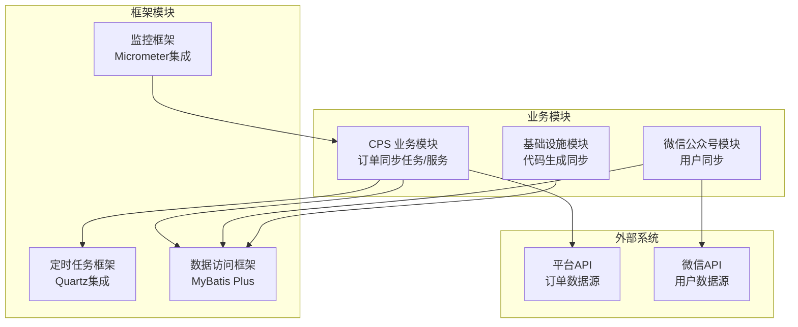
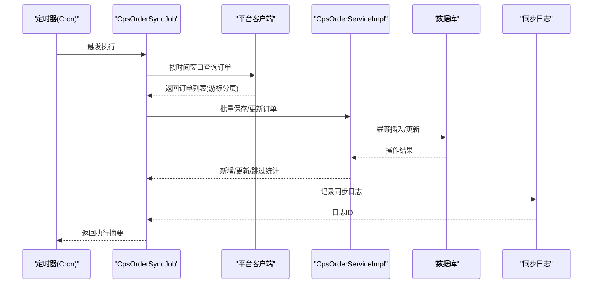
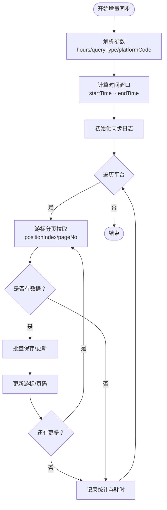
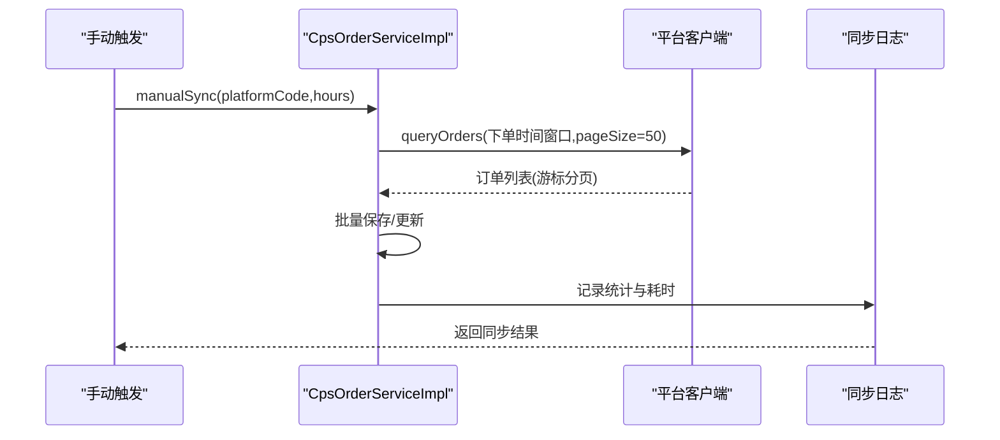
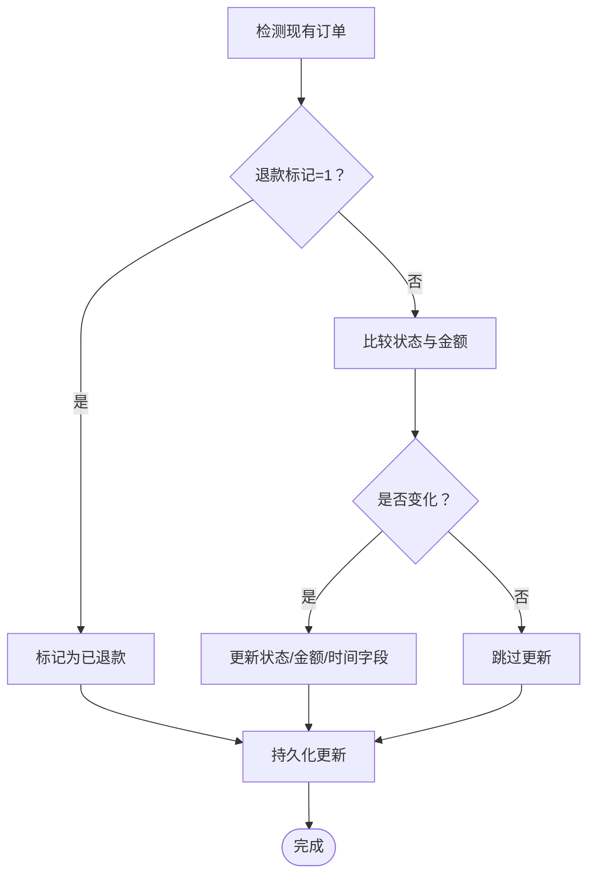
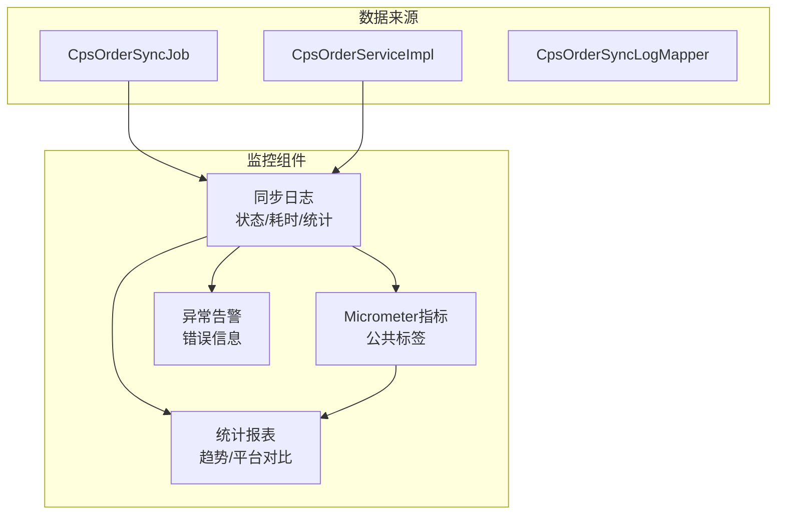
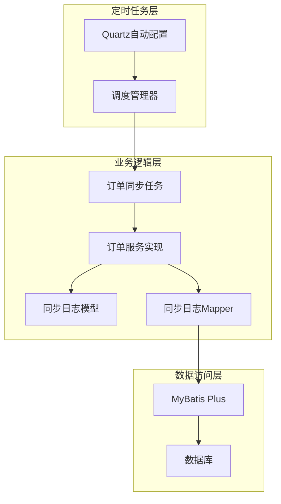

# 数据同步策略

<cite>
**本文档引用的文件**
- [CpsOrderSyncJob.java](file://backend/qiji-module-cps/qiji-module-cps-biz/src/main/java/com/qiji/cps/module/cps/job/CpsOrderSyncJob.java)
- [CpsOrderServiceImpl.java](file://backend/qiji-module-cps/qiji-module-cps-biz/src/main/java/com/qiji/cps/module/cps/service/order/CpsOrderServiceImpl.java)
- [CpsOrderSyncLogDO.java](file://backend/qiji-module-cps/qiji-module-cps-biz/src/main/java/com/qiji/cps/module/cps/dal/dataobject/order/CpsOrderSyncLogDO.java)
- [CpsOrderSyncLogMapper.java](file://backend/qiji-module-cps/qiji-module-cps-biz/src/main/java/com/qiji/cps/module/cps/dal/mysql/order/CpsOrderSyncLogMapper.java)
- [QijiQuartzAutoConfiguration.java](file://backend/qiji-framework/qiji-spring-boot-starter-job/src/main/java/com/qiji/cps/framework/quartz/config/QijiQuartzAutoConfiguration.java)
- [SchedulerManager.java](file://backend/qiji-framework/qiji-spring-boot-starter-job/src/main/java/com/qiji/cps/framework/quartz/core/scheduler/SchedulerManager.java)
- [QijiMetricsAutoConfiguration.java](file://backend/qiji-framework/qiji-spring-boot-starter-monitor/src/main/java/com/qiji/cps/framework/tracer/config/QijiMetricsAutoConfiguration.java)
- [LocalDateTimeUtils.java](file://backend/qiji-framework/qiji-common/src/main/java/com/qiji/cps/framework/common/util/date/LocalDateTimeUtils.java)
- [MpUserServiceImpl.java](file://backend/qiji-module-mp/src/main/java/com/qiji/cps/module/mp/service/user/MpUserServiceImpl.java)
- [CodegenServiceImpl.java](file://backend/qiji-module-infra/src/main/java/com/qiji/cps/module/infra/service/codegen/CodegenServiceImpl.java)
</cite>

## 目录
1. [简介](#简介)
2. [项目结构](#项目结构)
3. [核心组件](#核心组件)
4. [架构概览](#架构概览)
5. [详细组件分析](#详细组件分析)
6. [依赖分析](#依赖分析)
7. [性能考虑](#性能考虑)
8. [故障排除指南](#故障排除指南)
9. [结论](#结论)
10. [附录](#附录)

## 简介
本文件面向AgenticCPS系统的数据同步策略，围绕增量同步与全量同步两大核心能力，系统化阐述以下关键主题：
- 增量同步实现：时间戳对比、ID范围查询、变更检测算法、同步边界控制等增量数据获取策略
- 全量同步机制：数据分页加载、并发处理、进度跟踪、断点续传等大规模数据同步技术
- 冲突处理方案：数据冲突检测、优先级规则、合并策略、人工干预等冲突解决机制
- 数据一致性保障：事务性操作、最终一致性、补偿机制、回滚策略等一致性维护技术
- 同步监控实现：同步状态跟踪、性能指标监控、异常告警、统计报表等完整的监控体系

## 项目结构
AgenticCPS采用模块化分层架构，数据同步相关逻辑主要分布在以下模块：
- cps-biz：业务实现层，包含订单同步任务、订单服务、平台客户端工厂等
- framework：基础框架层，提供定时任务、监控、MyBatis等基础设施
- module-mp：第三方平台对接模块，演示了基于游标的分页同步模式
- module-infra：基础设施模块，包含代码生成同步等场景

**图表来源**
- [CpsOrderSyncJob.java:1-221](file://backend/qiji-module-cps/qiji-module-cps-biz/src/main/java/com/qiji/cps/module/cps/job/CpsOrderSyncJob.java#L1-221)
- [QijiQuartzAutoConfiguration.java:1-30](file://backend/qiji-framework/qiji-spring-boot-starter-job/src/main/java/com/qiji/cps/framework/quartz/config/QijiQuartzAutoConfiguration.java#L1-30)

**章节来源**
- [CpsOrderSyncJob.java:1-221](file://backend/qiji-module-cps/qiji-module-cps-biz/src/main/java/com/qiji/cps/module/cps/job/CpsOrderSyncJob.java#L1-221)
- [QijiQuartzAutoConfiguration.java:1-30](file://backend/qiji-framework/qiji-spring-boot-starter-job/src/main/java/com/qiji/cps/framework/quartz/config/QijiQuartzAutoConfiguration.java#L1-30)

## 核心组件
本节聚焦数据同步策略的关键组件及其职责：

- **CpsOrderSyncJob**：定时同步任务，负责按时间窗口拉取平台订单并进行幂等保存
- **CpsOrderServiceImpl**：订单服务实现，提供订单保存/更新、批量处理、手动同步等功能
- **CpsOrderSyncLogDO/CpsOrderSyncLogMapper**：同步日志数据模型与持久化，用于监控与审计
- **SchedulerManager**：定时任务调度管理器，封装Quartz任务注册与更新
- **MpUserServiceImpl**：微信公众号用户同步示例，展示游标分页与批量处理
- **CodegenServiceImpl**：代码生成同步示例，展示基于字段差异的增量同步

**章节来源**
- [CpsOrderSyncJob.java:1-221](file://backend/qiji-module-cps/qiji-module-cps-biz/src/main/java/com/qiji/cps/module/cps/job/CpsOrderSyncJob.java#L1-221)
- [CpsOrderServiceImpl.java:1-297](file://backend/qiji-module-cps/qiji-module-cps-biz/src/main/java/com/qiji/cps/module/cps/service/order/CpsOrderServiceImpl.java#L1-297)
- [CpsOrderSyncLogDO.java:1-104](file://backend/qiji-module-cps/qiji-module-cps-biz/src/main/java/com/qiji/cps/module/cps/dal/dataobject/order/CpsOrderSyncLogDO.java#L1-104)
- [CpsOrderSyncLogMapper.java:1-29](file://backend/qiji-module-cps/qiji-module-cps-biz/src/main/java/com/qiji/cps/module/cps/dal/mysql/order/CpsOrderSyncLogMapper.java#L1-29)
- [SchedulerManager.java:1-65](file://backend/qiji-framework/qiji-spring-boot-starter-job/src/main/java/com/qiji/cps/framework/quartz/core/scheduler/SchedulerManager.java#L1-65)
- [MpUserServiceImpl.java:103-135](file://backend/qiji-module-mp/src/main/java/com/qiji/cps/module/mp/service/user/MpUserServiceImpl.java#L103-135)
- [CodegenServiceImpl.java:164-184](file://backend/qiji-module-infra/src/main/java/com/qiji/cps/module/infra/service/codegen/CodegenServiceImpl.java#L164-184)

## 架构概览
数据同步整体架构遵循"定时触发 → 平台拉取 → 幂等保存 → 日志记录 → 监控告警"的闭环设计。

**图表来源**
- [CpsOrderSyncJob.java:59-175](file://backend/qiji-module-cps/qiji-module-cps-biz/src/main/java/com/qiji/cps/module/cps/job/CpsOrderSyncJob.java#L59-175)
- [CpsOrderServiceImpl.java:127-142](file://backend/qiji-module-cps/qiji-module-cps-biz/src/main/java/com/qiji/cps/module/cps/service/order/CpsOrderServiceImpl.java#L127-142)

## 详细组件分析

### 增量同步实现
增量同步通过时间窗口与游标分页相结合的方式，确保高效且准确地获取变更数据。

- **时间戳对比与时间窗口**：任务根据参数计算起止时间，支持按下单时间、付款时间、结算时间、更新时间等维度查询
- **游标分页与边界控制**：使用positionIndex作为游标，避免重复拉取；设置最大页数上限防止死循环
- **变更检测算法**：服务层对已有订单进行状态与金额对比，若无变化则跳过，减少无效写入

**图表来源**
- [CpsOrderSyncJob.java:60-218](file://backend/qiji-module-cps/qiji-module-cps-biz/src/main/java/com/qiji/cps/module/cps/job/CpsOrderSyncJob.java#L60-218)
- [CpsOrderServiceImpl.java:74-125](file://backend/qiji-module-cps/qiji-module-cps-biz/src/main/java/com/qiji/cps/module/cps/service/order/CpsOrderServiceImpl.java#L74-125)

**章节来源**
- [CpsOrderSyncJob.java:60-218](file://backend/qiji-module-cps/qiji-module-cps-biz/src/main/java/com/qiji/cps/module/cps/job/CpsOrderSyncJob.java#L60-218)
- [CpsOrderServiceImpl.java:74-125](file://backend/qiji-module-cps/qiji-module-cps-biz/src/main/java/com/qiji/cps/module/cps/service/order/CpsOrderServiceImpl.java#L74-125)

### 全量同步机制
全量同步主要用于补偿性数据修复与历史数据补录，具备完善的进度跟踪与断点续传能力。

- **分页加载与并发处理**：支持固定页大小与游标结合，避免一次性加载大量数据
- **进度跟踪**：通过同步日志记录总条数、新增、更新、跳过数量，便于监控
- **断点续传**：基于positionIndex的游标机制，异常中断后可从上次位置继续

**图表来源**
- [CpsOrderServiceImpl.java:146-197](file://backend/qiji-module-cps/qiji-module-cps-biz/src/main/java/com/qiji/cps/module/cps/service/order/CpsOrderServiceImpl.java#L146-197)

**章节来源**
- [CpsOrderServiceImpl.java:146-197](file://backend/qiji-module-cps/qiji-module-cps-biz/src/main/java/com/qiji/cps/module/cps/service/order/CpsOrderServiceImpl.java#L146-197)

### 冲突处理方案
系统通过多维度的冲突检测与优先级规则，确保数据一致性与可恢复性。

- **数据冲突检测**：基于主键与关键字段的幂等判断，避免重复写入
- **优先级规则**：退款标记具有最高优先级，优先更新为已退款状态
- **合并策略**：仅在必要字段发生变化时进行更新，保持历史完整性
- **人工干预**：异常日志记录与可视化界面，支持人工介入处理

**图表来源**
- [CpsOrderServiceImpl.java:92-125](file://backend/qiji-module-cps/qiji-module-cps-biz/src/main/java/com/qiji/cps/module/cps/service/order/CpsOrderServiceImpl.java#L92-125)

**章节来源**
- [CpsOrderServiceImpl.java:92-125](file://backend/qiji-module-cps/qiji-module-cps-biz/src/main/java/com/qiji/cps/module/cps/service/order/CpsOrderServiceImpl.java#L92-125)

### 数据一致性保障
系统通过事务性操作与补偿机制，确保在高并发场景下的数据一致性。

- **事务性操作**：批量保存/更新在事务中执行，失败自动回滚
- **最终一致性**：通过定时任务与手动同步实现数据收敛
- **补偿机制**：全量补偿同步用于修复异常数据
- **回滚策略**：异常捕获与日志记录，支持重试与人工干预

**章节来源**
- [CpsOrderServiceImpl.java:74-142](file://backend/qiji-module-cps/qiji-module-cps-biz/src/main/java/com/qiji/cps/module/cps/service/order/CpsOrderServiceImpl.java#L74-142)

### 同步监控实现
系统提供完整的监控体系，覆盖同步状态、性能指标、异常告警与统计报表。

- **同步状态跟踪**：通过CpsOrderSyncLogDO记录每次同步的详细信息
- **性能指标监控**：集成Micrometer，统一标签与指标收集
- **异常告警**：错误信息记录与可视化展示
- **统计报表**：按平台与时间维度的统计分析

**图表来源**
- [QijiMetricsAutoConfiguration.java:1-27](file://backend/qiji-framework/qiji-spring-boot-starter-monitor/src/main/java/com/qiji/cps/framework/tracer/config/QijiMetricsAutoConfiguration.java#L1-27)
- [CpsOrderSyncLogDO.java:1-104](file://backend/qiji-module-cps/qiji-module-cps-biz/src/main/java/com/qiji/cps/module/cps/dal/dataobject/order/CpsOrderSyncLogDO.java#L1-104)
- [CpsOrderSyncLogMapper.java:18-26](file://backend/qiji-module-cps/qiji-module-cps-biz/src/main/java/com/qiji/cps/module/cps/dal/mysql/order/CpsOrderSyncLogMapper.java#L18-26)

**章节来源**
- [QijiMetricsAutoConfiguration.java:1-27](file://backend/qiji-framework/qiji-spring-boot-starter-monitor/src/main/java/com/qiji/cps/framework/tracer/config/QijiMetricsAutoConfiguration.java#L1-27)
- [CpsOrderSyncLogDO.java:1-104](file://backend/qiji-module-cps/qiji-module-cps-biz/src/main/java/com/qiji/cps/module/cps/dal/dataobject/order/CpsOrderSyncLogDO.java#L1-104)
- [CpsOrderSyncLogMapper.java:18-26](file://backend/qiji-module-cps/qiji-module-cps-biz/src/main/java/com/qiji/cps/module/cps/dal/mysql/order/CpsOrderSyncLogMapper.java#L18-26)

## 依赖分析
数据同步策略的依赖关系体现了清晰的分层架构与解耦设计。

**图表来源**
- [QijiQuartzAutoConfiguration.java:18-27](file://backend/qiji-framework/qiji-spring-boot-starter-job/src/main/java/com/qiji/cps/framework/quartz/config/QijiQuartzAutoConfiguration.java#L18-27)
- [SchedulerManager.java:21-53](file://backend/qiji-framework/qiji-spring-boot-starter-job/src/main/java/com/qiji/cps/framework/quartz/core/scheduler/SchedulerManager.java#L21-53)
- [CpsOrderSyncJob.java:41-57](file://backend/qiji-module-cps/qiji-module-cps-biz/src/main/java/com/qiji/cps/module/cps/job/CpsOrderSyncJob.java#L41-57)
- [CpsOrderServiceImpl.java:42-49](file://backend/qiji-module-cps/qiji-module-cps-biz/src/main/java/com/qiji/cps/module/cps/service/order/CpsOrderServiceImpl.java#L42-49)

**章节来源**
- [QijiQuartzAutoConfiguration.java:18-27](file://backend/qiji-framework/qiji-spring-boot-starter-job/src/main/java/com/qiji/cps/framework/quartz/config/QijiQuartzAutoConfiguration.java#L18-27)
- [SchedulerManager.java:21-53](file://backend/qiji-framework/qiji-spring-boot-starter-job/src/main/java/com/qiji/cps/framework/quartz/core/scheduler/SchedulerManager.java#L21-53)
- [CpsOrderSyncJob.java:41-57](file://backend/qiji-module-cps/qiji-module-cps-biz/src/main/java/com/qiji/cps/module/cps/job/CpsOrderSyncJob.java#L41-57)
- [CpsOrderServiceImpl.java:42-49](file://backend/qiji-module-cps/qiji-module-cps-biz/src/main/java/com/qiji/cps/module/cps/service/order/CpsOrderServiceImpl.java#L42-49)

## 性能考虑
- **分页与游标**：通过pageSize与positionIndex控制每次拉取的数据量，避免内存溢出
- **批量处理**：批量保存/更新减少数据库往返次数
- **幂等判断**：跳过无变化记录，降低写入压力
- **并发控制**：定时任务独立执行，避免相互干扰
- **监控指标**：统一的指标标签便于性能分析与容量规划

## 故障排除指南
- **参数解析失败**：检查Cron参数格式，使用默认值兜底
- **平台无可用**：确认平台启用状态与客户端配置
- **游标异常**：检查positionIndex是否正确传递与更新
- **数据库异常**：查看同步日志中的错误信息，定位具体记录
- **监控告警**：通过Micrometer指标与日志分析性能瓶颈

**章节来源**
- [CpsOrderSyncJob.java:66-89](file://backend/qiji-module-cps/qiji-module-cps-biz/src/main/java/com/qiji/cps/module/cps/job/CpsOrderSyncJob.java#L66-89)
- [CpsOrderSyncJob.java:156-162](file://backend/qiji-module-cps/qiji-module-cps-biz/src/main/java/com/qiji/cps/module/cps/job/CpsOrderSyncJob.java#L156-162)

## 结论
AgenticCPS的数据同步策略通过"增量+全量"双轨机制、完善的冲突处理与一致性保障、以及全面的监控体系，实现了高可靠、高性能的数据同步能力。该策略既满足日常高频增量同步的需求，又能通过全量补偿修复异常数据，确保系统数据的准确性与一致性。

## 附录
- **时间窗口切分**：支持按天/周/月/季度等粒度切分，便于大规模数据处理
- **第三方平台示例**：微信公众号用户同步展示了游标分页与批量处理的最佳实践
- **代码生成同步**：基于字段差异的增量同步，体现差异化场景的处理思路

**章节来源**
- [LocalDateTimeUtils.java:260-285](file://backend/qiji-framework/qiji-common/src/main/java/com/qiji/cps/framework/common/util/date/LocalDateTimeUtils.java#L260-285)
- [MpUserServiceImpl.java:116-134](file://backend/qiji-module-mp/src/main/java/com/qiji/cps/module/mp/service/user/MpUserServiceImpl.java#L116-134)
- [CodegenServiceImpl.java:169-184](file://backend/qiji-module-infra/src/main/java/com/qiji/cps/module/infra/service/codegen/CodegenServiceImpl.java#L169-184)