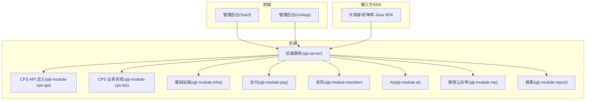
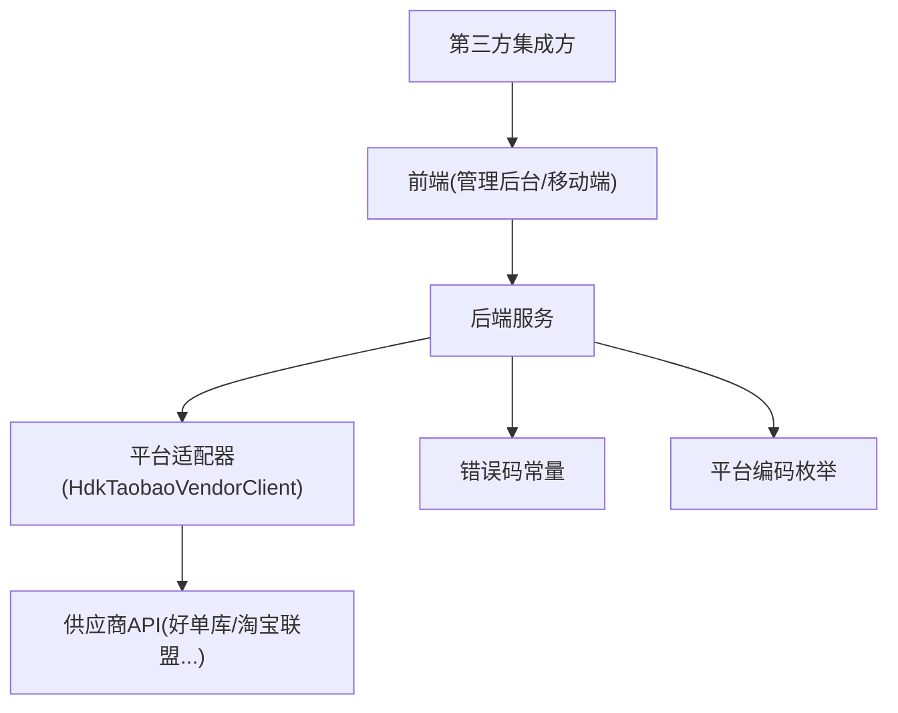
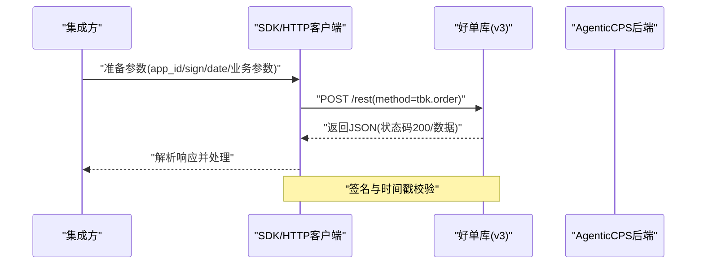
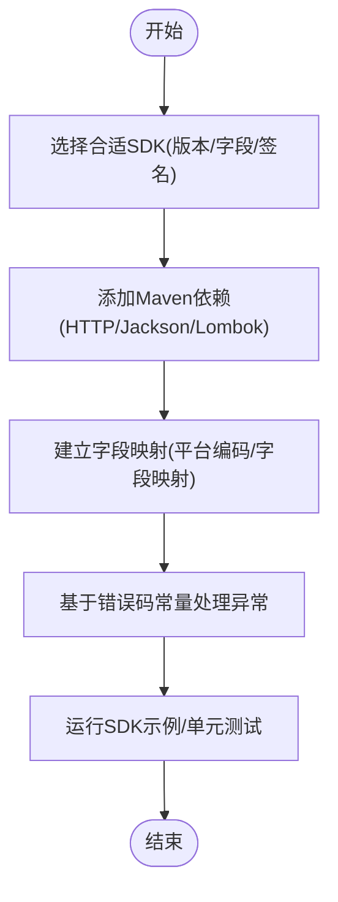
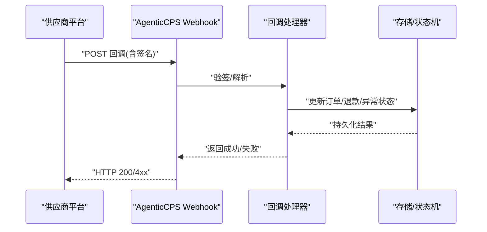
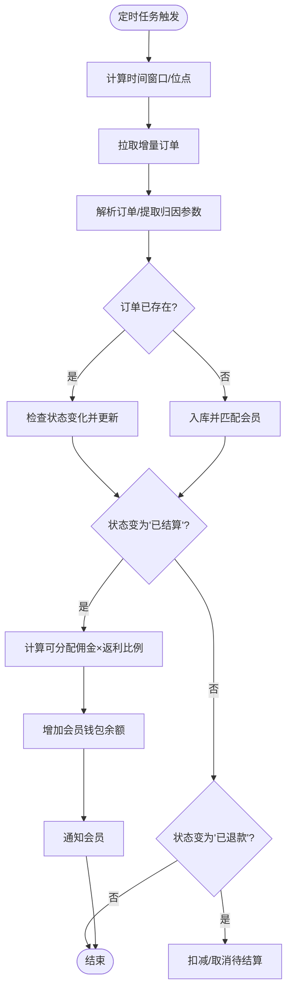
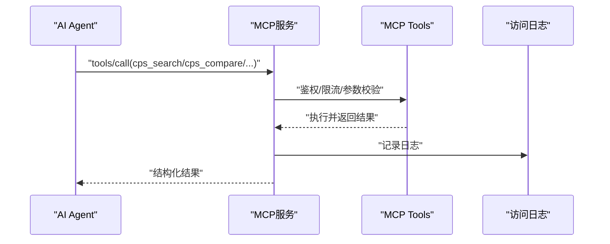
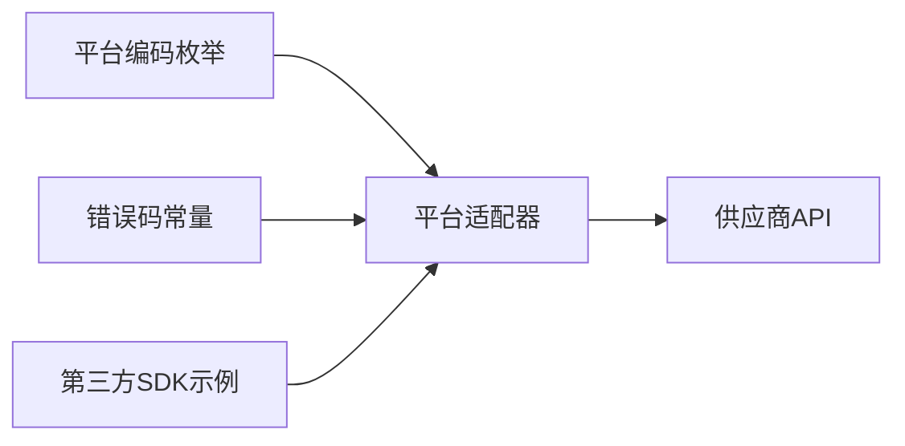
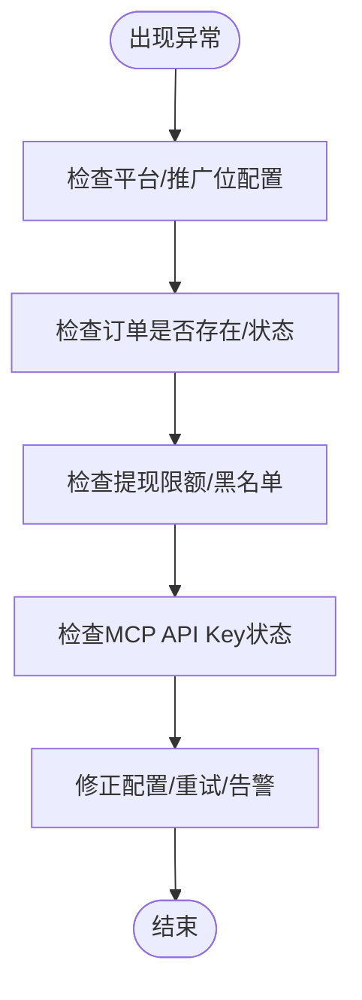

# 第三方集成

<cite>
**本文引用的文件**   
- [README.md](file://README.md)
- [CPS系统PRD文档.md](file://docs/CPS系统PRD文档.md)
- [好单库OpenAPI接口文档.md](file://docs/好单库OpenAPI接口文档.md)
- [CpsPlatformCodeEnum.java](file://backend/qiji-module-cps/qiji-module-cps-api/src/main/java/com/qiji/cps/module/cps/enums/CpsPlatformCodeEnum.java)
- [CpsErrorCodeConstants.java](file://backend/qiji-module-cps/qiji-module-cps-api/src/main/java/com/qiji/cps/module/cps/enums/CpsErrorCodeConstants.java)
- [HdkTaobaoVendorClient.java](file://backend/qiji-module-cps/qiji-module-cps-biz/src/main/java/com/qiji/cps/module/cps/client/haodanku/HdkTaobaoVendorClient.java)
- [pom.xml](file://agent_improvement/sdk_demo/dataoke-sdk-java/pom.xml)
- [README.md](file://agent_improvement/sdk_demo/dataoke-sdk-java/README.md)
- [application.yaml](file://backend/qiji-server/src/main/resources/application.yaml)
- [docker-compose.yml](file://backend/script/docker/docker-compose.yml)
- [init_cps_test_data.py](file://script/test/init_cps_test_data.py)
- [test_hdk_api.py](file://script/test/test_hdk_api.py)
- [test_hdk_api_v2.py](file://script/test/test_hdk_api_v2.py)
- [test_hdk_api_v3.py](file://script/test/test_hdk_api_v3.py)
</cite>

## 目录
1. [简介](#简介)
2. [项目结构](#项目结构)
3. [核心组件](#核心组件)
4. [架构总览](#架构总览)
5. [详细组件分析](#详细组件分析)
6. [依赖分析](#依赖分析)
7. [性能考虑](#性能考虑)
8. [故障排查指南](#故障排查指南)
9. [结论](#结论)
10. [附录](#附录)

## 简介
本指南面向希望将第三方平台（如淘宝联盟、京东联盟、拼多多联盟、抖音联盟、唯品会联盟、美团联盟等）接入 AgenticCPS 的集成方，提供从 API 集成、SDK 使用、Webhook 配置、数据同步策略到集成测试与安全防护的完整方案。AgenticCPS 采用模块化架构，核心能力包括多平台 CPS 接入、商品搜索与比价、推广链接生成、订单同步与结算、提现管理、MCP AI 接口等。系统通过“平台编码”“错误码常量”“供应商客户端适配器”等抽象，实现对不同平台的可插拔扩展。

## 项目结构
- 后端模块（Spring Boot）：包含基础设施、系统管理、会员中心、支付、商城、AI、微信公众号、报表、CPS 等模块，CPS 模块进一步细分为 API 定义层与业务实现层。
- 前端模块（Vue3/UniApp）：提供管理后台与移动端页面。
- SDK 示例：提供第三方 Java SDK（如大淘客/好单库）示例工程，便于理解 RESTful API 的调用方式与参数签名。
- 文档与测试：包含 PRD、OpenAPI 文档、Docker 部署脚本、初始化脚本与多版本测试脚本。

**章节来源**
- [README.md: 267-302:267-302](file://README.md#L267-L302)
- [README.md: 305-368:305-368](file://README.md#L305-L368)

## 核心组件
- 平台编码枚举：统一管理平台编码（如 taobao/jd/pdd/douyin/vip/meituan），用于区分不同供应商与适配器。
- 错误码常量：集中定义平台配置、推广位、订单、返利、提现、统计、MCP、转链、冻结、风控、供应商等错误域，便于统一处理与排查。
- 供应商客户端适配器：以“好单库淘宝客户端”为例，封装平台 API 的请求、签名、重试、异常处理与响应解析。
- SDK 示例：提供第三方 Java SDK 的依赖与构建配置，便于本地调试与集成参考。
- 配置与部署：后端主配置、Docker Compose 编排，便于快速拉起服务与集成测试。

**章节来源**
- [CpsPlatformCodeEnum.java: 14-46:14-46](file://backend/qiji-module-cps/qiji-module-cps-api/src/main/java/com/qiji/cps/module/cps/enums/CpsPlatformCodeEnum.java#L14-L46)
- [CpsErrorCodeConstants.java: 10-68:10-68](file://backend/qiji-module-cps/qiji-module-cps-api/src/main/java/com/qiji/cps/module/cps/enums/CpsErrorCodeConstants.java#L10-L68)
- [HdkTaobaoVendorClient.java: 1-200:1-200](file://backend/qiji-module-cps/qiji-module-cps-biz/src/main/java/com/qiji/cps/module/cps/client/haodanku/HdkTaobaoVendorClient.java#L1-L200)
- [pom.xml: 17-83:17-83](file://agent_improvement/sdk_demo/dataoke-sdk-java/pom.xml#L17-L83)
- [application.yaml: 1-200:1-200](file://backend/qiji-server/src/main/resources/application.yaml#L1-L200)
- [docker-compose.yml: 1-200:1-200](file://backend/script/docker/docker-compose.yml#L1-L200)

## 架构总览
AgenticCPS 的第三方集成围绕“平台适配器 + 统一 API + 统一错误码 + SDK/HTTP 客户端”的架构展开。前端通过后端 API 调用平台能力，后端通过适配器对接不同供应商（如好单库），并以统一的数据模型与错误码对外暴露。

**图表来源**
- [HdkTaobaoVendorClient.java: 1-200:1-200](file://backend/qiji-module-cps/qiji-module-cps-biz/src/main/java/com/qiji/cps/module/cps/client/haodanku/HdkTaobaoVendorClient.java#L1-L200)
- [CpsErrorCodeConstants.java: 10-68:10-68](file://backend/qiji-module-cps/qiji-module-cps-api/src/main/java/com/qiji/cps/module/cps/enums/CpsErrorCodeConstants.java#L10-L68)
- [CpsPlatformCodeEnum.java: 14-46:14-46](file://backend/qiji-module-cps/qiji-module-cps-api/src/main/java/com/qiji/cps/module/cps/enums/CpsPlatformCodeEnum.java#L14-L46)

## 详细组件分析

### RESTful API 集成
- 认证与签名
  - 好单库 v3 REST 接口需要 app_id + sign + date（时间戳）签名参数，且返回码为 200 表示成功。
  - 好单库 v2 接口通常使用 apikey 参数。
- 请求与响应
  - 商品搜索：GET /supersearch，支持分页参数（min_id、tb_p）与多种筛选条件。
  - 推广转链：POST /ratesurl，返回推广链接、淘口令等字段。
  - 订单拉取：POST /rest(method=tbk.order)，支持分页与状态筛选。
- 字段映射
  - 转链响应：shortUrl 对应 coupon_click_url，longUrl 对应 item_url，tpwd 对应 taoword。
  - 搜索响应：goodsId 对应 itemid，title 对应 itemtitle，mainPic 对应 itempic，originalPrice 对应 itemprice。

**图表来源**
- [好单库OpenAPI接口文档.md: 390-552:390-552](file://docs/好单库OpenAPI接口文档.md#L390-L552)

**章节来源**
- [好单库OpenAPI接口文档.md: 11-26:11-26](file://docs/好单库OpenAPI接口文档.md#L11-L26)
- [好单库OpenAPI接口文档.md: 66-125:66-125](file://docs/好单库OpenAPI接口文档.md#L66-L125)
- [好单库OpenAPI接口文档.md: 285-348:285-348](file://docs/好单库OpenAPI接口文档.md#L285-L348)
- [好单库OpenAPI接口文档.md: 489-552:489-552](file://docs/好单库OpenAPI接口文档.md#L489-L552)
- [好单库OpenAPI接口文档.md: 777-800:777-800](file://docs/好单库OpenAPI接口文档.md#L777-L800)

### SDK 使用方法
- 选择标准
  - 与目标平台 API 版本一致、参数与返回字段完备、具备签名与分页示例。
- 版本管理与依赖
  - 使用 Maven 管理依赖，确保 HTTP 客户端、Jackson、Lombok 等版本兼容。
- 接口封装
  - 将 SDK 的请求参数映射到平台编码与字段映射，统一返回结构。
- 异常处理
  - 基于错误码常量进行分类处理（如平台配置缺失、推广位不存在、订单状态非法等）。

**图表来源**
- [pom.xml: 26-83:26-83](file://agent_improvement/sdk_demo/dataoke-sdk-java/pom.xml#L26-L83)
- [CpsErrorCodeConstants.java: 10-68:10-68](file://backend/qiji-module-cps/qiji-module-cps-api/src/main/java/com/qiji/cps/module/cps/enums/CpsErrorCodeConstants.java#L10-L68)
- [CpsPlatformCodeEnum.java: 14-46:14-46](file://backend/qiji-module-cps/qiji-module-cps-api/src/main/java/com/qiji/cps/module/cps/enums/CpsPlatformCodeEnum.java#L14-L46)

**章节来源**
- [pom.xml: 17-83:17-83](file://agent_improvement/sdk_demo/dataoke-sdk-java/pom.xml#L17-L83)
- [README.md: 400-407:400-407](file://README.md#L400-L407)

### Webhook 配置
- 回调地址设置
  - 在平台侧配置回调地址，指向 AgenticCPS 的 webhook 接口（具体路径以后端路由为准）。
- 签名验证
  - 使用平台提供的签名算法对接收数据进行验真，防止伪造与篡改。
- 消息处理
  - 解析回调内容（如订单状态变更、退款、异常等），调用内部服务进行落库与状态更新。
- 重试机制
  - 失败重试采用指数退避策略，并记录重试次数与原因，避免无限循环。
- 状态跟踪
  - 记录回调接收时间、签名结果、处理状态、响应体摘要，便于审计与排查。

**图表来源**
- [CpsErrorCodeConstants.java: 10-68:10-68](file://backend/qiji-module-cps/qiji-module-cps-api/src/main/java/com/qiji/cps/module/cps/enums/CpsErrorCodeConstants.java#L10-L68)

**章节来源**
- [CpsErrorCodeConstants.java: 10-68:10-68](file://backend/qiji-module-cps/qiji-module-cps-api/src/main/java/com/qiji/cps/module/cps/enums/CpsErrorCodeConstants.java#L10-L68)

### 数据同步策略
- 增量同步
  - 基于时间窗口与位点（position_index）进行增量拉取，减少重复数据与网络压力。
- 全量同步
  - 首次接入或异常恢复时进行全量扫描，随后切换为增量。
- 冲突处理
  - 订单幂等性：以订单号为主键，重复到达时仅更新状态并去重。
  - 归因匹配：解析归因参数，将订单归属到对应会员。
- 数据一致性
  - 事务写入：订单入库与返利计算在同一事务中完成，失败回滚。
  - 状态机：订单状态（付款→收货→结算→入账/退款）严格受控。
- 同步监控
  - 记录同步时间、拉取条数、失败率、重试次数，异常告警。

**图表来源**
- [CPS系统PRD文档.md: 183-223:183-223](file://docs/CPS系统PRD文档.md#L183-L223)

**章节来源**
- [CPS系统PRD文档.md: 183-223:183-223](file://docs/CPS系统PRD文档.md#L183-L223)

### MCP（AI Agent）集成
- 工具与资源
  - 提供商品搜索、跨平台比价、生成推广链接、订单状态查询、返利汇总等工具与资源。
- 权限与限流
  - API Key 管理：权限级别（public/member/admin）、限流配置、状态与使用统计。
- 访问日志
  - 记录请求时间、API Key、Tool/Resource、输入参数（脱敏）、响应状态、耗时、用户ID、IP 等。

**图表来源**
- [CPS系统PRD文档.md: 643-694:643-694](file://docs/CPS系统PRD文档.md#L643-L694)

**章节来源**
- [CPS系统PRD文档.md: 643-694:643-694](file://docs/CPS系统PRD文档.md#L643-L694)

## 依赖分析
- 平台编码与错误码
  - 平台编码枚举统一管理平台标识，错误码常量集中定义错误域，二者共同支撑平台适配器与业务层的统一处理。
- 适配器与供应商
  - 以“好单库淘宝客户端”为例，封装供应商 API 的请求、签名、重试与异常处理。
- SDK 与后端
  - SDK 示例用于理解供应商 API 的参数与签名；后端通过适配器对接供应商，屏蔽差异。

**图表来源**
- [CpsPlatformCodeEnum.java: 14-46:14-46](file://backend/qiji-module-cps/qiji-module-cps-api/src/main/java/com/qiji/cps/module/cps/enums/CpsPlatformCodeEnum.java#L14-L46)
- [CpsErrorCodeConstants.java: 10-68:10-68](file://backend/qiji-module-cps/qiji-module-cps-api/src/main/java/com/qiji/cps/module/cps/enums/CpsErrorCodeConstants.java#L10-L68)
- [HdkTaobaoVendorClient.java: 1-200:1-200](file://backend/qiji-module-cps/qiji-module-cps-biz/src/main/java/com/qiji/cps/module/cps/client/haodanku/HdkTaobaoVendorClient.java#L1-L200)

**章节来源**
- [CpsPlatformCodeEnum.java: 14-46:14-46](file://backend/qiji-module-cps/qiji-module-cps-api/src/main/java/com/qiji/cps/module/cps/enums/CpsPlatformCodeEnum.java#L14-L46)
- [CpsErrorCodeConstants.java: 10-68:10-68](file://backend/qiji-module-cps/qiji-module-cps-api/src/main/java/com/qiji/cps/module/cps/enums/CpsErrorCodeConstants.java#L10-L68)

## 性能考虑
- 搜索与比价
  - 多平台并发查询，采用超时控制与结果先到先展示，降低首屏等待。
- 转链与订单同步
  - 转链请求尽量走缓存与短链，订单同步采用 5 分钟轮询与增量拉取。
- MCP 工具调用
  - 搜索类工具响应时间 < 3 秒，查询类工具 < 1 秒。
- 基准指标
  - 单平台搜索 < 2 秒（P99），多平台比价 < 5 秒（P99），转链生成 < 1 秒。

**章节来源**
- [README.md: 369-379:369-379](file://README.md#L369-L379)

## 故障排查指南
- 平台配置问题
  - 平台不存在、平台已禁用、推广位不存在、默认推广位重复等，均对应特定错误码，需在管理后台检查配置。
- 订单问题
  - 订单不存在、订单已存在、订单状态不合法，需检查幂等与状态机。
- 提现与风控
  - 提现金额不足、每日次数上限、黑名单、风控拦截等，需结合风控规则与限额配置排查。
- MCP 问题
  - API Key 不存在、已过期、已禁用，需检查密钥状态与权限级别。

**图表来源**
- [CpsErrorCodeConstants.java: 10-68:10-68](file://backend/qiji-module-cps/qiji-module-cps-api/src/main/java/com/qiji/cps/module/cps/enums/CpsErrorCodeConstants.java#L10-L68)

**章节来源**
- [CpsErrorCodeConstants.java: 10-68:10-68](file://backend/qiji-module-cps/qiji-module-cps-api/src/main/java/com/qiji/cps/module/cps/enums/CpsErrorCodeConstants.java#L10-L68)

## 结论
通过平台编码与错误码常量的统一抽象、供应商适配器的可插拔扩展、SDK 的标准化封装与 Webhook 的实时回调机制，AgenticCPS 为第三方平台集成提供了清晰、稳定、可扩展的路径。配合增量同步策略、MCP 工具链与完善的监控告警，能够满足从开发到生产的全生命周期集成需求。

## 附录
- 集成测试方法
  - 使用 Python 脚本对好单库接口进行多版本测试，覆盖搜索、转链、订单拉取等关键路径。
  - 初始化脚本用于准备测试数据与环境。
- 部署与运行
  - 使用 Docker Compose 一键拉起后端、数据库与缓存服务，便于本地与联调环境部署。

**章节来源**
- [test_hdk_api.py: 1-200:1-200](file://script/test/test_hdk_api.py#L1-L200)
- [test_hdk_api_v2.py: 1-200:1-200](file://script/test/test_hdk_api_v2.py#L1-L200)
- [test_hdk_api_v3.py: 1-200:1-200](file://script/test/test_hdk_api_v3.py#L1-L200)
- [init_cps_test_data.py: 1-200:1-200](file://script/test/init_cps_test_data.py#L1-L200)
- [docker-compose.yml: 1-200:1-200](file://backend/script/docker/docker-compose.yml#L1-L200)