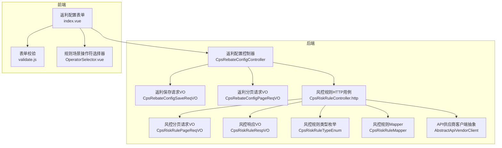
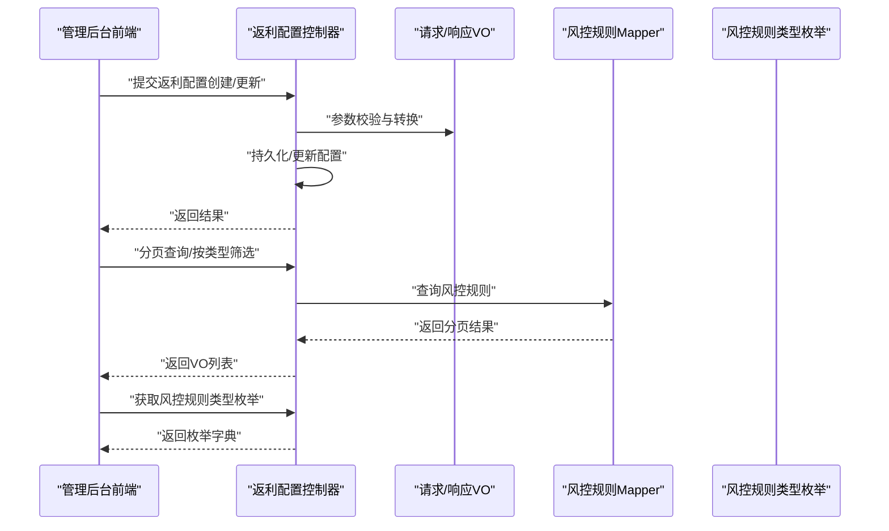
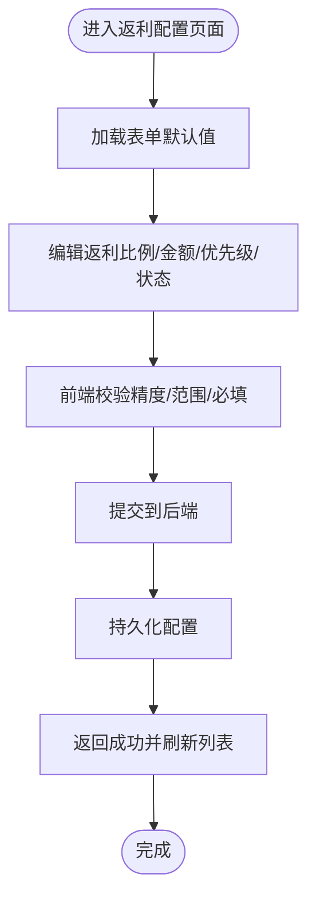
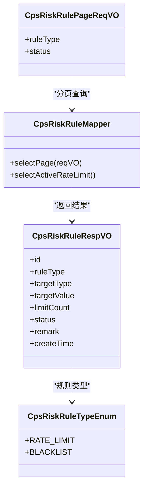
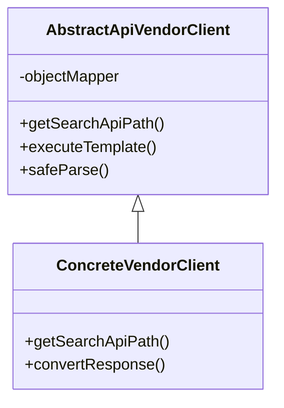
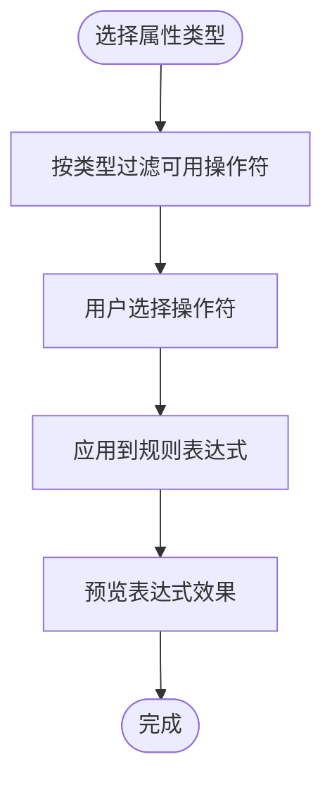
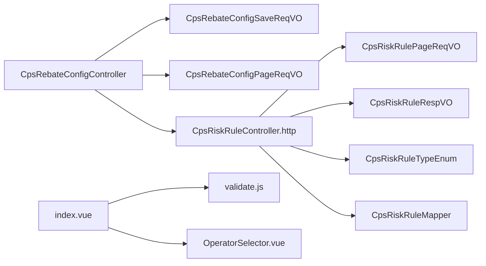

# 业务规则配置

<cite>
**本文引用的文件**
- [CpsRebateConfigController.java](file://backend/qiji-module-cps/qiji-module-cps-biz/src/main/java/com/qiji/cps/module/cps/controller/admin/rebate/CpsRebateConfigController.java)
- [CpsRebateConfigSaveReqVO.java](file://backend/qiji-module-cps/qiji-module-cps-biz/src/main/java/com/qiji/cps/module/cps/controller/admin/rebate/vo/CpsRebateConfigSaveReqVO.java)
- [CpsRebateConfigPageReqVO.java](file://backend/qiji-module-cps/qiji-module-cps-biz/src/main/java/com/qiji/cps/module/cps/controller/admin/rebate/vo/CpsRebateConfigPageReqVO.java)
- [CpsRiskRuleController.http](file://backend/qiji-module-cps/qiji-module-cps-biz/src/main/java/com/qiji/cps/module/cps/controller/admin/risk/CpsRiskRuleController.http)
- [CpsRiskRulePageReqVO.java](file://backend/qiji-module-cps/qiji-module-cps-biz/src/main/java/com/qiji/cps/module/cps/controller/admin/risk/vo/CpsRiskRulePageReqVO.java)
- [CpsRiskRuleRespVO.java](file://backend/qiji-module-cps/qiji-module-cps-biz/src/main/java/com/qiji/cps/module/cps/controller/admin/risk/vo/CpsRiskRuleRespVO.java)
- [CpsRiskRuleTypeEnum.java](file://backend/qiji-module-cps/qiji-module-cps-api/src/main/java/com/qiji/cps/module/cps/enums/CpsRiskRuleTypeEnum.java)
- [CpsRiskRuleMapper.java](file://backend/qiji-module-cps/qiji-module-cps-biz/src/main/java/com/qiji/cps/module/cps/dal/mysql/risk/CpsRiskRuleMapper.java)
- [AbstractApiVendorClient.java](file://backend/qiji-module-cps/qiji-module-cps-biz/src/main/java/com/qiji/cps/module/cps/client/common/AbstractApiVendorClient.java)
- [index.vue（返利配置表单）](file://frontend/admin-vue3/src/views/cps/rebate/config/index.vue)
- [validate.js（表单校验）](file://frontend/mall-uniapp/uni_modules/uni-forms/components/uni-forms/validate.js)
- [OperatorSelector.vue（规则场景操作符）](file://frontend/admin-vue3/src/views/iot/rule/scene/form/selectors/OperatorSelector.vue)
</cite>

## 目录
1. [引言](#引言)
2. [项目结构](#项目结构)
3. [核心组件](#核心组件)
4. [架构总览](#架构总览)
5. [详细组件分析](#详细组件分析)
6. [依赖分析](#依赖分析)
7. [性能考虑](#性能考虑)
8. [故障排查指南](#故障排查指南)
9. [结论](#结论)
10. [附录](#附录)

## 引言
本技术文档围绕 AgenticCPS 的“业务规则配置”主题，系统化梳理并解释风控规则与返利计算规则的配置实现机制，覆盖规则类型定义、规则表达式设计、优先级管理、平台接入规则配置、动态执行机制（含规则引擎集成思路）、以及可视化编辑、测试验证与版本管理等用户体验优化。文档以代码为依据，结合前后端交互与数据模型，帮助开发者与运营人员高效理解与维护业务规则体系。

## 项目结构
业务规则配置主要分布在后端模块的“CPS 业务模块”与前端管理界面中：
- 后端：CPS 控制器、VO 参数对象、Mapper 数据访问层、API 枚举与客户端抽象
- 前端：管理后台页面、表单校验与规则场景组件

**图表来源**
- [CpsRebateConfigController.java:1-88](file://backend/qiji-module-cps/qiji-module-cps-biz/src/main/java/com/qiji/cps/module/cps/controller/admin/rebate/CpsRebateConfigController.java#L1-L88)
- [CpsRebateConfigSaveReqVO.java:1-50](file://backend/qiji-module-cps/qiji-module-cps-biz/src/main/java/com/qiji/cps/module/cps/controller/admin/rebate/vo/CpsRebateConfigSaveReqVO.java#L1-L50)
- [CpsRebateConfigPageReqVO.java:1-29](file://backend/qiji-module-cps/qiji-module-cps-biz/src/main/java/com/qiji/cps/module/cps/controller/admin/rebate/vo/CpsRebateConfigPageReqVO.java#L1-L29)
- [CpsRiskRuleController.http:48-59](file://backend/qiji-module-cps/qiji-module-cps-biz/src/main/java/com/qiji/cps/module/cps/controller/admin/risk/CpsRiskRuleController.http#L48-L59)
- [CpsRiskRulePageReqVO.java:1-26](file://backend/qiji-module-cps/qiji-module-cps-biz/src/main/java/com/qiji/cps/module/cps/controller/admin/risk/vo/CpsRiskRulePageReqVO.java#L1-L26)
- [CpsRiskRuleRespVO.java:1-42](file://backend/qiji-module-cps/qiji-module-cps-biz/src/main/java/com/qiji/cps/module/cps/controller/admin/risk/vo/CpsRiskRuleRespVO.java#L1-L42)
- [CpsRiskRuleTypeEnum.java:1-38](file://backend/qiji-module-cps/qiji-module-cps-api/src/main/java/com/qiji/cps/module/cps/enums/CpsRiskRuleTypeEnum.java#L1-L38)
- [CpsRiskRuleMapper.java:1-35](file://backend/qiji-module-cps/qiji-module-cps-biz/src/main/java/com/qiji/cps/module/cps/dal/mysql/risk/CpsRiskRuleMapper.java#L1-L35)
- [AbstractApiVendorClient.java:1-42](file://backend/qiji-module-cps/qiji-module-cps-biz/src/main/java/com/qiji/cps/module/cps/client/common/AbstractApiVendorClient.java#L1-L42)
- [index.vue（返利配置表单）:178-216](file://frontend/admin-vue3/src/views/cps/rebate/config/index.vue#L178-L216)
- [validate.js（表单校验）:100-403](file://frontend/mall-uniapp/uni_modules/uni-forms/components/uni-forms/validate.js#L100-L403)
- [OperatorSelector.vue（规则场景操作符）:119-236](file://frontend/admin-vue3/src/views/iot/rule/scene/form/selectors/OperatorSelector.vue#L119-L236)

**章节来源**
- [CpsRebateConfigController.java:1-88](file://backend/qiji-module-cps/qiji-module-cps-biz/src/main/java/com/qiji/cps/module/cps/controller/admin/rebate/CpsRebateConfigController.java#L1-L88)
- [CpsRiskRuleController.http:48-59](file://backend/qiji-module-cps/qiji-module-cps-biz/src/main/java/com/qiji/cps/module/cps/controller/admin/risk/CpsRiskRuleController.http#L48-L59)

## 核心组件
- 返利配置控制器：提供创建、更新、删除、查询、分页、启用列表等接口，支撑返利规则的全生命周期管理。
- 返利配置VO：定义返利比例、最大/最小返利金额、优先级、状态等字段及校验约束。
- 风控规则控制器与HTTP用例：提供风控规则的分页查询与按类型筛选，支撑风控规则的可视化配置与运维。
- 风控规则枚举与Mapper：定义风控规则类型（如频率限制、黑名单），并提供分页查询与全局生效规则检索。
- API供应商客户端抽象：封装统一的JSON解析、模板方法与通用工具，为平台接入提供可扩展的适配层。
- 前端表单与校验：提供返利配置表单、规则场景操作符选择器与通用表单校验逻辑，提升配置体验。

**章节来源**
- [CpsRebateConfigController.java:24-88](file://backend/qiji-module-cps/qiji-module-cps-biz/src/main/java/com/qiji/cps/module/cps/controller/admin/rebate/CpsRebateConfigController.java#L24-L88)
- [CpsRebateConfigSaveReqVO.java:12-50](file://backend/qiji-module-cps/qiji-module-cps-biz/src/main/java/com/qiji/cps/module/cps/controller/admin/rebate/vo/CpsRebateConfigSaveReqVO.java#L12-L50)
- [CpsRiskRuleController.http:48-59](file://backend/qiji-module-cps/qiji-module-cps-biz/src/main/java/com/qiji/cps/module/cps/controller/admin/risk/CpsRiskRuleController.http#L48-L59)
- [CpsRiskRuleTypeEnum.java:9-38](file://backend/qiji-module-cps/qiji-module-cps-api/src/main/java/com/qiji/cps/module/cps/enums/CpsRiskRuleTypeEnum.java#L9-L38)
- [CpsRiskRuleMapper.java:10-35](file://backend/qiji-module-cps/qiji-module-cps-biz/src/main/java/com/qiji/cps/module/cps/dal/mysql/risk/CpsRiskRuleMapper.java#L10-L35)
- [AbstractApiVendorClient.java:15-42](file://backend/qiji-module-cps/qiji-module-cps-biz/src/main/java/com/qiji/cps/module/cps/client/common/AbstractApiVendorClient.java#L15-L42)
- [index.vue（返利配置表单）:178-216](file://frontend/admin-vue3/src/views/cps/rebate/config/index.vue#L178-L216)
- [validate.js（表单校验）:100-403](file://frontend/mall-uniapp/uni_modules/uni-forms/components/uni-forms/validate.js#L100-L403)
- [OperatorSelector.vue（规则场景操作符）:119-236](file://frontend/admin-vue3/src/views/iot/rule/scene/form/selectors/OperatorSelector.vue#L119-L236)

## 架构总览
下图展示业务规则配置在前后端的交互与数据流：

**图表来源**
- [CpsRebateConfigController.java:38-85](file://backend/qiji-module-cps/qiji-module-cps-biz/src/main/java/com/qiji/cps/module/cps/controller/admin/rebate/CpsRebateConfigController.java#L38-L85)
- [CpsRebateConfigSaveReqVO.java:30-47](file://backend/qiji-module-cps/qiji-module-cps-biz/src/main/java/com/qiji/cps/module/cps/controller/admin/rebate/vo/CpsRebateConfigSaveReqVO.java#L30-L47)
- [CpsRiskRuleController.http:51-59](file://backend/qiji-module-cps/qiji-module-cps-biz/src/main/java/com/qiji/cps/module/cps/controller/admin/risk/CpsRiskRuleController.http#L51-L59)
- [CpsRiskRuleMapper.java:21-35](file://backend/qiji-module-cps/qiji-module-cps-biz/src/main/java/com/qiji/cps/module/cps/dal/mysql/risk/CpsRiskRuleMapper.java#L21-L35)
- [CpsRiskRuleTypeEnum.java:16-20](file://backend/qiji-module-cps/qiji-module-cps-api/src/main/java/com/qiji/cps/module/cps/enums/CpsRiskRuleTypeEnum.java#L16-L20)

## 详细组件分析

### 返利配置规则
- 字段与约束
  - 返利比例：百分比，范围校验（0~100）
  - 最大/最小返利金额：支持不限额（0）
  - 优先级：整数，数字越大优先级越高
  - 状态：启用/禁用
  - 平台与会员等级：支持全平台/全等级或定向配置
- 控制器能力
  - 创建、更新、删除、详情查询、分页查询、启用列表
- 前端体验
  - 表单输入控制（精度、步长、上下限）
  - 提交与加载态反馈

**图表来源**
- [index.vue（返利配置表单）:178-216](file://frontend/admin-vue3/src/views/cps/rebate/config/index.vue#L178-L216)
- [validate.js（表单校验）:127-203](file://frontend/mall-uniapp/uni_modules/uni-forms/components/uni-forms/validate.js#L127-L203)
- [CpsRebateConfigSaveReqVO.java:30-47](file://backend/qiji-module-cps/qiji-module-cps-biz/src/main/java/com/qiji/cps/module/cps/controller/admin/rebate/vo/CpsRebateConfigSaveReqVO.java#L30-L47)
- [CpsRebateConfigController.java:38-85](file://backend/qiji-module-cps/qiji-module-cps-biz/src/main/java/com/qiji/cps/module/cps/controller/admin/rebate/CpsRebateConfigController.java#L38-L85)

**章节来源**
- [CpsRebateConfigSaveReqVO.java:12-50](file://backend/qiji-module-cps/qiji-module-cps-biz/src/main/java/com/qiji/cps/module/cps/controller/admin/rebate/vo/CpsRebateConfigSaveReqVO.java#L12-L50)
- [CpsRebateConfigController.java:24-88](file://backend/qiji-module-cps/qiji-module-cps-biz/src/main/java/com/qiji/cps/module/cps/controller/admin/rebate/CpsRebateConfigController.java#L24-L88)
- [index.vue（返利配置表单）:178-216](file://frontend/admin-vue3/src/views/cps/rebate/config/index.vue#L178-L216)
- [validate.js（表单校验）:100-403](file://frontend/mall-uniapp/uni_modules/uni-forms/components/uni-forms/validate.js#L100-L403)

### 风控规则配置
- 规则类型
  - 频率限制（rate_limit）
  - 黑名单（blacklist）
- 查询与筛选
  - 支持按规则类型与状态分页查询
  - 支持全局生效的频率限制规则检索
- 响应字段
  - 规则类型、目标类型（会员/IP）、目标值、限制次数、状态、备注、创建时间

**图表来源**
- [CpsRiskRuleTypeEnum.java:16-20](file://backend/qiji-module-cps/qiji-module-cps-api/src/main/java/com/qiji/cps/module/cps/enums/CpsRiskRuleTypeEnum.java#L16-L20)
- [CpsRiskRulePageReqVO.java:18-26](file://backend/qiji-module-cps/qiji-module-cps-biz/src/main/java/com/qiji/cps/module/cps/controller/admin/risk/vo/CpsRiskRulePageReqVO.java#L18-L26)
- [CpsRiskRuleRespVO.java:15-41](file://backend/qiji-module-cps/qiji-module-cps-biz/src/main/java/com/qiji/cps/module/cps/controller/admin/risk/vo/CpsRiskRuleRespVO.java#L15-L41)
- [CpsRiskRuleMapper.java:21-35](file://backend/qiji-module-cps/qiji-module-cps-biz/src/main/java/com/qiji/cps/module/cps/dal/mysql/risk/CpsRiskRuleMapper.java#L21-L35)

**章节来源**
- [CpsRiskRuleTypeEnum.java:9-38](file://backend/qiji-module-cps/qiji-module-cps-api/src/main/java/com/qiji/cps/module/cps/enums/CpsRiskRuleTypeEnum.java#L9-L38)
- [CpsRiskRulePageReqVO.java:1-26](file://backend/qiji-module-cps/qiji-module-cps-biz/src/main/java/com/qiji/cps/module/cps/controller/admin/risk/vo/CpsRiskRulePageReqVO.java#L1-L26)
- [CpsRiskRuleRespVO.java:1-42](file://backend/qiji-module-cps/qiji-module-cps-biz/src/main/java/com/qiji/cps/module/cps/controller/admin/risk/vo/CpsRiskRuleRespVO.java#L1-L42)
- [CpsRiskRuleMapper.java:10-35](file://backend/qiji-module-cps/qiji-module-cps-biz/src/main/java/com/qiji/cps/module/cps/dal/mysql/risk/CpsRiskRuleMapper.java#L10-L35)
- [CpsRiskRuleController.http:51-59](file://backend/qiji-module-cps/qiji-module-cps-biz/src/main/java/com/qiji/cps/module/cps/controller/admin/risk/CpsRiskRuleController.http#L51-L59)

### 平台接入规则配置
- 抽象客户端
  - 统一JSON解析、模板方法流程、通用工具方法（空结果构建、安全数值解析）
  - 通过子类实现差异化API路径与适配逻辑
- 配置策略
  - 平台参数配置：在子类中注入平台特有参数（如API Key、服务商、关键字等）
  - API调用限制：通过抽象层统一处理错误码与限流策略
  - 数据格式转换：通过ObjectMapper与子类映射实现

**图表来源**
- [AbstractApiVendorClient.java:15-42](file://backend/qiji-module-cps/qiji-module-cps-biz/src/main/java/com/qiji/cps/module/cps/client/common/AbstractApiVendorClient.java#L15-L42)

**章节来源**
- [AbstractApiVendorClient.java:1-42](file://backend/qiji-module-cps/qiji-module-cps-biz/src/main/java/com/qiji/cps/module/cps/client/common/AbstractApiVendorClient.java#L1-L42)

### 规则表达式与条件判断（前端规则场景）
- 操作符选择器
  - 支持比较类（小于、小于等于、大于、大于等于、等于、不等于）
  - 支持集合类（包含、不包含）
  - 支持文本类（模糊匹配like）
  - 支持存在性（非空）
- 类型感知
  - 根据属性类型过滤可用操作符，避免无效组合
- 使用场景
  - 规则触发条件的可视化配置，降低规则编写门槛

**图表来源**
- [OperatorSelector.vue（规则场景操作符）:220-236](file://frontend/admin-vue3/src/views/iot/rule/scene/form/selectors/OperatorSelector.vue#L220-L236)

**章节来源**
- [OperatorSelector.vue（规则场景操作符）:119-236](file://frontend/admin-vue3/src/views/iot/rule/scene/form/selectors/OperatorSelector.vue#L119-L236)

### 动态执行机制与性能优化（设计建议）
- 规则引擎集成（建议方案）
  - 将规则类型与条件表达式抽象为规则节点，通过规则树或Drools/Aviator脚本引擎执行
  - 支持规则优先级排序与短路执行，减少不必要的计算
- 规则匹配算法
  - 按优先级降序匹配，命中即停；对全局规则与定向规则分别评估
- 执行结果缓存
  - 对热点规则与高频条件进行缓存，结合TTL与失效策略
- 性能优化
  - 分页与索引：对规则类型、状态、目标值建立索引
  - 批量加载：启用列表与分页查询采用批量加载策略

[本节为概念性设计说明，未直接分析具体文件，故不附“章节来源”]

## 依赖分析
- 控制器依赖VO与服务层（此处省略服务层实现细节），VO负责参数校验与约束
- 风控规则Mapper依赖分页查询与条件筛选，返回DO给控制器
- 前端表单依赖校验库与规则场景组件，确保输入合法性与可视化配置体验

**图表来源**
- [CpsRebateConfigController.java:38-85](file://backend/qiji-module-cps/qiji-module-cps-biz/src/main/java/com/qiji/cps/module/cps/controller/admin/rebate/CpsRebateConfigController.java#L38-L85)
- [CpsRebateConfigSaveReqVO.java:30-47](file://backend/qiji-module-cps/qiji-module-cps-biz/src/main/java/com/qiji/cps/module/cps/controller/admin/rebate/vo/CpsRebateConfigSaveReqVO.java#L30-L47)
- [CpsRebateConfigPageReqVO.java:18-29](file://backend/qiji-module-cps/qiji-module-cps-biz/src/main/java/com/qiji/cps/module/cps/controller/admin/rebate/vo/CpsRebateConfigPageReqVO.java#L18-L29)
- [CpsRiskRuleController.http:51-59](file://backend/qiji-module-cps/qiji-module-cps-biz/src/main/java/com/qiji/cps/module/cps/controller/admin/risk/CpsRiskRuleController.http#L51-L59)
- [CpsRiskRulePageReqVO.java:18-26](file://backend/qiji-module-cps/qiji-module-cps-biz/src/main/java/com/qiji/cps/module/cps/controller/admin/risk/vo/CpsRiskRulePageReqVO.java#L18-L26)
- [CpsRiskRuleRespVO.java:15-41](file://backend/qiji-module-cps/qiji-module-cps-biz/src/main/java/com/qiji/cps/module/cps/controller/admin/risk/vo/CpsRiskRuleRespVO.java#L15-L41)
- [CpsRiskRuleTypeEnum.java:16-20](file://backend/qiji-module-cps/qiji-module-cps-api/src/main/java/com/qiji/cps/module/cps/enums/CpsRiskRuleTypeEnum.java#L16-L20)
- [CpsRiskRuleMapper.java:21-35](file://backend/qiji-module-cps/qiji-module-cps-biz/src/main/java/com/qiji/cps/module/cps/dal/mysql/risk/CpsRiskRuleMapper.java#L21-L35)
- [index.vue（返利配置表单）:178-216](file://frontend/admin-vue3/src/views/cps/rebate/config/index.vue#L178-L216)
- [validate.js（表单校验）:100-403](file://frontend/mall-uniapp/uni_modules/uni-forms/components/uni-forms/validate.js#L100-L403)
- [OperatorSelector.vue（规则场景操作符）:119-236](file://frontend/admin-vue3/src/views/iot/rule/scene/form/selectors/OperatorSelector.vue#L119-L236)

**章节来源**
- [CpsRebateConfigController.java:1-88](file://backend/qiji-module-cps/qiji-module-cps-biz/src/main/java/com/qiji/cps/module/cps/controller/admin/rebate/CpsRebateConfigController.java#L1-L88)
- [CpsRiskRuleController.http:48-59](file://backend/qiji-module-cps/qiji-module-cps-biz/src/main/java/com/qiji/cps/module/cps/controller/admin/risk/CpsRiskRuleController.http#L48-L59)

## 性能考虑
- 规则查询性能
  - 建议对规则类型、状态、目标值建立复合索引，优化分页查询
  - 全局生效规则（如无目标值）单独检索，避免全表扫描
- 执行效率
  - 规则匹配按优先级降序，命中即停，减少遍历成本
  - 对热点规则与条件进行缓存，结合TTL与失效策略
- 平台接入
  - 抽象客户端统一处理错误码与重试策略，避免重复逻辑
  - JSON解析与数据转换集中处理，减少异常开销

[本节提供通用指导，未直接分析具体文件，故不附“章节来源”]

## 故障排查指南
- 返利配置校验失败
  - 检查返利比例范围（0~100）、最大/最小金额是否合理
  - 确认状态与优先级字段是否必填
- 风控规则查询异常
  - 确认规则类型与状态参数是否正确
  - 检查全局生效规则是否存在且启用
- 前端表单问题
  - 校验消息是否显示，确认字段类型与操作符匹配
  - 规则表达式是否符合预期

**章节来源**
- [CpsRebateConfigSaveReqVO.java:30-47](file://backend/qiji-module-cps/qiji-module-cps-biz/src/main/java/com/qiji/cps/module/cps/controller/admin/rebate/vo/CpsRebateConfigSaveReqVO.java#L30-L47)
- [CpsRiskRulePageReqVO.java:18-26](file://backend/qiji-module-cps/qiji-module-cps-biz/src/main/java/com/qiji/cps/module/cps/controller/admin/risk/vo/CpsRiskRulePageReqVO.java#L18-L26)
- [validate.js（表单校验）:127-203](file://frontend/mall-uniapp/uni_modules/uni-forms/components/uni-forms/validate.js#L127-L203)

## 结论
本文档基于现有代码梳理了AgenticCPS的业务规则配置现状与实现要点，覆盖风控规则与返利配置两大领域，并补充了平台接入适配、规则表达式设计、优先级管理与动态执行的优化建议。建议后续在规则引擎集成、缓存策略与可视化编辑方面持续迭代，以提升规则配置的灵活性与执行效率。

## 附录
- API参考（HTTP用例）
  - 风控规则分页查询（按类型与状态筛选）
  - 返利配置分页查询（按平台与状态筛选）

**章节来源**
- [CpsRiskRuleController.http:51-59](file://backend/qiji-module-cps/qiji-module-cps-biz/src/main/java/com/qiji/cps/module/cps/controller/admin/risk/CpsRiskRuleController.http#L51-L59)
- [CpsRebateConfigPageReqVO.java:18-29](file://backend/qiji-module-cps/qiji-module-cps-biz/src/main/java/com/qiji/cps/module/cps/controller/admin/rebate/vo/CpsRebateConfigPageReqVO.java#L18-L29)