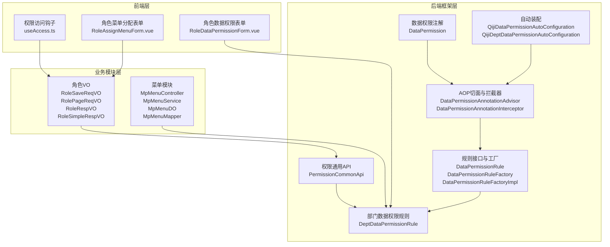
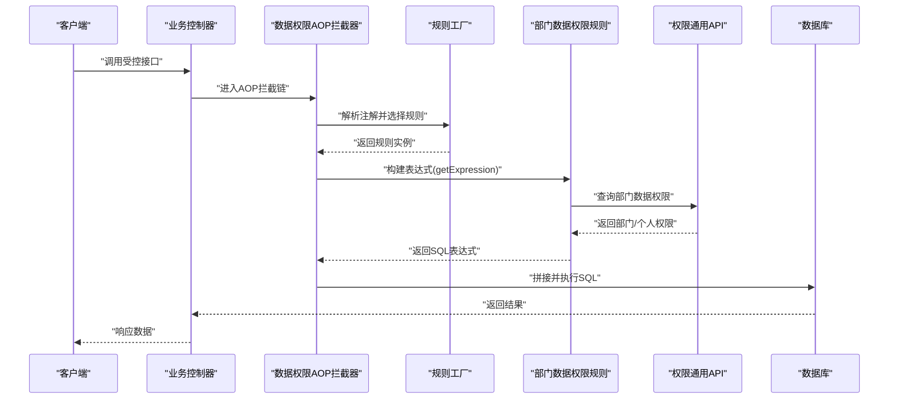
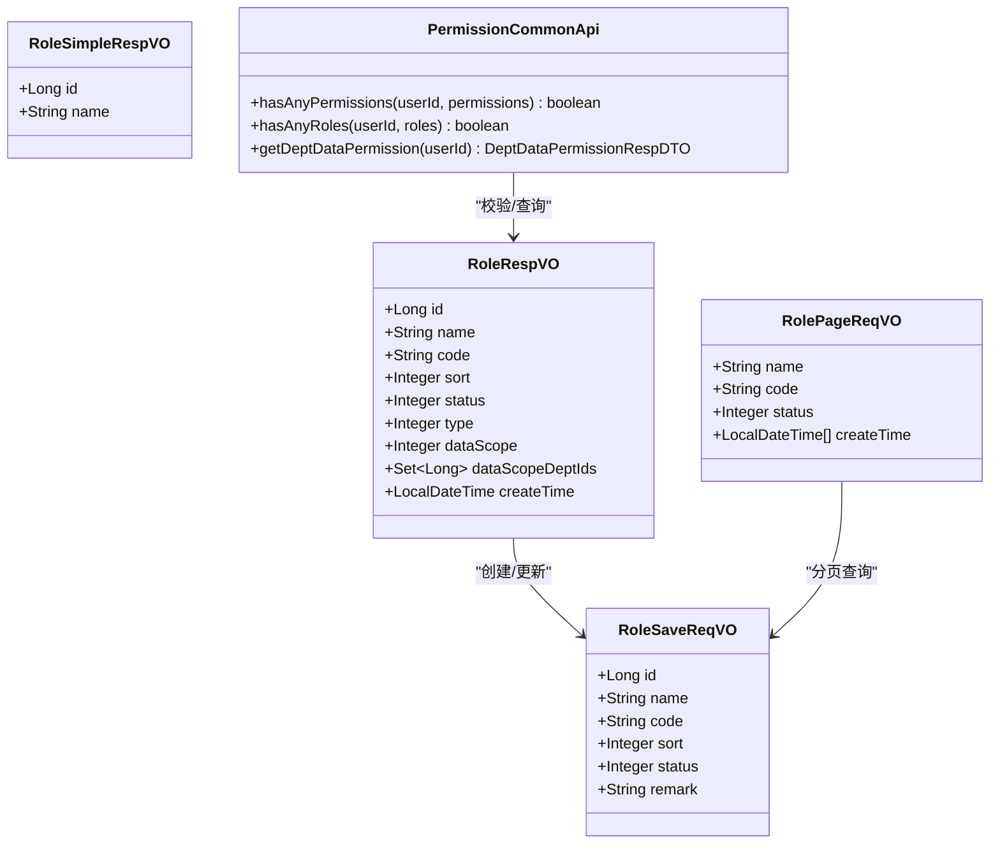
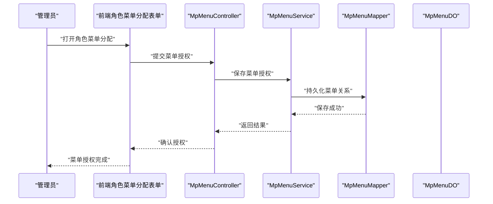
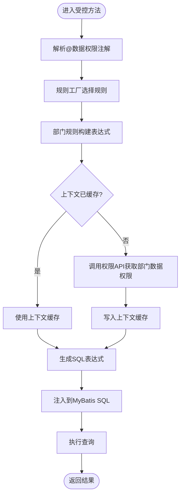
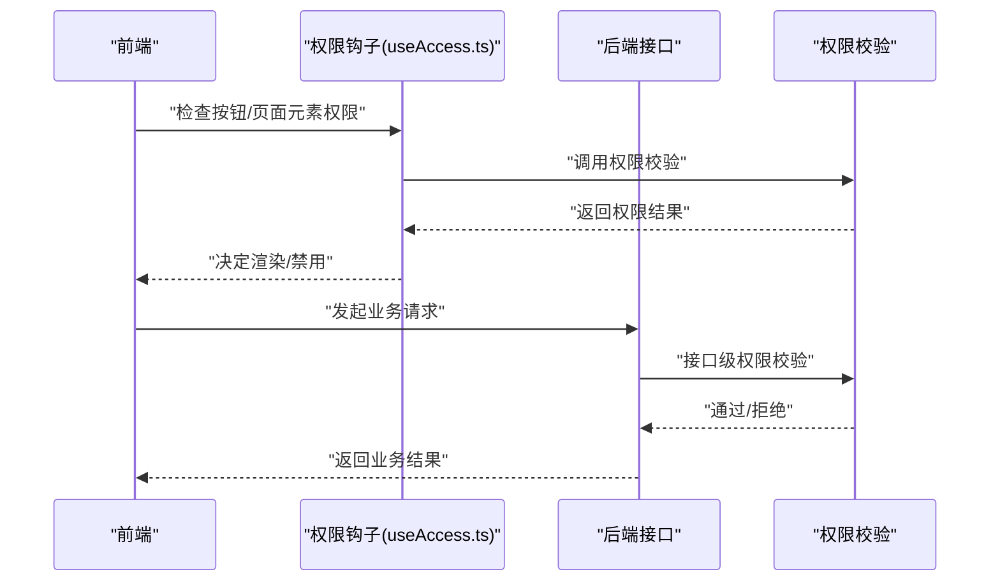
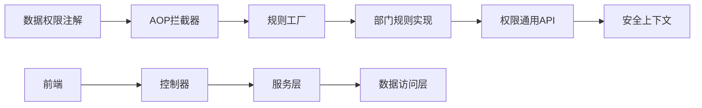

# 权限控制配置

<cite>
**本文引用的文件**
- [PermissionCommonApi.java](file://backend/qiji-framework/qiji-common/src/main/java/com/qiji/cps/framework/common/biz/system/permission/PermissionCommonApi.java)
- [DataPermission.java](file://backend/qiji-framework/qiji-spring-boot-starter-biz-data-permission/src/main/java/com/qiji/cps/framework/datapermission/core/annotation/DataPermission.java)
- [DataPermissionAnnotationAdvisor.java](file://backend/qiji-framework/qiji-spring-boot-starter-biz-data-permission/src/main/java/com/qiji/cps/framework/datapermission/core/aop/DataPermissionAnnotationAdvisor.java)
- [DataPermissionAnnotationInterceptor.java](file://backend/qiji-framework/qiji-spring-boot-starter-biz-data-permission/src/main/java/com/qiji/cps/framework/datapermission/core/aop/DataPermissionAnnotationInterceptor.java)
- [DataPermissionContextHolder.java](file://backend/qiji-framework/qiji-spring-boot-starter-biz-data-permission/src/main/java/com/qiji/cps/framework/datapermission/core/aop/DataPermissionContextHolder.java)
- [DataPermissionRule.java](file://backend/qiji-framework/qiji-spring-boot-starter-biz-data-permission/src/main/java/com/qiji/cps/framework/datapermission/core/rule/DataPermissionRule.java)
- [DataPermissionRuleFactory.java](file://backend/qiji-framework/qiji-spring-boot-starter-biz-data-permission/src/main/java/com/qiji/cps/framework/datapermission/core/rule/DataPermissionRuleFactory.java)
- [DataPermissionRuleFactoryImpl.java](file://backend/qiji-framework/qiji-spring-boot-starter-biz-data-permission/src/main/java/com/qiji/cps/framework/datapermission/core/rule/DataPermissionRuleFactoryImpl.java)
- [DeptDataPermissionRule.java](file://backend/qiji-framework/qiji-spring-boot-starter-biz-data-permission/src/main/java/com/qiji/cps/framework/datapermission/core/rule/dept/DeptDataPermissionRule.java)
- [DeptDataPermissionRuleCustomizer.java](file://backend/qiji-framework/qiji-spring-boot-starter-biz-data-permission/src/main/java/com/qiji/cps/framework/datapermission/core/rule/dept/DeptDataPermissionRuleCustomizer.java)
- [DataPermissionUtils.java](file://backend/qiji-framework/qiji-spring-boot-starter-biz-data-permission/src/main/java/com/qiji/cps/framework/datapermission/core/util/DataPermissionUtils.java)
- [QijiDataPermissionAutoConfiguration.java](file://backend/qiji-framework/qiji-spring-boot-starter-biz-data-permission/src/main/java/com/qiji/cps/framework/datapermission/config/QijiDataPermissionAutoConfiguration.java)
- [QijiDeptDataPermissionAutoConfiguration.java](file://backend/qiji-framework/qiji-spring-boot-starter-biz-data-permission/src/main/java/com/qiji/cps/framework/datapermission/config/QijiDeptDataPermissionAutoConfiguration.java)
- [RoleSaveReqVO.java](file://backend/qiji-module-system/src/main/java/com/qiji/cps/module/system/controller/admin/permission/vo/role/RoleSaveReqVO.java)
- [RolePageReqVO.java](file://backend/qiji-module-system/src/main/java/com/qiji/cps/module/system/controller/admin/permission/vo/role/RolePageReqVO.java)
- [RoleRespVO.java](file://backend/qiji-module-system/src/main/java/com/qiji/cps/module/system/controller/admin/permission/vo/role/RoleRespVO.java)
- [RoleSimpleRespVO.java](file://backend/qiji-module-system/src/main/java/com/qiji/cps/module/system/controller/admin/permission/vo/role/RoleSimpleRespVO.java)
- [MpMenuController.java](file://backend/qiji-module-mp/src/main/java/com/qiji/cps/module/mp/controller/admin/menu/MpMenuController.java)
- [MpMenuDO.java](file://backend/qiji-module-mp/src/main/java/com/qiji/cps/module/mp/dal/dataobject/menu/MpMenuDO.java)
- [MpMenuMapper.java](file://backend/qiji-module-mp/src/main/java/com/qiji/cps/module/mp/dal/mysql/menu/MpMenuMapper.java)
- [MpMenuService.java](file://backend/qiji-module-mp/src/main/java/com/qiji/cps/module/mp/service/menu/MpMenuService.java)
- [MpMenuServiceImpl.java](file://backend/qiji-module-mp/src/main/java/com/qiji/cps/module/mp/service/menu/MpMenuServiceImpl.java)
- [MpMenuConvert.java](file://backend/qiji-module-mp/src/main/java/com/qiji/cps/module/mp/convert/menu/MpMenuConvert.java)
- [MpMenuBaseVO.java](file://backend/qiji-module-mp/src/main/java/com/qiji/cps/module/mp/controller/admin/menu/vo/MpMenuBaseVO.java)
- [MpMenuRespVO.java](file://backend/qiji-module-mp/src/main/java/com/qiji/cps/module/mp/controller/admin/menu/vo/MpMenuRespVO.java)
- [MpMenuSaveReqVO.java](file://backend/qiji-module-mp/src/main/java/com/qiji/cps/module/mp/controller/admin/menu/vo/MpMenuSaveReqVO.java)
- [MenuHandler.java](file://backend/qiji-module-mp/src/main/java/com/qiji/cps/module/mp/service/handler/menu/MenuHandler.java)
- [useAccess.ts](file://frontend/admin-uniapp/src/hooks/useAccess.ts)
- [RoleAssignMenuForm.vue](file://frontend/admin-vue3/src/views/system/role/RoleAssignMenuForm.vue)
- [RoleDataPermissionForm.vue](file://frontend/admin-vue3/src/views/system/role/RoleDataPermissionForm.vue)
</cite>

## 目录
1. [简介](#简介)
2. [项目结构](#项目结构)
3. [核心组件](#核心组件)
4. [架构总览](#架构总览)
5. [详细组件分析](#详细组件分析)
6. [依赖分析](#依赖分析)
7. [性能考虑](#性能考虑)
8. [故障排查指南](#故障排查指南)
9. [结论](#结论)
10. [附录](#附录)

## 简介
本文件面向AgenticCPS权限控制配置，系统性阐述角色权限、菜单权限、数据权限与操作权限的实现原理与最佳实践。内容覆盖角色层级与继承、角色批量分配、菜单树管理与按钮绑定、页面元素权限控制、数据范围与部门隔离、个人数据保护、接口与参数权限校验、业务操作控制、审计与模拟测试、批量导入导出等管理能力。文档以代码为依据，结合可视化图示帮助读者快速理解并落地实施。

## 项目结构
AgenticCPS权限体系由后端框架层、业务模块层与前端交互层协同构成：
- 框架层提供通用权限API与数据权限自动装配、AOP拦截、规则工厂与规则实现。
- 业务模块层承载角色、菜单等具体业务对象与服务。
- 前端层提供权限相关的界面与交互，如角色分配菜单、数据权限配置等。

**图表来源**
- [PermissionCommonApi.java:1-39](file://backend/qiji-framework/qiji-common/src/main/java/com/qiji/cps/framework/common/biz/system/permission/PermissionCommonApi.java#L1-L39)
- [DataPermission.java:1-36](file://backend/qiji-framework/qiji-spring-boot-starter-biz-data-permission/src/main/java/com/qiji/cps/framework/datapermission/core/annotation/DataPermission.java#L1-L36)
- [DataPermissionAnnotationAdvisor.java:1-37](file://backend/qiji-framework/qiji-spring-boot-starter-biz-data-permission/src/main/java/com/qiji/cps/framework/datapermission/core/aop/DataPermissionAnnotationAdvisor.java#L1-L37)
- [DataPermissionRule.java](file://backend/qiji-framework/qiji-spring-boot-starter-biz-data-permission/src/main/java/com/qiji/cps/framework/datapermission/core/rule/DataPermissionRule.java)
- [DataPermissionRuleFactoryImpl.java](file://backend/qiji-framework/qiji-spring-boot-starter-biz-data-permission/src/main/java/com/qiji/cps/framework/datapermission/core/rule/DataPermissionRuleFactoryImpl.java)
- [DeptDataPermissionRule.java:1-208](file://backend/qiji-framework/qiji-spring-boot-starter-biz-data-permission/src/main/java/com/qiji/cps/framework/datapermission/core/rule/dept/DeptDataPermissionRule.java#L1-L208)
- [QijiDataPermissionAutoConfiguration.java](file://backend/qiji-framework/qiji-spring-boot-starter-biz-data-permission/src/main/java/com/qiji/cps/framework/datapermission/config/QijiDataPermissionAutoConfiguration.java)
- [QijiDeptDataPermissionAutoConfiguration.java](file://backend/qiji-framework/qiji-spring-boot-starter-biz-data-permission/src/main/java/com/qiji/cps/framework/datapermission/config/QijiDeptDataPermissionAutoConfiguration.java)
- [RoleSaveReqVO.java:1-48](file://backend/qiji-module-system/src/main/java/com/qiji/cps/module/system/controller/admin/permission/vo/role/RoleSaveReqVO.java#L1-L48)
- [MpMenuController.java](file://backend/qiji-module-mp/src/main/java/com/qiji/cps/module/mp/controller/admin/menu/MpMenuController.java)
- [useAccess.ts](file://frontend/admin-uniapp/src/hooks/useAccess.ts)
- [RoleAssignMenuForm.vue](file://frontend/admin-vue3/src/views/system/role/RoleAssignMenuForm.vue)
- [RoleDataPermissionForm.vue](file://frontend/admin-vue3/src/views/system/role/RoleDataPermissionForm.vue)

**章节来源**
- [PermissionCommonApi.java:1-39](file://backend/qiji-framework/qiji-common/src/main/java/com/qiji/cps/framework/common/biz/system/permission/PermissionCommonApi.java#L1-L39)
- [DataPermission.java:1-36](file://backend/qiji-framework/qiji-spring-boot-starter-biz-data-permission/src/main/java/com/qiji/cps/framework/datapermission/core/annotation/DataPermission.java#L1-L36)
- [DataPermissionAnnotationAdvisor.java:1-37](file://backend/qiji-framework/qiji-spring-boot-starter-biz-data-permission/src/main/java/com/qiji/cps/framework/datapermission/core/aop/DataPermissionAnnotationAdvisor.java#L1-L37)
- [DeptDataPermissionRule.java:1-208](file://backend/qiji-framework/qiji-spring-boot-starter-biz-data-permission/src/main/java/com/qiji/cps/framework/datapermission/core/rule/dept/DeptDataPermissionRule.java#L1-L208)
- [RoleSaveReqVO.java:1-48](file://backend/qiji-module-system/src/main/java/com/qiji/cps/module/system/controller/admin/permission/vo/role/RoleSaveReqVO.java#L1-L48)
- [MpMenuController.java](file://backend/qiji-module-mp/src/main/java/com/qiji/cps/module/mp/controller/admin/menu/MpMenuController.java)

## 核心组件
- 权限通用API：提供“任一权限/角色校验”与“部门数据权限查询”的统一入口，供业务与规则实现调用。
- 数据权限注解：用于在类或方法级别声明启用/排除特定数据权限规则，支持精细化控制。
- AOP拦截链：基于注解构建切入点，拦截目标方法执行，动态注入数据权限SQL条件。
- 规则工厂与规则实现：抽象规则接口，工厂负责选择与组装规则，部门规则实现基于部门与个人维度生成过滤条件。
- 角色VO：封装角色创建/更新/分页/详情等请求与响应模型，支撑角色管理与权限配置。
- 菜单模块：提供菜单树管理、保存与查询能力，支撑按钮权限与页面元素权限的绑定与控制。
- 前端权限钩子与表单：提供权限访问判断与角色菜单/数据权限配置的UI交互。

**章节来源**
- [PermissionCommonApi.java:10-38](file://backend/qiji-framework/qiji-common/src/main/java/com/qiji/cps/framework/common/biz/system/permission/PermissionCommonApi.java#L10-L38)
- [DataPermission.java:13-35](file://backend/qiji-framework/qiji-spring-boot-starter-biz-data-permission/src/main/java/com/qiji/cps/framework/datapermission/core/annotation/DataPermission.java#L13-L35)
- [DataPermissionAnnotationAdvisor.java:19-36](file://backend/qiji-framework/qiji-spring-boot-starter-biz-data-permission/src/main/java/com/qiji/cps/framework/datapermission/core/aop/DataPermissionAnnotationAdvisor.java#L19-L36)
- [DataPermissionRule.java](file://backend/qiji-framework/qiji-spring-boot-starter-biz-data-permission/src/main/java/com/qiji/cps/framework/datapermission/core/rule/DataPermissionRule.java)
- [DataPermissionRuleFactoryImpl.java](file://backend/qiji-framework/qiji-spring-boot-starter-biz-data-permission/src/main/java/com/qiji/cps/framework/datapermission/core/rule/DataPermissionRuleFactoryImpl.java)
- [DeptDataPermissionRule.java:50-146](file://backend/qiji-framework/qiji-spring-boot-starter-biz-data-permission/src/main/java/com/qiji/cps/framework/datapermission/core/rule/dept/DeptDataPermissionRule.java#L50-L146)
- [RoleSaveReqVO.java:14-47](file://backend/qiji-module-system/src/main/java/com/qiji/cps/module/system/controller/admin/permission/vo/role/RoleSaveReqVO.java#L14-L47)
- [MpMenuController.java](file://backend/qiji-module-mp/src/main/java/com/qiji/cps/module/mp/controller/admin/menu/MpMenuController.java)

## 架构总览
AgenticCPS权限控制采用“注解+AOP+规则工厂+规则实现”的分层架构：
- 在业务方法上通过注解声明数据权限开关与规则集合。
- AOP切面根据注解构建切入点，拦截方法执行。
- 规则工厂按优先级选择规则，部门规则根据登录用户上下文与权限API返回的部门数据权限，动态拼装SQL过滤条件。
- 前端通过权限钩子与表单组件，完成角色、菜单与数据权限的配置与校验。

**图表来源**
- [DataPermission.java:13-35](file://backend/qiji-framework/qiji-spring-boot-starter-biz-data-permission/src/main/java/com/qiji/cps/framework/datapermission/core/annotation/DataPermission.java#L13-L35)
- [DataPermissionAnnotationAdvisor.java:25-34](file://backend/qiji-framework/qiji-spring-boot-starter-biz-data-permission/src/main/java/com/qiji/cps/framework/datapermission/core/aop/DataPermissionAnnotationAdvisor.java#L25-L34)
- [DataPermissionAnnotationInterceptor.java](file://backend/qiji-framework/qiji-spring-boot-starter-biz-data-permission/src/main/java/com/qiji/cps/framework/datapermission/core/aop/DataPermissionAnnotationInterceptor.java)
- [DataPermissionRuleFactoryImpl.java](file://backend/qiji-framework/qiji-spring-boot-starter-biz-data-permission/src/main/java/com/qiji/cps/framework/datapermission/core/rule/DataPermissionRuleFactoryImpl.java)
- [DeptDataPermissionRule.java:90-146](file://backend/qiji-framework/qiji-spring-boot-starter-biz-data-permission/src/main/java/com/qiji/cps/framework/datapermission/core/rule/dept/DeptDataPermissionRule.java#L90-L146)
- [PermissionCommonApi.java:31-36](file://backend/qiji-framework/qiji-common/src/main/java/com/qiji/cps/framework/common/biz/system/permission/PermissionCommonApi.java#L31-L36)

## 详细组件分析

### 角色权限配置与批量分配
- 角色模型：通过角色VO定义角色的创建/更新/分页/详情字段，支撑角色管理与权限配置。
- 权限校验：通用API提供“任一权限/角色”校验能力，便于在业务层快速判断用户是否具备某项操作权限。
- 批量分配：前端提供角色分配菜单与数据权限的表单组件，结合后端角色与菜单/数据权限服务，实现批量配置。

**图表来源**
- [RoleSaveReqVO.java:14-47](file://backend/qiji-module-system/src/main/java/com/qiji/cps/module/system/controller/admin/permission/vo/role/RoleSaveReqVO.java#L14-L47)
- [RolePageReqVO.java:16-29](file://backend/qiji-module-system/src/main/java/com/qiji/cps/module/system/controller/admin/permission/vo/role/RolePageReqVO.java#L16-L29)
- [RoleRespVO.java:18-59](file://backend/qiji-module-system/src/main/java/com/qiji/cps/module/system/controller/admin/permission/vo/role/RoleRespVO.java#L18-L59)
- [RoleSimpleRespVO.java:10-18](file://backend/qiji-module-system/src/main/java/com/qiji/cps/module/system/controller/admin/permission/vo/role/RoleSimpleRespVO.java#L10-L18)
- [PermissionCommonApi.java:10-38](file://backend/qiji-framework/qiji-common/src/main/java/com/qiji/cps/framework/common/biz/system/permission/PermissionCommonApi.java#L10-L38)

**章节来源**
- [RoleSaveReqVO.java:1-48](file://backend/qiji-module-system/src/main/java/com/qiji/cps/module/system/controller/admin/permission/vo/role/RoleSaveReqVO.java#L1-L48)
- [RolePageReqVO.java:1-32](file://backend/qiji-module-system/src/main/java/com/qiji/cps/module/system/controller/admin/permission/vo/role/RolePageReqVO.java#L1-L32)
- [RoleRespVO.java:1-60](file://backend/qiji-module-system/src/main/java/com/qiji/cps/module/system/controller/admin/permission/vo/role/RoleRespVO.java#L1-L60)
- [RoleSimpleRespVO.java:1-19](file://backend/qiji-module-system/src/main/java/com/qiji/cps/module/system/controller/admin/permission/vo/role/RoleSimpleRespVO.java#L1-L19)
- [PermissionCommonApi.java:10-38](file://backend/qiji-framework/qiji-common/src/main/java/com/qiji/cps/framework/common/biz/system/permission/PermissionCommonApi.java#L10-L38)

### 菜单权限控制配置
- 菜单模型：提供菜单的保存、查询、转换与DO/Mapper映射，支撑菜单树形结构管理。
- 控制流程：前端通过角色菜单分配表单选择菜单，后端持久化关联关系；前端权限钩子根据用户权限动态渲染按钮与页面元素。

**图表来源**
- [RoleAssignMenuForm.vue](file://frontend/admin-vue3/src/views/system/role/RoleAssignMenuForm.vue)
- [MpMenuController.java](file://backend/qiji-module-mp/src/main/java/com/qiji/cps/module/mp/controller/admin/menu/MpMenuController.java)
- [MpMenuService.java](file://backend/qiji-module-mp/src/main/java/com/qiji/cps/module/mp/service/menu/MpMenuService.java)
- [MpMenuServiceImpl.java](file://backend/qiji-module-mp/src/main/java/com/qiji/cps/module/mp/service/menu/MpMenuServiceImpl.java)
- [MpMenuMapper.java](file://backend/qiji-module-mp/src/main/java/com/qiji/cps/module/mp/dal/mysql/menu/MpMenuMapper.java)
- [MpMenuDO.java](file://backend/qiji-module-mp/src/main/java/com/qiji/cps/module/mp/dal/dataobject/menu/MpMenuDO.java)

**章节来源**
- [MpMenuController.java](file://backend/qiji-module-mp/src/main/java/com/qiji/cps/module/mp/controller/admin/menu/MpMenuController.java)
- [MpMenuService.java](file://backend/qiji-module-mp/src/main/java/com/qiji/cps/module/mp/service/menu/MpMenuService.java)
- [MpMenuServiceImpl.java](file://backend/qiji-module-mp/src/main/java/com/qiji/cps/module/mp/service/menu/MpMenuServiceImpl.java)
- [MpMenuMapper.java](file://backend/qiji-module-mp/src/main/java/com/qiji/cps/module/mp/dal/mysql/menu/MpMenuMapper.java)
- [MpMenuDO.java](file://backend/qiji-module-mp/src/main/java/com/qiji/cps/module/mp/dal/dataobject/menu/MpMenuDO.java)
- [RoleAssignMenuForm.vue](file://frontend/admin-vue3/src/views/system/role/RoleAssignMenuForm.vue)

### 数据权限配置机制
- 注解与AOP：通过数据权限注解声明启用/排除规则，AOP在执行前解析并注入规则表达式。
- 规则工厂：按include/exclude优先级选择规则，部门规则根据用户上下文与权限API返回的部门数据权限生成SQL条件。
- 字段配置：支持为不同表配置部门字段与用户字段，实现灵活的数据范围控制。

**图表来源**
- [DataPermission.java:13-35](file://backend/qiji-framework/qiji-spring-boot-starter-biz-data-permission/src/main/java/com/qiji/cps/framework/datapermission/core/annotation/DataPermission.java#L13-L35)
- [DataPermissionAnnotationAdvisor.java:25-34](file://backend/qiji-framework/qiji-spring-boot-starter-biz-data-permission/src/main/java/com/qiji/cps/framework/datapermission/core/aop/DataPermissionAnnotationAdvisor.java#L25-L34)
- [DataPermissionRuleFactoryImpl.java](file://backend/qiji-framework/qiji-spring-boot-starter-biz-data-permission/src/main/java/com/qiji/cps/framework/datapermission/core/rule/DataPermissionRuleFactoryImpl.java)
- [DeptDataPermissionRule.java:90-146](file://backend/qiji-framework/qiji-spring-boot-starter-biz-data-permission/src/main/java/com/qiji/cps/framework/datapermission/core/rule/dept/DeptDataPermissionRule.java#L90-L146)
- [PermissionCommonApi.java:31-36](file://backend/qiji-framework/qiji-common/src/main/java/com/qiji/cps/framework/common/biz/system/permission/PermissionCommonApi.java#L31-L36)

**章节来源**
- [DataPermission.java:1-36](file://backend/qiji-framework/qiji-spring-boot-starter-biz-data-permission/src/main/java/com/qiji/cps/framework/datapermission/core/annotation/DataPermission.java#L1-L36)
- [DataPermissionAnnotationAdvisor.java:1-37](file://backend/qiji-framework/qiji-spring-boot-starter-biz-data-permission/src/main/java/com/qiji/cps/framework/datapermission/core/aop/DataPermissionAnnotationAdvisor.java#L1-L37)
- [DeptDataPermissionRule.java:1-208](file://backend/qiji-framework/qiji-spring-boot-starter-biz-data-permission/src/main/java/com/qiji/cps/framework/datapermission/core/rule/dept/DeptDataPermissionRule.java#L1-L208)
- [PermissionCommonApi.java:1-39](file://backend/qiji-framework/qiji-common/src/main/java/com/qiji/cps/framework/common/biz/system/permission/PermissionCommonApi.java#L1-L39)

### 操作权限验证机制
- 接口权限拦截：AOP拦截器在方法执行前后进行权限校验，确保仅授权用户可访问。
- 参数权限校验：通过注解与规则工厂对输入参数进行合法性与范围校验。
- 业务操作控制：结合角色与菜单权限，前端通过权限钩子与表单组件控制按钮与页面元素的可见性与可操作性。

**图表来源**
- [useAccess.ts](file://frontend/admin-uniapp/src/hooks/useAccess.ts)
- [PermissionCommonApi.java:10-38](file://backend/qiji-framework/qiji-common/src/main/java/com/qiji/cps/framework/common/biz/system/permission/PermissionCommonApi.java#L10-L38)

**章节来源**
- [useAccess.ts](file://frontend/admin-uniapp/src/hooks/useAccess.ts)
- [PermissionCommonApi.java:10-38](file://backend/qiji-framework/qiji-common/src/main/java/com/qiji/cps/framework/common/biz/system/permission/PermissionCommonApi.java#L10-L38)

### 审计日志与管理功能
- 审计日志：角色VO中集成差异日志注解，便于记录角色变更的审计轨迹。
- 权限模拟测试：可通过前端表单与后端接口进行权限分配与校验的模拟测试。
- 批量导入导出：角色与菜单模块提供分页与导出能力，结合Excel注解实现批量数据管理。

**章节来源**
- [RoleSaveReqVO.java:5-45](file://backend/qiji-module-system/src/main/java/com/qiji/cps/module/system/controller/admin/permission/vo/role/RoleSaveReqVO.java#L5-L45)
- [RoleRespVO.java:17-59](file://backend/qiji-module-system/src/main/java/com/qiji/cps/module/system/controller/admin/permission/vo/role/RoleRespVO.java#L17-L59)

## 依赖分析
- 组件耦合：数据权限规则依赖权限通用API与安全上下文；AOP切面依赖注解与规则工厂；前端依赖后端VO与控制器。
- 外部依赖：MyBatis、JSQParser、Hutool等工具库用于SQL表达式构建与集合处理。
- 自动装配：通过自动配置类注册AOP与规则，降低业务侵入。

**图表来源**
- [DataPermission.java:13-35](file://backend/qiji-framework/qiji-spring-boot-starter-biz-data-permission/src/main/java/com/qiji/cps/framework/datapermission/core/annotation/DataPermission.java#L13-L35)
- [DataPermissionAnnotationAdvisor.java:25-34](file://backend/qiji-framework/qiji-spring-boot-starter-biz-data-permission/src/main/java/com/qiji/cps/framework/datapermission/core/aop/DataPermissionAnnotationAdvisor.java#L25-L34)
- [DataPermissionRuleFactoryImpl.java](file://backend/qiji-framework/qiji-spring-boot-starter-biz-data-permission/src/main/java/com/qiji/cps/framework/datapermission/core/rule/DataPermissionRuleFactoryImpl.java)
- [DeptDataPermissionRule.java:90-146](file://backend/qiji-framework/qiji-spring-boot-starter-biz-data-permission/src/main/java/com/qiji/cps/framework/datapermission/core/rule/dept/DeptDataPermissionRule.java#L90-L146)
- [PermissionCommonApi.java:31-36](file://backend/qiji-framework/qiji-common/src/main/java/com/qiji/cps/framework/common/biz/system/permission/PermissionCommonApi.java#L31-L36)

**章节来源**
- [QijiDataPermissionAutoConfiguration.java](file://backend/qiji-framework/qiji-spring-boot-starter-biz-data-permission/src/main/java/com/qiji/cps/framework/datapermission/config/QijiDataPermissionAutoConfiguration.java)
- [QijiDeptDataPermissionAutoConfiguration.java](file://backend/qiji-framework/qiji-spring-boot-starter-biz-data-permission/src/main/java/com/qiji/cps/framework/datapermission/config/QijiDeptDataPermissionAutoConfiguration.java)

## 性能考虑
- 上下文缓存：部门规则在登录用户上下文中缓存数据权限，避免重复查询。
- 表达式优化：规则实现中对空条件进行短路处理，减少无效SQL拼接。
- 字段配置：通过表名到字段名的映射，精确控制参与过滤的列，降低扫描范围。

[本节为通用指导，无需列出具体文件来源]

## 故障排查指南
- 无权限返回空数据：当用户既无部门权限也无个人权限时，规则将返回恒假条件，确保无数据泄露。
- 条件为空警告：当无法构建有效条件时，规则记录警告并返回空结果，便于定位问题。
- 权限API返回null：若权限API未返回数据权限，规则抛出异常，需检查权限配置与用户上下文。

**章节来源**
- [DeptDataPermissionRule.java:103-146](file://backend/qiji-framework/qiji-spring-boot-starter-biz-data-permission/src/main/java/com/qiji/cps/framework/datapermission/core/rule/dept/DeptDataPermissionRule.java#L103-L146)

## 结论
AgenticCPS权限控制体系以注解+AOP+规则工厂为核心，结合角色、菜单与数据权限的完整闭环，实现了细粒度的操作与数据安全控制。通过上下文缓存、表达式优化与精确字段配置，兼顾了安全性与性能。配合前端权限钩子与表单组件，可高效完成角色批量分配、菜单权限绑定与数据范围配置，满足企业级权限治理需求。

## 附录
- 角色层级设计：通过角色VO中的类型与数据范围字段，支撑多层级角色与数据隔离策略。
- 权限继承机制：结合角色与菜单权限，实现从角色到资源的继承与细化控制。
- 页面元素权限控制：前端通过权限钩子动态渲染，确保仅展示用户具备权限的按钮与页面元素。

[本节为概念性总结，无需列出具体文件来源]