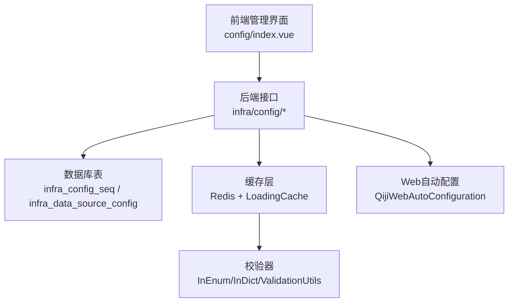
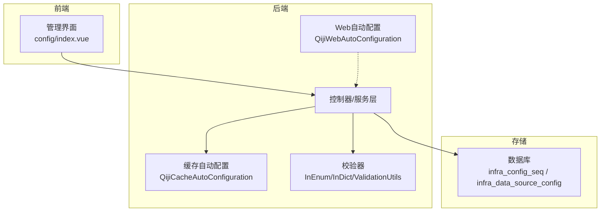
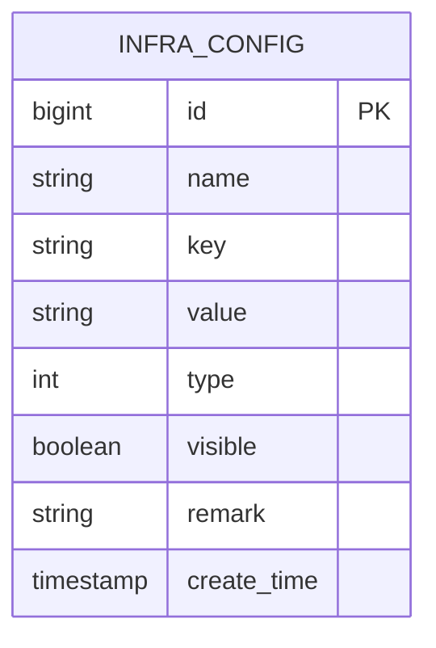
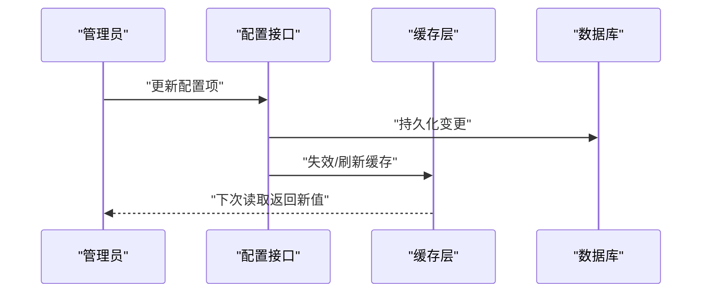
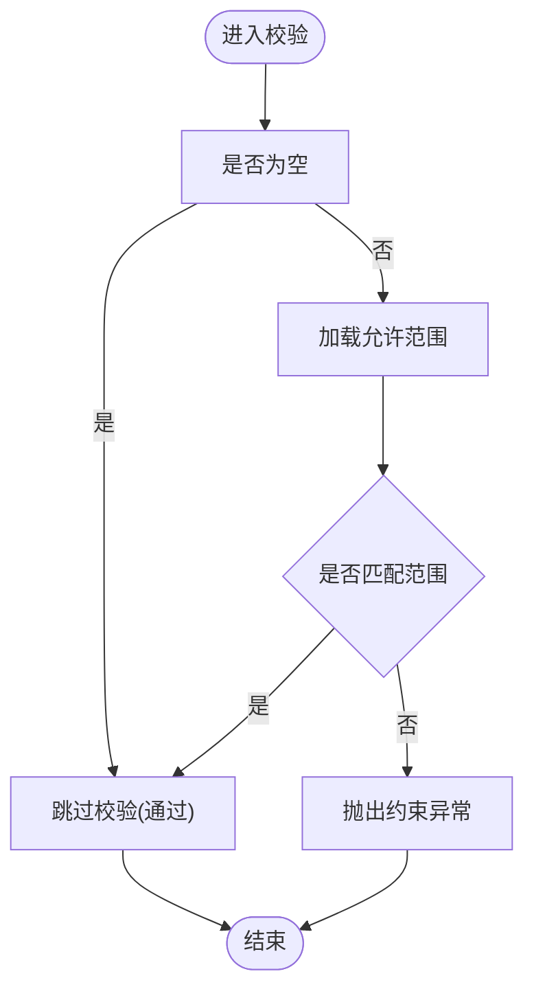
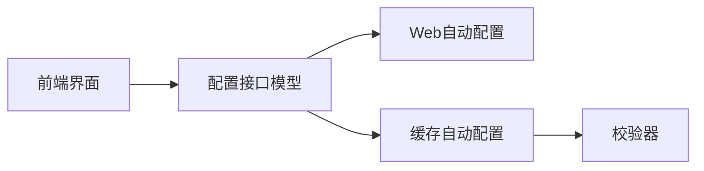

# 系统参数配置

<cite>
**本文引用的文件**
- [index.vue](file://frontend/admin-vue3/src/views/infra/config/index.vue)
- [index.ts](file://frontend/admin-uniapp/src/api/infra/config/index.ts)
- [infra_config_seq](file://backend/sql/mysql/ruoyi-vue-pro.sql)
- [infra_data_source_config](file://backend/sql/mysql/ruoyi-vue-pro.sql)
- [QijiCacheAutoConfiguration.java](file://backend/qiji-framework/qiji-spring-boot-starter-redis/src/main/java/com/qiji/cps/framework/redis/config/QijiCacheAutoConfiguration.java)
- [TimeoutRedisCacheManager.java](file://backend/qiji-framework/qiji-spring-boot-starter-redis/src/main/java/com/qiji/cps/framework/redis/core/TimeoutRedisCacheManager.java)
- [CpsCacheConfig.java](file://backend/qiji-module-cps/qiji-module-cps-biz/src/main/java/com/qiji/cps/module/cps/config/CpsCacheConfig.java)
- [CacheUtils.java](file://backend/qiji-framework/qiji-common/src/main/java/com/qiji/cps/framework/common/util/cache/CacheUtils.java)
- [InEnumValidator.java](file://backend/qiji-framework/qiji-common/src/main/java/com/qiji/cps/framework/common/validation/InEnumValidator.java)
- [InEnumCollectionValidator.java](file://backend/qiji-framework/qiji-common/src/main/java/com/qiji/cps/framework/common/validation/InEnumCollectionValidator.java)
- [InDictValidator.java](file://backend/qiji-framework/qiji-spring-boot-starter-excel/src/main/java/com/qiji/cps/framework/dict/validation/InDictValidator.java)
- [InDictCollectionValidator.java](file://backend/qiji-framework/qiji-spring-boot-starter-excel/src/main/java/com/qiji/cps/framework/dict/validation/InDictCollectionValidator.java)
- [ValidationUtils.java](file://backend/qiji-framework/qiji-common/src/main/java/com/qiji/cps/framework/common/util/validation/ValidationUtils.java)
- [QijiWebAutoConfiguration.java](file://backend/qiji-framework/qiji-spring-boot-starter-web/src/main/java/com/qiji/cps/framework/web/config/QijiWebAutoConfiguration.java)
</cite>

## 目录
1. [引言](#引言)
2. [项目结构](#项目结构)
3. [核心组件](#核心组件)
4. [架构总览](#架构总览)
5. [详细组件分析](#详细组件分析)
6. [依赖分析](#依赖分析)
7. [性能考虑](#性能考虑)
8. [故障排查指南](#故障排查指南)
9. [结论](#结论)
10. [附录](#附录)

## 引言
本文件面向AgenticCPS系统参数配置的工程实践，围绕配置项的数据结构设计、字段约束、默认值、分类管理、动态更新、缓存策略、验证机制以及导出导入与备份恢复等主题进行系统化梳理。文档以仓库中已存在的前端界面、后端缓存与校验能力为基础，结合数据库表结构与Spring Boot自动装配特性，给出可落地的实现指导与最佳实践。

## 项目结构
AgenticCPS的配置能力由多层协同构成：
- 前端管理界面：提供配置项的增删改查、按键名检索、类型筛选等操作入口
- 后端接口与模型：提供配置项的分页查询、详情获取、键值查询、创建与更新等REST接口
- 数据库存储：配置项持久化存储于基础设施表，并提供序列与注释
- 缓存与热更新：通过Redis与本地LoadingCache实现配置项的缓存与异步刷新
- 校验与约束：基于注解与工具类对配置项进行数据类型、枚举、字典范围等校验

图表来源
- [index.vue:1-47](file://frontend/admin-vue3/src/views/infra/config/index.vue#L1-L47)
- [index.ts:1-45](file://frontend/admin-uniapp/src/api/infra/config/index.ts#L1-L45)
- [infra_config_seq:345-382](file://backend/sql/mysql/ruoyi-vue-pro.sql#L345-L382)
- [QijiCacheAutoConfiguration.java:1-82](file://backend/qiji-framework/qiji-spring-boot-starter-redis/src/main/java/com/qiji/cps/framework/redis/config/QijiCacheAutoConfiguration.java#L1-L82)
- [CacheUtils.java:1-61](file://backend/qiji-framework/qiji-common/src/main/java/com/qiji/cps/framework/common/util/cache/CacheUtils.java#L1-L61)
- [InEnumValidator.java:1-43](file://backend/qiji-framework/qiji-common/src/main/java/com/qiji/cps/framework/common/validation/InEnumValidator.java#L1-L43)
- [InDictValidator.java:1-41](file://backend/qiji-framework/qiji-spring-boot-starter-excel/src/main/java/com/qiji/cps/framework/dict/validation/InDictValidator.java#L1-L41)
- [ValidationUtils.java:1-38](file://backend/qiji-framework/qiji-common/src/main/java/com/qiji/cps/framework/common/util/validation/ValidationUtils.java#L1-L38)
- [QijiWebAutoConfiguration.java:140-155](file://backend/qiji-framework/qiji-spring-boot-starter-web/src/main/java/com/qiji/cps/framework/web/config/QijiWebAutoConfiguration.java#L140-L155)

章节来源
- [index.vue:1-47](file://frontend/admin-vue3/src/views/infra/config/index.vue#L1-L47)
- [index.ts:1-45](file://frontend/admin-uniapp/src/api/infra/config/index.ts#L1-L45)
- [infra_config_seq:345-382](file://backend/sql/mysql/ruoyi-vue-pro.sql#L345-L382)

## 核心组件
- 前端配置管理界面：提供参数名称、键名、类型、创建时间等维度的查询与展示
- 配置API模型：定义配置项的字段集合，包括分类、名称、键名、值、类型、可见性、备注等
- 数据库表结构：基础设施配置表与数据源配置表，包含主键序列、字段注释与约束
- 缓存配置：Redis与本地LoadingCache的自动装配与自定义过期语法
- 校验器：枚举与字典范围校验、常用正则校验工具

章节来源
- [index.vue:1-47](file://frontend/admin-vue3/src/views/infra/config/index.vue#L1-L47)
- [index.ts:4-15](file://frontend/admin-uniapp/src/api/infra/config/index.ts#L4-L15)
- [infra_data_source_config:352-378](file://backend/sql/mysql/ruoyi-vue-pro.sql#L352-L378)
- [QijiCacheAutoConfiguration.java:29-82](file://backend/qiji-framework/qiji-spring-boot-starter-redis/src/main/java/com/qiji/cps/framework/redis/config/QijiCacheAutoConfiguration.java#L29-L82)
- [CacheUtils.java:15-61](file://backend/qiji-framework/qiji-common/src/main/java/com/qiji/cps/framework/common/util/cache/CacheUtils.java#L15-L61)
- [InEnumValidator.java:1-43](file://backend/qiji-framework/qiji-common/src/main/java/com/qiji/cps/framework/common/validation/InEnumValidator.java#L1-L43)
- [InDictValidator.java:1-41](file://backend/qiji-framework/qiji-spring-boot-starter-excel/src/main/java/com/qiji/cps/framework/dict/validation/InDictValidator.java#L1-L41)
- [ValidationUtils.java:1-38](file://backend/qiji-framework/qiji-common/src/main/java/com/qiji/cps/framework/common/util/validation/ValidationUtils.java#L1-L38)

## 架构总览
系统参数配置采用“前端界面 + 后端接口 + 缓存 + 校验 + 数据库”的分层架构。前端负责交互与查询；后端提供REST接口与自动装配；缓存层提升读性能并支持异步刷新；校验层保障输入质量；数据库持久化配置项。

图表来源
- [index.vue:1-47](file://frontend/admin-vue3/src/views/infra/config/index.vue#L1-L47)
- [QijiWebAutoConfiguration.java:140-155](file://backend/qiji-framework/qiji-spring-boot-starter-web/src/main/java/com/qiji/cps/framework/web/config/QijiWebAutoConfiguration.java#L140-L155)
- [QijiCacheAutoConfiguration.java:29-82](file://backend/qiji-framework/qiji-spring-boot-starter-redis/src/main/java/com/qiji/cps/framework/redis/config/QijiCacheAutoConfiguration.java#L29-L82)
- [infra_config_seq:345-382](file://backend/sql/mysql/ruoyi-vue-pro.sql#L345-L382)

## 详细组件分析

### 配置项数据模型与字段约束
- 字段集合：分类、名称、键名、值、类型、可见性、备注、创建时间
- 约束与默认值：数据库表提供字段默认值与注释，确保字段完整性与可读性
- 键名唯一性：建议在业务层或数据库层面建立唯一索引，避免重复键名导致的覆盖风险

图表来源
- [infra_config_seq:345-382](file://backend/sql/mysql/ruoyi-vue-pro.sql#L345-L382)

章节来源
- [index.ts:4-15](file://frontend/admin-uniapp/src/api/infra/config/index.ts#L4-L15)
- [infra_config_seq:345-382](file://backend/sql/mysql/ruoyi-vue-pro.sql#L345-L382)

### 配置项分类管理策略
- 类型字段：通过类型字段区分系统内置与自定义配置，便于权限控制与灰度发布
- 分类字段：通过分类字段实现配置项的逻辑分组，便于检索与治理
- 可见性字段：控制配置项在前端是否展示，支持运营侧的开关式管理

章节来源
- [index.vue:31-44](file://frontend/admin-vue3/src/views/infra/config/index.vue#L31-L44)
- [index.ts:4-15](file://frontend/admin-uniapp/src/api/infra/config/index.ts#L4-L15)

### 动态更新与热更新机制
- 缓存刷新策略：通过异步刷新的LoadingCache与Redis缓存，实现配置项的延迟一致与低抖动
- 自定义过期语法：支持在缓存命名中通过特定分隔符与单位声明过期时间，满足不同配置的时效需求
- 缓存管理器：基于TimeoutRedisCacheManager实现按缓存名定制TTL的能力

图表来源
- [CacheUtils.java:37-61](file://backend/qiji-framework/qiji-common/src/main/java/com/qiji/cps/framework/common/util/cache/CacheUtils.java#L37-L61)
- [TimeoutRedisCacheManager.java:21-34](file://backend/qiji-framework/qiji-spring-boot-starter-redis/src/main/java/com/qiji/cps/framework/redis/core/TimeoutRedisCacheManager.java#L21-L34)
- [QijiCacheAutoConfiguration.java:29-82](file://backend/qiji-framework/qiji-spring-boot-starter-redis/src/main/java/com/qiji/cps/framework/redis/config/QijiCacheAutoConfiguration.java#L29-L82)

章节来源
- [CacheUtils.java:15-61](file://backend/qiji-framework/qiji-common/src/main/java/com/qiji/cps/framework/common/util/cache/CacheUtils.java#L15-L61)
- [TimeoutRedisCacheManager.java:1-34](file://backend/qiji-framework/qiji-spring-boot-starter-redis/src/main/java/com/qiji/cps/framework/redis/core/TimeoutRedisCacheManager.java#L1-L34)
- [CpsCacheConfig.java:15-35](file://backend/qiji-module-cps/qiji-module-cps-biz/src/main/java/com/qiji/cps/module/cps/config/CpsCacheConfig.java#L15-L35)

### 配置验证机制
- 枚举范围校验：InEnum与InEnumCollectionValidator确保配置值属于预设枚举数组
- 字典范围校验：InDict与InDictCollectionValidator确保配置值属于数据字典范围
- 常用格式校验：ValidationUtils提供手机号、URL、XML NCName等常用正则校验
- 默认行为：空值默认不校验，提高兼容性与灵活性

图表来源
- [InEnumValidator.java:11-43](file://backend/qiji-framework/qiji-common/src/main/java/com/qiji/cps/framework/common/validation/InEnumValidator.java#L11-L43)
- [InEnumCollectionValidator.java:13-44](file://backend/qiji-framework/qiji-common/src/main/java/com/qiji/cps/framework/common/validation/InEnumCollectionValidator.java#L13-L44)
- [InDictValidator.java:10-41](file://backend/qiji-framework/qiji-spring-boot-starter-excel/src/main/java/com/qiji/cps/framework/dict/validation/InDictValidator.java#L10-L41)
- [InDictCollectionValidator.java:11-43](file://backend/qiji-framework/qiji-spring-boot-starter-excel/src/main/java/com/qiji/cps/framework/dict/validation/InDictCollectionValidator.java#L11-L43)
- [ValidationUtils.java:19-38](file://backend/qiji-framework/qiji-common/src/main/java/com/qiji/cps/framework/common/util/validation/ValidationUtils.java#L19-L38)

章节来源
- [InEnumValidator.java:1-43](file://backend/qiji-framework/qiji-common/src/main/java/com/qiji/cps/framework/common/validation/InEnumValidator.java#L1-L43)
- [InEnumCollectionValidator.java:1-44](file://backend/qiji-framework/qiji-common/src/main/java/com/qiji/cps/framework/common/validation/InEnumCollectionValidator.java#L1-L44)
- [InDictValidator.java:1-41](file://backend/qiji-framework/qiji-spring-boot-starter-excel/src/main/java/com/qiji/cps/framework/dict/validation/InDictValidator.java#L1-L41)
- [InDictCollectionValidator.java:1-43](file://backend/qiji-framework/qiji-spring-boot-starter-excel/src/main/java/com/qiji/cps/framework/dict/validation/InDictCollectionValidator.java#L1-L43)
- [ValidationUtils.java:1-38](file://backend/qiji-framework/qiji-common/src/main/java/com/qiji/cps/framework/common/util/validation/ValidationUtils.java#L1-L38)

### 配置导出导入、备份恢复与版本管理
- 导出导入：建议通过接口批量导出配置项（含分类、键名、值、类型、可见性、备注），并以标准格式（如CSV/JSON）保存；导入时按键名进行幂等更新
- 备份恢复：数据库层面定期备份基础设施配置表；恢复时先回滚到目标时间点，再执行增量恢复
- 版本管理：在配置项中增加版本号字段，配合变更日志表记录每次修改的上下文与影响范围；支持灰度发布与回滚

说明：上述为通用工程实践建议，具体实现需结合业务场景扩展接口与流程。

## 依赖分析
- 前端依赖后端接口模型与REST调用，通过统一的HTTP客户端封装请求
- 后端依赖缓存自动配置与Web自动配置，确保缓存序列化与RestTemplate可用
- 校验器依赖数据字典框架与枚举常量，形成统一的约束体系

图表来源
- [index.ts:1-45](file://frontend/admin-uniapp/src/api/infra/config/index.ts#L1-L45)
- [QijiWebAutoConfiguration.java:140-155](file://backend/qiji-framework/qiji-spring-boot-starter-web/src/main/java/com/qiji/cps/framework/web/config/QijiWebAutoConfiguration.java#L140-L155)
- [QijiCacheAutoConfiguration.java:29-82](file://backend/qiji-framework/qiji-spring-boot-starter-redis/src/main/java/com/qiji/cps/framework/redis/config/QijiCacheAutoConfiguration.java#L29-L82)
- [InEnumValidator.java:1-43](file://backend/qiji-framework/qiji-common/src/main/java/com/qiji/cps/framework/common/validation/InEnumValidator.java#L1-L43)

章节来源
- [index.ts:1-45](file://frontend/admin-uniapp/src/api/infra/config/index.ts#L1-L45)
- [QijiWebAutoConfiguration.java:140-155](file://backend/qiji-framework/qiji-spring-boot-starter-web/src/main/java/com/qiji/cps/framework/web/config/QijiWebAutoConfiguration.java#L140-L155)
- [QijiCacheAutoConfiguration.java:29-82](file://backend/qiji-framework/qiji-spring-boot-starter-redis/src/main/java/com/qiji/cps/framework/redis/config/QijiCacheAutoConfiguration.java#L29-L82)

## 性能考虑
- 缓存命中率：合理设置TTL与刷新周期，避免热点配置频繁抖动
- 批量操作：导出/导入采用分页批量处理，减少内存占用
- 序列化优化：统一使用JSON序列化，降低跨语言/跨进程传输成本
- 并发控制：异步刷新与并发读取结合，保证一致性与吞吐量平衡

## 故障排查指南
- 校验失败：检查配置值是否在允许范围内，确认枚举/字典是否正确配置
- 缓存不生效：确认缓存命名与TTL语法是否符合约定，检查Redis连接与序列化配置
- 接口异常：核对请求参数与响应模型，定位网络与服务端异常
- 数据不一致：核查数据库事务与缓存失效策略，确保最终一致性

章节来源
- [InEnumValidator.java:25-40](file://backend/qiji-framework/qiji-common/src/main/java/com/qiji/cps/framework/common/validation/InEnumValidator.java#L25-L40)
- [InDictValidator.java:20-37](file://backend/qiji-framework/qiji-spring-boot-starter-excel/src/main/java/com/qiji/cps/framework/dict/validation/InDictValidator.java#L20-L37)
- [ValidationUtils.java:21-38](file://backend/qiji-framework/qiji-common/src/main/java/com/qiji/cps/framework/common/util/validation/ValidationUtils.java#L21-L38)
- [QijiCacheAutoConfiguration.java:37-82](file://backend/qiji-framework/qiji-spring-boot-starter-redis/src/main/java/com/qiji/cps/framework/redis/config/QijiCacheAutoConfiguration.java#L37-L82)

## 结论
AgenticCPS的参数配置体系以数据库为核心、前端界面为入口、缓存与校验为两翼，形成了高可用、可演进的配置管理闭环。通过明确的字段约束、分类策略、动态更新与验证机制，能够有效支撑业务的快速迭代与稳定运行。建议在此基础上完善导出导入、备份恢复与版本管理流程，进一步提升配置治理水平。

## 附录
- 数据库表结构参考：基础设施配置表与数据源配置表
- 缓存配置参考：Redis与LoadingCache自动装配及自定义TTL语法
- 校验器参考：枚举/字典/常用格式校验工具

章节来源
- [infra_data_source_config:352-378](file://backend/sql/mysql/ruoyi-vue-pro.sql#L352-L378)
- [QijiCacheAutoConfiguration.java:29-82](file://backend/qiji-framework/qiji-spring-boot-starter-redis/src/main/java/com/qiji/cps/framework/redis/config/QijiCacheAutoConfiguration.java#L29-L82)
- [CacheUtils.java:15-61](file://backend/qiji-framework/qiji-common/src/main/java/com/qiji/cps/framework/common/util/cache/CacheUtils.java#L15-L61)
- [InEnumValidator.java:1-43](file://backend/qiji-framework/qiji-common/src/main/java/com/qiji/cps/framework/common/validation/InEnumValidator.java#L1-L43)
- [InDictValidator.java:1-41](file://backend/qiji-framework/qiji-spring-boot-starter-excel/src/main/java/com/qiji/cps/framework/dict/validation/InDictValidator.java#L1-L41)
- [ValidationUtils.java:1-38](file://backend/qiji-framework/qiji-common/src/main/java/com/qiji/cps/framework/common/util/validation/ValidationUtils.java#L1-L38)