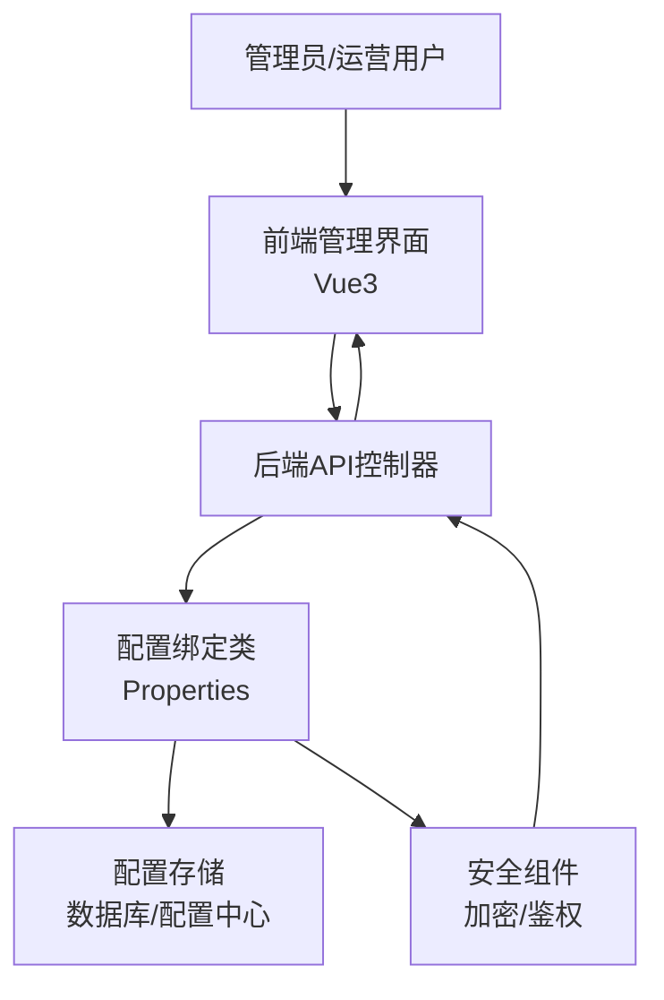
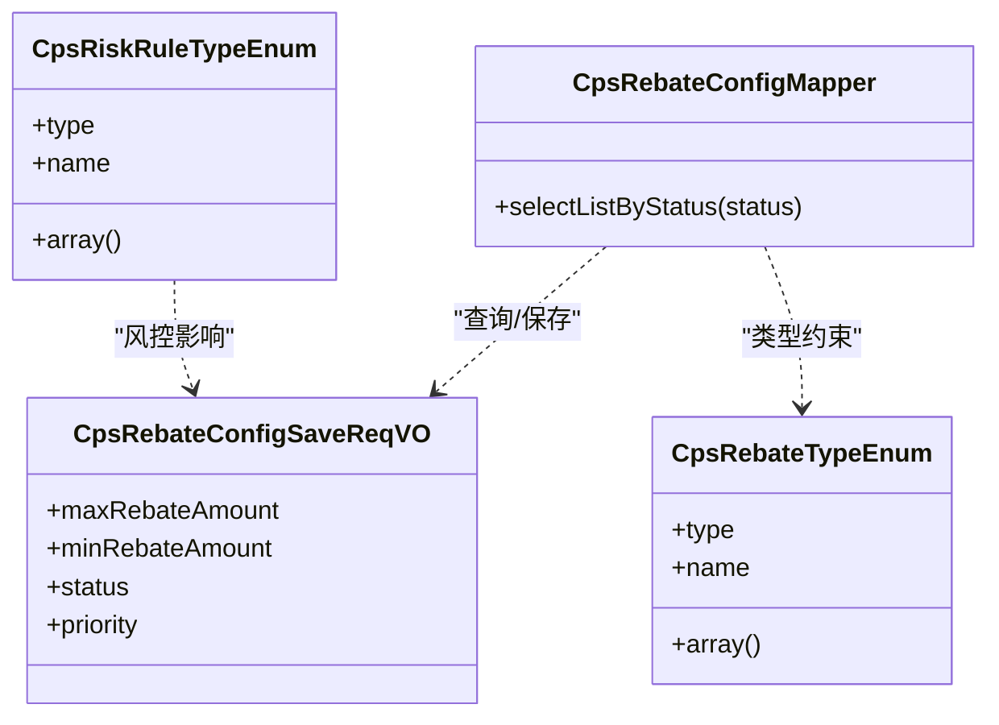
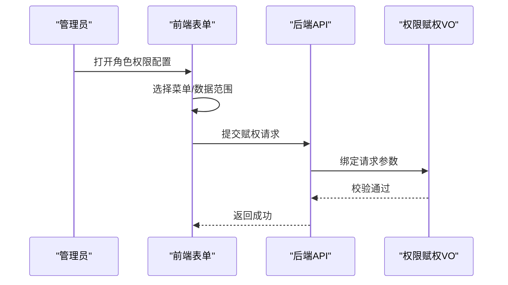
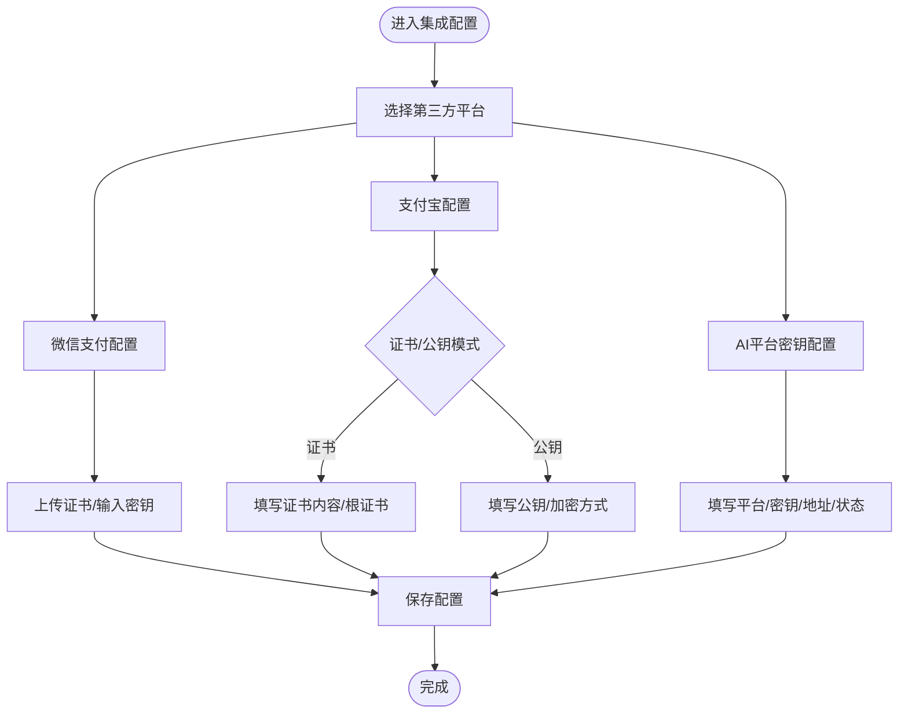
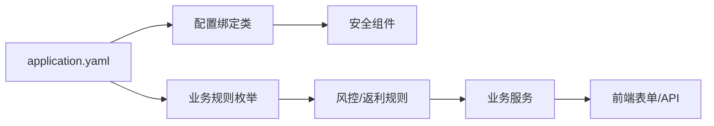

# 自定义配置

<cite>
**本文引用的文件**
- [application.yaml](file://backend/qiji-server/src/main/resources/application.yaml)
- [application-dev.yaml](file://backend/qiji-server/src/main/resources/application-dev.yaml)
- [ApiEncryptProperties.java](file://backend/qiji-framework/qiji-spring-boot-starter-web/src/main/java/com/qiji/cps/framework/encrypt/config/ApiEncryptProperties.java)
- [EncryptTypeHandler.java](file://backend/qiji-framework/qiji-spring-boot-starter-mybatis/src/main/java/com/qiji/cps/framework/mybatis/core/type/EncryptTypeHandler.java)
- [CpsRiskRuleTypeEnum.java](file://backend/qiji-module-cps/qiji-module-cps-api/src/main/java/com/qiji/cps/module/cps/enums/CpsRiskRuleTypeEnum.java)
- [CpsRebateTypeEnum.java](file://backend/qiji-module-cps/qiji-module-cps-api/src/main/java/com/qiji/cps/module/cps/enums/CpsRebateTypeEnum.java)
- [CpsRebateConfigSaveReqVO.java](file://backend/qiji-module-cps/qiji-module-cps-biz/src/main/java/com/qiji/cps/module/cps/controller/admin/rebate/vo/CpsRebateConfigSaveReqVO.java)
- [CpsRebateConfigMapper.java](file://backend/qiji-module-cps/qiji-module-cps-biz/src/main/java/com/qiji/cps/module/cps/dal/mysql/rebate/CpsRebateConfigMapper.java)
- [CpsGetRebateSummaryToolFunction.java](file://backend/qiji-module-cps/qiji-module-cps-biz/src/main/java/com/qiji/cps/module/cps/mcp/tool/CpsGetRebateSummaryToolFunction.java)
- [PermissionAssignRoleMenuReqVO.java](file://backend/qiji-module-system/src/main/java/com/qiji/cps/module/system/controller/admin/permission/vo/permission/PermissionAssignRoleMenuReqVO.java)
- [index.ts](file://frontend/admin-vue3/src/api/system/permission/index.ts)
- [RoleDataPermissionForm.vue](file://frontend/admin-vue3/src/views/system/role/RoleDataPermissionForm.vue)
- [index.vue](file://frontend/admin-vue3/src/views/system/role/index.vue)
- [WeixinChannelForm.vue](file://frontend/admin-vue3/src/views/pay/app/components/channel/WeixinChannelForm.vue)
- [AiApiKeySaveReqVO.java](file://backend/qiji-module-ai/src/main/java/com/qiji/cps/module/ai/controller/admin/model/vo/apikey/AiApiKeySaveReqVO.java)
- [AiApiKeyRespVO.java](file://backend/qiji-module-ai/src/main/java/com/qiji/cps/module/ai/controller/admin/model/vo/apikey/AiApiKeyRespVO.java)
- [AiApiKeyService.java](file://backend/qiji-module-ai/src/main/java/com/qiji/cps/module/ai/service/model/AiApiKeyService.java)
- [AlipayPayClientConfig.java](file://backend/qiji-module-pay/src/main/java/com/qiji/cps/module/pay/framework/pay/core/client/impl/alipay/AlipayPayClientConfig.java)
</cite>

## 目录
1. [简介](#简介)
2. [项目结构](#项目结构)
3. [核心组件](#核心组件)
4. [架构总览](#架构总览)
5. [详细组件分析](#详细组件分析)
6. [依赖分析](#依赖分析)
7. [性能考虑](#性能考虑)
8. [故障排查指南](#故障排查指南)
9. [结论](#结论)
10. [附录](#附录)

## 简介
本文件面向AgenticCPS系统的“自定义配置”主题，围绕系统参数配置、业务规则配置、权限控制配置、系统集成配置以及高级配置管理（文件管理、加密、版本与回滚）进行系统化梳理。目标是帮助开发者与运维人员理解配置项的来源、默认值、动态更新能力、验证机制与安全策略，并提供可落地的实践建议。

## 项目结构
AgenticCPS采用前后端分离架构，配置主要集中在后端Spring Boot的多环境YAML配置文件中，配合自研starter与前端管理界面实现可视化配置与权限控制。

```mermaid
graph TB
subgraph "后端配置层"
A["application.yaml<br/>主配置"]
B["application-dev.yaml<br/>开发环境覆盖"]
C["ApiEncryptProperties.java<br/>API加密配置绑定"]
D["EncryptTypeHandler.java<br/>字段级加密处理器"]
end
subgraph "业务规则配置"
E["CpsRiskRuleTypeEnum.java<br/>风控规则类型"]
F["CpsRebateTypeEnum.java<br/>返利类型枚举"]
G["CpsRebateConfigSaveReqVO.java<br/>返利配置请求VO"]
H["CpsRebateConfigMapper.java<br/>返利配置持久层"]
end
subgraph "权限控制配置"
I["PermissionAssignRoleMenuReqVO.java<br/>角色菜单赋权VO"]
J["index.ts<br/>权限API封装"]
K["RoleDataPermissionForm.vue<br/>数据权限表单"]
L["index.vue<br/>角色管理页面"]
end
subgraph "系统集成配置"
M["WeixinChannelForm.vue<br/>微信支付通道配置"]
N["AiApiKeySaveReqVO.java<br/>AI密钥配置VO"]
O["AiApiKeyService.java<br/>AI密钥服务接口"]
P["AlipayPayClientConfig.java<br/>支付宝支付客户端配置"]
end
A --> C
A --> D
A --> E
A --> F
A --> G
A --> H
A --> I
A --> J
A --> K
A --> L
A --> M
A --> N
A --> O
A --> P
```

图表来源
- [application.yaml:1-362](file://backend/qiji-server/src/main/resources/application.yaml#L1-L362)
- [application-dev.yaml:1-213](file://backend/qiji-server/src/main/resources/application-dev.yaml#L1-L213)
- [ApiEncryptProperties.java:1-70](file://backend/qiji-framework/qiji-spring-boot-starter-web/src/main/java/com/qiji/cps/framework/encrypt/config/ApiEncryptProperties.java#L1-L70)
- [EncryptTypeHandler.java:40-75](file://backend/qiji-framework/qiji-spring-boot-starter-mybatis/src/main/java/com/qiji/cps/framework/mybatis/core/type/EncryptTypeHandler.java#L40-L75)
- [CpsRiskRuleTypeEnum.java:1-39](file://backend/qiji-module-cps/qiji-module-cps-api/src/main/java/com/qiji/cps/module/cps/enums/CpsRiskRuleTypeEnum.java#L1-L39)
- [CpsRebateTypeEnum.java:1-40](file://backend/qiji-module-cps/qiji-module-cps-api/src/main/java/com/qiji/cps/module/cps/enums/CpsRebateTypeEnum.java#L1-L40)
- [CpsRebateConfigSaveReqVO.java:35-49](file://backend/qiji-module-cps/qiji-module-cps-biz/src/main/java/com/qiji/cps/module/cps/controller/admin/rebate/vo/CpsRebateConfigSaveReqVO.java#L35-L49)
- [CpsRebateConfigMapper.java:1-24](file://backend/qiji-module-cps/qiji-module-cps-biz/src/main/java/com/qiji/cps/module/cps/dal/mysql/rebate/CpsRebateConfigMapper.java#L1-L24)
- [PermissionAssignRoleMenuReqVO.java:1-21](file://backend/qiji-module-system/src/main/java/com/qiji/cps/module/system/controller/admin/permission/vo/permission/PermissionAssignRoleMenuReqVO.java#L1-L21)
- [index.ts:1-42](file://frontend/admin-vue3/src/api/system/permission/index.ts#L1-L42)
- [RoleDataPermissionForm.vue:72-110](file://frontend/admin-vue3/src/views/system/role/RoleDataPermissionForm.vue#L72-L110)
- [index.vue:111-154](file://frontend/admin-vue3/src/views/system/role/index.vue#L111-L154)
- [WeixinChannelForm.vue:66-105](file://frontend/admin-vue3/src/views/pay/app/components/channel/WeixinChannelForm.vue#L66-L105)
- [AiApiKeySaveReqVO.java:1-34](file://backend/qiji-module-ai/src/main/java/com/qiji/cps/module/ai/controller/admin/model/vo/apikey/AiApiKeySaveReqVO.java#L1-L34)
- [AiApiKeyService.java:1-60](file://backend/qiji-module-ai/src/main/java/com/qiji/cps/module/ai/service/model/AiApiKeyService.java#L1-L60)
- [AlipayPayClientConfig.java:80-128](file://backend/qiji-module-pay/src/main/java/com/qiji/cps/module/pay/framework/pay/core/client/impl/alipay/AlipayPayClientConfig.java#L80-L128)

章节来源
- [application.yaml:1-362](file://backend/qiji-server/src/main/resources/application.yaml#L1-L362)
- [application-dev.yaml:1-213](file://backend/qiji-server/src/main/resources/application-dev.yaml#L1-L213)

## 核心组件
- 配置中心与环境隔离：通过application.yaml作为主配置，application-dev.yaml覆盖开发环境，实现不同环境的差异化配置。
- API加密配置：通过ApiEncryptProperties绑定qiji.api-encrypt配置，支持对称/非对称算法与密钥管理。
- 字段级加密：MyBatis TypeHandler在读写数据库时自动加解密敏感字段，密钥来源于配置项。
- 业务规则枚举：风控规则类型、返利类型等以枚举形式固化在代码中，便于统一管理与扩展。
- 权限控制：后端VO定义权限赋权参数，前端提供可视化表单与API封装，形成“配置即权限”的管理模式。
- 系统集成：第三方平台（微信支付、支付宝、AI平台）通过独立配置对象与表单组件实现参数化配置。

章节来源
- [ApiEncryptProperties.java:1-70](file://backend/qiji-framework/qiji-spring-boot-starter-web/src/main/java/com/qiji/cps/framework/encrypt/config/ApiEncryptProperties.java#L1-L70)
- [EncryptTypeHandler.java:40-75](file://backend/qiji-framework/qiji-spring-boot-starter-mybatis/src/main/java/com/qiji/cps/framework/mybatis/core/type/EncryptTypeHandler.java#L40-L75)
- [CpsRiskRuleTypeEnum.java:1-39](file://backend/qiji-module-cps/qiji-module-cps-api/src/main/java/com/qiji/cps/module/cps/enums/CpsRiskRuleTypeEnum.java#L1-L39)
- [CpsRebateTypeEnum.java:1-40](file://backend/qiji-module-cps/qiji-module-cps-api/src/main/java/com/qiji/cps/module/cps/enums/CpsRebateTypeEnum.java#L1-L40)
- [PermissionAssignRoleMenuReqVO.java:1-21](file://backend/qiji-module-system/src/main/java/com/qiji/cps/module/system/controller/admin/permission/vo/permission/PermissionAssignRoleMenuReqVO.java#L1-L21)
- [index.ts:1-42](file://frontend/admin-vue3/src/api/system/permission/index.ts#L1-L42)

## 架构总览
AgenticCPS的配置管理遵循“集中式配置 + 可视化管理 + 安全加固”的设计思路，后端通过YAML配置与@ConfigurationProperties绑定，前端通过API与表单组件实现配置的增删改查与即时生效。

图表来源
- [application.yaml:1-362](file://backend/qiji-server/src/main/resources/application.yaml#L1-L362)
- [ApiEncryptProperties.java:1-70](file://backend/qiji-framework/qiji-spring-boot-starter-web/src/main/java/com/qiji/cps/framework/encrypt/config/ApiEncryptProperties.java#L1-L70)
- [EncryptTypeHandler.java:40-75](file://backend/qiji-framework/qiji-spring-boot-starter-mybatis/src/main/java/com/qiji/cps/framework/mybatis/core/type/EncryptTypeHandler.java#L40-L75)

## 详细组件分析

### 系统参数配置
- 配置来源与层次
  - 主配置：application.yaml集中定义Spring、MyBatis、Redis、消息队列、AI向量存储、安全、租户、短信、交易等模块的默认配置。
  - 环境覆盖：application-dev.yaml覆盖数据库、Redis、RocketMQ、Kafka、RabbitMQ、Actuator、JustAuth等开发环境参数。
- 关键配置要点
  - Servlet与Jackson：文件上传大小、UTF-8编码、序列化格式等。
  - Cache与Redis：缓存类型与TTL。
  - MyBatis Plus：驼峰映射、逻辑删除、Banner、加密器密钥。
  - 消息队列：RocketMQ、Kafka、RabbitMQ的基础连接参数。
  - AI向量存储：Redis/Qdrant/Milvus的索引/集合命名与连接参数。
  - API加密：算法、请求/响应密钥、请求头名称。
  - 租户与多数据源：忽略表、缓存、访问URL白名单等。
  - 短信验证码：有效期、发送频率、每日上限、演示验证码。
  - 交易与快递：订单过期时间、快递服务商与密钥。
- 动态配置更新
  - 对于运行时可变参数（如租户忽略表、短信配置），可在配置中心或数据库中维护，结合刷新机制实现动态生效。
  - 对于启动参数（如数据库连接、消息队列地址），需重启服务以重新加载。

章节来源
- [application.yaml:1-362](file://backend/qiji-server/src/main/resources/application.yaml#L1-L362)
- [application-dev.yaml:1-213](file://backend/qiji-server/src/main/resources/application-dev.yaml#L1-L213)

### 业务规则配置
- 风控规则配置
  - 风控规则类型枚举定义了“频率限制”“黑名单”等规则类型，便于在业务层统一识别与处理。
- 返利计算规则
  - 返利类型枚举定义了“返利入账”“返利扣回”“系统调整”，支撑返利流水的分类统计。
  - 返利配置请求VO定义了最大/最小返利金额、状态、优先级等参数，支持灵活配置与排序。
  - 返利配置Mapper按状态与优先级查询配置列表，确保高优先级规则优先执行。
- 工具函数与配置联动
  - MCP工具函数通过上下文获取登录用户ID，结合返利配置与记录映射，提供“返利汇总”等能力。

图表来源
- [CpsRiskRuleTypeEnum.java:1-39](file://backend/qiji-module-cps/qiji-module-cps-api/src/main/java/com/qiji/cps/module/cps/enums/CpsRiskRuleTypeEnum.java#L1-L39)
- [CpsRebateTypeEnum.java:1-40](file://backend/qiji-module-cps/qiji-module-cps-api/src/main/java/com/qiji/cps/module/cps/enums/CpsRebateTypeEnum.java#L1-L40)
- [CpsRebateConfigSaveReqVO.java:35-49](file://backend/qiji-module-cps/qiji-module-cps-biz/src/main/java/com/qiji/cps/module/cps/controller/admin/rebate/vo/CpsRebateConfigSaveReqVO.java#L35-L49)
- [CpsRebateConfigMapper.java:1-24](file://backend/qiji-module-cps/qiji-module-cps-biz/src/main/java/com/qiji/cps/module/cps/dal/mysql/rebate/CpsRebateConfigMapper.java#L1-L24)

章节来源
- [CpsRiskRuleTypeEnum.java:1-39](file://backend/qiji-module-cps/qiji-module-cps-api/src/main/java/com/qiji/cps/module/cps/enums/CpsRiskRuleTypeEnum.java#L1-L39)
- [CpsRebateTypeEnum.java:1-40](file://backend/qiji-module-cps/qiji-module-cps-api/src/main/java/com/qiji/cps/module/cps/enums/CpsRebateTypeEnum.java#L1-L40)
- [CpsRebateConfigSaveReqVO.java:35-49](file://backend/qiji-module-cps/qiji-module-cps-biz/src/main/java/com/qiji/cps/module/cps/controller/admin/rebate/vo/CpsRebateConfigSaveReqVO.java#L35-L49)
- [CpsRebateConfigMapper.java:1-24](file://backend/qiji-module-cps/qiji-module-cps-biz/src/main/java/com/qiji/cps/module/cps/dal/mysql/rebate/CpsRebateConfigMapper.java#L1-L24)

### 权限控制配置
- 角色菜单赋权
  - 后端通过PermissionAssignRoleMenuReqVO定义角色与菜单ID集合的赋权参数。
  - 前端提供RoleDataPermissionForm.vue与index.vue，支持角色数据权限选择与菜单权限分配。
  - API封装index.ts提供assignRoleMenu、assignRoleDataScope、assignUserRole等接口。
- 操作权限验证
  - 前端指令v-hasPermi用于按钮级权限控制，结合后端菜单与角色权限实现细粒度校验。

图表来源
- [PermissionAssignRoleMenuReqVO.java:1-21](file://backend/qiji-module-system/src/main/java/com/qiji/cps/module/system/controller/admin/permission/vo/permission/PermissionAssignRoleMenuReqVO.java#L1-L21)
- [index.ts:1-42](file://frontend/admin-vue3/src/api/system/permission/index.ts#L1-L42)
- [RoleDataPermissionForm.vue:72-110](file://frontend/admin-vue3/src/views/system/role/RoleDataPermissionForm.vue#L72-L110)
- [index.vue:111-154](file://frontend/admin-vue3/src/views/system/role/index.vue#L111-L154)

章节来源
- [PermissionAssignRoleMenuReqVO.java:1-21](file://backend/qiji-module-system/src/main/java/com/qiji/cps/module/system/controller/admin/permission/vo/permission/PermissionAssignRoleMenuReqVO.java#L1-L21)
- [index.ts:1-42](file://frontend/admin-vue3/src/api/system/permission/index.ts#L1-L42)
- [RoleDataPermissionForm.vue:72-110](file://frontend/admin-vue3/src/views/system/role/RoleDataPermissionForm.vue#L72-L110)
- [index.vue:111-154](file://frontend/admin-vue3/src/views/system/role/index.vue#L111-L154)

### 系统集成配置
- 第三方平台配置
  - 微信支付通道：WeixinChannelForm.vue提供证书与API V3密钥的配置入口，支持p12证书上传与密钥输入。
  - 支付宝支付客户端：AlipayPayClientConfig.java定义公钥/证书模式下的密钥与加密参数，支持AES接口内容加密。
  - AI平台密钥：AiApiKeySaveReqVO与AiApiKeyService定义AI平台密钥的新增/修改/删除/校验与分页查询。
- API密钥管理
  - 后端通过AiApiKeyService接口管理密钥生命周期，前端通过表单组件进行可视化配置。
- 连接参数与认证
  - 各平台的连接参数（域名、端口、证书、密钥）均以配置项形式集中管理，便于切换与审计。

图表来源
- [WeixinChannelForm.vue:66-105](file://frontend/admin-vue3/src/views/pay/app/components/channel/WeixinChannelForm.vue#L66-L105)
- [AlipayPayClientConfig.java:80-128](file://backend/qiji-module-pay/src/main/java/com/qiji/cps/module/pay/framework/pay/core/client/impl/alipay/AlipayPayClientConfig.java#L80-L128)
- [AiApiKeySaveReqVO.java:1-34](file://backend/qiji-module-ai/src/main/java/com/qiji/cps/module/ai/controller/admin/model/vo/apikey/AiApiKeySaveReqVO.java#L1-L34)
- [AiApiKeyService.java:1-60](file://backend/qiji-module-ai/src/main/java/com/qiji/cps/module/ai/service/model/AiApiKeyService.java#L1-L60)

章节来源
- [WeixinChannelForm.vue:66-105](file://frontend/admin-vue3/src/views/pay/app/components/channel/WeixinChannelForm.vue#L66-L105)
- [AlipayPayClientConfig.java:80-128](file://backend/qiji-module-pay/src/main/java/com/qiji/cps/module/pay/framework/pay/core/client/impl/alipay/AlipayPayClientConfig.java#L80-L128)
- [AiApiKeySaveReqVO.java:1-34](file://backend/qiji-module-ai/src/main/java/com/qiji/cps/module/ai/controller/admin/model/vo/apikey/AiApiKeySaveReqVO.java#L1-L34)
- [AiApiKeyService.java:1-60](file://backend/qiji-module-ai/src/main/java/com/qiji/cps/module/ai/service/model/AiApiKeyService.java#L1-L60)

### 高级配置管理
- 配置文件管理
  - 采用多环境YAML文件分层管理，主配置与环境覆盖分离，便于CI/CD与多环境部署。
- 配置加密
  - API加密：通过ApiEncryptProperties绑定算法与请求/响应密钥，支持AES/RSA等。
  - 字段加密：EncryptTypeHandler在数据库读写时对敏感字段进行加解密，密钥来自配置项。
- 配置版本控制与回滚
  - 建议将YAML配置纳入版本控制系统，结合Git标签与分支策略实现版本化管理。
  - 对于关键配置变更，采用灰度发布与回滚策略，确保变更可逆。
- 配置验证
  - 后端通过注解（如@NotNull、@NotBlank）与分组校验（如ModePublicKey/ModeCertificate）实现参数合法性校验。
  - 前端通过表单校验与API返回错误信息，提升配置录入质量。

章节来源
- [ApiEncryptProperties.java:1-70](file://backend/qiji-framework/qiji-spring-boot-starter-web/src/main/java/com/qiji/cps/framework/encrypt/config/ApiEncryptProperties.java#L1-L70)
- [EncryptTypeHandler.java:40-75](file://backend/qiji-framework/qiji-spring-boot-starter-mybatis/src/main/java/com/qiji/cps/framework/mybatis/core/type/EncryptTypeHandler.java#L40-L75)
- [AlipayPayClientConfig.java:80-128](file://backend/qiji-module-pay/src/main/java/com/qiji/cps/module/pay/framework/pay/core/client/impl/alipay/AlipayPayClientConfig.java#L80-L128)

## 依赖分析
- 配置绑定与加载
  - application.yaml通过@ConfigurationProperties绑定至各类配置类，如ApiEncryptProperties、qiji.*等命名空间。
- 业务耦合
  - 返利配置与风控规则类型存在间接耦合：风控规则可能影响返利配置的启用/优先级。
- 前后端交互
  - 权限配置通过API封装与前端表单组件实现闭环，确保配置变更可追溯、可审计。

图表来源
- [application.yaml:1-362](file://backend/qiji-server/src/main/resources/application.yaml#L1-L362)
- [ApiEncryptProperties.java:1-70](file://backend/qiji-framework/qiji-spring-boot-starter-web/src/main/java/com/qiji/cps/framework/encrypt/config/ApiEncryptProperties.java#L1-L70)
- [CpsRiskRuleTypeEnum.java:1-39](file://backend/qiji-module-cps/qiji-module-cps-api/src/main/java/com/qiji/cps/module/cps/enums/CpsRiskRuleTypeEnum.java#L1-L39)
- [CpsRebateTypeEnum.java:1-40](file://backend/qiji-module-cps/qiji-module-cps-api/src/main/java/com/qiji/cps/module/cps/enums/CpsRebateTypeEnum.java#L1-L40)

章节来源
- [application.yaml:1-362](file://backend/qiji-server/src/main/resources/application.yaml#L1-L362)

## 性能考虑
- 配置加载性能
  - 合理拆分配置文件，避免单文件过大；仅在必要时启用全局翻译与复杂缓存。
- 加密性能
  - API加密与字段加密会带来CPU开销，建议在高并发场景评估对称加密算法与密钥长度。
- 缓存与TTL
  - 合理设置Redis TTL与缓存命中率，避免热点配置频繁失效导致抖动。

## 故障排查指南
- 配置项缺失或非法
  - 检查application.yaml与application-dev.yaml中的键是否存在拼写错误或类型不匹配。
  - 对于必填项（如API密钥、数据库连接），确保在对应环境文件中正确配置。
- 加密相关问题
  - API加密：核对算法与请求/响应密钥长度与格式；确认请求头名称一致。
  - 字段加密：确认mybatis-plus.encryptor.password配置正确且与数据库中加密值匹配。
- 权限配置异常
  - 检查前端v-hasPermi指令与后端菜单/角色权限是否一致；确认API返回的角色/菜单数据正确。
- 第三方平台接入失败
  - 微信支付：确认p12证书与API V3密钥是否正确上传与配置。
  - 支付宝：确认证书/公钥模式与对应字段是否完整；检查AES加密参数。

章节来源
- [ApiEncryptProperties.java:1-70](file://backend/qiji-framework/qiji-spring-boot-starter-web/src/main/java/com/qiji/cps/framework/encrypt/config/ApiEncryptProperties.java#L1-L70)
- [EncryptTypeHandler.java:40-75](file://backend/qiji-framework/qiji-spring-boot-starter-mybatis/src/main/java/com/qiji/cps/framework/mybatis/core/type/EncryptTypeHandler.java#L40-L75)
- [WeixinChannelForm.vue:66-105](file://frontend/admin-vue3/src/views/pay/app/components/channel/WeixinChannelForm.vue#L66-L105)
- [AlipayPayClientConfig.java:80-128](file://backend/qiji-module-pay/src/main/java/com/qiji/cps/module/pay/framework/pay/core/client/impl/alipay/AlipayPayClientConfig.java#L80-L128)

## 结论
AgenticCPS的配置管理体系以YAML为核心，结合自研starter与前端可视化界面，实现了系统参数、业务规则、权限控制与第三方集成的统一管理。通过明确的配置项定义、默认值设置、动态更新策略与安全加固（API加密、字段加密），系统在灵活性与安全性之间取得平衡。建议在生产环境中进一步完善配置版本控制、灰度发布与回滚机制，确保变更可控、可观测、可追溯。

## 附录
- 配置清单与默认值
  - API加密：enable、algorithm、requestKey、responseKey、header
  - 字段加密：mybatis-plus.encryptor.password
  - 租户：tenant.enable、ignore-urls、ignore-tables、ignore-caches
  - 短信验证码：sms-code.expire-times、send-frequency、send-maximum-quantity-per-day
  - 交易：trade.order.pay-expire-time、receive-expire-time、comment-expire-time
- 建议的配置管理流程
  - 变更评审 → 配置更新 → 测试验证 → 灰度发布 → 正式上线 → 回滚预案