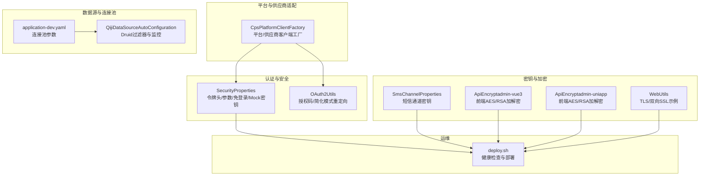
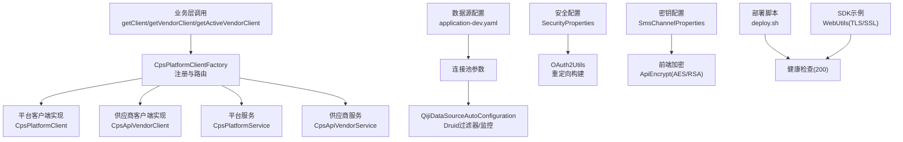
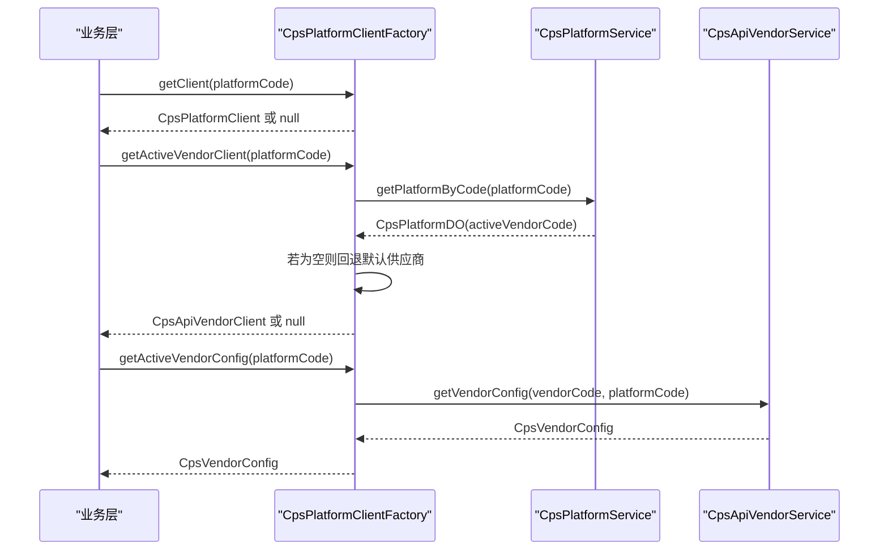
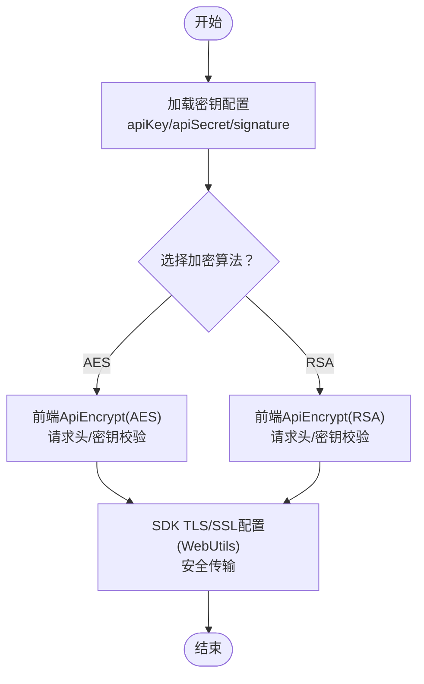
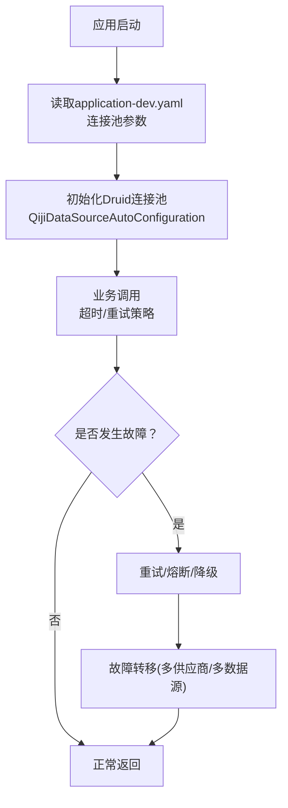
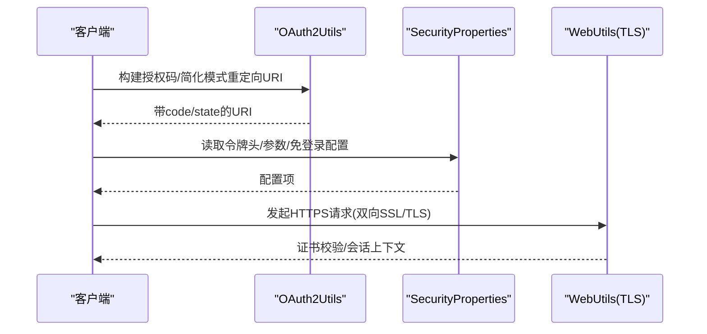
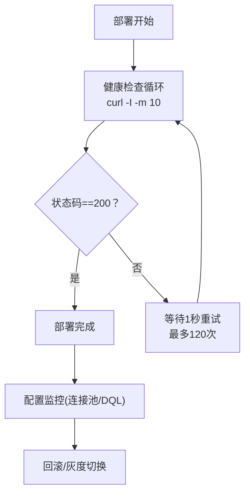
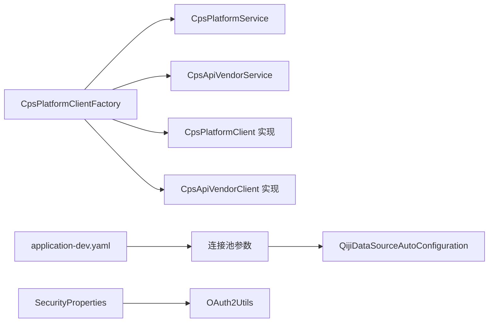

# 集成配置管理

<cite>
**本文引用的文件**
- [CpsPlatformClientFactory.java](file://backend/qiji-module-cps/qiji-module-cps-biz/src/main/java/com/qiji/cps/module/cps/client/CpsPlatformClientFactory.java)
- [CpsPlatformClientFactoryTest.java](file://backend/qiji-module-cps/qiji-module-cps-biz/src/test/java/com/qiji/cps/module/cps/client/CpsPlatformClientFactoryTest.java)
- [application-dev.yaml](file://backend/qiji-server/src/main/resources/application-dev.yaml)
- [QijiDataSourceAutoConfiguration.java](file://backend/qiji-framework/qiji-spring-boot-starter-mybatis/src/main/java/com/qiji/cps/framework/datasource/config/QijiDataSourceAutoConfiguration.java)
- [SecurityProperties.java](file://backend/qiji-framework/qiji-spring-boot-starter-security/src/main/java/com/qiji/cps/framework/security/config/SecurityProperties.java)
- [OAuth2Utils.java](file://backend/qiji-module-system/src/main/java/com/qiji/cps/module/system/util/oauth2/OAuth2Utils.java)
- [SmsChannelProperties.java](file://backend/qiji-module-system/src/main/java/com/qiji/cps/module/system/framework/sms/core/property/SmsChannelProperties.java)
- [ApiEncrypt（admin-vue3）.ts](file://frontend/admin-vue3/src/utils/encrypt.ts)
- [ApiEncrypt（admin-uniapp）.ts](file://frontend/admin-uniapp/src/utils/encrypt.ts)
- [deploy.sh](file://backend/script/shell/deploy.sh)
- [WebUtils.java](file://agent_improvement/sdk_demo/dataoke-sdk-java/src/main/java/com/dtk/api/http/WebUtils.java)
- [AbstractEngineConfiguration.java](file://backend/sql/dm/flowable-patch/src/main/java/org/flowable/common/engine/impl/AbstractEngineConfiguration.java)
</cite>

## 目录
1. [引言](#引言)
2. [项目结构](#项目结构)
3. [核心组件](#核心组件)
4. [架构总览](#架构总览)
5. [详细组件分析](#详细组件分析)
6. [依赖分析](#依赖分析)
7. [性能考虑](#性能考虑)
8. [故障排查指南](#故障排查指南)
9. [结论](#结论)
10. [附录](#附录)

## 引言
本文件面向AgenticCPS的“集成配置管理”，聚焦第三方平台配置的实现与运维保障，涵盖平台客户端工厂设计、平台参数配置、API密钥管理、连接池配置、认证配置（OAuth/JWT/签名/双向SSL）、以及健康检查、配置监控、热加载与回滚等运维能力。文档以仓库现有实现为依据，结合可扩展性建议，帮助读者快速理解并落地配置体系。

## 项目结构
围绕“集成配置管理”的关键模块与文件分布如下：
- 平台客户端工厂与路由：CpsPlatformClientFactory负责平台与供应商双维度客户端注册与获取
- 数据源与连接池：application-dev.yaml与QijiDataSourceAutoConfiguration提供连接池与监控配置入口
- 认证与安全：SecurityProperties定义令牌头、参数、免登录白名单、Mock密钥等；OAuth2Utils提供授权码/简化模式重定向构建
- 密钥与加密：SmsChannelProperties用于短信通道密钥配置；前端ApiEncrypt封装AES/RSA加解密；WebUtils展示SDK侧TLS/双向SSL配置要点
- 部署与健康检查：deploy.sh提供部署脚本与健康检查流程

**图表来源**
- [CpsPlatformClientFactory.java:1-198](file://backend/qiji-module-cps/qiji-module-cps-biz/src/main/java/com/qiji/cps/module/cps/client/CpsPlatformClientFactory.java#L1-L198)
- [application-dev.yaml:36-54](file://backend/qiji-server/src/main/resources/application-dev.yaml#L36-L54)
- [QijiDataSourceAutoConfiguration.java:1-41](file://backend/qiji-framework/qiji-spring-boot-starter-mybatis/src/main/java/com/qiji/cps/framework/datasource/config/QijiDataSourceAutoConfiguration.java#L1-L41)
- [SecurityProperties.java:1-52](file://backend/qiji-framework/qiji-spring-boot-starter-security/src/main/java/com/qiji/cps/framework/security/config/SecurityProperties.java#L1-L52)
- [OAuth2Utils.java:1-42](file://backend/qiji-module-system/src/main/java/com/qiji/cps/module/system/util/oauth2/OAuth2Utils.java#L1-L42)
- [SmsChannelProperties.java:1-53](file://backend/qiji-module-system/src/main/java/com/qiji/cps/module/system/framework/sms/core/property/SmsChannelProperties.java#L1-L53)
- [ApiEncrypt（admin-vue3）.ts:1-175](file://frontend/admin-vue3/src/utils/encrypt.ts#L1-L175)
- [ApiEncrypt（admin-uniapp）.ts:1-175](file://frontend/admin-uniapp/src/utils/encrypt.ts#L1-L175)
- [deploy.sh:103-131](file://backend/script/shell/deploy.sh#L103-L131)
- [WebUtils.java:72-484](file://agent_improvement/sdk_demo/dataoke-sdk-java/src/main/java/com/dtk/api/http/WebUtils.java#L72-L484)

**章节来源**
- [CpsPlatformClientFactory.java:1-198](file://backend/qiji-module-cps/qiji-module-cps-biz/src/main/java/com/qiji/cps/module/cps/client/CpsPlatformClientFactory.java#L1-L198)
- [application-dev.yaml:36-54](file://backend/qiji-server/src/main/resources/application-dev.yaml#L36-L54)
- [QijiDataSourceAutoConfiguration.java:1-41](file://backend/qiji-framework/qiji-spring-boot-starter-mybatis/src/main/java/com/qiji/cps/framework/datasource/config/QijiDataSourceAutoConfiguration.java#L1-L41)
- [SecurityProperties.java:1-52](file://backend/qiji-framework/qiji-spring-boot-starter-security/src/main/java/com/qiji/cps/framework/security/config/SecurityProperties.java#L1-L52)
- [OAuth2Utils.java:1-42](file://backend/qiji-module-system/src/main/java/com/qiji/cps/module/system/util/oauth2/OAuth2Utils.java#L1-L42)
- [SmsChannelProperties.java:1-53](file://backend/qiji-module-system/src/main/java/com/qiji/cps/module/system/framework/sms/core/property/SmsChannelProperties.java#L1-L53)
- [ApiEncrypt（admin-vue3）.ts:1-175](file://frontend/admin-vue3/src/utils/encrypt.ts#L1-L175)
- [ApiEncrypt（admin-uniapp）.ts:1-175](file://frontend/admin-uniapp/src/utils/encrypt.ts#L1-L175)
- [deploy.sh:103-131](file://backend/script/shell/deploy.sh#L103-L131)
- [WebUtils.java:72-484](file://agent_improvement/sdk_demo/dataoke-sdk-java/src/main/java/com/dtk/api/http/WebUtils.java#L72-L484)

## 核心组件
- 平台客户端工厂（策略注册中心 + 双维度路由）
  - 平台维度：按平台编码获取适配器，支持获取启用平台列表
  - 供应商维度：按vendorCode:platformCode获取供应商客户端，支持获取当前激活供应商配置
  - 初始化阶段自动注册所有实现类，并记录日志
- 数据源与连接池
  - application-dev.yaml提供连接池最大活跃数、等待超时、空闲检测、预编译语句缓存等参数
  - QijiDataSourceAutoConfiguration提供Druid监控过滤器注册与统计属性启用
- 认证与安全
  - SecurityProperties定义令牌请求头/参数、免登录URL列表、Mock模式开关与密钥、密码编码复杂度
  - OAuth2Utils提供授权码/简化模式重定向URI构建
- 密钥与加密
  - SmsChannelProperties定义短信通道的API账号、密钥、签名等
  - 前端ApiEncrypt封装AES/RSA加解密与请求头配置
  - WebUtils展示SDK侧TLS/双向SSL配置要点（示例）

**章节来源**
- [CpsPlatformClientFactory.java:17-80](file://backend/qiji-module-cps/qiji-module-cps-biz/src/main/java/com/qiji/cps/module/cps/client/CpsPlatformClientFactory.java#L17-L80)
- [application-dev.yaml:36-54](file://backend/qiji-server/src/main/resources/application-dev.yaml#L36-L54)
- [QijiDataSourceAutoConfiguration.java:17-41](file://backend/qiji-framework/qiji-spring-boot-starter-mybatis/src/main/java/com/qiji/cps/framework/datasource/config/QijiDataSourceAutoConfiguration.java#L17-L41)
- [SecurityProperties.java:12-52](file://backend/qiji-framework/qiji-spring-boot-starter-security/src/main/java/com/qiji/cps/framework/security/config/SecurityProperties.java#L12-L52)
- [OAuth2Utils.java:13-42](file://backend/qiji-module-system/src/main/java/com/qiji/cps/module/system/util/oauth2/OAuth2Utils.java#L13-L42)
- [SmsChannelProperties.java:10-53](file://backend/qiji-module-system/src/main/java/com/qiji/cps/module/system/framework/sms/core/property/SmsChannelProperties.java#L10-L53)
- [ApiEncrypt（admin-vue3）.ts:9-175](file://frontend/admin-vue3/src/utils/encrypt.ts#L9-L175)
- [ApiEncrypt（admin-uniapp）.ts:9-175](file://frontend/admin-uniapp/src/utils/encrypt.ts#L9-L175)
- [WebUtils.java:72-115](file://agent_improvement/sdk_demo/dataoke-sdk-java/src/main/java/com/dtk/api/http/WebUtils.java#L72-L115)

## 架构总览
平台客户端工厂作为“适配器注册中心”，向上游业务提供统一的平台/供应商客户端获取接口；下游依赖数据源、安全、加密与运维脚本共同构成完整的集成配置体系。

**图表来源**
- [CpsPlatformClientFactory.java:44-58](file://backend/qiji-module-cps/qiji-module-cps-biz/src/main/java/com/qiji/cps/module/cps/client/CpsPlatformClientFactory.java#L44-L58)
- [application-dev.yaml:36-54](file://backend/qiji-server/src/main/resources/application-dev.yaml#L36-L54)
- [QijiDataSourceAutoConfiguration.java:25-38](file://backend/qiji-framework/qiji-spring-boot-starter-mybatis/src/main/java/com/qiji/cps/framework/datasource/config/QijiDataSourceAutoConfiguration.java#L25-L38)
- [SecurityProperties.java:12-52](file://backend/qiji-framework/qiji-spring-boot-starter-security/src/main/java/com/qiji/cps/framework/security/config/SecurityProperties.java#L12-L52)
- [OAuth2Utils.java:13-42](file://backend/qiji-module-system/src/main/java/com/qiji/cps/module/system/util/oauth2/OAuth2Utils.java#L13-L42)
- [SmsChannelProperties.java:10-53](file://backend/qiji-module-system/src/main/java/com/qiji/cps/module/system/framework/sms/core/property/SmsChannelProperties.java#L10-L53)
- [ApiEncrypt（admin-vue3）.ts:143-175](file://frontend/admin-vue3/src/utils/encrypt.ts#L143-L175)
- [ApiEncrypt（admin-uniapp）.ts:143-175](file://frontend/admin-uniapp/src/utils/encrypt.ts#L143-L175)
- [deploy.sh:107-131](file://backend/script/shell/deploy.sh#L107-L131)
- [WebUtils.java:72-115](file://agent_improvement/sdk_demo/dataoke-sdk-java/src/main/java/com/dtk/api/http/WebUtils.java#L72-L115)

## 详细组件分析

### 平台客户端工厂设计
- 设计要点
  - 基于Spring自动注入收集所有平台/供应商客户端实现，启动时注册至并发Map
  - 提供平台维度与供应商维度两类路由方法，支持“必须存在”与“可为空”两种获取策略
  - 供应商维度默认回退到指定供应商编码，便于灰度与兼容
- 关键流程
  - 初始化：遍历注入的客户端列表，分别登记平台与供应商映射
  - 获取：按平台编码或vendorCode:platformCode键值检索，缺失时记录告警
  - 激活：读取平台配置的activeVendorCode，若为空则回退默认供应商

**图表来源**
- [CpsPlatformClientFactory.java:60-80](file://backend/qiji-module-cps/qiji-module-cps-biz/src/main/java/com/qiji/cps/module/cps/client/CpsPlatformClientFactory.java#L60-L80)
- [CpsPlatformClientFactory.java:160-189](file://backend/qiji-module-cps/qiji-module-cps-biz/src/main/java/com/qiji/cps/module/cps/client/CpsPlatformClientFactory.java#L160-L189)

**章节来源**
- [CpsPlatformClientFactory.java:17-198](file://backend/qiji-module-cps/qiji-module-cps-biz/src/main/java/com/qiji/cps/module/cps/client/CpsPlatformClientFactory.java#L17-L198)
- [CpsPlatformClientFactoryTest.java:21-157](file://backend/qiji-module-cps/qiji-module-cps-biz/src/test/java/com/qiji/cps/module/cps/client/CpsPlatformClientFactoryTest.java#L21-L157)

### API密钥管理配置
- 密钥载体与字段
  - 短信通道密钥：SmsChannelProperties定义apiKey/apiSecret/signature等字段
- 加解密与传输
  - 前端ApiEncrypt支持AES/RSA两种算法，可通过环境变量控制开关、算法与密钥
  - WebUtils展示SDK侧TLS/双向SSL配置要点（示例），可用于第三方平台接入的安全加固
- 安全建议
  - 密钥存储：建议采用密钥管理系统（KMS）或环境变量注入，避免硬编码
  - 密钥轮换：通过配置切换与灰度发布实现平滑轮换
  - 访问控制：限制密钥使用范围与权限，结合网关/中间件鉴权

**图表来源**
- [SmsChannelProperties.java:38-46](file://backend/qiji-module-system/src/main/java/com/qiji/cps/module/system/framework/sms/core/property/SmsChannelProperties.java#L38-L46)
- [ApiEncrypt（admin-vue3）.ts:143-175](file://frontend/admin-vue3/src/utils/encrypt.ts#L143-L175)
- [ApiEncrypt（admin-uniapp）.ts:143-175](file://frontend/admin-uniapp/src/utils/encrypt.ts#L143-L175)
- [WebUtils.java:72-115](file://agent_improvement/sdk_demo/dataoke-sdk-java/src/main/java/com/dtk/api/http/WebUtils.java#L72-L115)

**章节来源**
- [SmsChannelProperties.java:10-53](file://backend/qiji-module-system/src/main/java/com/qiji/cps/module/system/framework/sms/core/property/SmsChannelProperties.java#L10-L53)
- [ApiEncrypt（admin-vue3）.ts:9-175](file://frontend/admin-vue3/src/utils/encrypt.ts#L9-L175)
- [ApiEncrypt（admin-uniapp）.ts:9-175](file://frontend/admin-uniapp/src/utils/encrypt.ts#L9-L175)
- [WebUtils.java:72-115](file://agent_improvement/sdk_demo/dataoke-sdk-java/src/main/java/com/dtk/api/http/WebUtils.java#L72-L115)

### 连接参数配置（超时、重试、负载均衡、故障转移）
- 连接池参数
  - application-dev.yaml提供最大活跃连接、等待超时、空闲检测周期、最大空闲存活时间、预编译语句缓存等
  - QijiDataSourceAutoConfiguration启用Druid监控与过滤器
- 超时与重试
  - 建议在业务层对HTTP/数据库调用设置合理超时与指数退避重试
- 负载均衡与故障转移
  - 多数据源场景可结合读写分离与从库延迟策略；第三方平台可采用多供应商并行/降级策略

**图表来源**
- [application-dev.yaml:36-54](file://backend/qiji-server/src/main/resources/application-dev.yaml#L36-L54)
- [QijiDataSourceAutoConfiguration.java:17-41](file://backend/qiji-framework/qiji-spring-boot-starter-mybatis/src/main/java/com/qiji/cps/framework/datasource/config/QijiDataSourceAutoConfiguration.java#L17-L41)

**章节来源**
- [application-dev.yaml:36-54](file://backend/qiji-server/src/main/resources/application-dev.yaml#L36-L54)
- [QijiDataSourceAutoConfiguration.java:17-41](file://backend/qiji-framework/qiji-spring-boot-starter-mybatis/src/main/java/com/qiji/cps/framework/datasource/config/QijiDataSourceAutoConfiguration.java#L17-L41)

### 认证配置管理（OAuth/JWT/签名/双向SSL）
- OAuth2
  - OAuth2Utils提供授权码/简化模式重定向URI构建，便于前端/后端跳转与回调
- JWT与令牌
  - SecurityProperties定义令牌请求头与参数、免登录URL列表、Mock密钥等
- API签名验证
  - 建议在网关/拦截器层实现签名计算与校验（请求参数排序、密钥拼接、哈希算法）
- 双向SSL
  - WebUtils展示SDK侧TLS/信任管理器与会话上下文配置（示例），可用于平台接入的证书校验

**图表来源**
- [OAuth2Utils.java:13-42](file://backend/qiji-module-system/src/main/java/com/qiji/cps/module/system/util/oauth2/OAuth2Utils.java#L13-L42)
- [SecurityProperties.java:12-52](file://backend/qiji-framework/qiji-spring-boot-starter-security/src/main/java/com/qiji/cps/framework/security/config/SecurityProperties.java#L12-L52)
- [WebUtils.java:72-115](file://agent_improvement/sdk_demo/dataoke-sdk-java/src/main/java/com/dtk/api/http/WebUtils.java#L72-L115)

**章节来源**
- [OAuth2Utils.java:13-42](file://backend/qiji-module-system/src/main/java/com/qiji/cps/module/system/util/oauth2/OAuth2Utils.java#L13-L42)
- [SecurityProperties.java:12-52](file://backend/qiji-framework/qiji-spring-boot-starter-security/src/main/java/com/qiji/cps/framework/security/config/SecurityProperties.java#L12-L52)
- [WebUtils.java:72-115](file://agent_improvement/sdk_demo/dataoke-sdk-java/src/main/java/com/dtk/api/http/WebUtils.java#L72-L115)

### 运维管理（健康检查、配置监控、热加载、回滚）
- 健康检查
  - deploy.sh提供部署后健康检查逻辑：循环请求健康检查URL，超时120秒，状态码200视为通过
- 配置监控
  - application-dev.yaml与QijiDataSourceAutoConfiguration配合Druid监控页面，观察连接池状态
- 热加载与回滚
  - 建议通过配置中心（如Nacos/Keeper）实现配置热更新；回滚采用灰度与版本化配置策略

**图表来源**
- [deploy.sh:107-131](file://backend/script/shell/deploy.sh#L107-L131)
- [application-dev.yaml:36-54](file://backend/qiji-server/src/main/resources/application-dev.yaml#L36-L54)
- [QijiDataSourceAutoConfiguration.java:25-38](file://backend/qiji-framework/qiji-spring-boot-starter-mybatis/src/main/java/com/qiji/cps/framework/datasource/config/QijiDataSourceAutoConfiguration.java#L25-L38)

**章节来源**
- [deploy.sh:103-131](file://backend/script/shell/deploy.sh#L103-L131)
- [application-dev.yaml:36-54](file://backend/qiji-server/src/main/resources/application-dev.yaml#L36-L54)
- [QijiDataSourceAutoConfiguration.java:17-41](file://backend/qiji-framework/qiji-spring-boot-starter-mybatis/src/main/java/com/qiji/cps/framework/datasource/config/QijiDataSourceAutoConfiguration.java#L17-L41)

## 依赖分析
- 组件耦合
  - CpsPlatformClientFactory依赖平台/供应商服务与客户端实现，形成“注册中心”角色
  - 数据源配置与Druid监控相互配合，提供连接池可观测性
  - 安全配置贯穿认证与免登录策略，影响全局访问控制
- 外部依赖
  - OkHttp/Californium等第三方库在依赖清单中出现，可用于网络与协议扩展
- 循环依赖风险
  - 工厂仅做注册与路由，不直接持有业务实现细节，降低循环依赖概率

**图表来源**
- [CpsPlatformClientFactory.java:44-58](file://backend/qiji-module-cps/qiji-module-cps-biz/src/main/java/com/qiji/cps/module/cps/client/CpsPlatformClientFactory.java#L44-L58)
- [application-dev.yaml:36-54](file://backend/qiji-server/src/main/resources/application-dev.yaml#L36-L54)
- [QijiDataSourceAutoConfiguration.java:17-41](file://backend/qiji-framework/qiji-spring-boot-starter-mybatis/src/main/java/com/qiji/cps/framework/datasource/config/QijiDataSourceAutoConfiguration.java#L17-L41)
- [SecurityProperties.java:12-52](file://backend/qiji-framework/qiji-spring-boot-starter-security/src/main/java/com/qiji/cps/framework/security/config/SecurityProperties.java#L12-L52)
- [OAuth2Utils.java:13-42](file://backend/qiji-module-system/src/main/java/com/qiji/cps/module/system/util/oauth2/OAuth2Utils.java#L13-L42)

**章节来源**
- [CpsPlatformClientFactory.java:17-80](file://backend/qiji-module-cps/qiji-module-cps-biz/src/main/java/com/qiji/cps/module/cps/client/CpsPlatformClientFactory.java#L17-L80)
- [application-dev.yaml:36-54](file://backend/qiji-server/src/main/resources/application-dev.yaml#L36-L54)
- [QijiDataSourceAutoConfiguration.java:17-41](file://backend/qiji-framework/qiji-spring-boot-starter-mybatis/src/main/java/com/qiji/cps/framework/datasource/config/QijiDataSourceAutoConfiguration.java#L17-L41)
- [SecurityProperties.java:12-52](file://backend/qiji-framework/qiji-spring-boot-starter-security/src/main/java/com/qiji/cps/framework/security/config/SecurityProperties.java#L12-L52)
- [OAuth2Utils.java:13-42](file://backend/qiji-module-system/src/main/java/com/qiji/cps/module/system/util/oauth2/OAuth2Utils.java#L13-L42)

## 性能考虑
- 连接池参数调优
  - 根据QPS与事务时长调整最大活跃连接、等待超时、空闲检测周期
  - 启用预编译语句缓存，减少解析开销
- 超时与重试
  - 为第三方平台调用设置上限超时，结合指数退避降低雪崩风险
- 监控与观测
  - 利用Druid监控页面与Prometheus/Micrometer指标，持续观察连接池与SQL性能

[本节为通用指导，无需列出具体文件来源]

## 故障排查指南
- 健康检查失败
  - 检查deploy.sh中的HEALTH_CHECK_URL与目标端口；确认服务进程已启动且监听正常
- 平台/供应商客户端缺失
  - 查看CpsPlatformClientFactory初始化日志，确认实现类是否被正确注册
- 连接池异常
  - 检查application-dev.yaml参数与Druid监控页面，关注活跃连接数、等待时间与连接泄漏
- 认证问题
  - 核对SecurityProperties中的令牌头/参数与免登录列表；核对OAuth2Utils生成的重定向URI
- 加密/密钥问题
  - 前端ApiEncrypt需确保算法与密钥配置一致；后端密钥需与第三方平台约定一致

**章节来源**
- [deploy.sh:107-131](file://backend/script/shell/deploy.sh#L107-L131)
- [CpsPlatformClientFactory.java:60-80](file://backend/qiji-module-cps/qiji-module-cps-biz/src/main/java/com/qiji/cps/module/cps/client/CpsPlatformClientFactory.java#L60-L80)
- [application-dev.yaml:36-54](file://backend/qiji-server/src/main/resources/application-dev.yaml#L36-L54)
- [SecurityProperties.java:12-52](file://backend/qiji-framework/qiji-spring-boot-starter-security/src/main/java/com/qiji/cps/framework/security/config/SecurityProperties.java#L12-L52)
- [OAuth2Utils.java:13-42](file://backend/qiji-module-system/src/main/java/com/qiji/cps/module/system/util/oauth2/OAuth2Utils.java#L13-L42)
- [ApiEncrypt（admin-vue3）.ts:143-175](file://frontend/admin-vue3/src/utils/encrypt.ts#L143-L175)
- [ApiEncrypt（admin-uniapp）.ts:143-175](file://frontend/admin-uniapp/src/utils/encrypt.ts#L143-L175)

## 结论
AgenticCPS的集成配置管理以“平台客户端工厂”为核心，结合数据源连接池、认证安全、密钥与加密、以及部署健康检查，形成了可扩展、可观测、可运维的配置体系。建议在此基础上引入配置中心与密钥管理，完善密钥轮换与访问控制，强化超时/重试与熔断降级策略，持续提升系统的稳定性与安全性。

[本节为总结性内容，无需列出具体文件来源]

## 附录
- 相关依赖参考
  - OkHttp/Californium等第三方库在依赖清单中出现，可用于网络与协议扩展
- 数据库连接池参数参考
  - application-dev.yaml中的连接池参数可作为调优起点

**章节来源**
- [application-dev.yaml:36-54](file://backend/qiji-server/src/main/resources/application-dev.yaml#L36-L54)
- [AbstractEngineConfiguration.java:460-494](file://backend/sql/dm/flowable-patch/src/main/java/org/flowable/common/engine/impl/AbstractEngineConfiguration.java#L460-L494)