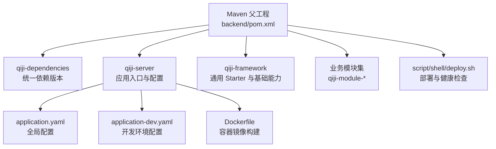
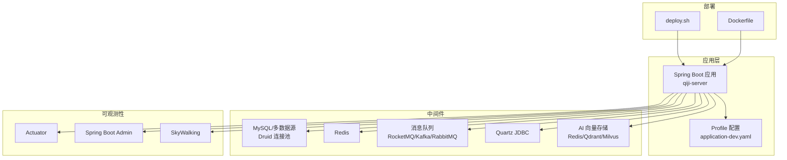
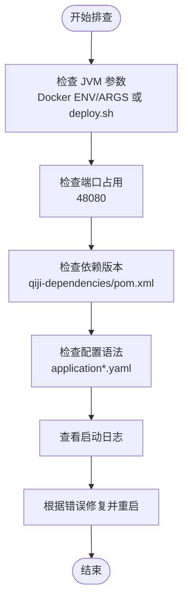
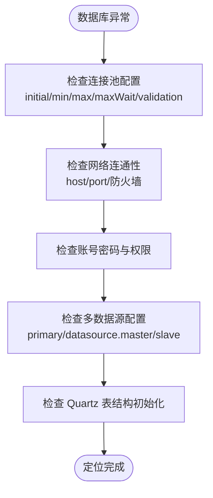
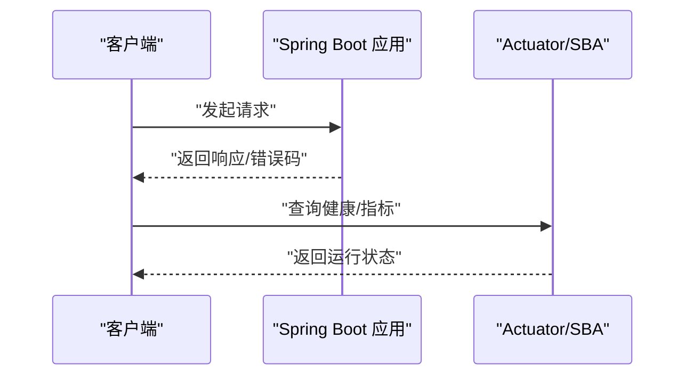
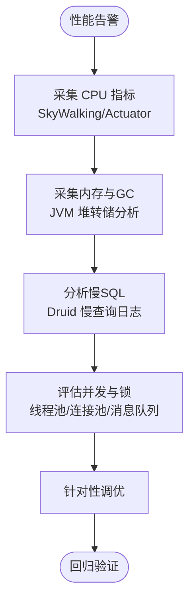
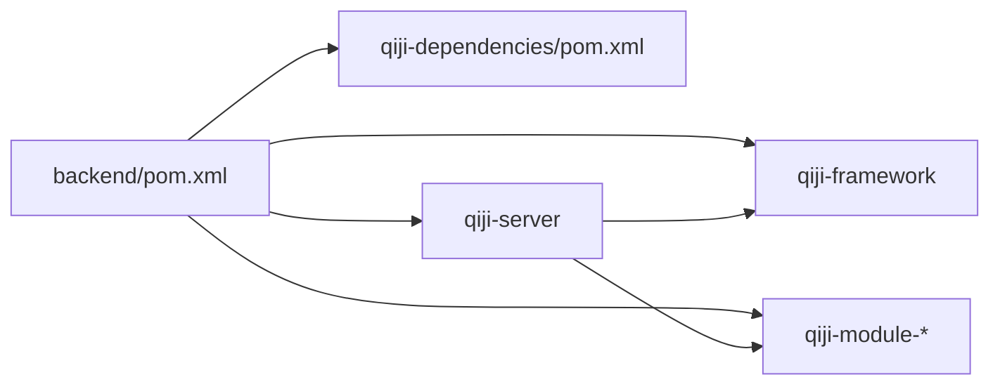

# 常见问题解决

<cite>
**本文引用的文件**   
- [pom.xml](file://backend/pom.xml)
- [qiji-dependencies/pom.xml](file://backend/qiji-dependencies/pom.xml)
- [application.yaml](file://backend/qiji-server/src/main/resources/application.yaml)
- [application-dev.yaml](file://backend/qiji-server/src/main/resources/application-dev.yaml)
- [Dockerfile](file://backend/qiji-server/Dockerfile)
- [deploy.sh](file://backend/script/shell/deploy.sh)
</cite>

## 目录
1. [简介](#简介)
2. [项目结构](#项目结构)
3. [核心组件](#核心组件)
4. [架构总览](#架构总览)
5. [详细组件分析](#详细组件分析)
6. [依赖分析](#依赖分析)
7. [性能考虑](#性能考虑)
8. [故障排查指南](#故障排查指南)
9. [结论](#结论)
10. [附录](#附录)

## 简介
本指南面向运维与开发人员，围绕 AgenticCPS 后端启动失败、数据库连接异常、API 接口异常以及性能问题，提供系统化的故障排查流程与解决步骤。内容涵盖 JVM 参数配置、端口冲突检测、依赖版本冲突、配置文件语法错误、数据库连接超时与连接池配置、网络连通性与权限验证、HTTP 状态码与请求参数校验、跨域问题、CPU/内存与慢查询分析、并发瓶颈识别与调优等。

## 项目结构
后端采用多模块 Maven 结构，核心模块包括 qiji-server（主服务）、qiji-framework（基础设施与 Starter）、qiji-module-*（业务模块）。配置集中在 qiji-server 的 resources 下，包含 application.yaml 与 profile 配置文件，Dockerfile 与 shell 脚本用于容器化与部署。

图表来源
- [pom.xml:1-176](file://backend/pom.xml#L1-L176)
- [qiji-dependencies/pom.xml:1-721](file://backend/qiji-dependencies/pom.xml#L1-L721)
- [application.yaml:1-362](file://backend/qiji-server/src/main/resources/application.yaml#L1-L362)
- [application-dev.yaml:1-213](file://backend/qiji-server/src/main/resources/application-dev.yaml#L1-L213)
- [Dockerfile:1-24](file://backend/qiji-server/Dockerfile#L1-L24)
- [deploy.sh:69-106](file://backend/script/shell/deploy.sh#L69-L106)

章节来源
- [pom.xml:1-176](file://backend/pom.xml#L1-L176)
- [qiji-dependencies/pom.xml:1-721](file://backend/qiji-dependencies/pom.xml#L1-L721)

## 核心组件
- 配置中心与 Profile
  - application.yaml：全局配置，包含 Jackson、Cache、MyBatis Plus、AI 向量存储、安全与加密、WebSocket、Actuator、日志等。
  - application-dev.yaml：开发环境数据库、Redis、消息队列、Quartz、Spring Boot Admin、日志等。
- 容器与部署
  - Dockerfile：基于 Eclipse Temurin 21 JRE，暴露 48080 端口，预设 JAVA_OPTS。
  - deploy.sh：启动/停止/健康检查脚本，支持 JAVA_OPS、JAVA_AGENT、PROFILES_ACTIVE 等参数注入。
- 依赖与版本
  - qiji-dependencies/pom.xml：集中管理 Spring Boot、MyBatis、Druid、RocketMQ、SkyWalking、JustAuth 等版本，确保模块一致性。

章节来源
- [application.yaml:1-362](file://backend/qiji-server/src/main/resources/application.yaml#L1-L362)
- [application-dev.yaml:1-213](file://backend/qiji-server/src/main/resources/application-dev.yaml#L1-L213)
- [Dockerfile:1-24](file://backend/qiji-server/Dockerfile#L1-L24)
- [deploy.sh:69-106](file://backend/script/shell/deploy.sh#L69-L106)
- [qiji-dependencies/pom.xml:1-721](file://backend/qiji-dependencies/pom.xml#L1-L721)

## 架构总览
后端服务通过 Spring Boot 启动，加载多数据源（Druid 连接池）、Redis 缓存、消息队列（RocketMQ/Kafka/RabbitMQ）、定时任务（Quartz JDBC）、AI 向量存储（Redis/Qdrant/Milvus）与接口文档（SpringDoc/Knife4j）。容器化部署默认使用 48080 端口，支持通过环境变量覆盖 JVM 参数。

图表来源
- [application.yaml:1-362](file://backend/qiji-server/src/main/resources/application.yaml#L1-L362)
- [application-dev.yaml:1-213](file://backend/qiji-server/src/main/resources/application-dev.yaml#L1-L213)
- [Dockerfile:1-24](file://backend/qiji-server/Dockerfile#L1-L24)
- [deploy.sh:69-106](file://backend/script/shell/deploy.sh#L69-L106)

## 详细组件分析

### 启动失败排查
- JVM 参数与容器资源
  - Dockerfile 预设 JAVA_OPTS（堆大小、时区、安全熵源），可通过 ARGS 覆盖。
  - deploy.sh 支持传入 JAVA_OPS、JAVA_AGENT、PROFILES_ACTIVE，启动时带 -server 参数。
- 端口冲突
  - Dockerfile 暴露 48080；如宿主机占用需变更映射或释放端口。
- 依赖版本冲突
  - 使用 qiji-dependencies/pom.xml 统一版本，确保 MyBatis、Flowable、JustAuth、SkyWalking 等版本一致。
- 配置文件语法错误
  - application.yaml 与 application-dev.yaml 为 YAML，注意缩进与冒号后的空格；建议使用 IDE 校验。

图表来源
- [Dockerfile:13-23](file://backend/qiji-server/Dockerfile#L13-L23)
- [deploy.sh:93-104](file://backend/script/shell/deploy.sh#L93-L104)
- [qiji-dependencies/pom.xml:16-82](file://backend/qiji-dependencies/pom.xml#L16-L82)
- [application.yaml:1-362](file://backend/qiji-server/src/main/resources/application.yaml#L1-L362)
- [application-dev.yaml:1-213](file://backend/qiji-server/src/main/resources/application-dev.yaml#L1-L213)

章节来源
- [Dockerfile:13-23](file://backend/qiji-server/Dockerfile#L13-L23)
- [deploy.sh:93-104](file://backend/script/shell/deploy.sh#L93-L104)
- [qiji-dependencies/pom.xml:16-82](file://backend/qiji-dependencies/pom.xml#L16-L82)
- [application.yaml:1-362](file://backend/qiji-server/src/main/resources/application.yaml#L1-L362)
- [application-dev.yaml:1-213](file://backend/qiji-server/src/main/resources/application-dev.yaml#L1-L213)

### 数据库连接问题排查
- 连接超时与连接池配置
  - application-dev.yaml 中 Druid 连接池初始/最小/最大连接数、获取超时、空闲检测周期、有效性检测等均有配置，可按环境调整。
- 网络连通性与权限
  - 确认 MySQL 地址、端口、账号、密码正确；若使用 SSL/时区/公钥检索参数，需与驱动版本匹配。
- 多数据源与读写分离
  - application-dev.yaml 定义了 master/slave 数据源，且从库开启懒加载；检查 primary 与数据源列表。
- Quartz JDBC 存储
  - application-dev.yaml 明确 Quartz 使用 JDBC 存储，初始化策略为手动；确认表结构已创建。

图表来源
- [application-dev.yaml:32-58](file://backend/qiji-server/src/main/resources/application-dev.yaml#L32-L58)
- [application-dev.yaml:70-97](file://backend/qiji-server/src/main/resources/application-dev.yaml#L70-L97)

章节来源
- [application-dev.yaml:32-58](file://backend/qiji-server/src/main/resources/application-dev.yaml#L32-L58)
- [application-dev.yaml:70-97](file://backend/qiji-server/src/main/resources/application-dev.yaml#L70-L97)

### API 接口异常处理
- HTTP 状态码分析
  - 使用 Actuator 暴露端点，结合 Spring Boot Admin 查看健康与指标。
- 请求参数验证
  - application.yaml 中开启 JSON 反序列化信任包配置，避免反序列化异常；同时建议在控制器层使用参数校验注解。
- 响应格式检查
  - Jackson 时间戳与纳秒配置影响响应格式，确保前端解析一致。
- 跨域问题
  - application.yaml 中未显式配置 CORS，如遇跨域需在 WebMvc/WebFlux 配置中补充 CORS 配置。

图表来源
- [application.yaml:124-145](file://backend/qiji-server/src/main/resources/application.yaml#L124-L145)
- [application.yaml:139-142](file://backend/qiji-server/src/main/resources/application.yaml#L139-L142)

章节来源
- [application.yaml:124-145](file://backend/qiji-server/src/main/resources/application.yaml#L124-L145)
- [application.yaml:139-142](file://backend/qiji-server/src/main/resources/application.yaml#L139-L142)

### 性能问题诊断
- CPU 使用率分析
  - 结合 SkyWalking 链路追踪与 Spring Boot Admin 指标，定位热点线程与慢调用。
- 内存泄漏检测
  - 使用 JVM 堆转储与 GC 日志分析；Dockerfile 已设置安全熵源，避免阻塞。
- 数据库慢查询优化
  - Druid 慢 SQL 记录已开启；结合 Quartz 线程池大小与 Misfire 阀值，减少锁竞争。
- 并发瓶颈识别
  - 调整线程池大小（Quartz ThreadPool）、连接池参数与消息队列并发消费者。

图表来源
- [application-dev.yaml:24-27](file://backend/qiji-server/src/main/resources/application-dev.yaml#L24-L27)
- [application-dev.yaml:91-94](file://backend/qiji-server/src/main/resources/application-dev.yaml#L91-L94)
- [application-dev.yaml:87-90](file://backend/qiji-server/src/main/resources/application-dev.yaml#L87-L90)

章节来源
- [application-dev.yaml:24-27](file://backend/qiji-server/src/main/resources/application-dev.yaml#L24-L27)
- [application-dev.yaml:91-94](file://backend/qiji-server/src/main/resources/application-dev.yaml#L91-L94)
- [application-dev.yaml:87-90](file://backend/qiji-server/src/main/resources/application-dev.yaml#L87-L90)

## 依赖分析
- 版本集中管理
  - qiji-dependencies/pom.xml 统一管理 Spring Boot、MyBatis、Flowable、JustAuth、SkyWalking 等版本，避免模块间版本漂移。
- 模块耦合
  - qiji-server 依赖 qiji-framework 与各业务模块；framework 层通过 Starter 抽象底层组件，降低耦合度。

图表来源
- [pom.xml:10-25](file://backend/pom.xml#L10-L25)
- [qiji-dependencies/pom.xml:84-100](file://backend/qiji-dependencies/pom.xml#L84-L100)

章节来源
- [pom.xml:10-25](file://backend/pom.xml#L10-L25)
- [qiji-dependencies/pom.xml:84-100](file://backend/qiji-dependencies/pom.xml#L84-L100)

## 性能考虑
- JVM 与容器
  - Dockerfile 预设 JAVA_OPTS，建议根据业务峰值调大堆大小；ARGS 可动态覆盖。
- 连接池与线程池
  - Druid 连接池参数按环境调优；Quartz 线程池大小与集群检查频率需平衡吞吐与一致性。
- 观测性
  - 开启 Actuator 与 Spring Boot Admin，配合 SkyWalking 进行链路追踪与指标分析。

章节来源
- [Dockerfile:13-23](file://backend/qiji-server/Dockerfile#L13-L23)
- [application-dev.yaml:33-46](file://backend/qiji-server/src/main/resources/application-dev.yaml#L33-L46)
- [application-dev.yaml:91-94](file://backend/qiji-server/src/main/resources/application-dev.yaml#L91-L94)

## 故障排查指南

### 启动失败
- 症状
  - 启动卡住、端口被占用、JVM 内存不足、配置文件语法错误。
- 原因分析
  - JVM 参数不当或 ARGS 未覆盖；48080 端口被占用；依赖版本不一致导致类冲突；YAML 缩进/键名错误。
- 解决步骤
  - 检查 Dockerfile 的 JAVA_OPTS 与 ARGS；修改 deploy.sh 的 JAVA_OPS/PROFILES_ACTIVE；变更容器端口映射；使用 qiji-dependencies/pom.xml 对齐版本；使用 IDE 校验 application*.yaml。
- 预防措施
  - 在 CI 中加入 YAML 语法检查与依赖版本一致性检查；规范启动参数注入流程。

章节来源
- [Dockerfile:13-23](file://backend/qiji-server/Dockerfile#L13-L23)
- [deploy.sh:93-104](file://backend/script/shell/deploy.sh#L93-L104)
- [qiji-dependencies/pom.xml:16-82](file://backend/qiji-dependencies/pom.xml#L16-L82)
- [application.yaml:1-362](file://backend/qiji-server/src/main/resources/application.yaml#L1-L362)
- [application-dev.yaml:1-213](file://backend/qiji-server/src/main/resources/application-dev.yaml#L1-L213)

### 数据库连接异常
- 症状
  - 连接超时、连接池耗尽、认证失败、权限不足。
- 原因分析
  - 连接池初始/最大连接数过小、获取超时过短；网络不可达或防火墙阻断；账号密码错误或权限不足；多数据源配置缺失。
- 解决步骤
  - 调整 application-dev.yaml 中 Druid 连接池参数；检查 MySQL 地址/端口/账号/密码；确认多数据源 primary 与 datasource.master/slave 配置；手动初始化 Quartz 表结构。
- 预防措施
  - 在测试环境模拟高并发场景压测连接池；定期巡检账号权限与网络连通性。

章节来源
- [application-dev.yaml:32-58](file://backend/qiji-server/src/main/resources/application-dev.yaml#L32-L58)
- [application-dev.yaml:70-97](file://backend/qiji-server/src/main/resources/application-dev.yaml#L70-L97)

### API 接口异常
- 症状
  - 4xx/5xx 错误、参数校验失败、响应格式异常、跨域失败。
- 原因分析
  - Actuator 暴露端点未包含所需指标；JSON 反序列化包未信任；未配置 CORS。
- 解决步骤
  - 在 application.yaml 中开启 Actuator 指标；确认 JSON 反序列化配置；在 WebMvc/WebFlux 配置 CORS。
- 预防措施
  - 在网关或全局拦截器中统一处理跨域与参数校验；完善接口文档与契约校验。

章节来源
- [application.yaml:124-145](file://backend/qiji-server/src/main/resources/application.yaml#L124-L145)
- [application.yaml:139-142](file://backend/qiji-server/src/main/resources/application.yaml#L139-L142)

### 性能问题
- 症状
  - CPU 飙升、内存增长、数据库慢查询增多、接口延迟上升。
- 原因分析
  - 线程池/连接池配置不当；慢 SQL 未优化；并发过高导致锁竞争。
- 解决步骤
  - 使用 SkyWalking 与 Actuator/SBA 定位热点；调整 Quartz 线程池与 Druid 连接池参数；优化慢查询与索引；限流与降级。
- 预防措施
  - 建立容量规划模型与压测基线；持续监控与告警联动。

章节来源
- [application-dev.yaml:24-27](file://backend/qiji-server/src/main/resources/application-dev.yaml#L24-L27)
- [application-dev.yaml:91-94](file://backend/qiji-server/src/main/resources/application-dev.yaml#L91-L94)
- [application-dev.yaml:87-90](file://backend/qiji-server/src/main/resources/application-dev.yaml#L87-L90)

## 结论
通过规范的启动参数与配置管理、严格的依赖版本治理、完善的数据库与连接池配置、可观测性的指标与链路追踪，以及系统化的性能压测与调优流程，可显著降低 AgenticCPS 的启动失败、数据库异常与接口问题发生率，并快速定位与恢复线上故障。

## 附录
- 快速检查清单
  - 启动：JVM 参数、端口、profile、容器 ARGS。
  - 数据库：连接池参数、网络连通、账号权限、多数据源配置、Quartz 表结构。
  - 接口：Actuator 暴露、JSON 反序列化、CORS 配置。
  - 性能：SkyWalking/Actuator 指标、线程池/连接池、慢查询与索引、限流降级。